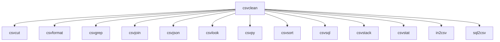

# `csvkit.utilities`

## Tree:
```
utilities/
├── csvclean.py
├── csvcut.py
├── csvformat.py
├── csvgrep.py
├── csvjoin.py
├── csvjson.py
├── csvlook.py
├── csvpy.py
├── csvsort.py
├── csvsql.py
├── csvstack.py
├── csvstat.py
├── in2csv.py
└── sql2csv.py
```

## Role:
Provides command-line utilities for manipulating and analyzing CSV data files

## Description:
This module contains a collection of command-line tools designed to perform various operations on CSV (Comma-Separated Values) files. Each utility provides a specific function for processing CSV data, such as cleaning, filtering, joining, sorting, and converting between different formats. These utilities are part of the csvkit toolkit, which offers powerful command-line tools for working with CSV files.

The utilities are grouped together because they all operate on CSV data and share common patterns for handling command-line arguments, reading CSV files, and producing CSV output. They form a cohesive set of tools that enable users to perform complex CSV manipulations from the terminal without requiring programming knowledge.

## Components:
*   **csvclean**: Cleans CSV files by detecting and fixing common formatting issues
*   **csvcut**: Selects specific columns from CSV files
*   **csvformat**: Converts CSV files to different formats or encodings
*   **csvgrep**: Filters CSV files based on regular expression matching
*   **csvjoin**: Joins multiple CSV files on common columns
*   **csvjson**: Converts CSV files to JSON format
*   **csvlook**: Displays CSV files in a formatted table view
*   **csvpy**: Executes Python expressions on CSV data
*   **csvsort**: Sorts CSV files by specified columns
*   **csvsql**: Converts CSV files to SQL statements or executes SQL queries on them
*   **csvstack**: Stacks multiple CSV files vertically
*   **csvstat**: Computes statistical summaries of CSV files
*   **in2csv**: Converts various tabular data formats to CSV
*   **sql2csv**: Converts SQL query results back to CSV format



## Public API:
*   **csvclean** - Command-line utility for cleaning CSV files by detecting and fixing formatting issues
*   **csvcut** - Command-line utility for selecting specific columns from CSV files
*   **csvformat** - Command-line utility for converting CSV files to different formats or encodings
*   **csvgrep** - Command-line utility for filtering CSV files based on regular expression matching
*   **csvjoin** - Command-line utility for joining multiple CSV files on common columns
*   **csvjson** - Command-line utility for converting CSV files to JSON format
*   **csvlook** - Command-line utility for displaying CSV files in a formatted table view
*   **csvpy** - Command-line utility for executing Python expressions on CSV data
*   **csvsort** - Command-line utility for sorting CSV files by specified columns
*   **csvsql** - Command-line utility for converting CSV files to SQL statements or executing SQL queries on them
*   **csvstack** - Command-line utility for stacking multiple CSV files vertically
*   **csvstat** - Command-line utility for computing statistical summaries of CSV files
*   **in2csv** - Command-line utility for converting various tabular data formats to CSV
*   **sql2csv** - Command-line utility for converting SQL query results back to CSV format

## Dependencies:
*   **Internal imports**: 
  *   `csvkit` core modules for CSV parsing and manipulation
  *   `csvkit.utilities` base classes for command-line interface handling
*   **External imports**:
  *   `argparse` - For command-line argument parsing
  *   `csv` - Standard library for CSV file handling
  *   `sys` - System-specific parameters and functions
  *   `os` - Operating system interfaces
  *   `json` - For JSON serialization in csvjson
  *   `re` - Regular expression support in csvgrep

## Constraints:
*   All utilities expect properly formatted CSV input or accept standard CSV options like delimiter, quote character, and encoding
*   Utilities must be run from command line with appropriate arguments
*   Thread safety is not guaranteed as these are command-line utilities meant to be run sequentially
*   Input validation is performed by individual utilities, but they assume valid command-line arguments
*   Memory usage scales with input file size, particularly for utilities that load entire datasets into memory

---

## Files

- [`csvclean.py`](utilities/csvclean.md)
- [`csvcut.py`](utilities/csvcut.md)
- [`csvformat.py`](utilities/csvformat.md)
- [`csvgrep.py`](utilities/csvgrep.md)
- [`csvjoin.py`](utilities/csvjoin.md)
- [`csvjson.py`](utilities/csvjson.md)
- [`csvlook.py`](utilities/csvlook.md)
- [`csvpy.py`](utilities/csvpy.md)
- [`csvsort.py`](utilities/csvsort.md)
- [`csvsql.py`](utilities/csvsql.md)
- [`csvstack.py`](utilities/csvstack.md)
- [`csvstat.py`](utilities/csvstat.md)
- [`in2csv.py`](utilities/in2csv.md)
- [`sql2csv.py`](utilities/sql2csv.md)

