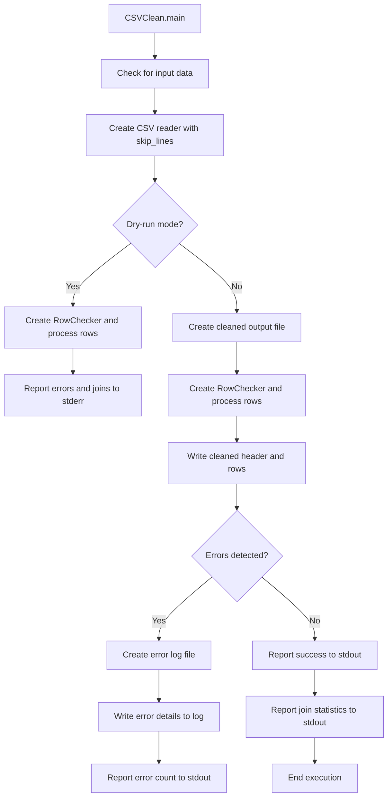

# `csvclean.py`

## `csvkit.utilities.csvclean.CSVClean` · *class*

## Summary:
CSVClean is a command-line utility that fixes common errors in CSV files by validating row consistency and attempting to repair rows with mismatched column counts.

## Description:
CSVClean is designed to process CSV files and identify/correct common formatting issues such as inconsistent row lengths that can occur when quoted fields contain embedded newlines. It leverages the RowChecker class to validate CSV data integrity and optionally repairs malformed rows by joining adjacent rows that appear to belong to the same record. The utility can operate in two modes: dry-run mode for error reporting without creating output files, or normal mode for actual cleaning and output generation.

This class serves as a distinct abstraction for CSV cleaning operations within the csvkit framework, providing a standardized interface for command-line CSV validation and repair while maintaining compatibility with the broader csvkit ecosystem.

## State:
- `description` (str): A brief description of the utility's purpose, set to 'Fix common errors in a CSV file.'
- `override_flags` (list): List of flags that this utility overrides from the base CSVKitUtility, specifically ['L', 'blanks', 'date-format', 'datetime-format']
- `args`: Parsed command-line arguments from the parent CSVKitUtility class
- `reader_kwargs`: Keyword arguments for CSV reader configuration inherited from parent class
- `writer_kwargs`: Keyword arguments for CSV writer configuration inherited from parent class
- `input_file`: Input file handle managed by parent class
- `output_file`: Output file handle managed by parent class

## Lifecycle:
- Creation: Instantiated by the csvkit command-line framework when invoked with 'csvclean' command
- Usage: Called through the standard CSVKitUtility.run() method which handles input/output setup and calls main()
- Main execution: Processes CSV data through RowChecker for validation and cleaning
- Destruction: Managed by Python's garbage collection; parent class handles file closing

## Method Map:


## Raises:
- `StopIteration`: May be raised internally by RowChecker when processing empty CSV files
- `IOError`: Raised by file operations when creating output files
- `UnicodeDecodeError`: Raised when input file encoding doesn't match specified encoding

## Example:
```python
# Dry-run mode (reports potential issues without modifying files)
csvclean -n input.csv

# Normal mode (creates cleaned output files)
csvclean input.csv

# With custom delimiter
csvclean -d ';' input.csv
```

### `csvkit.utilities.csvclean.CSVClean.add_arguments` · *method*

## Summary:
Adds a dry-run command-line argument to control whether output files are created during CSV cleaning operations.

## Description:
Configures the argument parser to accept a dry-run flag that determines whether the CSV cleaning utility will actually create output files or just report what would have been done. This method is called during the initialization of CSVClean instances to extend the common CSV processing arguments with utility-specific options.

## Args:
    self: The CSVClean instance whose argument parser will be modified.

## Returns:
    None: This method does not return a value.

## Raises:
    None: This method does not explicitly raise exceptions.

## State Changes:
    Attributes READ: None
    Attributes WRITTEN: Modifies self.argparser by adding a new command-line argument.

## Constraints:
    Preconditions: The method assumes that self.argparser has been initialized (typically by _init_common_parser() in the parent class).
    Postconditions: The argument parser will include the --dry-run/-n option that sets the dryrun attribute to True when specified.

## Side Effects:
    None: This method only modifies the internal argument parser configuration and does not perform I/O operations or external service calls.

### `csvkit.utilities.csvclean.CSVClean.main` · *method*

## Summary:
Validates and cleans CSV data by checking row consistency and repairing rows with inconsistent column counts, optionally writing results to output files.

## Description:
This method implements the core CSV cleaning functionality for the csvclean utility. It processes CSV data to detect and fix inconsistencies in row lengths that commonly occur when quoted fields contain embedded newlines. The method operates in two modes: dry-run mode for validation-only inspection, and normal mode for actual cleaning and file output.

The method is invoked by the parent CSVKitUtility.run() method after setting up input/output streams and parsing command-line arguments. It leverages the RowChecker class to perform validation and automatic row joining operations, then either reports findings without modifying files (dry-run) or writes cleaned data to a new file and error details to a separate error file.

## Args:
    self: The instance of the CSVClean class containing configuration and state

## Returns:
    None

## Raises:
    None explicitly raised by this method (though underlying CSV operations may raise exceptions)

## State Changes:
    Attributes READ:
    - self.args (accessed for dryrun flag and skip_lines configuration)
    - self.input_file (used to determine output filename base)
    - self.output_file (written to for status messages and error reports)
    - self.reader_kwargs (passed to agate.csv.reader for CSV parsing)
    - self.writer_kwargs (passed to agate.csv.writer for CSV writing)
    - self.additional_input_expected() (called for input validation)
    - self.skip_lines() (called to skip initial lines)
    
    Attributes WRITTEN:
    - self.output_file (written to for status messages and error reports)

## Constraints:
    Preconditions:
    - self.input_file must be properly initialized and readable
    - self.args must contain valid configuration (dryrun, skip_lines, etc.)
    - CSV data must be readable from self.input_file
    - self.output_file must be writable
    
    Postconditions:
    - If not in dryrun mode, cleaned CSV data is written to {base}_out.csv where base is derived from input filename
    - If errors are detected in normal mode, error details are written to {base}_err.csv
    - Status messages are written to self.output_file indicating success or error counts

## Side Effects:
    - Reads from stdin or input file stream
    - Writes to stdout or specified output file for status messages
    - Creates new files with "_out.csv" suffix for cleaned data
    - Creates new files with "_err.csv" suffix for error details when errors are found
    - May write to stderr when no input is provided (via additional_input_expected())

### `csvkit.utilities.csvclean.CSVClean._format_error_row` · *method*

## Summary:
Formats a validation error object into a list suitable for CSV output, including line number, error message, and the problematic row data.

## Description:
This method transforms a CSV validation error into a structured list format that can be written as a CSV row. It's used by the csvclean utility to generate error reports when CSV files contain validation issues such as inconsistent column counts.

The method is called during the error reporting phase of CSV cleaning, specifically when writing error details to a separate error output file. It's separated from inline logic to maintain clean separation of concerns and make error formatting reusable.

## Args:
    error (CSVTestException): A validation error object containing line_number, msg, and row attributes

## Returns:
    list: A list containing [line_number, msg] followed by all values from the error's row data

## Raises:
    None explicitly raised by this method

## State Changes:
    Attributes READ: error.line_number, error.msg, error.row
    Attributes WRITTEN: None

## Constraints:
    Preconditions: The error parameter must be a CSVTestException object with line_number, msg, and row attributes
    Postconditions: The returned list will contain exactly 2 + len(error.row) elements

## Side Effects:
    None

## `csvkit.utilities.csvclean.launch_new_instance` · *function*

## Summary:
Creates and runs a new instance of the CSVClean utility for processing CSV files.

## Description:
This function serves as the entry point for launching the csvclean utility. It instantiates a CSVClean object and executes its run method, which orchestrates the complete CSV cleaning workflow including input parsing, validation, and output generation. The function abstracts away the instantiation and execution details, providing a clean interface for the utility's invocation within the csvkit framework.

The function is typically called by the csvkit command-line framework when the 'csvclean' command is executed, allowing for consistent initialization and execution of CSV cleaning operations regardless of how the utility is invoked.

## Args:
    None

## Returns:
    None

## Raises:
    None explicitly raised by this function, though underlying operations may raise:
    - StopIteration: When processing empty CSV files
    - IOError: When creating output files
    - UnicodeDecodeError: When input file encoding doesn't match specified encoding

## Constraints:
    Preconditions:
    - The csvkit command-line framework must be properly initialized
    - Command-line arguments must be available for parsing
    - Input file paths (if specified) must be accessible
    - Output file paths (if specified) must be writable
    
    Postconditions:
    - A CSVClean instance is created and executed
    - Command-line arguments are parsed and processed
    - CSV cleaning operations are completed (either dry-run or actual cleaning)
    - Appropriate output is generated to stdout/stderr based on operation mode

## Side Effects:
    - Reads from input file(s) or stdin when processing CSV data
    - Writes to output file(s) when performing actual cleaning operations
    - Writes error messages and statistics to stderr
    - May create new output files when cleaning CSV data
    - May generate error log files when issues are detected

## Control Flow:
```mermaid
flowchart TD
    A[launch_new_instance called] --> B[Instantiate CSVClean()]
    B --> C[Call utility.run()]
    C --> D{Input file specified?}
    D -->|Yes| E[Open input file]
    E --> F[Parse command-line arguments]
    F --> G[Process CSV data through RowChecker]
    G --> H{Dry-run mode?}
    H -->|Yes| I[Report errors to stderr]
    I --> J[End execution]
    H -->|No| K[Create output file]
    K --> L[Clean and write rows to output]
    L --> M{Errors detected?}
    M -->|Yes| N[Create error log file]
    N --> O[Write error details to log]
    O --> P[Report error count to stdout]
    M -->|No| Q[Report success to stdout]
    Q --> R[Report join statistics to stdout]
    R --> S[End execution]
    D -->|No| T[Read from stdin]
    T --> U[Parse command-line arguments]
    U --> V[Process CSV data through RowChecker]
```

## Examples:
```python
# Typical usage in csvkit command-line framework
# This would be called when running: csvclean input.csv

# Dry-run mode (reports potential issues without modifying files)
# csvclean -n input.csv

# Normal mode (creates cleaned output files)
# csvclean input.csv

# With custom delimiter
# csvclean -d ';' input.csv
```

