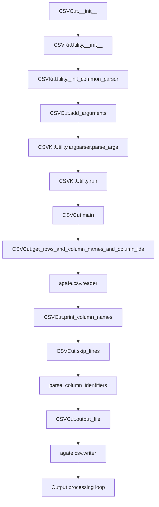

# `csvcut.py`

## `csvkit.utilities.csvcut.CSVCut` · *class*

## Summary
CSVCut is a command-line utility that filters and truncates CSV files by selecting specific columns, similar to the Unix "cut" command but for tabular data.

## Description
CSVCut provides functionality to extract specific columns from CSV files, support column selection by index, name, or range, and optionally delete empty rows from the output. It serves as a command-line interface for CSV manipulation, allowing users to filter data based on column criteria.

The class extends CSVKitUtility, inheriting common CLI argument parsing and file handling capabilities, while adding specific arguments for column selection and filtering behavior.

## State
- `description` (str): Descriptive text explaining the utility's purpose
- `override_flags` (list[str]): Command-line flags that are overridden from the base CSVKitUtility class
- `args`: Parsed command-line arguments from argparse
- `reader_kwargs`: Configuration dictionary for CSV reader construction
- `writer_kwargs`: Configuration dictionary for CSV writer construction
- `output_file`: File handle for writing output (defaults to stdout)

## Lifecycle
**Creation**: Instances are created automatically by the CSVKit framework when invoked from command line. The constructor initializes argument parsing and sets up the command-line interface.

**Usage**: The utility follows the standard CSVKit pattern:
1. Arguments are parsed via `add_arguments()` and `__init__()`
2. The `run()` method orchestrates execution by calling `main()`
3. `main()` processes input CSV data according to specified options

**Destruction**: Cleanup is handled automatically by the parent CSVKitUtility class when closing input files.

## Method Map


## Raises
- `RequiredHeaderError`: Raised when `--names` option is used with `--no-header-row`
- `ColumnIdentifierError`: Raised by `parse_column_identifiers` when column identifiers are invalid
- `UnicodeDecodeError`: Propagated from file operations when encoding issues occur
- `ValueError`: Raised by `skip_lines` when skip_lines argument is not an integer

## Example
```python
# Create a CSVCut instance with arguments
utility = CSVCut(['-c', '1,3', 'data.csv'])

# Run the utility (this would normally happen through command-line execution)
utility.run()

# Alternative usage: select columns by name
utility = CSVCut(['-c', 'name,email', 'data.csv'])
utility.run()

# Delete empty rows after cutting
utility = CSVCut(['-c', '1-3', '-x', 'data.csv'])
utility.run()
```

### `csvkit.utilities.csvcut.CSVCut.add_arguments` · *method*

## Summary:
Configures command-line arguments for the CSV cut utility, defining options for column selection, exclusion, and row filtering.

## Description:
This method sets up the command-line argument parser with options that control how CSV data is filtered and truncated. It defines arguments for displaying column metadata, selecting specific columns, excluding columns, and deleting empty rows. This method is part of the CSVKitUtility framework and is called during the initialization phase of the command-line interface.

## Args:
    self: The CSVCut instance whose argparser attribute is modified

## Returns:
    None: This method modifies the instance's argparser in-place and returns nothing

## Raises:
    None: This method does not raise exceptions directly

## State Changes:
    Attributes READ: None
    Attributes WRITTEN: self.argparser (modified in-place)

## Constraints:
    Preconditions: The instance must have an argparser attribute initialized (inherited from CSVKitUtility)
    Postconditions: The argparser contains the defined command-line arguments for column selection and filtering

## Side Effects:
    None: This method only modifies the internal argument parser configuration

### `csvkit.utilities.csvcut.CSVCut.main` · *method*

## Summary:
Processes CSV data by cutting specified columns and writing filtered output to stdout.

## Description:
This method implements the core logic for the csvcut utility, which extracts specific columns from CSV input. It handles various command-line options including printing column names only, deleting empty rows, and processing piped input from stdin.

## Args:
    None - This is a method of a class instance, so it operates on self

## Returns:
    None - This method performs I/O operations and does not return a value

## Raises:
    None explicitly raised - Exceptions would be handled by the parent class framework

## State Changes:
    Attributes READ: 
    - self.args (command-line arguments)
    - self.output_file (output stream)
    - self.reader_kwargs (CSV reader configuration)
    - self.writer_kwargs (CSV writer configuration)
    
    Attributes WRITTEN: 
    - None - This method doesn't modify instance attributes directly

## Constraints:
    Preconditions:
    - Command-line arguments must be parsed and available in self.args
    - Input file or stdin must be accessible
    - Output file must be writable
    
    Postconditions:
    - CSV output is written to self.output_file with selected columns
    - Column names are written as header row when appropriate
    - Empty rows are filtered if delete_empty flag is set

## Side Effects:
    - Writes to stdout or specified output file
    - Writes warning message to stderr when waiting for stdin input
    - Reads from stdin when no input file is provided
    - May read from input file when provided

## `csvkit.utilities.csvcut.launch_new_instance` · *function*

## Summary
Creates and executes a CSVCut command-line utility instance for filtering and truncating CSV files by selected columns.

## Description
This function serves as a factory method that instantiates a CSVCut utility class and executes its run method. It follows the standard csvkit pattern where command-line utilities are instantiated and executed through a dedicated launch function, separating the creation of the utility object from its execution.

The function is typically invoked as an entry point when the csvcut utility is executed from the command line, enabling users to filter CSV data by selecting specific columns.

## Args
None

## Returns
None

## Raises
None explicitly raised by this function, though the underlying CSVCut.run() method may raise various exceptions such as:
- ColumnIdentifierError: When column identifiers are invalid
- RequiredHeaderError: When --names option is used with --no-header-row
- UnicodeDecodeError: When encoding issues occur during file operations
- ValueError: When skip_lines argument is not an integer

## Constraints
Preconditions:
- The csvcut utility must be properly installed and available in the Python environment
- Command-line arguments must be properly formatted for CSVCut's argument parser
- Input CSV files must be accessible and readable (when not using stdin)

Postconditions:
- The CSVCut utility instance is fully initialized and executed
- Output is written to the configured output destination (stdout by default)

## Side Effects
- Opens and reads input CSV files (or stdin if no file specified)
- Writes processed CSV data to output (stdout by default)
- May read command-line arguments from sys.argv
- May raise system exceptions if file operations fail

## Control Flow
```mermaid
flowchart TD
    A[launch_new_instance] --> B[CSVCut()]
    B --> C[utility.run()]
    C --> D[CSVKitUtility.run()]
    D --> E[CSVCut.main()]
    E --> F[Process CSV data]
    F --> G[Write output]
    G --> H[End]
```

## Examples
```python
# Typical usage when invoked from command line:
# $ csvcut -c 1,3 data.csv

# Programmatic usage:
from csvkit.utilities.csvcut import launch_new_instance
launch_new_instance()

# This would process command-line arguments and execute CSVCut with those arguments
```

