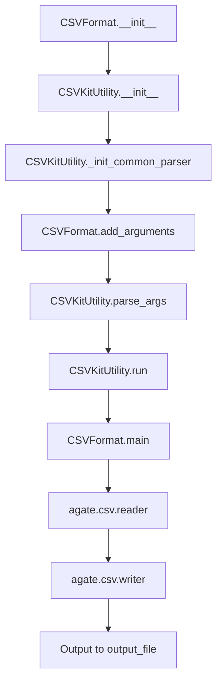

# `csvformat.py`

## `csvkit.utilities.csvformat.CSVFormat` · *class*

## Summary:
A CSV processing utility that converts input CSV files to custom output formats with configurable delimiters, quoting, and other formatting options.

## Description:
The CSVFormat class is a command-line utility that transforms CSV data from input files or standard input into various output formats. It allows users to customize the output delimiter, quoting style, quote characters, and other CSV formatting parameters. This utility is part of the csvkit suite of tools for working with CSV files from the command line.

The class extends CSVKitUtility, inheriting common CSV processing capabilities such as input file handling, argument parsing, and error management. It overrides specific command-line flags to prevent conflicts with input formatting options and provides extensive customization for output formatting.

## State:
- `args`: Command-line arguments parsed by argparse, containing all input/output formatting options
- `output_file`: Output file handle (defaults to stdout) where formatted CSV data is written
- `reader_kwargs`: Dictionary of keyword arguments for configuring the input CSV reader
- `writer_kwargs`: Dictionary of keyword arguments for configuring the output CSV writer
- `input_file`: Input file handle for reading the source CSV data

## Lifecycle:
Creation: Instantiated automatically by the csvkit command-line framework when invoked. Requires no explicit instantiation by user code.

Usage: The utility follows the standard CSVKitUtility lifecycle:
1. Arguments are parsed from command line
2. Input file is opened (or stdin is used if no file specified)
3. The `run()` method is called, which:
   - Handles input file setup and cleanup
   - Calls the `main()` method for core processing
4. The `main()` method performs the actual CSV conversion

Destruction: Automatically handled by the parent CSVKitUtility class through proper resource cleanup in the `run()` method.

## Method Map:


## Raises:
- `ValueError`: Raised by `skip_lines()` when `skip_lines` argument is not an integer
- `UnicodeDecodeError`: Propagated from `_open_input_file()` when file encoding issues occur
- `FileNotFoundError`: Raised when input file cannot be opened
- `StopIteration`: Raised by `next()` when reading empty CSV files

## Example:
```python
# Convert CSV with tab delimiter and no header row
# Command line usage:
# csvformat -T -E input.csv > output.tsv

# Programmatic usage would be handled by csvkit framework:
# CSVFormat(['-T', '-E', 'input.csv']).run()
```

### `csvkit.utilities.csvformat.CSVFormat.add_arguments` · *method*

## Summary:
Configures command-line arguments for CSV output formatting including delimiter, quoting, and line termination settings.

## Description:
Adds command-line arguments to the argument parser that control how CSV output is formatted. This method extends the common CSV processing arguments with formatting-specific options that allow users to customize the output CSV file's delimiter, quoting behavior, line terminators, and other formatting characteristics. These arguments are used to configure the CSV writer when processing input data.

## Args:
    self: The instance of the CSVFormat class that implements this method.

## Returns:
    None: This method does not return a value.

## Raises:
    None: This method does not explicitly raise exceptions.

## State Changes:
    Attributes READ: self.argparser - reads the argument parser instance to add arguments to it
    Attributes WRITTEN: None

## Constraints:
    Preconditions: The method must be called after `_init_common_parser()` has been executed to ensure the `argparser` attribute is initialized.
    Postconditions: After execution, the `argparser` attribute will contain the formatting-specific command-line arguments.

## Side Effects:
    None: This method does not cause any I/O operations or external service calls. It only modifies the internal argument parser configuration.

### `csvkit.utilities.csvformat.CSVFormat._extract_csv_writer_kwargs` · *method*

## Summary:
Extracts CSV writer configuration keyword arguments from command-line arguments for use with Python's csv module.

## Description:
Processes command-line arguments to construct a dictionary of keyword arguments suitable for configuring a CSV writer. This method centralizes the logic for translating CLI arguments into CSV writer parameters, making the configuration reusable across different parts of the CSV processing pipeline. It handles line numbers insertion, delimiter specification (tabs or custom delimiters), and various CSV quoting and formatting options.

This method is called during the initialization of CSVKitUtility subclasses to populate writer configuration parameters that are used when creating CSV writers for output operations.

## Args:
    None - This method operates on instance attributes and does not accept parameters.

## Returns:
    dict: A dictionary containing CSV writer configuration parameters including:
        - 'line_numbers' (bool): When True, inserts a column of line numbers at the front of output
        - 'delimiter' (str): The delimiter character to use (tab or custom delimiter)
        - 'quotechar' (str): Character used to quote strings
        - 'quoting' (int): Quoting style constant (0-3)
        - 'doublequote' (bool): Whether double quotes are doubled
        - 'escapechar' (str): Character used to escape delimiters
        - 'lineterminator' (str): Line terminator character

## Raises:
    None - This method does not explicitly raise exceptions.

## State Changes:
    Attributes READ: 
        - self.args.line_numbers
        - self.args.out_tabs
        - self.args.out_delimiter
        - self.args.out_quotechar
        - self.args.out_quoting
        - self.args.out_doublequote
        - self.args.out_escapechar
        - self.args.out_lineterminator

    Attributes WRITTEN: None - This method only reads from self.args and returns a dictionary.

## Constraints:
    Preconditions:
        - self.args must be initialized (typically by argparse in the constructor)
        - Command-line arguments for output formatting must be defined in the argument parser
        
    Postconditions:
        - Returns a dictionary with appropriate CSV writer parameters
        - The returned dictionary may be empty if no writer-specific arguments are specified

## Side Effects:
    None - This method performs no I/O operations or external service calls.

### `csvkit.utilities.csvformat.CSVFormat.main` · *method*

## Summary:
Processes and reformats CSV input according to specified formatting options, handling header rows and output configuration.

## Description:
This method serves as the core processing routine for the CSVFormat utility, reading input CSV data and writing it to the output file with configured formatting options. It manages special cases like missing header rows and header skipping, and handles interactive input detection. The method orchestrates the reading and writing of CSV data while applying command-line specified formatting parameters.

## Args:
    self: The CSVFormat instance containing command-line arguments and configuration

## Returns:
    None

## Raises:
    None explicitly raised

## State Changes:
    Attributes READ: 
        - self.args.no_header_row (controls default header creation)
        - self.args.skip_header (controls header row skipping)
        - self.reader_kwargs (reader configuration parameters)
        - self.writer_kwargs (writer configuration parameters)
        - self.output_file (output destination)
        - self.input_file (input source)
    Attributes WRITTEN: 
        - None (modifies only external state through file I/O)

## Constraints:
    Preconditions:
        - The CSVKitUtility instance must be properly initialized with command-line arguments
        - Input file must be accessible through self.input_file
        - Output file must be accessible through self.output_file
        - Command-line arguments must be parsed and available in self.args
    Postconditions:
        - All input CSV data is processed and written to the output file
        - Proper handling of header rows based on command-line flags (no_header_row, skip_header)
        - Standard input warning is displayed to stderr when appropriate
        - Input file pointer is positioned correctly after processing

## Side Effects:
    - Writes formatted CSV data to self.output_file
    - Writes informational message to stderr when stdin is used interactively (when additional_input_expected returns True)
    - Reads from stdin or input file through self.skip_lines() and agate.csv.reader()
    - May modify the input file pointer position through skip_lines() calls
    - Uses sys.stderr for warning messages

