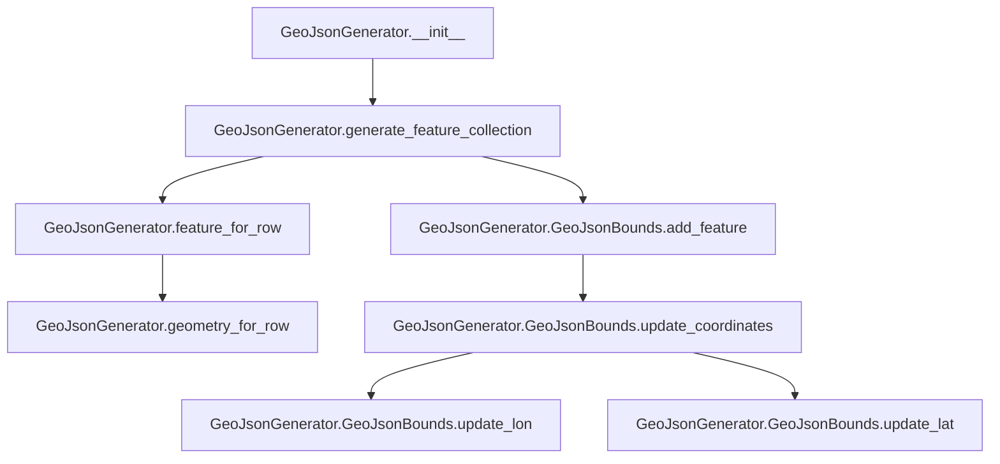

# `csvjson.py`

## `csvkit.utilities.csvjson.CSVJSON` · *class*

## Summary
A command-line utility for converting CSV files into JSON or GeoJSON formats with support for various formatting options and geographic data handling.

## Description
The CSVJSON class is a CSVKit utility that transforms CSV data into JSON or GeoJSON output formats. It provides extensive control over the output structure through command-line arguments, supporting features like key-based object output, GeoJSON generation with coordinates, streaming output, and various formatting options. The class inherits from CSVKitUtility and implements the core conversion logic for CSV to JSON/GeoJSON transformations.

This utility is designed to be used as a command-line tool, providing a flexible interface for converting tabular data into structured JSON formats suitable for web applications, APIs, or data interchange. It supports both standard JSON output (arrays or keyed objects) and GeoJSON output with geographic coordinates, making it suitable for mapping and geospatial applications.

## State
- `args`: Parsed command-line arguments from argparse containing all conversion options
- `json_kwargs`: Dictionary of JSON serialization parameters (indentation settings)  
- `output_file`: File-like object for writing output (defaults to stdout)
- `input_file`: File-like object for reading input CSV data
- `reader_kwargs`: Dictionary of CSV reader configuration parameters
- `writer_kwargs`: Dictionary of CSV writer configuration parameters

## Lifecycle
**Creation**: Instances are created automatically by the CSVKit framework when invoked as a command-line tool. The constructor initializes argument parsing and sets up the command-line interface through the parent CSVKitUtility class.

**Usage**: The main execution flow follows these steps:
1. Command-line arguments are parsed via `add_arguments()` method
2. Input validation occurs in `main()` method to ensure required arguments are properly specified
3. Based on arguments, either streaming or batch processing methods are selected:
   - For streaming: `streaming_output_ndjson()` or `streaming_output_ndgeojson()`
   - For batch: `output_json()` or `output_geojson()`
4. Data conversion and output occurs through the selected method

**Destruction**: Cleanup is handled automatically by the parent CSVKitUtility class, which manages file handles and ensures proper resource cleanup.

## Method Map
```mermaid
flowchart TD
    A[main()] --> B{can_stream?}
    B -- Yes --> C{is_geo?}
    C -- Yes --> D[streaming_output_ndgeojson()]
    C -- No --> E[streaming_output_ndjson()]
    B -- No --> F{is_geo?}
    F -- Yes --> G[output_geojson()]
    F -- No --> H[output_json()]
    
    D --> I[dump_json()]
    E --> I
    G --> I
    H --> I
    
    I --> J[json.dump()]
```

## Raises
- `argparse.ArgumentTypeError`: Raised when command-line arguments fail validation
- `SystemExit`: Raised by `argparser.error()` when validation fails
- `ValueError`: Raised during type conversion in GeoJSON coordinate processing
- `json.JSONEncodeError`: Raised during JSON serialization failures
- `IOError`: Raised during file I/O operations
- `IndexError`: Raised when CSV rows have fewer columns than expected in streaming mode

## Example
```bash
# Convert CSV to standard JSON
csvjson data.csv > output.json

# Convert CSV to GeoJSON with coordinates
csvjson --lat latitude --lon longitude data.csv > geojson_output.json

# Convert CSV to JSON with indentation
csvjson -i 2 data.csv > pretty_output.json

# Convert CSV to key-based JSON
csvjson -k id data.csv > keyed_output.json

# Stream JSON output
csvjson --stream data.csv > stream_output.json

# Convert CSV to GeoJSON with CRS and bounding box
csvjson --lat latitude --lon longitude --crs "EPSG:4326" --no-bbox data.csv > geojson_with_crs.json
```

### `csvkit.utilities.csvjson.CSVJSON.add_arguments` · *method*

## Summary:
Configures the command-line argument parser with options for JSON output formatting and CSV parsing behavior.

## Description:
Adds command-line arguments to the instance's argument parser for controlling JSON output format, GeoJSON generation, and CSV parsing behavior. This method is part of the CSVJSON utility class and is called during initialization to define available command-line options.

## Args:
    self: The CSVJSON utility instance containing the argument parser to configure.

## Returns:
    None: This method modifies the argument parser in-place and does not return a value.

## Raises:
    None: This method does not explicitly raise exceptions.

## State Changes:
    Attributes READ: None
    Attributes WRITTEN: self.argparser (modified by adding arguments)

## Constraints:
    Preconditions: The instance must have an `argparser` attribute initialized (typically done by the parent class).
    Postconditions: The argument parser will contain all defined command-line options for JSON conversion.

## Side Effects:
    None: This method only modifies the argument parser object and has no external I/O or side effects.

### `csvkit.utilities.csvjson.CSVJSON.main` · *method*

## Summary:
Main execution method for CSV to JSON/GeoJSON conversion utility that validates arguments, configures JSON formatting, and routes processing to appropriate output methods.

## Description:
This method serves as the central control point for the CSV to JSON conversion utility. It performs comprehensive argument validation to ensure proper usage of geographic and streaming options, configures JSON output formatting parameters, and delegates to specialized output methods based on whether streaming is enabled and whether the data contains geographic coordinates.

The method implements strict validation rules for geographic data options (--lat, --lon, --crs, --type, --geometry) to prevent invalid combinations and ensure data integrity. It also determines whether to use streaming or batch processing modes based on command-line flags and available input.

## Args:
    self: The CSVJSON utility instance containing command-line arguments and configuration.

## Returns:
    None: This method does not return a value but performs I/O operations to output JSON or GeoJSON data.

## Raises:
    SystemExit: Raised by self.argparser.error() when validation fails, causing program termination with error message.

## State Changes:
    Attributes READ: self.args.lat, self.args.lon, self.args.crs, self.args.type, self.args.geometry, self.args.key, 
                     self.args.streamOutput, self.args.indent, self.args.input_path, self.args.no_inference, 
                     self.args.sniff_limit, self.args.skip_lines
    Attributes WRITTEN: self.json_kwargs (sets 'indent' key)

## Constraints:
    Preconditions: The CSVJSON instance must have been initialized with command-line arguments parsed into self.args.
    Postconditions: Either streaming or batch processing methods are called based on the configuration, producing JSON or GeoJSON output to stdout.

## Side Effects:
    I/O: Writes JSON or GeoJSON output to stdout or stderr (for warning messages)
    External service calls: Uses sys.stderr for writing warning messages when streaming with no input
    Mutations: Sets self.json_kwargs attribute with indentation configuration

### `csvkit.utilities.csvjson.CSVJSON.dump_json` · *method*

## Summary:
Writes JSON-formatted data to the output file with optional newline termination.

## Description:
Serializes Python data structures to JSON format and writes them to the configured output file. This method handles the final serialization step in the CSV to JSON conversion process, ensuring proper JSON formatting with support for special data types like datetime and decimal objects.

## Args:
    data (Any): Python data structure (dict, list, etc.) to be serialized to JSON format.
    newline (bool): If True, appends a newline character after the JSON output. Defaults to False.

## Returns:
    None: This method does not return any value.

## Raises:
    TypeError: When the data contains non-serializable objects that cannot be converted by the JSON encoder.

## State Changes:
    Attributes READ: self.output_file, self.json_kwargs
    Attributes WRITTEN: None

## Constraints:
    Precondition: The output_file attribute must be a file-like object that supports write operations.
    Precondition: The data parameter must be serializable to JSON format.
    Postcondition: The data is written to the output file in JSON format with appropriate formatting.

## Side Effects:
    I/O: Writes serialized JSON data to the output file.
    Text encoding: Uses UTF-8 encoding for the output.

### `csvkit.utilities.csvjson.CSVJSON.can_stream` · *method*

## Summary:
Determines whether streaming output can be enabled for CSV to JSON conversion based on command-line argument settings.

## Description:
This method evaluates the current command-line arguments to decide if streaming output mode is appropriate for the CSV to JSON conversion process. Streaming allows the utility to process and output data incrementally rather than loading the entire dataset into memory first.

The method checks four specific conditions that must all be true for streaming to be safely enabled:
1. streamOutput is enabled (user requested streaming)
2. no_inference is enabled (type inference is disabled for performance)
3. sniff_limit is set to 0 (no CSV sniffing occurs)
4. skip_lines is not set (no initial lines are skipped)

This validation ensures that the streaming approach won't conflict with other processing modes that require full dataset analysis or preprocessing.

## Args:
    self: The CSVJSON utility instance containing command-line arguments.

## Returns:
    bool: True if all conditions for streaming are met, False otherwise.

## Raises:
    None: This method does not raise exceptions.

## State Changes:
    Attributes READ: self.args.streamOutput, self.args.no_inference, self.args.sniff_limit, self.args.skip_lines
    Attributes WRITTEN: None

## Constraints:
    Preconditions: The CSVJSON instance must have been initialized with command-line arguments parsed into self.args.
    Postconditions: The method returns a boolean value indicating whether streaming output can be safely enabled.

## Side Effects:
    None: This method performs only local boolean evaluations and does not cause any I/O operations or external service calls.

### `csvkit.utilities.csvjson.CSVJSON.is_geo` · *method*

## Summary:
Determines whether the CSV data should be treated as GeoJSON by checking if both latitude and longitude arguments are provided.

## Description:
This method evaluates whether the command-line arguments specify both latitude (--lat) and longitude (--lon) columns, indicating that the CSV data should be converted to GeoJSON format instead of regular JSON. It is called during the conversion process to route the output appropriately.

## Args:
    None

## Returns:
    bool: True if both self.args.lat and self.args.lon are truthy values, False otherwise.

## Raises:
    None

## State Changes:
    Attributes READ: self.args.lat, self.args.lon
    Attributes WRITTEN: None

## Constraints:
    Preconditions: The CSVJSON instance must have been initialized with command-line arguments that include --lat and --lon options.
    Postconditions: The method returns a boolean value indicating the geo status without modifying any object state.

## Side Effects:
    None

### `csvkit.utilities.csvjson.CSVJSON.read_csv_to_table` · *method*

## Summary:
Converts CSV input data into an agate Table object with automatic column type inference and configurable parsing options.

## Description:
This method serves as the core CSV parsing mechanism for the CSVJSON utility, reading CSV data from the input file and converting it into an agate Table structure. It leverages the agate library's robust CSV reading capabilities with support for various CSV parsing options including delimiter specification, header row handling, line skipping, and automatic column type inference.

The method is designed to be a dedicated parsing layer that encapsulates all CSV reading logic, making it easier to test and maintain. It integrates with the broader CSVKit framework by utilizing command-line arguments and reader configuration from the parent CSVKitUtility class.

This method is typically called during the execution phase of CSVJSON utility operations, specifically when converting CSV input to JSON output format. It provides a clean abstraction over the underlying CSV reading process while maintaining compatibility with all CSVKit command-line options.

## Args:
    None

## Returns:
    agate.Table: An agate Table object containing the parsed CSV data with automatically inferred column types and appropriate data structures.

## Raises:
    Exception: May raise exceptions from agate.Table.from_csv() when encountering malformed CSV data or file access issues.

## State Changes:
    Attributes READ: self.args.sniff_limit, self.args.skip_lines, self.input_file, self.get_column_types(), self.reader_kwargs
    Attributes WRITTEN: None

## Constraints:
    Preconditions: The CSVKitUtility instance must be properly initialized with parsed arguments, and self.input_file must be a valid file-like object opened for reading.
    Postconditions: Returns a fully constructed agate Table with all CSV data parsed and column types inferred.

## Side Effects:
    I/O: Reads from self.input_file (the CSV input source)
    External service calls: Calls agate.Table.from_csv() which may perform file I/O operations
    Mutations: None

### `csvkit.utilities.csvjson.CSVJSON.output_json` · *method*

## Summary:
Converts CSV data to JSON format and writes the result to the output file.

## Description:
Reads CSV data from the input file, converts it to an agate table, and serializes that table to JSON format. This method serves as the core output mechanism for the CSVJSON utility when producing standard JSON output (as opposed to GeoJSON). It utilizes the agate library's table-to-JSON conversion capabilities with configurable formatting options.

The method is called during the main processing phase of the CSVJSON utility when standard JSON output is requested (not GeoJSON). It reads from self.input_file, processes the CSV data through agate's Table.from_csv method, and writes the resulting JSON to self.output_file.

## Args:
    None directly - uses command-line arguments accessed via self.args

## Returns:
    None - writes directly to self.output_file

## Raises:
    None explicitly documented - may raise exceptions from underlying agate operations or file I/O

## State Changes:
    Attributes READ: 
    - self.args.key: JSON key parameter for table serialization (controls output format as object vs array)
    - self.args.streamOutput: Controls newline behavior in output (streaming vs array format)
    - self.args.indent: JSON indentation level for pretty-printing
    - self.output_file: Target file handle for JSON output
    - self.input_file: Source file handle for CSV input
    
    Attributes WRITTEN: None

## Constraints:
    Preconditions:
    - self.input_file must be readable and contain valid CSV data
    - self.output_file must be writable
    - Command-line arguments must be properly parsed and available in self.args
    - The CSV data must be compatible with agate's Table.from_csv method
    
    Postconditions:
    - JSON output is written to self.output_file in the format specified by command-line arguments
    - The method does not modify the instance's state beyond reading input and writing output

## Side Effects:
    - Reads from self.input_file (CSV source)
    - Writes to self.output_file (JSON destination)
    - Performs file I/O operations (reading CSV, writing JSON)
    - Relies on agate.Table.to_json() for the actual JSON serialization
    - May perform CSV parsing and type inference through agate.Table.from_csv()

### `csvkit.utilities.csvjson.CSVJSON.output_geojson` · *method*

## Summary:
Converts CSV geographic data to GeoJSON format by generating either individual GeoJSON features or a complete GeoJSON FeatureCollection.

## Description:
Processes CSV data containing geographic coordinates (latitude/longitude) into GeoJSON format. This method serves as the core conversion mechanism for geographic data when --lat and --lon command-line arguments are specified. It creates a GeoJsonGenerator instance to transform tabular data into proper GeoJSON structures, supporting both streaming output of individual features and batch output of a complete FeatureCollection.

## Args:
    None: This is a method of the CSVJSON class and does not accept additional parameters beyond the implicit self.

## Returns:
    None: This method does not return any value.

## Raises:
    None explicitly raised by this method, but may propagate exceptions from underlying operations such as:
    - CSV reading errors when accessing input file
    - JSON serialization errors when writing output
    - ValueErrors when converting coordinate values to numeric types
    - Argument parsing errors if required --lat/--lon arguments are missing

## State Changes:
    Attributes READ: self.args, self.input_file, self.output_file, self.reader_kwargs, self.json_kwargs
    Attributes WRITTEN: None

## Constraints:
    Preconditions:
        - The CSV input must contain valid geographic data with latitude and longitude columns specified via --lat and --lon arguments
        - The self.args object must contain properly parsed command-line arguments including lat and lon specifications
        - The output_file attribute must be a writable file-like object
        - The input_file must be properly opened and accessible
        - When --streamOutput is specified, the method uses streaming approach; otherwise it uses batch approach
        
    Postconditions:
        - GeoJSON output is written to the configured output file
        - When --streamOutput is specified, each CSV row generates a separate GeoJSON feature object
        - When --streamOutput is not specified, a complete GeoJSON FeatureCollection is generated and written
        - The GeoJSON output follows proper GeoJSON specification with correct structure and properties

## Side Effects:
    I/O: Reads from the input CSV file and writes GeoJSON-formatted data to the output file
    Processing: Converts CSV rows into GeoJSON Feature or FeatureCollection structures
    Memory: Creates temporary table representation of CSV data in memory during processing

### `csvkit.utilities.csvjson.CSVJSON.streaming_output_ndjson` · *method*

## Summary:
Processes CSV input and outputs each data row as a separate JSON object in Newline Delimited JSON format.

## Description:
This method reads CSV data from the input file, treating the first row as column headers, and converts subsequent rows into JSON objects where keys are column names and values are the corresponding cell values. Each JSON object is written to the output file as a separate line, creating a Newline Delimited JSON (NDJSON) stream. This approach enables efficient processing of large CSV files without loading the entire dataset into memory. The method handles rows with fewer columns than the header row by setting missing values to None.

## Args:
    None: This method takes no arguments beyond the implicit self reference.

## Returns:
    None: This method does not return any value.

## Raises:
    IndexError: When a CSV row has fewer columns than the header row, causing an index out of bounds error during column mapping. This is gracefully handled by setting missing column values to None.

## State Changes:
    Attributes READ: self.input_file, self.reader_kwargs
    Attributes WRITTEN: None

## Constraints:
    Precondition: The input_file attribute must be a readable file-like object containing valid CSV data with at least one header row.
    Precondition: The reader_kwargs attribute must contain valid keyword arguments for agate.csv.reader.
    Postcondition: Each CSV data row (excluding the header) is written as a separate JSON object to the output file in NDJSON format.

## Side Effects:
    I/O: Reads from the input file and writes JSON-formatted data to the output file.
    Memory: Processes one CSV row at a time, making it memory-efficient for large datasets.

### `csvkit.utilities.csvjson.CSVJSON.streaming_output_ndgeojson` · *method*

## Summary:
Processes CSV data and outputs newline-delimited GeoJSON features by converting each row into a GeoJSON Feature object.

## Description:
This method implements streaming output of newline-delimited GeoJSON format. It reads CSV data row-by-row, extracts column names from the first row, and converts each subsequent row into a GeoJSON Feature object using the GeoJsonGenerator. Each feature is written as a separate JSON object to the output file, separated by newlines. This approach is memory-efficient for large datasets as it doesn't load the entire dataset into memory at once.

The method is called during the CSV to GeoJSON conversion process when the `--stream` flag is specified along with geographic coordinate columns (`--lat` and `--lon`). It's specifically designed for GeoJSON output, unlike the regular JSON streaming output which would produce plain JSON objects. This method is part of the CSVJSON utility class that provides various CSV-to-JSON conversion capabilities.

## Args:
    None: This method takes no parameters beyond the implicit `self`.

## Returns:
    None: This method does not return any value.

## Raises:
    Exception: May raise exceptions from underlying file I/O operations (e.g., IOError, OSError) when reading from input_file or writing to output_file.
    Exception: May raise exceptions from JSON serialization operations when calling dump_json() method.
    Exception: May raise exceptions from agate.csv.reader when processing malformed CSV data.

## State Changes:
    Attributes READ: self.input_file, self.reader_kwargs, self.args, self.output_file, self.json_kwargs
    Attributes WRITTEN: None

## Constraints:
    Precondition: The CSV input file must contain valid data with geographic coordinates in the specified latitude and longitude columns.
    Precondition: The `--lat` and `--lon` command-line arguments must be specified to enable GeoJSON output.
    Precondition: The `--stream` command-line argument must be specified to enable streaming output.
    Precondition: The input file must be readable and the output file must be writable.
    Postcondition: Each row from the CSV input is converted to a GeoJSON Feature and written to the output file as a newline-delimited JSON object.

## Side Effects:
    I/O: Reads from the input file using agate.csv.reader and writes newline-delimited JSON to the output file.
    Text encoding: Uses UTF-8 encoding for file operations.
    JSON serialization: Converts Python data structures to JSON format using the standard JSON library.

## `csvkit.utilities.csvjson.GeoJsonGenerator` · *class*

## Summary:
A class that converts CSV data into GeoJSON FeatureCollection format, supporting various geometric representations and metadata options.

## Description:
The GeoJsonGenerator class is responsible for transforming tabular CSV data into GeoJSON format, specifically creating FeatureCollection objects. It handles various geometric representations including point coordinates derived from latitude/longitude columns, or pre-defined geometry data in a separate geometry column. The class supports additional metadata features such as bounding box calculation, coordinate reference systems, and feature identification.

This class is typically instantiated by command-line utilities within the csvkit package that process CSV files and output GeoJSON. It provides the core logic for converting geographic data from tabular format to the standardized GeoJSON format used in geospatial applications.

## State:
- `args`: Object containing command-line arguments with properties:
  - `lat`: Column identifier for latitude values
  - `lon`: Column identifier for longitude values  
  - `type`: Column identifier for feature type (optional)
  - `geometry`: Column identifier for pre-defined geometry JSON (optional)
  - `key`: Column identifier for feature ID (optional)
  - `no_bbox`: Boolean flag to disable bounding box calculation
  - `crs`: Coordinate reference system name (optional)
  - `zero_based`: Boolean flag for zero-based column indexing
- `column_names`: List of column names from the CSV data
- `lat_column`: Zero-based index of the latitude column, or None if not specified
- `lon_column`: Zero-based index of the longitude column, or None if not specified
- `type_column`: Zero-based index of the feature type column, or None if not specified
- `geometry_column`: Zero-based index of the geometry column, or None if not specified
- `id_column`: Zero-based index of the ID column, or None if not specified

## Lifecycle:
- Creation: Instantiate with `args` object and `column_names` list
- Usage: Call `generate_feature_collection(table)` with an agate Table object
- Destruction: No explicit cleanup required; uses standard Python garbage collection

## Method Map:


## Raises:
- `ColumnIdentifierError`: Raised by `match_column_identifier` when column identifiers are invalid (out of bounds, non-existent, etc.)

## Example:
```python
# Create generator with command-line arguments
args = type('Args', (), {
    'lat': 'latitude',
    'lon': 'longitude', 
    'type': None,
    'geometry': None,
    'key': 'id',
    'no_bbox': False,
    'crs': 'EPSG:4326',
    'zero_based': False
})()

# Initialize with column names
column_names = ['id', 'name', 'latitude', 'longitude', 'description']
generator = GeoJsonGenerator(args, column_names)

# Process table data (assuming table is an agate Table)
# feature_collection = generator.generate_feature_collection(table)
```

### `csvkit.utilities.csvjson.GeoJsonGenerator.__init__` · *method*

## Summary:
Initializes a GeoJsonGenerator instance by mapping column identifiers to zero-based indices and storing command-line arguments.

## Description:
Configures the GeoJsonGenerator object by resolving column identifiers (names or positions) from command-line arguments into zero-based column indices. This method sets up all the necessary column references for processing geographic data in CSV format, including latitude, longitude, feature type, geometry, and ID columns. It leverages the match_column_identifier utility function to handle flexible column specification formats.

The initialization occurs during object construction and prepares the generator for subsequent feature collection generation operations. This method is separated from the main constructor logic to ensure proper setup of column mappings before any data processing begins.

## Args:
    args: Command-line arguments object containing properties:
        - lat (str or int): Column identifier for latitude values
        - lon (str or int): Column identifier for longitude values
        - type (str or int, optional): Column identifier for feature type values
        - geometry (str or int, optional): Column identifier for pre-defined geometry JSON
        - key (str or int, optional): Column identifier for feature ID values
        - zero_based (bool): Flag indicating if column positions are zero-based
    column_names (list[str]): List of column names from the CSV data source

## Returns:
    None: This method initializes instance attributes and does not return a value

## Raises:
    ColumnIdentifierError: When any column identifier in args is invalid (out of bounds, non-existent, etc.) as raised by match_column_identifier

## State Changes:
    Attributes READ: 
        - self.args.lat
        - self.args.lon
        - self.args.type
        - self.args.geometry
        - self.args.key
        - self.args.zero_based
        - self.column_names
    
    Attributes WRITTEN:
        - self.args
        - self.column_names
        - self.lat_column
        - self.lon_column
        - self.type_column
        - self.geometry_column
        - self.id_column

## Constraints:
    Preconditions:
        - args must be a valid object with the expected attributes
        - column_names must be a non-empty list of strings
        - All column identifiers in args must be valid (exist in column_names or be valid numeric positions)
    
    Postconditions:
        - All column attributes (lat_column, lon_column, etc.) are set to either valid zero-based indices or None
        - self.args and self.column_names are properly assigned

## Side Effects:
    None: This method performs no I/O operations or external service calls. It only processes input arguments and assigns to instance attributes.

### `csvkit.utilities.csvjson.GeoJsonGenerator.generate_feature_collection` · *method*

## Summary:
Generates a GeoJSON FeatureCollection from a table of geographic data by converting each row into a GeoJSON Feature.

## Description:
Creates a complete GeoJSON FeatureCollection structure from tabular data, processing each row through the feature_for_row method to generate individual features. This method handles optional bounding box calculation and CRS (Coordinate Reference System) specification based on command-line arguments.

## Args:
    table (agate.Table): A table object containing geographic data rows to convert into GeoJSON features.

## Returns:
    OrderedDict: A GeoJSON FeatureCollection object with the following structure:
        - 'type': String 'FeatureCollection'
        - 'features': List of GeoJSON Feature objects generated from each table row
        - 'bbox': Optional list of bounding box coordinates [min_lon, min_lat, max_lon, max_lat] if --no-bbox argument is not specified
        - 'crs': Optional Coordinate Reference System definition if --crs argument is specified

## Raises:
    None explicitly raised by this method.

## State Changes:
    Attributes READ: self.args, self.GeoJsonBounds
    Attributes WRITTEN: None

## Constraints:
    Preconditions:
        - The table parameter must be a valid agate.Table instance
        - The GeoJsonGenerator instance must be properly initialized with required arguments
        - Each row in the table must be compatible with the feature_for_row method
        
    Postconditions:
        - Returns a valid GeoJSON FeatureCollection structure with OrderedDict keys in specific order
        - All features in the collection are properly formatted GeoJSON Features
        - Bounding box and CRS information is included only when requested via command-line arguments
        - The returned OrderedDict maintains the exact key ordering: type, bbox (if present), features, crs (if present)

## Side Effects:
    None directly, but may indirectly cause I/O or parsing exceptions through calls to feature_for_row and GeoJsonBounds methods.

### `csvkit.utilities.csvjson.GeoJsonGenerator.feature_for_row` · *method*

## Summary:
Creates a GeoJSON Feature object from a CSV row by mapping columns to properties and geometry.

## Description:
Transforms a single CSV row into a GeoJSON Feature structure, handling special column mappings for geographic data. This method processes each cell in the row, excluding designated special columns, and constructs appropriate properties while delegating geometry creation to the geometry_for_row method.

## Args:
    row (list): A list representing a single row from a CSV file, where each element corresponds to a column value.

## Returns:
    OrderedDict: A GeoJSON Feature object containing:
        - 'type': Always 'Feature'
        - 'properties': An OrderedDict mapping column names to their values (excluding special columns)
        - 'geometry': A GeoJSON geometry object created by geometry_for_row method
        - 'id': Optional property set when an ID column is specified

## Raises:
    None explicitly raised, but may propagate exceptions from geometry_for_row method.

## State Changes:
    Attributes READ: self.column_names, self.type_column, self.lat_column, self.lon_column, self.geometry_column, self.id_column
    Attributes WRITTEN: None

## Constraints:
    Preconditions:
        - The row parameter must be iterable with consistent length matching column structure
        - Column identifiers (lat_column, lon_column, etc.) must be properly initialized in the class
        - The geometry_for_row method must be callable and handle the row appropriately
    
    Postconditions:
        - Returns a valid GeoJSON Feature structure with proper type and properties
        - Geometry field is always present in returned feature

## Side Effects:
    None directly, but may cause I/O or parsing exceptions from the geometry_for_row method when processing geometry column data.

### `csvkit.utilities.csvjson.GeoJsonGenerator.geometry_for_row` · *method*

## Summary:
Creates a GeoJSON geometry object from a CSV row by either parsing a geometry column or constructing a Point geometry from latitude and longitude columns.

## Description:
Processes a single CSV row to generate a GeoJSON geometry object. This method supports two input formats: 1) a geometry column containing valid GeoJSON JSON data, or 2) separate latitude and longitude columns that are converted into a Point geometry. The method is called by `feature_for_row` during the construction of complete GeoJSON Features.

## Args:
    row (list): A list representing a single row from a CSV file, where each element corresponds to a column value.

## Returns:
    OrderedDict or None: A GeoJSON geometry object with the following structure:
        - For geometry column input: parsed JSON result from `json.loads()` as an OrderedDict
        - For lat/lon columns: OrderedDict with 'type' and 'coordinates' keys for Point geometry  
        - Returns None when no valid geometry can be constructed (when geometry_column is None and lat/lon columns are missing or invalid)

## Raises:
    ValueError: Raised when attempting to convert lat/lon column values to float and encountering non-numeric data.

## State Changes:
    Attributes READ: self.geometry_column, self.lat_column, self.lon_column
    Attributes WRITTEN: None

## Constraints:
    Preconditions:
        - The row parameter must be iterable with consistent length matching column structure
        - Class must have properly initialized column identifiers (geometry_column, lat_column, lon_column)
        - When using lat/lon columns, both must be specified and contain valid numeric data
    
    Postconditions:
        - Returns a valid GeoJSON geometry structure or None
        - Geometry type is always 'Point' when constructed from lat/lon columns

## Side Effects:
    None directly, but may cause I/O or parsing exceptions when processing geometry column data through `json.loads()`.

## `csvkit.utilities.csvjson.GeoJsonBounds` · *class*

## Summary:
Tracks and updates geographic bounding box coordinates from GeoJSON feature coordinates.

## Description:
The GeoJsonBounds class maintains minimum and maximum longitude and latitude values to represent a geographic bounding box. It is designed to process GeoJSON features and accumulate their spatial extent. This class is typically used when converting CSV data to GeoJSON format to determine the overall spatial bounds of the dataset.

## State:
- min_lon (float or None): Minimum longitude value, initially None
- min_lat (float or None): Minimum latitude value, initially None  
- max_lon (float or None): Maximum longitude value, initially None
- max_lat (float or None): Maximum latitude value, initially None

All attributes are initially set to None and are updated as coordinates are processed.

## Lifecycle:
- Creation: Instantiate with `GeoJsonBounds()` - no arguments required
- Usage: Call `add_feature()` with GeoJSON feature objects to update bounds
- Destruction: No special cleanup required - standard Python garbage collection handles destruction

## Method Map:
```mermaid
graph TD
    A[add_feature] --> B[update_coordinates]
    B --> C[update_lon]
    B --> D[update_lat]
    C --> E[update_lon]
    D --> F[update_lat]
    A --> G[bbox]
    G --> H[Return [min_lon, min_lat, max_lon, max_lat]]
```

## Raises:
- No explicit exceptions raised by any methods in the class

## Example:
```python
bounds = GeoJsonBounds()
feature1 = {"geometry": {"coordinates": [-122.4194, 37.7749]}}
feature2 = {"geometry": {"coordinates": [-122.4195, 37.7750]}}

bounds.add_feature(feature1)
bounds.add_feature(feature2)
bbox = bounds.bbox()  # Returns [-122.4195, 37.7749, -122.4194, 37.7750]
```

### `csvkit.utilities.csvjson.GeoJsonBounds.__init__` · *method*

## Summary:
Initializes geographic bounding box coordinates to None values.

## Description:
Sets up the instance with four geographic coordinate attributes (minimum longitude, minimum latitude, maximum longitude, maximum latitude) all initialized to None. This establishes the initial state for tracking spatial bounds of geographic data.

## Args:
    No arguments required.

## Returns:
    None

## Raises:
    No exceptions raised.

## State Changes:
    Attributes READ: No attributes read from self.
    Attributes WRITTEN: 
    - self.min_lon: Set to None
    - self.min_lat: Set to None  
    - self.max_lon: Set to None
    - self.max_lat: Set to None

## Constraints:
    Preconditions: None
    Postconditions: All four geographic coordinate attributes are initialized to None.

## Side Effects:
    None

### `csvkit.utilities.csvjson.GeoJsonBounds.bbox` · *method*

## Summary:
Returns the bounding box coordinates as a list in the order [min_longitude, min_latitude, max_longitude, max_latitude].

## Description:
This method provides access to the computed bounding box coordinates stored in the GeoJsonBounds instance. It is used to retrieve the geographic extent defined by the minimum and maximum longitude and latitude values that have been tracked by the instance.

## Args:
    None

## Returns:
    list[float]: A list containing four floating-point numbers representing the bounding box coordinates in the order [min_lon, min_lat, max_lon, max_lat]. Returns None for any coordinate that has not been set yet.

## Raises:
    None

## State Changes:
    Attributes READ: self.min_lon, self.min_lat, self.max_lon, self.max_lat
    Attributes WRITTEN: None

## Constraints:
    Preconditions: The GeoJsonBounds instance must have been initialized and may have had coordinates added via add_feature() or direct updates.
    Postconditions: The returned list contains the current bounding box values, or None for unset coordinates.

## Side Effects:
    None

### `csvkit.utilities.csvjson.GeoJsonBounds.add_feature` · *method*

*No documentation generated.*

### `csvkit.utilities.csvjson.GeoJsonBounds.update_lat` · *method*

## Summary:
Updates the minimum and maximum latitude bounds by comparing with the provided latitude value.

## Description:
This method maintains the bounding box coordinates by updating the minimum and maximum latitude values when a new latitude is encountered. It is part of the GeoJsonBounds class that tracks geographic boundaries for GeoJSON data processing. The method is called internally by update_coordinates when processing coordinate data from GeoJSON features.

## Args:
    lat (float or int): The latitude value to compare against existing bounds. Must be a numeric type (float or int).

## Returns:
    None: This method modifies the object's state in-place and does not return a value.

## Raises:
    None: This method does not explicitly raise any exceptions.

## State Changes:
    Attributes READ: self.min_lat, self.max_lat
    Attributes WRITTEN: self.min_lat, self.max_lat

## Constraints:
    Preconditions:
    - The GeoJsonBounds instance must be properly initialized with min_lat and max_lat attributes
    - The lat parameter must be a numeric type (float or int)
    
    Postconditions:
    - If self.min_lat is None or lat is less than self.min_lat, self.min_lat is updated to lat
    - If self.max_lat is None or lat is greater than self.max_lat, self.max_lat is updated to lat

## Side Effects:
    None: This method only modifies the internal state of the GeoJsonBounds instance and performs no I/O or external service calls.

### `csvkit.utilities.csvjson.GeoJsonBounds.update_lon` · *method*

## Summary:
Updates the minimum and maximum longitude bounds based on a new longitude value.

## Description:
This method maintains the bounding box coordinates by comparing the provided longitude value against existing minimum and maximum longitude values. It is used internally by the GeoJsonBounds class to track geographic boundaries during GeoJSON feature processing.

## Args:
    lon (float): The longitude value to compare and potentially update bounds with.

## Returns:
    None: This method does not return a value.

## Raises:
    None: This method does not raise any exceptions.

## State Changes:
    Attributes READ: self.min_lon, self.max_lon
    Attributes WRITTEN: self.min_lon, self.max_lon

## Constraints:
    Preconditions: The method assumes that self.min_lon and self.max_lon are either None or numeric values.
    Postconditions: After execution, self.min_lon will contain the smaller of the previous minimum longitude and the provided longitude, while self.max_lon will contain the larger of the previous maximum longitude and the provided longitude.

## Side Effects:
    None: This method only modifies the instance's internal state attributes.

### `csvkit.utilities.csvjson.GeoJsonBounds.update_coordinates` · *method*

## Summary:
Updates the bounding box coordinates by processing nested coordinate arrays from GeoJSON geometry data.

## Description:
Processes coordinate data from GeoJSON features to update minimum and maximum longitude and latitude values. This method handles both flat coordinate arrays (containing longitude, latitude, and optionally altitude) and nested coordinate structures recursively. It is called internally by the add_feature method when processing GeoJSON geometries.

## Args:
    coordinates (list): A list containing coordinate data, which can be either:
        - A flat list with up to 3 elements [longitude, latitude, altitude] where longitude and latitude are numeric (float or int)
        - A nested list structure containing multiple coordinate sets

## Returns:
    None: This method modifies the object's state in-place and does not return a value.

## Raises:
    TypeError: If coordinates is not a list-like object or if coordinates[0] is not numeric when checking length condition.
    IndexError: If coordinates list is empty or doesn't have sufficient elements when accessing coordinates[0] or coordinates[1].

## State Changes:
    Attributes READ: self.min_lon, self.min_lat, self.max_lon, self.max_lat
    Attributes WRITTEN: self.min_lon, self.min_lat, self.max_lon, self.max_lat

## Constraints:
    Preconditions: 
    - The coordinates parameter must be a list-like object with at least one element
    - When coordinates contains numeric values, the first two elements must be numeric (float or int)
    - The GeoJsonBounds instance must be properly initialized with min_lon, min_lat, max_lon, max_lat attributes
    
    Postconditions:
    - The bounding box coordinates (min_lon, min_lat, max_lon, max_lat) are updated to encompass all processed coordinates
    - If no coordinates are processed, the bounding box remains unchanged

## Side Effects:
    None: This method only modifies the internal state of the GeoJsonBounds instance and performs no I/O or external service calls.

## `csvkit.utilities.csvjson.launch_new_instance` · *function*

## Summary
Creates and executes a new CSVJSON utility instance for converting CSV files to JSON or GeoJSON formats.

## Description
This function serves as the entry point for launching the CSVJSON command-line utility. It instantiates a CSVJSON object and invokes its run method to process command-line arguments and convert CSV data into JSON or GeoJSON output formats. The function follows the standard csvkit utility pattern where each command-line tool provides a launch_new_instance function that handles instantiation and execution.

The CSVJSON utility supports various output formats including standard JSON arrays, key-based JSON objects, and GeoJSON with geographic coordinates. It provides extensive control over output formatting through command-line arguments and can handle both streaming and batch processing modes.

This function is typically called by the csvkit command-line framework when the 'csvjson' command is executed, allowing for consistent initialization and execution of CSV to JSON/GeoJSON conversion operations regardless of how the utility is invoked.

## Args
None

## Returns
None

## Raises
None explicitly raised by this function, though the underlying CSVJSON.run() method may raise:
- argparse.ArgumentError: When required arguments are missing or invalid
- SystemExit: When command-line argument validation fails
- ValueError: When coordinate conversion fails in GeoJSON mode
- json.JSONEncodeError: When JSON serialization fails
- IOError: When file I/O operations encounter errors
- IndexError: When CSV rows have insufficient columns in streaming mode

## Constraints
Preconditions:
- The csvkit command-line framework must be properly initialized
- Command-line arguments must be available for parsing (via sys.argv)
- Input file paths (if specified) must be accessible
- Output file paths (if specified) must be writable

Postconditions:
- A CSVJSON instance is created and executed
- Command-line arguments are parsed and processed
- CSV data is converted to JSON or GeoJSON format
- Appropriate output is generated to stdout/stderr based on operation mode

## Side Effects
- Reads from input file(s) or stdin when processing CSV data
- Writes to output file(s) or stdout when generating JSON/GeoJSON output
- May read command-line arguments from sys.argv
- May raise system exceptions if file operations fail

## Control Flow
```mermaid
flowchart TD
    A[launch_new_instance called] --> B[Instantiate CSVJSON()]
    B --> C[Call utility.run()]
    C --> D{CSVKitUtility.run()}
    D --> E[Parse command-line arguments]
    E --> F{Can stream output?}
    F -->|Yes| G{Is GeoJSON mode?}
    G -->|Yes| H[streaming_output_ndgeojson()]
    G -->|No| I[streaming_output_ndjson()]
    F -->|No| J{Is GeoJSON mode?}
    J -->|Yes| K[output_geojson()]
    J -->|No| L[output_json()]
    H --> M[Dump JSON to output]
    I --> M
    K --> M
    L --> M
    M --> N[End execution]
```

## Examples
```bash
# Convert CSV to standard JSON
csvjson data.csv > output.json

# Convert CSV to GeoJSON with coordinates
csvjson --lat latitude --lon longitude data.csv > geojson_output.json

# Convert CSV to JSON with indentation
csvjson -i 2 data.csv > pretty_output.json

# Convert CSV to key-based JSON
csvjson -k id data.csv > keyed_output.json

# Stream JSON output
csvjson --stream data.csv > stream_output.json
```

