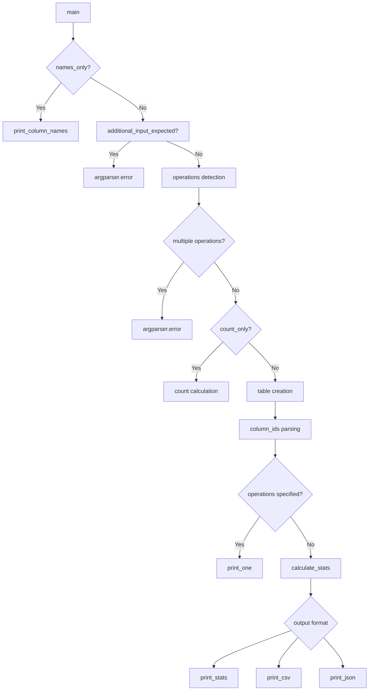
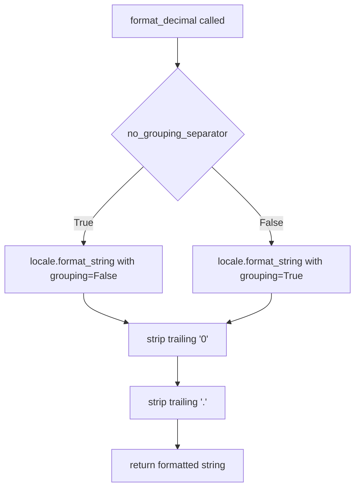
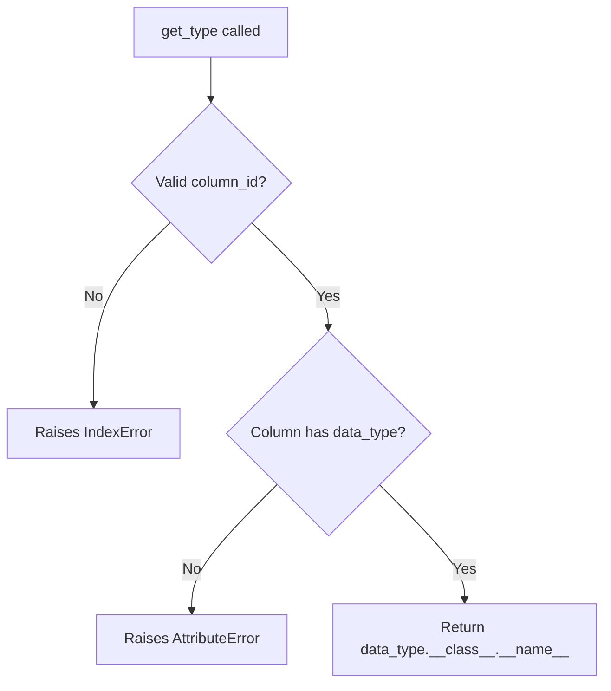

# `csvstat.py`

## `csvkit.utilities.csvstat.CSVStat` · *class*

## Summary:
A command-line utility for calculating and displaying descriptive statistics for columns in CSV files.

## Description:
The CSVStat class provides functionality to analyze CSV data by computing various statistical measures for each column. It serves as a command-line utility that can output statistics in multiple formats (plain text, CSV, or JSON) and supports filtering by specific columns or operations.

This class is designed to be instantiated by the csvkit command-line framework and processes CSV input to generate descriptive statistics. It leverages the agate library for data processing and provides extensive customization options for output format and statistical measures.

## State:
- Inherits from CSVKitUtility, which provides standard CLI argument handling and input/output management
- Uses `self.args` for accessing parsed command-line arguments
- Uses `self.input_file` and `self.output_file` from parent class for I/O operations
- Depends on `OPERATIONS` constant (defined elsewhere) which maps operation names to their metadata including aggregation functions and labels
- Stores configuration via inherited CSVKitUtility attributes like `self.reader_kwargs`, `self.skip_lines`, etc.
- Maintains internal state for processing CSV data through agate Table objects

## Lifecycle:
- Creation: Instantiated automatically by the csvkit framework when invoked as `csvstat`
- Usage: Called via the `main()` method which processes command-line arguments and performs statistical analysis
- Destruction: Managed by the parent CSVKitUtility class lifecycle

## Method Map:


## Raises:
- argparse.ArgumentError: When conflicting arguments are provided (e.g., multiple operation flags, --csv with operation flag)
- IOError: When reading input file fails
- csv.Error: When CSV parsing fails

## Example:
```bash
# Display basic statistics for all columns
csvstat data.csv

# Display only mean and median for all columns
csvstat --mean --median data.csv

# Display statistics for specific columns only
csvstat -c 1,3,5 data.csv

# Output as CSV format
csvstat --csv data.csv

# Display only column names and indices
csvstat --names data.csv
```

### `csvkit.utilities.csvstat.CSVStat.add_arguments` · *method*

## Summary:
Configures command-line argument parsers for CSV statistical analysis utility.

## Description:
Adds command-line arguments to the argument parser for controlling output format, column selection, statistic calculation options, and CSV parsing behavior. This method is part of the CSVStat utility class that provides descriptive statistics for CSV files. It defines all available command-line options including output format controls (--csv, --json), column filtering (-c/--columns), statistic selection flags (--type, --nulls, --mean, etc.), and CSV parsing configuration options (--snifflimit, --no-inference).

The method is separated from the main utility logic to maintain clean separation of concerns, allowing the argument parsing setup to be easily testable and reusable across different implementations while keeping the core business logic in the main() method.

## Args:
    self: The CSVStat instance whose argparser will be configured.

## Returns:
    None: This method modifies the instance's argparser in-place and returns nothing.

## Raises:
    None explicitly raised.

## State Changes:
    Attributes READ: None
    Attributes WRITTEN: self.argparser (modifies the argument parser instance)

## Constraints:
    Preconditions: The method assumes self.argparser exists and is an ArgumentParser instance.
    Postconditions: The argparser instance will have all the defined command-line arguments added to it.

## Side Effects:
    None: This method only configures the argument parser and doesn't perform I/O or mutate external state.

### `csvkit.utilities.csvstat.CSVStat.main` · *method*

## Summary:
Processes command-line arguments and performs statistical analysis on CSV data, outputting results in various formats based on user specifications.

## Description:
This method serves as the primary entry point for the csvstat utility, orchestrating the entire statistical analysis workflow. It handles command-line argument validation, processes input CSV data through agate Table, and dispatches to appropriate output methods based on user-specified options. The method supports multiple modes including column name listing, row counting, single operation analysis, and comprehensive statistical reporting.

The method follows a specific execution flow:
1. If --names flag is specified, prints column names and exits
2. Validates that input is provided (file or piped data)
3. Processes operation flags (--mean, --median, etc.) ensuring only one is specified
4. Validates argument combinations (e.g., --csv with operation flags)
5. Handles --count-only mode for row counting
6. Loads CSV data into an agate Table with appropriate settings
7. Parses column identifiers for targeted analysis
8. Either performs single-column operation analysis or comprehensive statistics
9. Outputs results in CSV, JSON, or plain text format based on flags

## Args:
    self: The CSVStat instance containing command-line arguments and utility state

## Returns:
    None

## Raises:
    SystemExit: When command-line argument validation fails, triggering argparse error messages for:
        - Missing input file or piped data
        - Multiple operation flags specified
        - Conflicting argument combinations (e.g., --csv with operation flags)

## State Changes:
    Attributes READ:
        - self.args.names_only: Flag to display column names only
        - self.args.columns: Column identifier specification
        - self.args.freq_count: Maximum frequent values to display
        - self.args.csv_output: Flag to output as CSV
        - self.args.json_output: Flag to output as JSON
        - self.args.count_only: Flag to output only row count
        - self.args.sniff_limit: CSV dialect sniffing limit
        - self.args.skip_lines: Number of lines to skip
        - self.args.no_header_row: Flag indicating no header row
        - self.args.zero_based: Flag for zero-based column indexing
        - self.args.no_inference: Flag to disable type inference
        - self.args.decimal_format: Format string for decimal numbers
        - self.args.no_grouping_separator: Flag to disable grouping separators
        - self.args.indent: JSON indentation level
        - self.reader_kwargs: CSV reader keyword arguments
        - self.input_file: Input file handle
        - self.output_file: Output file handle
    Attributes WRITTEN:
        - self.output_file: Written to for all output formats

## Constraints:
    Preconditions:
        - Command-line arguments must be properly parsed and available via self.args
        - Input file must be accessible via self.input_file or stdin must be available
        - CSVKitUtility base class must be properly initialized
        - OPERATIONS constant must be defined globally
    Postconditions:
        - Output is written to self.output_file according to specified format
        - Method exits early for special cases (names_only, count_only)
        - Appropriate error messages are displayed for invalid argument combinations
        - CSV data is properly loaded and processed through agate.Table

## Side Effects:
    - Reads from input file or stdin
    - Writes formatted output to output file (stdout by default)
    - Performs CSV parsing using agate.Table.from_csv
    - Calls various helper methods for specific operations
    - May raise SystemExit for argument validation errors

### `csvkit.utilities.csvstat.CSVStat.is_finite_decimal` · *method*

## Summary:
Checks if a value is a finite Decimal instance.

## Description:
This method determines whether a given value is an instance of the Decimal class and whether that Decimal value is finite (not infinity or NaN). This validation is crucial for proper decimal number formatting and handling in statistical calculations, particularly when deciding whether to apply special formatting to decimal values.

## Args:
    value: Any Python object to be checked for being a finite Decimal

## Returns:
    bool: True if the value is a Decimal instance and is finite, False otherwise

## Raises:
    None

## State Changes:
    Attributes READ: None
    Attributes WRITTEN: None

## Constraints:
    Preconditions: The value parameter can be any Python object
    Postconditions: Returns a boolean indicating the finiteness of a Decimal value

## Side Effects:
    None

### `csvkit.utilities.csvstat.CSVStat._calculate_stat` · *method*

## Summary:
Calculates a statistical measure for a specified column in a CSV table using either a custom getter function or agate's aggregation framework.

## Description:
This private method serves as the core calculation engine for statistical operations on CSV columns within the CSVStat utility. It attempts to execute a specific statistical operation by first checking for a custom getter function (named get_{op_name}), falling back to agate's built-in aggregation capabilities if none exists. When the result is a finite decimal and not in JSON output mode, it applies locale-specific formatting to the result.

## Args:
    self: The CSVStat instance
    table (agate.Table): The table containing the data to analyze
    column_id (int): Index of the column to calculate statistics for
    op_name (str): Name of the operation to perform (e.g., 'mean', 'sum', 'min')
    op_data (dict): Dictionary containing operation metadata including 'aggregation' key
    **kwargs: Additional keyword arguments passed to getter functions

## Returns:
    Various: The calculated statistic value, which may be a formatted string for decimal values or the raw result from the calculation

## Raises:
    None explicitly raised - all exceptions during calculation are caught and silently ignored

## State Changes:
    Attributes READ: 
    - self.args.json_output
    - self.args.decimal_format
    - self.args.no_grouping_separator
    
    Attributes WRITTEN: None

## Constraints:
    Preconditions:
    - table must be a valid agate.Table instance
    - column_id must be a valid index for the table's columns
    - op_name must correspond to a defined operation in OPERATIONS
    - op_data must contain an 'aggregation' key with a valid agate operation
    
    Postconditions:
    - Returns a calculated statistic value or None if calculation fails
    - Decimal values are formatted according to application settings when not in JSON mode
    - All agate.NullCalculationWarning warnings are suppressed during execution

## Side Effects:
    - Suppresses agate.NullCalculationWarning warnings during execution
    - May perform locale-based decimal formatting when applicable
    - Silently ignores all exceptions during calculation (this may mask important errors)

### `csvkit.utilities.csvstat.CSVStat.print_one` · *method*

## Summary:
Formats and outputs statistical information for a specific column in a CSV table, with special handling for frequency distributions.

## Description:
This method calculates and displays statistical information for a single column in a CSV dataset. It serves as a core component of the CSVStat utility's reporting functionality, enabling individual column statistics to be displayed with appropriate formatting. The method supports various statistical operations and can output with or without column labels.

## Args:
    self: The CSVStat instance
    table (agate.Table): The table containing the data to analyze
    column_id (int): Index of the column to calculate statistics for
    op_name (str): Name of the statistical operation to perform (e.g., 'mean', 'sum', 'freq')
    label (bool): Whether to include column name and index in the output format. Defaults to True
    **kwargs: Additional keyword arguments passed to the underlying calculation methods

## Returns:
    None: This method performs I/O operations and does not return a value

## Raises:
    None explicitly raised - the method relies on underlying calculation methods that may raise exceptions internally

## State Changes:
    Attributes READ:
    - self.output_file: Used for writing formatted output
    
    Attributes WRITTEN:
    - None: This method doesn't modify instance attributes directly

## Constraints:
    Preconditions:
    - table must be a valid agate.Table instance
    - column_id must be a valid index for the table's columns
    - op_name must be a key in the OPERATIONS global constant
    - self.output_file must be a valid file-like object with a write method
    - The OPERATIONS constant must define the operation specified by op_name with appropriate aggregation data
    
    Postconditions:
    - Output is written to self.output_file in a formatted manner
    - For 'freq' operations, output is formatted as a dictionary-like string: '{ "value": count, ... }'
    - For other operations, output is written as a simple value with optional labeling
    - The column_id is used as a 1-based index in the output when label=True

## Side Effects:
    - Writes formatted text to self.output_file
    - Calls self._calculate_stat() which may perform calculations and suppress warnings
    - May format decimal values using locale-specific formatting when applicable
    - The method depends on a global OPERATIONS constant that defines available statistical operations

### `csvkit.utilities.csvstat.CSVStat.calculate_stats` · *method*

*No documentation generated.*

### `csvkit.utilities.csvstat.CSVStat.print_stats` · *method*

## Summary:
Formats and writes statistical summary information for specified columns to the output file, displaying various descriptive statistics in a human-readable format.

## Description:
This method generates formatted output showing descriptive statistics for each specified column in a CSV table. It processes column statistics and displays them in a structured text format with proper alignment and formatting. The method is called by the main execution flow when no specific operation flags are provided, and it serves as the primary output formatter for the CSVStat utility in plain text mode.

The method handles special formatting for different statistic types, particularly for frequency distributions and numeric values with decimal formatting. It ensures consistent output alignment and applies appropriate formatting based on data types and command-line options.

## Args:
    table: An agate Table object containing the CSV data to analyze
    column_ids: A list of column identifiers (indices) to process statistics for  
    stats: A dictionary mapping column IDs to their computed statistics dictionaries

## Returns:
    None

## Raises:
    None explicitly raised by this method, though underlying I/O operations may raise exceptions

## State Changes:
    Attributes READ: 
    - self.output_file: Used for writing formatted output
    - self.args: Used for formatting decimal numbers and controlling output format
    - OPERATIONS: Used to determine available statistics to display
    - table.column_names: Accesses column names for labeling
    - table.columns: Accesses column data for type checking
    - table.rows: Accesses row count for final summary
    
    Attributes WRITTEN:
    - self.output_file: Modified through write operations

## Constraints:
    Preconditions:
    - The table parameter must be a valid agate table object
    - column_ids must contain valid column identifiers for the table
    - stats must be a dictionary with keys matching column_ids and values being dictionaries of computed statistics
    - OPERATIONS constant must be defined in the module scope with appropriate structure
    - Each column_stats entry in stats must contain all keys present in OPERATIONS
    
    Postconditions:
    - Formatted statistical information is written to self.output_file in a consistent format
    - Output follows a consistent format with aligned labels and proper value formatting
    - Row count information is appended at the end of the output
    - Special handling is applied for frequency distributions, null counts, and string lengths

## Side Effects:
    I/O: Writes formatted statistical information to self.output_file
    Formatting: Applies decimal formatting based on command-line arguments (decimal_format, no_grouping_separator)
    Text Processing: Formats and aligns text output for readability, with special handling for different data types

### `csvkit.utilities.csvstat.CSVStat.print_csv` · *method*

## Summary:
Writes CSV-formatted statistical data for specified columns to the output file.

## Description:
This method generates a CSV table containing descriptive statistics for specified columns from a CSV dataset. It uses the `_rows` helper method to format the data and writes it to the configured output file using agate's DictWriter. The method is part of the CSVStat utility class and is called when the user specifies the --csv flag to output results in CSV format.

The method processes statistics for multiple columns and formats them into a tabular CSV structure with columns for column ID, column name, and various statistical measures. When frequency data is present, it converts the frequency list into a comma-separated string format for proper CSV output.

This method is specifically designed to separate the CSV output formatting logic from the main processing flow, enabling clean code organization and reuse across different output formats. It leverages the OPERATIONS constant to define the statistical measures that will be included in the CSV output.

## Args:
    table (agate.Table): The table containing the CSV data being analyzed
    column_ids (list[int]): List of column indices to process
    stats (dict): Dictionary mapping column indices to their calculated statistics

## Returns:
    None

## Raises:
    None explicitly raised

## State Changes:
    Attributes READ:
    - self.output_file: The file object where CSV output is written
    - self._rows(): Helper method that generates formatted rows
    
    Attributes WRITTEN: None

## Constraints:
    Preconditions:
    - table must be a valid agate.Table instance
    - column_ids must be a list of valid column indices for the table
    - stats must be a dictionary with keys matching column_ids and values being dictionaries of statistics
    - OPERATIONS must be a globally defined constant (likely a dict) containing statistical operation definitions
    
    Postconditions:
    - CSV header row is written to self.output_file with columns: 'column_id', 'column_name', and all operation names from OPERATIONS
    - Data rows containing column statistics are written to self.output_file
    - The output file contains properly formatted CSV data with frequency data converted to string format when present

## Side Effects:
    - Writes to self.output_file (file I/O operation)
    - Processes frequency data by converting it to comma-separated string format

### `csvkit.utilities.csvstat.CSVStat.print_json` · *method*

## Summary:
Outputs column statistics in JSON format to the configured output file.

## Description:
This method transforms column statistics into a JSON-formatted output. It collects statistical data for specified columns using the `_rows` helper method, then serializes the resulting data structure to JSON and writes it to the output file. This method is called during the main execution flow when the `--json` command-line argument is specified.

The method is separated from inline processing to maintain clean code organization and enable reuse of the data transformation logic with other output formats like CSV.

## Args:
    table (agate.Table): The table containing the CSV data being analyzed
    column_ids (list[int]): List of column indices to process
    stats (dict): Dictionary mapping column indices to their calculated statistics

## Returns:
    None

## Raises:
    TypeError: If any statistic value cannot be serialized to JSON
    OSError: If writing to the output file fails

## State Changes:
    Attributes READ:
    - self.args.indent (accessed via parent class arguments)
    - self.output_file (accessed via parent class)
    
    Attributes WRITTEN: None

## Constraints:
    Preconditions:
    - table must be a valid agate.Table instance
    - column_ids must be a list of valid column indices for the table
    - stats must be a dictionary with keys matching column_ids and values being dictionaries of statistics
    - self.output_file must be a writable file-like object
    
    Postconditions:
    - The output file contains valid JSON data representing column statistics
    - The JSON output follows the structure produced by the `_rows` helper method

## Side Effects:
    - Writes JSON data to self.output_file
    - May perform I/O operations to the output file

### `csvkit.utilities.csvstat.CSVStat._rows` · *method*

## Summary:
Generates formatted output rows containing column statistics for CSV analysis.

## Description:
This method transforms statistical data for multiple columns into a structured row format suitable for CSV or JSON output. It processes column statistics and creates dictionaries with column metadata and computed statistics, filtering out None values.

The method is specifically designed to be used by `print_csv` and `print_json` methods to format data for tabular output. It's separated from inline processing to maintain clean code organization and enable reuse across different output formats.

## Args:
    table (agate.Table): The table containing the CSV data being analyzed
    column_ids (list[int]): List of column indices to process
    stats (dict): Dictionary mapping column indices to their calculated statistics

## Returns:
    generator: Generator yielding dictionaries with column_id, column_name, and applicable statistics

## Raises:
    None explicitly raised

## State Changes:
    Attributes READ: 
    - self.args (accessed indirectly via parent class)
    - table.column_names (accessed via table object)
    - stats (parameter)
    
    Attributes WRITTEN: None

## Constraints:
    Preconditions:
    - table must be a valid agate.Table instance
    - column_ids must be a list of valid column indices for the table
    - stats must be a dictionary with keys matching column_ids and values being dictionaries of statistics
    
    Postconditions:
    - Each yielded dictionary contains 'column_id' and 'column_name' keys
    - Statistics keys in the returned dictionaries correspond to non-None values in stats[column_id]

## Side Effects:
    None

## `csvkit.utilities.csvstat.format_decimal` · *function*

## Summary:
Formats a decimal number according to locale settings with customizable precision and optional grouping separators.

## Description:
This utility function formats decimal numbers for display, applying locale-specific formatting rules while allowing customization of precision and grouping separator behavior. It's designed to provide consistent decimal formatting across different locales and use cases.

## Args:
    d (float or Decimal): The decimal number to format
    f (str, optional): Format string specifying precision. Defaults to '%.3f' (3 decimal places)
    no_grouping_separator (bool, optional): If True, disables thousands grouping separators. Defaults to False

## Returns:
    str: Formatted decimal string with trailing zeros and decimal point removed when appropriate

## Raises:
    None explicitly raised - relies on locale.format_string behavior

## Constraints:
    Preconditions:
    - Input `d` must be a numeric type (float or Decimal)
    - Format string `f` must be a valid Python format string
    
    Postconditions:
    - Returns a string representation of the formatted number
    - Trailing zeros after decimal point are stripped
    - If result ends with decimal point, it's also stripped

## Side Effects:
    None

## Control Flow:


## Examples:
    >>> format_decimal(1234.5678)
    '1,234.568'
    >>> format_decimal(1234.5678, f='%.2f')
    '1,234.57'
    >>> format_decimal(1234.5678, no_grouping_separator=True)
    '1234.568'
    >>> format_decimal(1234.000)
    '1,234'
    >>> format_decimal(1234.000, no_grouping_separator=True)
    '1234'
```

## `csvkit.utilities.csvstat.get_type` · *function*

## Summary:
Extracts and returns the class name of a column's data type from an agate table.

## Description:
This function retrieves the data type class name for a specific column in an agate table. It serves as a utility for determining the underlying data type representation of a column, which is useful for statistical analysis and type inspection in CSV processing operations.

The function is typically called during CSV statistics computation when analyzing column characteristics and data types. It provides a standardized way to obtain type information for reporting and debugging purposes.

## Args:
    table: An agate Table object containing the column data
    column_id: Integer index identifying the column within the table (zero-based)
    **kwargs: Additional keyword arguments (unused in current implementation)

## Returns:
    str: The class name of the column's data type as a string

## Raises:
    IndexError: When column_id is out of bounds for the table's columns
    AttributeError: When table.columns[column_id] does not have a data_type attribute

## Constraints:
    Preconditions:
        - table must be a valid agate Table instance
        - column_id must be a valid integer index within the range [0, len(table.columns))
        - table.columns[column_id] must have a data_type attribute
    
    Postconditions:
        - Returns a string representation of the data type class name
        - The returned string is the direct result of calling __class__.__name__ on the column's data_type

## Side Effects:
    None

## Control Flow:


## Examples:
    # Basic usage with a table and column index
    table = agate.Table.from_csv('data.csv')
    type_name = get_type(table, 0)  # Gets type name for first column
    # Returns something like "Text", "Number", "Boolean", etc.

## `csvkit.utilities.csvstat.get_unique` · *function*

## Summary:
Calculates the number of unique (distinct) values in a specified column of a CSV table.

## Description:
This function computes the cardinality of distinct values in a given column by utilizing the agate library's `values_distinct()` method. It serves as a statistical measure for analyzing data diversity within CSV datasets. The function is primarily used within the csvstat utility to provide descriptive statistics about column uniqueness.

## Args:
    table (agate.Table): An agate Table object containing the CSV data structure.
    column_id (int or str): The identifier for the column to analyze. This can be either a zero-based index or a column name string.
    **kwargs: Additional keyword arguments that may be passed through to underlying methods (though not directly used in this implementation).

## Returns:
    int: The count of distinct, non-null values in the specified column. Returns 0 if the column contains no data or only null values.

## Raises:
    KeyError: When the specified column_id (as a string) does not exist in the table's column names.
    IndexError: When the column_id (as an integer) is out of bounds for the table's columns.

## Constraints:
    Preconditions:
        - The table parameter must be a valid agate.Table instance
        - The column_id must reference a valid column in the table
        - The table must contain at least one column
    
    Postconditions:
        - The function returns a non-negative integer representing unique value count
        - The original table and column remain unmodified
        - No side effects occur beyond returning the computed value

## Side Effects:
    None

## Control Flow:
```mermaid
flowchart TD
    A[get_unique called] --> B[table.columns[column_id] accessed]
    B --> C[values_distinct() called on column]
    C --> D[Length of distinct values calculated]
    D --> E[Return integer count]
```

## Examples:
    # Basic usage with column index
    unique_count = get_unique(my_table, 0)  # Count unique values in first column
    
    # Usage with column name
    unique_count = get_unique(my_table, 'email')  # Count unique email addresses
    
    # Error handling example
    try:
        unique_count = get_unique(my_table, 99)  # Invalid column index
    except IndexError:
        print("Column index out of range")

## `csvkit.utilities.csvstat.get_freq` · *function*

## Summary:
Calculates and returns the most frequent values in a specified column of a table along with their occurrence counts.

## Description:
This function extracts all values from a given column in a table and computes their frequency distribution. It's designed to provide quick insights into the most commonly occurring values in a dataset column, which is useful for data exploration and analysis. The function leverages Python's Counter class to efficiently compute frequencies and returns results sorted by frequency in descending order.

## Args:
    table: An agate table object containing the data to analyze
    column_id: Identifier for the column to analyze (can be integer index or column name)
    freq_count (int): Maximum number of top frequent values to return. Defaults to 5.
    **kwargs: Additional keyword arguments (currently unused but accepted for flexibility)

## Returns:
    list[dict]: A list of dictionaries, each containing:
        - 'value': The actual value from the column
        - 'count': The number of occurrences of that value
    Returns an empty list if the column contains no values or if freq_count is 0.

## Raises:
    None explicitly raised by this function, though underlying operations may raise exceptions from:
    - IndexError: If column_id is out of bounds for the table columns
    - AttributeError: If table.columns doesn't support the indexing operation
    - TypeError: If column_id is not a valid identifier for the table columns

## Constraints:
    Preconditions:
    - The table parameter must be a valid agate table object
    - The column_id must be a valid identifier for a column in the table
    - The freq_count parameter should be a non-negative integer
    
    Postconditions:
    - Returns a list of dictionaries with consistent structure ('value', 'count')
    - Results are ordered by frequency in descending order (most frequent first)
    - Returns at most freq_count entries or fewer if the column has fewer unique values

## Side Effects:
    None - This function is pure and has no side effects beyond accessing table data.

## Control Flow:
```mermaid
flowchart TD
    A[Start get_freq] --> B{table.columns[column_id] exists?}
    B -- Yes --> C[Get column values]
    C --> D[Count frequencies with Counter]
    D --> E[Get most_common(freq_count)]
    E --> F[Format as [{'value': v, 'count': c}, ...]]
    F --> G[Return result]
    B -- No --> H[Raise exception]
    H --> G
```

## Examples:
    # Basic usage
    table = agate.Table.from_csv('data.csv')
    freq_data = get_freq(table, 0, freq_count=3)
    # Returns [{'value': 'A', 'count': 15}, {'value': 'B', 'count': 8}, {'value': 'C', 'count': 3}]
    
    # With column name instead of index
    freq_data = get_freq(table, 'category', freq_count=10)
    # Returns top 10 most frequent values from the 'category' column
```

## `csvkit.utilities.csvstat.launch_new_instance` · *function*

## Summary:
Creates and executes a new instance of the CSVStat command-line utility.

## Description:
This function serves as a factory method that instantiates a CSVStat utility object and executes its run() method. It follows the standard pattern used by csvkit utilities for creating and launching command-line tools. The function encapsulates the common workflow of creating a utility instance and running it, providing a clean entry point for the csvstat command-line interface.

This function is typically called by the csvkit framework when the csvstat command is invoked, allowing for proper initialization of command-line arguments, input/output handling, and execution of the statistical analysis process.

## Args:
    None

## Returns:
    None

## Raises:
    None explicitly raised by this function, though the underlying CSVStat.run() and CSVStat.main() methods may raise:
    - argparse.ArgumentError: When conflicting arguments are provided
    - IOError: When reading input file fails  
    - csv.Error: When CSV parsing fails

## Constraints:
    Precondition: The function assumes that the command-line arguments have been properly set up in the environment or that the CSVStat class can initialize itself appropriately.
    Postcondition: The CSVStat utility has completed its execution and produced output to the configured output stream.

## Side Effects:
    - Reads from stdin or the specified input file
    - Writes statistical analysis results to stdout or the specified output file
    - May read command-line arguments from sys.argv
    - Processes CSV data through the agate library

## Control Flow:
```mermaid
flowchart TD
    A[launch_new_instance] --> B[Create CSVStat instance]
    B --> C[Call utility.run()]
    C --> D{CSVStat.run() execution}
    D -->|Success| E[Output statistics]
    D -->|Exception| F[Handle exception]
```

## Examples:
```bash
# Direct command-line usage (which internally calls launch_new_instance)
csvstat data.csv

# With specific options
csvstat --mean --median data.csv

# With column filtering
csvstat -c 1,3,5 data.csv
```

