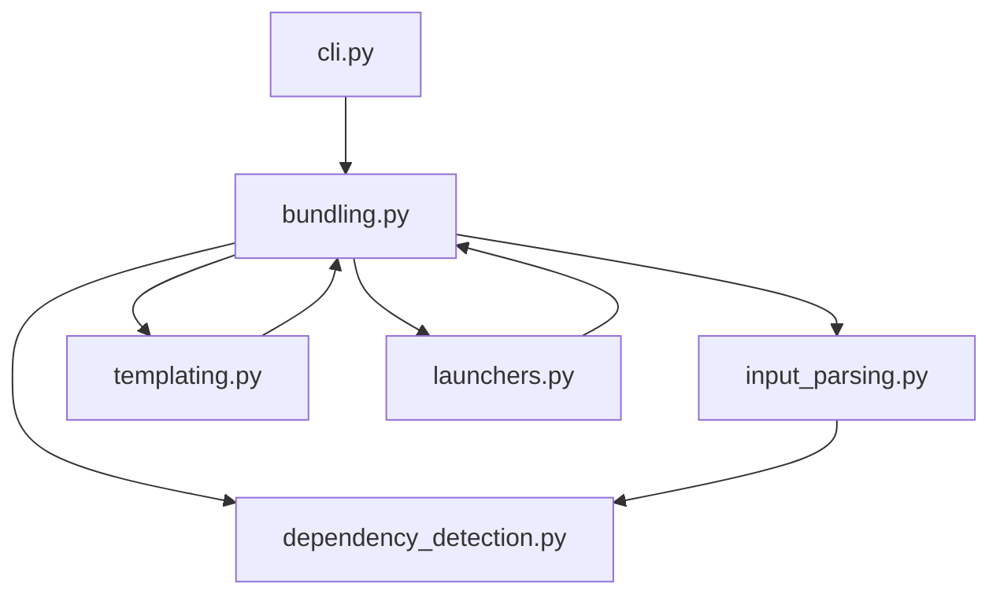

# `src.exodus_bundler`

## Tree:
```
exodus_bundler/
├── bundling.py
├── cli.py
├── dependency_detection.py
├── errors.py
├── input_parsing.py
├── launchers.py
└── templating.py
```

## Role:
Provides tools for assembling application code and resources into distributable packages with dependency management and configuration handling.

## Description:
The exodus_bundler module implements a comprehensive bundling system that transforms source code and assets into optimized, deployable packages. It handles dependency resolution, input parsing, template processing, and launcher creation to produce final bundles suitable for distribution.

This module is designed as a cohesive unit because all its components work together to solve the problem of application packaging and deployment, sharing common concepts around configuration, dependencies, and resource management.

## Components:
- **bundling.py**: Core bundling orchestration that coordinates the assembly of code, assets, and configurations into final bundles
- **cli.py**: Command-line interface that provides user-facing access to bundling functionality
- **dependency_detection.py**: Resolves and manages project dependencies for inclusion in bundles
- **errors.py**: Defines custom exception types for bundling-related errors and failures
- **input_parsing.py**: Processes and validates input configurations and source specifications
- **launchers.py**: Generates executable launchers and runtime configurations for bundled applications
- **templating.py**: Handles template rendering for bundle customization and configuration



## Public API:
- **bundling.BundleBuilder**: Main class for creating bundles from source configurations and settings
- **cli.main()**: Entry point for command-line interface execution with argument parsing
- **dependency_detection.detect_dependencies()**: Function to scan and resolve project dependencies from source files
- **input_parsing.parse_input()**: Parses input specifications and configuration files into internal representations
- **templating.render_template()**: Renders template files with provided context data for bundle customization
- **launchers.create_launcher()**: Creates executable launcher scripts for bundled applications with appropriate runtime settings

## Dependencies:
- Internal: None (all components are part of this module)
- External: 
  - `os` - for filesystem operations and path manipulations
  - `json` - for configuration file serialization and deserialization
  - `pathlib` - for robust path handling and manipulation
  - `argparse` - for command-line argument parsing in CLI interface
  - `logging` - for error reporting and debugging information

## Constraints:
- All input paths must be valid and accessible from the current working directory
- Bundle creation requires proper initialization of all dependency resolvers and template processors
- CLI commands must be executed from a valid project context with proper configuration files
- Template files must exist and be readable for templating operations to succeed
- Concurrent bundle operations may not be thread-safe and should be serialized
- Input validation is performed at parse time, so malformed configurations will raise exceptions

---

## Files

- [`bundling.py`](exodus_bundler/bundling.md)
- [`cli.py`](exodus_bundler/cli.md)
- [`dependency_detection.py`](exodus_bundler/dependency_detection.md)
- [`errors.py`](exodus_bundler/errors.md)
- [`input_parsing.py`](exodus_bundler/input_parsing.md)
- [`launchers.py`](exodus_bundler/launchers.md)
- [`templating.py`](exodus_bundler/templating.md)

