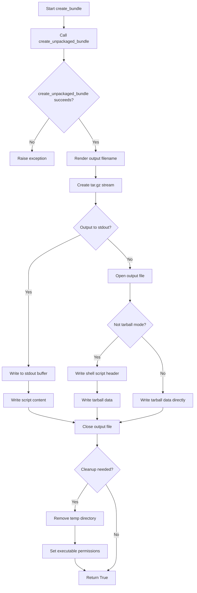
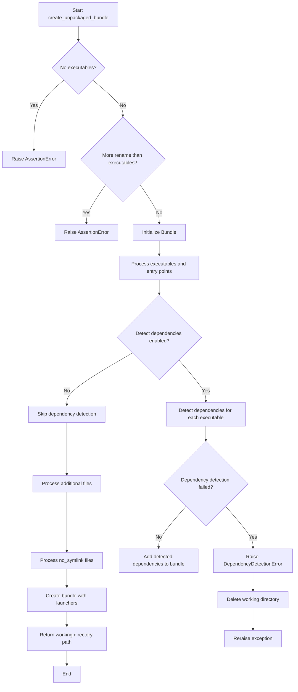
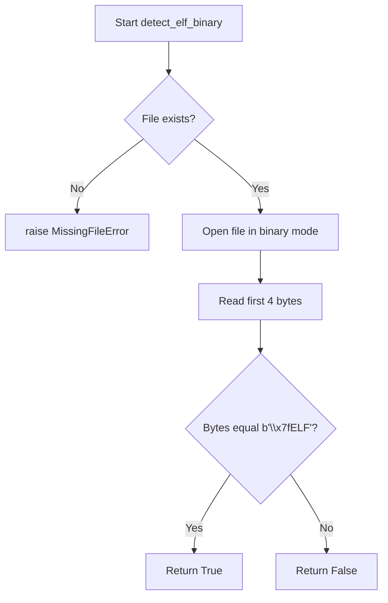
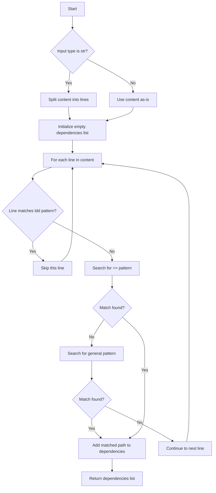
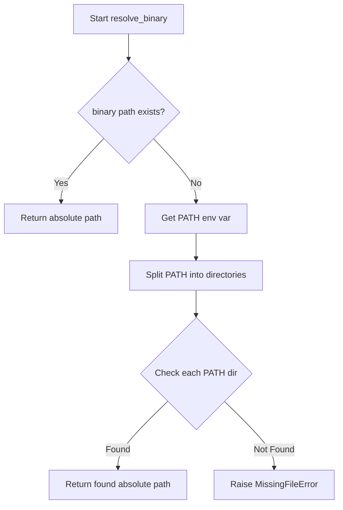
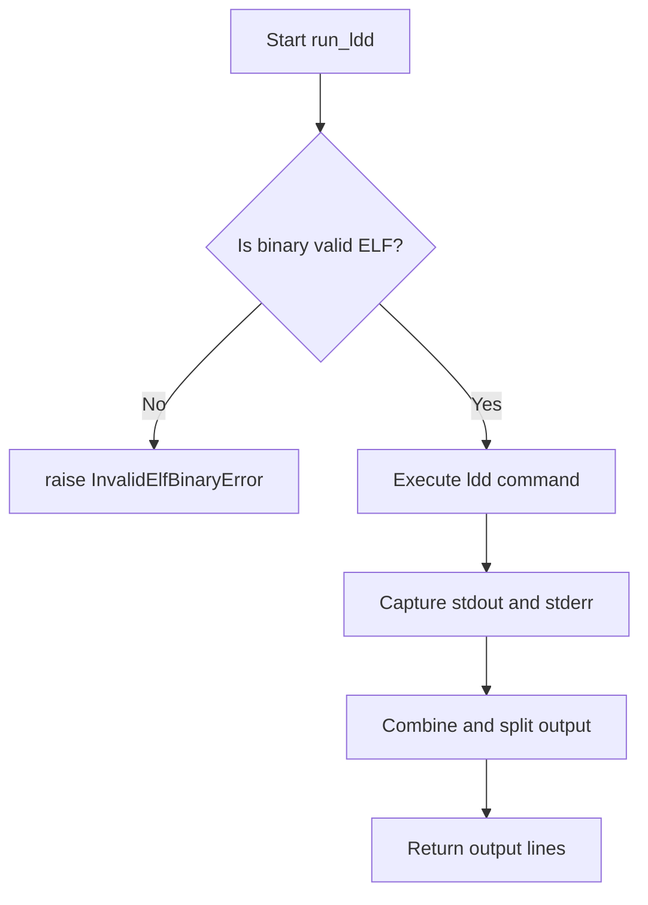
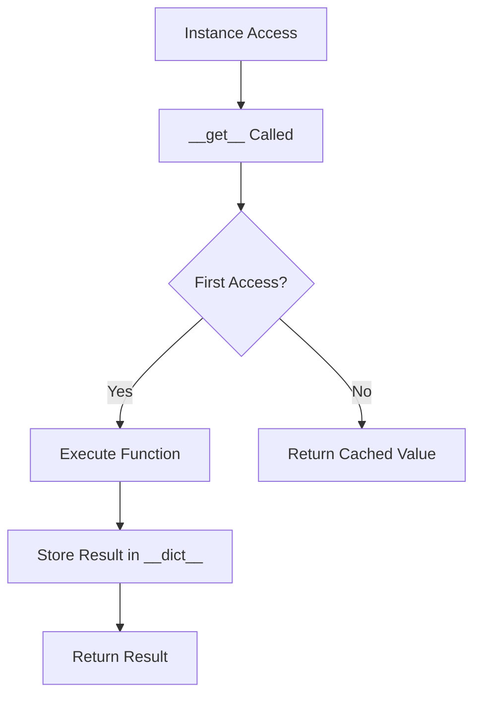
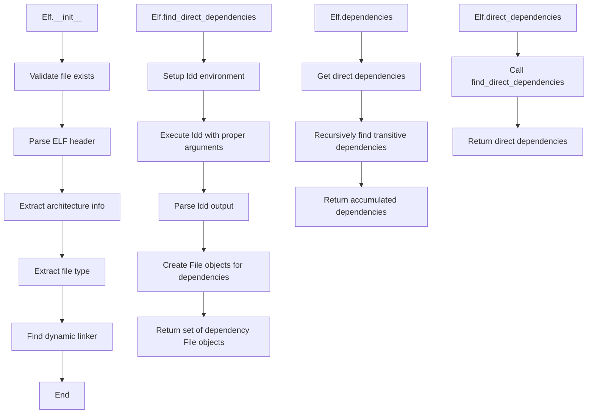

# `bundling.py`

## `src.exodus_bundler.bundling.bytes_to_int` · *function*

## Summary:
Converts a sequence of bytes into an integer value using specified byte order.

## Description:
This function transforms raw byte data into an integer representation, supporting both big-endian and little-endian byte ordering. It's designed to handle binary data conversion commonly needed in low-level operations such as parsing binary file formats or processing ELF binaries.

## Args:
    bytes (bytes): Sequence of bytes to convert to integer
    byteorder (str): Byte order specification, either 'big' or 'little'. Defaults to 'big'

## Returns:
    int: Integer representation of the byte sequence

## Raises:
    KeyError: When byteorder is not 'big' or 'little'
    struct.error: When struct.unpack fails due to incompatible data size or format

## Constraints:
    Preconditions:
        - bytes must be a valid bytes object
        - byteorder must be either 'big' or 'little'
    Postconditions:
        - Returns an integer value representing the byte sequence
        - The conversion respects the specified byte order

## Side Effects:
    None

## Control Flow:
```mermaid
flowchart TD
    A[bytes_to_int called] --> B{byteorder}
    B -->|big| C[chars = struct.unpack('>B...')]
    B -->|little| D[chars = struct.unpack('<B...')]
    C --> E[chars = chars[::-1]]
    D --> E
    E --> F[sum(int(char) * 256**i for i,char in enumerate(chars))]
    F --> G[Return integer]
```

## Examples:
    >>> bytes_to_int(b'\x01\x02\x03', 'big')
    66051
    >>> bytes_to_int(b'\x01\x02\x03', 'little')
    197121

## `src.exodus_bundler.bundling.create_bundle` · *function*

## Summary:
Creates a portable executable bundle by packaging executables, their dependencies, and launchers into either a shell installer or tar.gz archive.

## Description:
The `create_bundle` function serves as the main orchestration point for creating portable executable bundles. It takes a list of executables and packages them along with their dependencies into a distributable format. The function supports two output modes: shell script installers (default) that can be executed to install the bundle, or raw tar.gz archives containing the bundle contents.

This function is extracted into its own component to separate the high-level bundle creation logic from the lower-level bundle organization and dependency resolution handled by `create_unpackaged_bundle`. It manages the complete lifecycle of bundle creation including temporary directory cleanup, file I/O operations, and proper output formatting.

## Args:
    executables (list[str]): List of paths to executable files to include in the bundle. Must not be empty.
    output (str): Template string for the output filename. Supports {{executables}} and {{extension}} placeholders.
    tarball (bool, optional): If True, creates a raw tar.gz archive instead of a shell installer. Defaults to False.
    rename (list[str], optional): List of names to rename executables to. If fewer than executables, remaining entries get default names. Defaults to [].
    chroot (str, optional): Path to a chroot directory to use for file resolution and dependency analysis. Defaults to None.
    add (list[str], optional): Additional file paths to include in the bundle beyond the executables. Defaults to [].
    no_symlink (list[str], optional): File paths that should be copied instead of symlinked in the bundle. Defaults to [].
    shell_launchers (bool, optional): Whether to generate shell-based launchers instead of binary launchers. Defaults to False.
    detect (bool, optional): Whether to automatically detect and include dependencies for executables. Defaults to False.

## Returns:
    bool: True if bundle creation succeeds, raises exception otherwise.

## Raises:
    Exception: Any exception that occurs during bundle creation is caught and re-raised after cleanup.

## Constraints:
    Preconditions:
        - The `executables` list must contain at least one entry
        - All file paths in `executables`, `add`, and `no_symlink` must refer to existing files
        - File paths must not point to directories
        - If `detect` is True, the system must support dependency detection for the executables
        - The `output` template string must be valid and contain appropriate placeholders
        
    Postconditions:
        - A bundle is created at the specified output location
        - Temporary directories are cleaned up regardless of success or failure
        - Output files have appropriate permissions set (executable for shell installers)

## Side Effects:
    - Creates temporary directories for bundle contents
    - Reads files from the filesystem to determine dependencies and copy content
    - May execute external commands (like ldd) for dependency detection
    - Modifies the filesystem by creating symlinks and copying files
    - Writes output files to disk or stdout
    - Sets executable permissions on output files (when not tarball mode)

## Control Flow:


## Examples:
    # Create a shell installer for a single executable
    create_bundle(['/usr/bin/python3'], 'my-app.sh')
    
    # Create a tar.gz archive with renamed executables
    create_bundle(['/usr/bin/python3'], 'my-app.tgz', tarball=True, rename=['python'])
    
    # Create installer with dependency detection and additional files
    create_bundle(
        ['/usr/bin/myapp'],
        'myapp-installer.sh',
        detect=True,
        add=['/etc/myapp/config.conf'],
        rename=['myapp']
    )
    
    # Create installer with shell launchers
    create_bundle(
        ['/usr/bin/node'],
        'node-app.sh',
        shell_launchers=True
    )
```

## `src.exodus_bundler.bundling.create_unpackaged_bundle` · *function*

## Summary:
Creates an unpackaged bundle containing executables and their dependencies, with optional configuration for renaming, file inclusion, and launcher generation.

## Description:
The `create_unpackaged_bundle` function orchestrates the creation of a portable executable bundle by processing specified executables, detecting their dependencies, and organizing all required files into a temporary working directory structure. It supports advanced features like automatic dependency detection, custom file renaming, additional file inclusion, and symlink control.

This function is extracted into its own component to encapsulate the entire bundle creation workflow, separating the concerns of file management, dependency resolution, and bundle organization from the higher-level orchestration logic. It provides a clean interface for creating bundles while handling error recovery by cleaning up temporary directories on failure.

## Args:
    executables (list[str]): List of paths to executable files to include in the bundle. Must not be empty.
    rename (list[str], optional): List of names to rename executables to. If fewer than executables, remaining entries get default names. Defaults to [].
    chroot (str, optional): Path to a chroot directory to use for file resolution and dependency analysis. Defaults to None.
    add (list[str], optional): Additional file paths to include in the bundle beyond the executables. Defaults to [].
    no_symlink (list[str], optional): File paths that should be copied instead of symlinked in the bundle. Defaults to [].
    shell_launchers (bool, optional): Whether to generate shell-based launchers instead of binary launchers. Defaults to False.
    detect (bool, optional): Whether to automatically detect and include dependencies for executables. Defaults to False.

## Returns:
    str: The absolute path to the temporary working directory containing the created bundle.

## Raises:
    AssertionError: When no executables are specified or when more rename entries are provided than executables.
    DependencyDetectionError: When automatic dependency detection fails for an executable that requires it.
    Exception: Any other exception that occurs during bundle creation is caught and re-raised after cleanup.

## Constraints:
    Preconditions:
        - The `executables` list must contain at least one entry
        - All file paths in `executables`, `add`, and `no_symlink` must refer to existing files
        - File paths must not point to directories
        - If `detect` is True, the system must support dependency detection for the executables
        
    Postconditions:
        - A temporary directory is created and populated with the bundle contents
        - All specified executables and their dependencies are included in the bundle
        - The returned path points to a valid working directory structure
        - On failure, the temporary directory is cleaned up

## Side Effects:
    - Creates a temporary directory for bundle contents
    - Reads files from the filesystem to determine dependencies and copy content
    - May execute external commands (like ldd) for dependency detection
    - Modifies the filesystem by creating symlinks and copying files
    - Cleans up temporary directory on failure

## Control Flow:


## Examples:
    # Basic usage with a single executable
    bundle_dir = create_unpackaged_bundle(['/usr/bin/python3'])
    
    # Usage with renaming and dependency detection
    bundle_dir = create_unpackaged_bundle(
        ['/usr/bin/python3'], 
        rename=['my-python'],
        detect=True
    )
    
    # Usage with additional files and shell launchers
    bundle_dir = create_unpackaged_bundle(
        ['/usr/bin/myapp'],
        add=['/etc/myapp/config.conf'],
        shell_launchers=True
    )
    
    # Error handling example
    try:
        bundle_dir = create_unpackaged_bundle([])
    except AssertionError as e:
        print(f"Bundle creation failed: {e}")
```

## `src.exodus_bundler.bundling.detect_elf_binary` · *function*

## Summary:
Determines whether a given file is an ELF (Executable and Linkable Format) binary by examining its magic number.

## Description:
This function performs a basic file type detection by reading the first four bytes of a file and comparing them against the standard ELF magic number. It is used in the bundling process to identify executable files that need special handling during packaging.

The function is extracted into its own utility to provide a clean interface for ELF binary detection while enforcing proper file validation and error handling. This separation of concerns allows the bundling logic to focus on higher-level operations while maintaining consistent binary type detection.

## Args:
    filename (str): Path to the file to be checked for ELF binary format.

## Returns:
    bool: True if the file is an ELF binary (starts with \x7fELF), False otherwise.

## Raises:
    MissingFileError: When the specified file does not exist on the filesystem.

## Constraints:
    Preconditions:
        - The filename parameter must be a valid string path
        - The file at the specified path must exist
    Postconditions:
        - The function will always return a boolean value
        - No side effects occur beyond file reading

## Side Effects:
    - Reads the first 4 bytes of the specified file from disk
    - May raise an exception if the file doesn't exist

## Control Flow:


## Examples:
    # Check if a binary file is an ELF binary
    is_elf = detect_elf_binary('/usr/bin/python3')
    # Returns True if python3 is an ELF binary
    
    # Handle missing file case
    try:
        is_elf = detect_elf_binary('/nonexistent/file')
    except MissingFileError:
        print("File not found")
```

## `src.exodus_bundler.bundling.parse_dependencies_from_ldd_output` · *function*

## Summary:
Parses ldd command output to extract library dependency paths from each line.

## Description:
This function processes the output of the ldd command (which lists shared library dependencies of ELF binaries) and extracts the full paths to each dependency. It handles various formatting styles that ldd might produce and filters out special entries like those pointing to ldd itself.

## Args:
    content (str or list[str]): Either a string containing ldd output (with newlines) or a list of lines from ldd output. When a string is provided, it's split into lines.

## Returns:
    list[str]: A list of absolute paths to shared library dependencies found in the ldd output. Empty list if no dependencies are found or if input is empty.

## Raises:
    None explicitly raised

## Constraints:
    Preconditions:
    - Input content should be valid ldd output or equivalent formatted text
    - Content should contain lines with library dependency information in standard ldd format
    
    Postconditions:
    - Returns a list of strings representing absolute paths to libraries
    - All returned paths are stripped of surrounding whitespace and parentheses
    - Lines matching the pattern of ldd itself are filtered out

## Side Effects:
    None

## Control Flow:


## Examples:
    Example 1: Parsing standard ldd output
    ```python
    # Input: "libfoo.so => /usr/lib/libfoo.so (0x12345)"
    # Output: ["/usr/lib/libfoo.so"]
    ```

    Example 2: Handling multiple dependencies
    ```python
    # Input: ["libfoo.so => /usr/lib/libfoo.so (0x12345)", "libbar.so => /usr/lib/libbar.so (0x67890)"]
    # Output: ["/usr/lib/libfoo.so", "/usr/lib/libbar.so"]
    ```

    Example 3: Filtering ldd itself references
    ```python
    # Input: "ldd (libc6) => /lib64/ld-linux-x86-64.so.2"
    # Output: []
    ```

    Example 4: Handling different ldd formats
    ```python
    # Input: "/lib/x86_64-linux-gnu/libc.so.6 (0x..."
    # Output: ["/lib/x86_64-linux-gnu/libc.so.6"]
    ```

## `src.exodus_bundler.bundling.resolve_binary` · *function*

## Summary:
Resolves a binary name or path to its absolute file system location by checking the current directory first, then searching through system PATH directories.

## Description:
This utility function locates executable binaries in the file system by first attempting to resolve them relative to the current working directory, and if not found, by searching through directories listed in the system PATH environment variable. It ensures that a valid binary path is returned or raises an appropriate error if the binary cannot be located.

## Args:
    binary (str): The name or path of the binary to resolve. This can be either a relative path, absolute path, or just a binary name that exists in PATH.

## Returns:
    str: The absolute path to the resolved binary file.

## Raises:
    MissingFileError: When the specified binary cannot be found in the current directory or any directory listed in the PATH environment variable.

## Constraints:
    Preconditions:
        - The `binary` parameter must be a string
        - The system PATH environment variable should be accessible
    
    Postconditions:
        - Returns an absolute path string to an existing file
        - The returned path points to an actual binary file that exists in the filesystem

## Side Effects:
    None

## Control Flow:


## Examples:
    # Resolving a binary in current directory
    resolved_path = resolve_binary('./myapp')
    
    # Resolving a binary in PATH
    resolved_path = resolve_binary('python3')
    
    # Handling missing binary
    try:
        resolved_path = resolve_binary('nonexistent_binary')
    except MissingFileError as e:
        print(f"Binary not found: {e}")
```

## `src.exodus_bundler.bundling.resolve_file_path` · *function*

## Summary:
Resolves a file path to its absolute normalized form while validating file existence and type.

## Description:
This function processes a file path by either resolving it through the system PATH if requested, or using it directly. It performs validation to ensure the path refers to an existing file (not a directory) and returns the absolute normalized path. This utility enforces strict file path validation and normalization for consistent file handling throughout the bundling process.

## Args:
    path (str): The file path to resolve. Can be relative, absolute, or a binary name if search_environment_path is True.
    search_environment_path (bool): When True, treats the path as a binary name and searches system PATH for it. Defaults to False.

## Returns:
    str: The absolute normalized path to the resolved file.

## Raises:
    MissingFileError: When the specified file does not exist in the filesystem.
    UnexpectedDirectoryError: When the specified path points to a directory rather than a file.

## Constraints:
    Preconditions:
        - The `path` parameter must be a string
        - The file at the resolved path must exist if validation is performed
        - The resolved path must point to a regular file, not a directory
        
    Postconditions:
        - Returns an absolute path string
        - The returned path is normalized (no '.' or '..' components)
        - The path points to an existing file

## Side Effects:
    None

## Control Flow:
```mermaid
flowchart TD
    A[Start resolve_file_path] --> B{search_environment_path=True?}
    B -- Yes --> C[Call resolve_binary(path)]
    B -- No --> D[path remains unchanged]
    D --> E{File exists?}
    E -- No --> F[Raise MissingFileError]
    E -- Yes --> G{Is directory?}
    G -- Yes --> H[Raise UnexpectedDirectoryError]
    G -- No --> I[Return normpath(abspath(path))]
```

## Examples:
    # Resolving a regular file path
    resolved_path = resolve_file_path('/home/user/script.sh')
    
    # Resolving a binary through PATH
    resolved_path = resolve_file_path('python3', search_environment_path=True)
    
    # Handling missing file
    try:
        resolved_path = resolve_file_path('/nonexistent/file.txt')
    except MissingFileError as e:
        print(f"File not found: {e}")
    
    # Handling directory instead of file
    try:
        resolved_path = resolve_file_path('/some/directory')
    except UnexpectedDirectoryError as e:
        print(f"Expected file, got directory: {e}")
```

## `src.exodus_bundler.bundling.run_ldd` · *function*

## Summary:
Executes the ldd command on a specified binary file to retrieve its shared library dependencies and error messages.

## Description:
This function runs the system's ldd command on a given binary file to analyze its shared library dependencies. It first validates that the target file is a valid ELF binary before executing the command. The function combines both standard output and standard error from ldd into a single list of lines, making it easier to process dependency information regardless of whether ldd succeeds or fails.

The function is extracted into its own utility to encapsulate the ldd execution logic, separating concerns from the broader bundling process. This allows for better error handling, testing, and reuse of the ldd functionality across different parts of the bundler.

## Args:
    ldd (str): Path to the ldd command executable (e.g., '/usr/bin/ldd' or 'ldd')
    binary (str): Path to the binary file to analyze for shared library dependencies. This can be a relative path, absolute path, or just a binary name that exists in PATH.

## Returns:
    list[str]: A list of strings representing lines from both stdout and stderr of the ldd command execution. Each string corresponds to a line of output from the ldd command.

## Raises:
    InvalidElfBinaryError: When the specified binary file is not a valid ELF binary file.

## Constraints:
    Preconditions:
        - The `ldd` parameter must point to a valid executable ldd command
        - The `binary` parameter must specify a valid file path that exists
        - The binary file must be an ELF binary format
        
    Postconditions:
        - The function will always return a list of strings
        - No side effects occur beyond executing the ldd command and file validation

## Side Effects:
    - Executes an external subprocess command (ldd)
    - Reads the binary file to validate it's an ELF file
    - May raise exceptions if the binary is invalid or not found

## Control Flow:


## Examples:
    # Analyze a binary for dependencies
    try:
        deps = run_ldd('ldd', '/usr/bin/python3')
        for dep in deps:
            print(dep)
    except InvalidElfBinaryError as e:
        print(f"Invalid binary: {e}")

    # Using with full path to ldd
    deps = run_ldd('/usr/bin/ldd', './myapp')
```

## `src.exodus_bundler.bundling.stored_property` · *class*

## Summary:
A descriptor class that caches the result of a function call on the first access and returns the cached value on subsequent accesses.

## Description:
The `stored_property` class implements a descriptor that transforms a method into a cached property. When the property is accessed on an instance, it executes the wrapped function once and stores the result in the instance's dictionary under the property's name. Subsequent accesses return the cached value without re-executing the function.

This is particularly useful for expensive computations that should only be performed once per instance, such as computed properties or lazy-loaded values.

## State:
- `function`: The original function being wrapped (type: callable)
- `__doc__`: Documentation string from the wrapped function (type: str or None)

## Lifecycle:
- Creation: Instantiated with a function that takes an instance as its only argument
- Usage: Accessed like a regular attribute on an instance; triggers `__get__` method
- Destruction: No special cleanup required; relies on normal Python garbage collection

## Method Map:


## Raises:
- No exceptions are explicitly raised by the `stored_property` class itself
- The underlying function may raise exceptions when called

## Example:
```python
class MyClass:
    @stored_property
    def expensive_computation(self):
        # This runs only once per instance
        return sum(range(1000000))

# Usage:
obj = MyClass()
result1 = obj.expensive_computation  # Computes and caches result
result2 = obj.expensive_computation  # Returns cached result
assert result1 is result2  # Same object reference
```

### `src.exodus_bundler.bundling.stored_property.__init__` · *method*

## Summary:
Initializes a stored_property descriptor with a function to be cached.

## Description:
Constructs a stored_property descriptor that will cache the result of executing the provided function on the first access. The function's docstring is preserved and the function itself is stored for later execution when the property is accessed.

This method is called during the creation of a stored_property instance, typically when a method is decorated with @stored_property. It sets up the descriptor's internal state to enable caching behavior when the property is accessed on instances.

## Args:
    self: The stored_property instance being initialized
    function: A callable function that takes an instance as its only argument and computes a value to be cached

## Returns:
    None

## Raises:
    None

## State Changes:
    Attributes READ: None
    Attributes WRITTEN: 
    - self.__doc__: Set to the docstring of the provided function (getattr(function, '__doc__'))
    - self.function: Set to the provided function

## Constraints:
    Preconditions:
    - The function parameter must be callable
    - The function must accept exactly one argument (the instance)
    
    Postconditions:
    - self.function is set to the provided function
    - self.__doc__ is set to the docstring of the provided function (or None if not present)

## Side Effects:
    None

### `src.exodus_bundler.bundling.stored_property.__get__` · *method*

## Summary:
Computes and caches a property value on first access, returning the cached value on subsequent accesses.

## Description:
This method implements the descriptor protocol's `__get__` method for the `stored_property` class. When a property decorated with `@stored_property` is accessed on an instance, this method is invoked to compute the value. It executes the stored function with the instance as argument, caches the result in the instance's `__dict__` using the function's name as key, and returns the computed value. Subsequent accesses return the cached value without recomputation.

## Args:
    self: The stored_property instance
    instance: The object instance that owns the property being accessed, or None when accessed from the class
    type: The class that owns the property being accessed

## Returns:
    The computed value of the property, cached after first access

## Raises:
    None explicitly raised - any exceptions come from the underlying function call

## State Changes:
    Attributes READ: self.function, self.function.__name__
    Attributes WRITTEN: instance.__dict__[self.function.__name__]

## Constraints:
    Preconditions: 
    - instance must be provided when accessed from an instance (not from class)
    - self.function must be callable and accept instance as its sole argument
    - instance.__dict__ must be accessible for caching
    
    Postconditions:
    - The computed value is stored in instance.__dict__[self.function.__name__]
    - The same value is returned on subsequent accesses

## Side Effects:
    None - but may cause I/O or computation depending on the wrapped function

## `src.exodus_bundler.bundling.Elf` · *class*

## Summary:
Represents an ELF (Executable and Linkable Format) binary file and provides methods for analyzing its structure and dependencies.

## Description:
The Elf class encapsulates the functionality for parsing ELF binary files, extracting metadata such as architecture, file type, and dynamic linker information, and discovering both direct and transitive dependencies of the binary. It serves as a core component in the bundling process for creating portable executables by identifying all required shared libraries.

This class is typically instantiated by the File class when analyzing binary files, and it's responsible for:
- Validating that a file is a proper ELF binary
- Determining the binary's architecture (32-bit or 64-bit) and endianness
- Identifying the dynamic linker used by the binary
- Finding direct dependencies via ldd analysis
- Computing transitive dependencies recursively

## State:
- `path` (str): Absolute path to the ELF binary file
- `chroot` (str, optional): Root directory for chroot-based analysis
- `file_factory` (callable): Factory function for creating File objects (defaults to File class)
- `bits` (int): Architecture bits (32 or 64) determined from ELF header
- `type` (str): ELF file type ('relocatable', 'executable', 'shared', or 'core')
- `linker_file` (File, optional): File object representing the dynamic linker used by this binary

## Lifecycle:
- Creation: Instantiate with a file path, optional chroot directory, and optional file_factory
- Usage: Access properties like `type`, `bits`, and `linker_file` for metadata, or call `find_direct_dependencies()` for direct dependencies, or access `dependencies` property for transitive dependencies (automatically cached)
- Destruction: No special cleanup required; relies on Python's garbage collection

## Method Map:


## Raises:
- `MissingFileError`: Raised when the specified file path does not exist
- `InvalidElfBinaryError`: Raised when the file is not a valid ELF binary (doesn't start with '\x7fELF')
- `UnsupportedArchitectureError`: Raised when the ELF binary is not 32-bit or 64-bit, or is big-endian (only little-endian is supported)

## Example:
```python
# Create an Elf instance for a binary
elf = Elf('/usr/bin/python3')

# Access basic metadata
print(f"Architecture: {elf.bits} bits")
print(f"File type: {elf.type}")
print(f"Dynamic linker: {elf.linker_file.path if elf.linker_file else 'None'}")

# Find direct dependencies
direct_deps = elf.find_direct_dependencies()
print(f"Direct dependencies: {len(direct_deps)}")

# Find all transitive dependencies (computed and cached automatically)
all_deps = elf.dependencies
print(f"All dependencies: {len(all_deps)}")
```

### `src.exodus_bundler.bundling.Elf.__init__` · *method*

## Summary:
Initializes an ELF binary object by parsing its header structure and extracting metadata including architecture, file type, and dynamic linker information.

## Description:
The `__init__` method performs comprehensive parsing of an ELF binary file to extract essential metadata required for bundling and dependency analysis. It validates the file is a proper ELF binary, determines its architecture and endianness, identifies its file type, and locates the dynamic linker used by the binary. This method is called during the creation of Elf objects and forms the foundation for all subsequent ELF analysis operations.

This logic is separated into its own method rather than being inlined because it performs complex binary parsing operations that need to be reusable and testable independently. The method also handles critical error conditions for invalid or unsupported ELF binaries.

## Args:
    path (str): Absolute or relative path to the ELF binary file to parse
    chroot (str, optional): Root directory path to use for chroot-based file resolution when the binary is analyzed in a contained environment
    file_factory (callable, optional): Factory function for creating File objects; defaults to the File class itself

## Returns:
    None: This method initializes instance attributes rather than returning a value

## Raises:
    MissingFileError: When the specified file path does not exist on the filesystem
    InvalidElfBinaryError: When the file does not begin with the ELF magic number '\x7fELF'
    UnsupportedArchitectureError: When the ELF binary is neither 32-bit nor 64-bit, or is big-endian (only little-endian is supported)

## State Changes:
    Attributes READ: None
    Attributes WRITTEN: 
        - self.path: Set to the provided path parameter
        - self.chroot: Set to the provided chroot parameter
        - self.file_factory: Set to the provided file_factory or defaults to File class
        - self.bits: Set to 32 or 64 based on ELF format byte
        - self.type: Set to one of 'relocatable', 'executable', 'shared', or 'core' based on ELF type field
        - self.linker_file: Set to a File object representing the dynamic linker, or None if not found

## Constraints:
    Preconditions:
        - The path parameter must reference an existing file
        - The file at path must be a valid ELF binary (beginning with '\x7fELF')
        - The ELF binary must be either 32-bit or 64-bit architecture
        - The ELF binary must be little-endian (big-endian is not supported)
    Postconditions:
        - All ELF metadata fields are properly initialized
        - The linker_file attribute is either a File object or None
        - The object is ready for subsequent dependency analysis operations

## Side Effects:
    - Opens and reads the specified ELF binary file from disk
    - Performs binary file parsing operations to extract header information
    - May create additional File objects through the file_factory for the dynamic linker

### `src.exodus_bundler.bundling.Elf.__eq__` · *method*

## Summary:
Compares two Elf objects for equality based on their file paths.

## Description:
This method implements the equality comparison operator (`==`) for Elf objects. It determines if two Elf instances represent the same file by comparing their file paths. This method is part of the standard Python object protocol and enables using Elf objects in contexts requiring equality comparisons, such as in sets or as dictionary keys.

## Args:
    other (object): Another object to compare with this Elf instance.

## Returns:
    bool: True if the other object is an Elf instance and both objects reference the same file path; False otherwise.

## Raises:
    None

## State Changes:
    Attributes READ: self.path
    Attributes WRITTEN: None

## Constraints:
    Preconditions: The method accepts any object as input, but only returns True when the other object is specifically an Elf instance.
    Postconditions: The method returns a boolean value indicating equality based on file path comparison.

## Side Effects:
    None

## Notes:
    There appears to be a bug in the implementation. The method currently compares `self.path == self.path` instead of `self.path == other.path`, which would cause it to always return True when comparing with another Elf object (since any string equals itself). This would make the equality comparison meaningless.

### `src.exodus_bundler.bundling.Elf.__hash__` · *method*

## Summary:
Returns the hash value of the ELF binary file path for use in hash-based data structures.

## Description:
Implements Python's hash protocol by returning the hash of the file path stored in `self.path`. This method enables Elf objects to be used as keys in dictionaries or elements in sets. The hash is computed based on the immutable file path attribute, ensuring consistency with the object's identity.

## Args:
    None

## Returns:
    int: The hash value of `self.path`, suitable for use in hash-based collections.

## Raises:
    None

## State Changes:
    Attributes READ: self.path
    Attributes WRITTEN: None

## Constraints:
    Preconditions: The Elf object must have been properly initialized with a valid file path.
    Postconditions: The returned hash value remains consistent for the lifetime of the object.

## Side Effects:
    None

### `src.exodus_bundler.bundling.Elf.__repr__` · *method*

## Summary:
Returns a string representation of the ELF binary file object that displays its file path.

## Description:
This method provides a human-readable string representation of an Elf object, primarily used for debugging and logging purposes. It follows Python's standard `__repr__` protocol by returning a string in the format `<Elf(path="file_path")>` where file_path is the absolute path to the ELF binary. This representation helps developers quickly identify Elf objects and their associated files during development and troubleshooting.

The `__repr__` method is automatically called by Python's built-in functions like `repr()` and when printing containers of Elf objects. It's particularly useful in interactive Python sessions and debugging scenarios where object state needs to be quickly inspected.

## Args:
    None

## Returns:
    str: A formatted string representation of the Elf object showing its class name and file path.

## Raises:
    None

## State Changes:
    Attributes READ: self.path
    Attributes WRITTEN: None

## Constraints:
    Preconditions: The Elf object must have been properly initialized with a valid file path stored in `self.path`.
    Postconditions: The method returns a consistent string representation that accurately reflects the object's file path.

## Side Effects:
    None

## Usage Context:
This method is typically invoked automatically by Python's repr() function or when displaying lists/tuples containing Elf objects. It's commonly used in debugging sessions, logging output, and interactive development environments where quick identification of ELF binary objects is needed.

### `src.exodus_bundler.bundling.Elf.find_direct_dependencies` · *method*

## Summary:
Retrieves the set of direct shared library dependencies for an ELF binary by executing the `ldd` command and parsing its output.

## Description:
This method executes the `ldd` command on the ELF binary to discover its immediate shared library dependencies. It handles chroot environments by adjusting library paths appropriately and constructs File objects for each dependency using the instance's file factory. The method is designed to be reusable and separate from other dependency resolution logic to maintain clean separation of concerns.

The method is called during the dependency analysis phase of the bundling process, specifically when building the initial set of direct dependencies for an ELF binary. It's part of the core dependency detection mechanism that enables the bundler to understand what files need to be included in the final bundle.

## Args:
    linker_file (Optional[File]): An optional File object representing the linker to use for dependency analysis. If not provided, the method uses the instance's stored linker_file attribute.

## Returns:
    set[File]: A set of File objects representing the direct dependencies of the ELF binary, including the binary's own linker. Returns an empty set if no linker file is available.

## Raises:
    None explicitly raised

## State Changes:
    Attributes READ: 
    - self.path: Path to the ELF binary being analyzed
    - self.chroot: Chroot environment path, if applicable
    - self.linker_file: Default linker file for the binary
    - self.file_factory: Factory function for creating File objects
    
    Attributes WRITTEN: None

## Constraints:
    Preconditions:
    - The ELF binary must exist at self.path
    - The binary must be a valid ELF file
    - If chroot is specified, it must be a valid directory path
    
    Postconditions:
    - Returns a set of File objects representing dependencies
    - The returned set includes the binary's own linker as a dependency
    - All dependencies are created with library=True flag

## Side Effects:
    - Executes external `ldd` command via subprocess
    - May modify environment variables for subprocess execution
    - Reads from the filesystem to execute ldd and parse its output
    - May access files in chroot environment if specified

### `src.exodus_bundler.bundling.Elf.dependencies` · *method*

## Summary:
Computes and returns the complete set of transitive dependencies for this ELF binary by recursively traversing the dependency graph.

## Description:
This method calculates all dependencies (both direct and indirect) for the ELF binary represented by this object. It starts with the direct dependencies and recursively discovers dependencies of dependencies until no new dependencies are found. The result is cached as a stored property to avoid recomputation.

This method is called during the bundling process when the system needs to identify all required libraries and binaries that must be included in the final bundle to ensure proper execution of the application.

## Args:
    None

## Returns:
    set: A set of dependency objects representing all transitive dependencies of this ELF binary. Each dependency object contains information about the linked library or binary.

## Raises:
    None explicitly raised, though underlying operations may raise exceptions from:
    - FileNotFoundError: When required files are missing
    - InvalidElfBinaryError: When the binary is not a valid ELF file
    - UnsupportedArchitectureError: When the architecture is not supported
    - DependencyDetectionError: When dependency detection fails

## State Changes:
    Attributes READ: 
    - self.direct_dependencies: Used as the starting point for traversal
    - self.linker_file: Passed to find_direct_dependencies method
    
    Attributes WRITTEN: 
    - None (this is a property that doesn't modify state, but the result is cached)

## Constraints:
    Preconditions:
    - The ELF binary must be valid and accessible at self.path
    - The object must have been initialized with a valid ELF file
    - self.direct_dependencies must be properly initialized
    
    Postconditions:
    - Returns a set containing all unique dependencies reachable from this binary
    - The returned set includes the binary itself and all its transitive dependencies
    - The computation is cached and subsequent calls return the same result

## Side Effects:
    - Executes external system commands (ldd) to discover dependencies
    - May perform file system operations to read binary metadata
    - Uses environment variables (LD_TRACE_LOADED_OBJECTS) for dependency detection
    - May modify LD_LIBRARY_PATH when chroot is used

### `src.exodus_bundler.bundling.Elf.direct_dependencies` · *method*

## Summary:
Returns the set of immediate library dependencies for this ELF binary by invoking the system's ldd command to analyze dynamic linking.

## Description:
This method serves as a cached property that provides access to the direct dependencies of an ELF binary. It delegates to `find_direct_dependencies()` to perform the actual computation, which executes the `ldd` command with appropriate environment variables and parses its output.

The method is decorated with `@stored_property`, which means it's cached after the first access and subsequent calls return the same computed result. This approach prevents redundant system calls to `ldd` for the same ELF binary.

This method is primarily used internally by the `dependencies` property to build a complete transitive dependency tree by recursively finding dependencies of dependencies.

## Args:
    None

## Returns:
    set[File]: A set of File objects representing the direct library dependencies of this ELF binary, including the dynamic linker itself.

## Raises:
    None explicitly raised - any exceptions from underlying system calls or parsing are propagated from `find_direct_dependencies`.

## State Changes:
    Attributes READ: 
    - self.linker_file (used in find_direct_dependencies)
    - self.path (used in find_direct_dependencies)
    - self.chroot (used in find_direct_dependencies)
    - self.file_factory (used in find_direct_dependencies)

    Attributes WRITTEN: None

## Constraints:
    Preconditions:
    - The ELF binary must exist at self.path
    - The ELF binary must be a valid 32-bit or 64-bit little-endian binary
    - The system must have the `ldd` utility available
    
    Postconditions:
    - Returns a set of File objects representing direct dependencies
    - The returned set includes the dynamic linker file as one of the dependencies

## Side Effects:
    - Executes the `ldd` system command
    - May invoke system calls to read files and execute processes
    - May modify environment variables temporarily for the ldd execution

## `src.exodus_bundler.bundling.File` · *class*

*No documentation generated.*

### `src.exodus_bundler.bundling.File.__init__` · *method*

## Summary:
Initializes a File object by resolving its path, setting up entry point handling, and preparing ELF analysis.

## Description:
Constructs a File instance by normalizing and validating the file path, determining the appropriate entry point, and initializing ELF analysis capabilities. This method serves as the primary constructor for File objects, establishing the foundational state needed for bundling operations.

The method orchestrates several key setup steps:
1. Resolves the input path to an absolute normalized path
2. Configures the entry point based on the entry_point parameter
3. Attempts to initialize ELF analysis for binary files
4. Sets up auxiliary configuration parameters

This logic is separated into its own method to encapsulate the complex initialization process and ensure consistent object state setup across all File instances.

## Args:
    path (str): The file path to be wrapped by this File instance. May be relative or absolute.
    entry_point (str or bool, optional): Entry point specification. If True, uses basename of path. If str, uses as entry point. If None, no entry point is set.
    chroot (str, optional): Root directory for chroot-based analysis. Defaults to None.
    library (bool): Flag indicating if this file represents a library. Defaults to False.
    file_factory (callable, optional): Factory function for creating File objects. Defaults to File class.

## Returns:
    None: This method initializes instance attributes and does not return a value.

## Raises:
    MissingFileError: When the specified file path does not exist.
    UnexpectedDirectoryError: When the specified path points to a directory rather than a file.

## State Changes:
    Attributes READ: None
    Attributes WRITTEN: 
        - self.path: Set to the resolved absolute path
        - self.entry_point: Set based on entry_point parameter
        - self.elf: Set to Elf instance or None if invalid ELF
        - self.chroot: Set to provided chroot value
        - self.file_factory: Set to provided factory or default File class
        - self.library: Set to provided library flag
        - self.no_symlink: Computed based on entry_point and requires_launcher

## Constraints:
    Preconditions:
        - The path parameter must be a valid string
        - The file at the resolved path must exist and be a regular file
        - The file must be readable by the process
        
    Postconditions:
        - self.path contains the absolute normalized path to the file
        - self.entry_point is properly configured according to the entry_point parameter
        - self.elf is either an Elf instance or None
        - All other instance variables are initialized with provided or default values

## Side Effects:
    - File system access to validate and resolve the file path
    - Potential creation of Elf instance for binary analysis
    - May raise MissingFileError or UnexpectedDirectoryError during path resolution

### `src.exodus_bundler.bundling.File.__eq__` · *method*

## Summary:
Compares two File objects for equality based on their path and entry_point attributes.

## Description:
This method implements equality comparison between File instances. It returns True if the other object is a File instance and has identical path and entry_point attributes. This method is part of the standard Python object protocol and enables File objects to be compared using the == operator.

The method follows the standard pattern for implementing __eq__ in Python classes, where equality is determined by comparing key identifying attributes of the objects.

## Args:
    other (object): Another object to compare with this File instance.

## Returns:
    bool: True if other is a File instance with matching path and entry_point attributes, False otherwise.

## Raises:
    None: This method does not raise exceptions.

## State Changes:
    Attributes READ: 
    - self.path: Path attribute of this File instance
    - self.entry_point: Entry point attribute of this File instance

## Constraints:
    Preconditions:
    - The method should only be called on File instances
    - The other object can be any type (the isinstance check handles this)
    
    Postconditions:
    - Returns a boolean value indicating equality
    - Does not modify the state of either File instance

## Side Effects:
    None: This method performs no I/O operations or external service calls.

### `src.exodus_bundler.bundling.File.__hash__` · *method*

## Summary:
Computes a hash value based on the file's path and entry point for use in hash-based data structures.

## Description:
Returns a hash value derived from the combination of the file's absolute path and entry point. This method enables File objects to be used as dictionary keys or members of sets, ensuring that files with identical paths and entry points will have identical hash values.

The hash is computed using Python's built-in hash() function on a tuple containing (self.path, self.entry_point). This implementation is designed to be consistent with the __eq__ method which compares these same attributes, satisfying the Python requirement that equal objects must have equal hash values.

This method is automatically invoked when File objects are used in hash-based collections such as dictionaries, sets, or as keys in hash tables.

## Args:
    None: This method takes no arguments beyond the implicit self parameter.

## Returns:
    int: An integer hash value that uniquely identifies this File object based on its path and entry_point attributes.

## Raises:
    TypeError: May raise TypeError if either self.path or self.entry_point contains unhashable types (though this would indicate a programming error in the File class construction).

## State Changes:
    Attributes READ: 
    - self.path: The absolute path of the file
    - self.entry_point: The entry point name for this file

## Constraints:
    Preconditions:
    - self.path must be a string or other hashable type
    - self.entry_point must be a string or other hashable type
    
    Postconditions:
    - The returned hash value remains constant for the lifetime of the object
    - Objects that are equal according to __eq__ will have identical hash values

## Side Effects:
    None: This method performs no I/O operations or external service calls.

### `src.exodus_bundler.bundling.File.__repr__` · *method*

## Summary:
Returns a string representation of the File object that displays its file path.

## Description:
This method provides a human-readable string representation of a File instance, primarily used for debugging and logging purposes. It's automatically called by Python's built-in functions like `repr()` and when the object is displayed in interactive environments.

## Args:
    None

## Returns:
    str: A formatted string in the pattern '<File(path="path_to_file")>' where path_to_file is the absolute path of the file.

## Raises:
    None

## State Changes:
    Attributes READ: self.path
    Attributes WRITTEN: None

## Constraints:
    Preconditions: The File object must have been properly initialized with a valid path attribute.
    Postconditions: The method returns a consistent string format regardless of the file's content or state.

## Side Effects:
    None

### `src.exodus_bundler.bundling.File.copy` · *method*

*No documentation generated.*

### `src.exodus_bundler.bundling.File.create_entry_point` · *method*

## Summary:
Creates a symbolic link in the working directory's bin folder that points to the source file, enabling execution via the entry point name.

## Description:
This method establishes a symbolic link in the bundle's bin directory that allows execution of the file through its designated entry point name. It's used during the bundling process to create executable entry points for files that should be directly executable rather than launched through a wrapper script. The method constructs a relative path from the bin directory to the source file and creates a symlink with the entry point name.

## Args:
    working_directory (str): The root directory where the bundle is being constructed, containing a 'bin' subdirectory for entry points.
    bundle_root (str): The root path of the bundle where source files are located.

## Returns:
    None: This method performs filesystem operations but does not return a value.

## Raises:
    OSError: Raised by os.makedirs() if the bin directory cannot be created due to permission issues or invalid paths, or by os.symlink() if the symlink cannot be created due to permission issues or invalid paths.

## State Changes:
    Attributes READ: self.source, self.entry_point
    Attributes WRITTEN: None

## Constraints:
    Preconditions:
    - The working_directory must be a valid path where a 'bin' subdirectory can be created or already exists
    - The bundle_root must be a valid path where the source file can be located
    - self.source must be a valid relative path from bundle_root
    - self.entry_point must be a valid filename for the symbolic link
    
    Postconditions:
    - A symbolic link is created in working_directory/bin/entry_point_name pointing to the source file
    - The bin directory exists in the working_directory

## Side Effects:
    - Creates a symbolic link in the filesystem
    - May create directories (bin directory) in the working_directory
    - Modifies the filesystem by creating symlinks

### `src.exodus_bundler.bundling.File.create_launcher` · *method*

*No documentation generated.*

### `src.exodus_bundler.bundling.File.symlink` · *method*

*No documentation generated.*

### `src.exodus_bundler.bundling.File.destination` · *method*

## Summary:
Returns the relative filesystem path where this file should be placed within a bundled application structure.

## Description:
This property computes and returns the destination path for the file within the bundled application. The path is constructed as './data/<file_hash>', where <file_hash> is the SHA256 hash of the file's content. This ensures that each unique file gets a deterministic, collision-resistant location within the bundle.

The destination path is used by several key methods in the File class:
- `copy()` to determine where to place a copy of the file
- `create_launcher()` to determine where to place launcher scripts
- `symlink()` to determine where to place symbolic links

This method is implemented as a `@stored_property` to cache the computed path, avoiding repeated computation of the hash and path construction for the same file instance.

## Args:
    None

## Returns:
    str: A relative path in the format './data/<sha256_hash>', where <sha256_hash> is the hexadecimal representation of the file's SHA256 hash

## Raises:
    None

## State Changes:
    Attributes READ: self.hash
    Attributes WRITTEN: None

## Constraints:
    Preconditions: 
    - The File instance must have been properly initialized
    - The `hash` property must be accessible (file path must be valid)
    
    Postconditions:
    - The returned path is always in the format './data/<hex_hash>'
    - The path is deterministic for the same file content
    - The path is guaranteed to be a valid relative path

## Side Effects:
    None

### `src.exodus_bundler.bundling.File.executable` · *method*

## Summary:
Checks whether the file at the stored path has execute permissions.

## Description:
This method determines if the file represented by the current instance can be executed by checking its file permissions using the standard POSIX access control mechanism.

## Args:
    self: The File instance containing the file path to check.

## Returns:
    bool: True if the file at self.path has execute permissions for the current user, False otherwise.

## Raises:
    None: This method does not raise any exceptions directly.

## State Changes:
    Attributes READ: self.path
    Attributes WRITTEN: None

## Constraints:
    Preconditions: The File instance must have a valid path stored in self.path.
    Postconditions: The method returns a boolean value indicating execute permission status.

## Side Effects:
    None: This method performs no I/O operations or external service calls beyond the standard os.access() system call.

### `src.exodus_bundler.bundling.File.elf` · *method*

## Summary:
Returns a boolean indicating whether the file is an ELF (Executable and Linkable Format) binary.

## Description:
This property determines if the file represented by this File instance is an ELF binary by checking its magic number. It's used primarily to identify executable files that require special handling during the bundling process, particularly for determining whether a launcher needs to be created.

The property delegates to the `detect_elf_binary` utility function which reads the first four bytes of the file to verify if it starts with the standard ELF magic number (\x7fELF). This property is cached using `@stored_property` decorator for performance.

## Args:
    None

## Returns:
    bool: True if the file is an ELF binary, False otherwise.

## Raises:
    None

## State Changes:
    Attributes READ: self.path
    Attributes WRITTEN: None

## Constraints:
    Preconditions:
        - The File instance must have a valid path attribute
        - The file at self.path must exist on the filesystem
    Postconditions:
        - The method will always return a boolean value
        - No modification to the File instance state occurs

## Side Effects:
    - Reads the first 4 bytes of the file at self.path from disk
    - May raise MissingFileError if the file doesn't exist (though this is handled by the underlying detect_elf_binary function)

### `src.exodus_bundler.bundling.File.hash` · *method*

## Summary:
Computes and returns the SHA256 hash of the file's content.

## Description:
This method calculates the SHA256 hash of the file's contents and returns it as a hexadecimal string. The hash is computed by reading the entire file in binary mode and applying the SHA256 algorithm. This method is implemented as a `@stored_property` to cache the computed hash value, ensuring that the expensive file I/O operation is performed only once per file instance.

The computed hash serves as a unique identifier for the file's content, enabling deterministic file placement within bundled applications and helping prevent collisions when multiple files might have the same name but different content.

## Args:
    None

## Returns:
    str: A 64-character hexadecimal string representing the SHA256 hash of the file's content

## Raises:
    FileNotFoundError: If the file specified by `self.path` does not exist
    PermissionError: If the process lacks permission to read the file at `self.path`
    OSError: If there are general OS-level errors during file reading

## State Changes:
    Attributes READ: self.path
    Attributes WRITTEN: None

## Constraints:
    Preconditions:
    - The File instance must have been properly initialized with a valid file path
    - The file at `self.path` must be readable
    
    Postconditions:
    - The returned hash is always a 64-character hexadecimal string
    - The hash is deterministic for identical file contents
    - The hash uniquely identifies the file's content

## Side Effects:
    I/O operations: Reads the entire file content from disk in binary mode
    Memory usage: Loads the complete file content into memory during hashing

### `src.exodus_bundler.bundling.File.requires_launcher` · *method*

*No documentation generated.*

### `src.exodus_bundler.bundling.File.source` · *method*

## Summary:
Returns the relative path of the file from the root directory.

## Description:
This property computes and returns the relative path of the file represented by `self.path` with respect to the root directory ('/'). It's used to determine where a file should be placed within a bundled application structure relative to the root.

## Args:
    None

## Returns:
    str: A string representing the relative path of the file from the root directory.

## Raises:
    None

## State Changes:
    Attributes READ: self.path
    Attributes WRITTEN: None

## Constraints:
    Preconditions: 
    - `self.path` must be a valid file path string
    - The path should be absolute or relative to the current working directory
    
    Postconditions:
    - The returned string represents a path that is relative to the root directory
    - The result is cached after first access due to the @stored_property decorator

## Side Effects:
    None

## `src.exodus_bundler.bundling.Bundle` · *class*

*No documentation generated.*

### `src.exodus_bundler.bundling.Bundle.__init__` · *method*

## Summary:
Initializes a Bundle object with optional working directory and chroot settings, setting up internal tracking structures for files and linker dependencies.

## Description:
The Bundle constructor prepares the object for bundling operations by initializing essential tracking structures and handling temporary directory creation. This method serves as the entry point for setting up the bundle's working environment and state management.

## Args:
    working_directory (str or bool, optional): Path to the working directory for bundle operations. If True, automatically creates a temporary directory with prefix 'exodus-bundle-'. Defaults to None.
    chroot (str, optional): Path to use as chroot environment for file operations. Defaults to None.

## Returns:
    None: This method initializes instance attributes and does not return a value.

## Raises:
    None explicitly raised.

## State Changes:
    Attributes READ: None
    Attributes WRITTEN: 
        - self.working_directory: Set to the provided value or created temporary directory
        - self.chroot: Set to the provided value
        - self.files: Initialized as an empty set
        - self.linker_files: Initialized as an empty set

## Constraints:
    Preconditions:
        - working_directory parameter must be either a string path, boolean True, or None
        - chroot parameter must be either a string path or None
    Postconditions:
        - self.files is initialized as an empty set
        - self.linker_files is initialized as an empty set
        - If working_directory is True, self.working_directory contains a valid temporary directory path with appropriate permissions

## Side Effects:
    - Creates a temporary directory when working_directory=True
    - Sets file permissions on the temporary directory
    - Modifies process umask temporarily during temporary directory creation

### `src.exodus_bundler.bundling.Bundle.add_file` · *method*

*No documentation generated.*

### `src.exodus_bundler.bundling.Bundle.create_bundle` · *method*

## Summary:
Creates a bundled filesystem layout by processing all tracked files, handling symlinks, copying files, and generating launchers for executables requiring special handling.

## Description:
This method orchestrates the creation of a portable bundle by iterating through all files tracked by the Bundle instance. It handles different file types and requirements appropriately, including creating entry points, managing symlinks, copying files, and generating launchers for ELF binaries that require them. The method ensures proper organization of files within the bundle structure and handles potential naming conflicts for generated files.

The method is called during the bundle creation lifecycle, typically after all files have been added to the bundle via the `add_file` method. It's responsible for the final arrangement of files in the bundle's working directory structure.

## Args:
    shell_launchers (bool): When True, generates shell-based launchers instead of binary launchers. Defaults to False.

## Returns:
    None: This method operates in-place and does not return a value.

## Raises:
    None explicitly raised by this method, though underlying operations may raise:
    - MissingFileError: When files referenced in the bundle don't exist
    - UnexpectedDirectoryError: When paths point to directories instead of files
    - IOError: When file operations fail during copying or linking

## State Changes:
    Attributes READ:
        - self.files: Set of File objects to process
        - self.bundle_root: Base directory for the bundle structure
        - self.working_directory: Temporary directory for bundle construction
    
    Attributes WRITTEN:
        - None directly modified, but indirectly affects the filesystem structure through file operations

## Constraints:
    Preconditions:
        - self.files contains valid File objects with properly initialized properties
        - self.bundle_root and self.working_directory are properly set
        - All referenced files in self.files must exist on the filesystem
        - File objects must have valid path and source properties
    
    Postconditions:
        - All files in self.files are processed according to their type and requirements
        - The bundle filesystem structure is created in self.working_directory
        - Entry points are created in the appropriate locations
        - Launchers are generated for executables requiring them
        - Symlinks are properly established for files that don't require special handling

## Side Effects:
    - Creates directories in the working directory structure
    - Copies files from their original locations to the bundle structure
    - Creates symbolic links between files in the bundle
    - Generates launcher scripts for certain executables
    - Modifies the filesystem in self.working_directory
    - May create additional files for dynamic linkers and launchers

### `src.exodus_bundler.bundling.Bundle.delete_working_directory` · *method*

## Summary:
Deletes the temporary working directory and clears the reference to it.

## Description:
Removes the temporary directory used during the bundling process and resets the internal reference to None. This method is typically called as part of the cleanup process after bundle creation is complete.

## Args:
    None

## Returns:
    None

## Raises:
    FileNotFoundError: If the working directory does not exist when attempting to remove it.
    PermissionError: If the process lacks permissions to remove the working directory or its contents.
    OSError: If there are other OS-related errors during directory removal.

## State Changes:
    Attributes READ: self.working_directory
    Attributes WRITTEN: self.working_directory

## Constraints:
    Preconditions: The working_directory attribute must be a valid path to an existing directory.
    Postconditions: The working_directory attribute is set to None, and the directory is removed from the filesystem.

## Side Effects:
    I/O operations: Removes the entire working directory tree from disk using shutil.rmtree().

### `src.exodus_bundler.bundling.Bundle.file_factory` · *method*

## Summary:
Creates or retrieves a file object for the given path, ensuring consistent file properties across multiple requests.

## Description:
The `file_factory` method serves as a factory pattern implementation for managing file objects within a bundle. It ensures that only one File object exists per unique file path, preventing duplication while maintaining consistent properties such as entry point, chroot, and library status. This method is primarily called during the bundle creation process when files are added via the `add_file` method.

## Args:
    path (str): The absolute or relative path to the file to be managed.
    entry_point (str, optional): The entry point name for executables. Defaults to None.
    chroot (str, optional): The chroot environment path. Defaults to None.
    library (bool): Flag indicating if the file is a library. Defaults to False.
    file_factory (callable, optional): Alternative file factory function. Defaults to None.

## Returns:
    File: An existing File object if one with the same path already exists, otherwise a newly created File object.

## Raises:
    AssertionError: When attempting to create a file with conflicting properties (entry_point, chroot, or library status).

## State Changes:
    Attributes READ: 
        - self.files: The set of currently tracked files in the bundle
    Attributes WRITTEN:
        - self.files: May be modified when a new File object is created and added to the set

## Constraints:
    Preconditions:
        - The path parameter must be a valid file path that resolves to an existing file
        - If a file with the same path already exists, its properties must be compatible with the requested ones
        - Entry point conflicts are not allowed when both existing and new files have entry points set
    
    Postconditions:
        - If an existing file with the same path is found, it is returned with updated properties
        - If no existing file is found, a new File object is created and returned
        - The returned file object has consistent properties (entry_point, chroot, library)

## Side Effects:
    None

### `src.exodus_bundler.bundling.Bundle.bundle_root` · *method*

## Summary:
Returns the absolute path to the bundle directory where files are stored, constructed from the working directory, bundles subdirectory, and bundle hash.

## Description:
This property provides the canonical location where bundled files are organized within the working directory. It's used extensively throughout the bundling process to determine file placement and management. The method constructs a path by joining the working directory with 'bundles' and the bundle's unique hash identifier, then normalizes and absolutizes the result for consistent path handling.

## Args:
    None

## Returns:
    str: Absolute path to the bundle directory, formatted as {working_directory}/bundles/{hash}

## Raises:
    None

## State Changes:
    Attributes READ: self.working_directory, self.hash
    Attributes WRITTEN: None

## Constraints:
    Preconditions: 
    - self.working_directory must be set (not None)
    - self.hash must be a valid string representation of a SHA256 hash
    Postconditions:
    - Returns a normalized absolute path string
    - Path is guaranteed to exist for file operations (though the directory itself may not exist yet)

## Side Effects:
    None

### `src.exodus_bundler.bundling.Bundle.hash` · *method*

## Summary:
Computes a SHA256 hash representing the unique identity of the bundle based on its constituent file hashes.

## Description:
This method generates a cryptographic hash that uniquely identifies the contents of a bundle by combining the hashes of all files it contains. The hash is computed by sorting the individual file hashes alphabetically, concatenating them with newlines, and then applying SHA256 hashing to the combined byte string. This approach ensures that two bundles containing exactly the same files in the same order will produce identical hashes, making it useful for cache invalidation, content-based deduplication, and identifying bundle changes.

The method is primarily used internally by the `bundle_root` property to determine the canonical directory path where bundle contents are stored, but can also be used externally to uniquely identify bundle contents for comparison or caching purposes.

## Args:
    None

## Returns:
    str: A hexadecimal string representing the SHA256 hash of the bundle's file contents, 64 characters long

## Raises:
    None

## State Changes:
    Attributes READ: self.files
    Attributes WRITTEN: None

## Constraints:
    Preconditions:
    - self.files must be iterable and contain objects with a `.hash` attribute
    - Each file in self.files must have a valid hash string
    Postconditions:
    - Returns a deterministic SHA256 hash based on the sorted file hashes
    - The returned hash is always 64 hexadecimal characters long

## Side Effects:
    None

