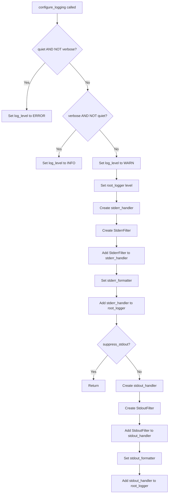

# `cli.py`

## `src.exodus_bundler.cli.parse_args` · *function*

*No documentation generated.*

## `src.exodus_bundler.cli.configure_logging` · *function*

## Summary:
Configures the application's logging system with level control and dual-stream output routing.

## Description:
Sets up logging for the Exodus bundler application with configurable verbosity levels and output routing between stdout and stderr. This function establishes the root logger's level and configures two stream handlers: one for stderr that only shows warnings and errors, and another for stdout that shows debug and info messages. The function allows suppressing stdout output entirely when needed.

The function is extracted into its own component to separate logging configuration concerns from the main application logic, enabling clean separation of concerns and making the logging setup reusable across different command-line entry points.

## Args:
    quiet (bool): When True, sets logging level to ERROR, suppressing INFO and DEBUG messages.
    verbose (bool): When True, sets logging level to INFO, showing detailed progress information.
    suppress_stdout (bool): When True, disables stdout logging output. Defaults to False.

## Returns:
    None: This function modifies global logging state and returns nothing.

## Raises:
    None explicitly raised by this function.

## Constraints:
    Preconditions:
        - The root_logger from exodus_bundler must be properly initialized
        - quiet and verbose parameters should not both be True (though the function handles this gracefully)
        
    Postconditions:
        - The root_logger level is set to WARN, ERROR, or INFO based on quiet/verbose flags
        - stderr handler is configured to show WARNING and ERROR messages
        - stdout handler is configured to show DEBUG and INFO messages (unless suppressed)
        - Both handlers are added to the root_logger

## Side Effects:
    - Modifies the global root_logger configuration
    - Adds StreamHandlers to the root_logger
    - Configures custom filters on the handlers
    - May alter the application's console output behavior

## Control Flow:


## `src.exodus_bundler.cli.StderrFilter` · *class*

## Summary:
A logging filter that returns True only for WARNING and ERROR level log records.

## Description:
The StderrFilter class extends logging.Filter and overrides the filter method to return True only for log records with WARNING or ERROR severity levels. All other log levels will return False, effectively filtering them out.

## State:
- Inherits from `logging.Filter`
- No instance attributes
- The `filter` method takes a single parameter `record` of type `logging.LogRecord`
- No initialization parameters required

## Lifecycle:
- Creation: Instantiated normally as part of logging configuration
- Usage: Called automatically by Python's logging system when processing log records
- Destruction: Handled by Python's garbage collector

## Method Map:
```mermaid
graph TD
    A[Log Record] --> B[StderrFilter.filter()]
    B --> C{Level in (WARN, ERROR)?}
    C -->|Yes| D[Return True]
    C -->|No| E[Return False]
```

## Raises:
- No exceptions raised by `__init__` as it inherits from `logging.Filter`
- No exceptions raised by `filter` method under normal operation

## Example:
```python
import logging
from exodus_bundler.cli import StderrFilter

# Create a filter instance
filter_instance = StderrFilter()

# Test with different log levels
record_warn = logging.LogRecord(name="test", level=logging.WARNING, pathname="", lineno=0, msg="warning", args=(), exc_info=None)
record_info = logging.LogRecord(name="test", level=logging.INFO, pathname="", lineno=0, msg="info", args=(), exc_info=None)

# Apply filter
result_warn = filter_instance.filter(record_warn)   # Returns True
result_info = filter_instance.filter(record_info)   # Returns False
```

### `src.exodus_bundler.cli.StderrFilter.filter` · *method*

## Summary:
Filters log records to only allow WARNING and ERROR level messages to pass through.

## Description:
This method implements a logging filter that determines whether a log record should be processed by the associated handler. It specifically allows only WARNING and ERROR level log messages to continue through the logging pipeline, filtering out all other log levels.

## Args:
    record (logging.LogRecord): The log record to be filtered

## Returns:
    bool: True if the record's level is either WARNING or ERROR, False otherwise

## Raises:
    None

## State Changes:
    Attributes READ: None
    Attributes WRITTEN: None

## Constraints:
    Preconditions: The record parameter must be a valid logging.LogRecord instance
    Postconditions: The method always returns a boolean value indicating whether the record should be processed

## Side Effects:
    None

## `src.exodus_bundler.cli.StdoutFilter` · *class*

## Summary:
A logging filter that permits only DEBUG and INFO level messages to pass through.

## Description:
The StdoutFilter class is a logging filter that implements the filter method to return True only for log records with level numbers equal to logging.DEBUG or logging.INFO. This prevents WARNING, ERROR, and CRITICAL level messages from passing through the filter.

This class inherits from logging.Filter and overrides the filter method to provide custom filtering behavior.

## State:
- The class inherits from logging.Filter and maintains no additional instance state
- The filter method takes a single parameter 'record' of type logging.LogRecord
- The method returns a boolean value indicating whether the record should be processed

## Lifecycle:
- Creation: Instantiated as a standard logging.Filter subclass with no required arguments
- Usage: Called automatically by the Python logging system when processing log records
- Destruction: Managed by Python's garbage collection; no explicit cleanup required

## Method Map:
```mermaid
graph TD
    A[Log Record] --> B[StdoutFilter.filter()]
    B --> C{levelno in (DEBUG, INFO)?}
    C -->|Yes| D[Return True]
    C -->|No| E[Return False]
```

## Raises:
- No exceptions are raised by the filter method itself
- The constructor does not raise exceptions as it inherits default behavior from logging.Filter

## Example:
```python
import logging
from exodus_bundler.cli import StdoutFilter

# Create the filter
filter_instance = StdoutFilter()

# Configure logger with the filter
logger = logging.getLogger('my_app')
handler = logging.StreamHandler()
handler.addFilter(filter_instance)
logger.addHandler(handler)
logger.setLevel(logging.DEBUG)

# These will be processed by the filter:
logger.debug("Debug message")  # Will pass through
logger.info("Info message")    # Will pass through

# These will be filtered out:
logger.warning("Warning message")  # Will be suppressed
logger.error("Error message")      # Will be suppressed
```

### `src.exodus_bundler.cli.StdoutFilter.filter` · *method*

## Summary:
Filters log records to only allow DEBUG and INFO level messages to pass through.

## Description:
This method implements a logging filter that selectively processes log records based on their severity level. It is designed to suppress WARNING, ERROR, and CRITICAL level messages while allowing DEBUG and INFO level messages to continue through the logging pipeline. This filter is typically applied to stdout handlers to reduce noise in standard output logs, ensuring that only relevant informational and debugging messages are displayed.

The filter method is part of the StdoutFilter class, which extends logging.Filter. It's commonly used in command-line interfaces to control verbosity of output by filtering out less important log levels.

## Args:
    record (logging.LogRecord): The log record to be filtered

## Returns:
    bool: True if the record level is logging.DEBUG or logging.INFO, False otherwise

## Raises:
    None

## State Changes:
    Attributes READ: None
    Attributes WRITTEN: None

## Constraints:
    Preconditions: The record parameter must be a valid logging.LogRecord instance
    Postconditions: The method always returns a boolean value indicating whether the record should be processed

## Side Effects:
    None

## `src.exodus_bundler.cli.main` · *function*

## Summary
Entry point for the Exodus bundler command-line interface that processes arguments, configures logging, handles stdin input, and orchestrates bundle creation.

## Description
The `main` function serves as the primary entry point for the Exodus bundler CLI application. It coordinates the entire bundling workflow by parsing command-line arguments, setting up appropriate output destinations, configuring logging behavior, processing standard input for additional dependencies, and finally invoking the bundle creation logic.

This function is extracted into its own component to encapsulate the complete CLI execution flow while separating concerns from the underlying bundle creation and argument parsing logic. It provides a clean interface between the command-line interface and the core bundling functionality.

## Args
    args (list[str], optional): Command-line arguments to parse. If None, uses sys.argv. Defaults to None.
    namespace (argparse.Namespace, optional): Namespace object to populate with parsed arguments. If None, creates a new one. Defaults to None.

## Returns
    None: This function does not return a value directly, but may exit the program with status code 1 on fatal errors.

## Raises
    SystemExit: Raised with exit code 1 when a FatalError is encountered during bundle creation.

## Constraints
    Preconditions:
        - The exodus_bundler module must be properly installed and importable
        - Required system tools (like ldd for dependency detection) must be available if used
        - Input files specified in arguments must exist and be readable
        - Standard input must be readable if not connected to a terminal
        
    Postconditions:
        - Logging is properly configured based on quiet/verbose flags
        - Output destination is determined (stdout, file, or default path)
        - All dependencies are resolved and added to the bundle
        - Bundle is created successfully or program exits with error code

## Side Effects
    - Reads command-line arguments from sys.argv or provided args parameter
    - Configures global logging settings via configure_logging
    - Reads from stdin when not connected to a terminal
    - Writes to stdout/stderr based on logging configuration and output destination
    - May create files on disk at the specified output location
    - May modify global logging configuration state

## Control Flow
```mermaid
flowchart TD
    A[main called] --> B[Parse command-line arguments]
    B --> C{output is None?}
    C -- Yes --> D{stdout is TTY?}
    D -- Yes --> E[Set default output path]
    D -- No --> F[Set output to "-"]
    C -- No --> G[Skip default output setup]
    G --> H[Extract quiet/verbose flags]
    H --> I[Calculate suppress_stdout flag]
    I --> J[Configure logging]
    J --> K{stdin is not TTY?}
    K -- Yes --> L[Read stdin content]
    L --> M[Extract paths from stdin]
    M --> N[Append extracted paths to args['add']]
    K -- No --> O[Skip stdin processing]
    O --> P[Try to create bundle]
    P --> Q{FatalError raised?}
    Q -- Yes --> R[Log error message]
    R --> S[Log fatal error details]
    S --> T[Exit with code 1]
    Q -- No --> U[Normal completion]
```

## Examples
    # Basic usage with single executable
    main(['./myapp'])
    
    # Usage with output specification
    main(['./myapp', '-o', 'my-bundle.sh'])
    
    # Usage with additional files and verbose output
    main(['./myapp', '-a', '/etc/config.conf', '-v'])
    
    # Usage with stdin input (piped dependencies)
    echo "/lib/libfoo.so" | main(['./myapp'])
```

