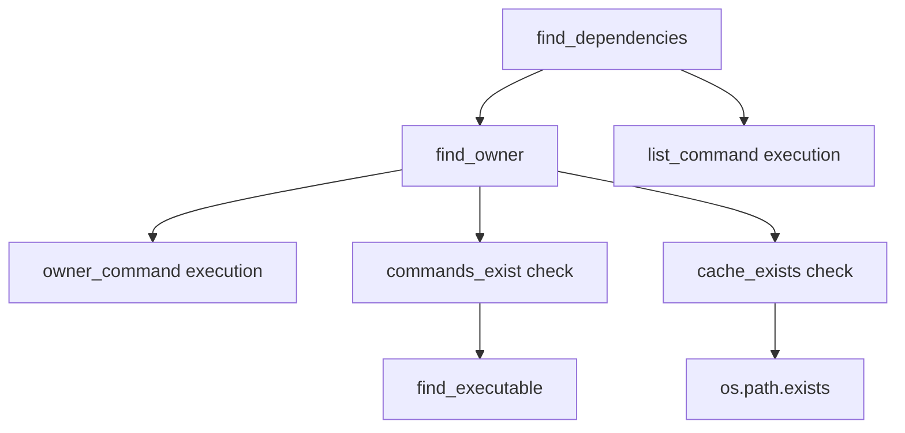

# `dependency_detection.py`

## `src.exodus_bundler.dependency_detection.PackageManager` · *class*

## Summary:
A base class for package managers that provides methods to discover file dependencies and ownership using system commands.

## Description:
The PackageManager class serves as an abstract base class that defines the interface for package management systems. It provides methods to find dependencies of a file and determine which package owns a given file path. This class is designed to be subclassed by specific package manager implementations (like apt, yum, etc.) that set the appropriate class variables like cache_directory, list_command, etc.

## State:
- cache_directory (str): Path to the package manager's cache directory. Must be set by subclasses.
- list_command (list[str]): Command and arguments to list package dependencies. Must be set by subclasses.
- list_regex (str): Regular expression pattern to extract dependency paths from list command output. Defaults to '(.*)'.
- owner_command (list[str]): Command and arguments to find package owner of a file. Must be set by subclasses.
- owner_regex (str): Regular expression pattern to extract package name from owner command output. Defaults to '(.*)'.

## Lifecycle:
- Creation: Instantiate by subclassing and setting required class variables (cache_directory, list_command, owner_command)
- Usage: Call find_dependencies() with a file path to get its dependencies, or find_owner() with a file path to get its owning package
- Destruction: No special cleanup required; uses standard Python object lifecycle

## Method Map:


## Raises:
- None explicitly raised by __init__
- May return None from find_dependencies() or find_owner() when preconditions aren't met

## Example:
```python
# Typical usage would involve subclassing:
class AptPackageManager(PackageManager):
    cache_directory = '/var/cache/apt'
    list_command = ['dpkg', '-L']
    owner_command = ['dpkg', '-S']

# Then use it:
pm = AptPackageManager()
dependencies = pm.find_dependencies('/usr/bin/python3')
```

### `src.exodus_bundler.dependency_detection.PackageManager.find_dependencies` · *method*

## Summary:
Finds and returns the list of file dependencies for a given path by querying an external tool.

## Description:
This method determines the dependencies of a specified file by first identifying the "owner" of the file using the find_owner method, then executing an external command to list those dependencies. It parses the output using a regular expression pattern to extract dependency paths and filters out directories, returning only existing files.

## Args:
    path (str): The absolute or relative path to the file whose dependencies are to be discovered.

## Returns:
    list[str] or None: A list of absolute paths to dependency files, or None if no owner could be determined for the input path.

## Raises:
    None explicitly raised, though underlying subprocess operations may raise OSError or other subprocess-related exceptions.

## State Changes:
    Attributes READ: self.find_owner, self.list_command, self.list_regex
    Attributes WRITTEN: None

## Constraints:
    Preconditions: 
    - The PackageManager instance must have valid list_command and owner_command configured
    - The path must be a valid filesystem path
    - The external tools referenced by list_command and owner_command must be available in PATH
    
    Postconditions:
    - Returns None if no owner can be determined for the input path
    - Returns a list containing only existing regular files (not directories)
    - All returned paths are absolute paths

## Side Effects:
    - Executes external subprocess commands defined by self.list_command
    - Reads from the filesystem to verify existence of dependency paths
    - May perform I/O operations to execute external commands and read their output

### `src.exodus_bundler.dependency_detection.PackageManager.find_owner` · *method*

## Summary:
Finds the package or file that owns a given path by executing a system command and parsing its output.

## Description:
This method determines which package or file is responsible for managing a specific path by invoking an external command (typically from a package manager like dpkg or rpm). It first validates that required resources (cache directory and commands) are available before proceeding with the lookup. The method is designed to be part of a dependency resolution pipeline where knowing the owner of a file is necessary to enumerate its dependencies.

## Args:
    path (str): The absolute path to a file or directory whose owner needs to be identified.

## Returns:
    str or None: The name of the package or file that owns the given path, or None if the cache or commands are not available, or if no match is found in the command output.

## Raises:
    None explicitly raised, though underlying subprocess operations may raise OSError or other exceptions.

## State Changes:
    Attributes READ: self.cache_exists, self.commands_exist, self.owner_command, self.owner_regex
    Attributes WRITTEN: None

## Constraints:
    Preconditions: 
    - The PackageManager instance must have properly initialized owner_command and owner_regex attributes
    - The cache_directory attribute must be set appropriately
    - The system must have the required external commands available in PATH
    
    Postconditions:
    - Returns None if either cache_exists or commands_exist properties return False
    - Returns None if no match is found in command output using owner_regex
    - Returns the first captured group from owner_regex match if successful

## Side Effects:
    - Executes an external subprocess command
    - Reads environment variables (copies os.environ)
    - May cause I/O operations through subprocess communication

### `src.exodus_bundler.dependency_detection.PackageManager.cache_exists` · *method*

## Summary:
Checks whether the package manager's cache directory exists and is a valid directory.

## Description:
This property determines if the cache directory configured for the package manager exists and is a directory. It is used by other methods in the PackageManager class to validate prerequisites before performing operations that depend on cached data.

## Args:
    None

## Returns:
    bool: True if the cache directory exists and is a directory; False otherwise.

## Raises:
    None

## State Changes:
    Attributes READ: self.cache_directory
    Attributes WRITTEN: None

## Constraints:
    Preconditions: The PackageManager instance must have a cache_directory attribute set.
    Postconditions: The method returns a boolean value indicating the existence and type of the cache directory.

## Side Effects:
    I/O: Performs filesystem operations to check directory existence using os.path.exists() and os.path.isdir().

### `src.exodus_bundler.dependency_detection.PackageManager.commands_exist` · *method*

## Summary:
Checks whether the required system commands for package management exist in the environment.

## Description:
This method verifies that both the package listing command and owner command are available in the system PATH. It is used to validate that the necessary tools are installed before attempting package operations.

## Args:
    None

## Returns:
    bool: True if both commands exist, False otherwise

## Raises:
    None explicitly raised

## State Changes:
    Attributes READ: self.list_command, self.owner_command
    Attributes WRITTEN: None

## Constraints:
    Preconditions: 
    - self.list_command must be a sequence with at least one element
    - self.owner_command must be a sequence with at least one element
    
    Postconditions:
    - Returns a boolean value indicating existence of both commands

## Side Effects:
    I/O: Calls find_executable which may perform filesystem operations to locate executables

## `src.exodus_bundler.dependency_detection.Apt` · *class*

## Summary:
A package manager implementation for Debian-based systems using the APT package manager and dpkg commands.

## Description:
The Apt class implements the PackageManager interface specifically for Debian, Ubuntu, and other Debian-based Linux distributions. It provides methods to discover file dependencies and determine package ownership using dpkg system commands. This class should be instantiated as part of the dependency detection system to analyze files and their package relationships in Debian-based environments.

## State:
- cache_directory (str): Path to the APT cache directory, set to '/var/cache/apt'
- list_command (list[str]): Command to list package dependencies, set to ['dpkg-query', '-L']
- list_regex (str): Regular expression pattern to extract dependency paths, set to '(.+)'
- owner_command (list[str]): Command to find package owner of a file, set to ['dpkg', '-S']
- owner_regex (str): Regular expression pattern to extract package names, set to '(.+): '

## Lifecycle:
- Creation: Instantiate directly as Apt() - no constructor parameters required
- Usage: Call inherited methods find_dependencies() and find_owner() to analyze file dependencies and ownership
- Destruction: Standard Python object destruction; no special cleanup needed

## Method Map:


## Raises:
- None explicitly raised by __init__
- Inherited methods may raise exceptions from subprocess calls or file system operations

## Example:
```python
# Create an Apt package manager instance
apt_manager = Apt()

# Find dependencies of a file
dependencies = apt_manager.find_dependencies('/usr/bin/python3')

# Find which package owns a file
owner_package = apt_manager.find_owner('/lib/x86_64-linux-gnu/libc.so.6')
```

## `src.exodus_bundler.dependency_detection.Pacman` · *class*

## Summary:
A package manager implementation for Arch Linux using the pacman package manager system.

## Description:
The Pacman class provides dependency detection capabilities specifically for Arch Linux systems by implementing the PackageManager abstract base class. It uses pacman commands to discover file dependencies and determine which packages own specific files. This class is designed to work with Arch Linux's package management system and provides the necessary configuration through class variables.

## State:
- cache_directory (str): Path to the pacman cache directory, set to '/var/cache/pacman'
- list_command (list[str]): Command to list package file dependencies, set to ['pacman', '-Ql']
- list_regex (str): Regular expression pattern to extract file paths from list command output, set to r'.*\s+(\/.+)'
- owner_command (list[str]): Command to find package ownership of files, set to ['pacman', '-Qo']
- owner_regex (str): Regular expression pattern to extract package names from owner command output, set to r' is owned by (.*)\s+.*'

## Lifecycle:
- Creation: Instantiate directly as the class is designed to be used as-is with no constructor parameters
- Usage: Call find_dependencies() or find_owner() methods to discover package dependencies or ownership
- Destruction: Uses standard Python object lifecycle with no special cleanup required

## Method Map:


## Raises:
- None explicitly raised by __init__
- May return None from find_dependencies() or find_owner() when preconditions aren't met

## Example:
```python
# Create instance and find dependencies
pacman_manager = Pacman()
dependencies = pacman_manager.find_dependencies('/usr/bin/python3')

# Find package ownership
owner = pacman_manager.find_owner('/lib/libc.so.6')
```

## `src.exodus_bundler.dependency_detection.Yum` · *class*

## Summary:
Represents a YUM package manager implementation for dependency detection using RPM-based systems.

## Description:
The Yum class implements the PackageManager abstract base class specifically for YUM package managers used in Red Hat-based Linux distributions. It provides methods to discover file dependencies and ownership using RPM commands. This class is designed to be instantiated directly as it provides all required configuration through class variables.

## State:
- cache_directory (str): Path to the YUM cache directory, set to '/var/cache/yum'
- list_command (list[str]): RPM command to list package file contents, set to ['rpm', '-ql']
- list_regex (str): Regular expression pattern to extract dependency paths from rpm -ql output, set to r'(.+)'
- owner_command (list[str]): RPM command to find package owner of a file, set to ['rpm', '-qf']
- owner_regex (str): Regular expression pattern to extract package name from rpm -qf output, set to r'(.+)'

## Lifecycle:
- Creation: Instantiate directly as all configuration is provided through class variables
- Usage: Call find_dependencies() with a file path to get its dependencies, or find_owner() with a file path to get its owning package
- Destruction: No special cleanup required; uses standard Python object lifecycle

## Method Map:


## Raises:
- None explicitly raised by __init__
- May return None from find_dependencies() or find_owner() when preconditions aren't met

## Example:
```python
# Create YUM package manager instance
yum_pm = Yum()

# Find dependencies of a file
dependencies = yum_pm.find_dependencies('/usr/bin/python3')

# Find owner of a file
owner = yum_pm.find_owner('/lib/libc.so.6')
```

## `src.exodus_bundler.dependency_detection.detect_dependencies` · *function*

## Summary:
Detects project dependencies by querying multiple package managers until the first successful result is found.

## Description:
This function attempts to identify project dependencies by sequentially querying different package managers. It iterates through a predefined collection of package manager instances, each responsible for detecting dependencies for a specific package management system (such as npm, pip, etc.). The function returns the first set of dependencies discovered, making it efficient for projects that may use different package management systems.

The function is designed to be extensible - new package managers can be added to the package_managers collection to support additional dependency detection strategies without modifying the core logic. This approach allows for flexible dependency detection across different package ecosystems.

## Args:
    path (str): The file system path to the project directory for which dependencies should be detected.

## Returns:
    list[str] or None: A list of detected dependency names if dependencies are found, or None if no dependencies are detected by any package manager.

## Raises:
    None explicitly raised by this function.

## Constraints:
    Preconditions:
    - The path parameter must be a valid string representing a directory path.
    - The package_managers variable must be properly initialized with package manager instances before calling this function.
    - Each package manager instance in package_managers must have a find_dependencies method that accepts a path parameter.

    Postconditions:
    - The function returns either a list of dependency strings or None.
    - No side effects occur during the dependency detection process.

## Side Effects:
    None explicitly stated.

## Control Flow:
```mermaid
flowchart TD
    A[Start detect_dependencies] --> B{package_managers available?}
    B -- Yes --> C[Iterate through package_managers]
    C --> D[Call package_manager.find_dependencies(path)]
    D --> E{Dependencies found?}
    E -- Yes --> F[Return dependencies]
    E -- No --> G[Continue to next package_manager]
    G --> H{More package_managers?}
    H -- Yes --> C
    H -- No --> I[Return None]
    F --> J[End]
    I --> J
```

## Examples:
    # Basic usage
    deps = detect_dependencies("/path/to/project")
    if deps:
        print(f"Found {len(deps)} dependencies")
    else:
        print("No dependencies detected")

