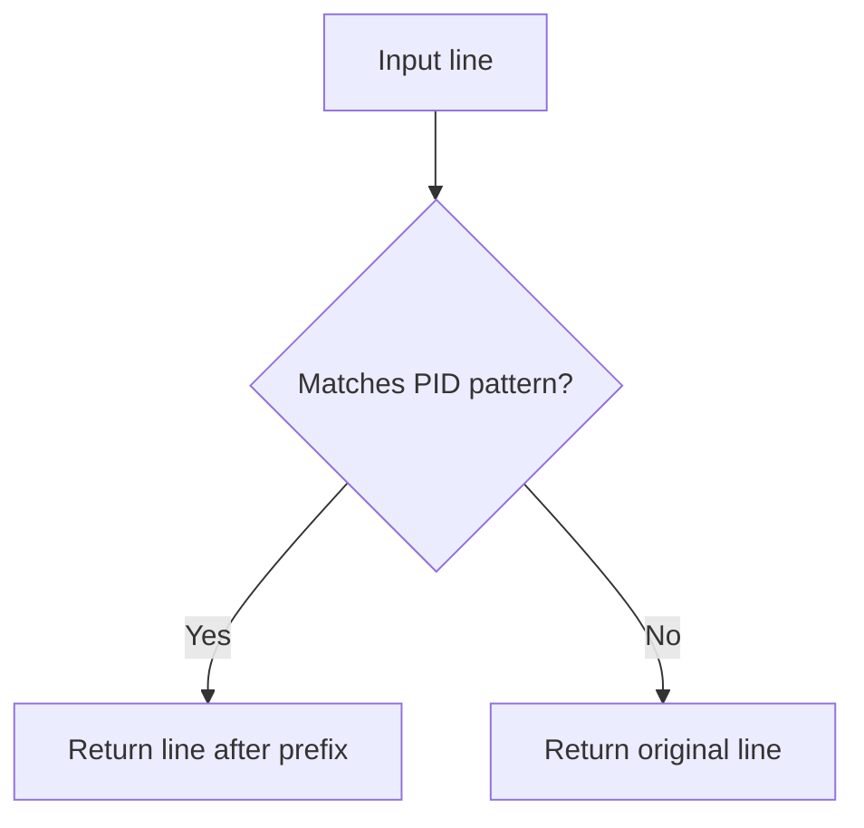

# `input_parsing.py`

## `src.exodus_bundler.input_parsing.extract_exec_path` · *function*

## Summary:
Extracts the executable path from a log line containing an execution method call.

## Description:
Processes a log line to extract the executable path from execution method calls. This function strips process ID prefixes and parses method calls that follow the pattern "method_name(\"executable_path\", ...)" to return just the executable path. The function expects a global variable `exec_methods` to be defined in the module scope containing the list of recognized execution method names.

## Args:
    line (str): A log line that may contain an execution method call with quoted executable path.

## Returns:
    str or None: The extracted executable path if a matching execution method is found and properly formatted, otherwise None.

## Raises:
    None: This function does not explicitly raise exceptions.

## Constraints:
    Preconditions:
        - Input line must be a string
        - Module must define `exec_methods` as a list of method names
    Postconditions:
        - Returns either the extracted executable path or None
        - Input line is not modified

## Side Effects:
    None: This function has no side effects.

## Control Flow:
```mermaid
flowchart TD
    A[Input line] --> B[Strip PID prefix]
    B --> C[Iterate through exec_methods]
    C --> D{Line starts with method + '("'?}
    D -- Yes --> E[Remove method prefix]
    E --> F[Split by '", ']
    F --> G{Parts length > 1?}
    G -- Yes --> H[Return first part (executable path)]
    G -- No --> I[Continue to next method]
    D -- No --> J[Continue to next method]
    J --> K{All methods tried?}
    K -- Yes --> L[Return None]
    K -- No --> C
```

## Examples:
    >>> extract_exec_path('[pid 1234] execve("/bin/bash", ...)')
    '/bin/bash'
    
    >>> extract_exec_path('execv("/usr/bin/python", ...)')
    '/usr/bin/python'
    
    >>> extract_exec_path('INFO: Some unrelated log')
    None
    
    >>> extract_exec_path('execve("/bin/ls")')  # No comma after path
    None
```

## `src.exodus_bundler.input_parsing.extract_open_path` · *function*

## Summary:
Extracts file paths from system call log entries representing open() or openat() operations.

## Description:
Parses log lines containing system call information to extract file paths from open() and openat() system calls. This function specifically processes log entries that represent file opening operations, filtering out invalid or irrelevant entries based on system call flags and error conditions.

The function is designed to work with log output from system call tracing tools, extracting meaningful file path information while filtering out:
- Entries with ENOENT (file not found) errors
- Non-read-only file operations (missing O_RDONLY flag)
- Directory operations (O_DIRECTORY flag present)

This extraction logic is separated from the main parsing logic to provide a clean interface for retrieving file paths from system call traces.

## Args:
    line (str): A log line potentially containing an open() or openat() system call entry.

## Returns:
    str or None: The extracted file path if the line represents a valid read-only file open operation, or None if the line doesn't match the expected format or fails validation checks.

## Raises:
    None: This function does not explicitly raise exceptions.

## Constraints:
    Preconditions:
        - Input line must be a string
        - Line should contain system call information in the expected format
    Postconditions:
        - Returns either a valid file path string or None
        - The returned path represents a file opened with read-only permissions
        - The returned path does not correspond to a directory operation

## Side Effects:
    None: This function has no side effects beyond processing the input string.

## Control Flow:
```mermaid
flowchart TD
    A[Input line] --> B[Remove PID prefix]
    B --> C{Starts with 'openat(AT_FDCWD, "'?}
    C -- No --> D{Starts with 'open("?}
    D -- No --> E[Return None]
    D -- Yes --> F[Split by '", ']
    F --> G{Exactly 2 parts?}
    G -- No --> E[Return None]
    G -- Yes --> H{Contains ENOENT?}
    H -- Yes --> E[Return None]
    H -- No --> I{Has O_RDONLY?}
    I -- No --> E[Return None]
    I -- Yes --> J{Has O_DIRECTORY?}
    J -- Yes --> E[Return None]
    J -- No --> K[Return first part (file path)]
```

## Examples:
    >>> extract_open_path('[pid 1234] openat(AT_FDCWD, "/etc/passwd", O_RDONLY|O_CLOEXEC) = 3')
    '/etc/passwd'
    
    >>> extract_open_path('[pid 5678] open("/tmp/test.txt", O_RDONLY) = 4')
    '/tmp/test.txt'
    
    >>> extract_open_path('[pid 9012] openat(AT_FDCWD, "/var/log/app.log", O_WRONLY) = -1 (EROFS)')
    None
    
    >>> extract_open_path('[pid 3456] openat(AT_FDCWD, "/home/user", O_RDONLY|O_DIRECTORY) = 5')
    None
```

## `src.exodus_bundler.input_parsing.extract_stat_path` · *function*

## Summary:
Extracts file paths from stat() system call log entries by parsing structured log lines.

## Description:
Processes log lines containing system call information and extracts file paths from stat() calls. This function is designed to parse log entries that follow the pattern 'stat("file_path", ...)' and return the file path portion while filtering out failed stat calls (those containing ENOENT).

## Args:
    line (str): A log line that may contain a stat() system call entry.

## Returns:
    str or None: The extracted file path if the line matches the stat() pattern and is not a failed call, otherwise None.

## Raises:
    None: This function does not explicitly raise exceptions.

## Constraints:
    Preconditions:
        - Input must be a string
    Postconditions:
        - Returns either a file path string or None
        - Only returns file paths from successful stat() calls (no ENOENT errors)

## Side Effects:
    None: This function has no side effects.

## Control Flow:
```mermaid
flowchart TD
    A[Input line] --> B[Remove PID prefix]
    B --> C{Starts with "stat(\"?}
    C -- No --> D[Return None]
    C -- Yes --> E[Split by "\", "]
    E --> F{Exactly 2 parts AND no ENOENT?}
    F -- No --> D[Return None]
    F -- Yes --> G[Return first part (file path)]
```

## Examples:
    >>> extract_stat_path('stat("test.txt", 0x7f8b8c000000)')
    'test.txt'
    
    >>> extract_stat_path('stat("nonexistent.txt", ENOENT)')
    None
    
    >>> extract_stat_path('[pid 1234] stat("config.json", 0x7f8b8c000000)')
    'config.json'
```

## `src.exodus_bundler.input_parsing.extract_paths` · *function*

## Summary
Extracts unique file paths from log content, supporting both regular and strace mode parsing with optional existence filtering.

## Description
Processes log content to extract file paths from various system call traces. When in strace mode (detected by presence of execution paths), it parses lines using specialized extraction functions for execve, open, and stat calls. It filters results based on blacklisted directories and optionally validates that extracted paths exist and are readable files. The function distinguishes between regular mode (returns all lines) and strace mode (parses system call logs).

## Args
    content (str): Log content to parse, typically containing system call traces or regular text lines.
    existing_only (bool): When True, only returns paths that exist and are readable files; when False, returns all extracted paths regardless of existence. Defaults to True.

## Returns
    list[str]: A list of unique file paths extracted from the content. In strace mode, returns paths from system call traces; in regular mode, returns all non-empty lines from the content.

## Raises
    None: This function does not explicitly raise exceptions.

## Constraints
    Preconditions:
        - Content must be a string
        - Module must define `blacklisted_directories` as a list of directory prefixes to exclude
        - Module must define `exec_methods` as a list of recognized execution method names for `extract_exec_path`
    Postconditions:
        - Returns a list of unique file paths (duplicates removed)
        - All returned paths are valid file paths (not directories)
        - All returned paths are either existing files or all paths when `existing_only=False`

## Side Effects
    None: This function has no side effects beyond standard OS path operations.

## Control Flow
```mermaid
flowchart TD
    A[Input content] --> B[Split into lines and strip whitespace]
    B --> C{Any non-empty lines?}
    C -- No --> D[Return empty list]
    C -- Yes --> E[Check if strace mode (first line has exec path)]
    E --> F{Not strace mode?}
    F -- Yes --> G[Return all lines as-is]
    F -- No --> H[Initialize empty paths set]
    H --> I[Process each line]
    I --> J[Extract path using exec/open/stat parsers]
    J --> K{Path extracted?}
    K -- No --> L[Continue to next line]
    K -- Yes --> M[Check if path is blacklisted]
    M --> N{Is blacklisted?}
    N -- Yes --> L[Continue to next line]
    N -- No --> O{existing_only=False?}
    O -- Yes --> P[Add path to set and continue]
    O -- No --> Q[Check if path exists, is readable, and not directory]
    Q --> R{Valid file path?}
    R -- Yes --> S[Add path to set and continue]
    R -- No --> L[Continue to next line]
    L --> T{More lines?}
    T -- Yes --> I
    T -- No --> U[Convert set to list and return]
```

## Examples
    >>> extract_paths('execve("/bin/bash", ...)\\nopen("/etc/passwd", O_RDONLY)\\n')
    ['/bin/bash', '/etc/passwd']
    
    >>> extract_paths('execve("/bin/bash", ...)\\nopen("/etc/passwd", O_RDONLY)\\n', existing_only=False)
    ['/bin/bash', '/etc/passwd']
    
    >>> extract_paths('regular line 1\\nregular line 2\\n')
    ['regular line 1', 'regular line 2']
    
    >>> extract_paths('')
    []

## `src.exodus_bundler.input_parsing.strip_pid_prefix` · *function*

## Summary:
Removes process ID prefix patterns from the beginning of log lines.

## Description:
Strips leading PID prefix patterns formatted as "[pid <number>]" followed by whitespace from log line strings. This function is designed to clean log output by removing process identification information that may interfere with parsing or analysis.

## Args:
    line (str): Input log line that may contain a PID prefix pattern at the beginning.

## Returns:
    str: The input line with PID prefix removed if present, otherwise returns the original line unchanged.

## Raises:
    None: This function does not raise any exceptions.

## Constraints:
    Preconditions:
        - Input must be a string
    Postconditions:
        - Output is always a string
        - If PID prefix is present, it is completely removed from the beginning of the line
        - If no PID prefix is present, the original line is returned unchanged

## Side Effects:
    None: This function has no side effects.

## Control Flow:


## Examples:
    >>> strip_pid_prefix("[pid 1234] INFO: Application started")
    'INFO: Application started'
    
    >>> strip_pid_prefix("ERROR: File not found")
    'ERROR: File not found'
    
    >>> strip_pid_prefix("[pid 5678]   DEBUG: Processing data")
    'DEBUG: Processing data'
```

