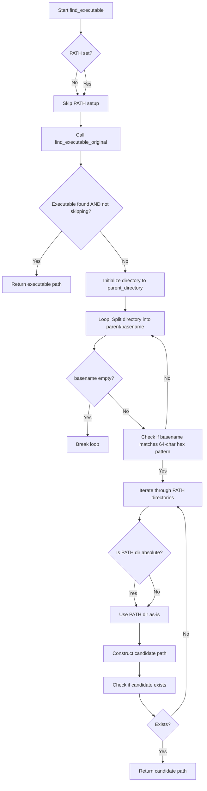
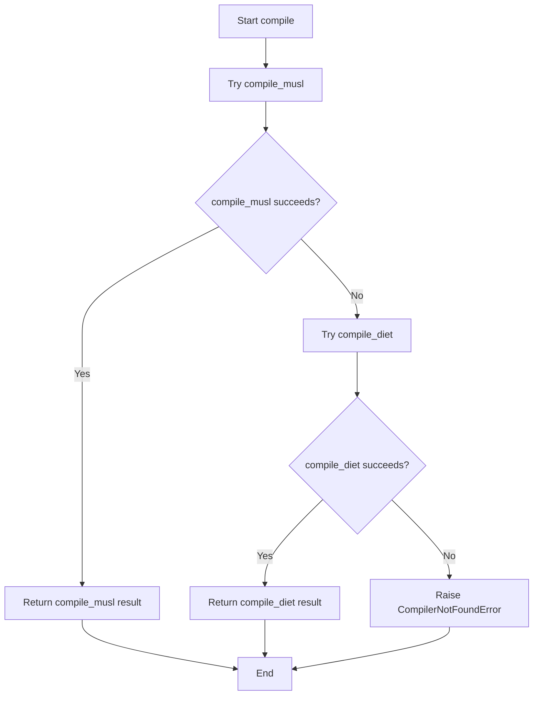
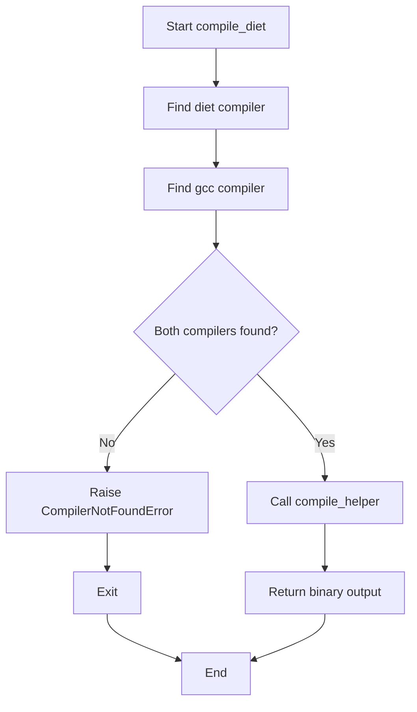
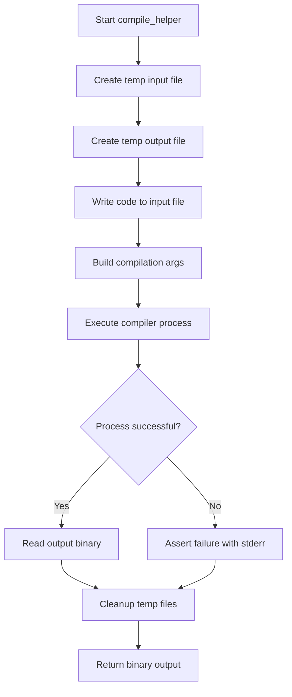
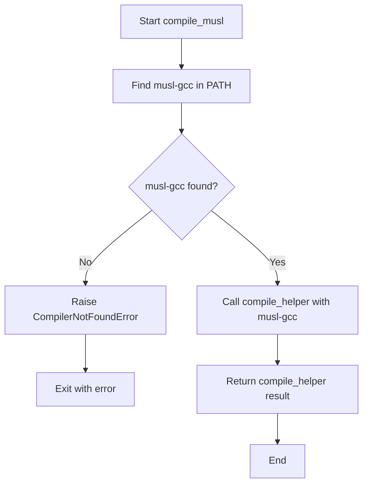
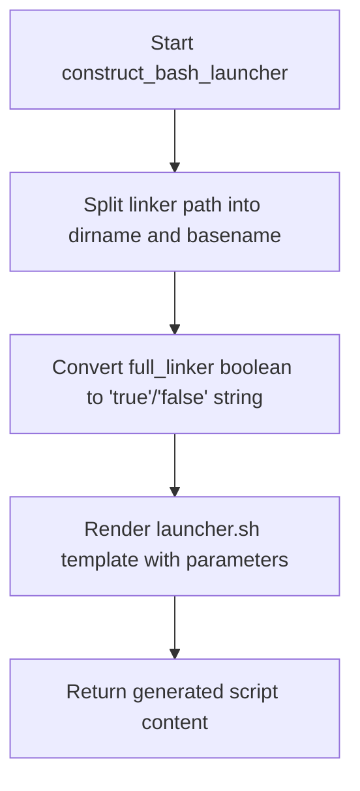
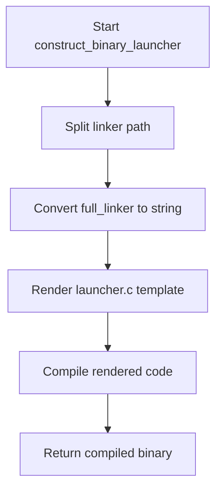

# `launchers.py`

## `src.exodus_bundler.launchers.CompilerNotFoundError` · *class*

*No documentation generated.*

## `src.exodus_bundler.launchers.find_executable` · *function*

## Summary:
Locates an executable by searching standard PATH or in nested directory structures with 64-character hexadecimal names.

## Description:
This function attempts to find an executable binary by first checking the standard system PATH using distutils.spawn.find_executable. If that fails or is skipped via the skip_original_for_testing flag, it implements a custom search mechanism that traverses directory hierarchies looking for directories with 64-character hexadecimal names (commonly used as unique identifiers) and searches for the executable within those paths.

Note: The implementation contains undefined variables (parent_directory, find_executable_original) and appears to be incomplete or buggy.

## Args:
    binary_name (str): Name of the executable to find
    skip_original_for_testing (bool): If True, skips the initial standard PATH search and goes directly to the custom search logic. Defaults to False.

## Returns:
    str or None: Path to the executable if found, None otherwise

## Raises:
    None explicitly raised in the provided code

## Constraints:
    Preconditions:
    - binary_name must be a non-empty string
    - PATH environment variable should be accessible
    
    Postconditions:
    - Returns either a valid path string or None
    - Does not modify system state except potentially setting PATH environment variable

## Side Effects:
    - May modify os.environ['PATH'] if it's not set
    - Performs filesystem operations to check for executable existence

## Control Flow:


## Examples:
    # Find python executable using standard PATH search
    python_path = find_executable('python')
    
    # Skip standard PATH search for testing purposes  
    custom_path = find_executable('myapp', skip_original_for_testing=True)
```

## `src.exodus_bundler.launchers.compile` · *function*

## Summary:
Attempts to compile C source code using multiple compiler strategies, falling back from musl-gcc to diet compiler if the preferred compiler is unavailable.

## Description:
This function serves as a compiler selection wrapper that attempts to compile C source code using different compilation strategies in a prioritized fallback sequence. It first tries to compile using the musl-gcc compiler, which produces statically-linked binaries suitable for portability. If musl-gcc is not found, it falls back to using the diet compiler with GCC backend. If neither compiler is available, it raises a CompilerNotFoundError.

The function is designed to provide robust compilation capabilities by supporting multiple compiler backends, allowing the bundler system to work across different environments where various compilers might be installed.

## Args:
    code (str): The C source code to compile as a string

## Returns:
    bytes: The compiled binary executable as raw bytes, returned from whichever compilation strategy succeeds

## Raises:
    CompilerNotFoundError: When neither musl-gcc nor diet compiler with GCC are found in the system PATH

## Constraints:
    Preconditions:
        - The code parameter must contain valid C source code
        - At least one of the supported compilers (musl-gcc or diet+gcc) must be installed and accessible via PATH
    
    Postconditions:
        - The function returns a valid compiled binary as bytes when successful
        - The function raises CompilerNotFoundError when no suitable compiler is found

## Side Effects:
    - May execute subprocess calls to compile the C code
    - Creates temporary files during compilation (handled by underlying compile functions)
    - May raise CompilerNotFoundError if required compilers are not found

## Control Flow:


## `src.exodus_bundler.launchers.compile_diet` · *function*

## Summary:
Compiles C source code using the diet compiler and GCC, returning the resulting binary executable.

## Description:
This function serves as a specialized compiler wrapper that utilizes the diet compiler (a fast C compiler) along with GCC for compiling C source code into a static binary executable. It validates the presence of required compilation tools before proceeding with the compilation process.

The function extracts the diet and GCC compiler paths using `find_executable`, ensuring both tools are available on the system. If either compiler is missing, it raises a `CompilerNotFoundError`. Otherwise, it delegates the actual compilation to `compile_helper` with the appropriate compiler arguments.

This extraction into a dedicated function provides a clear responsibility boundary for diet-based compilation while maintaining consistency with other compilation pathways in the bundler system.

## Args:
    code (str): The C source code to compile as a string

## Returns:
    bytes: The compiled binary executable as raw bytes

## Raises:
    CompilerNotFoundError: When either the 'diet' or 'gcc' compiler is not found in the system PATH

## Constraints:
    Preconditions:
        - The system must have both 'diet' and 'gcc' compilers installed and accessible via PATH
        - The code parameter must contain valid C source code
    
    Postconditions:
        - The function returns a valid compiled binary as bytes
        - Temporary files are properly managed by compile_helper

## Side Effects:
    - Creates temporary files for input/output during compilation (managed by compile_helper)
    - Executes a subprocess to run the diet compiler with GCC backend
    - Writes the provided C code to temporary files (managed by compile_helper)
    - Removes temporary files upon completion (managed by compile_helper)

## Control Flow:


## `src.exodus_bundler.launchers.compile_helper` · *function*

## Summary:
Compiles C source code into a static binary executable using temporary files for input/output.

## Description:
This helper function facilitates the compilation of C code by managing temporary file creation, writing source code to disk, executing the compilation process with optimization flags, and returning the resulting binary output. It ensures proper cleanup of temporary files regardless of compilation success or failure.

## Args:
    code (str): The C source code to compile as a string
    initial_args (list[str]): Command-line arguments to pass to the compiler, excluding the automatically added flags

## Returns:
    bytes: The compiled binary executable as raw bytes

## Raises:
    AssertionError: When the compilation process returns a non-zero exit code, indicating compilation failure

## Constraints:
    Preconditions:
        - The system must have a working C compiler installed (accessible via find_executable)
        - The initial_args list must contain valid compiler command-line arguments
        - The code parameter must contain valid C source code
    
    Postconditions:
        - Temporary input and output files are deleted after execution
        - The returned bytes represent a valid compiled binary

## Side Effects:
    - Creates temporary files in the system's temporary directory
    - Writes the provided C code to a temporary .c file
    - Executes a subprocess to run the compiler
    - Removes temporary files upon completion

## Control Flow:


## Examples:
```python
# Basic usage
c_code = '''
#include <stdio.h>
int main() {
    printf("Hello World\\n");
    return 0;
}
'''

# Assuming gcc is available
args = ['gcc']
binary = compile_helper(c_code, args)
```

## `src.exodus_bundler.launchers.compile_musl` · *function*

## Summary:
Compiles C source code using the musl-gcc compiler to produce a statically-linked binary executable.

## Description:
This function locates the musl-gcc compiler in the system PATH and uses it to compile C source code into a static binary. It serves as a specialized wrapper that ensures the musl libc environment is used for compilation, which is useful for creating portable binaries that don't depend on system libc libraries.

The function delegates the actual compilation process to `compile_helper`, which manages temporary files and subprocess execution. This extraction into a separate function allows for clean separation of compiler discovery logic from compilation logic, making the code more modular and testable.

## Args:
    code (str): The C source code to compile as a string

## Returns:
    bytes: The compiled binary executable as raw bytes, returned directly from `compile_helper`

## Raises:
    CompilerNotFoundError: When the musl-gcc compiler cannot be found in the system PATH

## Constraints:
    Preconditions:
        - The system must have musl-gcc installed and available in PATH
        - The code parameter must contain valid C source code
    
    Postconditions:
        - The returned bytes represent a valid compiled binary

## Side Effects:
    - Calls `compile_helper` which creates temporary files and executes a subprocess
    - May raise `CompilerNotFoundError` if musl-gcc is not found

## Control Flow:


## Examples:
```python
# Basic usage
c_code = '''
#include <stdio.h>
int main() {
    printf("Hello World\\n");
    return 0;
}
'''

try:
    binary = compile_musl(c_code)
    # Use the binary...
except CompilerNotFoundError:
    print("musl-gcc compiler not found")
```

## `src.exodus_bundler.launchers.construct_bash_launcher` · *function*

## Summary:
Generates a bash script launcher that wraps a linker command with specified library paths and executable.

## Description:
Creates a bash launcher script that configures environment variables and executes a linker command with proper library path setup. This function is used to create portable launchers that can properly resolve dependencies when executing compiled binaries.

The function extracts directory and basename components from the linker path, converts the boolean flag to shell-compatible string representation, and uses a template-based approach to generate the launcher script.

## Args:
    linker (str): Full path to the linker executable
    library_path (str): Library search path to be set in the launcher
    executable (str): Path to the executable to be launched by the launcher
    full_linker (bool): Flag indicating whether to use full linker path. Defaults to True

## Returns:
    str: Generated bash launcher script content as a string

## Raises:
    None explicitly raised in the provided code

## Constraints:
    Preconditions:
    - linker must be a valid path string
    - library_path must be a valid path string
    - executable must be a valid path string
    - All paths should be accessible when the launcher is executed

    Postconditions:
    - Returns a valid bash script string with proper template substitution
    - The returned script will set LD_LIBRARY_PATH and execute the specified executable

## Side Effects:
    - None directly, but the generated script may perform I/O when executed (file access, process execution)

## Control Flow:


## Examples:
    # Create a launcher for a gcc linker
    launcher_script = construct_bash_launcher(
        linker='/usr/bin/gcc',
        library_path='/opt/mylib:/usr/local/lib',
        executable='./my_program'
    )
    
    # Create a launcher with explicit full linker path disabled
    launcher_script = construct_bash_launcher(
        linker='/usr/bin/gcc',
        library_path='/opt/mylib:/usr/local/lib',
        executable='./my_program',
        full_linker=False
    )

## `src.exodus_bundler.launchers.construct_binary_launcher` · *function*

## Summary:
Constructs a binary launcher by rendering a C template and compiling it into an executable binary.

## Description:
Creates a binary launcher that wraps an executable with specified library paths and linker settings. This function is responsible for generating C source code from a template and compiling it into a runnable binary that can execute the target program with proper linking configuration.

The function extracts directory and basename from the linker path, converts the boolean flag to a string representation, renders a C template with all necessary parameters, and compiles the resulting code into a binary executable.

## Args:
    linker (str): Path to the linker executable, used to extract directory and basename for template rendering
    library_path (str): Library search path to be embedded in the generated launcher
    executable (str): Path to the target executable that the launcher will invoke
    full_linker (bool): Flag indicating whether to use full linker features; defaults to True

## Returns:
    bytes: Compiled binary executable as raw bytes representing the launcher program

## Raises:
    CompilerNotFoundError: When neither musl-gcc nor diet compiler with GCC are found in the system PATH

## Constraints:
    Preconditions:
        - The linker path must be a valid filesystem path
        - The library_path must be a valid path string
        - The executable path must be a valid filesystem path
        - At least one of the supported compilers (musl-gcc or diet+gcc) must be installed and accessible via PATH
    
    Postconditions:
        - The function returns a valid compiled binary as bytes when successful
        - The returned binary is executable and contains the specified library and executable paths

## Side Effects:
    - May execute subprocess calls to compile the C code
    - Creates temporary files during compilation (handled by underlying compile functions)
    - May raise CompilerNotFoundError if required compilers are not found

## Control Flow:


## Examples:
```python
# Basic usage
launcher_binary = construct_binary_launcher(
    linker="/usr/bin/gcc",
    library_path="/opt/myapp/lib",
    executable="/opt/myapp/app"
)

# With explicit full_linker=False
launcher_binary = construct_binary_launcher(
    linker="/usr/bin/ld",
    library_path="/usr/local/lib",
    executable="/usr/bin/myprogram",
    full_linker=False
)
```

