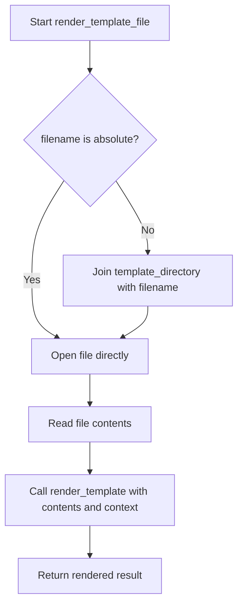

# `templating.py`

## `src.exodus_bundler.templating.render_template` · *function*

## Summary:
Replaces template placeholders in a string with provided context values.

## Description:
Processes a string by replacing all occurrences of placeholders in the format `{{key}}` with their corresponding values from the provided context. This function serves as a minimal template engine for simple string interpolation tasks.

## Args:
    string (str): The template string containing placeholders in the format `{{key}}` to be replaced.
    **context: Keyword arguments where keys are placeholder names and values are the replacement strings.

## Returns:
    str: The input string with all matching placeholders replaced by their corresponding context values.

## Raises:
    None: This function does not raise any exceptions.

## Constraints:
    Preconditions:
        - The input string must be a valid string object
        - All placeholder keys in the string must be present as keyword arguments
    Postconditions:
        - The returned string contains all replacements made according to the context
        - The original string is not modified (immutable operation)

## Side Effects:
    None: This function has no side effects.

## Control Flow:
```mermaid
flowchart TD
    A[Start render_template] --> B{string contains placeholders?}
    B -- Yes --> C[Iterate through context items]
    C --> D[Replace {{key}} with value]
    D --> E[Update string]
    E --> F{More context items?}
    F -- Yes --> C
    F -- No --> G[Return processed string]
    B -- No --> G
```

## Examples:
    # Basic usage
    result = render_template("Hello {{name}}!", name="World")
    # Returns: "Hello World!"
    
    # Multiple placeholders
    result = render_template("{{greeting}} {{name}}, you are {{age}} years old", 
                             greeting="Welcome", name="Alice", age="25")
    # Returns: "Welcome Alice, you are 25 years old"
    
    # No placeholders
    result = render_template("No template here")
    # Returns: "No template here"
```

## `src.exodus_bundler.templating.render_template_file` · *function*

## Summary:
Renders a template file by reading its contents and processing it with provided context variables.

## Description:
Reads a template file from disk and processes its content using the render_template function with the provided context. This function handles both absolute and relative file paths by resolving relative paths against a global template directory. The function is designed to be a bridge between file I/O and template rendering.

## Args:
    filename (str): Path to the template file. Can be absolute or relative to the template_directory.
    **context: Keyword arguments containing variable values to substitute into the template.

## Returns:
    str: The rendered template content with all placeholders replaced by their corresponding context values.

## Raises:
    FileNotFoundError: When the specified template file cannot be found at the resolved path.
    IOError: When there are issues reading the template file (e.g., permission denied, file corrupted).
    KeyError: When a placeholder in the template file does not have a corresponding key in the context.

## Constraints:
    Preconditions:
        - The filename parameter must be a valid string
        - The template_directory variable must be defined in the module scope
        - All placeholder keys in the template file must be present as context keyword arguments
    Postconditions:
        - The function returns a string with all template placeholders substituted
        - The original template file is not modified

## Side Effects:
    - Reads from the filesystem to load the template file
    - May perform path resolution operations using os.path.join

## Control Flow:


## Examples:
    # Basic usage with relative path
    result = render_template_file("email_template.txt", name="John", age=30)
    # Renders the content of templates/email_template.txt with {{name}} and {{age}} replaced
    
    # Usage with absolute path
    result = render_template_file("/full/path/to/template.txt", title="Report")
    # Renders the content of the specified absolute file path
    
    # Error handling example
    try:
        result = render_template_file("missing_template.txt", name="John")
    except FileNotFoundError:
        print("Template file not found")
```

