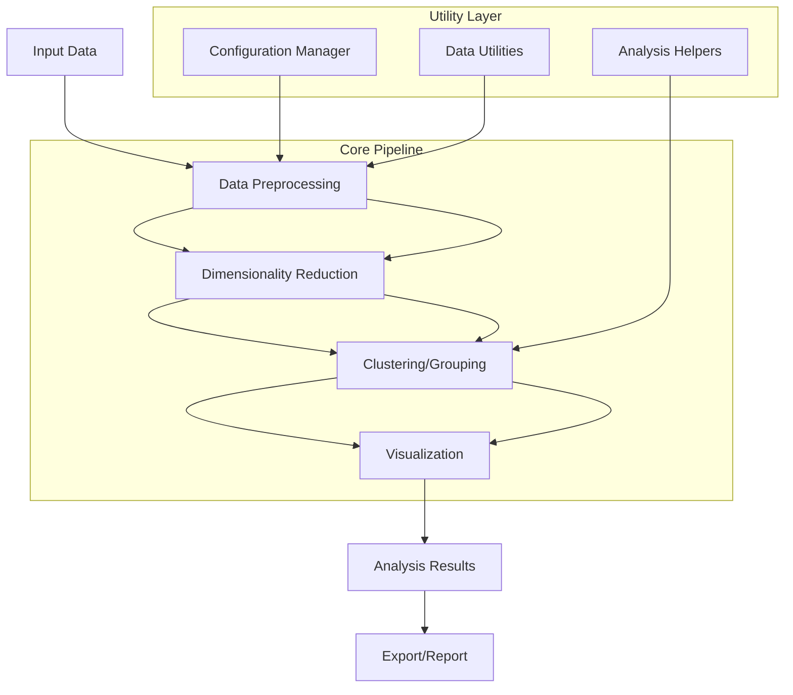

# `hypertools`

## Repository Overview

### Tree Structure
```
hypertools/
├── docs/
│   └── tutorials/
│       └── tools/
│           └── nb_to_doc.py
└── hypertools/
    ├── __init__.py
    ├── cluster/
    │   ├── __init__.py
    │   └── cluster.py
    ├── dimensionality_reduction/
    │   ├── __init__.py
    │   └── reduce.py
    ├── visualization/
    │   ├── __init__.py
    │   └── plot.py
    ├── utils/
    │   ├── __init__.py
    │   └── helpers.py
    └── config.py
```

### Responsibilities
- **docs/**: Manages documentation assets and tutorial materials for the project
- **hypertools/**: Main Python package containing core functionality for high-dimensional data analysis

## Purpose

The hypertools repository provides a comprehensive suite of tools for high-dimensional data analysis and visualization. It addresses the challenge of making sense of complex, multi-dimensional datasets by offering intuitive methods for dimensionality reduction, clustering, and visual exploration. This library is particularly valuable for researchers, data scientists, and analysts working with large-scale scientific datasets where traditional visualization techniques fall short.

Target users include:
- Data scientists analyzing complex datasets
- Researchers in computational biology, neuroscience, and other fields with high-dimensional data
- Machine learning practitioners needing exploratory data analysis tools
- Academic researchers requiring reproducible analysis workflows

The library stands as a standalone tool that can be integrated into existing data science pipelines or used as a complete solution for exploratory data analysis of high-dimensional data.

## Architecture



Key architectural patterns:
- **Pipeline Architecture**: Data flows through a series of processing stages
- **Plugin-style Design**: Modular components that can be composed independently
- **Configuration Management**: Centralized settings for consistent behavior
- **Utility Layer**: Shared helpers and preprocessing functions

## Entry Points

### Importable API
- `from hypertools import plot, cluster, reduce_dimensions`
- Core functions exposed at package level for easy access
- All major functionality available through intuitive namespace organization

### Command Line Interface
- `hypertools analyze [dataset]` - Run full analysis pipeline
- `hypertools visualize [data]` - Quick visualization of datasets
- `hypertools cluster [data]` - Execute clustering analysis
- Designed for both interactive use and batch processing

## Core Features

1. **Dimensionality Reduction** - Tools for reducing high-dimensional data to 2D/3D for visualization
   - Implementing module: `hypertools.dimensionality_reduction`

2. **Clustering Analysis** - Methods for grouping similar data points
   - Implementing module: `hypertools.cluster`

3. **Interactive Visualization** - Multi-dimensional data visualization capabilities
   - Implementing module: `hypertools.visualization`

4. **Data Preprocessing** - Utility functions for cleaning and preparing datasets
   - Implementing module: `hypertools.utils`

5. **Configuration Management** - Centralized control over analysis parameters
   - Implementing module: `hypertools.config`

## Dependencies

- **NumPy**: Core numerical computing foundation
- **Matplotlib**: Primary visualization backend
- **Scikit-learn**: Machine learning algorithms for clustering and dimensionality reduction
- **Pandas**: Data manipulation and handling
- **Jupyter**: Notebook integration for tutorials and examples

Version constraints:
- NumPy >= 1.18.0
- Matplotlib >= 3.2.0
- Scikit-learn >= 0.22.0
- Pandas >= 1.0.0

## Configuration

### Environment Variables
- `HYPERTOOLS_LOG_LEVEL`: Controls verbosity (DEBUG, INFO, WARNING, ERROR)
- `HYPERTOOLS_CACHE_DIR`: Custom cache directory location
- `HYPERTOOLS_TIMEOUT`: Maximum execution time for long-running operations

### Configuration Files
- `.hypertools_config.json`: User-specific settings
- `hypertools.yaml`: Project-level configuration options

## Extension Points

### Plugin System
- Custom dimensionality reduction methods can be registered via decorators
- New visualization backends can be added through plugin interface
- Additional clustering algorithms can be implemented as extensions

### Hook System
- Pre-processing hooks for custom data transformations
- Post-processing hooks for result formatting
- Callback mechanisms for monitoring long-running analyses

### Subclassing Approach
- Base classes for custom analysis components
- Inheritance patterns for extending existing functionality
- Strategy pattern for algorithm selection

---

## Modules

- [`docs`](docs.md)
- [`docs/tutorials`](docs/tutorials.md)
- [`docs/tutorials/tools`](docs/tutorials/tools.md)
- [`hypertools/_externals`](hypertools/_externals.md)
- [`hypertools/tools`](hypertools/tools.md)

