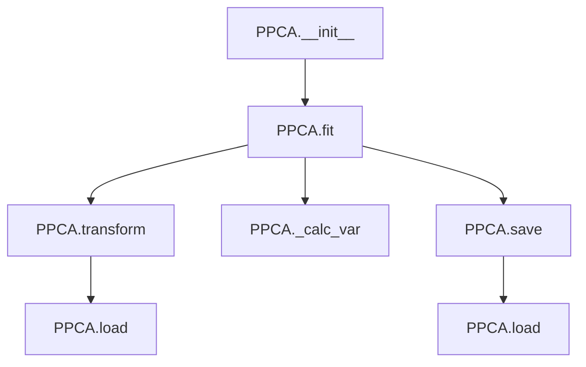

# `ppca.py`

## `hypertools._externals.ppca.PPCA` · *class*

## Summary:
Probabilistic Principal Component Analysis (PPCA) implementation for dimensionality reduction with missing data handling.

## Description:
The PPCA class implements a probabilistic approach to principal component analysis that can handle missing data points. It fits a probabilistic model to the data and projects it onto a lower-dimensional space. This class is commonly used for dimensionality reduction, data compression, and feature extraction in datasets with missing values.

## State:
- raw: Original input data array (numpy.ndarray) containing the raw data, or None if not fitted yet
- data: Standardized data (numpy.ndarray) used for fitting, or None if not fitted yet  
- C: Projection matrix (numpy.ndarray) with shape (features, components) representing the principal components, or None if not fitted yet
- means: Mean values (numpy.ndarray) for each feature in the dataset, or None if not fitted yet
- stds: Standard deviation values (numpy.ndarray) for each feature in the dataset, or None if not fitted yet
- eig_vals: Eigenvalues (numpy.ndarray) of the covariance matrix, or None if not fitted yet
- var_exp: Cumulative variance explained (numpy.ndarray) by each component, or None if not fitted yet

## Lifecycle:
- Creation: Instantiate with PPCA() constructor
- Usage: Call fit() with data first, then transform() to project data, or use saved model with load()
- Destruction: No explicit cleanup needed; uses standard Python garbage collection

## Method Map:


## Raises:
- RuntimeError: When attempting to transform or calculate variance before fitting the model
- AssertionError: When loading from a file that doesn't exist

## Example:
```python
import numpy as np
from hypertools._externals.ppca import PPCA

# Create sample data with missing values
data = np.array([[1, 2, np.nan], [4, 5, 6], [7, np.nan, 9]])

# Create and fit the PPCA model
ppca = PPCA()
ppca.fit(data, d=2)

# Transform the original data
transformed_data = ppca.transform()

# Save the fitted model
ppca.save('ppca_model.npy')

# Load and use the model with new data
new_ppca = PPCA()
new_ppca.load('ppca_model.npy')
transformed_new = new_ppca.transform(data)
```

### `hypertools._externals.ppca.PPCA.__init__` · *method*

## Summary:
Initializes the PPCA object by setting all internal state attributes to None, preparing the instance for subsequent fitting operations.

## Description:
This constructor method initializes the Probabilistic Principal Component Analysis (PPCA) object by setting all internal state attributes to their initial None values. This prepares the object for the fitting process where these attributes will be populated with actual data and model parameters. The method is called automatically when creating a new PPCA instance and establishes the baseline state for the object's lifecycle.

## Args:
    None

## Returns:
    None

## Raises:
    None

## State Changes:
    Attributes READ: None
    Attributes WRITTEN: 
    - self.raw: Set to None to indicate no original data has been processed
    - self.data: Set to None to indicate no standardized data has been computed
    - self.C: Set to None to indicate no projection matrix has been learned
    - self.means: Set to None to indicate no feature means have been calculated
    - self.stds: Set to None to indicate no feature standard deviations have been computed

## Constraints:
    Preconditions: None
    Postconditions: All internal state attributes are initialized to None, indicating the object is in its initial un-fitted state

## Side Effects:
    None

### `hypertools._externals.ppca.PPCA._standardize` · *method*

## Summary:
Standardizes input data by removing mean and scaling by standard deviation using pre-computed statistics.

## Description:
This method applies z-score normalization to input data using previously computed mean and standard deviation values from the training data. It is designed to be called after the model has been fitted to ensure that the means and stds attributes are properly initialized. The standardization transforms data to have zero mean and unit variance, which is essential for proper PCA computation.

## Args:
    X (numpy.ndarray): Input data array to be standardized, with shape (n_samples, n_features)

## Returns:
    numpy.ndarray: Standardized data array with the same shape as input X, where each feature has zero mean and unit variance

## Raises:
    RuntimeError: When the model has not been fitted yet (i.e., self.means or self.stds is None)

## State Changes:
    Attributes READ: self.means, self.stds
    Attributes WRITTEN: None

## Constraints:
    Preconditions: 
    - The PPCA model must have been fitted before calling this method (self.means and self.stds must be initialized)
    - Input data X must be a numpy array with compatible dimensions
    
    Postconditions:
    - Returns standardized data with zero mean and unit variance per feature
    - Method does not modify any instance attributes

## Side Effects:
    None

### `hypertools._externals.ppca.PPCA.fit` · *method*

## Summary:
Fits a probabilistic principal component analysis model to the provided data, handling missing values and infinities.

## Description:
This method implements a probabilistic PCA (PPCA) algorithm that finds the principal components of the input data while accounting for missing observations. It iteratively optimizes the model parameters to maximize the likelihood of the observed data under the PPCA assumption.

The algorithm begins by filtering out features with fewer than min_obs valid observations, replacing infinite values with the maximum finite value in the data, and standardizing the data. It then initializes the loading matrix C and enters an iterative optimization loop where it alternates between updating the latent variables (X) and the loading matrix (C) until convergence is achieved based on the variational lower bound.

## Args:
    data (array-like): Input data matrix of shape (N, D) where N is the number of observations and D is the number of features
    d (int, optional): Number of principal components to compute. If None, defaults to the number of features
    tol (float): Convergence tolerance for the optimization algorithm. Defaults to 1e-4
    min_obs (int): Minimum number of valid observations required for a feature to be included. Defaults to 10
    verbose (bool): If True, prints convergence diagnostics during optimization. Defaults to False

## Returns:
    None: This method modifies the object's state in-place and does not return a value

## Raises:
    None explicitly raised: Exceptions from underlying numpy/scipy operations may propagate if invalid inputs are provided

## State Changes:
    Attributes READ: self.C, self.raw
    Attributes WRITTEN: self.raw, self.means, self.stds, self.C, self.data, self.eig_vals

## Constraints:
    Preconditions: 
    - Input data should be numeric and finite (except for infinities which are handled)
    - Data should have at least min_obs valid observations per feature
    - The method assumes the data is properly formatted as a 2D array
    
    Postconditions:
    - The object's attributes self.C, self.data, self.eig_vals are set
    - The object's raw data is stored in self.raw
    - The means and standard deviations of the features are stored in self.means and self.stds
    - The fitted model is ready for projection or further analysis

## Side Effects:
    None: This method only modifies the object's internal state and does not perform I/O operations or external service calls

### `hypertools._externals.ppca.PPCA.transform` · *method*

## Summary:
Projects input data onto a lower-dimensional subspace using the probabilistic PCA model's learned projection matrix.

## Description:
This method applies dimensionality reduction to input data using the projection matrix computed during model fitting. When no data is provided, it transforms the original training data; otherwise, it transforms the provided data using the same projection matrix.

## Args:
    data (array-like, optional): New data to transform. If None, transforms the original training data stored in self.data. Defaults to None.

## Returns:
    ndarray: Transformed data with reduced dimensions, having shape (n_samples, n_components) where n_components is determined by the projection matrix C.

## Raises:
    RuntimeError: If the model has not been fitted yet (i.e., self.C is None).

## State Changes:
    Attributes READ: self.C, self.data
    Attributes WRITTEN: None

## Constraints:
    Preconditions: 
    - The model must be fitted before calling this method (self.C must not be None)
    - Input data must be compatible with the projection matrix dimensions
    
    Postconditions:
    - Returns transformed data with the same number of rows as input data
    - Output dimensions equal the number of columns in self.C

## Side Effects:
    None

### `hypertools._externals.ppca.PPCA._calc_var` · *method*

## Summary:
Calculates the cumulative variance explained by principal components.

## Description:
Computes the proportion of total variance explained by each successive principal component. This method is called internally during the model fitting process to determine how much variance is captured by the learned principal components. The result is stored in the `var_exp` attribute for later analysis of model performance.

## Args:
    None

## Returns:
    None

## Raises:
    RuntimeError: When the data model has not been fitted yet (self.data is None).

## State Changes:
    Attributes READ: self.data, self.eig_vals
    Attributes WRITTEN: self.var_exp

## Constraints:
    Preconditions: 
        - self.data must not be None (model must be fitted)
        - self.eig_vals must contain eigenvalues from PCA decomposition
    Postconditions: 
        - self.var_exp contains cumulative variance ratios (cumulative sum of eigenvalues normalized by total variance)

## Side Effects:
    None

### `hypertools._externals.ppca.PPCA.save` · *method*

## Summary:
Saves the principal component matrix to a NumPy file for later retrieval.

## Description:
This method serializes the principal component matrix (stored in `self.C`) to a binary NumPy file using `numpy.save`. It enables persistence of fitted PPCA models by storing the learned projection matrix to disk. The saved file can later be restored using the corresponding `load` method.

This method is typically called after fitting a model with the `fit` method to store the computed principal components for future use without re-computing them.

## Args:
    fpath (str): Absolute or relative path where the NumPy file containing the principal component matrix will be saved.

## Returns:
    None: This method does not return any value.

## Raises:
    None: This method does not explicitly raise exceptions, though underlying `numpy.save` operations may raise IOError or other serialization-related exceptions.

## State Changes:
    Attributes READ: self.C
    Attributes WRITTEN: None

## Constraints:
    Preconditions: 
    - The object must have been fitted (i.e., `self.C` must not be None)
    - The `fpath` should specify a valid directory path where the file can be written
    - The `self.C` attribute must contain a valid NumPy array that can be serialized

    Postconditions:
    - A NumPy file will be created at the specified path containing the principal component matrix
    - The object's internal state remains unchanged

## Side Effects:
    I/O operation: Writes to the filesystem to create a NumPy file containing the principal component matrix.

### `hypertools._externals.ppca.PPCA.load` · *method*

## Summary:
Loads a pre-computed projection matrix from a NumPy file and assigns it to the object's internal storage.

## Description:
This method reads a saved NumPy array file containing a projection matrix and loads it into the object's internal attribute `C`. It validates that the specified file exists before attempting to load it. This method is typically used to restore previously computed PCA components or similar projection matrices from persistent storage.

## Args:
    fpath (str): Absolute or relative path to the NumPy file containing the projection matrix.

## Returns:
    None: This method does not return any value.

## Raises:
    AssertionError: When the specified file path does not correspond to an existing file.

## State Changes:
    Attributes READ: None
    Attributes WRITTEN: self.C

## Constraints:
    Preconditions: The file at `fpath` must exist and contain a valid NumPy array that can be loaded with `numpy.load()`.
    Postconditions: The object's `C` attribute will contain the loaded NumPy array from the specified file.

## Side Effects:
    I/O operation: Reads from the filesystem to load the NumPy file.

