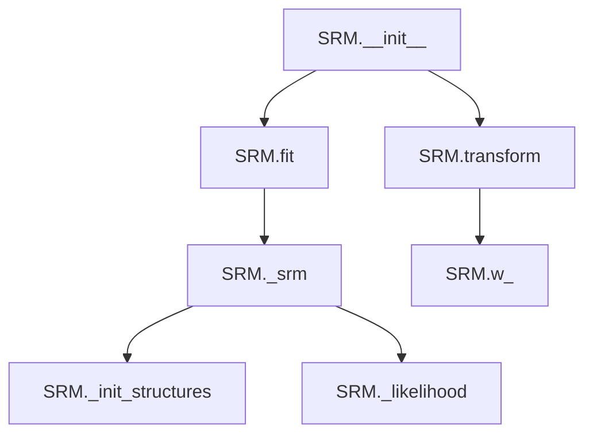

# `srm.py`

## `hypertools._externals.srm._init_w_transforms` · *function*

*No documentation generated.*

## `hypertools._externals.srm.SRM` · *class*

## Summary:
Probabilistic Shared Response Model (SRM) for aligning neural data across subjects.

## Description:
The SRM class implements a probabilistic shared response model that finds a common representation across multiple subjects' neuroimaging data. It is designed to align brain activity patterns from different individuals by identifying shared neural responses while accounting for individual differences. This implementation follows scikit-learn's transformer interface, making it compatible with standard machine learning workflows.

## State:
- n_iter: int, number of iterations for the optimization algorithm (default: 10)
- features: int, number of shared features to extract (default: 50)  
- rand_seed: int, random seed for reproducible results (default: 0)
- sigma_s_: numpy.ndarray, shared covariance matrix estimated during fitting
- w_: list of numpy.ndarray, transformation matrices for each subject
- mu_: list of numpy.ndarray, mean vectors for each subject
- rho2_: numpy.ndarray, noise variance parameters for each subject
- s_: numpy.ndarray, shared response matrix

## Lifecycle:
- Creation: Instantiate with n_iter, features, and rand_seed parameters
- Usage: Call fit() with list of subject data arrays, then transform() to apply the learned model
- Destruction: No explicit cleanup required; uses standard Python garbage collection

## Method Map:


## Raises:
- ValueError: When insufficient subjects (< 2) are provided for training
- ValueError: When insufficient samples are provided for the requested number of features
- ValueError: When subjects have inconsistent numbers of samples
- NotFittedError: When transform() is called before fit() has been executed successfully

## Example:
```python
# Create SRM instance
srm = SRM(n_iter=20, features=30, rand_seed=42)

# Fit on multi-subject data (list of 3D arrays, each subject's data)
subjects_data = [subject1_data, subject2_data, subject3_data]
srm.fit(subjects_data)

# Transform new data using the fitted model
transformed_data = srm.transform(subjects_data)
```

### `hypertools._externals.srm.SRM.__init__` · *method*

## Summary:
Initializes the Shared Response Model (SRM) with configurable hyperparameters for multi-subject data analysis.

## Description:
Configures the SRM estimator by setting essential hyperparameters that control the shared response model algorithm. This initialization method prepares the estimator for fitting by establishing key configuration parameters including the number of optimization iterations, feature dimensions, and random seed for reproducible results.

## Args:
    n_iter (int): Number of iterations for the SRM algorithm optimization process. Must be a positive integer. Defaults to 10.
    features (int): Number of shared features to extract from multi-subject neuroimaging data. Must be a positive integer. Defaults to 50.
    rand_seed (int): Random seed value for ensuring reproducible results across runs. Defaults to 0.

## Returns:
    None: This method initializes instance attributes and does not return a value.

## Raises:
    None: This method does not explicitly raise exceptions.

## State Changes:
    Attributes READ: No attributes are read from the instance.
    Attributes WRITTEN: 
    - self.n_iter: Stores the number of iterations parameter for algorithm convergence
    - self.features: Stores the number of features to extract from input data
    - self.rand_seed: Stores the random seed for reproducible random number generation

## Constraints:
    Preconditions: 
    - n_iter must be a non-negative integer
    - features must be a positive integer
    - rand_seed should be an integer (can be negative, zero, or positive)
    Postconditions: All instance attributes are initialized with the provided parameter values.

## Side Effects:
    None: This method performs no I/O operations or external service calls.

### `hypertools._externals.srm.SRM.fit` · *method*

## Summary:
 Fits the Probabilistic Shared Response Model (SRM) to multi-subject neuroimaging data by computing shared response space and subject-specific transformation matrices.

## Description:
This method trains the SRM model on multi-subject neuroimaging data by performing iterative optimization to find a shared response space that captures common neural patterns across subjects while estimating subject-specific linear transformations. The method validates input data integrity, runs the core SRM algorithm via the `_srm` private method, and stores the resulting model parameters as instance attributes for later use in transformation.

## Args:
    X (list of array-like): List of subject data matrices, where each matrix represents neuroimaging data from one subject. Each matrix should have shape (voxels, samples) where voxels represent brain regions and samples represent time points/trials.
    y (None): Placeholder parameter for scikit-learn compatibility, not used in this implementation.

## Returns:
    self: Returns the fitted SRM instance to enable method chaining.

## Raises:
    ValueError: Raised when there are insufficient subjects (less than 2) or when the number of samples in the first subject is less than the requested number of features.
    ValueError: Raised when subject data matrices have inconsistent numbers of samples/time points.

## State Changes:
    Attributes READ: self.features, self.n_iter, self.rand_seed
    Attributes WRITTEN: self.sigma_s_, self.w_, self.mu_, self.rho2_, self.s_

## Constraints:
    Preconditions:
    - Input X must be a list containing at least 2 subject data matrices
    - Each subject matrix must have at least `self.features` rows (voxels)
    - All subject matrices must have the same number of columns (samples/time points)
    - Subject matrices must contain finite numerical values
    - Input data should be compatible for matrix operations
    
    Postconditions:
    - Model parameters are computed and stored as instance attributes
    - The fitted model is ready for subsequent transformation operations
    - Instance attributes self.sigma_s_, self.w_, self.mu_, self.rho2_, and self.s_ are populated with computed values

## Side Effects:
    - Sets random seed using `self.rand_seed` for reproducible results
    - Logs informational messages during the fitting process if logging level is INFO
    - Performs multiple matrix operations and SVD decompositions during the SRM algorithm execution

### `hypertools._externals.srm.SRM.transform` · *method*

## Summary:
Transforms input data using the shared response model's learned weights to project data into the shared response space.

## Description:
Applies the previously learned shared response model weights to transform input data from individual subject spaces into the shared response space. This method is typically called after fitting the SRM model with the fit() method.

## Args:
    X (list of array-like): List of subject data matrices, where each matrix has shape (features, samples) for that subject.
    y (None): Placeholder parameter for scikit-learn compatibility, not used in this implementation.

## Returns:
    list of array-like: Transformed data in shared response space, where each subject's data has shape (shared_features, samples).

## Raises:
    sklearn.utils.validation.NotFittedError: When the model has not been fitted yet (w_ attribute is missing).
    ValueError: When the number of subjects in X does not match the number of subjects used during fitting.

## State Changes:
    Attributes READ: self.w_
    Attributes WRITTEN: None

## Constraints:
    Preconditions: 
    - The model must have been fitted using the fit() method before calling transform()
    - The number of subjects in X must match the number of subjects used during fitting
    - Each subject's data in X must have compatible dimensions with the learned weights
    
    Postconditions:
    - Returns transformed data in shared response space
    - Does not modify the instance state

## Side Effects:
    None

### `hypertools._externals.srm.SRM._init_structures` · *method*

## Summary:
Initializes data structures for statistical reuse method processing by centering subject data and computing key statistics.

## Description:
This method prepares the initial data structures required for the Statistical Reuse Method (SRM) algorithm. It processes multi-subject neuroimaging or similar data by centering each subject's data around its mean and computing important statistical measures. The method is typically called during the initialization phase of the SRM algorithm before further processing steps.

## Args:
    data (list of array-like): List of subject data matrices, where each matrix represents data from one subject
    subjects (int): Number of subjects in the dataset

## Returns:
    tuple: Four-element tuple containing:
        - x (list): List of centered data matrices for each subject
        - mu (list): List of mean vectors for each subject  
        - rho2 (numpy.ndarray): Array of variance scaling factors (all set to 1.0) for each subject
        - trace_xtx (numpy.ndarray): Array of sum of squared elements for each subject's data matrix

## Raises:
    None explicitly raised

## State Changes:
    - Attributes READ: None (method is self-contained)
    - Attributes WRITTEN: None (method is self-contained, returns results)

## Constraints:
    - Preconditions: 
        * data must be a list of array-like objects with compatible shapes
        * subjects must be a positive integer matching the number of data entries
    - Postconditions:
        * All returned data structures are properly initialized
        * Each subject's data is centered around its mean
        * rho2 values are all initialized to 1.0

## Side Effects:
    - None

### `hypertools._externals.srm.SRM._likelihood` · *method*

*No documentation generated.*

### `hypertools._externals.srm.SRM._srm` · *method*

## Summary:
Implements the core iterative optimization algorithm for Shared Response Model (SRM) to compute shared neural responses across multiple subjects.

## Description:
This private method executes the main SRM algorithm that finds a shared response space common to all subjects while estimating subject-specific transformation matrices. It performs alternating optimization between the shared response and subject-specific weight matrices through iterative updates. The method is called internally by the `fit` method during model training and should not be called directly by users.

## Args:
    data (list of array-like): List of subject data matrices, where each matrix represents fMRI or similar neuroimaging data from one subject. Each matrix should have shape (voxels, samples) where voxels represent brain regions and samples represent time points/trials.

## Returns:
    tuple: Five-element tuple containing:
        - sigma_s (numpy.ndarray): Estimated covariance matrix of the shared response space, shape (features, features)
        - w (list): List of subject-specific transformation matrices, each with shape (voxels, features) 
        - mu (list): List of mean vectors for each subject's data, each with shape (voxels,)
        - rho2 (numpy.ndarray): Subject-specific noise variance estimates, shape (subjects,)
        - shared_response (numpy.ndarray): Computed shared response matrix, shape (features, samples)

## Raises:
    None explicitly raised

## State Changes:
    - Attributes READ: self.n_iter, self.features, self.rand_seed
    - Attributes WRITTEN: None (method is self-contained, returns results)

## Constraints:
    - Preconditions:
        * Input data must be a list of at least two subject matrices
        * Each subject matrix must have at least `self.features` rows (voxels)
        * All subject matrices must have the same number of columns (samples)
    - Postconditions:
        * All returned matrices are properly computed and sized according to the SRM algorithm
        * The shared response represents the common neural activity across subjects
        * Subject-specific transformations are orthogonal matrices

## Side Effects:
    - Sets random seed using `self.rand_seed` for reproducible results
    - Logs iteration progress and objective function values when logging level is INFO

## `hypertools._externals.srm.DetSRM` · *class*

## Summary:
Deterministic Shared Response Model (SRM) that learns a shared representation across multiple subjects by aligning their brain imaging data.

## Description:
The DetSRM class implements a deterministic version of the Shared Response Model algorithm, designed to find a common neural response space across multiple subjects. It's commonly used in neuroimaging analysis to identify shared patterns in brain activity across different individuals. The class follows scikit-learn's estimator interface with fit() and transform() methods, making it compatible with standard ML pipelines.

## State:
- n_iter (int): Number of iterations for the alternating optimization algorithm. Default is 10.
- features (int): Number of features (components) to extract from the data. Default is 50.
- rand_seed (int): Random seed for reproducible results. Default is 0.
- w_ (list of numpy.ndarray): Learned transformation matrices for each subject, stored after fitting. Each matrix has shape (voxels, features).
- s_ (numpy.ndarray): Shared response matrix computed during fitting, representing the common neural response space with shape (features, time_samples).

## Lifecycle:
- Creation: Instantiate with n_iter, features, and rand_seed parameters
- Usage: Call fit() with list of subject data matrices (each subject's data as 2D numpy array), then transform() to project new data into shared space
- Destruction: No explicit cleanup required; relies on Python's garbage collection

## Method Map:
```mermaid
graph TD
    A[DetSRM.__init__] --> B[DetSRM.fit]
    B --> C[DetSRM._srm]
    C --> D[DetSRM._compute_shared_response]
    C --> E[DetSRM._objective_function]
    A --> F[DetSRM.transform]
    F --> G[DetSRM.w_ validation]
    G --> H[DetSRM.w_.T.dot(X)]
```

## Raises:
- ValueError: When there are insufficient subjects (< 2) or insufficient samples per subject for the requested features
- ValueError: When subject data has inconsistent number of time samples
- NotFittedError: When transform() is called before fit()

## Example:
```python
# Create SRM model
srm = DetSRM(n_iter=20, features=30, rand_seed=42)

# Fit on multiple subjects' data (list of 2D arrays where rows are voxels and columns are time samples)
subjects_data = [subject1_data, subject2_data, subject3_data]
srm.fit(subjects_data)

# Transform new data into shared space (returns list of transformed data)
shared_responses = srm.transform(subjects_data)
```

### `hypertools._externals.srm.DetSRM.__init__` · *method*

## Summary:
Initializes a Deterministic Shared Response Model (SRM) instance with configuration parameters.

## Description:
Configures the SRM algorithm with specified hyperparameters for the alternating optimization process. This method sets up the instance with iteration count, feature dimensionality, and random seed for reproducible results. The method is part of the scikit-learn estimator interface and is called automatically during object instantiation.

## Args:
    n_iter (int): Number of iterations for the alternating optimization algorithm. Must be positive. Defaults to 10.
    features (int): Number of features (components) to extract from the data. Must be positive and less than or equal to the minimum number of voxels across subjects. Defaults to 50.
    rand_seed (int): Random seed for reproducible results. Defaults to 0.

## Returns:
    None: This method initializes instance attributes and does not return a value.

## Raises:
    None: This method does not raise exceptions directly, though invalid parameter values may cause errors in subsequent operations.

## State Changes:
    Attributes READ: None
    Attributes WRITTEN: self.n_iter, self.features, self.rand_seed

## Constraints:
    Preconditions: Parameters should be non-negative integers for n_iter and features, and rand_seed should be an integer.
    Postconditions: Instance attributes n_iter, features, and rand_seed are set to the provided values.

## Side Effects:
    None: This method performs no I/O operations or external service calls. It only assigns parameter values to instance attributes.

### `hypertools._externals.srm.DetSRM.fit` · *method*

## Summary:
Trains the Deterministic Shared Response Model by computing subject-specific weight matrices and a shared response representation from multi-subject neuroimaging data.

## Description:
This method performs the core training procedure for the Deterministic SRM model. It validates input data consistency, ensures sufficient sample sizes, and computes optimal subject-specific transformation matrices and a shared neural response pattern using iterative optimization. The computed parameters are stored as instance attributes for subsequent use in transforming new data.

## Args:
    X (list of array-like): List of subject data matrices, where each matrix has shape (voxels, time_points) representing neuroimaging data from different subjects
    y (None): Ignored parameter to maintain scikit-learn estimator interface compatibility

## Returns:
    self: Returns the fitted DetSRM instance for method chaining

## Raises:
    ValueError: If there are fewer than 2 subjects in X, or if any subject has insufficient samples compared to the requested features, or if subjects have inconsistent time point counts

## State Changes:
    Attributes READ: self.features
    Attributes WRITTEN: self.w_, self.s_

## Constraints:
    Preconditions:
    - X must be a list containing at least 2 subject data matrices
    - Each subject matrix must have the same number of time points
    - Each subject matrix must have at least as many voxels as specified by self.features
    - All subject matrices must contain finite numerical values
    
    Postconditions:
    - Instance attributes self.w_ and self.s_ are set with computed weight matrices and shared response
    - The model is ready for transformation of new data via the transform method

## Side Effects:
    - Logs informational messages about training progress
    - Uses numpy random seed for reproducible initialization (via _srm method)
    - Performs multiple matrix operations and SVD computations

### `hypertools._externals.srm.DetSRM.transform` · *method*

## Summary:
Transforms input data using learned shared response model weights to project data into a common shared response space.

## Description:
Applies the previously learned weight matrices from the fitted model to transform new neuroimaging data into a shared response space. This method enables dimensionality reduction and alignment of multi-subject neuroimaging data into a common feature space.

## Args:
    X (list of array-like): List of subject data matrices, where each matrix has shape (voxels, timepoints) and number of subjects must match the training data.
    y (array-like, optional): Target values (ignored in this implementation).

## Returns:
    list of array-like: Transformed data in shared response space, where each matrix has shape (features, timepoints) and number of subjects matches input X.

## Raises:
    NotFittedError: When the model has not been fitted yet (w_ attribute missing).
    ValueError: When the number of subjects in X does not match the number of subjects in the fitted model.

## State Changes:
    Attributes READ: self.w_
    Attributes WRITTEN: None

## Constraints:
    Preconditions: 
    - Model must be fitted (w_ attribute must exist)
    - Number of subjects in X must equal number of subjects in fitted model
    - Each subject's data matrix must have compatible dimensions with learned weights
    
    Postconditions:
    - Returns transformed data in shared response space
    - Output data maintains same number of subjects as input

## Side Effects:
    None

### `hypertools._externals.srm.DetSRM._objective_function` · *method*

## Summary:
Computes the objective function value for the Deterministic SRM algorithm by calculating the sum of squared Frobenius norms of data reconstruction errors.

## Description:
This method calculates the objective function used in the Shared Response Model (SRM) optimization process. It quantifies how well the shared response matrix and subject-specific weight matrices reconstruct the original data. The method is called during the SRM fitting process to monitor convergence and evaluate model performance.

## Args:
    data (list[np.ndarray]): List of subject data matrices, where each matrix has shape (voxels, time_points)
    w (list[np.ndarray]): List of subject-specific weight matrices, where each matrix has shape (voxels, features)
    s (np.ndarray): Shared response matrix with shape (features, time_points)

## Returns:
    float: The computed objective function value, scaled by half the number of time points

## Raises:
    None explicitly raised, but may raise numpy/scipy exceptions if inputs are invalid

## State Changes:
    Attributes READ: None
    Attributes WRITTEN: None

## Constraints:
    Preconditions:
    - data must be a non-empty list of numpy arrays
    - w must be a list of numpy arrays with matching dimensions to data
    - s must be a numpy array with compatible dimensions for matrix multiplication
    - All matrices in data must have the same number of time points
    - All matrices in w must have the same number of rows as corresponding data matrices

    Postconditions:
    - Returns a finite floating-point value representing the reconstruction error
    - The result is scaled by 0.5 divided by the number of time points

## Side Effects:
    None

### `hypertools._externals.srm.DetSRM._compute_shared_response` · *method*

## Summary:
Computes the shared response matrix by aggregating weighted projections of input data across all subjects.

## Description:
This method implements the core computation for determining the shared response in a Shared Response Model (SRM). It aggregates the weighted projections of multi-subject neuroimaging data to compute a common representation that captures shared neural patterns across subjects. The method is called during both the fitting process to update the shared response and during transformation to project new data into the shared space.

## Args:
    data (list of array-like): List of subject data matrices, where each matrix has shape (voxels, time_points)
    w (list of array-like): List of weight matrices, where each matrix has shape (voxels, features) corresponding to each subject

## Returns:
    array-like: Shared response matrix with shape (features, time_points), representing the common neural activity pattern across all subjects

## Raises:
    None explicitly raised, but depends on underlying numpy operations which may raise MemoryError for very large arrays

## State Changes:
    Attributes READ: None
    Attributes WRITTEN: None

## Constraints:
    Preconditions:
    - Input data and weight matrices must be compatible in dimensions
    - All data matrices must have the same number of time points
    - All weight matrices must have the same number of features
    - Data and weight lists must have the same length (number of subjects)
    
    Postconditions:
    - Returns a matrix with dimensions (features, time_points) where features matches the second dimension of weight matrices
    - Result is the average of weighted projections across all subjects

## Side Effects:
    None - Pure computational operation with no external I/O or state mutation beyond returning the computed result

### `hypertools._externals.srm.DetSRM._srm` · *method*

## Summary:
Performs iterative optimization to compute subject-specific weight matrices and shared response for a Deterministic Shared Response Model (SRM).

## Description:
This method implements the core alternating optimization algorithm for Deterministic SRM. It iteratively updates subject-specific weight matrices and the shared response matrix until convergence. The method serves as the main computational engine for fitting the SRM model to multi-subject neuroimaging data, finding a common representation that captures shared neural patterns across subjects while maintaining subject-specific transformations.

## Args:
    data (list of array-like): List of subject data matrices, where each matrix has shape (voxels, time_points) representing neuroimaging data from different subjects

## Returns:
    tuple: A tuple containing (w, shared_response) where:
        - w (list of array-like): List of optimized weight matrices, each with shape (voxels, features) for corresponding subject data
        - shared_response (array-like): Shared response matrix with shape (features, time_points) representing the common neural activity pattern across all subjects

## Raises:
    None explicitly raised, but may propagate exceptions from underlying numpy/scipy operations or helper methods

## State Changes:
    Attributes READ: self.rand_seed, self.features, self.n_iter
    Attributes WRITTEN: None - modifies only local variables and returns results

## Constraints:
    Preconditions:
    - Input data must be a list of at least two subject matrices
    - Each subject matrix must have the same number of time points
    - Each subject matrix must have at least as many voxels as specified by self.features
    - Subject matrices must be compatible for matrix operations
    
    Postconditions:
    - Returns optimized weight matrices and shared response that minimize the SRM objective function
    - Weight matrices are orthonormal (Q matrices from QR decomposition)
    - Shared response represents the aggregated common neural activity across subjects

## Side Effects:
    - Uses numpy random seed for reproducible initialization
    - May log informational messages during iterations if logging is enabled
    - Performs multiple SVD decompositions and matrix multiplications

