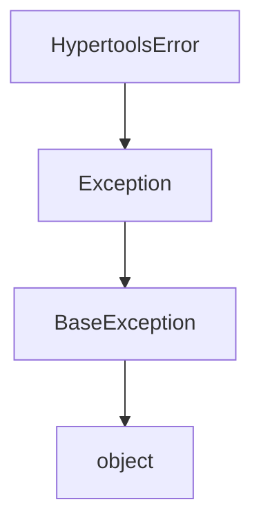
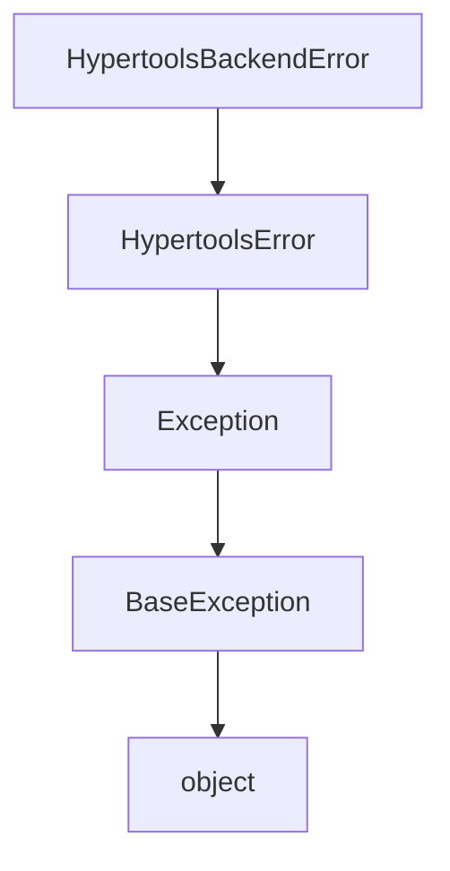

# `exceptions.py`

## `hypertools._shared.exceptions.HypertoolsError` · *class*

## Summary:
Base exception class for the hypertools library that provides a common error type for library-specific exceptions.

## Description:
HypertoolsError serves as the root exception class for all custom exceptions within the hypertools library. It provides a distinct exception type that allows users and code to catch library-specific errors while maintaining compatibility with Python's standard exception handling mechanisms. This class is intended to be inherited by more specific exception types within the library.

## State:
- No instance attributes: This is a base exception class with no additional state beyond what is inherited from Exception
- No __init__ parameters: Inherits the standard Exception constructor behavior
- Invariants: None specific to this class, relies on Exception invariants

## Lifecycle:
- Creation: Instantiated like any standard Exception, either directly or through inheritance
- Usage: Raised during exceptional conditions within hypertools operations and caught by exception handlers
- Destruction: Handled automatically by Python's garbage collection when no longer referenced

## Method Map:


## Raises:
- No explicit raises in __init__: Inherits standard Exception behavior
- Can be raised anywhere within hypertools code where an exceptional condition occurs

## Example:
```python
# Basic instantiation
try:
    raise HypertoolsError("Something went wrong")
except HypertoolsError as e:
    print(f"Caught exception: {e}")

# Inheritance pattern
class DataProcessingError(HypertoolsError):
    def __init__(self, message, data=None):
        super().__init__(message)
        self.data = data
```

## `hypertools._shared.exceptions.HypertoolsBackendError` · *class*

## Summary:
Custom exception class representing backend-related errors in the hypertools library.

## Description:
HypertoolsBackendError is a specialized exception type designed to represent errors originating from backend systems or services within the hypertools library. This exception inherits from HypertoolsError, providing a distinct error type that allows for more granular error handling specific to backend operations while maintaining compatibility with the library's overall exception hierarchy.

This class is typically instantiated when backend services fail, become unavailable, or encounter issues during processing operations. It enables developers to catch and handle backend-specific errors separately from other types of hypertools exceptions.

## State:
- message (str): The error message describing the backend failure. Valid values are any string describing the error condition. This attribute holds the same value as the constructor parameter.

## Lifecycle:
- Creation: Instantiated by passing a descriptive error message to the constructor
- Usage: Raised during backend operation failures and handled by exception handlers
- Destruction: Managed automatically by Python's garbage collection

## Method Map:


## Raises:
- No explicit raises in __init__: Inherits standard Exception constructor behavior

## Example:
```python
# Raising a backend error
try:
    # Simulate a backend service failure
    raise HypertoolsBackendError("Database connection failed")
except HypertoolsBackendError as e:
    print(f"Backend error occurred: {e}")

# Using in a function that might encounter backend issues
def process_data_with_backend(data):
    if not backend_available():
        raise HypertoolsBackendError("Required backend service is not available")
    # ... processing logic ...
```

### `hypertools._shared.exceptions.HypertoolsBackendError.__init__` · *method*

## Summary:
Initializes a HypertoolsBackendError instance with a descriptive error message.

## Description:
The constructor method sets up a HypertoolsBackendError exception with a specific error message. This method ensures that the error message is properly stored as an instance attribute and passed to the parent Exception class constructor for proper exception chaining and handling.

## Args:
    message (str): A descriptive error message explaining the backend failure. This parameter is required and should clearly indicate what went wrong during the backend operation.

## Returns:
    None: This method does not return a value. It initializes the instance state.

## Raises:
    No explicit exceptions are raised by this method. It inherits standard Exception constructor behavior.

## State Changes:
    Attributes READ: None
    Attributes WRITTEN: 
        - self.message: Stores the provided error message as an instance attribute

## Constraints:
    Preconditions:
        - The message parameter must be a string
        - The message should provide meaningful context about the backend failure
    
    Postconditions:
        - The instance will have a self.message attribute containing the provided message
        - The instance will be properly initialized as an Exception with the provided message

## Side Effects:
    None: This method performs no I/O operations, external service calls, or mutations to objects outside the instance being constructed.

## `hypertools._shared.exceptions.HypertoolsIOError` · *class*

*No documentation generated.*

### `hypertools._shared.exceptions.HypertoolsIOError.__init__` · *method*

## Summary:
Initializes a HypertoolsIOError instance with a descriptive error message.

## Description:
Constructs a new HypertoolsIOError exception object that combines library-specific error handling with standard OS error semantics. This method sets up the exception with a user-facing message while maintaining compatibility with Python's exception hierarchy.

## Args:
    message (str): A descriptive error message explaining the IO-related issue that occurred.

## Returns:
    None: This method initializes the object and does not return a value.

## Raises:
    None: This method does not explicitly raise exceptions, though the parent class constructor may raise exceptions for invalid arguments.

## State Changes:
    Attributes READ: None
    Attributes WRITTEN: 
        - self.message: Stores the provided error message as an instance attribute

## Constraints:
    Preconditions:
        - The message parameter must be a string or convertible to string
        - The class must be properly imported and available in the namespace
    Postconditions:
        - The exception instance will have a properly initialized message attribute
        - The exception will be compatible with both HypertoolsError and OSError hierarchies

## Side Effects:
    None: This method performs no I/O operations or external service calls. It only initializes object state.

