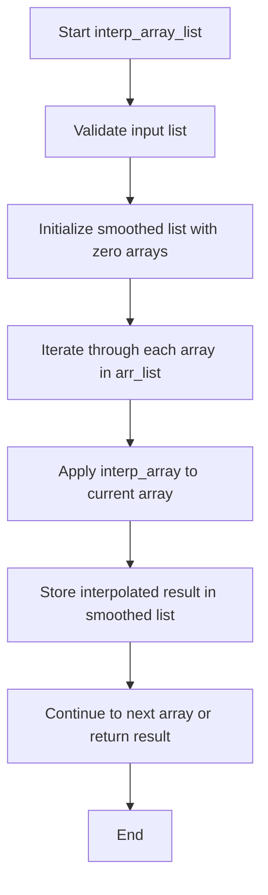
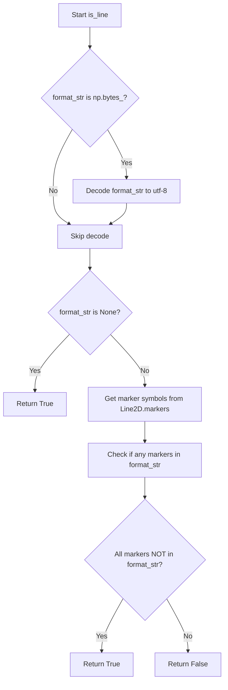
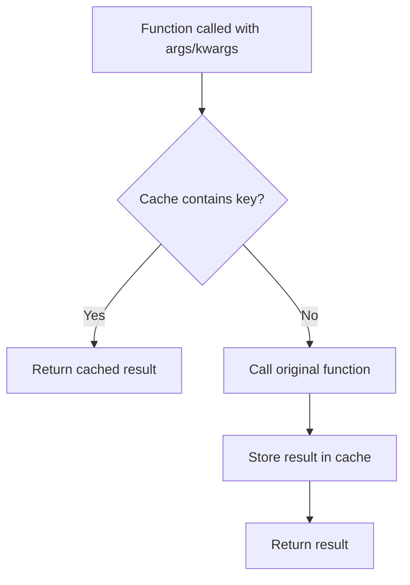

# `helpers.py`

## `hypertools._shared.helpers.center` · *function*

## Summary:
Centers a list of arrays by subtracting the mean of all arrays from each individual array.

## Description:
This function takes a list of arrays (or matrices) and centers them by computing the mean across all arrays and subtracting this global mean from each array. This is commonly used in data preprocessing to remove overall bias or shift data to have zero mean.

## Args:
    x (list): A list of arrays/matrices that will be centered. All arrays must have the same shape.

## Returns:
    list: A new list containing the centered versions of the input arrays, where each array has had the global mean subtracted from it.

## Raises:
    AssertionError: If the input x is not a list.

## Constraints:
    Preconditions:
        - Input x must be a list
        - All elements in the list must be arrays/matrices of compatible shapes
    Postconditions:
        - The returned list has the same length as the input list
        - Each returned array has the same shape as the corresponding input array
        - The mean of all centered arrays combined will be approximately zero

## Side Effects:
    None

## Control Flow:
```mermaid
flowchart TD
    A[Start center(x)] --> B{Is x a list?}
    B -- No --> C[Assertion Error]
    B -- Yes --> D[Stack arrays with np.vstack]
    D --> E[Compute mean across all arrays]
    E --> F[Subtract mean from each array]
    F --> G[Return centered list]
```

## Examples:
```python
# Basic usage with 2D arrays
import numpy as np
data = [np.array([[1, 2], [3, 4]]), np.array([[5, 6], [7, 8]])]
centered_data = center(data)
# Result: each array will have its mean subtracted from all elements

# With 1D arrays
data_1d = [np.array([1, 2, 3]), np.array([4, 5, 6])]
centered_1d = center(data_1d)
# Result: each array will be centered around their combined mean
```

## `hypertools._shared.helpers.scale` · *function*

## Summary:
Scales input data to the range [-1, 1] using min-max normalization.

## Description:
This function performs min-max scaling on input data to normalize values between -1 and 1. It takes a list of arrays/matrices, stacks them vertically, computes the global minimum and maximum values across all data, and applies a linear transformation to map the data to the range [-1, 1]. This scaling approach ensures that the minimum value becomes -1 and the maximum value becomes 1, with all other values proportionally distributed between these bounds.

## Args:
    x (list): A list of arrays or matrices to be scaled. All elements must be compatible for vertical stacking with numpy.vstack.

## Returns:
    list: A list of scaled arrays/matrices with the same shape as the input, where all values are normalized to the range [-1, 1].

## Raises:
    AssertionError: If the input x is not a list.

## Constraints:
    Preconditions:
        - Input x must be a list
        - All elements in the list must be compatible for vertical stacking with numpy.vstack
    
    Postconditions:
        - Output list contains elements with the same shapes as input elements
        - All values in output elements are in the range [-1, 1]

## Side Effects:
    None

## Control Flow:
```mermaid
flowchart TD
    A[Start scale(x)] --> B{Input is list?}
    B -- No --> C[AssertionError]
    B -- Yes --> D[Stack x vertically]
    D --> E[Compute m1 = min(stacked)]
    E --> F[Compute m2 = max(stacked - m1)]
    F --> G[Define scaling function f(x) = 2*(x-m1)/m2 - 1]
    G --> H[Apply f to each element in x]
    H --> I[Return scaled list]
```

## Examples:
```python
# Basic usage with lists of arrays
data = [np.array([[1, 2], [3, 4]]), np.array([[5, 6], [7, 8]])]
scaled_data = scale(data)
# Result: each value scaled to range [-1, 1]

# With single array
single_array = [np.array([1, 2, 3, 4])]
scaled_single = scale(single_array)
# Result: values scaled to range [-1, 1]
```

## `hypertools._shared.helpers.group_by_category` · *function*

*No documentation generated.*

## `hypertools._shared.helpers.vals2colors` · *function*

## Summary:
Maps numerical values to RGB color tuples using a specified colormap and resolution.

## Description:
Converts a list of numerical values into corresponding RGB color tuples by mapping each value to a position within a continuous color gradient. Handles nested lists by flattening them before processing. This function is commonly used for visualizing data with color coding where the color intensity corresponds to the magnitude of the underlying values.

## Args:
    vals (array-like): Numerical values to convert to colors. Can be a flat list or nested list structure.
    cmap (str, optional): Colormap name to use for color generation. Defaults to 'GnBu' (Green-Blue colormap).
    res (int, optional): Resolution of the color palette (number of discrete colors). Defaults to 100.

## Returns:
    list[tuple[float, float, float]]: List of RGB color tuples corresponding to input values. Each tuple contains three floats in range [0.0, 1.0] representing red, green, and blue components.

## Raises:
    None explicitly raised in the function body.

## Constraints:
    Preconditions:
    - Input vals must be numeric or convertible to numeric values
    - cmap must be a valid seaborn colormap name
    - res must be a positive integer
    
    Postconditions:
    - Output list length equals input values count (after flattening)
    - Each returned tuple contains exactly 3 floats in range [0.0, 1.0]

## Side Effects:
    None.

## Control Flow:
```mermaid
flowchart TD
    A[Start vals2colors] --> B{Are vals nested?}
    B -- Yes --> C[Flatten vals with itertools.chain]
    B -- No --> D[Skip flattening]
    C --> E[Generate color palette with sns.color_palette]
    D --> E
    E --> F[Create value bins with np.linspace(min(vals), max(vals)+1, res+1)]
    F --> G[Map values to bin indices with np.digitize]
    G --> H[Lookup colors by index in palette]
    H --> I[Convert to list of tuples and return]
```

## Examples:
    >>> vals2colors([1, 2, 3, 4, 5])
    [(0.5294117647058824, 0.807843137254902, 0.7803921568627451), (0.5294117647058824, 0.807843137254902, 0.7803921568627451), (0.5294117647058824, 0.807843137254902, 0.7803921568627451), (0.5294117647058824, 0.807843137254902, 0.7803921568627451), (0.5294117647058824, 0.807843137254902, 0.7803921568627451)]
    
    >>> vals2colors([[1, 2], [3, 4]], cmap='viridis')
    [(0.267004, 0.004874, 0.329415), (0.267004, 0.004874, 0.329415), (0.267004, 0.004874, 0.329415), (0.267004, 0.004874, 0.329415)]

## `hypertools._shared.helpers.vals2bins` · *function*

*No documentation generated.*

## `hypertools._shared.helpers.interp_array` · *function*

## Summary:
Performs piecewise cubic Hermite interpolation on an array to increase its resolution.

## Description:
Interpolates the input array using PCHIP (Piecewise Cubic Hermite Interpolating Polynomial) to generate a higher-resolution version. This function is commonly used to smooth data or increase the number of data points for better visualization or analysis.

## Args:
    arr (array-like): Input array to be interpolated. Must be a 1-D array or sequence of numeric values.
    interp_val (int, optional): Interpolation factor determining the resolution increase. Defaults to 10.
        - Controls how many intermediate points are generated between each pair of original points
        - Higher values result in smoother curves but increased computational cost
        - Must be a positive integer

## Returns:
    numpy.ndarray: Interpolated array with increased resolution. The length of the returned array is approximately (len(arr)-1) * interp_val + 1.

## Raises:
    TypeError: If input array cannot be converted to a numpy array.
    ValueError: If interp_val is not a positive integer.

## Constraints:
    Preconditions:
        - Input `arr` must be iterable and convertible to a numpy array
        - `interp_val` must be a positive integer
    Postconditions:
        - Output array length will be approximately (len(arr)-1) * interp_val + 1
        - Returned array contains interpolated values between original data points

## Side Effects:
    None.

## Control Flow:
```mermaid
flowchart TD
    A[Start interp_array] --> B[Validate inputs]
    B --> C[Create x = range(0, len(arr), 1)]
    C --> D[Create xx = range(0, len(arr)-1, 1/interp_val)]
    D --> E[Create PCHIP interpolator q]
    E --> F[Evaluate q at xx points]
    F --> G[Return interpolated array]
```

## Examples:
```python
# Basic usage
original = [1, 2, 3, 4, 5]
interpolated = interp_array(original, interp_val=5)
# Result: Array with 21 elements (4 * 5 + 1) representing interpolated values

# With custom interpolation factor
data = [0, 1, 4, 9, 16]
result = interp_array(data, interp_val=20)
# Result: Higher resolution version of the parabolic data
```

## `hypertools._shared.helpers.interp_array_list` · *function*

## Summary:
Performs piecewise cubic Hermite interpolation on a list of arrays to increase their resolution.

## Description:
Applies PCHIP (Piecewise Cubic Hermite Interpolating Polynomial) interpolation to each array in a list to generate higher-resolution versions. This function is commonly used to smooth multiple data series simultaneously or increase the number of data points for better visualization or analysis.

## Args:
    arr_list (list[array-like]): List of input arrays to be interpolated. All arrays must have compatible shapes.
    interp_val (int, optional): Interpolation factor determining the resolution increase for each array. Defaults to 10.
        - Controls how many intermediate points are generated between each pair of original points
        - Higher values result in smoother curves but increased computational cost
        - Must be a positive integer

## Returns:
    list[numpy.ndarray]: List of interpolated arrays with increased resolution. Each returned array has the same shape as the corresponding input array, but with increased number of elements based on the interpolation factor.

## Raises:
    TypeError: If input arrays cannot be converted to numpy arrays or if interp_val is not an integer.
    ValueError: If interp_val is not a positive integer or if input array list is empty.

## Constraints:
    Preconditions:
        - Input `arr_list` must be a non-empty list of arrays
        - All arrays in `arr_list` must have compatible shapes
        - `interp_val` must be a positive integer
    Postconditions:
        - Output list contains interpolated arrays with the same number of elements as input list
        - Each interpolated array has increased resolution compared to its input counterpart

## Side Effects:
    None.

## Control Flow:


## Examples:
```python
# Basic usage with multiple arrays
import numpy as np
arr1 = [1, 2, 3, 4, 5]
arr2 = [2, 4, 6, 8, 10]
result = interp_array_list([arr1, arr2])
# Returns two interpolated arrays with increased resolution

# With custom interpolation factor
data1 = [0, 1, 4, 9, 16]
data2 = [1, 3, 7, 15, 31]
result = interp_array_list([data1, data2], interp_val=20)
# Returns two higher-resolution arrays with 21 elements each
```

## `hypertools._shared.helpers.parse_args` · *function*

## Summary:
Transforms a set of arguments into a list of argument tuples, where some arguments may vary per item in a sequence while others remain constant.

## Description:
Processes a sequence `x` and a list of arguments `args` to create a list of argument tuples. When an argument in `args` is a list or tuple, it selects the element at the corresponding index from that sequence. For scalar arguments, they are preserved as-is. This allows for flexible parameter passing where some parameters vary per item while others remain constant.

## Args:
    x (iterable): Sequence of items that determines the number of argument tuples to generate and the indices for selecting elements from list-like arguments.
    args (list): List of arguments where each argument can be either a scalar value or a sequence (tuple/list) of the same length as `x`.

## Returns:
    list[tuple]: A list of tuples, where each tuple contains the appropriately selected arguments for each item in `x`. Each tuple has the same length as `args`.

## Raises:
    SystemExit: When a list-like argument in `args` has a different length than `x`, causing the program to terminate with error message "Error: arguments must be a list of the same length as x".

## Constraints:
    Preconditions:
        - `x` must be iterable
        - All elements in `args` that are sequences (tuples/lists) must have the same length as `len(x)`
    Postconditions:
        - The returned list will have the same length as `x`
        - Each tuple in the returned list will have the same length as `args`

## Side Effects:
    - Prints error message to standard output and exits the program when argument validation fails

## Control Flow:
```mermaid
flowchart TD
    A[Start parse_args(x, args)] --> B{Is args[i] list/tuple?}
    B -- Yes --> C{len(args[i]) == len(x)?}
    C -- Yes --> D[Append args[i][index] to tmp]
    C -- No --> E[Print error and exit]
    B -- No --> F[Append args[i] to tmp]
    D --> G{Next arg in args?}
    F --> G
    G -- Yes --> H[Continue processing]
    G -- No --> I[Append tmp to args_list]
    H --> J{Next item in x?}
    J -- Yes --> K[Reset tmp, process next item]
    J -- No --> L[Return args_list]
```

## Examples:
    # Basic usage with scalar arguments
    result = parse_args([1, 2, 3], [10, 20, 30])
    # Returns: [(10, 20, 30), (10, 20, 30), (10, 20, 30)]

    # Usage with varying arguments
    result = parse_args([1, 2, 3], [[10, 20, 30], 40, [50, 60, 70]])
    # Returns: [(10, 40, 50), (20, 40, 60), (30, 40, 70)]
```

## `hypertools._shared.helpers.parse_kwargs` · *function*

## Summary:
Creates a list of keyword argument dictionaries, where each dictionary contains expanded values for each item in a sequence.

## Description:
Expands keyword arguments to match the length of a sequence by mapping list/tuple values to corresponding indices. This utility function allows passing per-item parameters when working with sequences of objects, enabling flexible configuration of operations applied to multiple items.

## Args:
    x (list-like): Sequence of items that will be processed individually
    kwargs (dict): Dictionary containing keyword arguments, where values can be either scalar values or sequences of the same length as x

## Returns:
    list[dict]: A list of dictionaries, where each dictionary contains the expanded keyword arguments for the corresponding item in x

## Raises:
    None explicitly raised

## Constraints:
    Precondition: The length of any sequence values in kwargs must either equal the length of x or be a scalar value
    Postcondition: The returned list will have the same length as x, with each dictionary containing all keys from kwargs

## Side Effects:
    None

## Control Flow:
```mermaid
flowchart TD
    A[Start parse_kwargs] --> B{Is kwargs[kwarg] sequence?}
    B -- Yes --> C{len(kwargs[kwarg]) == len(x)?}
    C -- Yes --> D[tmp[kwarg] = kwargs[kwarg][i]]
    C -- No --> E[tmp[kwarg] = None]
    B -- No --> F[tmp[kwarg] = kwargs[kwarg]]
    D --> G[Append tmp to kwargs_list]
    E --> G
    F --> G
    G --> H{More items in x?}
    H -- Yes --> I[Next iteration]
    H -- No --> J[Return kwargs_list]
```

## Examples:
    >>> parse_kwargs([1, 2, 3], {'color': ['red', 'green', 'blue']})
    [{'color': 'red'}, {'color': 'green'}, {'color': 'blue'}]
    
    >>> parse_kwargs(['a', 'b'], {'size': 10, 'alpha': [0.5, 0.8]})
    [{'size': 10, 'alpha': 0.5}, {'size': 10, 'alpha': 0.8}]
    
    >>> parse_kwargs([1, 2, 3], {'marker': 'o'})
    [{'marker': 'o'}, {'marker': 'o'}, {'marker': 'o'}]

## `hypertools._shared.helpers.reshape_data` · *function*

## Summary:
Reorganizes data points into category-specific groups while maintaining their structural relationship.

## Description:
Groups input data points according to their categorical labels and stacks them appropriately for downstream processing. This function is commonly used in data visualization and analysis pipelines where data needs to be segmented by categorical variables.

## Args:
    x (array-like): Input data points to be reshaped, typically a list or array of arrays/vectors
    hue (array-like): Categorical labels corresponding to each data point in x
    labels (array-like or None): Optional additional labels for each data point, defaults to None

## Returns:
    tuple: A tuple containing:
        - list of numpy arrays: Each array contains the stacked data points belonging to a specific category
        - list of lists: Each inner list contains the corresponding labels for data points in that category

## Raises:
    None explicitly raised

## Constraints:
    Preconditions:
        - x should be iterable with elements that can be vertically stacked
        - hue should be iterable with the same length as x
        - labels should be iterable with the same length as x (when not None)
    
    Postconditions:
        - Output data is grouped by unique categories in hue
        - Each returned array contains data points from the same category
        - Labels are preserved in the same order as their corresponding data points

## Side Effects:
    None

## Control Flow:
```mermaid
flowchart TD
    A[Start reshape_data] --> B{labels is None?}
    B -- Yes --> C[Create labels=[None]*len(hue)]
    B -- No --> D[Use provided labels]
    C --> E[Get unique categories from hue]
    D --> E
    E --> F[Stack x data vertically]
    F --> G[Initialize empty lists for each category]
    G --> H[Iterate through hue and labels]
    H --> I{Category index}
    I --> J[Append x data to category list]
    J --> K[Append label to category label list]
    K --> L[Return stacked category data and labels]
```

## Examples:
```python
# Basic usage with categorical data
data = [[1, 2], [3, 4], [5, 6], [7, 8]]
categories = ['A', 'B', 'A', 'B']
result_x, result_labels = reshape_data(data, categories, None)
# Returns: ([array([[1, 2], [5, 6]]), array([[3, 4], [7, 8]])], [['A', 'A'], ['B', 'B']])

# Usage with custom labels
data = [[1, 2], [3, 4], [5, 6], [7, 8]]
categories = ['A', 'B', 'A', 'B']
custom_labels = ['p1', 'p2', 'p3', 'p4']
result_x, result_labels = reshape_data(data, categories, custom_labels)
# Returns: ([array([[1, 2], [5, 6]]), array([[3, 4], [7, 8]])], [['p1', 'p3'], ['p2', 'p4']])
```

## `hypertools._shared.helpers.is_line` · *function*

## Summary:
Determines whether a matplotlib format string represents a line plot rather than a marker/point plot.

## Description:
Checks if a matplotlib format string contains any marker symbols that would indicate a point/plot visualization style rather than a line style. This function is used to distinguish between line plots and marker plots in visualization contexts.

## Args:
    format_str (str or bytes or None): A matplotlib format string that specifies line style, color, and marker properties. Can be None to indicate default line styling.

## Returns:
    bool: True if the format string represents a line plot (contains no marker symbols), False if it represents a marker/point plot (contains marker symbols).

## Raises:
    None explicitly raised

## Constraints:
    Preconditions:
    - format_str should be a string, bytes, or None
    - When format_str is bytes, it must be UTF-8 decodable
    
    Postconditions:
    - Returns a boolean value indicating line vs marker plot type
    - Handles np.bytes_ conversion internally

## Side Effects:
    None

## Control Flow:


## Examples:
    # Line formats return True
    is_line("b-")      # Returns True (blue line)
    is_line("r--")     # Returns True (red dashed line)
    is_line(None)      # Returns True (default line)
    
    # Marker formats return False  
    is_line("bo")      # Returns False (blue circles)
    is_line("gs")      # Returns False (green squares)
    is_line("r.")      # Returns False (red dots)
```

## `hypertools._shared.helpers.memoize` · *function*

## Summary:
Caches function call results based on input arguments to avoid redundant computations.

## Description:
A decorator that implements memoization for functions by storing previously computed results in a cache. When a function decorated with `@memoize` is called with the same arguments, it returns the cached result instead of recomputing it.

## Args:
    obj (callable): The function to be memoized.

## Returns:
    callable: A wrapped version of the input function with caching behavior.

## Raises:
    None explicitly raised by this function.

## Constraints:
    Preconditions:
    - The input `obj` must be a callable (function)
    - Arguments passed to the decorated function must be hashable (convertible to string)
    - The function being memoized should be pure (same inputs always produce same outputs)

    Postconditions:
    - The decorated function maintains the same interface as the original
    - Cached results are stored in `obj.cache` attribute
    - Subsequent calls with identical arguments return cached values

## Side Effects:
    - Modifies the input object by adding a `cache` attribute
    - Stores results in memory for future reuse
    - May increase memory usage over time due to caching

## Control Flow:


## Examples:
```python
@memoize
def expensive_calculation(x, y):
    # Simulate expensive computation
    return x * y + x ** 2

# First call computes and caches result
result1 = expensive_calculation(3, 4)  # Computes: 3*4 + 3**2 = 21

# Second call returns cached result
result2 = expensive_calculation(3, 4)  # Returns 21 from cache
```

## `hypertools._shared.helpers.get_type` · *function*

## Summary:
Determines and returns the specific data type identifier for input data structures.

## Description:
This function analyzes the provided data object and categorizes it into predefined type categories, returning a string identifier that represents the data's structure and content type. The function is designed to handle common scientific computing and data analysis data types including lists, NumPy arrays, Pandas DataFrames, strings, bytes, and custom DataGeometry objects.

## Args:
    data (any): The input data object to analyze and categorize. Can be of various supported types including lists, NumPy arrays, Pandas DataFrames, strings, bytes, or DataGeometry objects.

## Returns:
    str: A string identifier representing the data type, with possible values including:
        - 'list_str': List containing strings or bytes
        - 'list_num': List containing numbers (int or float)
        - 'list_arr': List containing NumPy arrays
        - 'arr_str': NumPy array containing strings or bytes
        - 'arr_num': NumPy array containing numbers
        - 'df': Pandas DataFrame
        - 'str': String or bytes object
        - 'geo': DataGeometry object

## Raises:
    TypeError: When the input data type is not supported. The error message specifies the list of supported data types: Numpy Array, Pandas DataFrame, String, List of strings, List of numbers.

## Constraints:
    Preconditions:
        - Input data must be one of the supported types
        - For list inputs, the first element must be of a supported type to determine the list category
        - For NumPy array inputs, the first element must be accessible to determine the array category
        - For 2D NumPy arrays, the first element of the first row must be accessible to determine the array category
    
    Postconditions:
        - Function always returns one of the predefined string identifiers
        - Function raises TypeError for unsupported input types

## Side Effects:
    None: This function performs no I/O operations or external state mutations.

## Control Flow:
```mermaid
flowchart TD
    A[get_type(data)] --> B{isinstance(data, list)?}
    B -- Yes --> C{isinstance(data[0], str/bytes)?}
    C -- Yes --> D[return 'list_str']
    C -- No --> E{isinstance(data[0], int/float)?}
    E -- Yes --> F[return 'list_num']
    E -- No --> G{isinstance(data[0], np.ndarray)?}
    G -- Yes --> H[return 'list_arr']
    G -- No --> I[raise TypeError]
    B -- No --> J{isinstance(data, np.ndarray)?}
    J -- Yes --> K{isinstance(data[0][0], str/bytes)?}
    K -- Yes --> L[return 'arr_str']
    K -- No --> M[return 'arr_num']
    J -- No --> N{isinstance(data, pd.DataFrame)?}
    N -- Yes --> O[return 'df']
    N -- No --> P{isinstance(data, str/bytes)?}
    P -- Yes --> Q[return 'str']
    P -- No --> R{isinstance(data, DataGeometry)?}
    R -- Yes --> S[return 'geo']
    R -- No --> T[raise TypeError]
```

## Examples:
    >>> get_type([1, 2, 3])
    'list_num'
    
    >>> get_type(['a', 'b', 'c'])
    'list_str'
    
    >>> get_type(np.array([[1, 2], [3, 4]]))
    'arr_num'
    
    >>> get_type(pd.DataFrame({'A': [1, 2], 'B': [3, 4]}))
    'df'
    
    >>> get_type("hello")
    'str'
    
    >>> get_type(DataGeometry())
    'geo'
    
    >>> get_type({"key": "value"})
    TypeError: Unsupported data type passed. Supported types: Numpy Array, Pandas DataFrame, String, List of strings, List of numbers

## `hypertools._shared.helpers.convert_text` · *function*

## Summary:
Converts text-based data structures into a standardized NumPy array format with a single column.

## Description:
Processes input data to ensure text-related data is represented as a 2D NumPy array with one column. This function specifically targets list of strings and string data types, converting them into a consistent array format suitable for further processing in the hypertools framework. The function acts as a data normalization layer that ensures uniform representation of textual data regardless of its original input format.

## Args:
    data (any): The input data to process, which can be any supported data type including lists, strings, NumPy arrays, Pandas DataFrames, or DataGeometry objects.

## Returns:
    array-like: Returns the input data unchanged if it's not a list of strings or string. If the data is a list of strings or string, it returns a 2D NumPy array with shape (n, 1) where n is the number of elements.

## Raises:
    TypeError: When the input data type is not supported by the underlying `get_type` function.

## Constraints:
    Preconditions:
        - Input data must be one of the supported types recognized by `get_type`
        - For list inputs, the first element must be of a supported type to determine the list category
        - For NumPy array inputs, the first element must be accessible to determine the array category
    
    Postconditions:
        - If input is list_str or str type, output is a 2D NumPy array with shape (-1, 1)
        - If input is not list_str or str type, output is identical to input

## Side Effects:
    None: This function performs no I/O operations or external state mutations.

## Control Flow:
```mermaid
flowchart TD
    A[convert_text(data)] --> B[get_type(data)]
    B --> C{dtype in ['list_str', 'str']?}
    C -- No --> D[return data]
    C -- Yes --> E[np.array(data).reshape(-1, 1)]
    E --> F[return data]
```

## Examples:
    >>> convert_text(['apple', 'banana', 'cherry'])
    array([['apple'], ['banana'], ['cherry']])
    
    >>> convert_text('single_string')
    array([['single_string']])
    
    >>> convert_text([1, 2, 3])
    [1, 2, 3]  # Unchanged, not a string type
```

## `hypertools._shared.helpers.check_geo` · *function*

## Summary:
Processes and sanitizes a DataGeometry object by converting bytes to strings and properly handling list/array data types in its configuration parameters.

## Description:
This utility function ensures that DataGeometry objects have properly typed attributes, particularly addressing byte encoding issues that can occur during data serialization, deserialization, or transfer between systems. It creates a copy of the input object and processes its `reduce` attribute and `kwargs` dictionary to convert bytes to strings and properly handle list/array elements.

The function extracts this logic into a separate utility to maintain clean separation between data processing concerns and the core DataGeometry functionality, ensuring that all configuration parameters are in their appropriate string representations before being used in downstream operations.

## Args:
    geo (DataGeometry): A DataGeometry object containing potentially encoded data that needs type normalization

## Returns:
    DataGeometry: A new copy of the input DataGeometry object with normalized data types, specifically:
        - Bytes in the `reduce` attribute converted to strings
        - Bytes and list/array elements in `kwargs` converted to appropriate string representations

## Raises:
    AttributeError: If the input geo object doesn't have the expected attributes (`reduce`, `kwargs`)
    UnicodeDecodeError: If bytes in the data cannot be decoded to UTF-8 strings

## Constraints:
    Preconditions:
        - Input geo must be a DataGeometry object with `reduce` and `kwargs` attributes
        - `kwargs` must be a dictionary-like object that supports `.keys()` method
    
    Postconditions:
        - Returned object is a copy of the input with normalized data types
        - All bytes in `reduce` and `kwargs` are converted to strings
        - Lists and arrays in `kwargs` have their elements processed recursively
        - The returned object is independent of the input (shallow copy)

## Side Effects:
    None - This function is pure and doesn't modify external state or perform I/O operations

## Control Flow:
```mermaid
flowchart TD
    A[Start check_geo] --> B[Create shallow copy of geo]
    B --> C[Check if geo.reduce is bytes]
    C -->|Yes| D[Decode geo.reduce from bytes to string]
    D --> E[Iterate over geo.kwargs keys]
    E --> F{Is kwargs[key] None?}
    F -->|Yes| G[Skip processing]
    G --> H{Is kwargs[key] list/array?}
    H -->|Yes| I[Process list with fix_list]
    I --> J[Assign processed list back to kwargs[key]]
    J --> K{Is kwargs[key] bytes?}
    K -->|Yes| L[Decode bytes to string with fix_item]
    L --> M[Assign decoded string back to kwargs[key]]
    M --> N[Continue to next key]
    F -->|No| O[Continue to next key]
    H -->|No| O
    K -->|No| O
    N --> P{More keys?}
    P -->|Yes| E
    P -->|No| Q[Return geo copy]
```

## Examples:
```python
# Basic usage with a DataGeometry object containing bytes
processed_geo = check_geo(original_geo)

# Example showing the transformation of bytes to strings
# Before: geo.reduce = b'some_string'
# After: geo.reduce = 'some_string'

# Example showing list processing
# Before: geo.kwargs['param'] = [b'item1', b'item2']
# After: geo.kwargs['param'] = ['item1', 'item2']

# Example showing numpy array processing  
# Before: geo.kwargs['param'] = np.array([b'item1', b'item2'])
# After: geo.kwargs['param'] = ['item1', 'item2']
```

## `hypertools._shared.helpers.get_dtype` · *function*

## Summary:
Identifies and returns the standardized string identifier for the data type of the input object.

## Description:
This utility function provides a consistent way to determine the type of input data by returning predefined string identifiers. It is designed to handle common data types used throughout the hypertools library, enabling downstream code to make type-based decisions without direct isinstance checks.

## Args:
    data (Any): The input object whose data type needs to be identified. Can be any Python object.

## Returns:
    str: A standardized string identifier representing the data type:
        - 'list' for Python lists
        - 'arr' for NumPy arrays
        - 'df' for Pandas DataFrames
        - 'str' for strings or bytes objects
        - 'geo' for DataGeometry objects

## Raises:
    TypeError: When the input data type is not supported. The error message specifies the supported types: Numpy Array, Pandas DataFrame, String, List of strings, List of numbers.

## Constraints:
    Preconditions:
        - The input parameter `data` can be any Python object
    Postconditions:
        - Always returns one of the predefined string identifiers ('list', 'arr', 'df', 'str', 'geo')
        - Never returns None or raises exceptions for supported types

## Side Effects:
    None

## Control Flow:
```mermaid
flowchart TD
    A[get_dtype(data)] --> B{isinstance(data, list)?}
    B -- Yes --> C[return 'list']
    B -- No --> D{isinstance(data, np.ndarray)?}
    D -- Yes --> E[return 'arr']
    D -- No --> F{isinstance(data, pd.DataFrame)?}
    F -- Yes --> G[return 'df']
    F -- No --> H{isinstance(data, (str, bytes))?}
    H -- Yes --> I[return 'str']
    H -- No --> J{isinstance(data, DataGeometry)?}
    J -- Yes --> K[return 'geo']
    J -- No --> L[raise TypeError]
```

## Examples:
```python
# Basic usage
get_dtype([1, 2, 3])           # Returns 'list'
get_dtype(numpy.array([1, 2, 3]))  # Returns 'arr'
get_dtype(pandas.DataFrame())      # Returns 'df'
get_dtype("hello")              # Returns 'str'
get_dtype(DataGeometry())       # Returns 'geo'

# Error case
get_dtype(123)                  # Raises TypeError
```

