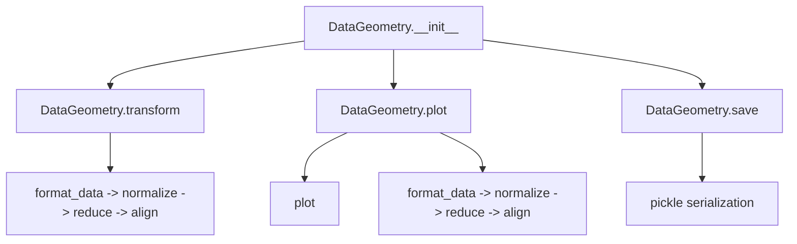

# `datageometry.py`

## `hypertools.datageometry.DataGeometry` · *class*

## Summary:
DataGeometry represents a container for managing data and its geometric transformations, providing methods for data manipulation, visualization, and persistence.

## Description:
The DataGeometry class serves as a central data container that maintains raw data, transformed data, and configuration parameters for various data processing operations. It encapsulates the state needed for data analysis workflows involving formatting, normalization, dimensionality reduction, and alignment. The class is designed to work with the hypertools library ecosystem, supporting operations like plotting and saving data geometries.

The class is particularly useful for maintaining the complete pipeline of data transformations and visualization settings, allowing users to easily reproduce analyses or save intermediate results.

## State:
- fig: matplotlib figure object, or None
- ax: matplotlib axes object, or None  
- line_ani: animation object for line plots, or None
- data: raw data in various formats (lists, arrays, DataFrames, strings). Lists are automatically converted using convert_text.
- dtype: standardized string identifier for data type ('list', 'arr', 'df', 'str', 'geo') determined by get_dtype
- xform_data: transformed data after processing, or None
- reduce: configuration for dimensionality reduction operations (dict or str), or None
- align: configuration for data alignment operations (dict or str), or None
- normalize: configuration for normalization operations (str or None), or None
- semantic: semantic modeling configuration for text data (str or None), or None
- vectorizer: text vectorization configuration (str or None), or None
- corpus: text corpus configuration (str or None), or None
- kwargs: additional plotting parameters (dict), or None
- version: library version string (__version__)

## Lifecycle:
Creation: Instantiate with optional parameters for initial state setup. Data is automatically converted using convert_text if it's a list.
Usage: Call methods in logical sequence - transform() for data processing, plot() for visualization, get_data() for access.
Destruction: Objects are typically destroyed via standard Python garbage collection, though save() method handles persistent storage.

## Method Map:


## Raises:
- TypeError: When data type is not supported by get_dtype function
- ValueError: When invalid parameters are passed to transformation functions

## Example:
```python
# Create a DataGeometry object with sample data
data = ["text1", "text2", "text3"]
geom = DataGeometry(data=data)

# Transform the data
transformed = geom.transform()

# Plot the data
plot_geom = geom.plot()

# Save the object
geom.save("my_geometry.geo")

# Access raw data
raw_data = geom.get_data()
```

### `hypertools.datageometry.DataGeometry.__init__` · *method*

## Summary:
Initializes a DataGeometry object with visualization and data transformation parameters.

## Description:
Configures the initial state of a DataGeometry instance by setting various attributes related to plotting, data handling, and preprocessing transformations. This method serves as the constructor that establishes the foundational configuration for geometric data visualization workflows.

## Args:
    fig (matplotlib.figure.Figure, optional): Matplotlib figure object for plotting. Defaults to None.
    ax (matplotlib.axes.Axes, optional): Matplotlib axes object for plotting. Defaults to None.
    line_ani (object, optional): Line animation object for dynamic visualizations. Defaults to None.
    data (array-like, optional): Raw data to be processed and visualized. Defaults to None.
    xform_data (array-like, optional): Transformed data for visualization. Defaults to None.
    reduce (callable, optional): Reduction function for dimensionality reduction. Defaults to None.
    align (callable, optional): Alignment function for data alignment. Defaults to None.
    normalize (callable, optional): Normalization function for data scaling. Defaults to None.
    semantic (callable, optional): Semantic transformation function. Defaults to None.
    vectorizer (callable, optional): Text vectorization function. Defaults to None.
    corpus (list, optional): Text corpus for semantic analysis. Defaults to None.
    kwargs (dict, optional): Additional keyword arguments for configuration. Defaults to None.
    version (str, optional): Library version for tracking. Defaults to __version__.
    dtype (str, optional): Explicit data type specification. Defaults to None.

## Returns:
    None: This method initializes instance attributes and does not return a value.

## Raises:
    TypeError: When data type validation fails in `get_dtype` function.

## State Changes:
    Attributes READ: None
    Attributes WRITTEN: 
        - self.fig
        - self.ax  
        - self.line_ani
        - self.data
        - self.dtype
        - self.xform_data
        - self.reduce
        - self.align
        - self.normalize
        - self.semantic
        - self.vectorizer
        - self.corpus
        - self.kwargs
        - self.version

## Constraints:
    Preconditions:
        - Input data must be compatible with the `convert_text` and `get_dtype` helper functions
        - All transformation functions (reduce, align, normalize, semantic) should be callable or None
        - If data is a list, all elements must be convertible by `convert_text`
    
    Postconditions:
        - self.data is converted to standardized format if it's a list of strings
        - self.dtype contains the standardized data type identifier
        - All provided parameters are stored as instance attributes

## Side Effects:
    None: This method performs no I/O operations or external state mutations.

### `hypertools.datageometry.DataGeometry.get_data` · *method*

## Summary:
Returns a shallow copy of the internal data stored in the DataGeometry object, ensuring data integrity and encapsulation.

## Description:
This method provides controlled access to the internal data by returning a shallow copy of `self.data`. It prevents external code from directly modifying the internal data structure while allowing read-only access to the data. This pattern ensures data integrity and encapsulation within the DataGeometry class.

The method is commonly used in visualization workflows where the original data needs to be accessed without risk of modification, particularly in the `plot` method which creates copies of data for processing. It serves as a safe way to retrieve the original data while maintaining the immutability of the internal state.

## Args:
    None

## Returns:
    Copy of self.data: Returns a shallow copy of the internal data structure. The exact type depends on the original data type stored in `self.data` (typically list, pandas DataFrame, or similar).

## Raises:
    None

## State Changes:
    Attributes READ: self.data
    Attributes WRITTEN: None

## Constraints:
    Preconditions: 
    - The DataGeometry object must have been initialized with data
    - `self.data` should be a valid object that can be shallow-copied
    
    Postconditions:
    - Returns a shallow copy of the internal data
    - Original `self.data` remains unchanged
    - The returned copy is independent of the internal data structure

## Side Effects:
    None

### `hypertools.datageometry.DataGeometry.get_formatted_data` · *method*

## Summary:
Returns the numerically formatted data representation for downstream analysis and visualization.

## Description:
This method provides access to the standardized numerical representation of the data stored in this DataGeometry object. It applies the standard formatting pipeline to convert various input data types (strings, lists, dataframes) into consistent numerical arrays suitable for machine learning algorithms, statistical analysis, and visualization. The formatted data is cached internally and can be accessed without reprocessing.

This method exists as a clean interface to retrieve the processed data while maintaining encapsulation of the formatting logic. It allows users to access the formatted data without directly manipulating the internal data storage or understanding the complex formatting pipeline.

## Args:
    None

## Returns:
    list[np.ndarray]: A list of numpy arrays where each array represents a processed data sample or feature set. The exact structure depends on the input data types and the formatting pipeline applied.

## Raises:
    None explicitly raised

## State Changes:
    Attributes READ: self.data
    Attributes WRITTEN: None

## Constraints:
    Preconditions: The DataGeometry instance must have been initialized with valid data
    Postconditions: The returned data maintains the same number of samples as the original input data

## Side Effects:
    None

### `hypertools.datageometry.DataGeometry.transform` · *method*

## Summary:
Transforms input data through a standardized pipeline of formatting, normalization, dimensionality reduction, and alignment.

## Description:
This method applies a multi-step transformation pipeline to data. When no data is provided, it returns previously transformed data stored in `self.xform_data`. When data is provided, it processes the data through: (1) formatting using the instance's semantic, vectorizer, and corpus settings, (2) normalization according to the instance's normalize setting, (3) dimensionality reduction using the instance's reduce configuration, and (4) alignment using the instance's align setting. This method serves as the primary interface for applying the full data transformation pipeline to new datasets.

## Args:
    data (Any, optional): Input data to transform. If None, returns cached transformed data from `self.xform_data`. Defaults to None.

## Returns:
    Any: Transformed data after processing through the full pipeline, or cached transformed data if `data` is None.

## Raises:
    None explicitly raised in the method body.

## State Changes:
    Attributes READ: self.xform_data, self.semantic, self.vectorizer, self.corpus, self.normalize, self.reduce, self.align
    Attributes WRITTEN: None

## Constraints:
    Preconditions: 
    - When data is provided, the instance must have appropriate configuration for semantic, vectorizer, corpus, normalize, reduce, and align parameters
    - The reduce parameter must contain a 'params' dictionary with 'n_components' key
    Postconditions:
    - If data is None, returns the cached value from self.xform_data
    - If data is provided, returns the result of the full transformation pipeline

## Side Effects:
    None explicitly mentioned. However, the method calls external functions (format_data, normalize, reduce, align) which may have side effects.

### `hypertools.datageometry.DataGeometry.plot` · *method*

## Summary:
Creates visualizations using stored or provided data with configured transformations and plotting parameters, returning a new DataGeometry object containing the plot results.

## Description:
This method serves as the primary interface for generating plots from the DataGeometry object's data. When no explicit data is provided, it uses the object's stored data and transformation state. However, if specific transformation-related keyword arguments (reduce, align, normalize, semantic, vectorizer, corpus) are provided, it resets the transformation state to None to avoid conflicts. The method prepares a comprehensive set of keyword arguments combining the object's configuration with any provided overrides, then delegates to the underlying plotting implementation.

## Args:
    data (array-like, optional): Alternative data to plot instead of the object's stored data. Defaults to None.
    **kwargs: Additional keyword arguments passed to the underlying plotting function, potentially overriding object configuration.

## Returns:
    DataGeometry: A new DataGeometry object containing the plot visualization and associated metadata.

## Raises:
    None explicitly raised by this method.

## State Changes:
    Attributes READ: self.data, self.xform_data, self.kwargs, self.reduce, self.align, self.normalize, self.semantic, self.vectorizer, self.corpus
    Attributes WRITTEN: None (this method doesn't directly modify object state)

## Constraints:
    Preconditions: The object must have valid data and configuration parameters set.
    Postconditions: Returns a new DataGeometry object with plotting results and metadata.

## Side Effects:
    I/O: May create and save plot files if save_path is specified in kwargs.
    External service calls: May call external plotting libraries (matplotlib, seaborn, etc.).
    Mutations: Creates copies of the object's data and configuration parameters.

### `hypertools.datageometry.DataGeometry.save` · *method*

## Summary:
Saves the DataGeometry object to a file using pickle serialization, temporarily clearing visualization-related attributes to ensure proper serialization.

## Description:
This method serializes the entire DataGeometry object to a file using Python's pickle module. It handles the temporary clearing of matplotlib figure and animation objects (fig, ax, line_ani) to prevent serialization issues, while preserving the data and other attributes. The method automatically appends the '.geo' extension to filenames that don't already have it.

## Args:
    fname (str): The filename to save the DataGeometry object to. If the filename doesn't end with '.geo', the extension will be automatically appended.
    compression (None): Deprecated parameter. Has no effect as Hypertools now uses pickle instead of deepdish for serialization. Will be removed in a future version. Issues a FutureWarning if not None.

## Returns:
    None: This method does not return any value.

## Raises:
    FutureWarning: When the compression parameter is not None, indicating that the parameter is deprecated and will be removed in a future version.

## State Changes:
    Attributes READ: self.fig, self.ax, self.line_ani, self.data
    Attributes WRITTEN: self.fig, self.ax, self.line_ani, self.data (temporarily set to None during serialization, then restored)

## Constraints:
    Preconditions: The DataGeometry object must be properly initialized with valid attributes.
    Postconditions: The object's state is preserved exactly as it was before the method call, with the serialized object saved to the specified file.

## Side Effects:
    I/O: Writes binary data to disk at the specified file path. May raise IOError if the file cannot be written to.
    Warning: Issues a FutureWarning when compression parameter is used.

