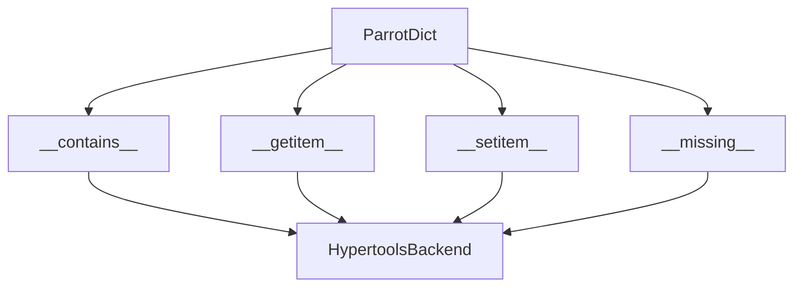
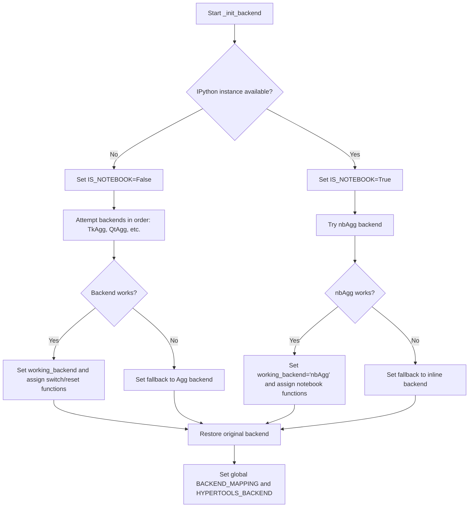
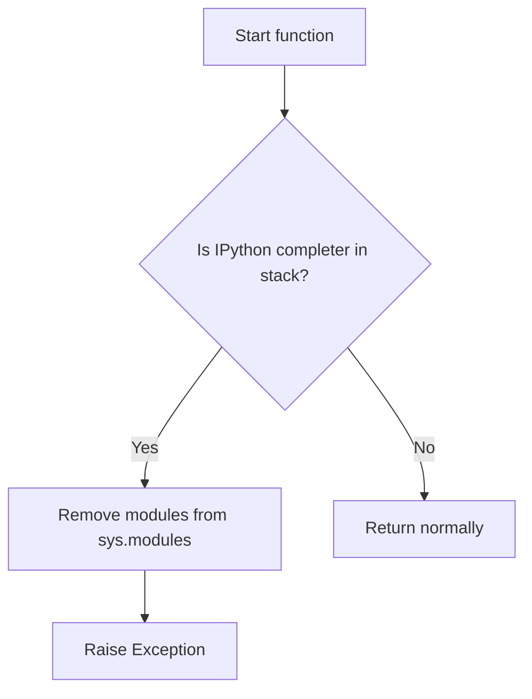
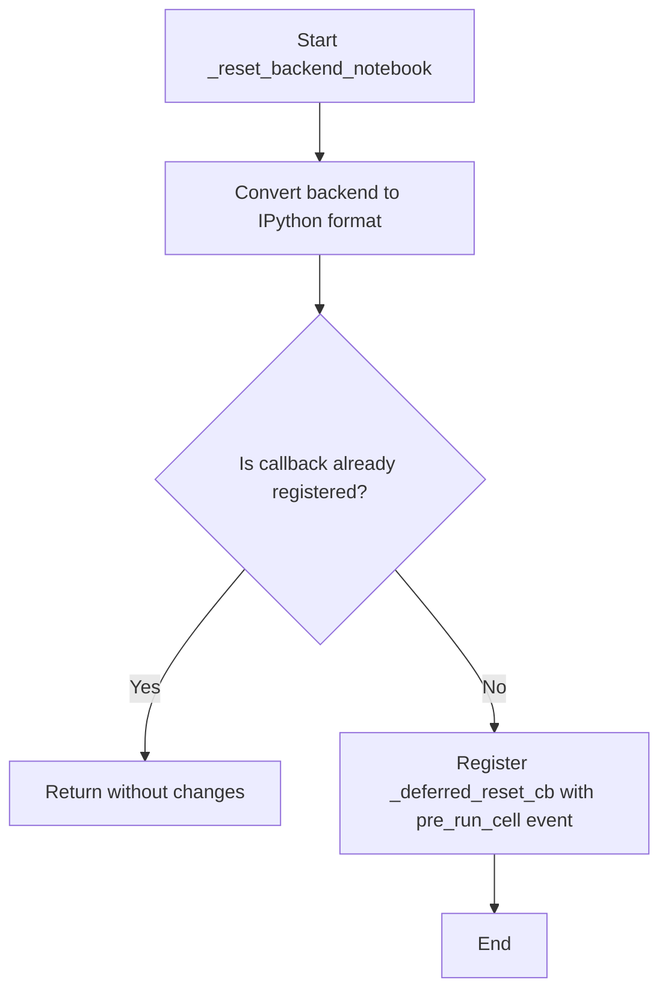
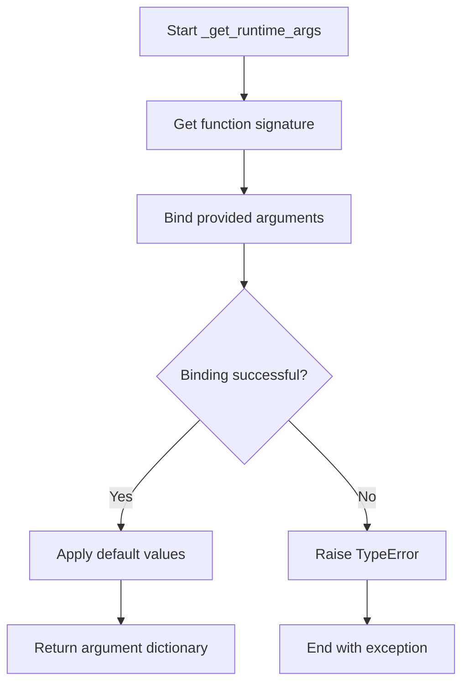
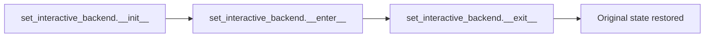
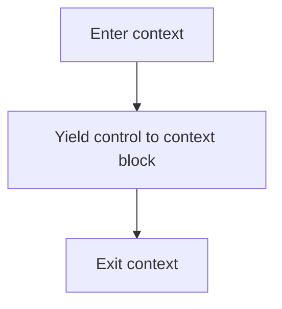

# `backend.py`

## `hypertools.plot.backend.ParrotDict` · *class*

## Summary:
A dictionary-like container that automatically converts keys to HypertoolsBackend objects for consistent backend management.

## Description:
The `ParrotDict` class is a specialized dictionary implementation that ensures all dictionary keys are converted to `HypertoolsBackend` objects during lookups and storage. This provides type consistency when managing matplotlib backends within the hypertools plotting system. The class acts as a transparent wrapper around Python's built-in dict, with custom implementations of dictionary methods that handle the conversion to `HypertoolsBackend` objects for key operations.

This abstraction is particularly useful in environments where matplotlib backend management needs to be consistent across different execution contexts (IPython/Jupyter vs. standard Python scripts), as it ensures that all backend identifiers maintain their specialized properties throughout dictionary operations.

## State:
- Inherits all standard `dict` attributes and behaviors
- Keys are automatically converted to `HypertoolsBackend` objects during `__contains__`, `__getitem__`, and `__setitem__` operations
- Values are stored as-is (not automatically converted to `HypertoolsBackend`)
- Maintains all standard dictionary invariants (key uniqueness, hashability, etc.)

## Lifecycle:
- Creation: Instantiate with any arguments valid for `dict.__init__()` - accepts positional arguments and keyword arguments
- Usage: Standard dictionary operations (`get`, `set`, `in`, etc.) automatically handle `HypertoolsBackend` conversion for key operations
- Destruction: Inherits standard dictionary destruction behavior

## Method Map:


## Raises:
- `KeyError`: Raised by `__getitem__` when key is not found (inherited from dict)
- `TypeError`: Raised when invalid arguments are passed to `__init__` (inherited from dict)
- `HypertoolsBackendError`: Potentially raised during `HypertoolsBackend` construction (via `HypertoolsBackend` constructor)

## Example:
```python
# Create a ParrotDict instance
pd = ParrotDict()

# Set items - keys are converted to HypertoolsBackend, values stored as-is
pd["Agg"] = "TkAgg"

# Get items - key is converted to HypertoolsBackend for lookup
backend = pd["agg"]  # Returns "TkAgg" (the original value)

# Check membership - key is converted to HypertoolsBackend for comparison
exists = "agg" in pd  # Returns True

# When key is missing, __missing__ creates a new HypertoolsBackend
new_backend = pd["nonexistent"]  # Returns HypertoolsBackend("nonexistent")
```

### `hypertools.plot.backend.ParrotDict.__init__` · *method*

## Summary:
Initializes a ParrotDict instance by calling the parent class constructor with provided arguments.

## Description:
This constructor method delegates initialization to the parent class by invoking its `__init__` method with all provided arguments. It follows the standard Python inheritance pattern where child classes call `super().__init__()` to ensure proper initialization of the inheritance chain.

## Args:
    *args: Variable length argument list passed to parent class constructor.
    **kwargs: Arbitrary keyword arguments passed to parent class constructor.

## Returns:
    None: This method does not return a value.

## Raises:
    Exception: Any exceptions that may be raised by the parent class's constructor.

## State Changes:
    Attributes READ: None
    Attributes WRITTEN: None

## Constraints:
    Preconditions: The parent class must be properly defined and support the provided arguments.
    Postconditions: The instance is initialized through the parent class's initialization mechanism.

## Side Effects:
    None: This method does not perform any I/O operations or external service calls.

### `hypertools.plot.backend.ParrotDict.__contains__` · *method*

## Summary:
Checks if a backend name exists in the ParrotDict by converting the key to a HypertoolsBackend object and searching among stored keys.

## Description:
This special method enables the use of the `in` operator with ParrotDict instances. When `key in parrot_dict` is evaluated, this method converts the provided key to a `HypertoolsBackend` object and checks if it exists among the dictionary's keys. The conversion uses the `HypertoolsBackend` constructor to ensure proper backend type handling.

## Args:
    key (str): A string representing a matplotlib backend name to check for existence

## Returns:
    bool: True if the backend name (converted to HypertoolsBackend) exists in the dictionary, False otherwise

## State Changes:
    Attributes READ: self.keys() (accesses the dictionary's key view)
    Attributes WRITTEN: None

## Constraints:
    Preconditions: The key parameter must be a string that can be converted to a HypertoolsBackend
    Postconditions: Returns a boolean indicating membership status without modifying the dictionary

## Side Effects:
    None

### `hypertools.plot.backend.ParrotDict.__getitem__` · *method*

## Summary:
Retrieves a value from the ParrotDict by converting the key to a HypertoolsBackend object.

## Description:
This special method enables dictionary-style key access for ParrotDict instances. When `parrot_dict[key]` is evaluated, this method converts the provided key to a `HypertoolsBackend` object and retrieves the corresponding value from the parent dictionary using the standard `__getitem__` mechanism.

The method ensures that all dictionary key lookups maintain consistent backend type handling by converting string keys to `HypertoolsBackend` objects before accessing the underlying dictionary.

## Args:
    key (str): A string representing a matplotlib backend name to retrieve

## Returns:
    The value associated with the backend name in the dictionary

## Raises:
    KeyError: When the specified backend name (converted to HypertoolsBackend) is not found in the dictionary

## State Changes:
    Attributes READ: None (reads from parent dict via super())
    Attributes WRITTEN: None

## Constraints:
    Preconditions: The key parameter must be a string that can be converted to a HypertoolsBackend
    Postconditions: Returns the value associated with the backend name, or raises KeyError if not found

## Side Effects:
    None

### `hypertools.plot.backend.ParrotDict.__missing__` · *method*

## Summary:
Returns a new HypertoolsBackend instance when a key lookup fails in the ParrotDict.

## Description:
This special method is invoked by Python's dictionary protocol when a key lookup fails. When a key is not found in the `ParrotDict`, this method is called with the missing key as an argument and returns a new `HypertoolsBackend` instance initialized with that key.

This method implements the standard `__missing__` behavior for dictionary-like objects, enabling automatic creation of backend objects when they are accessed but not yet present in the dictionary.

## Args:
    key (str): A string representing a matplotlib backend name that was not found in the dictionary

## Returns:
    HypertoolsBackend: A new instance of HypertoolsBackend initialized with the requested key

## State Changes:
    Attributes READ: None
    Attributes WRITTEN: None

## Constraints:
    Preconditions: The key parameter must be a string that can be converted to a HypertoolsBackend
    Postconditions: Returns a new HypertoolsBackend instance without modifying the dictionary state

## Side Effects:
    None

### `hypertools.plot.backend.ParrotDict.__setitem__` · *method*

*No documentation generated.*

## `hypertools.plot.backend.BackendMapping` · *class*

*No documentation generated.*

### `hypertools.plot.backend.BackendMapping.__init__` · *method*

## Summary:
Initializes a BackendMapping object by setting up bidirectional mappings between Python and IPython backend names, along with equivalent backend aliases.

## Description:
The `__init__` method configures the backend mapping system by creating three internal dictionaries: `py_to_ipy` for Python-to-IPython backend conversions, `ipy_to_py` for IPython-to-Python backend conversions, and `equivalents` for storing equivalent backend name mappings. It processes a provided dictionary mapping that defines how Python and IPython backends correspond to each other, normalizing the keys through the `_store_equivalents` helper method.

This method serves as the primary initialization point for the backend mapping system, establishing the foundational relationships needed for consistent backend management across different execution environments (Jupyter/IPython vs. standard Python).

## Args:
    _dict (dict): A dictionary mapping Python backend names to IPython backend names. Keys and values can be either string names or iterable collections of equivalent backend names.

## Returns:
    None: This method initializes the object's state and returns nothing.

## Raises:
    None explicitly raised: The method doesn't raise exceptions directly, though underlying operations may raise `KeyError` or `TypeError` from `ParrotDict` operations or `HypertoolsBackendError` from backend creation.

## State Changes:
    Attributes READ: None
    Attributes WRITTEN: 
    - self.py_to_ipy: Initialized as a ParrotDict and populated with Python-to-IPython backend mappings
    - self.ipy_to_py: Initialized as a ParrotDict and populated with IPython-to-Python backend mappings  
    - self.equivalents: Initialized as a ParrotDict and populated with equivalent backend name mappings

## Constraints:
    Preconditions:
    - The `_dict` parameter must be a dictionary-like object with iterable items
    - Keys and values in `_dict` should be either strings or iterable collections of backend names
    - The `ParrotDict` class must be properly initialized and available
    
    Postconditions:
    - All three internal dictionaries (`py_to_ipy`, `ipy_to_py`, `equivalents`) are initialized as `ParrotDict` instances
    - Bidirectional mappings are established between Python and IPython backends
    - Equivalent backend names are properly registered in the `equivalents` dictionary

## Side Effects:
    None: This method performs only internal state initialization and does not cause any I/O operations, external service calls, or mutations to objects outside the instance.

### `hypertools.plot.backend.BackendMapping._store_equivalents` · *method*

*No documentation generated.*

## `hypertools.plot.backend.HypertoolsBackend` · *class*

## Summary:
A string subclass that provides backend-aware string operations for matplotlib backend management in hypertools plotting.

## Description:
The `HypertoolsBackend` class extends Python's built-in `str` type to provide specialized behavior for handling matplotlib backend specifications. It ensures that when string operations are performed on backend names, the result maintains the `HypertoolsBackend` type. This is particularly useful for managing different matplotlib backends between IPython/Jupyter notebook environments and standard Python scripts.

The class implements case-insensitive string comparisons and preserves its type through various string operations. It provides methods to convert between IPython and Python backend representations, and to normalize the backend selection based on the execution environment.

## State:
- Inherits all `str` attributes and behaviors
- `__eq__` method implements case-insensitive comparison
- `__getattribute__` method intercepts string method calls to preserve `HypertoolsBackend` type in return values
- `__hash__` method ensures proper hashing with case folding
- All `str` methods are overridden to maintain type consistency

## Lifecycle:
- Creation: Instantiated with a string value representing a matplotlib backend name
- Usage: Methods like `as_ipython()`, `as_python()`, and `normalize()` are called to manage backend representations
- Destruction: Inherits standard string destruction behavior

## Method Map:
```mermaid
graph TD
    A[HypertoolsBackend] --> B[as_ipython()]
    A --> C[as_python()]
    A --> D[normalize()]
    B --> E[HypertoolsBackend]
    C --> E
    D --> E
```

## Raises:
- `AttributeError`: May be raised when accessing non-existent attributes (inherited from `str`)
- `HypertoolsBackendError`: Potentially raised by `BACKEND_MAPPING` operations (depends on external implementation)

## Example:
```python
# Create a backend instance
backend = HypertoolsBackend("Agg")

# Convert to IPython backend representation
ipython_backend = backend.as_ipython()

# Convert to Python backend representation  
python_backend = backend.as_python()

# Normalize based on environment
normalized_backend = backend.normalize()
```

### `hypertools.plot.backend.HypertoolsBackend.__new__` · *method*

## Summary:
Creates a new instance of the HypertoolsBackend class by delegating to the parent class's object creation mechanism.

## Description:
This method implements the `__new__` special method to customize object instantiation for the HypertoolsBackend class. It follows the standard Python pattern of calling `super().__new__(cls, x)` to delegate instance creation to the parent class while maintaining the proper class hierarchy. This minimal override ensures that instances are created according to the parent class's initialization protocol while preserving the intended class type.

## Args:
    cls: The class being instantiated (typically HypertoolsBackend)
    x: Parameter passed to the parent class's __new__ method for instance initialization

## Returns:
    HypertoolsBackend: A newly created instance of the HypertoolsBackend class

## Raises:
    Exception: Any exceptions raised by the parent class's __new__ method during instance creation

## State Changes:
    Attributes READ: None
    Attributes WRITTEN: None

## Constraints:
    Preconditions:
    - cls must be a valid class type that supports the __new__ protocol
    - x must be compatible with the parent class's __new__ method signature
    
    Postconditions:
    - Returns a properly initialized instance of the specified class
    - The instance is of the correct type (cls)
    - The instance creation follows the parent class's initialization protocol

## Side Effects:
    None - This method performs no I/O operations or external state mutations

### `hypertools.plot.backend.HypertoolsBackend.__getattribute__` · *method*

## Summary:
Intercepts attribute access to wrap string-returning methods from the parent str class with HypertoolsBackend instances.

## Description:
This method overrides the default attribute access behavior to automatically wrap return values from string methods with HypertoolsBackend instances. When accessing an attribute that exists on the built-in str class, it creates a wrapper method that ensures string results are converted to HypertoolsBackend objects, and container results are recursively wrapped.

## Args:
    name (str): The name of the attribute being accessed

## Returns:
    Various: Either a wrapped method that returns HypertoolsBackend instances, or the result from the parent's attribute access

## Raises:
    AttributeError: When the attribute doesn't exist and isn't a str method

## State Changes:
    Attributes READ: None - this method only reads the attribute name parameter
    Attributes WRITTEN: None - this method doesn't modify any instance attributes

## Constraints:
    Preconditions: The class must inherit from str and have proper parent class setup
    Postconditions: String-returning methods from str class will return HypertoolsBackend instances instead of plain strings

## Side Effects:
    None - This method doesn't perform I/O, external service calls, or mutate external objects

### `hypertools.plot.backend.HypertoolsBackend.__hash__` · *method*

## Summary:
Computes a case-insensitive hash value for the backend identifier string.

## Description:
Overrides the default string hashing behavior to ensure case-insensitive hash consistency with the class's case-insensitive equality comparison. This method is called automatically when the object is used as a dictionary key or stored in a set.

## Args:
    self: The HypertoolsBackend instance to hash

## Returns:
    int: A hash value computed from the lowercase version of the string representation

## Raises:
    None: This method does not raise any exceptions

## State Changes:
    Attributes READ: None - this method only reads the instance's string representation
    Attributes WRITTEN: None - this method does not modify any instance attributes

## Constraints:
    Preconditions: The instance must be a valid string-like object (since it inherits from str)
    Postconditions: The returned hash value will be consistent with case-insensitive equality comparisons

## Side Effects:
    None: This method performs no I/O operations or external service calls

### `hypertools.plot.backend.HypertoolsBackend.as_ipython` · *method*

## Summary:
Converts the current backend to its IPython-compatible equivalent.

## Description:
This method transforms the current HypertoolsBackend instance into its corresponding IPython backend representation by leveraging a global backend mapping system. It first identifies the canonical representation of the current backend through `BACKEND_MAPPING.equivalents`, then maps it to the IPython-compatible version using `BACKEND_MAPPING.py_to_ipy`. This conversion is essential when running in Jupyter notebook environments to ensure proper plotting functionality.

## Args:
    None

## Returns:
    HypertoolsBackend: A new HypertoolsBackend instance representing the IPython-compatible version of the current backend.

## Raises:
    KeyError: If the current backend type is not found in either BACKEND_MAPPING.equivalents or BACKEND_MAPPING.py_to_ipy mappings.

## State Changes:
    Attributes READ: self (the current backend instance)
    Attributes WRITTEN: None

## Constraints:
    Preconditions: The current instance must be a valid backend type that exists in BACKEND_MAPPING.equivalents
    Postconditions: The returned instance represents the same backend type but in IPython-compatible form

## Side Effects:
    None

### `hypertools.plot.backend.HypertoolsBackend.as_python` · *method*

## Summary:
Converts the current backend from an IPython/Jupyter environment to a standard Python environment.

## Description:
This method transforms the current HypertoolsBackend instance into its corresponding Python-compatible backend representation by leveraging a global backend mapping system. It first identifies the canonical representation of the current backend through `BACKEND_MAPPING.equivalents`, then maps it to the Python-compatible version using `BACKEND_MAPPING.ipy_to_py`. This conversion is essential when transitioning from Jupyter notebook environments to standard Python execution contexts to ensure proper plotting functionality.

The method is typically called as part of the `normalize()` method which automatically selects the appropriate backend based on the execution environment (notebook vs regular Python).

## Args:
    None

## Returns:
    HypertoolsBackend: A new HypertoolsBackend instance representing the Python-compatible version of the current backend.

## Raises:
    KeyError: If the current backend type is not found in either BACKEND_MAPPING.equivalents or BACKEND_MAPPING.ipy_to_py mappings.

## State Changes:
    Attributes READ: self (the current backend instance)
    Attributes WRITTEN: None

## Constraints:
    Preconditions: The current instance must be a valid backend type that exists in BACKEND_MAPPING.equivalents
    Postconditions: The returned instance represents the same backend type but in Python-compatible form

## Side Effects:
    None

### `hypertools.plot.backend.HypertoolsBackend.normalize` · *method*

## Summary:
Normalizes the backend representation based on the current execution environment.

## Description:
This method selects and returns the appropriate backend representation depending on whether the code is executing in a Jupyter notebook environment or standard Python environment. In notebook environments, it returns the IPython-compatible backend representation; in standard Python environments, it returns the Python-compatible representation. This ensures proper plotting functionality regardless of the execution context.

The method leverages the global `IS_NOTEBOOK` flag to determine the appropriate backend conversion and internally calls either `self.as_ipython()` or `self.as_python()` accordingly.

## Args:
    None

## Returns:
    HypertoolsBackend: A new HypertoolsBackend instance representing the environment-appropriate backend representation.

## Raises:
    KeyError: If the current backend type is not found in the global backend mapping system (BACKEND_MAPPING).

## State Changes:
    Attributes READ: self (the current backend instance)
    Attributes WRITTEN: None

## Constraints:
    Preconditions: The current instance must be a valid backend type that exists in BACKEND_MAPPING.equivalents
    Postconditions: The returned instance represents the same backend type but in the appropriate environment-specific form

## Side Effects:
    None

## `hypertools.plot.backend._init_backend` · *function*

## Summary:
Initializes the matplotlib backend for hypertools plotting, detecting the execution environment and selecting an appropriate interactive backend.

## Description:
The `_init_backend` function configures the matplotlib backend for the hypertools plotting system by detecting whether the code is running in a Jupyter notebook environment or regular Python session. It attempts to set interactive backends with fallback mechanisms and establishes the necessary backend switching and reset functions for the current environment.

This function is typically called once during module initialization to establish the plotting backend configuration. It handles both notebook and non-notebook environments differently, with notebook environments preferring 'nbAgg' backend and non-notebook environments trying various GUI backends.

## Args:
    None

## Returns:
    None

## Raises:
    None explicitly raised by this function.

## Constraints:
    Preconditions:
        - Matplotlib must be available and importable (accessed via `mpl` variable)
        - The `get_ipython()` function must be available in the execution environment
        - Global variables must be accessible for assignment
        - Environment variable `HYPERTOOLS_BACKEND` may be set to specify preferred backend
        
    Postconditions:
        - Global variables are set: `BACKEND_MAPPING`, `BACKEND_WARNING`, `HYPERTOOLS_BACKEND`, `IPYTHON_INSTANCE`, `IS_NOTEBOOK`, `reset_backend`, `switch_backend`
        - The matplotlib backend is configured appropriately for the execution environment
        - Appropriate backend switching and reset functions are assigned

## Side Effects:
    - Modifies global variables including backend configuration state
    - Changes matplotlib backend temporarily during initialization
    - May issue warnings via the warnings module
    - Calls `_block_greedy_completer_execution` which may raise an exception to interrupt IPython tab completion
    - May modify sys.modules through `_block_greedy_completer_execution`

## Control Flow:


## Examples:
```python
# This function is typically called internally by the plotting module
# and doesn't require direct user interaction

# In a notebook environment:
# - Attempts to use 'nbAgg' backend
# - Falls back to 'inline' if 'nbAgg' is unavailable
# - Sets appropriate switch/reset functions for notebook operations

# In a regular Python environment:
# - Attempts GUI backends in order: TkAgg, QtAgg, etc.
# - Falls back to 'Agg' backend if none work
# - Sets appropriate switch/reset functions for regular operations

# Environment variable override:
# Set HYPERTOOLS_BACKEND="Qt5Agg" to force a specific backend
# If specified backend is invalid, warns and falls back to working backend
```

## `hypertools.plot.backend._block_greedy_completer_execution` · *function*

## Summary:
Interrupts IPython's greedy tab completion to prevent interference with plotting operations by clearing module caches.

## Description:
This utility function detects when IPython's greedy tab completer is actively running in the call stack and prevents interference with hypertools plotting functionality. When detected, it removes cached modules ('hypertools.plot', 'hypertools.plot.backend', 'numpy') from sys.modules and raises an exception to terminate the completion process.

## Args:
    None

## Returns:
    None

## Raises:
    Exception: Raised when IPython's greedy completer is detected, interrupting the tab completion process.

## Constraints:
    Preconditions:
    - Must be executed in an IPython/Jupyter environment
    - Stack trace must contain IPython's completerlib.py module
    - sys module must be accessible for module manipulation
    
    Postconditions:
    - Function either returns normally or raises an exception
    - If exception is raised, affected modules are removed from sys.modules cache

## Side Effects:
    - Modifies sys.modules by removing cached modules
    - Causes subsequent imports of cleared modules to reload from disk
    - Terminates current execution flow by raising an exception

## Control Flow:


## Examples:
This function is typically used internally by plotting functions to prevent tab completion interference. When IPython's greedy completer attempts to complete code during plotting operations, this function intervenes by clearing module caches and raising an exception to abort the completion, ensuring plotting operations proceed uninterrupted.

## `hypertools.plot.backend._switch_backend_regular` · *function*

## Summary:
Switches the matplotlib plotting backend to the specified backend with enhanced error handling.

## Description:
This function provides a standardized way to switch matplotlib's plotting backend while offering detailed error messages for common failure scenarios. It extracts the Python representation of a backend object and attempts to switch matplotlib's backend, catching and re-raising specific exceptions as HypertoolsBackendError with informative messages.

## Args:
    backend: An object representing a plotting backend that implements an `as_python()` method returning a string representation of the backend name.

## Returns:
    None: This function does not return any value.

## Raises:
    HypertoolsBackendError: Raised when switching the plotting backend fails due to either missing dependencies (ImportError/ModuleNotFoundError) or other unexpected errors during backend switching.

## Constraints:
    Preconditions:
        - The backend parameter must have an `as_python()` method that returns a valid matplotlib backend string
        - Matplotlib must be properly installed and importable
    Postconditions:
        - The matplotlib backend will be switched to the specified backend if successful
        - If an error occurs, a HypertoolsBackendError will be raised with a descriptive message

## Side Effects:
    - Modifies the global matplotlib backend state
    - May raise exceptions that terminate execution if backend switching fails

## Control Flow:
```mermaid
flowchart TD
    A[Start _switch_backend_regular] --> B{backend.as_python()}
    B --> C[plt.switch_backend(backend)]
    C --> D{Exception raised?}
    D -->|Yes| E{Is ImportError/ModuleNotFoundError?}
    E -->|Yes| F[Create detailed ImportError message]
    E -->|No| G[Create general error message]
    F --> H[Raise HypertoolsBackendError]
    G --> H
    D -->|No| I[Success - Backend switched]
```

## `hypertools.plot.backend._switch_backend_notebook` · *function*

## Summary:
Switches the matplotlib plotting backend in a Jupyter notebook environment, handling various error conditions and providing fallback mechanisms.

## Description:
This function manages matplotlib backend switching specifically within Jupyter notebook environments. It uses IPython magic commands to change the plotting backend and implements robust error handling with fallback strategies. The function is designed to gracefully handle invalid backend specifications, GUI toolkit conflicts, and other common issues that arise when switching matplotlib backends in interactive notebook sessions.

The function extracts the IPython representation of a backend object and attempts to switch using the `%matplotlib` magic command. When encountering errors, it provides detailed error messages listing available backends or falls back to regular backend switching methods.

## Args:
    backend: An object representing a plotting backend that implements an `as_ipython()` method returning a string representation of the backend suitable for IPython magic commands.

## Returns:
    None: This function does not return any value.

## Raises:
    ValueError: Raised when the specified backend is not a valid IPython plotting backend, with a detailed message showing available backends.
    HypertoolsBackendError: Raised when backend switching fails via both IPython and regular methods, containing detailed error information about the failure.

## Constraints:
    Preconditions:
        - The backend parameter must have an `as_ipython()` method that returns a valid matplotlib backend string for IPython
        - IPYTHON_INSTANCE must be properly initialized in the notebook environment
        - The matplotlib library must be available and importable
    Postconditions:
        - The matplotlib backend will be switched to the specified backend if successful
        - If successful, the function ensures proper cleanup of IPython event callbacks for non-inline backends

## Side Effects:
    - Modifies the global matplotlib backend state
    - Interacts with IPython instance event callbacks
    - May modify IPython's post_execute event handlers
    - Captures stdout output during backend switching operations

## Control Flow:
```mermaid
flowchart TD
    A[Start _switch_backend_notebook] --> B{backend.as_ipython()}
    B --> C[Redirect stdout to StringIO]
    C --> D[Try IPython magic %matplotlib backend]
    D --> E{KeyError raised?}
    E -->|Yes| F[Set exc = KeyError]
    E -->|No| G[Continue normally]
    F --> H[Run %matplotlib -l to list backends]
    H --> I[Get stdout output]
    I --> J[Extract available backends]
    J --> K[Raise ValueError with backend info]
    G --> L{Output starts with Warning?}
    L -->|Yes| M[Try _switch_backend_regular(backend)]
    M --> N{HypertoolsBackendError raised?}
    N -->|Yes| O[Create detailed error message]
    O --> P[Raise HypertoolsBackendError]
    L -->|No| Q[Check if backend != 'inline']
    Q --> R{flush_figures in callbacks?}
    R -->|Yes| S[Unregister flush_figures from post_execute]
    R -->|No| T[End]
```

## Examples:
```python
# Switching to a valid backend
try:
    _switch_backend_notebook(my_backend_object)
except ValueError as e:
    print(f"Invalid backend: {e}")

# Handling fallback scenarios
try:
    _switch_backend_notebook(some_backend)
except HypertoolsBackendError as e:
    print(f"Backend switching failed: {e}")
```

## `hypertools.plot.backend._reset_backend_notebook` · *function*

## Summary:
Registers a deferred callback to reset the matplotlib backend in a Jupyter notebook environment before each cell execution.

## Description:
This function sets up an IPython event callback that will execute when a notebook cell is about to run. The callback switches the matplotlib backend to the specified target backend. This mechanism allows for automatic backend restoration in interactive notebook sessions where the backend might be changed during execution.

The function prevents duplicate registration of the same callback by checking existing callbacks before registering a new one. This ensures that only one reset callback is active at any time, avoiding potential conflicts or multiple executions.

This function is typically called as part of a larger backend management system where the matplotlib backend needs to be consistently restored between notebook cells.

## Args:
    backend: A backend object that implements an `as_ipython()` method returning a string representation of the matplotlib backend suitable for IPython magic commands.

## Returns:
    None: This function does not return any value.

## Raises:
    None explicitly raised by this function.

## Constraints:
    Preconditions:
        - The backend parameter must have an `as_ipython()` method that returns a valid matplotlib backend string for IPython
        - IPYTHON_INSTANCE must be available and properly initialized in the notebook environment
        - The matplotlib library must be available and importable
    Postconditions:
        - A callback function is registered with IPYTHON_INSTANCE.events for 'pre_run_cell' events
        - The callback will execute before each notebook cell runs to reset the backend
        - Duplicate registrations are prevented

## Side Effects:
    - Modifies IPYTHON_INSTANCE event callbacks registry by registering a new callback
    - The registered callback will execute before each notebook cell execution
    - May affect subsequent notebook cell execution timing due to callback overhead

## Control Flow:


## Examples:
```python
# Typical usage in a notebook environment
from hypertools.plot.backend import _reset_backend_notebook
from hypertools.plot.backend import matplotlib_backend

# Reset backend to inline for consistent plotting
backend = matplotlib_backend('inline')
_reset_backend_notebook(backend)

# The callback will automatically switch back to 'inline' before each cell execution
```

## `hypertools.plot.backend._get_runtime_args` · *function*

## Summary:
Processes function arguments by binding them to a function signature and applying default values.

## Description:
Extracts and normalizes function arguments for runtime execution by leveraging Python's introspection capabilities. This utility function allows for flexible argument handling when the exact function signature isn't known at compile time, making it particularly useful for wrapper functions, decorators, or dynamic dispatch systems.

## Args:
    func (callable): The target function whose signature will be used for argument binding.
    *func_args (tuple): Positional arguments to bind to the function signature.
    **func_kwargs (dict): Keyword arguments to bind to the function signature.

## Returns:
    dict: A dictionary mapping parameter names to their resolved values, including applied default values for missing arguments.

## Raises:
    TypeError: When the provided arguments don't match the function signature (e.g., wrong number of arguments, unexpected keyword arguments).

## Constraints:
    Preconditions:
    - The `func` parameter must be a callable object (function, method, etc.)
    - All provided positional arguments must align with the function's parameter order
    - All provided keyword arguments must correspond to valid parameter names
    
    Postconditions:
    - The returned dictionary contains all parameters defined in the function signature
    - Default values are applied for any missing arguments
    - Argument binding follows standard Python function call semantics

## Side Effects:
    None

## Control Flow:


## Examples:
```python
# Basic usage
def sample_func(a, b=10, c=20):
    return a + b + c

args = _get_runtime_args(sample_func, 5, c=30)
# Returns: {'a': 5, 'b': 10, 'c': 30}

# With only required args
args = _get_runtime_args(sample_func, 5)
# Returns: {'a': 5, 'b': 10, 'c': 20}

# With keyword args only
args = _get_runtime_args(sample_func, b=15, c=25)
# Returns: {'a': None, 'b': 15, 'c': 25} - Note: a would be required but not provided
```

## `hypertools.plot.backend.set_interactive_backend` · *class*

## Summary:
A context manager class that temporarily switches matplotlib backends to enable interactive plotting environments.

## Description:
The `set_interactive_backend` class is a context manager designed to temporarily change the matplotlib backend to an interactive mode. It ensures that plotting operations can be displayed inline in Jupyter notebooks or other interactive environments while maintaining the original backend configuration after the context exits. This class is particularly useful for managing backend switching in hypertools plotting workflows where different environments require different backend configurations.

The class implements proper cleanup by restoring global state variables and matplotlib backend settings when exiting the context. It prevents unnecessary backend switches by comparing the current and target backends, and only performs the switch when needed.

## State:
- `old_interactive_backend`: HypertoolsBackend - Stores the previously configured interactive backend before entering the context
- `old_backend_warning`: object - Stores the previous backend warning state before entering the context  
- `new_interactive_backend`: HypertoolsBackend - The target interactive backend to switch to, normalized
- `new_is_different`: bool - Flag indicating whether the new backend differs from the old one
- `backend_switched`: bool - Flag indicating whether a backend switch actually occurred during context entry
- `curr_backend`: HypertoolsBackend - Stores the current matplotlib backend when entering the context

## Lifecycle:
- Creation: Instantiate with a backend string parameter; initializes global state tracking and compares with existing backend
- Usage: Use in a `with` statement to temporarily switch backends for interactive plotting
- Destruction: Automatically restores original backend configuration when exiting the context

## Method Map:


## Raises:
- `HypertoolsBackendError`: Potentially raised when creating a `HypertoolsBackend` instance with an invalid backend name (inherited from HypertoolsBackend constructor)

## Example:
```python
# Temporarily switch to an interactive backend for plotting
with set_interactive_backend('TkAgg'):
    # All plotting operations here will use TkAgg backend
    plt.plot([1, 2, 3], [1, 4, 9])
    plt.show()

# Backend automatically restored to original setting
```

### `hypertools.plot.backend.set_interactive_backend.__init__` · *method*

## Summary:
Initializes a backend context manager that prepares to temporarily switch matplotlib backends for interactive plotting.

## Description:
Configures the backend switching mechanism by storing the current backend state and preparing to switch to a new interactive backend if needed. This method sets up the necessary state tracking for the context manager to handle backend transitions properly, ensuring that only necessary backend switches occur and that the original state is preserved for restoration.

## Args:
    backend (str): The target matplotlib backend name to switch to for interactive plotting. Must be a valid matplotlib backend specification.

## Returns:
    None: This method initializes instance attributes but does not return a value.

## Raises:
    HypertoolsBackendError: Raised when the provided backend string is invalid or unsupported by the HypertoolsBackend class.

## State Changes:
    Attributes READ: 
    - HYPERTOOLS_BACKEND (global variable)
    - BACKEND_WARNING (global variable)
    
    Attributes WRITTEN:
    - self.old_interactive_backend: Stores the previously configured interactive backend
    - self.old_backend_warning: Stores the previous backend warning state
    - self.new_interactive_backend: Stores the normalized target backend
    - self.new_is_different: Boolean flag indicating if backend change is needed
    - self.backend_switched: Boolean flag initialized to False

## Constraints:
    Preconditions:
    - The backend parameter must be a valid matplotlib backend string
    - Global variables HYPERTOOLS_BACKEND and BACKEND_WARNING must be accessible
    
    Postconditions:
    - Instance attributes are properly initialized with current and target backend states
    - The method determines whether a backend switch is necessary

## Side Effects:
    Global Variable Modifications:
    - Modifies HYPERTOOLS_BACKEND global variable only if a backend switch occurs (during __enter__ method)
    - Modifies BACKEND_WARNING global variable only if a backend switch occurs (during __enter__ method)
    
    Note: Actual backend switching happens in the __enter__ method, not in __init__

### `hypertools.plot.backend.set_interactive_backend.__enter__` · *method*

## Summary:
Temporarily sets the matplotlib backend to an interactive mode and tracks whether a backend switch occurred.

## Description:
This method is part of a context manager that temporarily switches the matplotlib backend to an interactive mode. It records the current backend state and performs a backend switch if necessary to achieve the desired interactive environment. This method is automatically called when entering the context manager's `with` block.

The method is designed to be used within a context manager pattern where the matplotlib backend needs to be temporarily changed for interactive plotting capabilities, such as displaying plots inline in Jupyter notebooks or enabling interactive GUI backends.

## Args:
    None

## Returns:
    self: The context manager instance, allowing for chaining or further operations within the context.

## Raises:
    None explicitly raised

## State Changes:
    Attributes READ:
        - self.new_interactive_backend: The target interactive backend to switch to
    Attributes WRITTEN:
        - self.curr_backend: Stores the current matplotlib backend after normalization
        - self.backend_switched: Boolean flag indicating if a backend switch was performed
        - IN_SET_CONTEXT: Global flag indicating that a backend context is active

## Constraints:
    Preconditions:
        - The `new_interactive_backend` attribute must be properly initialized on the instance
        - The matplotlib environment must be available for backend switching
    Postconditions:
        - The global `IN_SET_CONTEXT` flag is set to True
        - The current backend is stored in `self.curr_backend`
        - If a switch was needed, `self.backend_switched` is set to True and the backend is switched

## Side Effects:
    - Modifies global state via `IN_SET_CONTEXT` assignment
    - May change the matplotlib backend if `self.curr_backend` differs from `self.new_interactive_backend`
    - Calls matplotlib's backend switching mechanism

### `hypertools.plot.backend.set_interactive_backend.__exit__` · *method*

## Summary:
Restores previous matplotlib backend configuration when exiting a context manager block.

## Description:
This method serves as the context manager's exit handler, responsible for reverting matplotlib backend settings to their original state when leaving a `with` block. It ensures proper cleanup by restoring global backend variables and potentially resetting the matplotlib backend if it was switched during the context execution.

## Args:
    exc_type (type): Exception type if an exception occurred in the context, None otherwise
    exc_value (Exception): Exception value if an exception occurred in the context, None otherwise  
    traceback (traceback): Traceback object if an exception occurred in the context, None otherwise

## Returns:
    None: This method does not return any value

## Raises:
    None: This method does not explicitly raise exceptions

## State Changes:
    Attributes READ: self.new_is_different, self.backend_switched, self.old_interactive_backend, self.old_backend_warning, self.curr_backend
    Attributes WRITTEN: IN_SET_CONTEXT (global variable), HYPERTOOLS_BACKEND (global variable), BACKEND_WARNING (global variable)

## Constraints:
    Preconditions: The method assumes that the context manager was properly initialized and that the instance has the required attributes set during __enter__
    Postconditions: Global backend state variables are restored to their original values, and matplotlib backend is reset if it was switched during context execution

## Side Effects:
    Modifies global variables: IN_SET_CONTEXT, HYPERTOOLS_BACKEND, BACKEND_WARNING
    Potentially calls external matplotlib functions through reset_backend() if backend_switched flag is True

## `hypertools.plot.backend._null_backend_context` · *function*

## Summary:
Provides a null context manager for matplotlib backend operations that performs no actual backend switching.

## Description:
This function implements a context manager that serves as a placeholder backend context. It is typically used as a fallback when no specific backend switching is required or when a default/no-op backend context is needed. The function is designed to be compatible with the matplotlib backend switching interface while performing no actual operations.

## Args:
    dummy_backend (any): A parameter that accepts any value but is unused in the implementation. This parameter maintains compatibility with the expected interface for backend context managers.

## Returns:
    None: This function is a generator that yields control to the context block and then continues execution after the context exits.

## Raises:
    None: This function does not raise any exceptions under normal operation.

## Constraints:
    Preconditions: None - the function can be called with any argument.
    Postconditions: The context manager properly enters and exits without side effects.

## Side Effects:
    None: This function does not perform any I/O operations or mutate external state.

## Control Flow:


## Examples:
```python
# Basic usage as a context manager
with _null_backend_context("some_backend"):
    # Plotting operations here
    pass

# Usage in backend switching logic
backend = get_current_backend()
if backend == "null":
    with _null_backend_context(backend):
        # Perform plotting without backend changes
        pass
```

## `hypertools.plot.backend.manage_backend` · *function*

## Summary:
Decorator that manages matplotlib backend contexts for plotting functions, ensuring appropriate backend switching for interactive and animated plots while preserving original configuration.

## Description:
The `manage_backend` function is a decorator that wraps plotting functions to handle matplotlib backend management. It intelligently selects and switches matplotlib backends based on plot requirements (interactive, animated) while ensuring that the original matplotlib configuration is preserved after execution. This function extracts the complex backend management logic from individual plotting functions to maintain clean separation of concerns.

The decorator checks if the current execution context is already managing a backend (via `IN_SET_CONTEXT` flag), and if not, examines the plot function arguments to determine if interactive or animated plotting is requested. It then applies appropriate backend switching when needed, ensuring that interactive backends are used for Jupyter environments while maintaining compatibility with standard Python scripts.

## Args:
    plot_func (callable): The plotting function to be wrapped with backend management capabilities.

## Returns:
    callable: A decorated version of the input plotting function with enhanced backend management.

## Raises:
    None: This decorator itself does not raise exceptions, though the wrapped function may raise exceptions.

## Constraints:
    Preconditions:
    - The input `plot_func` must be a callable object (function, method, etc.)
    - The matplotlib library must be properly initialized
    - Required constants (`IN_SET_CONTEXT`, `HYPERTOOLS_BACKEND`, `BACKEND_WARNING`) and helper functions must be available in the module scope
    
    Postconditions:
    - The original matplotlib rcParams are restored after function execution
    - The matplotlib backend is properly managed according to plot requirements
    - The wrapped function executes with appropriate backend context

## Side Effects:
    - Modifies matplotlib rcParams temporarily during execution
    - May switch matplotlib backends when interactive/animated plots are requested
    - Issues warnings if a backend warning is configured (via `BACKEND_WARNING`)
    - May perform I/O operations through matplotlib backend switching mechanisms

## Control Flow:
```mermaid
flowchart TD
    A[manage_backend called] --> B[Create plot_wrapper]
    B --> C[Copy current rcParams]
    C --> D[Set default backend_context]
    D --> E{IN_SET_CONTEXT not True?}
    E -->|Yes| F[Get runtime args]
    F --> G{animate or interactive?}
    G -->|Yes| H[Get current backend]
    H --> I[Get mpl_backend arg]
    I --> J{mpl_backend == 'auto'?}
    J -->|Yes| K[Use HYPERTOOLS_BACKEND]
    K --> L{tmp_backend not in ('disable', curr_backend)?}
    L -->|Yes| M[Set backend_context to set_interactive_backend]
    M --> N[Enter backend context]
    N --> O{BACKEND_WARNING not None?}
    O -->|Yes| P[Issue warning]
    P --> Q[Execute plot_func]
    Q --> R[Return plot_func result]
    R --> S[Restore rcParams]
    S --> T[End]
    E -->|No| U[Enter backend_context]
    U --> V[Execute plot_func]
    V --> W[Return plot_func result]
    W --> X[Restore rcParams]
    X --> Y[End]
```

## Examples:
```python
# Basic usage as a decorator
@manage_backend
def my_plot_function(data):
    # Plotting code here
    plt.plot(data)
    return plt.gcf()

# Usage with interactive plotting
my_plot_function(data, animate=True, interactive=True, mpl_backend='auto')

# Usage with explicit backend specification
my_plot_function(data, interactive=True, mpl_backend='Qt5Agg')
```

