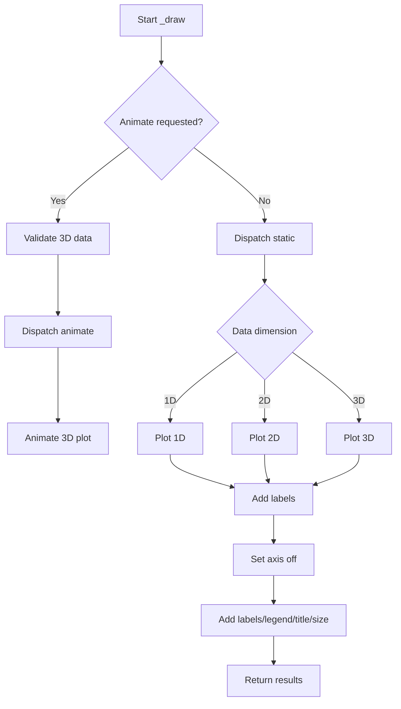

# `draw.py`

## `hypertools.plot.draw._draw` · *function*

## Summary:
Draws multi-dimensional data visualizations with support for static and animated plots, including 1D, 2D, and 3D data with optional labels, legends, and interactive features.

## Description:
This function serves as the core plotting utility for the hypertools library, handling visualization of data arrays in 1D, 2D, and 3D formats. It supports both static plots and animated visualizations with various styling options. The function automatically detects data dimensions and routes to appropriate plotting methods while providing advanced features like interactive labels, custom formatting, and animation controls.

The function is extracted to centralize complex plotting logic and handle the various combinations of data dimensions, visualization modes, and interactive features that would otherwise clutter higher-level plotting functions.

## Args:
    x (list of numpy arrays): List of data arrays to plot, where each array represents a dataset with shape (n_points, n_dimensions)
    legend (list or None): Legend labels for each data series, defaults to None
    title (str or None): Plot title, defaults to None
    labels (bool or list): Whether to display point labels or list of label strings, defaults to False
    show (bool): Whether to display the plot, defaults to True
    kwargs_list (list or None): List of keyword arguments for each data series, defaults to None
    fmt (list or None): Format strings for each data series, defaults to None. Special handling: if a single-point dataset with line styles ('-', ':', '--') is detected, format is changed to '.' 
    animate (bool or str): Animation mode ('parallel', 'spin') or False for static plots, defaults to False
    tail_duration (int): Duration of trailing line in animation, defaults to 2
    rotations (int): Number of rotations for animated view, defaults to 2
    zoom (int): Zoom level for 3D plots, defaults to 1
    chemtrails (bool): Whether to show chemtrail effect in animation, defaults to False
    precog (bool): Whether to show future trajectory in animation, defaults to False
    bullettime (bool): Whether to slow down animation, defaults to False
    frame_rate (int): Animation frame rate, defaults to 50
    elev (int): Elevation angle for 3D plots, defaults to 10
    azim (int): Azimuth angle for 3D plots, defaults to -60
    duration (int): Animation duration in seconds, defaults to 30
    explore (bool): Enable interactive exploration mode, defaults to False
    size (tuple or None): Figure size as (width, height), defaults to None
    ax (matplotlib.axes.Axes or None): Existing axes object to plot on, defaults to None

## Returns:
    tuple: (fig, ax, data, line_ani) where:
        - fig: matplotlib figure object
        - ax: matplotlib axes object  
        - data: input data arrays
        - line_ani: animation object (or None if static plot)

## Raises:
    AssertionError: When animate=True is used with non-3D data (shape[1] != 3)

## Constraints:
    Preconditions:
        - Input data arrays must be numpy arrays
        - Data arrays must have consistent number of columns (dimensions)
        - When animate=True, data must be 3D (shape[1] == 3)
        - If fmt is provided, it must match the length of data arrays
        - If labels is a list, it must match the length of data arrays
    Postconditions:
        - Returns a matplotlib figure and axes objects
        - If show=True, plot is displayed
        - Labels and legends are properly configured if provided
        - Animation object is returned when animate=True

## Side Effects:
    - Creates matplotlib figures and axes
    - May display plots if show=True
    - Connects matplotlib event handlers for interactive features
    - Modifies global variable labels_and_points when labels are added
    - Sets axis properties (limits, view angles, visibility)

## Control Flow:


## Examples:
```python
# Basic 2D plot
import numpy as np
data = [np.random.randn(100, 2)]
fig, ax, data, ani = _draw(data)

# Animated 3D plot with chemtrails
data = [np.random.randn(100, 3)]
fig, ax, data, ani = _draw(data, animate='parallel', chemtrails=True)

# Plot with labels and legend
data = [np.random.randn(50, 2), np.random.randn(50, 2)]
labels = ['Dataset 1', 'Dataset 2']
fig, ax, data, ani = _draw(data, labels=labels, legend=['A', 'B'])

# Interactive exploration mode
data = [np.random.randn(100, 3)]
fig, ax, data, ani = _draw(data, explore=True)

# Single point with line format gets converted to point marker
data = [np.array([[1, 2, 3]])]  # Single point in 3D
fig, ax, data, ani = _draw(data, fmt=['-'])  # Will become '.'
```

