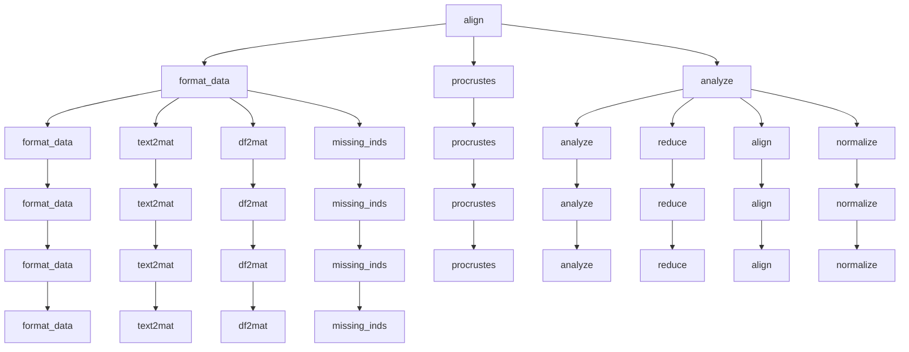

# `hypertools.tools`

## Tree:
tools/
├── align.py
├── analyze.py
├── cluster.py
├── describe.py
├── df2mat.py
├── format_data.py
├── load.py
├── missing_inds.py
├── normalize.py
├── procrustes.py
├── reduce.py
└── text2mat.py

## Role:
Provides a collection of data processing and analysis utilities for preparing, transforming, and analyzing neuroimaging and other scientific datasets.

## Description:
The tools module serves as a foundational library of data processing utilities that enable consistent preprocessing, transformation, and analysis of diverse scientific datasets. It provides functions for data formatting, dimensionality reduction, alignment, normalization, clustering, and visualization preparation. This module acts as a centralized toolkit that abstracts away the complexities of data manipulation, allowing users to focus on higher-level analysis tasks.

The module is organized around common data processing workflows and is designed to work seamlessly with the broader hypertools ecosystem. It handles heterogeneous data types (text, numerical, geometric) and provides both low-level utilities and high-level convenience functions for scientific data analysis.

## Components:
*   **align**: Performs hyperalignment or shared response model (SRM) alignment on multi-subject neuroimaging data to find a common representation across subjects.
*   **analyze**: Applies a sequential pipeline of data transformations to multi-subject neuroimaging data.
*   **cluster**: Performs clustering on input data using various clustering algorithms with flexible configuration options.
*   **describe**: Analyzes the correlation between original high-dimensional data and dimensionality-reduced representations across varying numbers of components.
*   **df2mat**: Converts a pandas DataFrame with mixed data types into a numerical matrix by transforming categorical columns into dummy variables.
*   **format_data**: Formats and standardizes mixed-type data (text, numerical, dataframe, geometric) into consistent numerical matrices suitable for downstream analysis.
*   **load**: Loads data from either built-in example datasets or file paths, with optional preprocessing and visualization capabilities.
*   **missing_inds**: Identifies indices of missing values in data arrays.
*   **normalize**: Normalizes input data using z-score normalization with multiple strategies.
*   **procrustes**: Performs Procrustes analysis to find the optimal linear transformation between two datasets.
*   **reduce**: Performs dimensionality reduction on data using various algorithms including PCA, ICA, UMAP, and others.
*   **text2mat**: Converts text data into numerical matrices using configurable vectorization and semantic modeling techniques.

## Public API:
*   **align(data, align='hyper', normalize=None, ndims=None, method=None, format_data=True)**: Performs hyperalignment or shared response model (SRM) alignment on multi-subject neuroimaging data to find a common representation across subjects.
*   **analyze(data, normalize=None, reduce=None, ndims=None, align=None, internal=False)**: Applies a sequential pipeline of data transformations to multi-subject neuroimaging data.
*   **cluster(x, cluster='KMeans', n_clusters=3, ndims=None, format_data=True)**: Performs clustering on input data using various clustering algorithms with flexible configuration options.
*   **describe(x, reduce='IncrementalPCA', max_dims=None, show=True, format_data=True)**: Analyzes the correlation between original high-dimensional data and dimensionality-reduced representations across varying numbers of components.
*   **df2mat(data, return_labels=False)**: Converts a pandas DataFrame with mixed data types into a numerical matrix by transforming categorical columns into dummy variables.
*   **format_data(x, vectorizer='CountVectorizer', semantic='LatentDirichletAllocation', corpus='wiki', ppca=True, text_align='hyper')**: Formats and standardizes mixed-type data (text, numerical, dataframe, geometric) into consistent numerical matrices suitable for downstream analysis.
*   **load(dataset, reduce=None, ndims=None, align=None, normalize=None, legacy=False)**: Loads data from either built-in example datasets or file paths, with optional preprocessing and visualization capabilities.
*   **missing_inds(x)**: Identifies indices of missing values in data arrays.
*   **normalize(x, normalize='across', internal=False, format_data=True)**: Normalizes input data using z-score normalization with multiple strategies.
*   **procrustes(source, target, scaling=True, reflection=True, reduction=False, oblique=False, oblique_rcond=-1, format_data=True)**: Performs Procrustes analysis to find the optimal linear transformation between two datasets.
*   **reduce(x, reduce='IncrementalPCA', ndims=None, normalize=None, align=None, model=None, model_params=None, internal=False, format_data=True)**: Performs dimensionality reduction on data using various algorithms including PCA, ICA, UMAP, and others.
*   **text2mat(data, vectorizer='CountVectorizer', semantic='LatentDirichletAllocation', corpus='wiki')**: Converts text data into numerical matrices using configurable vectorization and semantic modeling techniques.

## Dependencies:
*   **Internal imports**:
    *   `hypertools.tools.format_data`: Used by `align`, `analyze`, `cluster`, `describe`, `normalize`, `reduce` for data preprocessing.
    *   `hypertools.tools.df2mat`: Used by `format_data` for DataFrame to matrix conversion.
    *   `hypertools.tools.text2mat`: Used by `format_data` for text processing.
    *   `hypertools.tools.missing_inds`: Used by `format_data` for identifying missing values.
    *   `hypertools.tools.procrustes`: Used by `align` for Procrustes analysis.
    *   `hypertools.tools.load`: Used by `load` for accessing example datasets.
    *   `hypertools.tools.cluster`: Used by `cluster` for clustering operations.
    *   `hypertools.tools.describe`: Used by `describe` for correlation analysis.
    *   `hypertools.tools.normalize`: Used by `normalize` for normalization operations.
    *   `hypertools.tools.reduce`: Used by `reduce` for dimensionality reduction operations.
*   **External imports**:
    *   `numpy`: Core numerical operations and array handling.
    *   `scipy`: Scientific computing functions including distance calculations and statistical tests.
    *   `pandas`: Data manipulation and DataFrame handling.
    *   `sklearn`: Machine learning algorithms and preprocessing tools.
    *   `matplotlib`, `seaborn`: Visualization libraries.
    *   `requests`: HTTP client for downloading example datasets.
    *   `joblib`: Parallel computing utilities.
    *   `pathlib`: Object-oriented filesystem paths.
    *   `pickle`: Serialization for data persistence.
    *   `warnings`: Warning message handling.
    *   `os`, `sys`: Operating system interfaces.
    *   `inspect`: Runtime inspection utilities.
    *   `collections`: Container data types.
    *   `typing`: Type hints for better code documentation.

## Constraints:
*   **Thread-safety**: Most functions are thread-safe as they operate on local copies of data and don't modify global state.
*   **Initialization prerequisites**: Some functions require specific data formats or preprocessing steps to be effective.
*   **Parameter validation**: Functions validate input parameters and raise appropriate exceptions for invalid combinations.
*   **Data consistency**: Functions expect consistent data structures (e.g., same number of samples across subjects for alignment).
*   **Memory considerations**: Functions that process large datasets may require significant memory resources.
*   **Version compatibility**: Some functions depend on specific versions of external libraries for proper operation.

---

## Files

- [`align.py`](tools/align.md)
- [`analyze.py`](tools/analyze.md)
- [`cluster.py`](tools/cluster.md)
- [`describe.py`](tools/describe.md)
- [`df2mat.py`](tools/df2mat.md)
- [`format_data.py`](tools/format_data.md)
- [`load.py`](tools/load.md)
- [`normalize.py`](tools/normalize.md)
- [`procrustes.py`](tools/procrustes.md)
- [`reduce.py`](tools/reduce.md)
- [`text2mat.py`](tools/text2mat.md)

