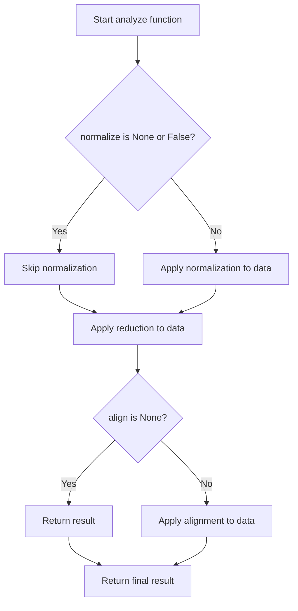

# `analyze.py`

## `hypertools.tools.analyze.analyze` · *function*

## Summary:
Applies a sequential pipeline of data transformations to multi-subject neuroimaging data.

## Description:
The analyze function implements a data processing pipeline that sequentially applies normalization, dimensionality reduction, and alignment operations to multi-subject neuroimaging data. This function serves as a convenience wrapper that chains together the core processing steps, allowing users to specify all transformations in a single call rather than managing them separately.

## Args:
    data (list of numpy.ndarray): List of subject data matrices, where each matrix represents neural activity for one subject. Each matrix should have shape (n_samples, n_features).
    normalize (str or bool or None, optional): Normalization method to apply. Can be 'across', 'within', 'row', or None. Defaults to None.
    reduce (str or dict or None, optional): Reduction method to apply. Can be a string identifier or dictionary with model specification. Defaults to None.
    ndims (int or None, optional): Number of dimensions to reduce to. Defaults to None.
    align (str or bool or dict, optional): Alignment method to apply. Can be 'hyper', 'SRM', True, or None. Defaults to None.
    internal (bool, optional): Internal flag controlling return behavior. When True, returns list; when False, returns single item if applicable. Defaults to False.

## Returns:
    list of numpy.ndarray or numpy.ndarray: Processed data after applying all transformations. Returns a list when internal=True or multiple subjects are processed, otherwise returns a single array.

## Raises:
    ValueError: When invalid parameters are provided to the underlying processing functions
    ValueError: When insufficient subjects are provided for alignment methods requiring multiple subjects

## Constraints:
    Precondition: Data should be a list of numpy arrays with consistent sample dimensions
    Precondition: For alignment methods requiring multiple subjects, data should contain at least 2 subjects
    Postcondition: All returned arrays will have consistent shapes and be processed according to the specified pipeline

## Side Effects:
    Issues warnings for deprecated parameter usage in underlying functions
    May modify data shapes through normalization and reduction operations
    May issue warnings for potential overfitting conditions or single subject data

## Control Flow:

## Examples:
    # Basic usage with no transformations
    result = analyze([subject1_data, subject2_data])
    
    # Apply normalization and reduction
    result = analyze([subject1_data, subject2_data], 
                     normalize='across', 
                     reduce='IncrementalPCA', 
                     ndims=10)
    
    # Apply full pipeline with alignment
    result = analyze([subject1_data, subject2_data, subject3_data],
                     normalize='within',
                     reduce='IncrementalPCA',
                     ndims=5,
                     align='hyper')

