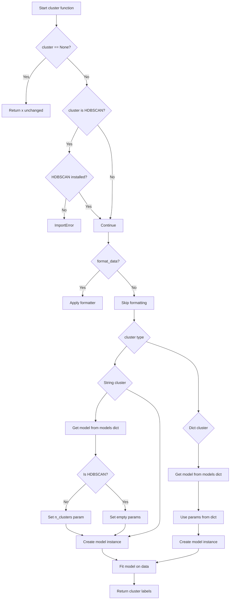

# `cluster.py`

## `hypertools.tools.cluster.cluster` · *function*

## Summary:
Performs clustering on input data using various clustering algorithms with flexible configuration options.

## Description:
This function provides a unified interface for applying different clustering algorithms to input data. It supports string-based specification of clustering methods (like 'KMeans', 'HDBSCAN') or dictionary-based configuration for more detailed control. The function handles preprocessing of data and manages special cases like HDBSCAN installation requirements.

## Args:
    x (array-like): Input data to be clustered, typically a list of arrays or matrix
    cluster (str or dict, optional): Clustering algorithm to use. Can be a string name ('KMeans', 'HDBSCAN', etc.) or a dictionary with 'model' and 'params' keys. Defaults to 'KMeans'.
    n_clusters (int, optional): Number of clusters to form. Used when cluster is a string and not HDBSCAN. Defaults to 3.
    ndims (int, optional): Deprecated parameter for dimensionality reduction. Defaults to None.
    format_data (bool, optional): Whether to preprocess input data using formatter function. Defaults to True.

## Returns:
    list[int]: Cluster labels for each data point in the input, represented as integers

## Raises:
    ImportError: When HDBSCAN is requested but not installed (hdbscan package missing)

## Constraints:
    Preconditions:
        - Input data `x` should be compatible with numpy array operations
        - If cluster is a string, it must be a valid key in the models dictionary
        - If cluster is a dict, it must contain a 'model' key with a valid model name
    Postconditions:
        - Returns a list of integer cluster labels matching the length of input data
        - Input data remains unchanged

## Side Effects:
    - Issues a warning when ndims parameter is used (deprecated)
    - May raise ImportError if HDBSCAN is requested but not installed
    - Calls formatter function for data preprocessing if format_data=True

## Control Flow:

## Examples:
    # Basic KMeans clustering
    labels = cluster(data, cluster='KMeans', n_clusters=4)
    
    # Using HDBSCAN clustering
    labels = cluster(data, cluster='HDBSCAN')
    
    # Custom clustering with parameters
    custom_cluster = {'model': 'KMeans', 'params': {'n_clusters': 5, 'random_state': 42}}
    labels = cluster(data, cluster=custom_cluster)
    
    # Skip data formatting
    labels = cluster(data, format_data=False)

