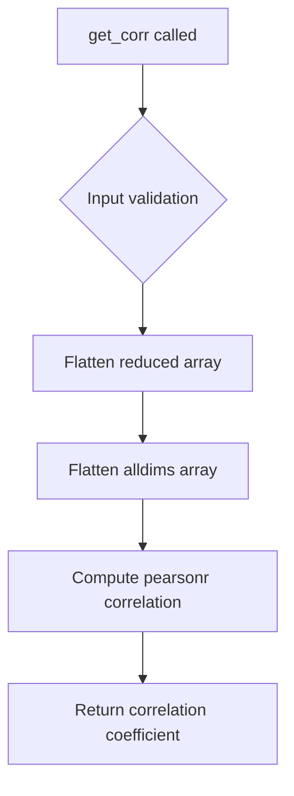

# `describe.py`

## `hypertools.tools.describe.describe` · *function*

## Summary:
Analyzes the correlation between original high-dimensional data and dimensionality-reduced representations across varying numbers of components.

## Description:
The describe function evaluates how well different dimensionality reduction techniques preserve the pairwise distance relationships in the original data. It computes correlation coefficients between the full-dimensional distance matrix and reduced-dimensional distance matrices for increasing numbers of components, providing insights into optimal dimensionality for data representation.

This function is typically called during exploratory data analysis to understand how many components are needed to retain meaningful information from the original high-dimensional space. The function can process both aggregated datasets and individual samples separately, returning correlation metrics that help guide dimensionality reduction decisions.

## Args:
    x (array-like): Input data to analyze, either as a single dataset or list of datasets. 
    reduce (str, optional): Dimensionality reduction technique to use. Defaults to 'IncrementalPCA'.
    max_dims (int, optional): Maximum number of dimensions to test. If None, automatically determined based on data shape (minimum of rows and columns).
    show (bool, optional): Whether to display a plot of correlation trends. Defaults to True.
    format_data (bool, optional): Whether to preprocess data using format_data function. Defaults to True.

## Returns:
    dict: A dictionary containing:
        - 'average': List of correlation coefficients for the entire dataset across different component counts
        - 'individual': List of correlation coefficients for each individual sample in the dataset

## Raises:
    None explicitly raised by this function, though underlying operations may raise exceptions from:
    - scipy.spatial.distance.cdist
    - scipy.stats.pearsonr
    - numpy operations
    - matplotlib/seaborn plotting functions

## Constraints:
    Preconditions:
    - Input data x must be convertible to a numpy array with numeric values
    - If x is a list, all elements must be compatible for vertical stacking via np.vstack
    - Data dimensions must be valid for the chosen reduction technique
    
    Postconditions:
    - Returns a dictionary with 'average' and 'individual' keys containing correlation lists
    - If show=True, displays a matplotlib plot showing correlation trends

## Side Effects:
    - Issues a deprecation warning when input data is large
    - May display matplotlib plots if show=True
    - Calls external functions (reducer, formatter) that may have their own side effects

## Control Flow:
```mermaid
flowchart TD
    A[describe called] --> B{format_data enabled?}
    B -->|Yes| C[Call formatter(x, ppca=True)]
    B -->|No| D[Skip formatting]
    C --> E[Initialize result dict]
    D --> E
    E --> F[Call summary(x, max_dims)]
    F --> G[Call summary for each x_i in x]
    G --> H{max_dims None?}
    H -->|Yes| I[Set max_dims = len(result['average'])]
    H -->|No| J[Skip setting max_dims]
    I --> K{show enabled?}
    J --> K
    K -->|Yes| L[Create matplotlib figure]
    L --> M[Plot with sns.tsplot]
    M --> N[Show plot]
    N --> O[Return result]
    K -->|No| O
```

## Examples:
```python
# Basic usage with default parameters
import numpy as np
data = np.random.rand(100, 10)
result = describe(data)

# Using custom reduction method and limiting dimensions
result = describe(data, reduce='PCA', max_dims=5, show=False)

# Processing list of datasets
datasets = [np.random.rand(50, 5), np.random.rand(50, 5)]
result = describe(datasets)
```

## `hypertools.tools.describe.get_corr` · *function*

## Summary:
Computes the Pearson correlation coefficient between flattened reduced and all-dimensions data arrays.

## Description:
This function calculates the linear correlation between two data arrays by flattening them and applying the Pearson correlation coefficient formula. It's designed to measure the strength and direction of the linear relationship between dimensionality-reduced data and the original high-dimensional data.

## Args:
    reduced (array-like): Array containing dimensionality-reduced data that has been processed through some reduction technique (like PCA, t-SNE, etc.).
    alldims (array-like): Array containing the original high-dimensional data.

## Returns:
    float: The Pearson correlation coefficient between the flattened reduced and all-dimensions arrays, ranging from -1 to 1. A value near 1 indicates strong positive correlation, near -1 indicates strong negative correlation, and near 0 indicates no linear correlation.

## Raises:
    None explicitly raised by this function, though underlying scipy.stats.pearsonr may raise ValueError for invalid inputs.

## Constraints:
    Preconditions:
    - Both `reduced` and `alldims` must be array-like objects that support `.ravel()` method
    - Both arrays must contain numeric data
    - Arrays should have compatible shapes that allow flattening to vectors of equal length
    
    Postconditions:
    - Returns a float value in the range [-1.0, 1.0]
    - The returned value represents the linear correlation between the flattened arrays

## Side Effects:
    None

## Control Flow:


## Examples:
```python
# Basic usage
import numpy as np
reduced_data = np.array([[1, 2], [3, 4]])
all_dims_data = np.array([[2, 4], [6, 8]])
correlation = get_corr(reduced_data, all_dims_data)
# Returns 1.0 (perfect positive correlation)

# With mixed data
reduced_data = np.array([[1, 2], [3, 4]])
all_dims_data = np.array([[2, 4], [6, 8]])
correlation = get_corr(reduced_data, all_dims_data)
# Returns 1.0 (perfect positive correlation)
```

## `hypertools.tools.describe.get_cdist` · *function*

## Summary:
Computes the pairwise Euclidean distance matrix for all samples in the input data.

## Description:
This function calculates the pairwise Euclidean distances between all rows in the input array, returning a symmetric distance matrix where each element [i,j] represents the Euclidean distance between sample i and sample j. The function serves as a thin wrapper around scipy's cdist function, specifically designed to compute distances between all samples in a dataset against themselves.

## Args:
    x (array-like): Input data array of shape (n_samples, n_features) where n_samples is the number of samples and n_features is the number of features.

## Returns:
    ndarray: A symmetric distance matrix of shape (n_samples, n_samples) where element [i,j] represents the Euclidean distance between sample i and sample j. The diagonal elements are zero since each point's distance to itself is zero.

## Raises:
    None explicitly raised by this function, though scipy.spatial.distance.cdist may raise exceptions for invalid inputs such as non-numeric data or incompatible dimensions.

## Constraints:
    Precondition: Input x must be a valid array-like object that can be converted to a numpy array with numeric values.
    Postcondition: Output is a symmetric matrix with zeros on the diagonal (distance from each point to itself).

## Side Effects:
    None

## Control Flow:
```mermaid
flowchart TD
    A[get_cdist called with x] --> B{Input validation}
    B --> C[Call cdist(x, x)]
    C --> D[Return distance matrix]
```

## Examples:
```python
# Basic usage
import numpy as np
data = np.array([[1, 2], [3, 4], [5, 6]])
distances = get_cdist(data)
# Returns a 3x3 matrix with pairwise distances

# With different data types
from sklearn.datasets import make_blobs
X, _ = make_blobs(n_samples=10, centers=2, random_state=42)
distance_matrix = get_cdist(X)
```

