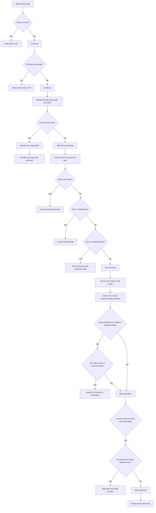

# `format_data.py`

## `hypertools.tools.format_data.format_data` · *function*

## Summary:
Formats and standardizes mixed-type data (text, numerical, dataframe, geometric) into consistent numerical matrices suitable for downstream analysis.

## Description:
The `format_data` function serves as a data preprocessing pipeline that normalizes diverse input data types into uniform numerical representations. It handles heterogeneous data sources including text strings, numerical arrays, pandas DataFrames, and DataGeometry objects, converting them into standardized matrix formats. The function orchestrates text processing with vectorization and semantic modeling, applies dimensionality reduction for missing data imputation, and aligns multi-modal data into common spaces when appropriate.

This logic is extracted into its own function to encapsulate the complex data type detection, conversion, and preprocessing workflow. By centralizing this logic, it ensures consistent data formatting across different analysis pipelines while maintaining flexibility for various input types and processing options.

## Args:
    x (any): Input data that can be a single item or list of items. Supports strings, lists, NumPy arrays, pandas DataFrames, and DataGeometry objects.
    vectorizer (str, optional): Text vectorization method to use. Defaults to 'CountVectorizer'. Can be string identifier, dictionary with 'model' and 'params', or class instance.
    semantic (str, optional): Semantic modeling method for text data. Defaults to 'LatentDirichletAllocation'. Can be string identifier, dictionary with 'model' and 'params', or class instance.
    corpus (str, optional): Built-in corpus name for pre-trained models. Defaults to 'wiki'. Valid values are 'wiki', 'nips', 'sotus'.
    ppca (bool, optional): Whether to apply PPCA for missing data imputation. Defaults to True.
    text_align (str, optional): Alignment method for mixed text-numerical data. Defaults to 'hyper'. Used when both text and numerical data are present with matching sample counts.

## Returns:
    list: A list of numerical numpy arrays, each representing the formatted version of the corresponding input data item. All returned arrays have consistent dimensional structures suitable for analysis.

## Raises:
    RuntimeError: When vectorizer or semantic model doesn't have the required fit_transform method following scikit-learn API.
    TypeError: When input data types are not supported by the get_type helper function.

## Constraints:
    Preconditions:
        - Input data must be compatible with the get_type helper function
        - All data items must be convertible to numerical representations
        - For text processing, vectorizer and semantic parameters must be valid
        - For alignment operations, data must have consistent sample dimensions
        
    Postconditions:
        - All returned arrays are 2-dimensional numpy arrays
        - Text data is converted to numerical representations using specified methods
        - Numerical data is properly formatted and potentially imputed
        - Mixed data types are aligned into common spaces when applicable

## Side Effects:
    - Issues warnings for missing data imputation using PPCA
    - Issues warnings for data alignment operations
    - May perform file I/O when loading pre-trained models or example datasets
    - Modifies data shapes through padding and truncation operations during alignment

## Control Flow:


## Examples:
    # Basic usage with text data
    formatted_data = format_data(["Hello world", "Another document"])
    
    # With numerical data
    formatted_data = format_data([[1, 2, 3], [4, 5, 6]])
    
    # Mixed data types
    formatted_data = format_data([
        "Text document",
        [1, 2, 3],
        pd.DataFrame({'A': [1, 2], 'B': [3, 4]})
    ])
    
    # Custom parameters
    formatted_data = format_data(
        ["Document one", "Document two"],
        vectorizer="TfidfVectorizer",
        semantic="NMF",
        ppca=False
    )

## `hypertools.tools.format_data.fill_missing` · *function*

## Summary:
Imputes missing values in data arrays using probabilistic principal component analysis (PPCA) while preserving the original data structure.

## Description:
This function applies probabilistic principal component analysis to impute missing values in data arrays. It stacks multiple input arrays vertically, fits a PPCA model on the combined dataset, transforms the data using PCA, and then splits the results back into the original array structure. Arrays with all-NaN rows are handled specially by setting those positions to NaN in the transformed output. This function is particularly useful for preprocessing datasets with missing values before downstream analysis.

## Args:
    x (list): A list of data arrays (NumPy arrays, lists, or similar structures) that may contain missing values represented as NaN. All arrays should have compatible column dimensions for vertical stacking.

## Returns:
    list: A list of processed arrays with missing values filled using PCA imputation. If the input contains multiple arrays, the output maintains the same number of arrays with their original shapes. If a single array is provided, returns a list containing one processed array.

## Raises:
    RuntimeError: When underlying PPCA operations fail due to invalid data or model configuration.
    AssertionError: When underlying PPCA operations encounter validation errors.

## Constraints:
    Preconditions:
        - Input x must be a list of data structures that can be vertically stacked using np.vstack
        - All elements in x should have compatible column dimensions for vertical concatenation
        - Elements in x should be compatible with the PPCA algorithm requirements
        
    Postconditions:
        - Output list contains the same number of elements as the input list
        - Each output array has the same shape as its corresponding input array
        - Missing values in input arrays are replaced with PCA-imputed values in output arrays
        - Rows that were entirely missing (all NaN) in the input are marked as NaN in the output

## Side Effects:
    None: This function performs no I/O operations or external state mutations.

## Control Flow:
```mermaid
flowchart TD
    A[Start fill_missing(x)] --> B[Stack arrays with np.vstack(x)]
    B --> C[Initialize PPCA model]
    C --> D[Fit PPCA model on stacked data]
    D --> E[Transform data with PCA]
    E --> F[Find indices of all-NaN rows]
    F --> G{Any all-NaN rows?}
    G -- Yes --> H[Set corresponding PCA results to NaN]
    G -- No --> I[Skip NaN handling]
    I --> J{Multiple input arrays?}
    J -- Yes --> K[Split transformed data back to original chunks]
    J -- No --> L[Return single transformed array]
    H --> J
    K --> M[Return split arrays]
    L --> M
    M[Return result list]
```

## Examples:
    >>> import numpy as np
    >>> # Single array with missing values
    >>> data = np.array([[1, 2], [np.nan, np.nan], [3, 4]])
    >>> result = fill_missing([data])
    >>> print(result[0])
    # Returns array with imputed values
    
    >>> # Multiple arrays
    >>> arr1 = np.array([[1, 2], [np.nan, np.nan]])
    >>> arr2 = np.array([[3, 4], [5, 6]])
    >>> result = fill_missing([arr1, arr2])
    >>> print(len(result))
    # Returns 2 arrays with imputed values

