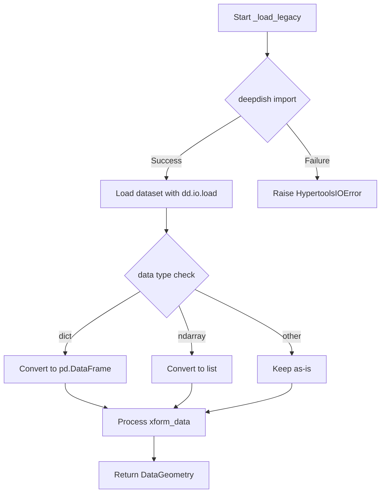

# `load.py`

## `hypertools.tools.load.load` · *function*

## Summary
Loads data from either built-in example datasets or file paths, with optional preprocessing and visualization capabilities.

## Description
The `load` function serves as the primary entry point for loading data into the hypertools ecosystem. It supports loading from both predefined example datasets and user-provided files, with automatic handling of different data formats and legacy compatibility. The function can optionally apply dimensionality reduction, alignment, and normalization transformations before returning results, making it suitable for both quick exploratory analysis and full data processing pipelines.

This function is extracted from inline logic to provide a clean abstraction layer that separates data loading concerns from data processing and visualization concerns. It encapsulates the complexity of handling multiple data sources, file formats, and backward compatibility while providing a unified interface for users.

## Args
- dataset (str): Path to a .geo file or name of a built-in example dataset. Valid example dataset names include 'weights', 'weights_avg', 'weights_sample', 'spiral', 'mushrooms', 'wiki', 'nips', 'sotus', 'wiki_model', 'nips_model', 'sotus_model'. This parameter is required.
- reduce (str, optional): Dimensionality reduction technique to apply. Defaults to 'IncrementalPCA' when any transformation parameters are specified.
- ndims (int, optional): Number of dimensions for reduction.
- align (bool, optional): Whether to align data using canonical correlation analysis.
- normalize (bool, optional): Whether to normalize data.
- legacy (bool): If True, attempts to load legacy-format files using deepdish. Defaults to False.

## Returns
- DataGeometry: A DataGeometry object containing the loaded data, when no transformation parameters are specified.
- matplotlib.figure.Figure: The result of plotting the transformed data, when any transformation parameters (reduce, ndims, align, normalize) are specified.

## Raises
- HypertoolsIOError: Raised when:
  - A dataset path doesn't exist or isn't a file
  - A dataset name is not recognized as a built-in example
  - A file cannot be loaded due to pickle corruption
  - Legacy files cannot be loaded due to missing deepdish dependency

## Constraints
- Preconditions:
  - If dataset is a path, it must resolve to an existing file
  - If dataset is an example name, it must be one of the predefined example datasets
  - If legacy=True, the deepdish package must be installed
- Postconditions:
  - If dataset is an example dataset, the returned DataGeometry object will contain properly formatted data
  - If dataset is a file path, the returned DataGeometry object will contain the loaded data
  - If transformation parameters are specified, the returned object will be a plot result

## Side Effects
- File I/O: Reads from the filesystem when loading from file paths
- Network I/O: Downloads example datasets if they are not cached locally (via _load_example_data)
- Cache management: Manages local cache of example datasets (via _load_example_data)

## Control Flow
```mermaid
flowchart TD
    A[Start load] --> B{dataset in EXAMPLE_DATA?}
    B -- Yes --> C[_load_example_data(dataset)]
    C --> D{dataset ends with _model?}
    D -- Yes --> E[Return geo_data]
    D -- No --> F[Continue]
    B -- No --> G[Resolve dataset path]
    G --> H{Path is file?}
    H -- No --> I[Raise HypertoolsIOError]
    H -- Yes --> J{legacy=True?}
    J -- Yes --> K[_load_legacy(dataset_path)]
    J -- No --> L[Try pickle.loads()]
    L --> M{pickle.UnpicklingError?}
    M -- Yes --> N[Raise HypertoolsIOError]
    M -- No --> O[Check geo_data.data type]
    O --> P{isinstance(geo_data.data, dict)?}
    P -- Yes --> Q[Convert to pd.DataFrame]
    P -- No --> R[Continue]
    R --> S{Any transformation params?}
    S -- Yes --> T[Import plot]
    T --> U[Set reduce default]
    U --> V[analyze(geo_data.get_data(), ...)]
    V --> W[plot(d, show=False)]
    S -- No --> X[Return geo_data]
```

## Examples
```python
# Load an example dataset
data_geom = load('spiral')

# Load a file and apply transformations
transformed_plot = load('my_data.geo', reduce='PCA', ndims=3)

# Load legacy format data
legacy_data = load('legacy_data.h5', legacy=True)

# Load example model data
model_data = load('wiki_model')
```

## `hypertools.tools.load._load_legacy` · *function*

## Summary:
Loads legacy-format dataset files and converts them into a DataGeometry object for analysis.

## Description:
This function provides support for loading datasets stored in the legacy format using the deepdish library. It reads the serialized data from disk, performs necessary type conversions on the loaded data (such as converting dictionaries to DataFrames and numpy arrays to lists), and constructs a DataGeometry object that can be used for further analysis and visualization within the hypertools framework.

The function is extracted into its own component to separate the concerns of legacy data loading from the main data processing pipeline, ensuring clean architecture and maintainability.

## Args:
    dataset_path (str): The file path to the legacy-format dataset file to be loaded.

## Returns:
    DataGeometry: A DataGeometry object containing the loaded data and associated metadata, ready for analysis and visualization.

## Raises:
    HypertoolsIOError: Raised when the 'deepdish' module is not installed, preventing loading of legacy-format datasets.

## Constraints:
    Preconditions:
    - The dataset_path must point to a valid file in legacy format that can be read by deepdish
    - The deepdish module must be available in the Python environment
    
    Postconditions:
    - The returned DataGeometry object contains properly formatted data
    - All data fields are converted to appropriate types for downstream processing

## Side Effects:
    - Reads from the filesystem at the specified dataset_path
    - May raise ImportError if deepdish is not installed (handled by HypertoolsIOError)

## Control Flow:


## Examples:
```python
# Load a legacy dataset
geometry = _load_legacy("/path/to/legacy_dataset.h5")

# The returned object can be used for analysis
transformed_data = geometry.transform()
plot_result = geometry.plot()
```

## `hypertools.tools.load._load_example_data` · *function*

## Summary:
Loads cached example datasets, downloading them if necessary, and processes them into DataGeometry objects for analysis.

## Description:
This function provides access to pre-packaged example datasets used for demonstrating hypertools functionality. It manages a local cache of datasets, automatically downloading missing files from a remote source while ensuring proper directory structure exists. The function handles special processing for certain datasets like 'mushrooms' to ensure compatibility with downstream analysis pipelines.

The function is designed to be a centralized interface for accessing example data, abstracting away the complexity of caching, downloading, and data format conversion. It enforces the boundary between data acquisition and data processing by separating concerns between file management and data transformation.

## Args:
    dataset (str): Name identifier for the example dataset to load. This corresponds to a filename that will be used to construct a path under the global DATA_DIR directory.

## Returns:
    DataGeometry: A DataGeometry object containing the loaded dataset. For the 'mushrooms' dataset specifically, the underlying data is converted to a pandas DataFrame.

## Raises:
    HypertoolsIOError: Raised when the dataset cannot be loaded due to file system issues, network problems during download, or corrupted cached files. The error message suggests clearing the cache and retrying.

## Constraints:
    Preconditions:
    - The dataset parameter must be a valid string that can be used as a filename
    - The global DATA_DIR variable must be properly initialized as a Path object pointing to a valid directory location
    - The system must have network connectivity to download datasets if they are not cached locally
    
    Postconditions:
    - If successful, the requested dataset will be available in the local cache directory
    - The returned DataGeometry object will contain the processed dataset ready for analysis

## Side Effects:
    - File I/O: Creates directories and writes downloaded files to the local cache directory specified by DATA_DIR
    - Network I/O: Makes HTTP requests to download datasets from a remote server when files are not cached locally
    - Cache management: Automatically removes corrupted cache files and redownloads when necessary

## Control Flow:
```mermaid
flowchart TD
    A[Start _load_example_data] --> B[Construct dataset_path from DATA_DIR + dataset]
    B --> C{dataset_path.is_file()?}
    C -- No --> D{DATA_DIR.is_dir()?}
    D -- No --> E[Create DATA_DIR directory]
    E --> F[Call _download_example_data(dataset_path)]
    C -- Yes --> G[Try to load with pickle.loads()]
    G --> H{Exception raised?}
    H -- Yes --> I[Raise HypertoolsIOError with cache hint]
    H -- No --> J{dataset == 'mushrooms'?}
    J -- Yes --> K[Convert geo_data.data to pd.DataFrame]
    J -- No --> L[Return geo_data]
    I --> M[Return geo_data]
```

## `hypertools.tools.load._download_example_data` · *function*

## Summary:
Downloads example datasets from a remote server using file identifiers and saves them to a local path.

## Description:
This function downloads example datasets from a remote server (likely Google Drive) using file identifiers stored in a global mapping. It handles the complete download process including managing download warnings that Google Drive may present. The function is designed to be reusable for downloading various example datasets and includes proper error handling that cleans up partial downloads.

## Args:
    dataset_path (pathlib.Path): A pathlib.Path object specifying the local file path where the downloaded dataset should be saved. The parent directory must exist or be creatable.

## Returns:
    None: This function does not return any value.

## Raises:
    HypertoolsIOError: Raised when the download fails due to network issues, invalid file identifiers, or file system errors. The error message includes the name of the dataset that failed to download.

## Constraints:
    Preconditions:
    - The dataset_path must be a valid pathlib.Path object
    - The dataset_path.parent directory must exist or be creatable
    - The dataset_path.name must exist as a key in the global EXAMPLE_DATA dictionary
    - The global BASE_URL constant must be defined and point to a valid remote download endpoint
    
    Postconditions:
    - If successful, the file at dataset_path will contain the downloaded dataset
    - If unsuccessful, the file at dataset_path will be removed (if it existed)

## Side Effects:
    - Network I/O: Makes HTTP GET requests to a remote server via the requests library
    - File I/O: Writes data to the filesystem at the location specified by dataset_path
    - Temporary file cleanup: Removes partially downloaded files on failure

## Control Flow:
```mermaid
flowchart TD
    A[Start _download_example_data] --> B{dataset_path.name in EXAMPLE_DATA?}
    B -- Yes --> C[Get file_id from EXAMPLE_DATA]
    C --> D[Create requests.Session()]
    D --> E[Set params with file_id]
    E --> F[Make GET request to BASE_URL]
    F --> G{Response contains download_warning cookie?}
    G -- Yes --> H[Extract warning confirmation value]
    H --> I[Update params with confirm value]
    I --> J[Make second GET request with confirmation]
    G -- No --> J
    J --> K[Open dataset_path for writing in binary mode]
    K --> L[Iterate through response chunks]
    L --> M{Chunk available?}
    M -- Yes --> N[Write chunk to file]
    M -- No --> O[Continue to next chunk]
    N --> L
    O --> P[Close file handle]
    P --> Q[Return successfully]
    J --> R{Exception raised?}
    R -- Yes --> S[Delete dataset_path if exists]
    S --> T[Raise HypertoolsIOError]
    R -- No --> Q
```

## Examples:
    # Download a sample dataset
    from pathlib import Path
    dataset_path = Path.home() / "datasets" / "sample_data.h5"
    _download_example_data(dataset_path)
    
    # Handle potential errors
    try:
        _download_example_data(Path("data.csv"))
    except HypertoolsIOError as e:
        print(f"Download failed: {e}")

