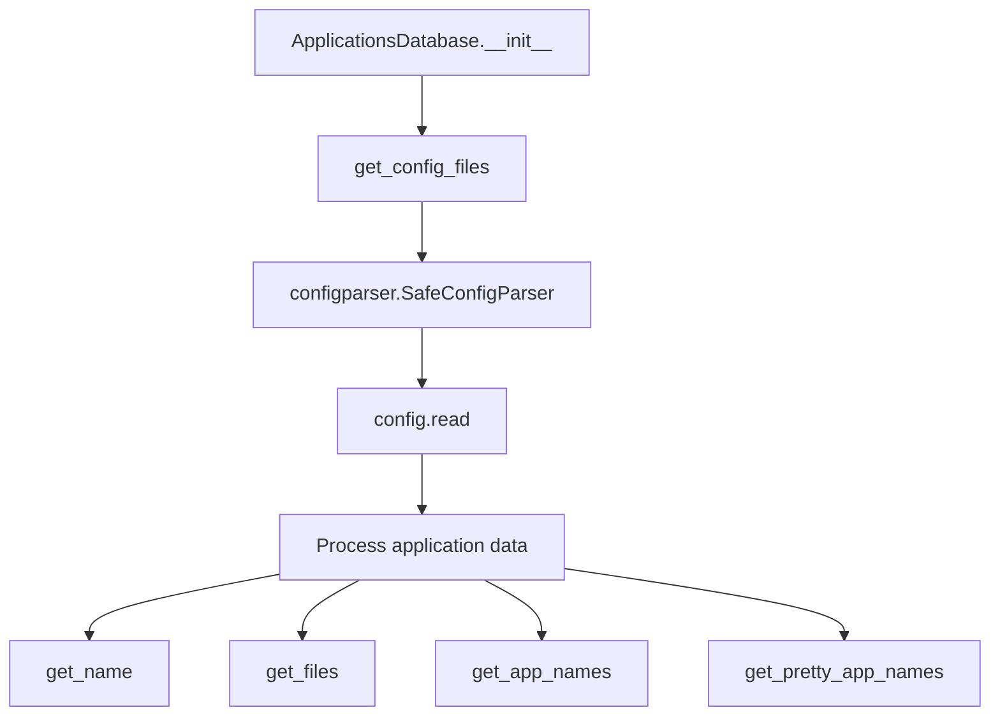

# `appsdb.py`

## `mackup.appsdb.ApplicationsDatabase` · *class*

## Summary:
Manages a database of applications and their configuration file paths loaded from .cfg files in built-in and custom directories.

## Description:
The ApplicationsDatabase class loads application metadata and configuration file paths from .cfg files located in the standard applications directory and a user-customizable directory. It provides methods to query application names, configuration files, and pretty names. This abstraction centralizes application configuration management and ensures consistent handling of both standard and XDG-compliant configuration file paths.

## State:
- `apps` (dict): Dictionary mapping application names to dictionaries containing:
  - `name` (str): Human-readable application name
  - `configuration_files` (set): Set of configuration file paths associated with the application
- `__init__` parameters: None required
- Class invariants: All configuration file paths stored in `configuration_files` sets are relative paths (no absolute paths allowed)

## Lifecycle:
- Creation: Instantiate without arguments; automatically loads configuration files from APPS_DIR and CUSTOM_APPS_DIR via `get_config_files()` static method
- Usage: Call getter methods (`get_name`, `get_files`, `get_app_names`, `get_pretty_app_names`) to retrieve application information
- Destruction: No explicit cleanup required; uses standard Python garbage collection

## Method Map:


## Raises:
- `ValueError`: When encountering absolute paths in configuration files or invalid $XDG_CONFIG_HOME environment variable values
- `configparser.Error`: When configuration files cannot be parsed properly (inherited from configparser)

## Example:
```python
# Create database instance
db = ApplicationsDatabase()

# Get all application names
app_names = db.get_app_names()

# Get configuration files for a specific app
files = db.get_files("vim")

# Get pretty application name
pretty_name = db.get_name("vim")
```

### `mackup.appsdb.ApplicationsDatabase.__init__` · *method*

## Summary:
Initializes the applications database by loading configuration files from standard and custom directories, parsing application metadata, and building internal mappings of application names to their configuration file paths.

## Description:
This method serves as the constructor for the ApplicationsDatabase class, responsible for bootstrapping the database with application information from .cfg configuration files. It scans both default and user-customizable application directories, processes each configuration file to extract application metadata and file paths, and performs validation on the configuration data to ensure proper formatting and security.

The method is separated from the class instantiation to allow for clean initialization logic and to make testing easier by isolating the file-loading and parsing behavior. It follows a systematic approach of reading configuration files, extracting application information, and normalizing file paths while enforcing security constraints.

## Args:
    None

## Returns:
    None

## Raises:
    ValueError: When encountering absolute paths in configuration files or invalid $XDG_CONFIG_HOME environment variable values
    configparser.Error: When configuration files cannot be parsed properly (inherited from configparser)

## State Changes:
    Attributes READ: None
    Attributes WRITTEN: 
    - self.apps (dict): Populated with application data including names and configuration file paths

## Constraints:
    Preconditions:
    - The APPS_DIR and CUSTOM_APPS_DIR constants must point to valid directories
    - Configuration files must follow the expected .cfg format with "application" section containing "name" key
    - Configuration files may optionally contain "configuration_files" and "xdg_configuration_files" sections
    
    Postconditions:
    - self.apps dictionary is populated with application entries
    - All configuration file paths in the database are relative paths (no absolute paths allowed)
    - Application names are stored without the .cfg file extension
    - XDG_CONFIG_HOME environment variable is validated to be within the user's home directory

## Side Effects:
    - Reads configuration files from the file system
    - Performs I/O operations to enumerate files in APPS_DIR and CUSTOM_APPS_DIR
    - Accesses environment variables (XDG_CONFIG_HOME)
    - Expands user home directory paths using os.path.expanduser

### `mackup.appsdb.ApplicationsDatabase.get_config_files` · *method*

## Summary:
Collects and returns all configuration files (.cfg) from both default and custom application directories.

## Description:
This function scans two directories for configuration files with the .cfg extension and returns a set containing the full paths to all unique configuration files found. It prioritizes custom configuration files over default ones by checking for duplicates and ensuring custom files take precedence.

## Args:
    None

## Returns:
    set[str]: A set of absolute file paths pointing to .cfg configuration files found in either the default applications directory or the user's custom applications directory.

## Raises:
    None explicitly raised

## State Changes:
    None

## Constraints:
    Preconditions:
    - The APPS_DIR constant must point to a valid directory relative to the location of this file
    - The CUSTOM_APPS_DIR constant must point to a valid directory within the user's home directory
    - The function assumes standard Unix/Linux file system conventions
    
    Postconditions:
    - Returns a set of absolute file paths to .cfg files
    - Custom files take precedence over default files with the same basename
    - All returned paths are absolute paths

## Side Effects:
    - Reads from the file system to check directory existence and list directory contents
    - May perform multiple I/O operations to enumerate files in both directories

### `mackup.appsdb.ApplicationsDatabase.get_name` · *method*

## Summary:
Retrieves the pretty name of a specified application from the database.

## Description:
Provides access to the human-readable name of an application by looking up its identifier in the internal applications database. This method serves as a clean interface for retrieving application naming information without exposing the internal dictionary structure directly.

The method is part of the ApplicationsDatabase class which loads application configuration from .cfg files in predefined directories. It's designed as a dedicated accessor method to maintain encapsulation while providing controlled access to application name metadata.

## Args:
    name (str): The unique identifier/name of the application to look up. This corresponds to the keys in the internal `self.apps` dictionary.

## Returns:
    str: The pretty application name associated with the specified application identifier.

## Raises:
    KeyError: When the specified application name does not exist in the database (i.e., when `name` is not a key in `self.apps`).

## State Changes:
    Attributes READ: self.apps
    Attributes WRITTEN: None

## Constraints:
    Preconditions: The ApplicationsDatabase instance must be properly initialized with the `__init__` method, ensuring `self.apps` contains the application data structure with the requested application name as a key.
    Postconditions: The returned string is the pretty application name stored in the database for the specified application.

## Side Effects:
    None

### `mackup.appsdb.ApplicationsDatabase.get_files` · *method*

## Summary:
Retrieves the set of configuration file paths associated with a specified application.

## Description:
Provides access to the collection of configuration file paths for a given application by looking up the application name in the internal applications database. This method serves as a clean interface for retrieving configuration file metadata without exposing the internal dictionary structure directly.

The method is part of the ApplicationsDatabase class which loads application configuration from .cfg files in predefined directories. It's designed as a dedicated accessor method to maintain encapsulation while providing controlled access to application configuration file information.

## Args:
    name (str): The unique identifier/name of the application to look up. This corresponds to the keys in the internal `self.apps` dictionary.

## Returns:
    set[str]: A set containing the relative file paths of configuration files associated with the specified application. Each path is a string representing a relative path within the user's configuration directory structure.

## Raises:
    KeyError: When the specified application name does not exist in the database (i.e., when `name` is not a key in `self.apps`).

## State Changes:
    Attributes READ: self.apps
    Attributes WRITTEN: None

## Constraints:
    Preconditions: The ApplicationsDatabase instance must be properly initialized with the `__init__` method, ensuring `self.apps` contains the application data structure with the requested application name as a key.
    Postconditions: The returned set is a copy of the internal configuration files set, so modifications to the returned set won't affect the internal data structure.

## Side Effects:
    None

### `mackup.appsdb.ApplicationsDatabase.get_app_names` · *method*

## Summary:
Returns a set containing the names of all registered applications in the database.

## Description:
This method extracts and returns the unique names of all applications currently stored in the ApplicationsDatabase instance. It provides a convenient way to obtain a collection of application identifiers without needing to access the underlying dictionary structure directly.

The method is designed as a separate utility function to encapsulate the logic of retrieving application names, making the code more readable and maintainable by providing a clear interface for this specific operation.

## Args:
    None

## Returns:
    set[str]: A set containing the names (keys) of all applications in the database. Each name is a string representing the application identifier.

## Raises:
    None

## State Changes:
    Attributes READ: self.apps
    Attributes WRITTEN: None

## Constraints:
    Preconditions: The ApplicationsDatabase instance must be properly initialized with the `__init__` method, ensuring `self.apps` is a dictionary.
    Postconditions: The returned set contains all unique application names from `self.apps`. The original `self.apps` dictionary remains unchanged.

## Side Effects:
    None

### `mackup.appsdb.ApplicationsDatabase.get_pretty_app_names` · *method*

## Summary:
Returns a set of human-readable application names by transforming all registered application identifiers.

## Description:
This method provides access to the pretty (human-readable) names of all applications currently registered in the database. It transforms the internal application identifiers into their corresponding user-friendly names by leveraging the existing `get_name()` method.

The method is designed as a separate utility function to encapsulate the logic of retrieving and transforming application names, making the code more readable and maintainable by providing a clear interface for accessing formatted application names.

## Args:
    None

## Returns:
    set[str]: A set containing the pretty application names of all registered applications. Each name is a string representing the human-readable form of an application.

## Raises:
    None

## State Changes:
    Attributes READ: self.apps (through get_app_names() and get_name())
    Attributes WRITTEN: None

## Constraints:
    Preconditions: The ApplicationsDatabase instance must be properly initialized with the `__init__` method, ensuring `self.apps` is populated with application data.
    Postconditions: The returned set contains all pretty application names derived from the application identifiers in `self.apps`. The original `self.apps` dictionary remains unchanged.

## Side Effects:
    None

