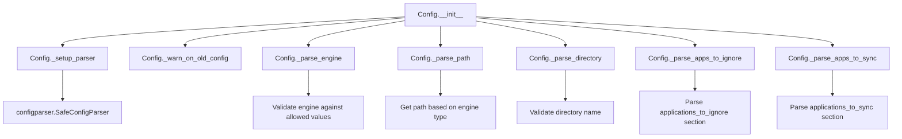
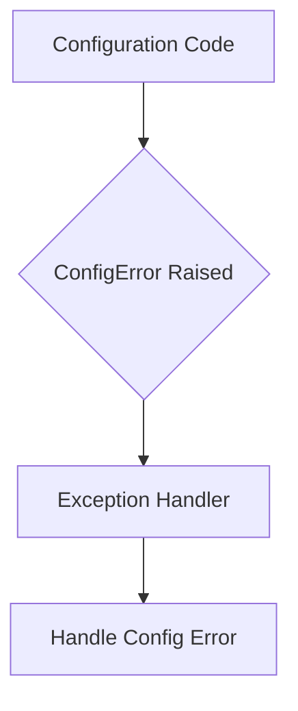

# `config.py`

## `mackup.config.Config` · *class*

## Summary:
Configuration class for managing Mackup backup settings and storage preferences.

## Description:
The Config class reads and parses configuration from a configuration file, handling various storage engines (Dropbox, Google Drive, Copy, iCloud, FileSystem) and managing application lists to ignore or synchronize. It provides properties to access parsed configuration values and validates configuration settings during initialization. The class ensures backward compatibility by warning about deprecated configuration formats.

## State:
- `_parser`: configparser.SafeConfigParser instance containing parsed configuration data
- `_engine`: string representing the chosen storage engine (one of ENGINE_DROPBOX, ENGINE_GDRIVE, ENGINE_COPY, ENGINE_ICLOUD, ENGINE_FS)
- `_path`: string representing the base storage path for backups
- `_directory`: string representing the backup directory name
- `_apps_to_ignore`: set of application names to exclude from backup
- `_apps_to_sync`: set of application names to include in backup
- `filename`: optional string parameter specifying the configuration file location (defaults to MACKUP_CONFIG_FILE)

## Lifecycle:
- Creation: Instantiate with optional filename parameter to specify config file location. The constructor validates the configuration file and raises exceptions for invalid settings.
- Usage: Access read-only properties like engine, path, directory, fullpath, apps_to_ignore, and apps_to_sync to retrieve configuration values.
- Destruction: No explicit cleanup required; relies on Python's garbage collection.

## Method Map:


## Raises:
- ConfigError: Raised when encountering unknown storage engines, invalid directory names, or missing required path configuration for filesystem engine
- AssertionError: Raised when filename parameter is not a string or None

## Example:
```python
# Create config with default settings
config = Config()

# Create config with custom filename
config = Config(".mackup_custom")

# Access configuration values
print(config.engine)           # e.g., "dropbox"
print(config.path)             # e.g., "/home/user/Dropbox"
print(config.directory)        # e.g., ".mackup"
print(config.fullpath)         # e.g., "/home/user/Dropbox/.mackup"
print(config.apps_to_ignore)   # e.g., {"vim", "git"}
print(config.apps_to_sync)     # e.g., {"firefox", "chrome"}
```

### `mackup.config.Config.__init__` · *method*

## Summary:
Initializes a configuration object by parsing settings from a configuration file and validating the parsed values.

## Description:
Sets up the configuration parser and parses various configuration options including storage engine, backup path, directory, and application synchronization settings. This method orchestrates the entire configuration loading process by calling several private parsing methods that handle specific aspects of the configuration.

The initialization process begins with setting up a configuration parser, followed by validation of deprecated configurations, and then parsing of all relevant configuration values. This method serves as the main entry point for loading configuration data and ensures all internal attributes are properly initialized.

## Args:
    filename (str, optional): Path to the configuration file. If None, uses the default configuration file path. Defaults to None.

## Returns:
    None: This method initializes instance attributes rather than returning a value.

## Raises:
    AssertionError: When filename argument is not a string or None.
    ConfigError: When invalid storage engine is specified or when file_system engine lacks required path configuration.

## State Changes:
    Attributes READ: None
    Attributes WRITTEN: 
    - self._parser: Configuration parser object
    - self._engine: Storage engine name
    - self._path: Backup storage path
    - self._directory: Storage directory path
    - self._apps_to_ignore: Set of application names to ignore
    - self._apps_to_sync: Set of application names to synchronize

## Constraints:
    Preconditions:
    - filename must be either a string or None
    - Configuration file must be readable if specified
    - Required configuration sections must exist for proper parsing
    
    Postconditions:
    - All configuration attributes are initialized
    - Deprecated configuration sections are validated and rejected if present
    - Storage engine is validated against supported engines
    - Application lists are parsed into sets

## Side Effects:
    I/O: Reads configuration file from disk
    External service calls: None
    Mutations to objects outside self: None

### `mackup.config.Config.engine` · *method*

## Summary:
Returns the configured storage engine type as a string.

## Description:
This property provides access to the storage engine configuration, which determines how Mackup synchronizes application settings. The engine is parsed from the configuration file during initialization and can be one of several supported storage backends.

## Args:
    None

## Returns:
    str: The storage engine type, one of 'dropbox', 'google_drive', 'copy', 'icloud', or 'file_system'

## Raises:
    None

## State Changes:
    Attributes READ: self._engine
    Attributes WRITTEN: None

## Constraints:
    Preconditions: The Config object must be properly initialized with a valid configuration parser
    Postconditions: The returned value is always a string representing a valid engine type

## Side Effects:
    None

### `mackup.config.Config.path` · *method*

## Summary:
Returns the string representation of the configured storage path for Mackup backups.

## Description:
Provides access to the root storage path where Mackup backups are located. This path is determined by the configured storage engine and may vary depending on whether Dropbox, Google Drive, Copy, iCloud, or a local filesystem location is used. The method serves as a property that returns the string representation of the internal `_path` attribute.

## Args:
    None

## Returns:
    str: The absolute filesystem path where Mackup backups are stored, formatted as a string.

## Raises:
    None

## State Changes:
    Attributes READ: self._path
    Attributes WRITTEN: None

## Constraints:
    Preconditions: The Config object must have been properly initialized with a valid configuration.
    Postconditions: The returned value is always a string representing a valid filesystem path.

## Side Effects:
    None

### `mackup.config.Config.directory` · *method*

## Summary:
Returns the configured backup directory path as a string.

## Description:
This property provides access to the backup directory path configured for Mackup. The directory path is parsed from the configuration file during object initialization and validated to ensure it doesn't use the reserved CUSTOM_APPS_DIR constant.

## Args:
    None

## Returns:
    str: The absolute path to the backup directory, guaranteed to be a string representation of the configured directory.

## Raises:
    None

## State Changes:
    Attributes READ: self._directory
    Attributes WRITTEN: None

## Constraints:
    Preconditions: The Config object must be properly initialized with a valid configuration.
    Postconditions: The returned value is always a string representation of the directory path.

## Side Effects:
    None

### `mackup.config.Config.fullpath` · *method*

## Summary:
Returns the absolute path combining the storage path and backup directory.

## Description:
This property constructs and returns the full filesystem path where Mackup backups are stored by joining the configured storage path with the backup directory. It provides a convenient way to access the complete backup location without manually constructing the path each time.

## Args:
    None

## Returns:
    str: The absolute filesystem path formed by joining self.path and self.directory.

## Raises:
    None

## State Changes:
    Attributes READ: self.path, self.directory
    Attributes WRITTEN: None

## Constraints:
    Preconditions: Both self.path and self.directory must be valid string representations of filesystem paths.
    Postconditions: The returned value is always a string representing a valid joined filesystem path.

## Side Effects:
    None

### `mackup.config.Config.apps_to_ignore` · *method*

## Summary:
Returns a set of application names that should be excluded from backup operations.

## Description:
Provides read-only access to the collection of applications configured to be ignored during Mackup backup and restore operations. This property ensures consistent access to the ignored applications as a set data structure.

## Args:
    None

## Returns:
    set[str]: A set containing the names of applications that should be excluded from backup operations. Returns an empty set if no applications are configured to be ignored.

## Raises:
    None

## State Changes:
    Attributes READ: self._apps_to_ignore
    Attributes WRITTEN: None

## Constraints:
    Preconditions: The Config instance must be properly initialized with a valid configuration parser.
    Postconditions: The returned set is immutable and represents the current state of ignored applications.

## Side Effects:
    None

### `mackup.config.Config.apps_to_sync` · *method*

## Summary:
Returns a set of application names that should be synchronized by Mackup.

## Description:
Provides access to the collection of applications configured to be synced. This property ensures that external code receives a consistent set interface regardless of the internal storage mechanism. The method is called during the configuration parsing phase when the Config object is initialized.

## Args:
    None

## Returns:
    set[str]: A set containing the names of applications configured to be synchronized. Returns an empty set if no applications are explicitly configured for syncing.

## Raises:
    None

## State Changes:
    Attributes READ: self._apps_to_sync
    Attributes WRITTEN: None

## Constraints:
    Preconditions: The Config object must be properly initialized with a valid configuration parser.
    Postconditions: The returned set is always a fresh copy of the internal data, ensuring immutability of the internal state.

## Side Effects:
    None

### `mackup.config.Config._setup_parser` · *method*

*No documentation generated.*

### `mackup.config.Config._warn_on_old_config` · *method*

## Summary:
Checks for deprecated configuration sections and aborts execution if found.

## Description:
Validates the configuration file for deprecated sections that are no longer supported. If either "Allowed Applications" or "Ignored Applications" section is detected, the program will terminate with an error message instructing the user to migrate their configuration.

This method is called during the initialization of the Config class to prevent accidental usage of outdated configuration formats that could lead to unexpected behavior.

## Args:
    None

## Returns:
    None

## Raises:
    SystemExit: When deprecated configuration sections are detected, causing the program to terminate with an error message.

## State Changes:
    Attributes READ: self._parser
    Attributes WRITTEN: None

## Constraints:
    Preconditions: The Config instance must have been initialized with a valid parser object in self._parser
    Postconditions: If deprecated sections are found, the program exits; otherwise, no state changes occur

## Side Effects:
    I/O: Writes error message to stderr
    External service calls: None
    Mutations to objects outside self: None

### `mackup.config.Config._parse_engine` · *method*

## Summary:
Parses and validates the storage engine configuration option from the configuration file.

## Description:
Retrieves the storage engine setting from the 'storage' section of the configuration file. If the engine option is not specified, it defaults to Dropbox. Validates that the specified engine is one of the supported storage engines and raises an exception for unsupported engines.

This method is separated from other parsing methods to encapsulate the logic for handling storage engine configuration, making the configuration parsing process modular and easier to test independently.

## Args:
    None

## Returns:
    str: The validated storage engine name as a string, one of: 'dropbox', 'google_drive', 'copy', 'icloud', or 'file_system'

## Raises:
    ConfigError: When an unknown or unsupported storage engine is specified in the configuration file

## State Changes:
    Attributes READ: self._parser
    Attributes WRITTEN: None

## Constraints:
    Preconditions: 
    - self._parser must be initialized and contain the configuration data
    - The configuration must be loaded before calling this method
    
    Postconditions:
    - Returns a string representing a valid storage engine
    - The returned engine is one of the predefined supported engines

## Side Effects:
    None

### `mackup.config.Config._parse_path` · *method*

## Summary:
Determines and returns the appropriate backup storage path based on the configured storage engine.

## Description:
This private method selects the correct backup directory path according to the storage engine specified in the configuration. It delegates to engine-specific utility functions for cloud storage providers and handles local filesystem configuration parsing. The method is called during configuration processing to establish the proper backup location.

## Args:
    self: The Config instance containing engine configuration and parser state

## Returns:
    str: The absolute path to the backup storage location as a string

## Raises:
    ConfigError: When the 'file_system' engine is configured but no 'path' option is found in the storage section of the configuration

## State Changes:
    Attributes READ: self.engine, self._parser
    Attributes WRITTEN: None

## Constraints:
    Preconditions: 
    - self.engine must be one of the predefined ENGINE constants (ENGINE_DROPBOX, ENGINE_GDRIVE, ENGINE_COPY, ENGINE_ICLOUD, ENGINE_FS)
    - For ENGINE_FS, self._parser must be initialized and contain a 'storage' section with a 'path' option
    
    Postconditions:
    - Returns a valid string path that represents the backup storage location
    - The returned path is guaranteed to be absolute

## Side Effects:
    - Calls external utility functions that may perform I/O operations to locate storage directories
    - May raise ConfigError under specific configuration conditions

### `mackup.config.Config._parse_directory` · *method*

## Summary:
Determines and validates the storage directory path from configuration, returning a default if not specified.

## Description:
Parses the storage directory setting from the configuration file's [storage] section. This method ensures that the CUSTOM_APPS_DIR cannot be used as a storage directory and provides a fallback to MACKUP_BACKUP_PATH when no directory is configured.

## Args:
    None

## Returns:
    str: The storage directory path, either from configuration or the default MACKUP_BACKUP_PATH.

## Raises:
    ConfigError: When the configured directory equals CUSTOM_APPS_DIR, which is not allowed as a storage directory.

## State Changes:
    Attributes READ: self._parser
    Attributes WRITTEN: None (this method is read-only)

## Constraints:
    Preconditions: 
    - self._parser must be initialized and contain configuration data
    - The configuration parser must support the has_option() and get() methods
    
    Postconditions:
    - Returns a string representing a valid directory path
    - Will not return CUSTOM_APPS_DIR as the directory value

## Side Effects:
    None

### `mackup.config.Config._parse_apps_to_ignore` · *method*

## Summary:
Parses the configuration file to extract a set of application names that should be excluded from backup operations.

## Description:
This method reads the "applications_to_ignore" section from the configuration parser and returns a set of application names that should be skipped during the backup process. It's designed to be called during object initialization to populate the internal `_apps_to_ignore` attribute. The method follows the same pattern as `_parse_apps_to_sync` but focuses on ignored applications rather than synchronized ones.

## Args:
    None

## Returns:
    set[str]: A set of application names to ignore during backup operations. Returns an empty set if the "applications_to_ignore" section doesn't exist in the configuration.

## Raises:
    None explicitly raised

## State Changes:
    Attributes READ: self._parser
    Attributes WRITTEN: None (this method is read-only)

## Constraints:
    Preconditions: 
    - self._parser must be initialized and contain valid configuration data
    - The method assumes self._parser is a configparser instance with proper sections
    
    Postconditions:
    - Returns a set of strings representing application names to ignore
    - The returned set is empty if no "applications_to_ignore" section exists

## Side Effects:
    None

### `mackup.config.Config._parse_apps_to_sync` · *method*

## Summary:
Parses the configuration file to extract a set of application names that should be synchronized during backup operations.

## Description:
This method reads the "applications_to_sync" section from the configuration parser and returns a set of application names that should be included in the backup process. It's designed to be called during object initialization to populate the internal `_apps_to_sync` attribute. The method follows the same pattern as `_parse_apps_to_ignore` but focuses on applications to synchronize rather than those to ignore.

This logic is separated into its own method to maintain clean code organization and consistency with other configuration parsing methods in the class. It encapsulates the specific logic for handling the applications_to_sync configuration section, making the initialization process more readable and maintainable.

## Args:
    None

## Returns:
    set[str]: A set of application names to synchronize during backup operations. Returns an empty set if the "applications_to_sync" section doesn't exist in the configuration.

## Raises:
    None explicitly raised

## State Changes:
    Attributes READ: self._parser
    Attributes WRITTEN: None (this method is read-only)

## Constraints:
    Preconditions: 
    - self._parser must be initialized and contain valid configuration data
    - The method assumes self._parser is a configparser instance with proper sections
    
    Postconditions:
    - Returns a set of strings representing application names to synchronize
    - The returned set is empty if no "applications_to_sync" section exists

## Side Effects:
    None

## `mackup.config.ConfigError` · *class*

## Summary:
Custom exception class for configuration-related errors in the Mackup backup system.

## Description:
The ConfigError class is a custom exception type that extends Python's built-in Exception class. It serves as a specialized error type within the Mackup configuration management system to distinguish configuration-related failures from other types of exceptions. This exception is intended to be raised when the system encounters issues during configuration processing, such as invalid configuration files, missing configuration paths, or other configuration validation problems.

## State:
- Inherits from: Exception
- No instance attributes: This is a basic exception class with no additional state beyond what's inherited from Exception
- No constructor parameters: The class doesn't define an __init__ method, so it uses the parent Exception constructor

## Lifecycle:
- Creation: Instantiated by raising the exception directly with `raise ConfigError("message")` or `raise ConfigError()`
- Usage: Caught by exception handlers that specifically handle configuration errors using `except ConfigError:` or caught as a general Exception
- Destruction: Automatically cleaned up by Python's garbage collector after being handled

## Method Map:


## Raises:
- Raised when configuration validation fails
- Raised when required configuration paths cannot be accessed
- Raised when configuration file parsing encounters errors
- Raised when environment variables or system paths are invalid

## Example:
```python
# Raising the exception
raise ConfigError("Invalid configuration file format")

# Catching the exception
try:
    process_configuration()
except ConfigError as e:
    handle_config_error(e)
```

