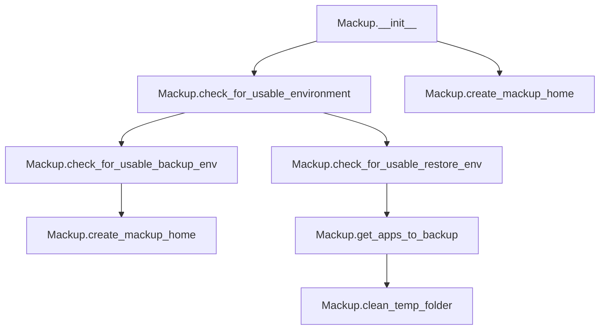

# `mackup.py`

## `mackup.mackup.Mackup` · *class*

## Summary:
Main class for managing Mackup configuration backup and restore operations.

## Description:
The Mackup class serves as the central coordinator for configuration backup and restore functionality. It handles environment validation, directory management, and application selection for backup operations. The class orchestrates interactions between configuration management, application databases, and utility functions to provide a cohesive backup solution.

## State:
- `_config`: config.Config instance containing parsed configuration settings
- `mackup_folder`: str representing the full path to the Mackup storage directory
- `temp_folder`: str representing the path to a temporary directory created for operations

## Lifecycle:
- Creation: Instantiate without arguments. The constructor initializes configuration and creates a temporary directory.
- Usage: Call methods in sequence for backup/restore operations:
  1. Environment validation using `check_for_usable_environment()`
  2. Backup-specific setup using `check_for_usable_backup_env()`
  3. Restore-specific validation using `check_for_usable_restore_env()`
  4. Application selection using `get_apps_to_backup()`
  5. Cleanup using `clean_temp_folder()` to remove temporary files and directories
- Destruction: Temporary directory is cleaned up via `clean_temp_folder()` method.

## Method Map:


## Raises:
- utils.error: Raised when environment validation fails or when user declines to create required directories
- ValueError: May be raised by underlying utilities when processing configuration or file paths

## Example:
```python
# Initialize Mackup
mackup = Mackup()

# Check environment for backup operation
mackup.check_for_usable_backup_env()

# Get list of applications to backup
apps = mackup.get_apps_to_backup()

# Clean up temporary files when done
mackup.clean_temp_folder()
```

### `mackup.mackup.Mackup.__init__` · *method*

## Summary:
Initializes a Mackup instance by setting up configuration and creating temporary storage directories.

## Description:
The `__init__` method serves as the constructor for the Mackup class, responsible for initializing the object's core state. It creates a configuration instance to manage backup settings and establishes temporary storage directories needed for backup operations. This method is called automatically during object instantiation and prepares the Mackup instance for subsequent backup and restore operations.

## Args:
    None

## Returns:
    None

## Raises:
    None explicitly raised

## State Changes:
    Attributes READ:
        - self._config (accessed indirectly through _config.fullpath)
    Attributes WRITTEN:
        - self._config: Configuration instance initialized with default settings
        - self.mackup_folder: Set to the fullpath from the configuration instance
        - self.temp_folder: Set to a newly created temporary directory path

## Constraints:
    Preconditions:
        - The tempfile module must be available and functional
        - The configuration system must be properly set up
    Postconditions:
        - self._config is initialized as a config.Config instance
        - self.mackup_folder contains the full path to the backup storage directory
        - self.temp_folder contains the path to a newly created temporary directory

## Side Effects:
    - Creates a temporary directory on the filesystem using tempfile.mkdtemp()
    - May trigger configuration file parsing and validation through config.Config()

### `mackup.mackup.Mackup.check_for_usable_environment` · *method*

## Summary:
Validates that the current environment meets safety and configuration requirements for running Mackup operations.

## Description:
This method performs two critical environment checks to ensure Mackup can operate safely and correctly. It prevents execution as root user unless explicitly permitted, and verifies that the configured storage directory exists. This validation is performed before any backup or restore operations to avoid potential issues with permissions or missing configuration.

The method is called by both `check_for_usable_backup_env` and `check_for_usable_restore_env` to establish a baseline usable environment before proceeding with operations.

## Args:
    None

## Returns:
    None

## Raises:
    SystemExit: When either of the environment checks fails, causing the program to terminate with an error message.

## State Changes:
    Attributes READ: 
    - self._config.path: Used to verify existence of the storage directory
    
    Attributes WRITTEN: 
    - None

## Constraints:
    Preconditions:
    - The Mackup instance must have been initialized with a valid _config attribute
    - The _config.path must be accessible and properly configured
    
    Postconditions:
    - Execution terminates with SystemExit if environment checks fail
    - If checks pass, the environment is deemed safe for Mackup operations

## Side Effects:
    - I/O operations: Checks for directory existence using os.path.isdir()
    - External service calls: Calls utils.error() which exits the program
    - Mutations: None

### `mackup.mackup.Mackup.check_for_usable_backup_env` · *method*

## Summary:
Prepares the environment for backup operations by validating the usability of the environment and ensuring the Mackup home directory exists.

## Description:
This method serves as a setup routine for backup operations. It first validates that the current environment is suitable for running Mackup (checking for proper permissions and storage location existence) and then ensures that the Mackup home directory is created if it doesn't already exist. This method is typically called at the beginning of backup workflows to ensure all prerequisites are met.

## Args:
    None

## Returns:
    None

## Raises:
    SystemExit: When environment validation fails due to improper permissions or missing storage directory, or when user declines to create the Mackup home directory.

## State Changes:
    Attributes READ: self._config.path, self.mackup_folder
    Attributes WRITTEN: May modify self.mackup_folder if directory is created

## Constraints:
    Preconditions: The Mackup instance must be initialized with a valid _config attribute
    Postconditions: Either the environment is deemed usable and the Mackup home directory exists, or the program exits with an error

## Side Effects:
    I/O operations: Creates temporary directories and potentially prompts user for confirmation
    User interaction: Displays prompts for user confirmation when creating the Mackup home directory
    External service calls: None

### `mackup.mackup.Mackup.check_for_usable_restore_env` · *method*

## Summary:
Validates that the Mackup folder exists for restore operations, ensuring a usable environment for restoring configuration files.

## Description:
This method performs environment validation specifically for restore operations by checking that the Mackup folder exists. It first calls the general environment validation (`check_for_usable_environment`) to ensure basic safety requirements are met, then verifies that the Mackup folder (configured via `self.mackup_folder`) is present as a directory. This validation prevents restore operations from proceeding when no backed-up configuration files are available.

The method is called during restore workflows to ensure the system has access to previously backed-up configuration files before attempting to restore them.

## Args:
    None

## Returns:
    None

## Raises:
    SystemExit: When the Mackup folder cannot be found, causing the program to terminate with an error message.

## State Changes:
    Attributes READ: 
    - self.mackup_folder: Path to the Mackup directory that must exist
    - self._config.path: Used by the parent check_for_usable_environment method
    
    Attributes WRITTEN: 
    - None

## Constraints:
    Preconditions:
    - The Mackup instance must have been initialized with a valid configuration
    - The `self.mackup_folder` attribute must be properly set
    - The parent `check_for_usable_environment` method must pass successfully
    
    Postconditions:
    - Execution terminates with SystemExit if the Mackup folder does not exist
    - If the folder exists, the environment is considered usable for restore operations

## Side Effects:
    - I/O operations: Checks for directory existence using os.path.isdir()
    - External service calls: Calls utils.error() which exits the program with an error message
    - Mutations: None

### `mackup.mackup.Mackup.clean_temp_folder` · *method*

## Summary:
Removes the temporary directory used during Mackup operations.

## Description:
Deletes the temporary folder created at initialization for storing intermediate files during backup or restore processes. This method is typically called at the end of Mackup operations to clean up temporary resources.

## Args:
    None

## Returns:
    None

## Raises:
    FileNotFoundError: If the temporary folder does not exist.
    PermissionError: If the process lacks permissions to delete the temporary folder.

## State Changes:
    Attributes READ: self.temp_folder
    Attributes WRITTEN: None

## Constraints:
    Preconditions: The self.temp_folder attribute must be initialized and point to a valid directory path.
    Postconditions: The directory referenced by self.temp_folder is completely removed from the filesystem.

## Side Effects:
    I/O operation: Deletes files and directories from the filesystem using shutil.rmtree().

### `mackup.mackup.Mackup.create_mackup_home` · *method*

## Summary:
Creates the Mackup home directory for storing configuration files if it doesn't already exist.

## Description:
This method checks if the Mackup home directory exists and prompts the user for confirmation to create it if it doesn't. It's designed to be called during environment setup for backup operations to ensure the necessary storage location exists. The method is typically invoked automatically by `check_for_usable_backup_env()` as part of the backup workflow preparation.

## Args:
    None

## Returns:
    None

## Raises:
    SystemExit: When the user declines to create the directory or when directory creation fails.

## State Changes:
    Attributes READ: self.mackup_folder
    Attributes WRITTEN: None

## Constraints:
    Preconditions: The Mackup instance must be properly initialized with a valid `self.mackup_folder` attribute
    Postconditions: Either the directory exists and can be used for backups, or the program exits with an error

## Side Effects:
    I/O operations: Creates directory using `os.makedirs()` if user confirms
    User interaction: Prompts user with confirmation dialog via `utils.confirm()`
    External service calls: None

### `mackup.mackup.Mackup.get_apps_to_backup` · *method*

## Summary:
Determines the set of applications that should be backed up by combining configured sync lists with database application names while excluding ignored applications.

## Description:
This method computes the effective list of applications to back up by consulting the configuration settings and the applications database. It respects user-defined inclusion/exclusion rules while falling back to all available applications when no specific sync list is configured.

The method serves as a central decision point for determining which applications require backup operations, making it a key component in the backup workflow pipeline. It's designed as a separate method to encapsulate the complex logic of application selection and to make the backup process more testable and maintainable.

## Args:
    None

## Returns:
    set[str]: A set of application names that should be backed up. Each name is a string identifier for an application.

## Raises:
    None

## State Changes:
    Attributes READ: self._config.apps_to_sync, self._config.apps_to_ignore
    Attributes WRITTEN: None

## Constraints:
    Preconditions: The Mackup instance must be properly initialized with a valid _config attribute containing apps_to_sync and apps_to_ignore properties.
    Postconditions: The returned set contains only application names that are both available in the database and not excluded by the ignore list.

## Side Effects:
    I/O: Creates a new ApplicationsDatabase instance, which may involve reading configuration files from disk.

