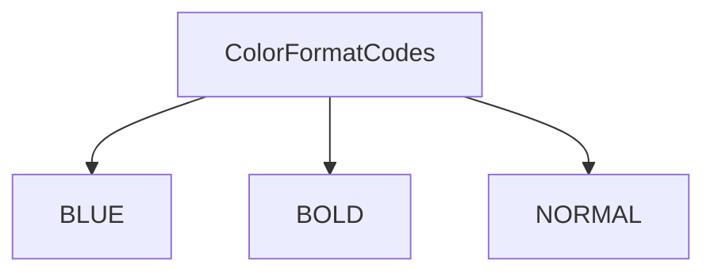
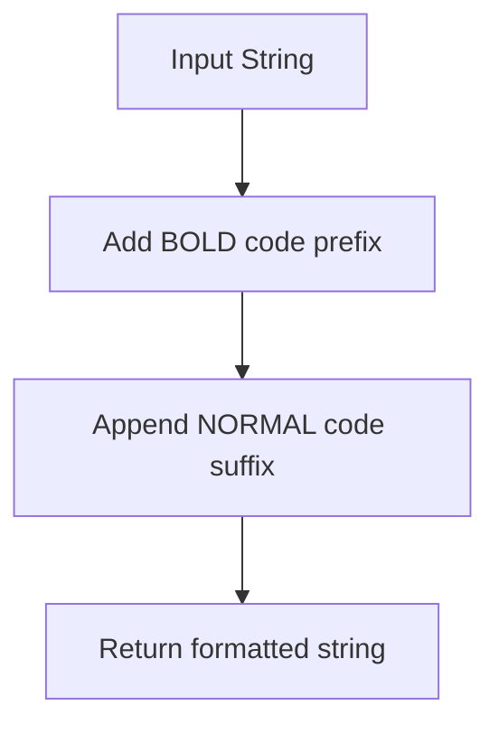

# `main.py`

## `mackup.main.ColorFormatCodes` · *class*

## Summary:
A utility class providing ANSI escape codes for terminal text formatting.

## Description:
This class serves as a centralized repository for ANSI terminal color and formatting codes. It provides constants that can be used to add color and style to text output in terminal applications. The class is designed to be used as a static utility with no instantiation required.

## State:
- BLUE: str = "\033[34m" - ANSI escape code for blue text color
- BOLD: str = "\033[1m" - ANSI escape code for bold text formatting  
- NORMAL: str = "\033[0m" - ANSI escape code to reset text formatting

All attributes are immutable class constants with no validation requirements.

## Lifecycle:
- Creation: No instantiation required - class constants are available directly from the class
- Usage: Access constants directly using dot notation (e.g., ColorFormatCodes.BLUE)
- Destruction: No cleanup required as this is purely a constants container

## Method Map:


## Raises:
No exceptions are raised as this is a simple constants class with no constructor or methods that could fail.

## Example:
```python
# Using the color codes in terminal output
print(ColorFormatCodes.BLUE + "This text is blue" + ColorFormatCodes.NORMAL)
print(ColorFormatCodes.BOLD + "This text is bold" + ColorFormatCodes.NORMAL)
```

## `mackup.main.header` · *function*

## Summary:
Formats a string with blue color coding for terminal output.

## Description:
Wraps the input string with ANSI escape codes to display the text in blue color in terminal environments. This function is used to create visually distinct headers or important messages in command-line output.

## Args:
    str (str): The string to be formatted with blue color coding.

## Returns:
    str: The input string wrapped with ANSI escape codes for blue text color and reset formatting.

## Raises:
    No exceptions are raised by this function.

## Constraints:
    Preconditions:
    - Input must be a string type
    - ColorFormatCodes.BLUE and ColorFormatCodes.NORMAL must be defined as valid ANSI escape sequences
    
    Postconditions:
    - Output string will contain the original input text wrapped with blue color codes
    - The returned string will be safe for terminal output

## Side Effects:
    None - This function has no side effects beyond returning a formatted string.

## Control Flow:
```mermaid
flowchart TD
    A[header(str)] --> B[Return ColorFormatCodes.BLUE + str + ColorFormatCodes.NORMAL]
```

## Examples:
```python
# Basic usage
formatted_header = header("Backup Operation")
print(formatted_header)  # Outputs: "\033[34mBackup Operation\033[0m"

# In a command-line interface context
print(header("Mackup Configuration Tool"))
# Displays "Mackup Configuration Tool" in blue text in terminal
```

## `mackup.main.bold` · *function*

## Summary:
Formats a string with bold terminal text formatting codes.

## Description:
Wraps the input string with ANSI escape codes to render text in bold when displayed in a compatible terminal. This function is a utility for enhancing terminal output readability.

## Args:
    str (str): The input string to be formatted with bold styling.

## Returns:
    str: The input string wrapped with ANSI bold formatting codes followed by normal formatting codes.

## Raises:
    None: This function does not explicitly raise any exceptions.

## Constraints:
    Preconditions: The input must be a string type.
    Postconditions: The returned string contains ANSI escape codes for bold formatting.

## Side Effects:
    None: This function has no side effects beyond returning a formatted string.

## Control Flow:


## Examples:
    >>> bold("Hello World")
    '\x1b[1mHello World\x1b[0m'

## `mackup.main.main` · *function*

## Summary:
Entry point function that processes command-line arguments and executes backup, restore, uninstall, list, or show operations for application configurations.

## Description:
This function serves as the primary command-line interface for Mackup, parsing user arguments using docopt and coordinating the appropriate operations. It handles five main modes: backup, restore, uninstall, list, and show. The function manages environment validation, application selection, and orchestrates operations through ApplicationProfile instances for each application. It also handles global configuration flags like force and root permissions.

## Args:
    None: This function reads command-line arguments via docopt and does not accept parameters directly.

## Returns:
    None: This function performs operations but does not return a value.

## Raises:
    SystemExit: Raised when an unsupported application is specified in show mode.

## Constraints:
    Preconditions:
    - Must be run from a command-line interface with proper arguments
    - Environment must support file operations and symbolic links
    - User must have appropriate permissions for file operations
    
    Postconditions:
    - Temporary folders are cleaned up after execution
    - All operations respect dry-run flag if specified
    - Verbose output is controlled by --verbose flag

## Side Effects:
    - Reads/writes configuration files and dotfiles in user's home directory
    - Creates/deletes symbolic links between home directory and Mackup storage
    - Prints status messages to stdout during operations
    - May prompt user for confirmation in interactive mode
    - Modifies global state through utils.FORCE_YES and utils.CAN_RUN_AS_ROOT flags

## Control Flow:
```mermaid
flowchart TD
    A[main()] --> B[Parse CLI args with docopt]
    B --> C{Args contain --force?}
    C -->|Yes| D[Set utils.FORCE_YES = True]
    C -->|No| E[Continue]
    B --> F{Args contain --root?}
    F -->|Yes| G[Set utils.CAN_RUN_AS_ROOT = True]
    F -->|No| H[Continue]
    B --> I{Args contain --dry-run?}
    I -->|Yes| J[dry_run = True]
    I -->|No| K[dry_run = False]
    B --> L{Args contain --verbose?}
    L -->|Yes| M[verbose = True]
    L -->|No| N[verbose = False]
    B --> O{Command: backup?}
    O -->|Yes| P[Check backup environment]
    P --> Q[Get apps to backup]
    Q --> R[For each app: create ApplicationProfile and call backup()]
    O -->|No| S{Command: restore?}
    S -->|Yes| T[Check restore environment]
    T --> U[Restore Mackup app first]
    U --> V[Get apps to backup (exclude Mackup)]
    V --> W[For each app: create ApplicationProfile and call restore()]
    S -->|No| X{Command: uninstall?}
    X -->|Yes| Y[Check restore environment]
    Y --> Z[Confirm uninstall if not dry-run]
    Z --> AA[Get apps to backup (exclude Mackup)]
    AA --> AB[For each app: create ApplicationProfile and call uninstall()]
    AB --> AC[Uninstall Mackup app]
    AC --> AD[Print completion message]
    X -->|No| AE{Command: list?}
    AE -->|Yes| AF[Check environment]
    AF --> AG[Print supported applications]
    AE -->|No| AH{Command: show?}
    AH -->|Yes| AI[Check environment]
    AI --> AJ[Validate application name]
    AJ --> AK[Print application details]
    AH -->|No| AL[Clean temp folder]
    AL --> AM[End]
```

## Examples:
```python
# Backup all configured applications
$ mackup backup

# Restore all configured applications
$ mackup restore

# List all supported applications
$ mackup list

# Show details for a specific application
$ mackup show vim

# Uninstall Mackup (restores all files)
$ mackup uninstall
```

