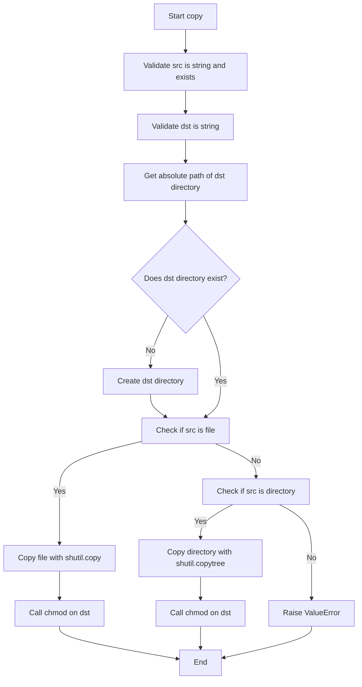
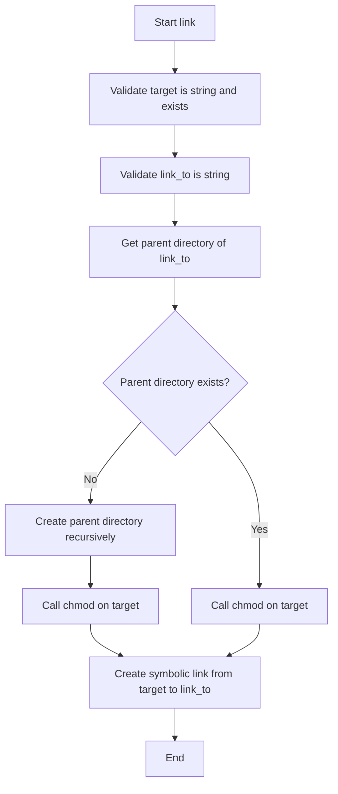
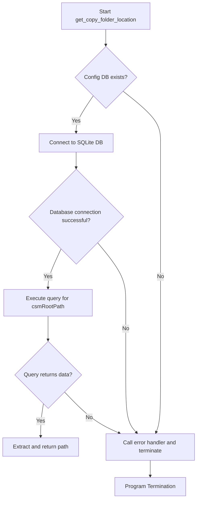
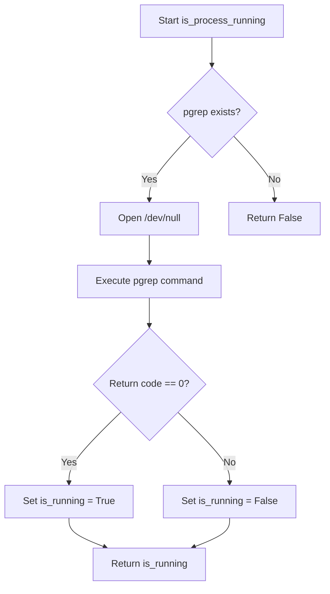
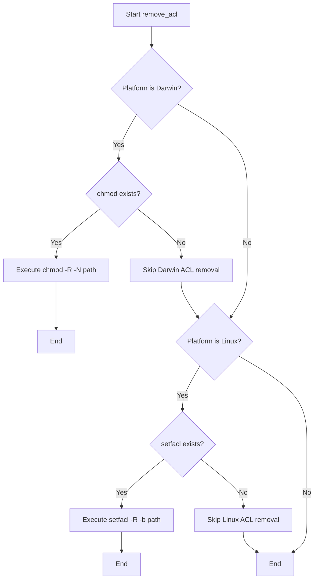
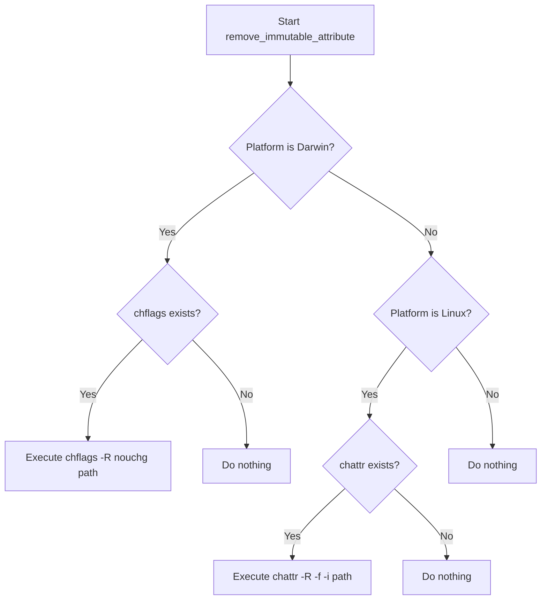

# `utils.py`

## `mackup.utils.confirm` · *function*

## Summary:
Prompts the user for a yes/no confirmation and returns the user's choice as a boolean value.

## Description:
Displays a question to the user with expected "Yes" or "No" responses and returns True for affirmative answers and False for negative ones. When the global variable FORCE_YES is set to True, the function immediately returns True without prompting the user.

## Args:
    question (str): The question to display to the user for confirmation.

## Returns:
    bool: True if the user confirms with "yes" or "y", False if the user declines with "no" or "n".

## Raises:
    None explicitly raised, but may raise KeyboardInterrupt if user interrupts input.

## Constraints:
    Preconditions:
        - The question parameter must be a string
        - The global variable FORCE_YES must be defined (though not checked in function)
    Postconditions:
        - Always returns a boolean value (True or False)
        - User input is normalized to lowercase for comparison

## Side Effects:
    - Writes to stdout: displays the question prompt
    - Reads from stdin: waits for user input
    - May raise KeyboardInterrupt if user presses Ctrl+C during input

## Control Flow:
```mermaid
flowchart TD
    A[Start confirm()] --> B{FORCE_YES?}
    B -- Yes --> C[Return True]
    B -- No --> D[Display question]
    D --> E[Get user input]
    E --> F{Input is "yes" or "y"?}
    F -- Yes --> G[confirmed = True]
    F -- No --> H{Input is "no" or "n"?}
    H -- Yes --> I[confirmed = False]
    H -- No --> J[Loop back to input]
    G --> K[Return confirmed]
    I --> K
```

## Examples:
    >>> confirm("Do you want to continue?")
    Do you want to continue? <Yes|No> y
    True
    
    >>> confirm("Are you sure?")
    Are you sure? <Yes|No> n
    False

## `mackup.utils.delete` · *function*

## Summary
Deletes a file or directory by removing special attributes and then performing standard deletion operations.

## Description
This function provides a robust method for deleting files or directories by first removing special file attributes that might prevent deletion, such as ACLs and immutable flags. It then performs the standard deletion operation using either os.remove() for files and symbolic links, or shutil.rmtree() for directories. This approach is particularly useful in backup and synchronization tools where files might have special attributes set by the operating system.

The function is typically called when cleaning up backup files or temporary directories that may have been created with special permissions or attributes. It's commonly used in scenarios where standard deletion methods might fail due to file system restrictions.

## Args
    filepath (str): The absolute or relative path to the file or directory to be deleted.

## Returns
    None: This function does not return any value.

## Raises
    None: This function does not explicitly raise exceptions, though underlying operations may raise exceptions from os.remove(), shutil.rmtree(), or the helper functions.

## Constraints
    Preconditions:
        - The filepath must exist and be accessible
        - The caller must have appropriate permissions to modify file attributes and delete the target
        - On systems where the helper functions are applicable, the required system utilities must be available

    Postconditions:
        - The specified file or directory is completely removed from the filesystem
        - Special file attributes (ACLs and immutable flags) are removed before deletion attempt
        - The function handles both regular files, symbolic links, and directories appropriately

## Side Effects
    - Modifies file permissions and attributes on the filesystem through calls to remove_acl() and remove_immutable_attribute()
    - Performs actual file system deletion using os.remove() or shutil.rmtree()
    - May execute system commands via subprocess calls in the helper functions

## Control Flow
```mermaid
flowchart TD
    A[Start delete] --> B[Remove ACLs from filepath]
    B --> C[Remove immutable attributes from filepath]
    C --> D{Is filepath a file or symlink?}
    D -- Yes --> E[Execute os.remove(filepath)]
    D -- No --> F{Is filepath a directory?}
    F -- Yes --> G[Execute shutil.rmtree(filepath)]
    F -- No --> H[Do nothing - filepath doesn't exist or is invalid]
```

## Examples
    # Delete a regular file
    delete("/path/to/file.txt")
    
    # Delete a symbolic link
    delete("/path/to/symlink")
    
    # Delete a directory tree
    delete("/path/to/directory")
```

## `mackup.utils.copy` · *function*

## Summary:
Copies files or directories from a source location to a destination, ensuring the destination directory exists and setting appropriate file permissions.

## Description:
This function provides a robust file/directory copying mechanism that handles both regular files and directories. It ensures the destination directory structure exists before performing the copy operation, and automatically applies proper file permissions using the associated chmod utility function. The function is designed for backup and restore operations where maintaining file permissions is critical.

## Args:
    src (str): Absolute or relative path to the source file or directory to be copied. Must exist in the filesystem.
    dst (str): Absolute or relative path to the destination where the source will be copied. Directory structure will be created if it doesn't exist.

## Returns:
    None: This function does not return any value.

## Raises:
    AssertionError: If src is not a string, src does not exist, or dst is not a string.
    ValueError: If the source path is neither a file nor a directory (unsupported file type).

## Constraints:
    Preconditions:
    - The src parameter must be a string and reference an existing file or directory
    - The dst parameter must be a string representing a valid file path
    - The process must have sufficient privileges to read the source and write to the destination
    
    Postconditions:
    - The destination directory structure is created if it doesn't exist
    - The source file or directory is copied to the destination
    - File permissions are set appropriately on the copied item

## Side Effects:
    - Creates intermediate directories in the destination path if they don't exist
    - Modifies the filesystem by creating new files/directories
    - Sets file permissions on the copied destination using chmod function
    - May modify file attributes on the filesystem through chmod

## Control Flow:


## Examples:
    # Copy a single file
    copy("/home/user/.bashrc", "/backup/.bashrc")
    
    # Copy a directory
    copy("/home/user/documents", "/backup/documents")
``

## `mackup.utils.link` · *function*

## Summary:
Creates a symbolic link from a target file or directory to a specified location, ensuring the parent directory structure exists.

## Description:
This function establishes a symbolic link between a source target (file or directory) and a destination link path. It automatically creates the parent directory structure for the link destination if it doesn't exist, and then creates the symbolic link itself. This function is typically used in backup/restore operations where maintaining file structure is important.

The function enforces a clear separation of concerns by:
- Handling directory creation automatically for the link destination
- Preparing the target with appropriate system-level operations via chmod
- Creating the symbolic link itself

## Args:
    target (str): Absolute or relative path to the source file or directory that will be linked. Must exist in the filesystem.
    link_to (str): Absolute or relative path where the symbolic link will be created. The parent directory will be created if it doesn't exist.

## Returns:
    None: This function does not return any value.

## Raises:
    AssertionError: If target is not a string, does not exist, or link_to is not a string.

## Constraints:
    Preconditions:
    - The target parameter must be a string
    - The target path must exist in the filesystem
    - The link_to parameter must be a string
    
    Postconditions:
    - The parent directory of link_to is created if it doesn't exist
    - The target is prepared for linking via chmod operations
    - A symbolic link is created from target to link_to

## Side Effects:
    - Creates directories in the filesystem if they don't exist
    - Calls chmod function to prepare the target
    - Creates a symbolic link in the filesystem

## Control Flow:


## Examples:
    # Create a symbolic link for a file
    link("/home/user/documents/file.txt", "/home/user/backup/file.txt")
    
    # Create a symbolic link for a directory
    link("/home/user/projects/myapp", "/home/user/links/myapp")
```

## `mackup.utils.chmod` · *function*

## Summary:
Sets appropriate read/write permissions on files and directories while removing immutable attributes to ensure successful permission modification.

## Description:
This function configures file system permissions for a given target path by applying specific read/write permissions to files and directories. It first removes immutable attributes that might prevent permission changes, then sets appropriate permissions based on the target type. For directories, it recursively applies permissions to all contained files and subdirectories. This function is typically used in backup/restore operations where file permissions need to be properly set regardless of immutable flags.

## Args:
    target (str): Absolute or relative path to the file or directory whose permissions should be modified. Must exist and be either a file or directory.

## Returns:
    None: This function does not return any value.

## Raises:
    AssertionError: If target is not a string or does not exist.
    ValueError: If the target is neither a file nor a directory (unsupported file type).

## Constraints:
    Preconditions:
    - The target parameter must be a string
    - The target path must exist in the filesystem
    - The process must have sufficient privileges to modify file permissions
    
    Postconditions:
    - Immutable attributes are removed from the target
    - Files have read/write permissions for the owner (0o600)
    - Directories have read/write/execute permissions for the owner (0o700)
    - All nested files and directories within a directory are recursively updated with appropriate permissions

## Side Effects:
    - Modifies file system permissions using os.chmod
    - Calls system commands via remove_immutable_attribute to remove immutable flags
    - May modify file attributes on the filesystem

## Control Flow:
```mermaid
flowchart TD
    A[Start chmod] --> B[Validate target is string and exists]
    B --> C{Is target a file?}
    C -- Yes --> D[Remove immutable attribute]
    D --> E[Set file permissions (0o600)]
    E --> F[End]
    C -- No --> G{Is target a directory?}
    G -- Yes --> H[Remove immutable attribute]
    H --> I[Set directory permissions (0o700)]
    I --> J[Walk directory tree]
    J --> K{Current item is directory?}
    K -- Yes --> L[Set directory permissions (0o700)]
    L --> M[Continue walking]
    K -- No --> N[Set file permissions (0o600)]
    N --> M
    M --> O[End]
    G -- No --> P[Raise ValueError]
    P --> Q[End]
```

## Examples:
    # Set permissions on a single file
    chmod("/home/user/.ssh/id_rsa")
    
    # Set permissions recursively on a directory
    chmod("/home/user/documents")
```

## `mackup.utils.error` · *function*

## Summary:
Exits the program with a colored error message displayed to stderr.

## Description:
Displays an error message in red text followed by program termination. This utility function provides a standardized way to report errors and halt execution when fatal issues occur.

## Args:
    message (str): The error message to display before exiting the program.

## Returns:
    This function does not return as it calls sys.exit() which terminates the program.

## Raises:
    This function does not raise exceptions directly, but sys.exit() may raise SystemExit.

## Constraints:
    Preconditions:
    - The message parameter must be a string
    - The program environment must support ANSI escape sequences for color output
    
    Postconditions:
    - Program execution terminates immediately
    - Error message is printed to stderr with red coloring

## Side Effects:
    - Prints formatted error message to stderr (standard error stream)
    - Terminates program execution via sys.exit()

## Control Flow:
```mermaid
flowchart TD
    A[error(message)] --> B{Validate message}
    B --> C[Set ANSI color codes]
    C --> D[Format error message]
    D --> E[Print error message]
    E --> F[sys.exit()]
```

## Examples:
    # Basic usage
    error("Configuration file not found")
    
    # Usage in error handling context
    try:
        config = load_config()
    except ConfigError:
        error("Failed to load configuration file")
```

## `mackup.utils.get_dropbox_folder_location` · *function*

## Summary:
Retrieves the local Dropbox folder path by parsing the Dropbox host database file.

## Description:
Extracts the Dropbox installation directory path from the .dropbox/host.db file, which contains base64-encoded information about the user's Dropbox setup. This function is used to locate where Dropbox stores files on the local filesystem.

## Args:
    None

## Returns:
    str: The absolute path to the local Dropbox folder as stored in the Dropbox host database.

## Raises:
    SystemExit: When the Dropbox host database file cannot be found or accessed, causing the program to terminate with an error message.

## Constraints:
    Preconditions:
    - The user's home directory must be accessible via os.environ["HOME"]
    - The Dropbox application must be installed and configured
    - The .dropbox/host.db file must exist in the user's home directory
    
    Postconditions:
    - The function either returns a valid Dropbox folder path or terminates the program

## Side Effects:
    - Reads from the local filesystem (specifically ~/.dropbox/host.db)
    - Terminates program execution if Dropbox installation cannot be located

## Control Flow:
```mermaid
flowchart TD
    A[get_dropbox_folder_location()] --> B{Check host.db file existence}
    B -->|File exists| C[Open host.db file]
    C --> D[Read and split file content]
    D --> E{Parse data array}
    E --> F[Base64 decode data[1]]
    F --> G[Return decoded path]
    B -->|File missing| H[error() with storage error]
```

## Examples:
    # Typical usage in a backup/restore workflow
    try:
        dropbox_path = get_dropbox_folder_location()
        print(f"Dropbox folder found at: {dropbox_path}")
    except SystemExit:
        print("Dropbox installation not found - cannot continue")

## `mackup.utils.get_google_drive_folder_location` · *function*

## Summary
Retrieves the local synchronized folder path for Google Drive by querying the application's configuration database.

## Description
This function locates and reads the Google Drive synchronization configuration database to extract the local folder path where files are synced. It handles different macOS versions by checking for database files in two potential locations. The function is designed to be a centralized utility for accessing Google Drive's local storage location, ensuring consistent access regardless of the specific version of Google Drive installed.

The logic is extracted into its own function to encapsulate the complexity of database access and path resolution, providing a clean interface for other components that need to know where Google Drive stores its synchronized files.

## Args
    This function takes no arguments.

## Returns
    str: The absolute path to the local Google Drive synchronized folder.

## Raises
    SystemExit: When unable to locate the Google Drive installation or configuration database, causing the program to terminate with an error message.

## Constraints
    Preconditions:
    - The user must have Google Drive installed on macOS
    - The Google Drive application must have been run at least once to create the configuration database
    - The HOME environment variable must be set correctly
    
    Postconditions:
    - Either returns a valid path to the Google Drive sync folder or exits the program with an error

## Side Effects
    - Accesses the local filesystem to check for database files
    - Opens and reads from a SQLite database file
    - May print an error message to stderr and terminate the program

## Control Flow
```mermaid
flowchart TD
    A[get_google_drive_folder_location()] --> B{Check Yosemite DB path}
    B -->|Exists| C[Use Yosemite DB path]
    B -->|Not exists| D[Use standard DB path]
    C --> E[Construct full DB path]
    D --> E
    E --> F{DB file exists?}
    F -->|Yes| G[Connect to SQLite DB]
    F -->|No| H[Error: Unable to find storage]
    G --> I[Execute query for local_sync_root_path]
    I --> J[Extract data value]
    J --> K[Close DB connection]
    K --> L{googledrive_home set?}
    L -->|Yes| M[Return path]
    L -->|No| H
```

## Examples
    # Typical usage in a backup process
    try:
        gdrive_path = get_google_drive_folder_location()
        print(f"Google Drive folder located at: {gdrive_path}")
        # Proceed with backup operations...
    except SystemExit:
        print("Failed to locate Google Drive folder - exiting...")
        sys.exit(1)
```

## `mackup.utils.get_copy_folder_location` · *function*

## Summary
Retrieves the root storage path for the Copy agent application by reading from its configuration database.

## Description
This function attempts to locate and read the storage root path configured for the Copy agent application. It searches for the Copy agent's configuration database file at a known location within the user's home directory, connects to it as an SQLite database, and queries for the 'csmRootPath' configuration value. This path is typically used by backup/migration tools to determine where application data should be stored or migrated to.

The function is extracted into its own utility to encapsulate the complex logic of locating and parsing the Copy agent's configuration database, separating this concern from the main application logic that might use this path.

## Args
    This function takes no arguments.

## Returns
    str: The absolute path to the Copy agent's storage root directory as configured in its database.

## Raises
    This function does not raise exceptions in the traditional sense. Instead, when the Copy agent configuration cannot be found or accessed, it calls an error handler that terminates the program via sys.exit().

## Constraints
    Preconditions:
    - The user's HOME environment variable must be set and accessible
    - The Copy agent must be installed and have a configuration database at the expected location
    - The configuration database must be readable and contain the expected table structure
    
    Postconditions:
    - If successful, returns a valid filesystem path string
    - If unsuccessful, terminates program execution

## Side Effects
    - Reads from the filesystem (accesses a SQLite database file)
    - May cause program termination if the configuration cannot be found (via sys.exit call)

## Control Flow


## Examples
```python
# Typical usage in a backup/migration workflow
try:
    storage_path = get_copy_folder_location()
    print(f"Using Copy storage at: {storage_path}")
    # Proceed with backup operations using this path
except SystemExit:
    # This won't be reached as the function terminates the program
    print("Program terminated due to missing Copy configuration")
```

## `mackup.utils.get_icloud_folder_location` · *function*

## Summary:
Retrieves the file system path to the iCloud Drive folder on macOS systems.

## Description:
This function resolves the standard iCloud Drive location on macOS Yosemite and later versions. It expands the user's home directory path and validates that the iCloud directory actually exists on the filesystem. The function is designed to be called during setup or configuration phases when the application needs to locate iCloud storage for synchronization operations.

## Args:
    None

## Returns:
    str: The absolute file system path to the iCloud Drive folder as a string.

## Raises:
    SystemExit: When the iCloud Drive folder cannot be found on the filesystem, causing the program to terminate with an error message.

## Constraints:
    Preconditions:
    - The system must be running macOS (as the path is specific to macOS)
    - The iCloud Drive folder must be properly configured and accessible
    - The user must have appropriate permissions to access the iCloud directory
    
    Postconditions:
    - The returned path is guaranteed to be a valid directory that exists on the filesystem
    - The function will not return if the iCloud directory is not found

## Side Effects:
    - None

## Control Flow:
```mermaid
flowchart TD
    A[get_icloud_folder_location()] --> B{Expand iCloud path}
    B --> C{Check if directory exists}
    C --> D[If directory exists: Return path]
    C --> E[If directory does not exist: Call error()]
    E --> F[Program exits with error]
```

## Examples:
    # Typical usage in a configuration setup
    try:
        icloud_path = get_icloud_folder_location()
        print(f"Using iCloud at: {icloud_path}")
    except SystemExit:
        # This won't be reached in normal operation
        pass
```

## `mackup.utils.is_process_running` · *function*

## Summary:
Checks whether a process with the specified name is currently running on the system.

## Description:
This function determines if a process is actively running by invoking the pgrep command-line utility. It's designed to work specifically on Unix-like systems where pgrep is available. The function serves as a cross-platform compatibility wrapper for process detection logic.

## Args:
    process_name (str): The name of the process to check for existence. This should be a string matching the process name as it would appear in the process table.

## Returns:
    bool: True if the process is running, False otherwise. Returns False if the pgrep utility is not available on the system.

## Raises:
    None explicitly raised, though system-level errors from subprocess.call could occur but are not handled.

## Constraints:
    Preconditions:
    - The system must have the pgrep command-line utility installed at "/usr/bin/pgrep"
    - The process_name parameter must be a valid string that can be matched by pgrep
    
    Postconditions:
    - The function returns a boolean value indicating process status
    - No side effects occur beyond the system call to pgrep

## Side Effects:
    - Makes a system call to the pgrep command
    - Opens /dev/null for writing to suppress stdout from the subprocess call
    - May cause a brief delay while waiting for the pgrep command to execute

## Control Flow:


## Examples:
    # Check if Chrome is running
    if is_process_running("chrome"):
        print("Chrome is currently running")
    
    # Check if SSH daemon is running
    if is_process_running("sshd"):
        print("SSH daemon is active")
```

## `mackup.utils.remove_acl` · *function*

## Summary
Removes Access Control Lists (ACLs) from a specified path on macOS or Linux systems.

## Description
This function removes ACL permissions from files and directories by executing platform-specific system commands. On macOS (Darwin), it uses the chmod command with the -N flag to remove ACLs recursively. On Linux systems, it uses setfacl with the -b flag to remove all ACL entries recursively. When the platform is not supported or required executables are not found, the function performs no operation.

## Args
    path (str): The absolute or relative path to the directory or file from which ACLs should be removed.

## Returns
    None: This function does not return any value.

## Raises
    None: This function does not explicitly raise exceptions, though underlying subprocess calls may raise OSError if commands fail.

## Constraints
    Preconditions:
        - The path must exist and be accessible
        - On macOS: /bin/chmod must be executable
        - On Linux: /bin/setfacl must be executable
    Postconditions:
        - ACLs are removed from the specified path and its contents (recursively) when running on supported platforms
        - Function execution is platform-dependent (only operates on Darwin or Linux)
        - When platform conditions are not met, the function performs no operation

## Side Effects
    - Executes system commands via subprocess calls
    - Modifies file permissions on the filesystem
    - May affect access control settings on the target path

## Control Flow


## Examples
    # Remove ACLs from a backup directory
    remove_acl('/path/to/backup/directory')
    
    # Remove ACLs from user home directory
    remove_acl(os.path.expanduser('~'))
```

## `mackup.utils.remove_immutable_attribute` · *function*

## Summary:
Removes immutable file attributes from a specified path by executing platform-specific system commands.

## Description:
This function removes immutable attributes from files and directories by calling system utilities (`chflags` on macOS and `chattr` on Linux). It's designed to handle cross-platform differences in how file immutability is managed. The function is typically called when attempting to modify or delete files that have been marked as immutable by the operating system.

## Args:
    path (str): The absolute or relative path to the file or directory whose immutable attributes should be removed.

## Returns:
    None: This function does not return any value.

## Raises:
    None: This function does not explicitly raise exceptions, though underlying system calls may fail silently.

## Constraints:
    Preconditions:
    - The system must be either macOS (Darwin) or Linux
    - The appropriate system utility must be installed and executable:
      * `/usr/bin/chflags` for macOS systems
      * `/usr/bin/chattr` for Linux systems
    - The caller must have sufficient privileges to execute these system commands

    Postconditions:
    - On macOS systems: Removes the "uchg" (user immutable) flag recursively from the specified path
    - On Linux systems: Removes the "i" (immutable) flag recursively from the specified path
    - No changes are made on other platforms or if the required utilities are not present

## Side Effects:
    - Executes system commands via subprocess calls
    - May modify file attributes on the filesystem
    - Could potentially affect file permissions or access control

## Control Flow:


## Examples:
    # Remove immutable attributes from a configuration file
    remove_immutable_attribute("/Users/username/.ssh/config")
    
    # Remove immutable attributes from a directory tree
    remove_immutable_attribute("/home/user/documents")
```

## `mackup.utils.can_file_be_synced_on_current_platform` · *function*

## Summary:
Determines whether a file can be synchronized based on the current platform and file location.

## Description:
This function evaluates if a given file path can be synced across platforms. On Linux systems, files located within the user's Library directory are excluded from synchronization due to platform-specific considerations. The function constructs the absolute path by combining the home directory with the provided relative path and performs platform-specific checks.

## Args:
    path (str): A relative file path that will be evaluated for synchronization eligibility.

## Returns:
    bool: True if the file can be synced, False if it cannot be synced (specifically on Linux platforms when the file is in the Library directory).

## Raises:
    None explicitly raised, but may raise KeyError if HOME environment variable is not set.

## Constraints:
    Preconditions:
    - The HOME environment variable must be set and accessible
    - The path parameter must be a string
    
    Postconditions:
    - Returns a boolean value indicating synchronization eligibility
    - The function does not modify any external state

## Side Effects:
    None - This function performs no I/O operations or external state mutations.

## Control Flow:
```mermaid
flowchart TD
    A[Start] --> B{platform.system() == PLATFORM_LINUX?}
    B -- Yes --> C{fullpath.startswith(library_path)?}
    C -- Yes --> D[can_be_synced = False]
    C -- No --> E[can_be_synced = True]
    B -- No --> F[can_be_synced = True]
    D --> G[Return can_be_synced]
    E --> G
    F --> G
    G[Return can_be_synced]
```

## Examples:
    # Example 1: File in Library directory on Linux
    result = can_file_be_synced_on_current_platform("Library/Preferences/myapp.plist")
    # Returns False on Linux, True on other platforms
    
    # Example 2: File outside Library directory
    result = can_file_be_synced_on_current_platform(".bashrc")
    # Returns True on all platforms

