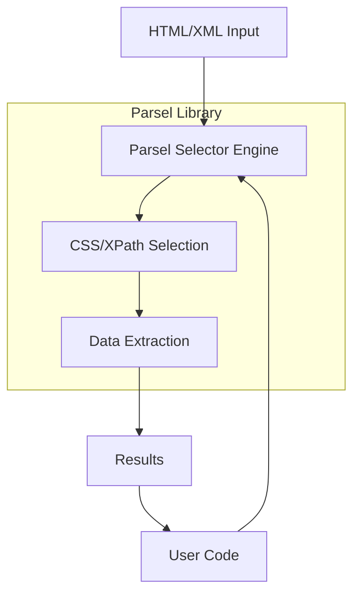

# `parsel`

# Parsel Repository Documentation

## Tree Structure
```
parsel/
├── docs/           # Documentation files and guides
└── parsel/         # Main Python package containing the library
```

## Purpose
Parsel is a Python library for parsing HTML and XML documents. It provides tools for extracting structured data from these formats using CSS selectors and XPath expressions. The library offers a simplified interface for common parsing tasks while leveraging powerful underlying parsing engines.

This library is primarily intended for developers who need to extract information from web pages or structured documents programmatically. It's commonly used in web scraping, data extraction, and content analysis applications.

## Architecture


Key architectural patterns:
- **Selector-based approach**: Uses CSS and XPath for element selection
- **Abstraction layer**: Simplifies complex parsing operations
- **Flexible input handling**: Supports various input formats

## Entry Points
### Importable API
- `from parsel import Selector` - Main class for parsing and selecting content
- `from parsel import SelectorList` - For handling multiple selections

### Usage Patterns
- Create selector: `Selector(text='<html>...</html>')`
- Select with CSS: `selector.css('div.content')`
- Select with XPath: `selector.xpath('//p[@class="text"]')`

## Core Features
1. **CSS Selector Support** - Select elements using CSS selector syntax
2. **XPath Expression Support** - Query elements using XPath expressions
3. **Text Content Extraction** - Extract text from selected elements
4. **Attribute Access** - Get attribute values from elements
5. **Multiple Input Formats** - Handle strings, files, and other input types

## Dependencies
- **lxml** - Underlying parsing engine for HTML/XML processing
- **cssselect** - CSS selector implementation
- **six** - Python 2/3 compatibility utilities

## Configuration
Configuration is minimal and typically handled automatically. The library uses sensible defaults for encoding and parsing behavior.

## Extension Points
1. **Subclassing**: Extend the Selector class for custom functionality
2. **Custom Processing**: Add preprocessing or postprocessing steps

---

## Modules

- [`docs`](docs.md)
- [`parsel`](parsel.md)

