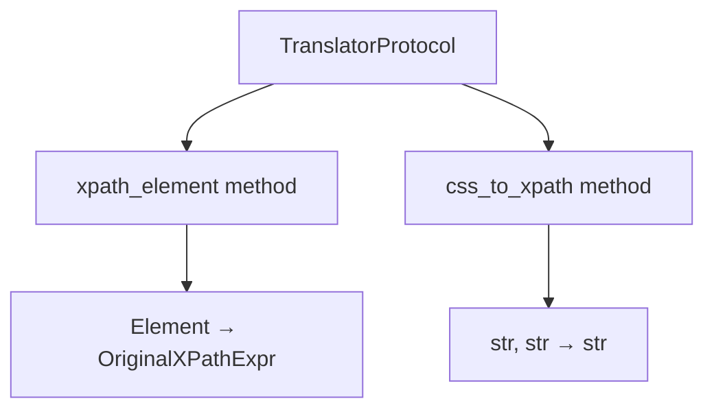
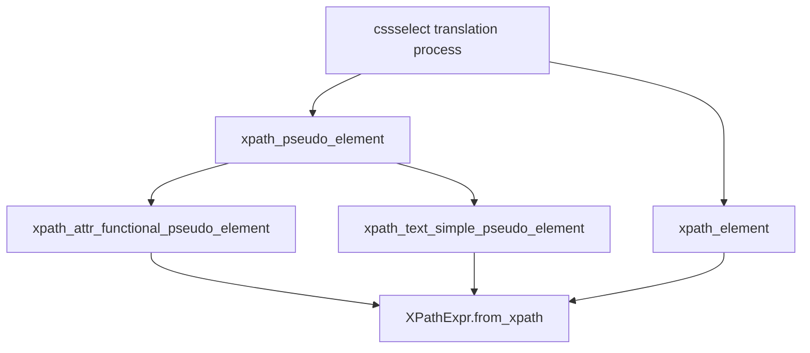

# `csstranslator.py`

## `parsel.csstranslator.XPathExpr` · *class*

## Summary:
A specialized XPath expression class that extends CSSSelect's XPathExpr to support text node and attribute selection.

## Description:
This class extends the base XPathExpr from cssselect to add support for selecting text nodes and specific attributes within XPath expressions. It's used internally by parsel to handle CSS selector translations that require text or attribute-specific XPath generation.

The class is particularly useful when translating CSS selectors that target text content or specific element attributes into equivalent XPath expressions.

## State:
- textnode: bool - Flag indicating whether this expression targets a text node. Defaults to False.
- attribute: Optional[str] - Name of the attribute to select, or None if not targeting an attribute.

## Lifecycle:
- Creation: Instances can be created directly or via the `from_xpath` classmethod
- Usage: Typically used in CSS selector translation workflows where XPath expressions need to be modified to target text nodes or attributes
- Destruction: No special cleanup required; follows standard Python object lifecycle

## Method Map:
```mermaid
graph TD
    A[XPathExpr.from_xpath] --> B[XPathExpr.__init__]
    C[XPathExpr.__str__] --> D[XPathExpr.join]
    E[XPathExpr.join] --> F[super().join]
```

## Raises:
- ValueError: When attempting to join with a non-XPathExpr object in the join method

## Example:
```python
# Creating from an existing XPathExpr
from cssselect.xpath import XPathExpr as BaseXPathExpr
base_expr = BaseXPathExpr("//div", Element("p"))
extended_expr = XPathExpr.from_xpath(base_expr, textnode=True)

# String representation
print(str(extended_expr))  # Outputs something like "//div/p/text()"

# Joining with another XPathExpr
other_expr = XPathExpr("//span", Element("span"))
joined = extended_expr.join("/", other_expr)
```

### `parsel.csstranslator.XPathExpr.from_xpath` · *method*

## Summary:
Creates a new XPathExpr instance by copying properties from an existing XPath expression and setting additional textnode and attribute flags.

## Description:
This class method serves as a factory constructor that initializes a new XPathExpr instance with the same path, element, and condition from an existing XPath expression, while also setting textnode and attribute properties. It's used to create modified copies of XPath expressions with additional metadata about text nodes and attribute access.

## Args:
    cls: The class type (used for classmethod)
    xpath (OriginalXPathExpr): Source XPath expression containing path, element, and condition attributes
    textnode (bool): Flag indicating if the expression targets text nodes. Defaults to False
    attribute (Optional[str]): Name of attribute to target, or None if targeting elements. Defaults to None

## Returns:
    Self: A new instance of XPathExpr with copied properties and configured textnode/attribute settings

## Raises:
    None explicitly raised

## State Changes:
    Attributes READ: xpath.path, xpath.element, xpath.condition
    Attributes WRITTEN: x.textnode, x.attribute

## Constraints:
    Preconditions: 
    - xpath must have path, element, and condition attributes
    - cls must be the XPathExpr class or subclass
    Postconditions:
    - Returned instance has identical path, element, and condition from xpath parameter
    - Returned instance has textnode set to provided value
    - Returned instance has attribute set to provided value

## Side Effects:
    None

### `parsel.csstranslator.XPathExpr.__str__` · *method*

## Summary:
Converts an XPath expression with text node and attribute modifiers into a properly formatted XPath string.

## Description:
Returns a string representation of the XPath expression that accounts for text node selection and attribute access. When `textnode` is True, the method modifies the base XPath to select text content appropriately. When `attribute` is specified, it appends attribute selection syntax to the path. This method ensures proper XPath syntax for complex selectors.

## Args:
    None

## Returns:
    str: A properly formatted XPath expression string. Special handling:
        - When textnode=True and path is "*", returns "text()"
        - When textnode=True and path ends with "::*/*", replaces last 3 chars with "text()"
        - When textnode=True and path is other, appends "/text()"
        - When attribute is specified and path ends with "::*/*", removes last 2 chars then appends "/@{attribute}"
        - When attribute is specified and path is other, appends "/@{attribute}"

## Raises:
    None explicitly raised

## State Changes:
    Attributes READ: self.textnode, self.attribute
    Attributes WRITTEN: None

## Constraints:
    Preconditions: The object must be properly initialized with valid XPath components
    Postconditions: The returned string follows XPath syntax conventions for text nodes and attributes

## Side Effects:
    None

### `parsel.csstranslator.XPathExpr.join` · *method*

## Summary:
Joins this XPath expression with another using a combiner string, preserving textnode and attribute metadata from the other expression.

## Description:
This method combines the current XPath expression with another XPath expression using the specified combiner operator. It ensures type compatibility between expressions and propagates special metadata (textnode and attribute flags) from the joined expression to the current one. This method is typically called during CSS selector compilation when combining multiple XPath fragments.

## Args:
    combiner (str): The XPath combiner operator (e.g., '/', '//', etc.) to use for joining expressions
    other (OriginalXPathExpr): Another XPath expression to join with this one
    *args (Any): Additional positional arguments passed to the parent join method
    **kwargs (Any): Additional keyword arguments passed to the parent join method

## Returns:
    Self: Returns self to enable method chaining

## Raises:
    ValueError: When the other expression is not of type XPathExpr or its descendant

## State Changes:
    Attributes READ: None
    Attributes WRITTEN: 
        - self.textnode: Set to the value from other.textnode
        - self.attribute: Set to the value from other.attribute

## Constraints:
    Preconditions:
        - The other expression must be an instance of XPathExpr or its descendant
        - The combiner must be a valid XPath combiner string
    Postconditions:
        - The current expression is modified to represent the joined result
        - The textnode and attribute properties are copied from the other expression
        - The method returns self for chaining

## Side Effects:
    None

## `parsel.csstranslator.TranslatorProtocol` · *class*

## Summary:
A protocol defining the interface for CSS selector to XPath expression translators in the parsel library.

## Description:
The TranslatorProtocol defines the contract that all CSS-to-XPath translators in the parsel library must implement. This protocol enables polymorphic behavior for different types of CSS translators (generic vs HTML) while maintaining a consistent interface for converting CSS selectors into XPath expressions.

This protocol is primarily used internally by the parsel library to provide flexible CSS selector translation capabilities. Concrete implementations include GenericTranslator and HTMLTranslator, which handle different types of CSS selectors and provide caching for improved performance.

## State:
- Defines interface contract for CSS translation operations
- No instance attributes as it's a Protocol
- All methods are abstract and must be implemented by concrete classes

## Lifecycle:
- Creation: Not instantiated directly; used as an interface for concrete implementations
- Usage: Called internally by cssselect library when processing CSS selectors
- Destruction: Managed by Python's garbage collection

## Method Map:


## Raises:
- ExpressionError: May be raised by concrete implementations when encountering invalid CSS selectors or unsupported pseudo-elements during translation
- ExpressionError: May be raised when CSS selectors contain malformed syntax that cannot be translated to XPath

## Example:
```python
# This protocol is used internally by parsel
# Concrete implementations are used for actual translation:

from parsel import GenericTranslator, HTMLTranslator

# These classes implement the TranslatorProtocol
generic_translator = GenericTranslator()
html_translator = HTMLTranslator()

# Both support the same interface:
xpath_generic = generic_translator.css_to_xpath("div.content p:first-child")
xpath_html = html_translator.css_to_xpath("p", prefix="descendant-or-self::")
```

### `parsel.csstranslator.TranslatorProtocol.css_to_xpath` · *method*

## Summary:
Converts a CSS selector string into an XPath expression using the translator's implementation.

## Description:
This method serves as the core interface for transforming CSS selectors into XPath expressions. It is part of the TranslatorProtocol that defines the contract for CSS-to-XPath translation implementations. The method accepts a CSS selector string and an optional prefix, returning the corresponding XPath expression that can be used for element selection in XML/HTML documents.

The protocol method is implemented by concrete classes like GenericTranslator and HTMLTranslator, which provide the actual translation logic with additional features such as caching and pseudo-element support.

## Args:
    css (str): A CSS selector string to be converted to XPath expression.
    prefix (str): XPath prefix to prepend to the result. Defaults to "descendant-or-self::".

## Returns:
    str: An XPath expression corresponding to the provided CSS selector.

## Raises:
    ExpressionError: Raised by implementing classes when encountering invalid CSS selectors, unsupported pseudo-elements, or malformed syntax that cannot be translated to XPath.

## State Changes:
    Attributes READ: None
    Attributes WRITTEN: None

## Constraints:
    Preconditions: The css parameter must be a syntactically valid CSS selector string.
    Postconditions: The returned string represents a valid XPath expression that maintains the semantic meaning of the original CSS selector.

## Side Effects:
    None - This method is pure and has no side effects beyond potential internal caching mechanisms in implementing classes.

## `parsel.csstranslator.TranslatorMixin` · *class*

## Summary:
A mixin class that extends CSS selector translation to support custom pseudo-element handling in XPath expressions.

## Description:
The TranslatorMixin class provides enhanced CSS selector translation functionality by overriding methods from cssselect's base translators. It specifically handles translation of CSS pseudo-elements into XPath expressions, enabling support for functional pseudo-elements like ::attr() and simple pseudo-elements like ::text.

This mixin is designed to be used as part of a class hierarchy where it inherits from cssselect's GenericTranslator or HTMLTranslator classes. It extends the basic translation logic to provide additional pseudo-element support that's not available in the base implementation.

## State:
- The mixin doesn't maintain persistent state beyond what's inherited from its parent translator class
- All methods operate on the translation context provided by the parent class

## Lifecycle:
- Creation: Instances are created when inheriting from this mixin along with a cssselect translator (GenericTranslator or HTMLTranslator)
- Usage: Methods are invoked internally by the cssselect library during CSS selector parsing and translation processes
- Destruction: Managed by Python's garbage collection when the parent translator instance is destroyed

## Method Map:


## Raises:
- ExpressionError: Raised when encountering unknown functional pseudo-elements (::name()) or simple pseudo-elements (::name) during translation
- ExpressionError: Raised when ::attr() functional pseudo-element receives invalid arguments (not STRING or IDENT types)

## Example:
```python
# Typical usage pattern
class MyTranslator(TranslatorMixin, GenericTranslator):
    pass

# The translator would be used internally by cssselect
# when processing CSS selectors containing pseudo-elements
```

### `parsel.csstranslator.TranslatorMixin.xpath_element` · *method*

## Summary:
Converts a CSS selector element to an XPath expression with proper type conversion.

## Description:
This method serves as a bridge between CSS selector parsing and XPath generation, ensuring that the result from the parent class's xpath_element method is properly converted to the expected XPathExpr type. It overrides the parent implementation to provide consistent return type handling.

The method is part of the TranslatorMixin class and is called during the CSS-to-XPath translation process when processing element selectors. It ensures that the XPath expression returned by the parent implementation is properly wrapped in an XPathExpr instance.

## Args:
    selector (Element): A CSS selector element parsed by the cssselect parser, representing a CSS element selector.

## Returns:
    XPathExpr: An XPath expression object representing the translated CSS element selector.

## Raises:
    ExpressionError: If the parent class's xpath_element method raises an ExpressionError during processing.

## State Changes:
    Attributes READ: None
    Attributes WRITTEN: None

## Constraints:
    Preconditions:
        - The selector parameter must be a valid Element object from cssselect.parser
        - The parent class must implement xpath_element method that returns a compatible XPath expression
    Postconditions:
        - The returned XPathExpr object is properly initialized with the converted XPath string
        - The method maintains the semantic meaning of the original CSS selector

## Side Effects:
    None

### `parsel.csstranslator.TranslatorMixin.xpath_pseudo_element` · *method*

*No documentation generated.*

### `parsel.csstranslator.TranslatorMixin.xpath_attr_functional_pseudo_element` · *method*

## Summary:
Transforms a CSS functional pseudo-element (::attr()) into an XPath expression that extracts a specified attribute value.

## Description:
This method processes CSS functional pseudo-elements that target element attributes, specifically the `::attr()` pseudo-element. It validates that the pseudo-element has a valid single-string or identifier argument and constructs an XPath expression that will extract the specified attribute from matching elements. This method is part of the CSS selector translation pipeline that converts CSS selectors into XPath expressions for use with XML/HTML parsers.

## Args:
    xpath (OriginalXPathExpr): The base XPath expression to modify
    function (FunctionalPseudoElement): The functional pseudo-element containing the attribute specification

## Returns:
    XPathExpr: An XPath expression that extracts the specified attribute from elements matching the original XPath

## Raises:
    ExpressionError: When the functional pseudo-element does not have exactly one argument of type STRING or IDENT

## State Changes:
    Attributes READ: None
    Attributes WRITTEN: None

## Constraints:
    Preconditions: 
    - The function argument must be a FunctionalPseudoElement instance
    - The function must have exactly one argument
    - The argument type must be either "STRING" or "IDENT"
    
    Postconditions:
    - Returns an XPathExpr instance
    - The returned XPath expression will extract the attribute specified in function.arguments[0].value

## Side Effects:
    None

### `parsel.csstranslator.TranslatorMixin.xpath_text_simple_pseudo_element` · *method*

## Summary:
Converts an XPath expression to target text nodes instead of element nodes.

## Description:
This method transforms a given XPath expression to target text nodes rather than regular element nodes by setting the `textnode=True` flag. It's part of the CSS-to-XPath translation process and is specifically called when processing simple pseudo-elements like `::text`. The method leverages the `XPathExpr.from_xpath` class method to create a copy of the original XPath expression with updated text node targeting configuration.

This logic is separated into its own method to provide a clean interface for handling text node selection in CSS pseudo-elements, maintaining consistency with other pseudo-element handlers in the TranslatorMixin class.

## Args:
    xpath (OriginalXPathExpr): The base XPath expression to modify for text node targeting

## Returns:
    XPathExpr: A new XPath expression instance configured to target text nodes instead of element nodes

## Raises:
    None explicitly raised

## State Changes:
    Attributes READ: None
    Attributes WRITTEN: None

## Constraints:
    Preconditions:
    - The xpath parameter must be a valid XPath expression object with path, element, and condition attributes
    - The xpath parameter must be compatible with the XPathExpr.from_xpath method interface
    
    Postconditions:
    - Returns a new XPathExpr instance with identical path, element, and condition from the input xpath
    - The returned instance has textnode=True set internally

## Side Effects:
    None

## `parsel.csstranslator.GenericTranslator` · *class*

## Summary:
A CSS selector to XPath expression translator that caches results for improved performance.

## Description:
The GenericTranslator class provides a cached interface for converting CSS selectors into XPath expressions. It inherits from TranslatorMixin and OriginalGenericTranslator, extending the base translation functionality with LRU caching to optimize repeated translations.

This class serves as part of the parsel library's CSS translation infrastructure, specifically designed to handle CSS selectors that may contain pseudo-elements by leveraging the TranslatorMixin's enhanced pseudo-element support.

## State:
- `css_to_xpath`: Method decorated with @lru_cache(maxsize=256) that converts CSS selectors to XPath expressions
- The method accepts two parameters: `css` (str) and `prefix` (str with default "descendant-or-self::")
- Uses LRU cache to store up to 256 most recently used translation results

## Lifecycle:
- Creation: Instantiated as part of the parsel library's CSS translation system
- Usage: Called internally by cssselect when processing CSS selectors containing pseudo-elements
- Destruction: Managed by Python's garbage collection

## Method Map:
```mermaid
graph TD
    A[css_to_xpath method] --> B[lru_cache(maxsize=256)]
    B --> C[super().css_to_xpath(css, prefix)]
    C --> D[XPath expression result]
```

## Raises:
- ExpressionError: Raised by the parent class when encountering invalid CSS selectors or unsupported pseudo-elements during translation
- ExpressionError: Raised when ::attr() functional pseudo-element receives invalid arguments

## Example:
```python
from parsel import GenericTranslator

# Create translator instance
translator = GenericTranslator()

# Convert CSS selector to XPath (cached internally)
xpath = translator.css_to_xpath("div.content p:first-child")
# Result: "descendant-or-self::div[@class='content']//p[1]"
```

### `parsel.csstranslator.GenericTranslator.css_to_xpath` · *method*

## Summary:
Converts a CSS selector string into an XPath expression with caching for performance optimization.

## Description:
This method transforms CSS selectors into XPath expressions using the parent class implementation, with LRU caching enabled to improve performance when the same selectors are reused. It serves as a bridge between CSS selector syntax and XPath expression generation, commonly used in web scraping and HTML parsing operations.

## Args:
    css (str): A CSS selector string to be converted to XPath.
    prefix (str): XPath prefix to prepend to the result. Defaults to "descendant-or-self::".

## Returns:
    str: An XPath expression corresponding to the provided CSS selector.

## Raises:
    None explicitly documented - inherits behavior from parent class implementation.

## State Changes:
    Attributes READ: None
    Attributes WRITTEN: None

## Constraints:
    Preconditions: The css parameter must be a valid CSS selector string.
    Postconditions: The returned string is a valid XPath expression that matches the CSS selector semantics.

## Side Effects:
    None - this method is pure and doesn't cause external I/O or state changes.

## `parsel.csstranslator.HTMLTranslator` · *class*

## Summary:
A cached CSS to XPath translator for HTML selectors that adds LRU caching to the base cssselect HTMLTranslator.

## Description:
The HTMLTranslator class inherits from both TranslatorMixin and cssselect.HTMLTranslator to provide CSS selector to XPath translation for HTML documents. It adds LRU caching to the css_to_xpath method to improve performance when translating frequently-used CSS selectors. The caching is implemented with a maximum cache size of 256 entries.

This class is designed to be used internally by the parsel library when processing HTML CSS selectors that need to be converted to XPath expressions.

## State:
- Inherits all state from parent classes (TranslatorMixin and cssselect.HTMLTranslator)
- The css_to_xpath method uses LRU cache with maxsize=256 to store previously computed translations
- No additional instance attributes beyond those inherited from parent classes

## Lifecycle:
- Creation: Instantiated automatically by parsel when needed for CSS selector translation
- Usage: Called internally by cssselect library during CSS selector processing
- Destruction: Managed by Python's garbage collection

## Method Map:
```mermaid
graph TD
    A[css_to_xpath call] --> B[LRU Cache Check]
    B --> C{Cache Hit?}
    C -->|Yes| D[Return Cached Result]
    C -->|No| E[super().css_to_xpath()]
    E --> F[Base HTMLTranslator css_to_xpath]
    F --> G[Return XPath Expression]
    D --> G
```

## Raises:
- ExpressionError: Raised by the parent cssselect.HTMLTranslator when encountering invalid CSS selectors or unsupported pseudo-elements
- ExpressionError: Raised when CSS selectors contain malformed syntax that cannot be translated to XPath

## Example:
```python
# Typically used internally by parsel
from parsel import Selector

# When you use CSS selectors on HTML content,
# this translator gets invoked automatically
selector = Selector('<div><p>Hello</p></div>')
xpath_result = selector.css('p').get()  # Internally uses HTMLTranslator
```

### `parsel.csstranslator.HTMLTranslator.css_to_xpath` · *method*

## Summary:
Converts a CSS selector string into an XPath expression for HTML document parsing.

## Description:
Transforms CSS selectors into XPath expressions that can be used for locating elements in HTML documents. This method serves as a cached wrapper around the parent class's CSS to XPath conversion functionality, improving performance for repeated selector translations.

The method delegates to the parent HTMLTranslator's implementation while adding LRU caching to avoid redundant conversions of the same CSS selector.

## Args:
    css (str): A CSS selector string to convert to XPath
    prefix (str): XPath prefix to prepend to the result. Defaults to "descendant-or-self::"

## Returns:
    str: An XPath expression equivalent to the provided CSS selector

## Raises:
    ExpressionError: Raised by the parent implementation when encountering invalid CSS selectors or unsupported pseudo-elements

## State Changes:
    Attributes READ: None
    Attributes WRITTEN: None

## Constraints:
    Preconditions: The css parameter must be a valid CSS selector string
    Postconditions: The returned XPath expression will be valid for HTML document traversal

## Side Effects:
    None - This method is pure and has no side effects beyond the caching mechanism

