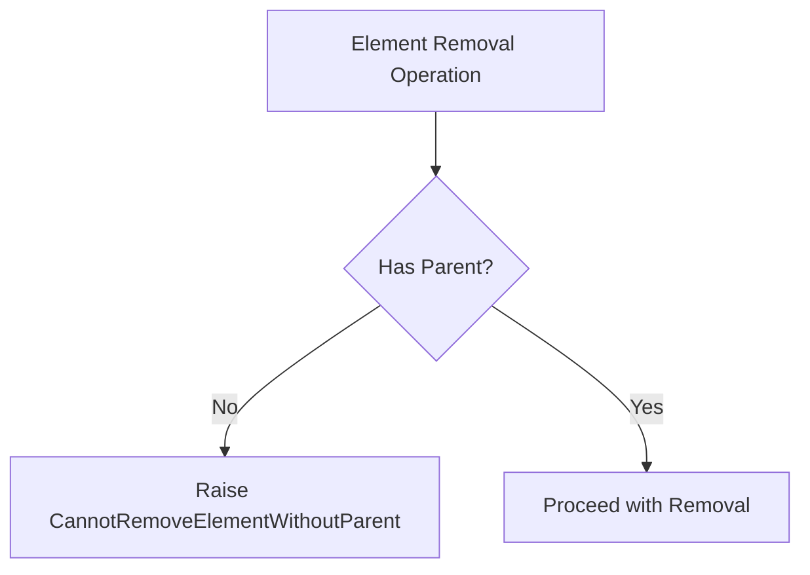
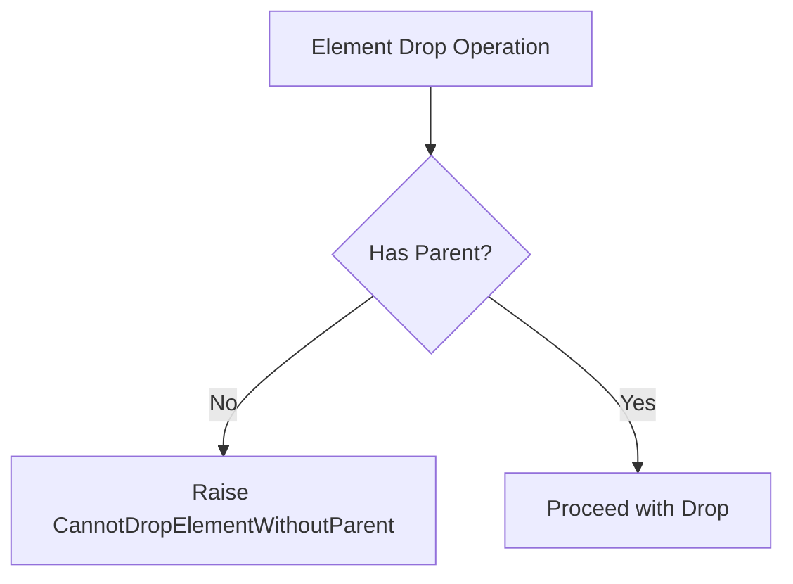
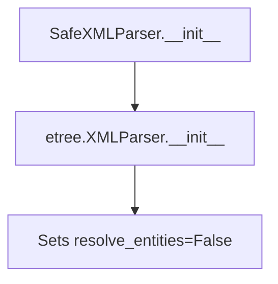
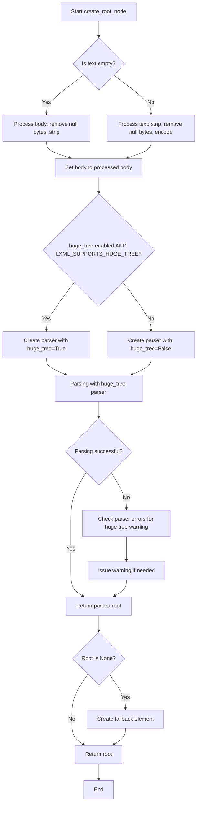
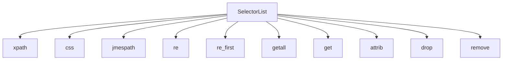

# `selector.py`

## `parsel.selector.CannotRemoveElementWithoutRoot` · *class*

## Summary:
Custom exception raised when attempting to remove or drop an element that does not have a root node.

## Description:
This exception is thrown when code attempts to remove or drop an HTML/XML element from a document structure, but the element being operated on has no root node. This typically occurs when working with pseudo-elements such as text nodes (e.g., using selectors like 'li::text' or '//li/text()') rather than actual elements. The exception prevents invalid operations on elements that aren't properly rooted in a document tree.

## State:
- Inherits from Exception base class
- No additional attributes or parameters
- No specific invariants beyond those of the base Exception class

## Lifecycle:
- Creation: Instantiated automatically by the Selector.remove() or Selector.drop() methods when validation fails
- Usage: Raised during element removal operations when root validation fails
- Destruction: Handled by standard exception handling mechanisms

## Method Map:
```mermaid
graph TD
    A[Selector.remove()/drop()] --> B{Has Root?}
    B -- No --> C[Raise CannotRemoveElementWithoutRoot]
    B -- Yes --> D{Has Parent?}
    D -- No --> E[Raise CannotRemoveElementWithoutParent]
    D -- Yes --> F[Proceed with Removal/Drop]
```

## Raises:
- CannotRemoveElementWithoutRoot: Raised in Selector.remove() and Selector.drop() methods when attempting to operate on an element that lacks a root node, typically due to selecting text nodes instead of element nodes

## Example:
```python
from parsel import Selector

# This would raise CannotRemoveElementWithoutRoot
try:
    selector = Selector(text='<div><p>Hello</p></div>')
    element = selector.xpath('//p/text()')[0]  # Selects text node, not element
    element.drop()  # Would raise CannotRemoveElementWithoutRoot
except CannotRemoveElementWithoutRoot:
    print("Cannot operate on element without root - likely a text node selection")
```

## `parsel.selector.CannotRemoveElementWithoutParent` · *class*

## Summary:
Custom exception raised when attempting to remove an element that does not have a parent node.

## Description:
This exception is thrown when code attempts to remove an HTML/XML element from a document structure, but the element being removed has no parent node. This typically occurs in parsing operations where elements are manipulated or removed from parsed documents. The exception serves as a guardrail to prevent invalid operations on orphaned elements.

## State:
- Inherits all state from Exception base class
- No additional attributes or parameters
- No specific invariants beyond those of the base Exception class

## Lifecycle:
- Creation: Instantiated automatically by the parser when encountering an invalid removal operation
- Usage: Raised during element removal operations when parent validation fails
- Destruction: Handled by standard exception handling mechanisms

## Method Map:


## Raises:
- CannotRemoveElementWithoutParent: Raised when attempting to remove an element that lacks a parent node during parsing operations

## Example:
```python
# This would raise CannotRemoveElementWithoutParent
try:
    selector = Selector(text='<div><p>Hello</p></div>')
    element = selector.xpath('//p')[0]
    # If element has no parent (which shouldn't happen in normal parsing)
    element.remove()  # Would raise exception if element has no parent
except CannotRemoveElementWithoutParent:
    print("Cannot remove element without parent")
```

## `parsel.selector.CannotDropElementWithoutParent` · *class*

## Summary:
Custom exception raised when attempting to drop an element that does not have a parent node.

## Description:
This exception is a specialized subclass of CannotRemoveElementWithoutParent and is thrown when code attempts to drop (remove) an HTML/XML element from a document structure, but the element being dropped has no parent node. This typically occurs in parsing operations where elements are manipulated or removed from parsed documents. The exception serves as a guardrail to prevent invalid operations on orphaned elements.

## State:
- Inherits all state from CannotRemoveElementWithoutParent parent class
- No additional attributes or parameters
- No specific invariants beyond those of the base Exception class

## Lifecycle:
- Creation: Instantiated automatically by the parser when encountering an invalid drop operation
- Usage: Raised during element drop operations when parent validation fails
- Destruction: Handled by standard exception handling mechanisms

## Method Map:


## Raises:
- CannotDropElementWithoutParent: Raised when attempting to drop an element that lacks a parent node during parsing operations

## Example:
```python
# This would raise CannotDropElementWithoutParent
try:
    selector = Selector(text='<div><p>Hello</p></div>')
    element = selector.xpath('//p')[0]
    # If element has no parent (which shouldn't happen in normal parsing)
    element.drop()  # Would raise exception if element has no parent
except CannotDropElementWithoutParent:
    print("Cannot drop element without parent")
```

## `parsel.selector.SafeXMLParser` · *class*

## Summary:
A secure XML parser that prevents XML External Entity (XXE) injection attacks by disabling entity resolution.

## Description:
The SafeXMLParser class is a specialized XML parser that inherits from lxml's XMLParser and automatically disables entity resolution to prevent XML External Entity (XXE) vulnerabilities. This parser should be used whenever untrusted XML content needs to be parsed to ensure security against XXE attacks.

The class is designed to be used as a drop-in replacement for standard XML parsing operations within the parsel library ecosystem, particularly when working with XML content that may contain malicious entity references. It ensures that XML entities are not resolved during parsing, which mitigates security risks associated with XXE attacks.

## State:
- `resolve_entities`: Boolean flag set to False by default to prevent entity resolution (inherited from etree.XMLParser)
- All other attributes are inherited from `etree.XMLParser` with their standard behavior

## Lifecycle:
- Creation: Instantiated with standard etree.XMLParser arguments, defaults resolve_entities=False
- Usage: Used internally by the parsel library when parsing XML content through Selector objects
- Destruction: Managed by Python's garbage collection, no explicit cleanup required

## Method Map:


## Raises:
- No specific exceptions raised by __init__
- Inherits all exceptions from etree.XMLParser.__init__

## Example:
```python
from parsel.selector import SafeXMLParser
from lxml import etree

# Create a safe XML parser instance
parser = SafeXMLParser()

# Parse XML content safely
xml_content = "<root><element>test</element></root>"
tree = etree.fromstring(xml_content, parser=parser)

# The parser will not resolve external entities
# Even if xml_content contained <!ENTITY foo "bar"> it would not be resolved
```

### `parsel.selector.SafeXMLParser.__init__` · *method*

## Summary:
Initializes a SafeXMLParser instance with entity resolution disabled to prevent XXE injection attacks.

## Description:
Configures the XML parser to disable entity resolution by default, preventing XML External Entity (XXE) injection vulnerabilities. This constructor ensures that XML entities are not resolved during parsing, which mitigates security risks associated with XXE attacks.

This method exists as a specialized initialization that enforces security best practices by automatically setting resolve_entities=False, rather than relying on callers to remember this important security setting.

## Args:
    *args (Any): Positional arguments passed to the parent etree.XMLParser.__init__ method
    **kwargs (Any): Keyword arguments passed to the parent etree.XMLParser.__init__ method

## Returns:
    None: This method initializes the object in-place and does not return a value

## Raises:
    Exception: Inherits all exceptions that etree.XMLParser.__init__ may raise (such as ValueError for invalid arguments)

## State Changes:
    Attributes READ: None
    Attributes WRITTEN: None (state is initialized by parent class)

## Constraints:
    Preconditions: None
    Postconditions: The parser instance will have resolve_entities=False by default

## Side Effects:
    None: This method performs no I/O operations or external service calls

## `parsel.selector.CTGroupValue` · *class*

## Summary:
Defines a typed dictionary structure for grouping parsing configuration parameters used by parsel selectors.

## Description:
CTGroupValue is a TypedDict that represents a collection of parsing-related configuration parameters. It groups together parser type, CSS translator, and tostring method information that are commonly used together when processing HTML/XML documents. This structure enables consistent configuration management across different selector operations within the parsel library.

## State:
- `_parser`: Union type of etree.XMLParser or html.HTMLParser - specifies the parser class to use for document parsing
- `_csstranslator`: Union type of GenericTranslator or HTMLTranslator - specifies the CSS selector translation mechanism
- `_tostring_method`: str - specifies the method name to use for converting elements back to string representation

## Lifecycle:
- Creation: Instantiated as a dictionary with the three required keys
- Usage: Passed as configuration parameter to selector operations that require consistent parsing context
- Destruction: No explicit cleanup required as it's a simple data structure

## Method Map:
```
digraph {
    rankdir=LR;
    "CTGroupValue" -> "Selector Operations"
    "Selector Operations" -> "Parser Configuration"
    "Selector Operations" -> "CSS Translation"
    "Selector Operations" -> "String Conversion"
}
```

## Raises:
None - This is a TypedDict definition, not a class with constructor logic

## Example:
```python
# Creating a CTGroupValue instance
config = CTGroupValue(
    _parser=html.HTMLParser,
    _csstranslator=HTMLTranslator(),
    _tostring_method="tostring"
)

# Using in selector context
# (Usage would depend on how this config is consumed by selector methods)
```

## `parsel.selector._xml_or_html` · *function*

## Summary:
Determines whether to use XML or HTML parsing mode based on input type specification.

## Description:
This utility function serves as a simple type resolver that maps an input type specification to either "xml" or "html" parsing modes. It's designed to standardize type selection for parser initialization throughout the selector module.

## Args:
    type (Optional[str]): Input type specification, typically representing the document type. When None or any value other than "xml", defaults to "html".

## Returns:
    str: Either "xml" or "html" indicating the appropriate parsing mode to use.

## Raises:
    None: This function does not raise any exceptions.

## Constraints:
    Preconditions:
    - The input parameter `type` should be a string or None
    - The function assumes that if `type` is not exactly "xml", it should default to "html"

    Postconditions:
    - Always returns either "xml" or "html" string
    - The returned value is deterministic based on input

## Side Effects:
    None: This function has no side effects.

## Control Flow:
```mermaid
flowchart TD
    A[Input type] --> B{type == "xml"?}
    B -- Yes --> C[Return "xml"]
    B -- No --> D[Return "html"]
```

## Examples:
```python
# Basic usage
result = _xml_or_html("xml")     # Returns "xml"
result = _xml_or_html("html")    # Returns "html"
result = _xml_or_html(None)      # Returns "html"
result = _xml_or_html("other")   # Returns "html"
```

## `parsel.selector.create_root_node` · *function*

## Summary:
Creates an lxml root element from text or binary content using a specified parser class.

## Description:
This function serves as a utility for parsing HTML or XML content into an lxml tree structure. It normalizes input by removing null bytes and whitespace, then uses the provided parser class to construct an lxml element. When parsing fails or returns None, it provides a fallback mechanism to ensure a valid root element is always returned.

## Args:
    text (str): Text content to parse. If empty, the body parameter is used instead.
    parser_cls (Type[_ParserType]): The lxml parser class to use for parsing (e.g., html.HTMLParser, etree.XMLParser).
    base_url (Optional[str]): Base URL to use for resolving relative URLs in the parsed content. Defaults to None.
    huge_tree (bool): Whether to enable huge tree parsing support. Defaults to LXML_SUPPORTS_HUGE_TREE.
    body (bytes): Binary content to parse when text is empty. Defaults to b"".
    encoding (str): Character encoding to use when encoding text. Defaults to "utf8".

## Returns:
    etree._Element: An lxml element representing the root of the parsed document. Always returns a valid etree._Element instance, creating a fallback <html/> element if parsing fails or returns None.

## Raises:
    etree.ParserError: May be raised by lxml's etree.fromstring() during parsing operations.
    Exception: May propagate exceptions from the underlying lxml parsing process.

## Constraints:
    Preconditions:
    - parser_cls must be a valid lxml parser class
    - text should be a string or empty
    - body should be bytes or empty
    
    Postconditions:
    - Returns a valid etree._Element instance
    - The returned element is suitable for further lxml operations
    - The element will have the specified base_url set if provided

## Side Effects:
    - May issue warnings via warnings.warn() when huge_tree parsing fails due to version limitations
    - Uses lxml's etree.fromstring() which may perform I/O operations during parsing
    - May modify global warning state through warnings.warn()

## Control Flow:


## Examples:
    # Basic usage with text
    root = create_root_node("<div>Hello World</div>", html.HTMLParser)
    
    # Usage with binary content
    root = create_root_node("", html.HTMLParser, body=b"<p>Content</p>")
    
    # Usage with base URL
    root = create_root_node("<a href='link'>Link</a>", html.HTMLParser, base_url="http://example.com")
    
    # Usage with huge_tree enabled
    root = create_root_node("<div>Large content</div>", html.HTMLParser, huge_tree=True)

## `parsel.selector.SelectorList` · *class*

## Summary:
A container class that holds multiple selector objects and enables batch operations on them.

## Description:
SelectorList extends Python's built-in List class to manage collections of selector objects (likely instances of Selector class). It provides convenient methods to apply XPath, CSS, JMESPath queries, and extraction operations to all contained selectors simultaneously by executing each operation on individual selectors and aggregating the results.

This abstraction allows developers to work with multiple matched elements as a single unit, simplifying common web scraping patterns where the same operation needs to be applied across multiple nodes.

## State:
- Inherits all state from `List[_SelectorType]` where `_SelectorType` represents selector objects
- Maintains a collection of selector objects that support methods like `xpath`, `css`, `get`, `re`, etc.
- The list maintains ordering of selector objects as they were added

## Lifecycle:
- Creation: Instantiated as an empty list or populated with selector objects
- Usage: Apply batch operations like xpath(), css(), re(), getall() to process each contained selector individually
- Destruction: Standard Python list cleanup; no special cleanup required

## Method Map:


## Raises:
- TypeError from `__getstate__`: "can't pickle SelectorList objects" when attempting to serialize the object

## Example:
```python
# Create a SelectorList with multiple selectors
selectors = SelectorList([selector1, selector2, selector3])

# Apply XPath query to each selector individually and collect all results
results = selectors.xpath('//div[@class="item"]')

# Extract text content from all matching elements
all_text = selectors.getall()

# Get first match from all selectors (returns first result from first selector with matches)
first_match = selectors.get()

# Apply regular expression to each selector individually and flatten all results
regex_matches = selectors.re(r'\d+')
```

### `parsel.selector.SelectorList.__getitem__` · *method*

## Summary:
Retrieves elements from the selector list by index or slice, returning either a single selector or a new selector list instance while preserving type information.

## Description:
This method enables indexing and slicing operations on SelectorList instances. When accessed with an integer index, it returns a single selector object of type `_SelectorType`. When accessed with a slice, it returns a new SelectorList instance containing the selected elements, maintaining the same generic type as the original list. This method overrides the standard list `__getitem__` behavior to ensure proper type handling and return appropriate selector types.

## Args:
    pos (Union[SupportsIndex, slice]): Either an integer index or a slice object specifying which elements to retrieve

## Returns:
    Union[_SelectorType, SelectorList[_SelectorType]]: A single selector when indexed by integer, or a new SelectorList when sliced

## Raises:
    IndexError: When accessing an index that is out of bounds

## State Changes:
    Attributes READ: None
    Attributes WRITTEN: None

## Constraints:
    Preconditions: The position argument must be a valid index or slice for the underlying list
    Postconditions: The returned object maintains the same selector type as the original list

## Side Effects:
    None

### `parsel.selector.SelectorList.__getstate__` · *method*

## Summary:
Prevents serialization of SelectorList objects by raising a TypeError during pickling operations.

## Description:
This special method is called during the pickling process to serialize the object's state. The SelectorList class explicitly prevents pickling by raising a TypeError, indicating that SelectorList objects cannot be serialized. This is likely due to the presence of lxml element references or other non-pickleable objects within the list.

## Args:
    self: The SelectorList instance being pickled.

## Returns:
    None: This method always raises an exception and never returns normally.

## Raises:
    TypeError: Always raised with the message "can't pickle SelectorList objects" when attempting to pickle a SelectorList instance.

## State Changes:
    Attributes READ: None - This method doesn't read any instance attributes.
    Attributes WRITTEN: None - This method doesn't modify any instance attributes.

## Constraints:
    Preconditions: The method can be called on any SelectorList instance.
    Postconditions: The method never completes execution normally - it always raises an exception.

## Side Effects:
    None: No external state changes occur, but the operation fails with a TypeError.

### `parsel.selector.SelectorList.jmespath` · *method*

*No documentation generated.*

### `parsel.selector.SelectorList.xpath` · *method*

## Summary:
Applies an XPath expression to all selectors in this list and returns a new selector list containing flattened results.

## Description:
This method executes an XPath query on each selector within the list, collecting all matching elements from each selector. The results from all selectors are flattened into a single selector list. This approach allows for applying XPath expressions consistently across multiple selectors while maintaining the list structure.

The method follows the same pattern as other selector methods like `css()` and `jmespath()` in the same class, ensuring consistency in the API design. It processes each selector in the list individually, applies the XPath expression, and then flattens all results into a new SelectorList instance.

## Args:
    xpath (str): The XPath expression to apply to each selector in the list.
    namespaces (Optional[Mapping[str, str]]): Optional namespace mapping to resolve prefixes in the XPath expression. Defaults to None.
    **kwargs (Any): Additional keyword arguments to pass to the underlying XPath implementation.

## Returns:
    SelectorList[_SelectorType]: A new SelectorList instance containing all elements that match the XPath expression across all selectors in this list, flattened into a single list.

## Raises:
    None explicitly raised by this method.

## State Changes:
    Attributes READ: None
    Attributes WRITTEN: None

## Constraints:
    Preconditions:
    - The SelectorList must contain valid Selector objects that support the xpath method
    - Each selector's content must be accessible via its xpath method
    - The xpath parameter must be a valid XPath expression string
    
    Postconditions:
    - Returns a new SelectorList instance (does not modify self)
    - All results are flattened into a single list structure
    - Empty list is returned if no matches are found or if the list is empty

## Side Effects:
    None

### `parsel.selector.SelectorList.css` · *method*

*No documentation generated.*

### `parsel.selector.SelectorList.re` · *method*

## Summary:
Applies a regular expression to all selectors in this list and returns flattened matching results.

## Description:
This method executes a regular expression search on each selector within the list, collecting all matching groups or captured text from each selector. The results from all selectors are flattened into a single list of strings.

## Args:
    regex (Union[str, Pattern[str]]): Regular expression pattern to match against selector content.
    replace_entities (bool): Whether to replace HTML entities in the matched results. Defaults to True.

## Returns:
    List[str]: A flattened list of all strings that match the regular expression across all selectors in the list.

## Raises:
    None explicitly raised by this method.

## State Changes:
    Attributes READ: None
    Attributes WRITTEN: None

## Constraints:
    Preconditions: 
    - The SelectorList must contain valid Selector objects
    - Each selector's content must be accessible via its `get()` method
    - The regex parameter must be a valid regular expression string or compiled pattern
    
    Postconditions:
    - Returns a flat list of strings (never nested)
    - Empty list is returned if no matches are found or if the list is empty

## Side Effects:
    None

### `parsel.selector.SelectorList.re_first` · *method*

## Summary:
Returns the first match of a regular expression from all selectors in this list, or a default value if no matches are found.

## Description:
This method applies a regular expression pattern to each selector in the list and returns the first matching string found. It flattens all results from all selectors into a single sequence and returns the first element. If no matches are found across any selectors, it returns the specified default value.

This method is particularly useful when you want to extract a single piece of information from a collection of selectors, such as finding the first email address, URL, or other pattern-matched content among multiple elements.

## Args:
    regex (Union[str, Pattern[str]]): Regular expression pattern to match against selector content. Can be either a string pattern or a compiled regular expression object.
    default (Optional[str]): Default value to return if no matches are found. Defaults to None.
    replace_entities (bool): Whether to replace HTML entities in the matched results. Defaults to True.

## Returns:
    Optional[str]: The first matching string found, or the default value if no matches are found. Returns None when default is None and no matches are found.

## Raises:
    None explicitly raised by this method.

## State Changes:
    Attributes READ: None
    Attributes WRITTEN: None

## Constraints:
    Preconditions:
    - The SelectorList must contain valid Selector objects
    - Each selector's content must be accessible via its `get()` method
    - The regex parameter must be a valid regular expression string or compiled pattern
    
    Postconditions:
    - Returns a string or None (based on the default parameter)
    - Does not modify the SelectorList or any of its contained selectors

## Side Effects:
    None

### `parsel.selector.SelectorList.getall` · *method*

*No documentation generated.*

### `parsel.selector.SelectorList.get` · *method*

## Summary:
Returns the result of calling `get()` on the first element in the selector list, or returns a default value if the list is empty.

## Description:
This method iterates through the SelectorList and returns the result of calling the `get()` method on the first element. If the list is empty, it returns the specified default value (which defaults to None). This method is particularly useful when you expect at most one matching element and want to extract its content directly.

The method is designed to be a convenience function that provides a clean way to extract content from a single element when working with selector lists. It's essentially a shorthand for getting the first element's content without having to manually index into the list.

## Args:
    default (Optional[str]): The default value to return if the selector list is empty. Defaults to None.

## Returns:
    Any: The result of calling `get()` on the first element in the list, or the default value if the list is empty.

## Raises:
    None explicitly raised by this method.

## State Changes:
    Attributes READ: None - this method only reads elements from self via iteration
    Attributes WRITTEN: None - this method doesn't modify any attributes of self

## Constraints:
    Preconditions: 
    - The SelectorList must be iterable
    - Each element in the list must have a `get()` method that can be called
    
    Postconditions:
    - If the list is not empty, the return value is the result of calling `get()` on the first element
    - If the list is empty, the return value is the provided default parameter

## Side Effects:
    None - this method doesn't perform any I/O operations or mutate external state

### `parsel.selector.SelectorList.attrib` · *method*

## Summary:
Returns the attribute dictionary of the first element in the selector list, or an empty dictionary if the list is empty.

## Description:
This method provides access to the HTML/XML attributes of the first element matched by the selector list. It iterates through the selector list and returns the `attrib` property of the first element encountered. This is useful when you want to extract attributes from the first matching element in a selection.

## Args:
    None

## Returns:
    Mapping[str, str]: A dictionary containing the attributes of the first element, or an empty dictionary if no elements exist in the selector list.

## Raises:
    None

## State Changes:
    Attributes READ: None
    Attributes WRITTEN: None

## Constraints:
    Preconditions: The object must be a SelectorList instance that can be iterated over
    Postconditions: Returns either a mapping of attributes or an empty dictionary

## Side Effects:
    None

### `parsel.selector.SelectorList.remove` · *method*

## Summary:
Removes all selectors in this list from their respective parent elements, issuing a deprecation warning.

## Description:
This deprecated method applies the `remove()` operation to each selector in the list, effectively removing them from their parent XML/HTML trees. It serves as a convenience method for batch-removing multiple selectors at once. The method issues a deprecation warning directing users to use the `drop()` method instead, which provides equivalent functionality.

This method is typically called during data processing pipelines when selectors need to be removed from parsed documents. It's part of the SelectorList's lifecycle management for manipulating parsed XML/HTML structures.

## Args:
    None

## Returns:
    None

## Raises:
    CannotRemoveElementWithoutRoot: When attempting to remove a selector that has no root element.
    CannotRemoveElementWithoutParent: When attempting to remove a selector that has no parent element.
    DeprecationWarning: Always raised when this method is called, indicating it's deprecated.

## State Changes:
    Attributes READ: None
    Attributes WRITTEN: None

## Constraints:
    Preconditions: The SelectorList must contain Selector objects that have valid root elements and parents.
    Postconditions: Each selector in the list will have been removed from its parent tree.

## Side Effects:
    Mutates the XML/HTML tree structures by removing elements from their parent nodes.

### `parsel.selector.SelectorList.drop` · *method*

## Summary:
Removes all selectors in this list from their respective parent elements.

## Description:
This method applies the `drop()` operation to each selector in the list, effectively removing them from their parent XML/HTML trees. It provides a convenient way to batch-remove multiple selectors at once instead of iterating manually.

## Args:
    None

## Returns:
    None

## Raises:
    CannotRemoveElementWithoutRoot: When attempting to drop a selector that has no root element.
    CannotDropElementWithoutParent: When attempting to drop a selector that has no parent element.

## State Changes:
    Attributes READ: None
    Attributes WRITTEN: None

## Constraints:
    Preconditions: The SelectorList must contain Selector objects that have valid root elements and parents.
    Postconditions: Each selector in the list will have been removed from its parent tree.

## Side Effects:
    Mutates the XML/HTML tree structures by removing elements from their parent nodes.

## `parsel.selector._get_root_from_text` · *function*

## Summary:
Parses text content into an lxml root element using a type-specific parser from a configuration group.

## Description:
This function serves as a factory method that retrieves a parser from a predefined configuration group based on content type and uses it to parse text content into an lxml element. It abstracts away the complexity of parser selection and delegation to the core `create_root_node` utility function.

The function is designed to be called internally by selector methods that need to parse text content of various types (HTML, XML, etc.) into lxml tree structures for further processing.

## Args:
    text (str): The text content to parse into an lxml element.
    type (str): The content type identifier used to look up the appropriate parser in the `_ctgroup` configuration. Common values would be "html" or "xml".
    **lxml_kwargs (Any): Additional keyword arguments to pass to the lxml parser creation process.

## Returns:
    etree._Element: An lxml element representing the root of the parsed document. Always returns a valid etree._Element instance.

## Raises:
    Exception: May propagate exceptions from the underlying lxml parsing process or from `create_root_node`.

## Constraints:
    Preconditions:
    - The `_ctgroup` dictionary must be properly initialized and contain the specified `type`
    - The `type` parameter must correspond to a valid key in `_ctgroup` that maps to a parser configuration
    - The `text` parameter must be a valid string that can be parsed by the selected parser

    Postconditions:
    - Returns a valid etree._Element instance
    - The returned element is suitable for further lxml operations

## Side Effects:
    - May perform I/O operations during parsing through lxml
    - May issue warnings via warnings.warn() if parsing issues occur
    - Uses lxml's etree.fromstring() which may perform I/O operations during parsing

## Control Flow:
```mermaid
flowchart TD
    A[Start _get_root_from_text] --> B[Lookup parser in _ctgroup[type]["_parser"]]
    B --> C[Call create_root_node with text and parser]
    C --> D{create_root_node succeeds?}
    D -- Yes --> E[Return parsed root element]
    D -- No --> F[Propagate exception]
    E --> G[End]
    F --> G
```

## Examples:
    # Parse HTML text
    root = _get_root_from_text("<div>Hello World</div>", type="html")
    
    # Parse XML text  
    root = _get_root_from_text("<root><item>Value</item></root>", type="xml")
``

## `parsel.selector._get_root_and_type_from_bytes` · *function*

## Summary:
Parses binary content and determines the appropriate root element and content type based on input parameters and content analysis.

## Description:
This function processes binary content by analyzing its type and content to determine whether it represents text, JSON, HTML, or XML data. It serves as a central dispatcher for content type detection and parsing, handling multiple input scenarios including explicit type specification, JSON content detection, and automatic HTML/XML detection. The function is designed to be a reusable utility that abstracts away the complexity of content type determination and parsing.

## Args:
    body (bytes): The binary content to parse
    encoding (str): Character encoding to use when decoding text content
    input_type (Optional[str]): Explicitly specify the content type ('text', 'json', 'html', 'xml', or None for auto-detection)
    **lxml_kwargs (Any): Additional keyword arguments to pass to lxml parser creation

## Returns:
    Tuple[Any, str]: A tuple containing (parsed_content, content_type) where:
        - parsed_content: The parsed root element (etree._Element for HTML/XML, decoded string for text, or parsed JSON object for JSON)
        - content_type: String indicating the detected type ('text', 'json', 'html', or 'xml')

## Raises:
    AssertionError: When input_type is not one of ('html', 'xml', None) after validation

## Constraints:
    Preconditions:
    - body must be bytes
    - encoding must be a valid string
    - input_type must be one of ('text', 'json', 'html', 'xml', None)
    
    Postconditions:
    - Always returns a tuple with two elements
    - The first element is either a parsed root element, decoded string, or JSON object
    - The second element is always a string representing the content type

## Side Effects:
    None: This function has no side effects beyond potential warnings from underlying parsing functions

## Control Flow:
```mermaid
flowchart TD
    A[Start _get_root_and_type_from_bytes] --> B{input_type == "text"?}
    B -- Yes --> C[Decode body with encoding, return (decoded_text, "text")]
    B -- No --> D{encoding == "utf8"?}
    D -- Yes --> E[Try JSON parsing]
    E --> F{JSON parsing successful?}
    F -- Yes --> G[Return (parsed_json, "json")]
    F -- No --> H{input_type == "json"?}
    H -- Yes --> I[Return (None, "json")]
    H -- No --> J[Assert input_type in ("html", "xml", None)]
    J --> K[Call _xml_or_html(input_type)]
    K --> L[Get parser from _ctgroup[type]["_parser"]]
    L --> M[Call create_root_node()]
    M --> N[Return (root, type)]
    D -- No --> O[Assert input_type in ("html", "xml", None)]
    O --> P[Call _xml_or_html(input_type)]
    P --> Q[Get parser from _ctgroup[type]["_parser"]]
    Q --> R[Call create_root_node()]
    R --> S[Return (root, type)]
```

## Examples:
```python
# Parse HTML content
root, type = _get_root_and_type_from_bytes(b"<html><body>Hello</body></html>", "utf-8")

# Parse JSON content
data, type = _get_root_and_type_from_bytes(b'{"key": "value"}', "utf-8", input_type="json")

# Parse text content
text, type = _get_root_and_type_from_bytes(b"Hello World", "utf-8", input_type="text")

# Auto-detect content type
root, type = _get_root_and_type_from_bytes(b"<div>Content</div>", "utf-8")
```

## `parsel.selector._get_root_and_type_from_text` · *function*

## Summary:
Determines the appropriate parsing type and root element from text input, supporting text, JSON, HTML, and XML formats.

## Description:
This function analyzes input text to identify its content type and returns both the parsed root element and the determined type. It handles multiple input formats including plain text, JSON data, HTML markup, and XML documents. The function is designed to be a central parsing dispatcher that routes input to appropriate parsing mechanisms based on content analysis.

The function extracts parsing logic from higher-level selector methods to provide a clean interface for determining content type and creating root elements. This separation allows for consistent parsing behavior across different selector operations while maintaining flexibility in input handling.

## Args:
    text (str): The text content to analyze and parse. This can be plain text, JSON, HTML, or XML formatted content.
    input_type (Optional[str]): Explicit type hint for the input content. Can be "text", "json", "html", "xml", or None. When None, the function attempts to auto-detect the type.
    **lxml_kwargs (Any): Additional keyword arguments to pass to lxml parser creation when parsing HTML or XML content.

## Returns:
    Tuple[Any, str]: A tuple containing two elements:
        - The parsed content (either the original text for "text" type, parsed JSON data for "json" type, or an lxml root element for "html"/"xml" types)
        - A string indicating the determined content type ("text", "json", "html", or "xml")

## Raises:
    Exception: May propagate exceptions from underlying lxml parsing operations when processing HTML/XML content.

## Constraints:
    Preconditions:
    - The `text` parameter must be a valid string
    - The `input_type` parameter, if provided, must be one of "text", "json", "html", "xml", or None
    
    Postconditions:
    - Always returns a tuple with a parsed content object and a valid type string
    - For "text" input_type, returns the original text unchanged
    - For "json" input_type with invalid JSON, returns (None, "json")
    - For "json" content, returns parsed JSON data
    - For "html"/"xml" content, returns parsed lxml root element

## Side Effects:
    - May perform I/O operations during lxml parsing of HTML/XML content
    - May issue warnings during lxml parsing operations
    - Uses lxml's etree.fromstring() which may perform I/O operations during parsing

## Control Flow:
```mermaid
flowchart TD
    A[Start _get_root_and_type_from_text] --> B{input_type == "text"?}
    B -- Yes --> C[Return (text, "text")]
    B -- No --> D[Try json.loads(text)]
    D --> E{json parsing successful?}
    E -- Yes --> F[Return (parsed_data, "json")]
    E -- No --> G{input_type == "json"?}
    G -- Yes --> H[Return (None, "json")]
    G -- No --> I[Assert input_type in ("html", "xml", None)]
    I --> J[Call _xml_or_html(input_type)]
    J --> K[Call _get_root_from_text(text, type=..., **lxml_kwargs)]
    K --> L[Return (root_element, type)]
```

## Examples:
    # Parse plain text
    result, type = _get_root_and_type_from_text("Hello World", input_type="text")
    # Returns ("Hello World", "text")
    
    # Parse JSON content
    result, type = _get_root_and_type_from_text('{"key": "value"}', input_type=None)
    # Returns ({"key": "value"}, "json")
    
    # Parse HTML content
    result, type = _get_root_and_type_from_text("<div>Hello</div>", input_type="html")
    # Returns (lxml root element, "html")
    
    # Parse XML content with additional kwargs
    result, type = _get_root_and_type_from_text("<root></root>", input_type="xml", encoding="utf-8")
    # Returns (lxml root element, "xml")

## `parsel.selector._get_root_type` · *function*

## Summary:
Determines the appropriate parsing type for a given root element based on its type and input specifications.

## Description:
This function analyzes the type of the provided root element and determines the correct parsing mode to use. It ensures type consistency between the root element and the specified input type, raising appropriate errors when incompatible combinations are detected. The function serves as a type resolver that helps the selector module properly handle different input formats (XML, HTML, JSON).

## Args:
    root (Any): The root element to analyze, which can be an lxml.etree._Element, dict, list, or other data structure.
    input_type (Optional[str]): The explicitly specified input type, which can be "xml", "html", "json", or None.

## Returns:
    str: The determined parsing type, which will be one of "xml", "html", or "json".

## Raises:
    ValueError: When an lxml.etree._Element root is provided with an incompatible input_type of "json" or "text".

## Constraints:
    Preconditions:
    - The root parameter can be any type, but specific handling applies to lxml.etree._Element, dict, and list instances
    - input_type should be a string or None
    - When root is an lxml.etree._Element, input_type cannot be "json" or "text"

    Postconditions:
    - Always returns a string value of either "xml", "html", or "json"
    - For lxml.etree._Element roots, if input_type is not "json" or "text", it delegates to _xml_or_html for resolution
    - For dict/list or valid JSON roots, always returns "json"
    - For other cases, returns input_type or defaults to "json"

## Side Effects:
    None: This function performs no I/O operations or external state mutations.

## Control Flow:
```mermaid
flowchart TD
    A[Start _get_root_type] --> B{root is etree._Element?}
    B -- Yes --> C{input_type in {"json", "text"}?}
    C -- Yes --> D[raise ValueError]
    C -- No --> E[return _xml_or_html(input_type)]
    B -- No --> F{root is dict/list OR _is_valid_json(root)?}
    F -- Yes --> G[return "json"]
    F -- No --> H[return input_type or "json"]
```

## Examples:
```python
# XML/HTML root with no explicit type
from lxml import etree
root_element = etree.fromstring("<root><child/></root>")
type_result = _get_root_type(root_element, input_type=None)  # Returns "html"

# XML root with explicit type
type_result = _get_root_type(root_element, input_type="xml")  # Returns "xml"

# Invalid combination raises error
try:
    _get_root_type(root_element, input_type="json")
except ValueError as e:
    print(e)  # Selector got an lxml.etree._Element object as root, and 'json' as type.

# JSON root
json_data = {"key": "value"}
type_result = _get_root_type(json_data, input_type=None)  # Returns "json"

# JSON string root
json_string = '{"key": "value"}'
type_result = _get_root_type(json_string, input_type=None)  # Returns "json"
```

## `parsel.selector._is_valid_json` · *function*

## Summary:
Validates whether a given string contains syntactically correct JSON.

## Description:
This utility function attempts to parse a string as JSON using json.loads() and returns a boolean indicating whether the parsing was successful. It specifically handles TypeError and ValueError exceptions that may occur during JSON parsing, returning False for invalid JSON strings.

## Args:
    text (str): The string to validate as JSON format.

## Returns:
    bool: True if the input string is valid JSON, False otherwise.

## Raises:
    None: This function does not raise exceptions directly. It catches and handles TypeError and ValueError exceptions internally.

## Constraints:
    Preconditions:
        - The input must be a string type
        - The string should represent valid JSON syntax
    
    Postconditions:
        - Returns a boolean value (True or False)
        - Does not modify the input string
        - Function execution is deterministic for the same input

## Side Effects:
    None: This function performs no I/O operations or external state mutations.

## Control Flow:
```mermaid
flowchart TD
    A[Start _is_valid_json] --> B{Try json.loads(text)}
    B -->|Success| C[Return True]
    B -->|TypeError or ValueError| D[Return False]
```

## Examples:
    >>> _is_valid_json('{"key": "value"}')
    True
    >>> _is_valid_json('invalid json')
    False
    >>> _is_valid_json('')
    False
    >>> _is_valid_json('[1, 2, 3]')
    True
    >>> _is_valid_json(None)
    False
```

## `parsel.selector._load_json_or_none` · *function*

## Summary:
Safely attempts to parse JSON text and returns the parsed object or None if parsing fails.

## Description:
This utility function provides a safe way to parse JSON text without raising exceptions on invalid JSON. It accepts string, bytes, or bytearray inputs and attempts to deserialize them using the standard JSON parser. If deserialization fails, it gracefully returns None instead of propagating the ValueError.

## Args:
    text (str): The JSON text to parse, which can be a string, bytes, or bytearray.

## Returns:
    Any: The parsed JSON object if successful, or None if the input is not a valid JSON string or if parsing fails.

## Raises:
    None: This function does not raise exceptions directly, though it catches ValueError internally.

## Constraints:
    Preconditions:
        - Input should be a string, bytes, or bytearray
        - If input is a string, it should be valid JSON format
    
    Postconditions:
        - Returns parsed JSON object when input is valid JSON
        - Returns None when input is not valid JSON or not of expected types

## Side Effects:
    None: This function has no side effects.

## Control Flow:
```mermaid
flowchart TD
    A[Start _load_json_or_none] --> B{isinstance(text, (str,bytes,bytearray))}
    B -- Yes --> C[try json.loads(text)]
    C --> D{json.loads succeeds?}
    D -- Yes --> E[return parsed object]
    D -- No --> F[return None]
    B -- No --> G[return None]
    E --> H[End]
    F --> H
    G --> H
```

## Examples:
    # Valid JSON string
    result = _load_json_or_none('{"key": "value"}')
    # Returns: {'key': 'value'}
    
    # Invalid JSON string
    result = _load_json_or_none('{"key":}')
    # Returns: None
    
    # Non-string input
    result = _load_json_or_none(123)
    # Returns: None
```

## `parsel.selector.Selector` · *class*

*No documentation generated.*

### `parsel.selector.Selector.__init__` · *method*

## Summary:
Initializes a Selector object with content (text, bytes, or root element) and configuration options for parsing and selection.

## Description:
The `__init__` method sets up a Selector instance by processing input parameters to determine the content type and root element for subsequent XPath/CSS selection operations. It supports multiple input formats including text strings, binary content, and pre-parsed lxml root elements, automatically detecting content type when not explicitly specified.

This method serves as the primary entry point for creating Selector instances and handles validation of input parameters, type detection, and initialization of internal state variables. It ensures that exactly one of the text, body, or root parameters is provided, and properly configures the selector's namespace mappings and parsing settings.

## Args:
    text (Optional[str]): Text content to parse, can be plain text, HTML, XML, or JSON. Defaults to None.
    type (Optional[str]): Explicit content type hint ("html", "json", "text", "xml", or None for auto-detection). Defaults to None.
    body (bytes): Binary content to parse. Defaults to empty bytes.
    encoding (str): Character encoding for decoding binary content. Defaults to "utf8".
    namespaces (Optional[Mapping[str, str]]): Namespace mappings for CSS/XPath queries. Defaults to None.
    root (Optional[Any]): Pre-parsed lxml root element or JSON data. Defaults to _NOT_SET sentinel value.
    base_url (Optional[str]): Base URL for resolving relative URLs in HTML/XML. Defaults to None.
    _expr (Optional[str]): Internal expression tracking for debugging. Defaults to None.
    huge_tree (bool): Enable lxml's huge_tree option for parsing large documents. Defaults to LXML_SUPPORTS_HUGE_TREE.

## Returns:
    None: This method initializes the object's state and returns nothing.

## Raises:
    ValueError: When invalid type is provided or when none of text, body, or root arguments are provided.
    TypeError: When text is not a string or body is not bytes.

## State Changes:
    Attributes READ: 
        - self._default_namespaces
    Attributes WRITTEN:
        - self.root: Set to the parsed root element or content
        - self.type: Set to the determined content type
        - self.namespaces: Initialized with default namespaces and updated with provided namespaces
        - self._expr: Set to the provided expression
        - self._huge_tree: Set to the provided huge_tree flag
        - self._text: Set to the provided text parameter

## Constraints:
    Preconditions:
        - Either text, body, or root must be provided (with root using _NOT_SET sentinel)
        - If text is provided, it must be a string
        - If body is provided, it must be bytes
        - type must be one of "html", "json", "text", "xml", or None
        
    Postconditions:
        - self.root is set to a valid root element or content
        - self.type is set to a valid content type string
        - self.namespaces contains default namespaces plus any provided ones
        - All internal state variables are initialized appropriately

## Side Effects:
    - Issues warnings when both text and root parameters are provided (root is ignored)
    - May perform I/O operations during lxml parsing of HTML/XML content
    - May issue warnings during lxml parsing operations

### `parsel.selector.Selector.__getstate__` · *method*

## Summary:
Prevents serialization of Selector objects by raising a TypeError during pickle operations.

## Description:
This special method is part of Python's pickle protocol and is called when attempting to serialize a Selector object. The method explicitly raises a TypeError to prevent Selector instances from being pickled, as they contain complex lxml elements and internal state that cannot be reliably serialized.

## Args:
    self: The Selector instance being serialized

## Returns:
    This method does not return normally, as it always raises an exception.

## Raises:
    TypeError: Always raised with the message "can't pickle Selector objects" when pickle attempts to serialize a Selector instance.

## State Changes:
    Attributes READ: None - this method doesn't read any instance attributes
    Attributes WRITTEN: None - this method doesn't modify any instance attributes

## Constraints:
    Preconditions: None - the method is called internally by Python's pickle mechanism
    Postconditions: None - the method never completes execution normally

## Side Effects:
    None - this method only raises an exception and has no other observable effects

### `parsel.selector.Selector._get_root` · *method*

## Summary:
Creates an lxml root element from text or binary content using the appropriate parser based on the selector's type or provided type parameter.

## Description:
This method serves as a factory for creating lxml root elements by delegating to the `create_root_node` utility function. It determines which parser class to use based on the selector's type or an explicitly provided type parameter, ensuring proper parsing of HTML or XML content according to the selector's configuration. This method is typically called during selector initialization or when processing content that needs to be parsed into an lxml tree structure.

## Args:
    text (str): Text content to parse. Defaults to empty string.
    base_url (Optional[str]): Base URL to use for resolving relative URLs in the parsed content. Defaults to None.
    huge_tree (bool): Whether to enable huge tree parsing support. Defaults to LXML_SUPPORTS_HUGE_TREE.
    type (Optional[str]): Explicit type override for parsing (html, xml, etc.). Defaults to None.
    body (bytes): Binary content to parse when text is empty. Defaults to empty bytes.
    encoding (str): Character encoding to use when encoding text. Defaults to "utf8".

## Returns:
    etree._Element: An lxml element representing the root of the parsed document. Always returns a valid etree._Element instance.

## Raises:
    etree.ParserError: May be raised by lxml's etree.fromstring() during parsing operations.
    Exception: May propagate exceptions from the underlying lxml parsing process.

## State Changes:
    Attributes READ: self.type
    Attributes WRITTEN: None

## Constraints:
    Preconditions:
    - Parser class must be available in _ctgroup[type or self.type]["_parser"] 
    - text should be a string or empty
    - body should be bytes or empty
    
    Postconditions:
    - Returns a valid etree._Element instance
    - The returned element is suitable for further lxml operations

## Side Effects:
    - May issue warnings via warnings.warn() when huge_tree parsing fails due to version limitations
    - Uses lxml's etree.fromstring() which may perform I/O operations during parsing
    - May modify global warning state through warnings.warn()

### `parsel.selector.Selector.jmespath` · *method*

## Summary:
Executes a JMESPath query on the selector's data and returns a list of new selectors representing the query results.

## Description:
This method applies a JMESPath query to the underlying data of the selector, which can be JSON, HTML, or XML content. It parses the data appropriately based on the selector type, executes the JMESPath search, and constructs new selector objects from the query results. The method is designed to enable flexible data extraction from structured content using JMESPath expressions.

## Args:
    query (str): The JMESPath query string to execute against the selector's data.
    **kwargs (Any): Additional keyword arguments to pass to the jmespath.search function.

## Returns:
    SelectorList[_SelectorType]: A new SelectorList containing selector objects created from the JMESPath query results. Each selector represents a portion of the original data that matched the query.

## Raises:
    None: This method does not explicitly raise exceptions, though underlying JMESPath operations may raise exceptions if the query is malformed.

## State Changes:
    Attributes READ: 
        - self.type: Determines how the data is processed
        - self.root: Contains the raw data to query
        - self.selectorlist_cls: Used to construct the return value
    
    Attributes WRITTEN: None

## Constraints:
    Preconditions:
        - self.type must be one of "json", "html", or "xml"
        - self.root must contain valid data for the selector type
        - query must be a valid JMESPath expression string
    
    Postconditions:
        - Returns a SelectorList instance with appropriate selector objects
        - If query returns no results, returns an empty SelectorList
        - If query returns a single value, wraps it in a list for consistency

## Side Effects:
    None: This method has no side effects beyond returning a new SelectorList object.

### `parsel.selector.Selector.xpath` · *method*

*No documentation generated.*

### `parsel.selector.Selector.css` · *method*

## Summary:
Converts a CSS selector query into XPath and executes it on the current selector, returning a list of matching elements.

## Description:
This method provides CSS selector functionality by internally converting the provided CSS selector expression into an equivalent XPath expression using the `_css2xpath` method, then executing that XPath query through the existing `xpath` method. It enables developers to use familiar CSS selector syntax for querying HTML/XML documents instead of requiring XPath syntax.

The method acts as a bridge between CSS and XPath, leveraging the existing XPath infrastructure in the Selector class. It's designed to be consistent with other selector methods like `xpath()` and `jmespath()` in the same class, providing a uniform API for different query languages.

## Args:
    query (str): A CSS selector string to be converted and executed against the current selector's content.

## Returns:
    SelectorList[_SelectorType]: A list-like object containing all elements that match the CSS selector query. Each element in the list is a new Selector instance pointing to a matching element.

## Raises:
    ValueError: Raised when the selector's type is not one of ("html", "xml", "text"), indicating that CSS selection is not supported for this selector type.

## State Changes:
    Attributes READ: 
    - self.type: Used to validate that the selector supports CSS queries
    - self._css2xpath(): Called to convert CSS to XPath
    - self.xpath(): Called to execute the converted XPath query
    
    Attributes WRITTEN: 
    - None: This method is read-only and doesn't modify any instance attributes.

## Constraints:
    Preconditions:
    - The selector instance must have a valid type attribute set to either "html", "xml", or "text"
    - The query parameter must be a valid string containing a CSS selector expression
    
    Postconditions:
    - Returns a SelectorList containing all matching elements
    - The method operates purely on the selector's content and returns a computed result

## Side Effects:
    None: This method performs no I/O operations or external service calls. It only processes the selector's content internally.

### `parsel.selector.Selector._css2xpath` · *method*

## Summary:
Converts a CSS selector expression into an equivalent XPath expression for use with lxml.

## Description:
This private method serves as a bridge between CSS selector syntax and XPath expression generation. It determines the appropriate parsing mode (HTML vs XML) based on the selector's type, then utilizes a CSS translator to convert the provided CSS selector into its XPath equivalent. This method is called internally by the `css()` method to enable CSS selector functionality.

The method leverages a global configuration structure `_ctgroup` that contains type-specific translators and parsers. It uses `_xml_or_html()` to normalize the selector type and then accesses the appropriate CSS translator from the configuration group to perform the conversion.

## Args:
    query (str): A CSS selector string to be converted to XPath syntax.

## Returns:
    str: An XPath expression equivalent to the provided CSS selector.

## Raises:
    AttributeError: May be raised if the CSS translator's `css_to_xpath` method is not available or fails.
    Exception: May propagate exceptions from the underlying CSS translation process.

## State Changes:
    Attributes READ: 
    - self.type: Used to determine parsing mode via `_xml_or_html()`
    
    Attributes WRITTEN: 
    - None: This method is read-only and doesn't modify any instance attributes.

## Constraints:
    Preconditions:
    - The selector instance must have a valid `type` attribute (either "html", "xml", or None)
    - The `query` parameter must be a valid string containing a CSS selector
    - The global `_ctgroup` configuration must be properly initialized with CSS translators
    
    Postconditions:
    - Returns a valid XPath expression string that can be used with lxml's xpath() method
    - The returned XPath expression is equivalent to the input CSS selector
    - The method operates purely on input parameters and returns a computed result

## Side Effects:
    None: This method performs no I/O operations or external service calls. It only processes the input string and returns a transformed string.

### `parsel.selector.Selector.re` · *method*

## Summary:
Extracts all strings matching a regular expression from the selected element's text content.

## Description:
Applies a regular expression pattern to the text content of the selected element and returns all matching substrings. This method is useful for extracting structured data from HTML/XML elements using pattern matching.

## Args:
    regex (Union[str, Pattern[str]]): Regular expression pattern to match. Can be either a string or compiled regex pattern.
    replace_entities (bool): Whether to replace HTML entities in the matched results. Defaults to True.

## Returns:
    List[str]: A list of all matched substrings. Returns an empty list if no matches are found.

## Raises:
    None explicitly raised by this method. Exceptions may be raised by underlying regex compilation or matching functions.

## State Changes:
    Attributes READ: self.get() method call (accesses self.root and self.type)
    Attributes WRITTEN: None

## Constraints:
    Preconditions: The Selector instance must have been initialized with valid text/content (html, xml, text, or json type).
    Postconditions: The returned list contains all matches found by the regex pattern in the selected element's text content.

## Side Effects:
    None

### `parsel.selector.Selector.re_first` · *method*

## Summary:
Returns the first string matching a regular expression from the selected element's text content, or a default value if no matches are found.

## Description:
This method applies a regular expression pattern to the text content of the selected element and returns the first matching substring. It is particularly useful for extracting specific pieces of data from HTML/XML elements when you expect only one match or want the first occurrence. The method internally uses `self.re()` to find all matches and then returns the first one using `next()` with a default value, making it more convenient than manually accessing the first element of `re()`'s result.

## Args:
    regex (Union[str, Pattern[str]]): Regular expression pattern to match. Can be either a string or compiled regex pattern.
    default (Optional[str]): Default value to return if no matches are found. Defaults to None.
    replace_entities (bool): Whether to replace HTML entities in the matched results. Defaults to True.

## Returns:
    Optional[str]: The first matched string if matches are found, otherwise the default value. Returns None when default is None and no matches are found.

## Raises:
    None explicitly raised by this method. Exceptions may be raised by underlying regex compilation or matching functions through the `re` method.

## State Changes:
    Attributes READ: 
    - Calls `self.re()` which accesses `self.get()` and reads `self.root` and `self.type`
    Attributes WRITTEN: None

## Constraints:
    Preconditions:
    - The Selector instance must have been initialized with valid text/content (html, xml, text, or json type)
    - The regex parameter must be a valid regular expression string or compiled pattern
    
    Postconditions:
    - Returns either the first match string or the default value
    - Never raises exceptions from this method itself (exceptions from regex operations propagate through `re` method)

## Side Effects:
    None

### `parsel.selector.Selector.get` · *method*

## Summary:
Returns the string representation of the selector's root content, handling different content types appropriately.

## Description:
This method retrieves and formats the root content of the selector based on its type. For text and JSON types, it returns the raw root content directly. For other types (HTML/XML), it attempts to serialize the root element to a string using lxml's tostring method with a configured method from the internal _ctgroup mapping. If serialization fails, it provides fallback handling for boolean values and general string conversion.

## Args:
    None: This is an instance method that operates on self.

## Returns:
    Any: For "text" and "json" types, returns the raw root content. For other types, returns a string representation of the root element or fallback string representations for boolean values.

## Raises:
    None: This method does not explicitly raise exceptions, though underlying lxml operations may raise exceptions that are caught internally.

## State Changes:
    Attributes READ: 
    - self.type: Determines the processing approach
    - self.root: The content to be processed and returned
    
    Attributes WRITTEN: 
    - None: This method is read-only and doesn't modify any attributes.

## Constraints:
    Preconditions:
    - self.type must be one of "html", "json", "text", "xml", or None
    - self.root must be set (not None) for non-text/json types
    
    Postconditions:
    - Returns appropriate representation based on self.type
    - For boolean root values, returns "1" for True and "0" for False
    - For other root values, returns string representation

## Side Effects:
    - Calls lxml.etree.tostring() for serialization (I/O and CPU intensive)
    - May call str() conversion for fallback cases
    - Uses typing.cast() for type hinting (no runtime effect)

### `parsel.selector.Selector.getall` · *method*

## Summary:
Returns a list containing the string representation of the selector's root content.

## Description:
This method provides a consistent interface for extracting content from a single selector by returning the result of `self.get()` wrapped in a list. This is particularly useful when working with APIs or code patterns that expect a list of results, even when dealing with a single element.

The method is designed to complement the SelectorList.getall() method, providing a uniform interface where both single selectors and lists of selectors can be handled consistently. When called on a Selector instance, it ensures that the return value is always a list, making it easier to write code that handles both single and multiple results uniformly.

This method is commonly used when you want to extract content from a single selector element and need the result in list format for consistency with methods that return multiple results.

## Args:
    None: This is an instance method that operates on self.

## Returns:
    List[str]: A list containing exactly one string element, which is the result of calling `self.get()` on this selector instance.

## Raises:
    None: This method does not explicitly raise exceptions, though it may propagate exceptions from the underlying `self.get()` call.

## State Changes:
    Attributes READ: 
    - self.get(): Reads the selector's root content through the get() method
    
    Attributes WRITTEN: 
    - None: This method is read-only and doesn't modify any attributes.

## Constraints:
    Preconditions:
    - The Selector instance must have a valid root element set
    - The Selector's type must be one of "html", "json", "text", "xml", or None
    
    Postconditions:
    - Always returns a list with exactly one element
    - The single element is the string representation of the selector's content

## Side Effects:
    - Calls the underlying `self.get()` method which may perform serialization or string conversion operations
    - May involve I/O operations when serializing HTML/XML content using lxml

### `parsel.selector.Selector.register_namespace` · *method*

## Summary:
Registers a namespace prefix and URI mapping for use in XPath expressions.

## Description:
Adds a namespace prefix and its corresponding URI to the selector's namespace dictionary. This allows XPath queries to properly resolve namespace prefixes used in the document being selected.

## Args:
    prefix (str): The namespace prefix to register.
    uri (str): The namespace URI associated with the prefix.

## Returns:
    None: This method does not return any value.

## Raises:
    None: This method does not explicitly raise any exceptions.

## State Changes:
    Attributes READ: self.namespaces
    Attributes WRITTEN: self.namespaces

## Constraints:
    Preconditions: The selector instance must be properly initialized with a namespaces dictionary.
    Postconditions: The specified prefix/URI pair will be available for XPath expression resolution.

## Side Effects:
    None: This method only modifies the internal namespaces dictionary of the selector instance.

### `parsel.selector.Selector.remove_namespaces` · *method*

## Summary:
Removes XML namespace prefixes from all elements and attributes in the parsed document tree.

## Description:
This method strips namespace declarations from element tags and attribute names that contain namespace prefixes (indicated by opening curly braces). It processes the entire document tree recursively, modifying element tags and attributes in-place. The method is useful when working with XML documents that contain namespaces but you want to work with clean, namespace-free element names for easier querying and manipulation.

## Args:
    None: This is an instance method that operates on self.

## Returns:
    None: This method modifies the document tree in-place and returns nothing.

## Raises:
    None: This method does not explicitly raise exceptions, though underlying lxml operations may raise exceptions.

## State Changes:
    Attributes READ: 
    - self.root: The lxml etree element representing the parsed document tree
    
    Attributes WRITTEN: 
    - self.root: Modifies element tags and attributes in-place by stripping namespace prefixes

## Constraints:
    Preconditions:
    - self.root must be a valid lxml etree element
    - The selector must have been initialized with XML/HTML content that contains namespace declarations
    
    Postconditions:
    - All element tags with namespace prefixes are modified to remove the prefix
    - All attribute names with namespace prefixes are modified to remove the prefix  
    - Namespace declarations are cleaned up from the document tree

## Side Effects:
    - Mutates the document tree in-place by modifying element tags and attributes
    - Calls etree.cleanup_namespaces() which may modify the document structure
    - May affect subsequent XPath/CSS queries that depend on namespace information

### `parsel.selector.Selector.remove` · *method*

## Summary:
Removes the selected element from its parent node in the parsed document tree.

## Description:
This method removes the currently selected element from its parent node in the document tree. It is deprecated and users should use the `drop` method instead. The method performs validation to ensure the element has both a root and a parent before attempting removal.

## Args:
    None

## Returns:
    None

## Raises:
    CannotRemoveElementWithoutRoot: When the selected element has no root node (e.g., when selecting pseudo-elements like text nodes directly)
    CannotRemoveElementWithoutParent: When the selected element has no parent node (e.g., when trying to remove a root element itself)

## State Changes:
    Attributes READ: self.root
    Attributes WRITTEN: None

## Constraints:
    Preconditions: 
    - The element must have a root node (self.root must exist)
    - The element must have a parent node (the root must have a parent)
    - The element must be part of a document tree structure
    
    Postconditions:
    - The element is removed from its parent in the document tree
    - The element is no longer part of the parsed document structure

## Side Effects:
    - Issues a DeprecationWarning to inform users about the deprecated status
    - Modifies the document tree structure by removing an element

### `parsel.selector.Selector.drop` · *method*

## Summary:
Removes the selected element from its parent node in the document tree.

## Description:
This method removes the current element (represented by `self.root`) from its parent node in the document structure. It handles both XML and HTML documents differently - for XML documents, it uses the standard `parent.remove()` method, while for HTML documents, it uses `drop_tree()` method from lxml's HTML module. The method performs validation to ensure the element has a proper parent before attempting removal.

## Args:
    None

## Returns:
    None

## Raises:
    CannotRemoveElementWithoutRoot: Raised when the element being dropped has no root node, typically when selecting text nodes instead of element nodes (e.g., using 'li::text' or '//li/text()' selectors).
    CannotDropElementWithoutParent: Raised when the element being dropped has no parent node, typically when trying to remove a root element itself.

## State Changes:
    Attributes READ: 
        - self.root: The element node to be removed
        - self.type: Determines whether the element is XML or HTML type
    
    Attributes WRITTEN: 
        - None (modifies the document tree structure externally)

## Constraints:
    Preconditions:
        - The element must have a root node (self.root must not be None)
        - The element must have a parent node (the parent of self.root must not be None)
        - The element type must be either "xml" or "html" (not "json", "text", or None)
    
    Postconditions:
        - The element is removed from the document tree
        - The element's parent reference is updated accordingly
        - The element is no longer part of the document structure

## Side Effects:
    - Modifies the document tree structure by removing the element
    - May raise custom exceptions if validation fails

### `parsel.selector.Selector.attrib` · *method*

## Summary:
Returns a dictionary copy of the root element's attributes.

## Description:
This property provides read-only access to the attributes of the root element as a dictionary. It returns a shallow copy of the underlying lxml element's attrib dictionary to prevent modification of the original attributes through the returned dictionary. This property is useful for examining the attributes of the selected element without affecting the original element structure.

## Args:
    None

## Returns:
    Dict[str, str]: A dictionary containing all attributes of the root element, where keys are attribute names and values are their string values. Returns an empty dictionary if the root element has no attributes.

## Raises:
    None

## State Changes:
    Attributes READ: self.root.attrib
    Attributes WRITTEN: None

## Constraints:
    Preconditions: The Selector instance must have been initialized with a valid root element (self.root must not be None)
    Postconditions: The returned dictionary is a copy of the original attributes, so modifications to it won't affect the original element's attributes

## Side Effects:
    None

### `parsel.selector.Selector.__bool__` · *method*

## Summary:
Returns the truthiness of the selector's content by evaluating whether the extracted data is non-empty.

## Description:
This special method enables selectors to be evaluated in boolean contexts (such as `if` statements). When called, it determines whether the selector contains meaningful content by converting the extracted data to a boolean value. This allows developers to easily check if a selector matched any elements or contains data without explicitly calling `.get()`.

The method is typically invoked implicitly when a Selector instance is used in conditional expressions, such as:
```python
selector = response.css('div')
if selector:  # Implicitly calls __bool__
    # Process the selector content
    pass
```

## Args:
    None

## Returns:
    bool: True if the selector contains non-empty content, False otherwise.

## Raises:
    None

## State Changes:
    Attributes READ: self.get() (which accesses self.root and self.type)
    Attributes WRITTEN: None

## Constraints:
    Preconditions: The Selector instance must be properly initialized with valid content.
    Postconditions: The return value accurately reflects whether the selector's content is truthy.

## Side Effects:
    None

### `parsel.selector.Selector.__str__` · *method*

## Summary:
Returns a string representation of the Selector object showing its type, query expression, and a shortened preview of its data.

## Description:
This method provides a human-readable string representation of a Selector instance. It's typically called implicitly when printing a Selector object or converting it to a string. The representation includes the class name, the XPath/CSS query expression used to create the selector, and a shortened preview of the selected data.

## Args:
    None

## Returns:
    str: A formatted string containing the selector's class name, query expression, and data preview in the format "<ClassName query='expression' data='preview'>"

## Raises:
    None

## State Changes:
    Attributes READ: 
    - self._expr: The XPath/CSS query expression used to create this selector
    - self.get(): Method that retrieves the selector's data
    Attributes WRITTEN: None

## Constraints:
    Preconditions:
    - The Selector object must have been initialized with valid parameters
    - The selector must have associated data (either text, body, or root)
    - The _expr attribute must be set (typically during initialization or query execution)
    
    Postconditions:
    - The returned string follows a consistent format
    - The data preview is truncated to 40 characters maximum
    - The method does not modify the Selector object's state

## Side Effects:
    None

