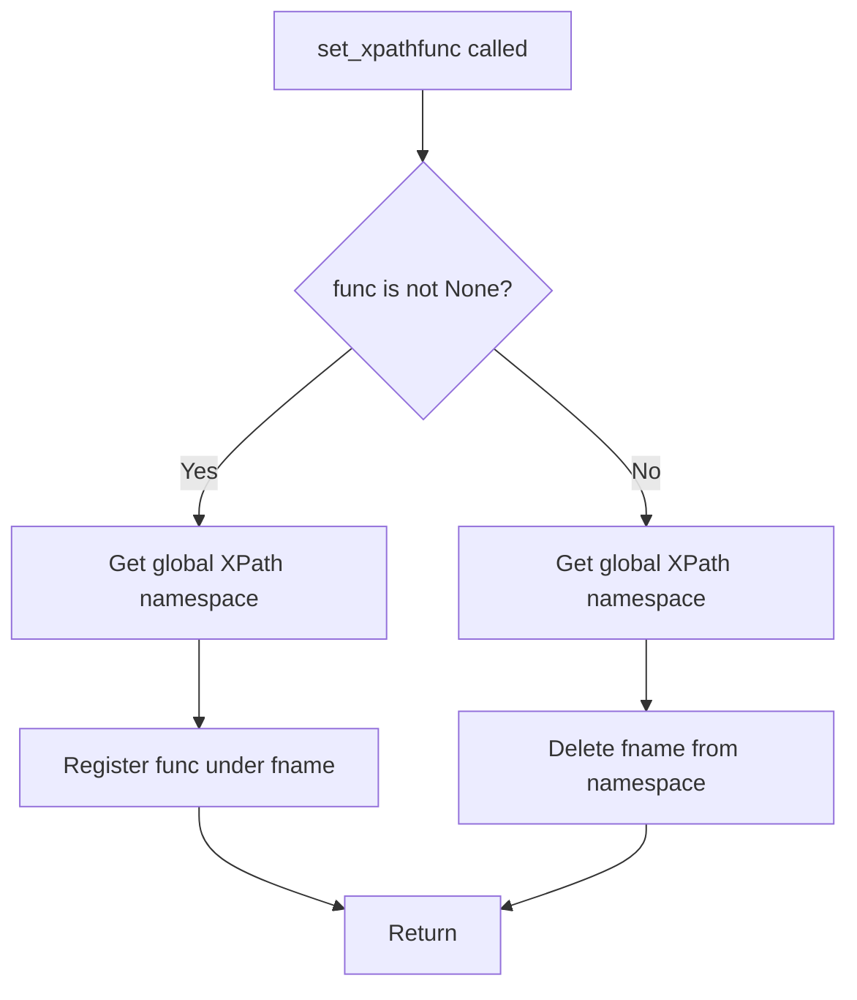
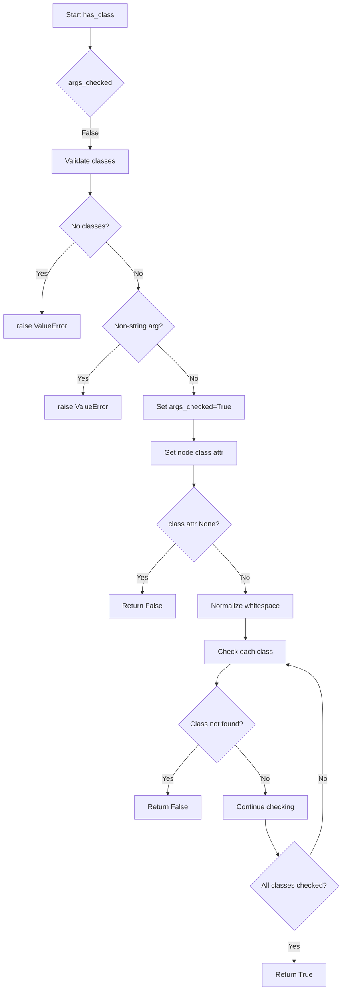

# `xpathfuncs.py`

## `parsel.xpathfuncs.set_xpathfunc` · *function*

## Summary:
Registers or unregisters a custom XPath function in the global XPath function namespace.

## Description:
This function provides a mechanism to add or remove custom XPath functions that can be used in XPath expressions processed by lxml. When a function is provided, it registers that function under the specified name in the global XPath namespace; when None is provided, it removes the function from the namespace.

## Args:
    fname (str): The name to register the XPath function under. This becomes the function identifier in XPath expressions.
    func (Optional[Callable]): The callable function to register, or None to unregister a previously registered function.

## Returns:
    None: This function does not return any value.

## Raises:
    None: This function does not explicitly raise exceptions, though underlying lxml operations may raise exceptions.

## Constraints:
    Preconditions:
    - fname must be a valid string that can be used as an XPath function name
    - func must be callable or None
    
    Postconditions:
    - The function name is either registered in the global XPath namespace or removed from it

## Side Effects:
    - Modifies the global XPath function namespace in lxml
    - This affects all subsequent XPath evaluations in the application

## Control Flow:


## Examples:
```python
# Register a custom XPath function
def my_function(context, arg1, arg2):
    return arg1 + arg2

set_xpathfunc('myfunc', my_function)

# Later in XPath expression: myfunc(1, 2)

# Unregister a function
set_xpathfunc('myfunc', None)
```

## `parsel.xpathfuncs.setup` · *function*

## Summary:
Registers the 'has-class' XPath function in the global XPath namespace.

## Description:
This function registers the `has_class` function under the name "has-class" in the global XPath namespace using the `set_xpathfunc` utility. This makes the `has_class` function available for use in XPath expressions throughout the application.

The function is a simple wrapper that performs the registration operation and is intended to be called once during application initialization to make the custom XPath function globally available.

## Args:
    None: This function takes no parameters.

## Returns:
    None: This function does not return any value.

## Raises:
    None: This function does not explicitly raise exceptions, though underlying lxml operations may raise exceptions during function registration.

## Constraints:
    Preconditions:
        - The parsel xpathfuncs module must be imported and available
        - The `has_class` function must be defined and accessible
        - The `set_xpathfunc` function must be defined and accessible
        
    Postconditions:
        - The 'has-class' XPath function is registered in the global XPath namespace
        - Subsequent XPath evaluations can use the 'has-class' function

## Side Effects:
    - Modifies the global XPath function namespace in lxml
    - Makes the 'has-class' XPath function available for all subsequent XPath evaluations in the application

## Control Flow:
```mermaid
flowchart TD
    A[setup() called] --> B[Call set_xpathfunc("has-class", has_class)]
    B --> C[Register has_class function under "has-class"]
    C --> D[Return]
```

## Examples:
```python
# Typical usage during application initialization
from parsel.xpathfuncs import setup
setup()

# Later in XPath expressions:
# //div[has-class(@class, 'btn', 'primary')]
# //a[has-class(@class, 'active')]
```

## `parsel.xpathfuncs.has_class` · *function*

## Summary:
Checks if an HTML node has all specified CSS classes in its class attribute.

## Description:
This function determines whether a given HTML node contains all the specified CSS classes in its class attribute. It's designed to be used as an XPath function within the parsel library for web scraping and HTML parsing tasks.

The function normalizes whitespace in the class attribute to handle various HTML formatting inconsistencies and ensures robust class matching. It's extracted as a separate function to provide reusable class checking logic for XPath expressions.

## Args:
    context (Any): The XPath evaluation context containing the node being evaluated and evaluation metadata
    *classes (str): Variable number of CSS class names to check for existence on the node

## Returns:
    bool: True if the node has ALL specified classes, False otherwise

## Raises:
    ValueError: When no class arguments are provided or when any argument is not a string

## Constraints:
    Preconditions:
        - The context parameter must be a valid XPath evaluation context object
        - The context must have a context_node with a "class" attribute
        - All class arguments must be strings
    Postconditions:
        - Returns a boolean value indicating class membership
        - The function caches argument validation in the eval_context to avoid repeated checks

## Side Effects:
    - Modifies the context.eval_context dictionary by setting "args_checked" to True after first validation
    - No external I/O operations or state mutations beyond the context object

## Control Flow:


## Examples:
    # Check if node has both "btn" and "primary" classes
    result = has_class(context, "btn", "primary")
    
    # Check if node has single class "active"
    result = has_class(context, "active")
    
    # This would raise ValueError: has-class must have at least 1 argument
    # result = has_class(context)
    
    # This would raise ValueError: has-class arguments must be strings
    # result = has_class(context, 123)

