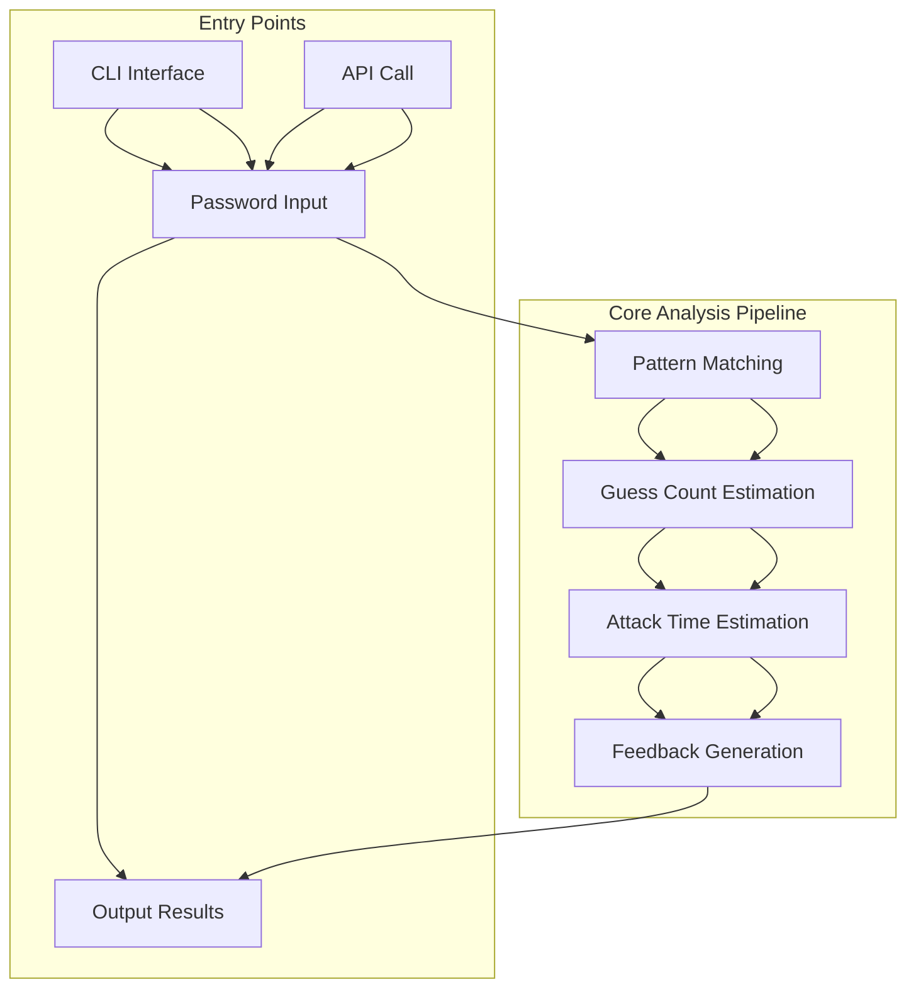

# `zxcvbn-python`

## Repository-Level Documentation: zxcvbn-python

### Tree Structure
```
zxcvbn-python/
└── zxcvbn/
    ├── __init__.py          # Main entry point for password analysis
    ├── __main__.py          # Command-line interface for interactive analysis
    ├── feedback.py          # User feedback and suggestion generation
    ├── matching.py          # Pattern matching and detection algorithms
    ├── scoring.py           # Guess count estimation calculations
    └── time_estimates.py    # Attack time estimation and conversion
```

### Purpose
The zxcvbn-python repository implements Dropbox's zxcvbn password strength estimation algorithm, a sophisticated password strength analyzer that goes beyond simple complexity checks. It evaluates passwords by identifying predictable patterns, calculating the computational effort required to guess them, and providing actionable feedback for improving security.

This tool addresses the critical need for intelligent password strength assessment that understands real-world password cracking patterns rather than just checking for character sets or length requirements. It's particularly valuable for applications requiring robust password policies and user education around secure password creation.

### Target Users
- Security-conscious developers building authentication systems
- Application developers needing password strength validation
- System administrators implementing password policies
- Security auditors evaluating password security practices
- End-users seeking guidance on creating stronger passwords

### Position in Ecosystem
zxcvbn-python is a standalone library that can be integrated into larger applications or used as a command-line tool. It serves as a drop-in replacement for simpler password validators, offering more nuanced security analysis while maintaining ease of integration.

### Architecture Overview
The system follows a layered architecture pattern where each component has a specific responsibility:

1. **Pattern Matching Layer** (`matching.py`): Detects various predictable patterns in passwords
2. **Scoring Layer** (`scoring.py`): Calculates guess counts for identified patterns  
3. **Time Estimation Layer** (`time_estimates.py`): Converts guess counts into meaningful attack time estimates
4. **Feedback Layer** (`feedback.py`): Generates human-readable suggestions for improving passwords
5. **Interface Layer** (`__init__.py` and `__main__.py`): Provides both programmatic API and CLI access



### Entry Points
1. **Programmatic API**: Import `zxcvbn` function from `zxcvbn` module
   ```python
   from zxcvbn import zxcvbn
   result = zxcvbn("mypassword", user_inputs=["john", "doe"])
   ```

2. **Command-Line Interface**: Run `python -m zxcvbn` for interactive analysis
   ```bash
   $ python -m zxcvbn
   Password: ********
   {
     "password": "mypassword",
     "score": 2,
     "guesses": 1000000,
     ...
   }
   ```

### Core Features
1. **Pattern Detection**: Identifies dictionary words, spatial patterns, repeated sequences, and other predictable structures
2. **Guess Count Calculation**: Computes the number of guesses required for each pattern type
3. **Attack Time Estimation**: Converts guess counts into time estimates for different attack scenarios
4. **User Feedback**: Generates actionable suggestions for improving password strength
5. **Customizable Inputs**: Accepts user-specific inputs to improve accuracy for personal passwords

### Dependencies
- **Internal Dependencies**: 
  - Standard Python libraries (re, math, json, getpass, select)
  - Cross-module imports between zxcvbn modules for coordinated analysis
- **External Dependencies**: None (pure Python implementation)

### Extension Points
The system supports extension through:
- Adding new pattern matching strategies by implementing new matcher functions
- Customizing feedback messages by modifying the feedback module
- Extending attack scenario estimations by updating time estimation logic
- Providing custom ranked dictionaries for domain-specific word lists

---

## Modules

- [`zxcvbn`](zxcvbn.md)

