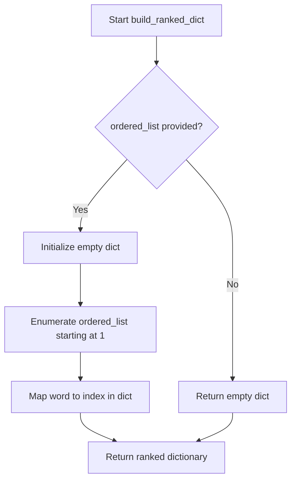
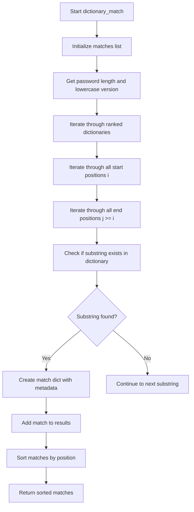
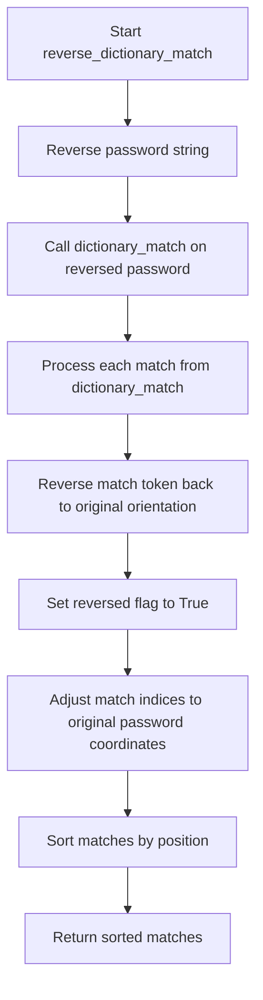
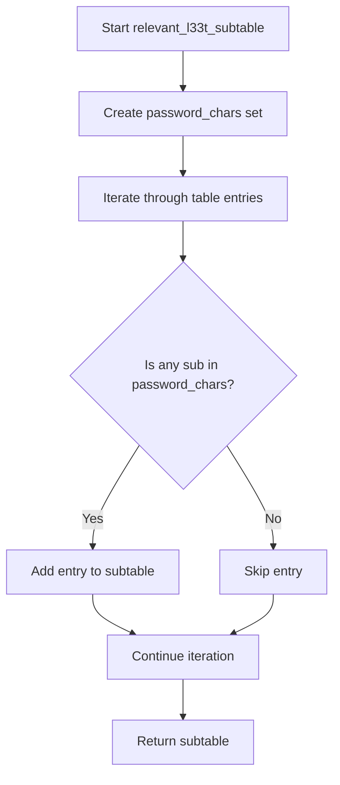
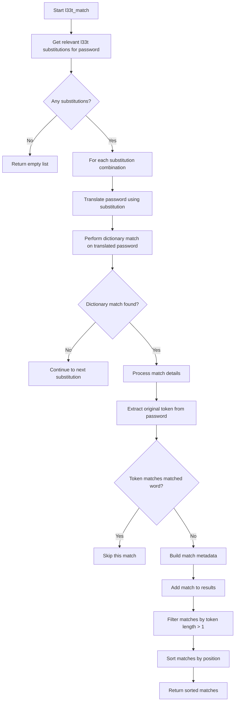
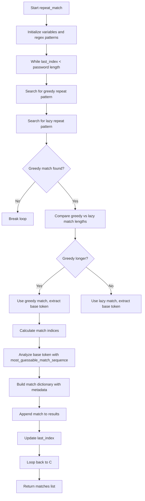
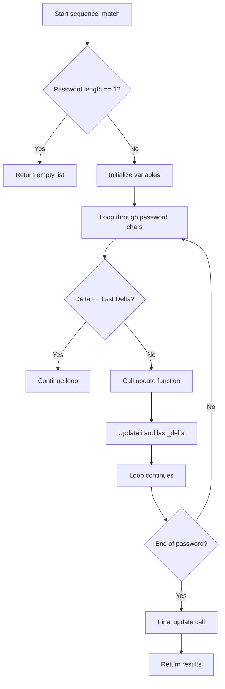
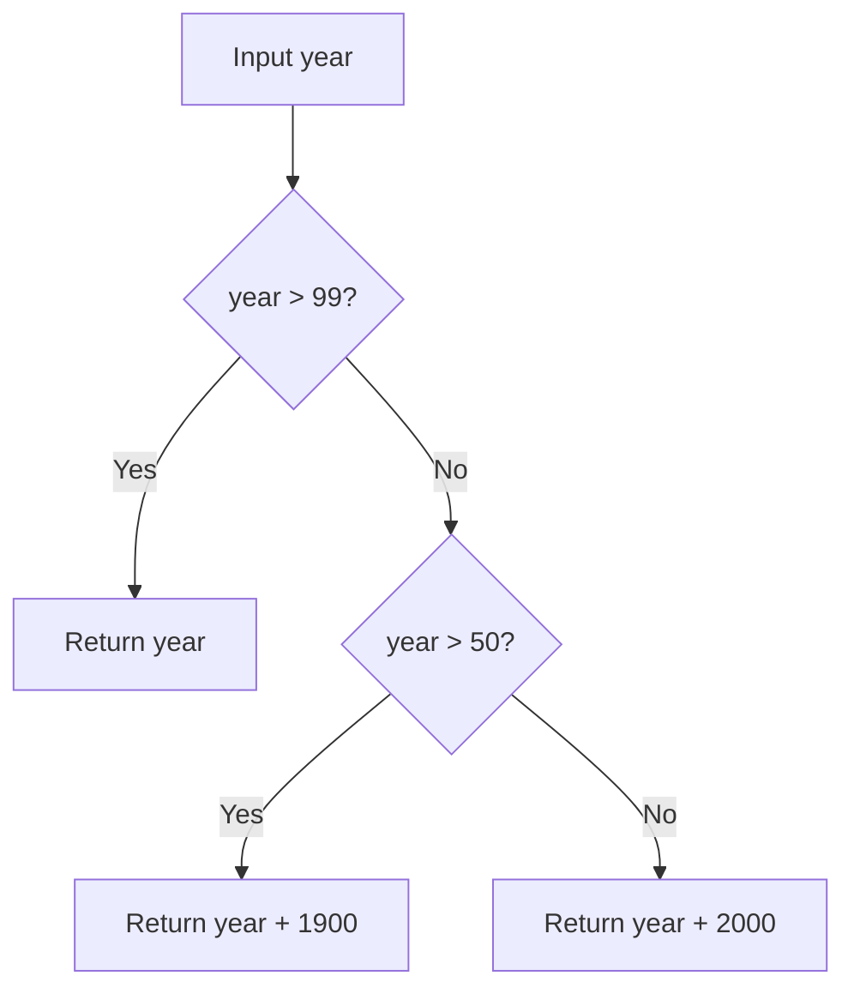

# `matching.py`

## `zxcvbn.matching.build_ranked_dict` · *function*

## Summary:
Creates a ranked dictionary mapping words to their positions in an ordered list, starting from position 1.

## Description:
Transforms an ordered list of words into a dictionary where each word maps to its position in the list. This ranked dictionary is used for determining word frequency rankings, which is essential for password strength estimation algorithms that consider common word patterns and sequences. The function is particularly useful for creating lookup tables from frequency lists used in password cracking resistance calculations.

## Args:
    ordered_list (list[str]): A list of words arranged in descending order of frequency or importance. Each word will be mapped to its rank position. Must be iterable containing hashable elements.

## Returns:
    dict[str, int]: A dictionary where keys are words from the input list and values are their corresponding ranks (starting from 1). If the input list is empty, returns an empty dictionary.

## Raises:
    TypeError: If ordered_list is not iterable or contains unhashable elements.

## Constraints:
    Preconditions:
    - The input parameter `ordered_list` must be iterable
    - All elements in the list should be hashable (strings in this case)
    
    Postconditions:
    - The returned dictionary will have exactly as many entries as the input list
    - Keys in the dictionary are the words from the input list
    - Values in the dictionary are integers starting from 1

## Side Effects:
    None: This function has no side effects and is pure.

## Control Flow:


## Examples:
    >>> build_ranked_dict(['apple', 'banana', 'cherry'])
    {'apple': 1, 'banana': 2, 'cherry': 3}
    
    >>> build_ranked_dict([])
    {}
    
    >>> build_ranked_dict(['zebra', 'yak', 'xenon'])
    {'zebra': 1, 'yak': 2, 'xenon': 3}

## `zxcvbn.matching.add_frequency_lists` · *function*

## Summary:
Populates ranked dictionaries with frequency-based word rankings for password strength analysis.

## Description:
Initializes or updates ranked dictionaries used in password strength estimation by converting frequency lists into ranked word mappings. This function serves as a utility for loading and organizing frequency data that the zxcvbn algorithm uses to assess password guessability based on common word patterns and sequences.

## Args:
    frequency_lists_ (dict[str, list[str]]): A dictionary mapping frequency list names to lists of words arranged in descending order of frequency or importance. Each key represents a category of words (like "common_passwords", "english_words"), and each value is a list of words in ranked order.

## Returns:
    None: This function does not return a value. It modifies global state by updating the RANKED_DICTIONARIES dictionary.

## Raises:
    None explicitly raised: The function itself doesn't raise exceptions, though underlying operations like `build_ranked_dict` may raise TypeError if inputs are invalid.

## Constraints:
    Preconditions:
    - The input parameter `frequency_lists_` must be a dictionary
    - Each value in the dictionary must be iterable (list-like structure)
    - Each item in the lists should be hashable (typically strings)
    
    Postconditions:
    - The global `RANKED_DICTIONARIES` dictionary will be updated with new entries
    - Each entry in `RANKED_DICTIONARIES` will map to a ranked dictionary created by `build_ranked_dict`

## Side Effects:
    - Modifies global state by updating the `RANKED_DICTIONARIES` dictionary
    - No external I/O operations or service calls

## Control Flow:
```mermaid
flowchart TD
    A[Start add_frequency_lists] --> B{frequency_lists_ provided?}
    B -- Yes --> C[Iterate over frequency_lists_.items()]
    C --> D{Next name, lst pair?}
    D -- Yes --> E[Call build_ranked_dict(lst)]
    E --> F[Assign result to RANKED_DICTIONARIES[name]]
    F --> G[D]
    D -- No --> H[End]
    B -- No --> I[End]
```

## Examples:
    # Basic usage with predefined frequency lists
    from zxcvbn.frequency_lists import FREQUENCY_LISTS
    
    # Load frequency lists into ranked dictionaries
    add_frequency_lists(FREQUENCY_LISTS)
    
    # Usage with custom frequency lists
    custom_lists = {
        'my_common_words': ['password', '123456', 'qwerty'],
        'my_personal_words': ['john', 'smith', 'company']
    }
    add_frequency_lists(custom_lists)
```

## `zxcvbn.matching.omnimatch` · *function*

## Summary:
Aggregates and sorts all pattern matches from multiple specialized matching functions to provide comprehensive password analysis.

## Description:
The `omnimatch` function serves as the central coordinator for all pattern matching operations in the zxcvbn password strength estimator. It systematically applies eight different matching strategies to identify various types of predictable patterns within a password, including dictionary words, leet speak substitutions, spatial keyboard patterns, repeated sequences, and more. The function consolidates results from all specialized matchers and returns them sorted by position in the password.

This logic is extracted into its own function rather than being inlined because it provides a clean abstraction layer that separates the orchestration of matching strategies from the implementation details of individual matchers. This modular approach enables easier maintenance, testing, and extension of the pattern matching system while maintaining a consistent interface for consumers of the matching results.

## Args:
    password (str): The password string to analyze for various pattern types
    _ranked_dictionaries (any, optional): Dictionary mapping dictionary names to ranked word dictionaries. Defaults to RANKED_DICTIONARIES constant from the module. This parameter is passed through to all individual matcher functions for consistency.

## Returns:
    list[dict]: A sorted list of match dictionaries from all pattern matching strategies, each containing:
        - pattern (str): Type of pattern matched ('dictionary', 'date', 'regex', 'repeat', 'sequence', 'spatial', 'l33t', 'reverse_dictionary')
        - i (int): Starting index of the match in the password
        - j (int): Ending index of the match in the password
        - token (str): The original substring from the password that was matched
        - Additional pattern-specific fields depending on the match type

## Raises:
    None explicitly raised - relies on individual matcher functions' behavior

## Constraints:
    Preconditions:
        - Password must be a string
        - All individual matcher functions must be callable and return valid match dictionaries
        
    Postconditions:
        - Returns a list of all matches from all matching strategies
        - All matches are sorted by starting position (i) and then ending position (j)
        - The returned list maintains consistency with the expected match dictionary structure

## Side Effects:
    None - Pure function with no external state mutation or I/O operations

## Control Flow:
```mermaid
flowchart TD
    A[Start omnimatch] --> B[Initialize empty matches list]
    B --> C[Iterate through 8 matcher functions]
    C --> D[Call dictionary_match]
    D --> E[Call reverse_dictionary_match]
    E --> F[Call l33t_match]
    F --> G[Call spatial_match]
    G --> H[Call repeat_match]
    H --> I[Call sequence_match]
    I --> J[Call regex_match]
    J --> K[Call date_match]
    K --> L[Extend matches list with each matcher's results]
    L --> M[Sort matches by (i, j)]
    M --> N[Return sorted matches]
```

## Examples:
    >>> omnimatch("password123")
    [{'pattern': 'dictionary', 'i': 0, 'j': 7, 'token': 'password', ...},
     {'pattern': 'repeat', 'i': 8, 'j': 10, 'token': '123', ...}]
    
    >>> omnimatch("qwerty123")
    [{'pattern': 'spatial', 'i': 0, 'j': 5, 'token': 'qwerty', ...},
     {'pattern': 'repeat', 'i': 6, 'j': 8, 'token': '123', ...}]
```

## `zxcvbn.matching.dictionary_match` · *function*

## Summary:
Identifies dictionary words embedded within a password and returns their positional matches with ranking information.

## Description:
This function performs dictionary pattern matching on a password by scanning all possible substrings to find matches in pre-defined ranked dictionaries. It's part of the zxcvbn password strength estimation algorithm, specifically designed to detect common dictionary words that may weaken password security.

The function is extracted into its own component to separate the dictionary matching logic from other pattern matching strategies, enabling modular maintenance and testing of different matching approaches within the broader password analysis framework.

## Args:
    password (str): The password string to analyze for dictionary matches
    _ranked_dictionaries (dict): Dictionary mapping dictionary names to ranked word dictionaries (default: RANKED_DICTIONARIES)

## Returns:
    list[dict]: A list of match dictionaries containing:
        - pattern (str): Always 'dictionary' indicating the match type
        - i (int): Starting index of the matched substring in the password
        - j (int): Ending index of the matched substring in the password  
        - token (str): The original substring from the password
        - matched_word (str): The lowercase version of the matched word
        - rank (int): Position of the word in the ranked dictionary (lower is better)
        - dictionary_name (str): Name of the dictionary where the word was found
        - reversed (bool): Whether the word was found in reverse order (always False for this function)
        - l33t (bool): Whether the word contained leet speak substitutions (always False for this function)

## Raises:
    None explicitly raised - relies on dictionary lookup behavior

## Constraints:
    Preconditions:
    - Password must be a string
    - Ranked dictionaries must be properly formatted with word keys and integer rank values
    
    Postconditions:
    - Returns a sorted list of matches ordered by starting position and ending position
    - All returned matches represent valid substrings found in the ranked dictionaries

## Side Effects:
    None - Pure function with no external state mutation or I/O operations

## Control Flow:


## Examples:
    >>> dictionary_match("password123")
    [{'pattern': 'dictionary', 'i': 0, 'j': 7, 'token': 'password', 'matched_word': 'password', 'rank': 123, 'dictionary_name': 'common', 'reversed': False, 'l33t': False}]
    
    >>> dictionary_match("hello123")
    [{'pattern': 'dictionary', 'i': 0, 'j': 4, 'token': 'hello', 'matched_word': 'hello', 'rank': 456, 'dictionary_name': 'common', 'reversed': False, 'l33t': False}]

## `zxcvbn.matching.reverse_dictionary_match` · *function*

## Summary:
Performs dictionary pattern matching on a reversed password to detect dictionary words that appear in reverse order within the original password.

## Description:
This function implements reverse dictionary matching as part of the zxcvbn password strength estimation algorithm. It identifies dictionary words that may appear in reverse order within a password by reversing the input password, performing standard dictionary matching on the reversed string, and then adjusting the resulting match positions back to the original password's coordinate system. This approach helps detect patterns like "drowssap" (reversed "password") that could be missed by forward matching alone.

The function is extracted into its own component to separate the reverse matching logic from the standard forward matching, enabling modular maintenance and testing of different matching strategies within the broader password analysis framework.

## Args:
    password (str): The password string to analyze for reverse dictionary matches
    _ranked_dictionaries (dict, optional): Dictionary mapping dictionary names to ranked word dictionaries. Defaults to RANKED_DICTIONARIES from the module scope.

## Returns:
    list[dict]: A list of match dictionaries containing:
        - pattern (str): Always 'dictionary' indicating the match type
        - i (int): Starting index of the matched substring in the original password
        - j (int): Ending index of the matched substring in the original password  
        - token (str): The original substring from the password (in reverse order)
        - matched_word (str): The lowercase version of the matched word
        - rank (int): Position of the word in the ranked dictionary (lower is better)
        - dictionary_name (str): Name of the dictionary where the word was found
        - reversed (bool): Always True for reverse matches
        - l33t (bool): Whether the word contained leet speak substitutions (always False for this function)

## Raises:
    None explicitly raised - relies on underlying dictionary_match behavior

## Constraints:
    Preconditions:
    - Password must be a string
    - Ranked dictionaries must be properly formatted with word keys and integer rank values
    
    Postconditions:
    - Returns a sorted list of matches ordered by starting position and ending position
    - All returned matches represent valid substrings found in the ranked dictionaries
    - Match positions are adjusted to reflect the original password's coordinate system

## Side Effects:
    None - Pure function with no external state mutation or I/O operations

## Control Flow:


## Examples:
    >>> reverse_dictionary_match("drowssap123")
    [{'pattern': 'dictionary', 'i': 0, 'j': 7, 'token': 'drowssap', 'matched_word': 'password', 'rank': 123, 'dictionary_name': 'common', 'reversed': True, 'l33t': False}]
    
    >>> reverse_dictionary_match("hello123")
    []  # No reverse dictionary matches found
```

## `zxcvbn.matching.relevant_l33t_subtable` · *function*

## Summary:
Filters a l33t substitution table to include only those character substitutions that actually appear in the given password.

## Description:
This function processes a l33t (leet) substitution table - a mapping of regular letters to their common leet substitutions (like 'a' → ['@', '4']) - and returns a filtered version that only includes substitutions which are actually present in the password being analyzed. This optimization prevents unnecessary computation when checking potential leet substitutions that don't exist in the password.

The function is part of the zxcvbn password strength estimation library's matching phase, specifically designed to handle l33t substitutions efficiently by reducing the search space to only relevant character mappings.

## Args:
    password (str): The password string to analyze for l33t substitutions
    table (dict): A dictionary mapping regular characters to lists of their leet substitutions, e.g., {'a': ['@', '4'], 'e': ['3']}

## Returns:
    dict: A filtered dictionary containing only those letter-substitution pairs from the original table where at least one substitution character appears in the password. The returned dictionary maintains the same structure as the input table but excludes entries with no relevant substitutions.

## Raises:
    None explicitly raised

## Constraints:
    Preconditions:
    - password must be a string
    - table must be a dictionary where values are lists of strings
    
    Postconditions:
    - The returned dictionary will only contain keys from the original table
    - All values in the returned dictionary will be non-empty lists
    - The returned dictionary will be a subset of the original table

## Side Effects:
    None

## Control Flow:


## Examples:
    >>> table = {'a': ['@', '4'], 'e': ['3'], 'i': ['1']}
    >>> relevant_l33t_subtable("hello world", table)
    {'e': ['3']}
    
    >>> relevant_l33t_subtable("p@ssw0rd", table)
    {'a': ['@', '4'], 'o': ['0']}
```

## `zxcvbn.matching.enumerate_l33t_subs` · *function*

## Summary:
Computes all valid combinations of l33t character substitutions from a substitution mapping table.

## Description:
This function generates all possible combinations of l33t (leet) character substitutions for a given mapping table. It recursively builds substitution sets while applying sophisticated deduplication logic to prevent redundant combinations. The function is used in password strength analysis to identify potential leet substitutions that attackers might employ when creating passwords.

The function processes a table where keys are regular characters and values are lists of possible l33t representations. It returns a list of dictionaries, each representing a unique valid combination of substitutions where each l33t character maps to exactly one regular character.

## Args:
    table (dict): A dictionary mapping regular characters to lists of possible l33t substitutions. Keys are characters that can be substituted, and values are lists of l33t representations (e.g., {'a': ['@', '4'], 'b': ['8']}). 

## Returns:
    list[dict]: A list of dictionaries, where each dictionary represents a unique combination of l33t substitutions. Each dictionary maps l33t characters to their corresponding regular characters. Returns an empty list if the input table is empty.

## Raises:
    None explicitly raised

## Constraints:
    Preconditions:
    - The input table must be a dictionary
    - All values in the table must be iterable (lists/sequences)
    - Keys in the table should be single characters
    
    Postconditions:
    - The returned list contains no duplicate substitution combinations
    - Each dictionary in the result maps l33t characters to their original characters
    - Each l33t character appears at most once in any returned dictionary
    - The function correctly handles cases where multiple regular characters map to the same l33t character

## Side Effects:
    None

## Control Flow:
```mermaid
flowchart TD
    A[Start enumerate_l33t_subs] --> B[Get keys from table]
    B --> C[Initialize subs = [[]]]
    C --> D[Call helper(keys, subs)]
    D --> E{keys empty?}
    E -->|Yes| F[Return subs]
    E -->|No| G[Process first_key]
    G --> H[For each l33t_chr in table[first_key]]
    H --> I[For each existing sub in subs]
    I --> J{Is l33t_chr already in sub?}
    J -->|No| K[Create sub_extension with [l33t_chr, first_key]]
    J -->|Yes| L[Create sub_alternative by replacing existing entry]
    K --> M[Add sub_extension to next_subs]
    L --> N[Add both sub and sub_alternative to next_subs]
    N --> O[Apply deduplication to next_subs]
    O --> P[Recursive call helper with rest_keys]
    P --> Q[Convert association lists to dictionaries]
    Q --> R[Return sub_dicts]
```

## Examples:
    Example 1: Basic usage with simple substitutions
    >>> table = {'a': ['@', '4'], 'b': ['8']}
    >>> enumerate_l33t_subs(table)
    [{'@': 'a', '8': 'b'}, {'4': 'a', '8': 'b'}]
    
    Example 2: Single character with multiple l33t options
    >>> table = {'a': ['@', '4', 'α']}
    >>> enumerate_l33t_subs(table)
    [{'@': 'a'}, {'4': 'a'}, {'α': 'a'}]
    
    Example 3: Empty table
    >>> table = {}
    >>> enumerate_l33t_subs(table)
    [[]]

## `zxcvbn.matching.translate` · *function*

## Summary:
Maps characters in a string according to a provided character mapping dictionary, preserving unmapped characters unchanged.

## Description:
The translate function performs character substitution on input strings using a provided mapping dictionary. It processes each character in the input string and replaces it with its mapped equivalent if available, otherwise keeping the original character. This utility is commonly used for text normalization and preprocessing in password strength analysis.

## Args:
    string (str): The input string to process and translate
    chr_map (dict): A dictionary mapping characters to their replacement values. Keys are characters to be replaced, values are their replacements.

## Returns:
    str: A new string with characters translated according to the mapping dictionary. Characters not present in the mapping dictionary remain unchanged.

## Raises:
    None: This function does not explicitly raise exceptions.

## Constraints:
    Preconditions:
    - The input string must be a valid string object
    - The chr_map parameter must be a dictionary-like object
    
    Postconditions:
    - The returned string has the same length as the input string or greater (in case of multi-character mappings)
    - All characters in the input string are processed exactly once

## Side Effects:
    None: This function has no side effects and is purely functional.

## Control Flow:
```mermaid
flowchart TD
    A[Start translate] --> B{chr_map.has_key(char)?}
    B -- Yes --> C[Append chr_map[char]]
    B -- No --> D[Append char]
    C --> E[Next character?]
    D --> E
    E --> F{More characters?}
    F -- Yes --> B
    F -- No --> G[Return joined string]
```

## Examples:
    # Basic character replacement
    >>> translate("hello", {'e': '3', 'o': '0'})
    'h3ll0'
    
    # Character preservation for unmapped characters
    >>> translate("abc123", {'a': 'A', 'b': 'B'})
    'ABc123'
    
    # Empty mapping preserves all characters
    >>> translate("test", {})
    'test'
```

## `zxcvbn.matching.l33t_match` · *function*

## Summary:
Identifies and analyzes leet speak (l33t) patterns in passwords by finding dictionary words that could be represented using character substitutions.

## Description:
The `l33t_match` function detects potential leet speak patterns in passwords by systematically exploring all valid combinations of character substitutions (like '@' for 'a', '3' for 'e') and checking if the resulting transformed password contains dictionary words. This function is part of the zxcvbn password strength estimation algorithm's pattern matching phase, specifically designed to identify weak password patterns that use leet speak substitutions.

The function works by filtering relevant l33t substitutions based on characters present in the password, generating all valid substitution combinations, translating the password using each combination, and then performing dictionary matching on the translated versions. It returns detailed match information including the original token, substitution mappings, and display formatting.

Known callers within the codebase include the main password strength analysis pipeline that calls various pattern matching functions to comprehensively analyze password security.

This logic is extracted into its own function rather than being inlined because it encapsulates the complex process of leet speak pattern detection, which involves multiple steps of substitution generation, translation, and dictionary matching. This separation allows for cleaner code organization, easier testing of the leet speak matching logic independently, and better maintainability of the overall password analysis system.

## Args:
    password (str): The password string to analyze for leet speak patterns
    _ranked_dictionaries (dict, optional): Dictionary mapping dictionary names to ranked word dictionaries. Defaults to RANKED_DICTIONARIES constant from the module.
    _l33t_table (dict, optional): Mapping of regular characters to their leet substitutions. Defaults to L33T_TABLE constant from the module.

## Returns:
    list[dict]: A list of match dictionaries containing:
        - pattern (str): Always 'dictionary' indicating the match type
        - i (int): Starting index of the matched substring in the password
        - j (int): Ending index of the matched substring in the password  
        - token (str): The original substring from the password that matches a dictionary word
        - matched_word (str): The lowercase version of the matched dictionary word
        - rank (int): Position of the word in the ranked dictionary (lower is better)
        - dictionary_name (str): Name of the dictionary where the word was found
        - reversed (bool): Whether the word was found in reverse order (always False for this function)
        - l33t (bool): Always True for l33t matches
        - sub (dict): Dictionary mapping l33t characters to their original characters
        - sub_display (str): Formatted string showing the substitution mappings

## Raises:
    None explicitly raised - relies on underlying functions' behavior

## Constraints:
    Preconditions:
    - Password must be a string
    - Ranked dictionaries must be properly formatted with word keys and integer rank values
    - L33t table must be a dictionary mapping regular characters to lists of leet substitutions
    
    Postconditions:
    - Returns a sorted list of matches ordered by starting position and ending position
    - All returned matches represent valid substrings that, when translated via l33t substitutions, form dictionary words
    - Each match contains complete information about the original token and its substitutions

## Side Effects:
    None - Pure function with no external state mutation or I/O operations

## Control Flow:


## Examples:
    >>> l33t_match("p@ssw0rd")
    [{'pattern': 'dictionary', 'i': 0, 'j': 7, 'token': 'p@ssw0rd', 'matched_word': 'password', 'rank': 123, 'dictionary_name': 'common', 'reversed': False, 'l33t': True, 'sub': {'@': 'a', '0': 'o'}, 'sub_display': '@ -> a, 0 -> o'}]
    
    >>> l33t_match("h3ll0w0rld")
    [{'pattern': 'dictionary', 'i': 0, 'j': 4, 'token': 'h3ll0', 'matched_word': 'hello', 'rank': 456, 'dictionary_name': 'common', 'reversed': False, 'l33t': True, 'sub': {'3': 'e', '0': 'o'}, 'sub_display': '3 -> e, 0 -> o'}]

## `zxcvbn.matching.repeat_match` · *function*

## Summary:
Identifies repeated character or substring patterns within a password and analyzes their guessability characteristics.

## Description:
Detects sequences in a password that consist of repeated occurrences of the same base substring, such as "abcabc" or "123123". This function is part of the zxcvbn password strength estimation algorithm, specifically designed to identify and quantify the security implications of repetitive patterns that may weaken password entropy.

The function is extracted into its own component to separate repetition pattern matching logic from other pattern matching strategies, enabling modular maintenance and testing of different matching approaches within the broader password analysis framework. It works alongside other matching functions like dictionary_match, sequence_match, and spatial_match to provide comprehensive password strength analysis.

## Args:
    password (str): The password string to analyze for repeated patterns
    _ranked_dictionaries (dict): Dictionary mapping dictionary names to ranked word dictionaries (default: RANKED_DICTIONARIES)

## Returns:
    list[dict]: A list of match dictionaries, each containing:
        - pattern (str): Always 'repeat' indicating the match type
        - i (int): Starting index of the repeated pattern in the password
        - j (int): Ending index of the repeated pattern in the password
        - token (str): The full repeated substring from the password
        - base_token (str): The base substring that is being repeated
        - base_guesses (float): Estimated number of guesses needed to crack the base token
        - base_matches (list): Match sequence analysis for the base token
        - repeat_count (float): Number of times the base token is repeated (length of token / length of base_token)

## Raises:
    None explicitly raised - relies on regex and dictionary lookup behavior

## Constraints:
    Preconditions:
    - Password must be a string
    - Password should not be empty (though function handles empty strings gracefully)
    
    Postconditions:
    - Returns a list of match dictionaries with consistent structure
    - All returned matches represent valid repeated patterns found in the password
    - Matches are ordered by their position in the password

## Side Effects:
    None - Pure function with no external state mutation or I/O operations

## Control Flow:


## Examples:
    >>> repeat_match("abcabc")
    [{'pattern': 'repeat', 'i': 0, 'j': 5, 'token': 'abcabc', 'base_token': 'abc', 'base_guesses': 123.0, 'base_matches': [...], 'repeat_count': 2.0}]
    
    >>> repeat_match("123123123")
    [{'pattern': 'repeat', 'i': 0, 'j': 8, 'token': '123123123', 'base_token': '123', 'base_guesses': 45.0, 'base_matches': [...], 'repeat_count': 3.0}]

## `zxcvbn.matching.spatial_match` · *function*

## Summary
Identifies and extracts spatial keyboard pattern matches from passwords by analyzing sequential character relationships across multiple keyboard layouts.

## Description
Processes a password to detect spatial patterns that follow keyboard layouts such as QWERTY, Dvorak, etc. This function serves as the main entry point for spatial pattern matching, iterating through predefined keyboard graphs and aggregating all detected spatial matches. It leverages the `spatial_match_helper` function to analyze each keyboard layout individually.

The function is part of the zxcvbn password strength estimation library and helps identify predictable keyboard-based patterns that weaken password security.

## Args
    password (str): The password string to analyze for spatial keyboard patterns
    _graphs (dict, optional): Dictionary mapping keyboard layout names to their character adjacency mappings. Defaults to GRAPHS constant.
    _ranked_dictionaries (dict, optional): Dictionary of ranked word lists used for additional pattern matching. Defaults to RANKED_DICTIONARIES constant.

## Returns
    list[dict]: A sorted list of match dictionaries, each representing a detected spatial pattern with the following structure:
        - pattern (str): Always 'spatial' indicating this is a spatial pattern match
        - i (int): Starting index of the matched sequence in the password
        - j (int): Ending index of the matched sequence in the password  
        - token (str): The actual character sequence that forms the pattern
        - graph (str): The keyboard layout name used for matching
        - turns (int): Number of direction changes in the keyboard pattern
        - shifted_count (int): Count of shifted keys used in the pattern

## Raises
    None explicitly raised - the function delegates to spatial_match_helper which handles internal errors gracefully by returning empty results

## Constraints
    Preconditions:
    - password must be a string
    - _graphs must be a dictionary with keyboard layout names as keys and adjacency mappings as values
    - _ranked_dictionaries must be a dictionary of ranked word lists
    
    Postconditions:
    - Returns a list of match dictionaries with consistent structure
    - Results are sorted by starting index (i) and ending index (j)
    - Only returns matches of length greater than 2 characters (handled by helper function)

## Side Effects
    None - This function is pure and has no side effects

## Control Flow
```mermaid
flowchart TD
    A[Start spatial_match] --> B[Initialize empty matches list]
    B --> C[Iterate through _graphs items]
    C --> D{graph_name, graph in _graphs.items()?}
    D -- Yes --> E[Call spatial_match_helper(password, graph, graph_name)]
    E --> F[Extend matches with helper results]
    D -- No --> G[Done iterating]
    G --> H[Sort matches by (i, j)]
    H --> I[Return sorted matches]
```

## Examples
Example 1: Basic spatial pattern detection
Input: password="asdf", _graphs={'qwerty': {...}}
Output: [{'pattern': 'spatial', 'i': 0, 'j': 3, 'token': 'asdf', 'graph': 'qwerty', 'turns': 0, 'shifted_count': 0}]

Example 2: Multiple keyboard layouts
Input: password="qwer", _graphs={'qwerty': {...}, 'dvorak': {...}}
Output: [{'pattern': 'spatial', 'i': 0, 'j': 3, 'token': 'qwer', 'graph': 'qwerty', 'turns': 0, 'shifted_count': 0}]
```

## `zxcvbn.matching.spatial_match_helper` · *function*

## Summary:
Identifies and extracts spatial keyboard pattern matches from passwords by analyzing adjacent character relationships in keyboard layouts.

## Description:
This helper function scans a password to detect sequential character patterns that follow keyboard layouts (such as QWERTY or Dvorak). It identifies chains of characters that form spatial patterns on the keyboard, counting turns and shifted key usage to assess password strength. The function is designed to be called by spatial matching logic to find keyboard-based patterns in passwords.

## Args:
    password (str): The password string to analyze for spatial patterns
    graph (dict): A dictionary mapping keyboard characters to their adjacent characters in the layout
    graph_name (str): Name of the keyboard layout being analyzed ('qwerty', 'dvorak', etc.)

## Returns:
    list[dict]: A list of match dictionaries, each containing:
        - pattern (str): Always 'spatial' indicating this is a spatial pattern match
        - i (int): Starting index of the matched sequence in the password
        - j (int): Ending index of the matched sequence in the password  
        - token (str): The actual character sequence that forms the pattern
        - graph (str): The keyboard layout name used for matching
        - turns (int): Number of direction changes in the keyboard pattern
        - shifted_count (int): Count of shifted keys used in the pattern

## Raises:
    None explicitly raised - handles KeyError when accessing graph dictionary gracefully by falling back to empty list

## Constraints:
    Preconditions:
    - password must be a string
    - graph must be a dictionary mapping characters to lists of adjacent characters
    - graph_name must be a string identifying the keyboard layout
    
    Postconditions:
    - Returns a list of match dictionaries with consistent structure
    - Only returns matches of length greater than 2 characters (length 1 or 2 chains are ignored)
    - All returned indices are valid positions within the password string

## Side Effects:
    None - This function is pure and has no side effects

## Control Flow:
```mermaid
flowchart TD
    A[Start scanning password] --> B{i < len(password) - 1?}
    B -- Yes --> C[Initialize j=i+1, turns=0, shifted_count=0]
    C --> D{graph_name in ['qwerty','dvorak'] AND char[i] matches pattern for shifted keys?}
    D -- Yes --> E[shifted_count = 1]
    E --> F[Enter inner loop]
    D -- No --> G[shifted_count = 0]
    G --> F
    F --> H[prev_char = password[j-1]]
    H --> I{prev_char in graph?}
    I -- Yes --> J[adjacents = graph[prev_char]]
    I -- No --> K[adjacents = []]
    J --> L{j < len(password)?}
    L -- Yes --> M[cur_char = password[j]]
    M --> N[Check each adjacent in adjacents]
    N --> O{cur_char in adj?}
    O -- Yes --> P[found = True]
    P --> Q{adj.index(cur_char) == 1?}
    Q -- Yes --> R[shifted_count += 1]
    R --> S{last_direction != found_direction?}
    S -- Yes --> T[turns += 1, last_direction = found_direction]
    T --> U[j += 1]
    U --> V[Continue inner loop]
    O -- No --> W[found = False]
    W --> X{found?}
    X -- Yes --> Y[j += 1]
    Y --> Z[Continue inner loop]
    X -- No --> AA{j-i > 2?}
    AA -- Yes --> AB[Add match to results]
    AB --> AC[i = j]
    AC --> AD[Break inner loop]
    AA -- No --> AE[i = j]
    AE --> AF[Break inner loop]
    Z --> V
    V --> F
    F --> AG{Found match?}
    AG -- Yes --> AH[Add match to results]
    AH --> AI[Continue outer loop]
    AG -- No --> AJ[Continue outer loop]
    AI --> AK{i < len(password) - 1?}
    AK -- Yes --> AL[Continue outer loop]
    AK -- No --> AM[Return matches]
```

## Examples:
    Example 1: Finding QWERTY pattern
    Input: password="asdf", graph={"a": ["s", "q"], "s": ["d", "a", "w"], ...}, graph_name="qwerty"
    Output: [{'pattern': 'spatial', 'i': 0, 'j': 3, 'token': 'asdf', 'graph': 'qwerty', 'turns': 0, 'shifted_count': 0}]

    Example 2: Finding pattern with shifts
    Input: password="ASDF", graph={"a": ["s", "q"], "s": ["d", "a", "w"], ...}, graph_name="qwerty" 
    Output: [{'pattern': 'spatial', 'i': 0, 'j': 3, 'token': 'ASDF', 'graph': 'qwerty', 'turns': 0, 'shifted_count': 4}]

## `zxcvbn.matching.sequence_match` · *function*

## Summary:
Identifies sequential character patterns in passwords, including alphabetical and numeric sequences.

## Description:
This function detects contiguous sequences of characters in a password that follow a consistent pattern (such as abc, 123, or XYZ). It analyzes adjacent character differences and groups consecutive characters with the same difference into sequences. The function is part of the zxcvbn password strength estimation library's pattern matching system, specifically designed to identify keyboard patterns and simple sequential character chains.

## Args:
    password (str): The password string to analyze for sequential patterns
    _ranked_dictionaries (dict, optional): Internal parameter containing ranked word lists for matching. Defaults to RANKED_DICTIONARIES constant and should generally not be overridden.

## Returns:
    list[dict]: A list of dictionaries describing detected sequences, each containing:
        - pattern (str): Always 'sequence' for this pattern type
        - i (int): Starting index of the sequence in the password
        - j (int): Ending index of the sequence in the password  
        - token (str): The actual sequence substring
        - sequence_name (str): Classification ('lower', 'upper', 'digits', or 'unicode')
        - sequence_space (int): Size of the character set for this sequence type (26 for letters, 10 for digits)
        - ascending (bool): Whether the sequence is increasing (True) or decreasing (False)

## Raises:
    None explicitly raised by this function

## Constraints:
    Preconditions:
        - Password must be a string
        - Password length must be >= 1
    
    Postconditions:
        - Returns an empty list for passwords of length 1
        - All returned sequences have at least 2 characters (except for single-character sequences that are skipped)
        - Sequence tokens are substrings of the original password
        - Sequences are limited by MAX_DELTA constant (typically 1 for simple sequences)

## Side Effects:
    None

## Control Flow:


## Examples:
    >>> sequence_match("abc")
    [{'pattern': 'sequence', 'i': 0, 'j': 2, 'token': 'abc', 'sequence_name': 'lower', 'sequence_space': 26, 'ascending': True}]
    
    >>> sequence_match("1234")
    [{'pattern': 'sequence', 'i': 0, 'j': 3, 'token': '1234', 'sequence_name': 'digits', 'sequence_space': 10, 'ascending': True}]
    
    >>> sequence_match("xyz")
    [{'pattern': 'sequence', 'i': 0, 'j': 2, 'token': 'xyz', 'sequence_name': 'lower', 'sequence_space': 26, 'ascending': True}]
    
    >>> sequence_match("cba")
    [{'pattern': 'sequence', 'i': 0, 'j': 2, 'token': 'cba', 'sequence_name': 'lower', 'sequence_space': 26, 'ascending': False}]
    
    >>> sequence_match("ab")
    []  # Returns empty list because sequence length is 2 but delta is 1, which gets filtered by update logic
```

## `zxcvbn.matching.regex_match` · *function*

## Summary:
Identifies regex pattern matches within a password string and returns them sorted by position.

## Description:
Scans a password against predefined regular expression patterns to find all matching substrings. This function is part of the pattern matching phase in zxcvbn's password strength estimation algorithm, specifically designed to detect common regex-based patterns such as dates, years, or other structured text within passwords. It serves as a core building block for identifying predictable patterns that weaken password security.

## Args:
    password (str): The password string to analyze for regex matches
    _regexen (dict): Dictionary mapping regex pattern names to compiled regex objects. Defaults to REGEXEN global variable containing predefined patterns.
    _ranked_dictionaries (dict): Dictionary of ranked word lists used for dictionary matching. Defaults to RANKED_DICTIONARIES global variable containing frequency lists.

## Returns:
    list[dict]: A sorted list of match dictionaries, each containing:
        - 'pattern': String indicating the pattern type ('regex')
        - 'token': The matched substring
        - 'i': Starting index of the match in the password
        - 'j': Ending index of the match in the password (inclusive)
        - 'regex_name': Name of the regex pattern that matched
        - 'regex_match': The raw regex match object from the regex engine

## Raises:
    None explicitly raised by this function

## Constraints:
    Preconditions:
        - Password must be a string
        - _regexen must be a dictionary with regex pattern names as keys and compiled regex objects as values
        - _ranked_dictionaries must be a dictionary of ranked word lists
    
    Postconditions:
        - Returns a list of match dictionaries sorted by starting position (i) first, then by ending position (j)
        - All returned matches are valid substrings of the input password
        - Match dictionaries contain all expected fields as described

## Side Effects:
    None

## Control Flow:
```mermaid
flowchart TD
    A[Start regex_match] --> B[Initialize empty matches list]
    B --> C[Iterate through _regexen items]
    C --> D[For each regex, find all matches in password]
    D --> E[Create match dict for each regex match]
    E --> F[Add match dict to matches list]
    F --> G[Sort matches by position (i,j)]
    G --> H[Return sorted matches]
```

## Examples:
    >>> # Find date patterns in a password
    >>> result = regex_match("My birthday is 1990-01-01!")
    >>> print(result[0]['token'])
    '1990-01-01'
    >>> print(result[0]['regex_name'])
    'recent_year'

## `zxcvbn.matching.date_match` · *function*

## Summary:
Identifies and extracts date patterns from passwords, detecting both separator-free and separator-delimited date formats.

## Description:
Finds potential date patterns within password strings by analyzing contiguous digit sequences and attempting to interpret them as valid calendar dates. The function handles two primary date formats: 4-8 digit sequences without separators (like "20230815") and sequences with separators (like "2023/08/15"). It attempts to parse ambiguous numeric sequences into valid year/month/day combinations and returns the most plausible interpretation based on proximity to a reference year.

This logic is extracted into its own function to encapsulate the complex date pattern recognition and validation logic, separating it from other password matching strategies like dictionary words or spatial patterns. This modular approach allows for easier testing and maintenance of date-specific matching capabilities.

## Args:
    password (str): The password string to analyze for date patterns
    _ranked_dictionaries (any): Optional parameter with default value RANKED_DICTIONARIES (undefined in shown code). This parameter appears to be accepted for interface consistency with other matching functions but is not used in this implementation.

## Returns:
    list[dict]: A list of dictionaries representing detected date matches, each containing:
        - 'pattern' (str): Always 'date' indicating this is a date match
        - 'token' (str): The original digit sequence that was matched
        - 'i' (int): Starting index of the match in the password
        - 'j' (int): Ending index of the match in the password
        - 'separator' (str): The separator character used (empty string for no separator)
        - 'year' (int): The identified year component
        - 'month' (int): The identified month component
        - 'day' (int): The identified day component
        
    Returns an empty list if no valid date patterns are found.

## Raises:
    None explicitly raised by this function.

## Constraints:
    Preconditions:
        - Password must be a string
        - Password length must be at least 4 characters for basic date detection
        
    Postconditions:
        - All returned matches represent valid date interpretations
        - No overlapping submatches are included in the results
        - Results are sorted by position in the password (ascending i, then j)

## Side Effects:
    None.

## Control Flow:
```mermaid
flowchart TD
    A[Start date_match] --> B[Initialize matches list]
    B --> C[Process 4-8 digit sequences without separators]
    C --> D[Check if token matches regex ^\\d{4,8}$]
    D -- No --> E[Skip to next token]
    D -- Yes --> F[Find all possible splits for token length]
    F --> G[For each split combination]
    G --> H[Convert to integers and validate as date components]
    H --> I{Valid date components?}
    I -- No --> J[Continue to next split]
    I -- Yes --> K[Add candidate to list]
    K --> L[Select best candidate based on distance from reference year]
    L --> M[Add match to results]
    M --> N[Process 6-10 digit sequences with separators]
    N --> O[Check if token matches regex ^(\d{1,4})([\s/\\\\_.-])(\d{1,2})\2(\d{1,4})$]
    O -- No --> P[Skip to next token]
    O -- Yes --> Q[Extract components using regex groups]
    Q --> R[Convert to integers and validate as date components]
    R --> S{Valid date components?}
    S -- No --> T[Skip to next token]
    S -- Yes --> U[Add match to results]
    U --> V[Filter out submatches]
    V --> W[Sort matches by position]
    W --> X[Return matches]
```

## Examples:
    # Basic date detection without separator
    date_match("My birthday is 19900815")  # Returns match for '19900815'
    
    # Date detection with separator
    date_match("Meeting on 2023/12/25")  # Returns match for '2023/12/25'
    
    # No matches found
    date_match("No dates here!")  # Returns empty list []

## `zxcvbn.matching.map_ints_to_dmy` · *function*

## Summary:
Maps a list of integers to a date dictionary with year, month, and day components, attempting to parse ambiguous date formats with 4-digit year handling.

## Description:
This function interprets a list of integers as potential date components (year, month, day) by validating the integers against reasonable date constraints and attempting to split them into valid date formats. It's designed for password strength analysis to identify and normalize date patterns that users might enter in various formats. The function tries multiple combinations of the input integers to determine valid date interpretations, particularly handling cases where a 4-digit year is mixed with day/month components.

The function specifically handles cases where a 4-digit year is embedded within a sequence of integers, such as parsing "15082023" as day=15, month=8, year=2023 or "20231225" as year=2023, month=12, day=25.

## Args:
    ints (list[int]): A list of integers that potentially represent date components. The function expects at least 3 integers, though it may work with more. The second integer (index 1) is validated to be between 1 and 31 inclusive.

## Returns:
    dict or None: A dictionary containing 'year', 'month', and 'day' keys if valid date components are found, otherwise None. The returned dictionary contains:
        - 'year' (int): A 4-digit year value (typically between 1900 and 2023, though exact range depends on DATE_MIN_YEAR and DATE_MAX_YEAR constants)
        - 'month' (int): A month value (1-12)
        - 'day' (int): A day value (1-31)
        
    Returns None when no valid date components can be determined from the input due to:
    - Invalid month/day values
    - Year values outside acceptable range
    - Too many invalid date components

## Raises:
    None explicitly raised.

## Constraints:
    Preconditions:
        - Input must be a list of integers
        - The list should contain at least 3 integers
        - The second integer (index 1) must be between 1 and 31 inclusive
        - All integers must be within reasonable year bounds (typically between 1900 and 2023)
    
    Postconditions:
        - If valid date components are found, returns a dictionary with all three date components
        - If no valid date components are found, returns None

## Side Effects:
    None.

## Control Flow:
```mermaid
flowchart TD
    A[Start map_ints_to_dmy] --> B{ints[1] > 31 or ints[1] <= 0?}
    B -- Yes --> C[Return None]
    B -- No --> D[Initialize counters]
    D --> E[Validate each int in ints]
    E --> F{Year out of range?}
    F -- Yes --> G[Return None]
    F -- No --> H{Counters check}
    H --> I{over_31 >= 2 or over_12 == 3 or under_1 >= 2?}
    I -- Yes --> J[Return None]
    I -- No --> K[Create possible splits]
    K --> L[First loop: Try year from index 2]
    L --> M{Year in valid range?}
    M -- Yes --> N[Call map_ints_to_dm]
    N --> O{dm result?}
    O -- Yes --> P[Return date dict]
    O -- No --> Q[Continue]
    M -- No --> R[Continue]
    L --> S[Second loop: Try year from index 0]
    S --> T[Call map_ints_to_dm]
    T --> U{dm result?}
    U -- Yes --> V[Apply two_to_four_digit_year]
    V --> W[Return date dict]
    U -- No --> X[Return None]
```

## Examples:
    # Valid date with 4-digit year in middle position
    map_ints_to_dmy([15, 8, 2023])  # Returns {'year': 2023, 'month': 8, 'day': 15}
    
    # Valid date with 4-digit year at beginning  
    map_ints_to_dmy([2023, 12, 25])  # Returns {'year': 2023, 'month': 12, 'day': 25}
    
    # Invalid date - too many large numbers (more than 1 > 31)
    map_ints_to_dmy([35, 15, 2023])  # Returns None
    
    # Invalid date - month out of range
    map_ints_to_dmy([15, 15, 2023])  # Returns None
    
    # Invalid date - second element out of range (day > 31)
    map_ints_to_dmy([15, 35, 2023])  # Returns None

## `zxcvbn.matching.map_ints_to_dm` · *function*

## Summary:
Maps a pair of integers to a date dictionary with day and month components, trying both orderings to handle ambiguous date formats.

## Description:
This function attempts to interpret a pair of integers as day and month values by testing both the original order and reversed order. It's designed to identify potential date patterns in password cracking analysis, where users might enter dates in various formats (e.g., 0101 for January 1st or 0112 for December 1st). The function checks if the first integer is a valid day (1-31) and the second is a valid month (1-12), trying both the original and reversed orderings.

## Args:
    ints (list or tuple of int): A sequence containing exactly two integers to be interpreted as day and month values.

## Returns:
    dict or None: A dictionary with 'day' and 'month' keys if the integers form valid date components in either order, otherwise None. The returned dictionary contains:
        - 'day' (int): The day value (1-31)
        - 'month' (int): The month value (1-12)
        
    Returns None when no valid date components are found in either ordering.

## Raises:
    None explicitly raised.

## Constraints:
    Preconditions:
        - Input must be a sequence (list or tuple) with exactly two elements
        - Both elements must be integers
    Postconditions:
        - If valid date components are found in either order, returns a dictionary with 'day' and 'month' keys
        - If no valid date components are found in either ordering, returns None

## Side Effects:
    None.

## Control Flow:
```mermaid
flowchart TD
    A[Start map_ints_to_dm] --> B{First iteration with ints}
    B --> C{d in [1,31] and m in [1,12]?}
    C -- Yes --> D[Return {'day': d, 'month': m}]
    C -- No --> E{Second iteration with reversed(ints)}
    E --> F{d in [1,31] and m in [1,12]?}
    F -- Yes --> G[Return {'day': d, 'month': m}]
    F -- No --> H[Return None]
```

## Examples:
    >>> map_ints_to_dm([1, 12])
    {'day': 1, 'month': 12}
    
    >>> map_ints_to_dm([12, 1])
    {'day': 12, 'month': 1}
    
    >>> map_ints_to_dm([32, 1])
    None
    
    >>> map_ints_to_dm([15, 13])
    None

## `zxcvbn.matching.two_to_four_digit_year` · *function*

## Summary:
Converts 2-4 digit year representations into full 4-digit years using heuristic year interpretation rules.

## Description:
This function handles the conversion of abbreviated year formats commonly found in passwords (such as 95, 05, 2010) into full 4-digit year representations. It implements heuristics to determine whether a 2-4 digit number represents a year in the 20th or 21st century based on the value range. This function is typically used during password pattern matching to normalize date-related patterns for strength calculation.

## Args:
    year (int): A year represented as 2-4 digit integer. Values are expected to be in the range [0, 9999].

## Returns:
    int: A 4-digit year representation. The function applies these rules:
        - If year > 99: returns year unchanged (assumed to be already 3+ digit)
        - If 50 < year ≤ 99: returns year + 1900 (treated as 19xx years)
        - If year ≤ 50: returns year + 2000 (treated as 20xx years)

## Raises:
    None explicitly raised, but expects integer input.

## Constraints:
    Preconditions:
        - Input must be an integer
        - Input should logically represent a year (though no validation is performed)
    
    Postconditions:
        - Output is always a 4-digit integer representing a year
        - The function maintains chronological consistency based on the heuristic rules

## Side Effects:
    None

## Control Flow:


## Examples:
    two_to_four_digit_year(95) returns 1995 (year 1995)
    two_to_four_digit_year(5) returns 2005 (year 2005)
    two_to_four_digit_year(1995) returns 1995 (already 4-digit)
    two_to_four_digit_year(2010) returns 2010 (already 4-digit)
```

