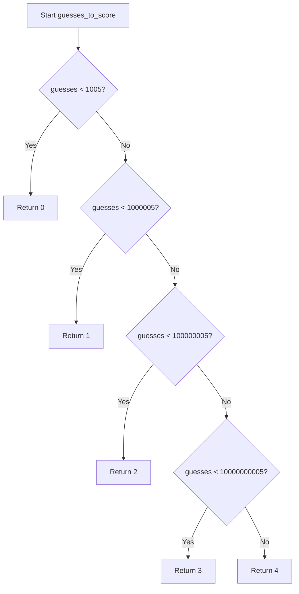

# `time_estimates.py`

## `zxcvbn.time_estimates.estimate_attack_times` · *function*

## Summary:
Calculates estimated time to crack a password under various attack scenarios using the number of guesses required.

## Description:
This function computes the time it would take to crack a password using different attack methods, including online attacks with and without throttling, and offline attacks with different hashing speeds. It serves as a core component in password strength estimation by translating guess counts into meaningful time estimates for security analysis.

The function is extracted into its own module to separate the time estimation logic from the core password strength calculation, allowing for cleaner modularization and easier testing of time-based computations independently.

## Args:
    guesses (int or float): The estimated number of guesses required to crack the password. Must be a non-negative number.

## Returns:
    dict: A dictionary containing three keys:
        - 'crack_times_seconds' (dict): Time estimates in seconds for each attack scenario
        - 'crack_times_display' (dict): Human-readable time estimates for each attack scenario  
        - 'score' (int): Security strength score (0-4) based on the number of guesses

## Raises:
    None explicitly raised by this function, though underlying helper functions may raise exceptions.

## Constraints:
    Preconditions:
        - Input `guesses` must be a numeric value (int or float)
        - Input `guesses` must be non-negative
    
    Postconditions:
        - Returns a dictionary with exactly three keys: 'crack_times_seconds', 'crack_times_display', and 'score'
        - All time estimates are positive numbers or zero
        - Score is always an integer in the range [0, 4]

## Side Effects:
    None

## Control Flow:
```mermaid
flowchart TD
    A[Start estimate_attack_times(guesses)] --> B[Calculate 4 attack scenarios in seconds]
    B --> C[online_throttling_100_per_hour = guesses / (100/3600)]
    C --> D[online_no_throttling_10_per_second = guesses / 10]
    D --> E[offline_slow_hashing_1e4_per_second = guesses / 1e4]
    E --> F[offline_fast_hashing_1e10_per_second = guesses / 1e10]
    F --> G[Create crack_times_seconds dict]
    G --> H[Convert seconds to display format for each scenario]
    H --> I[Call display_time() for each scenario]
    I --> J[Create crack_times_display dict]
    J --> K[Call guesses_to_score(guesses)]
    K --> L[Return result dict with all three components]
```

## Examples:
    >>> estimate_attack_times(1000)
    {
        'crack_times_seconds': {
            'online_throttling_100_per_hour': Decimal('0.36'),
            'online_no_throttling_10_per_second': Decimal('100.0'),
            'offline_slow_hashing_1e4_per_second': Decimal('0.1'),
            'offline_fast_hashing_1e10_per_second': Decimal('1e-7')
        },
        'crack_times_display': {
            'online_throttling_100_per_hour': '1 second',
            'online_no_throttling_10_per_second': '100 seconds',
            'offline_slow_hashing_1e4_per_second': 'less than a second',
            'offline_fast_hashing_1e10_per_second': 'less than a second'
        },
        'score': 1
    }

## `zxcvbn.time_estimates.guesses_to_score` · *function*

## Summary:
Converts a number of password guesses into a security strength score ranging from 0 to 4.

## Description:
Maps the number of guesses required to crack a password to a discrete security strength score. This function is used to categorize password strength based on brute-force guessability, where lower scores indicate stronger passwords.

## Args:
    guesses (float or int): The estimated number of guesses required to crack a password. Must be a non-negative number.

## Returns:
    int: A security strength score between 0 and 4, where:
        - 0: Very weak (less than 1,005 guesses)
        - 1: Weak (less than 1,000,005 guesses)  
        - 2: Medium (less than 100,000,005 guesses)
        - 3: Strong (less than 10,000,000,005 guesses)
        - 4: Very strong (10,000,000,005 guesses or more)

## Raises:
    None: This function does not raise any exceptions.

## Constraints:
    Preconditions:
        - The input `guesses` must be a numeric value (int or float)
        - The input `guesses` must be non-negative
    
    Postconditions:
        - The returned value is always an integer in the range [0, 4]
        - The function is deterministic for any given input

## Side Effects:
    None: This function has no side effects.

## Control Flow:


## Examples:
    >>> guesses_to_score(100)
    0
    >>> guesses_to_score(500000)
    1
    >>> guesses_to_score(50000000)
    2
    >>> guesses_to_score(5000000000)
    3
    >>> guesses_to_score(50000000000)
    4

## `zxcvbn.time_estimates.display_time` · *function*

## Summary:
Converts a time duration in seconds into a human-readable string representation.

## Description:
Formats a numeric time duration into a readable string, automatically selecting the appropriate time unit (seconds, minutes, hours, days, months, years, or centuries) based on the magnitude of the input value. This function is designed to provide intuitive time estimates for password strength calculations and similar applications.

## Args:
    seconds (float or int): The time duration in seconds to convert. Must be non-negative.

## Returns:
    str: A human-readable string representing the time duration. Possible return values include:
        - 'less than a second'
        - '<number> second(s)'
        - '<number> minute(s)'  
        - '<number> hour(s)'
        - '<number> day(s)'
        - '<number> month(s)'
        - '<number> year(s)'
        - 'centuries'

## Raises:
    None explicitly raised.

## Constraints:
    Preconditions:
        - Input `seconds` should be a non-negative number
    Postconditions:
        - Always returns a string describing the time duration
        - The returned string is properly pluralized when appropriate

## Side Effects:
    None

## Control Flow:
```mermaid
flowchart TD
    A[Start: display_time(seconds)] --> B{seconds < 1?}
    B -- Yes --> C[display_str = 'less than a second']
    B -- No --> D{seconds < 60?}
    D -- Yes --> E[base = round(seconds)]
    E --> F[display_str = '%s second' % base]
    D -- No --> G{seconds < 3600?}
    G -- Yes --> H[base = round(seconds / 60)]
    H --> I[display_str = '%s minute' % base]
    G -- No --> J{seconds < 86400?}
    J -- Yes --> K[base = round(seconds / 3600)]
    K --> L[display_str = '%s hour' % base]
    J -- No --> M{seconds < 2592000?}
    M -- Yes --> N[base = round(seconds / 86400)]
    N --> O[display_str = '%s day' % base]
    M -- No --> P{seconds < 31536000?}
    P -- Yes --> Q[base = round(seconds / 2592000)]
    Q --> R[display_str = '%s month' % base]
    P -- No --> S{seconds < 3153600000?}
    S -- Yes --> T[base = round(seconds / 31536000)]
    T --> U[display_str = '%s year' % base]
    S -- No --> V[display_str = 'centuries']
    V --> W[End]
    C --> W
    F --> W
    I --> W
    L --> W
    O --> W
    R --> W
    U --> W
```

## Examples:
    >>> display_time(0.5)
    'less than a second'
    >>> display_time(30)
    '30 seconds'
    >>> display_time(120)
    '2 minutes'
    >>> display_time(7200)
    '2 hours'
    >>> display_time(100000)
    '1 day'
    >>> display_time(5000000)
    '2 months'
    >>> display_time(500000000)
    '16 years'
    >>> display_time(10000000000)
    'centuries'

## `zxcvbn.time_estimates.float_to_decimal` · *function*

*No documentation generated.*

