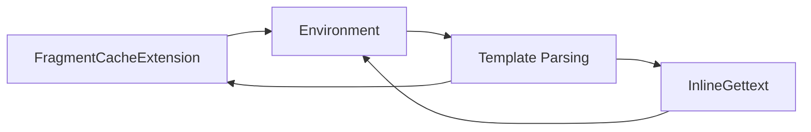

# `docs.examples`

## Tree:
examples/
├── cache_extension.py
└── inline_gettext_extension.py

## Role:
Provides reusable Jinja2 template extensions for common customization patterns including fragment caching and inline gettext translation.

## Description:
This module contains utility extensions for Jinja2 templating that demonstrate and implement common template customization patterns. These extensions are designed to be reusable components that enhance Jinja2's functionality for specific use cases like caching and internationalization.

The module serves as a collection of example implementations that showcase how to extend Jinja2's template processing capabilities. These extensions are intended for educational purposes and as reusable building blocks for real-world applications.

Primary consumers include:
- Template rendering systems that require fragment caching
- Internationalized web applications using Jinja2 templates
- Developers learning Jinja2 extension development patterns

The cohesion principle is based on shared functionality: both extensions modify Jinja2's template processing behavior to add new capabilities while maintaining compatibility with standard Jinja2 usage patterns.

## Components:
*   **FragmentCacheExtension**: Implements template fragment caching through the `` tag
*   **InlineGettext**: Converts inline gettext expressions into standard Jinja2 translation blocks

## Public API:
*   **FragmentCacheExtension**: Jinja2 extension class for template fragment caching
    *   Purpose: Enables caching of template fragments using `` tag
    *   Usage: Register with Jinja2 Environment extensions list and configure `fragment_cache` attribute
*   **InlineGettext**: Jinja2 extension class for inline gettext conversion
    *   Purpose: Transforms inline gettext expressions like `_("hello")` into proper Jinja2 translation blocks
    *   Usage: Register with Jinja2 Environment extensions list

## Dependencies:
*   Internal: None
*   External: 
    *   `jinja2` - Required for Jinja2 extension base classes, template parsing, and token stream processing
    *   `re` - Regular expressions for pattern matching in InlineGettext

## Constraints:
*   Callers must register extensions with a valid Jinja2 Environment instance
*   FragmentCacheExtension requires `environment.fragment_cache` to be properly configured with `get(key)` and `add(key, value, timeout)` methods
*   Thread-safety depends on the underlying cache implementation used with FragmentCacheExtension
*   InlineGettext requires proper token stream handling from Jinja2's template compilation process
*   FragmentCacheExtension requires `environment.fragment_cache_prefix` to be set for proper cache key generation

---

## Files

- [`cache_extension.py`](examples/cache_extension.md)
- [`inline_gettext_extension.py`](examples/inline_gettext_extension.md)

