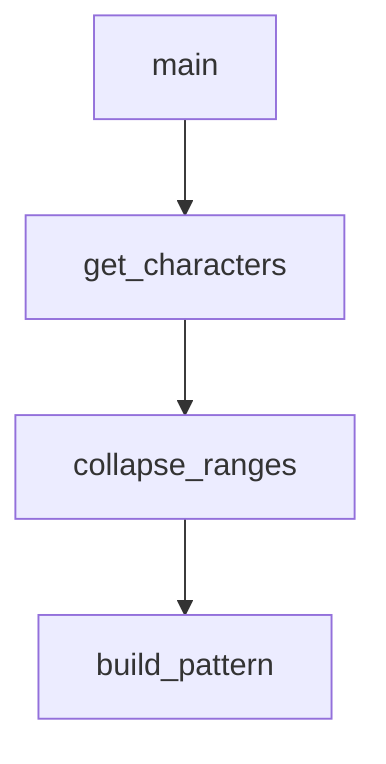

# `scripts`

## Tree:
    scripts/
    └── generate_identifier_pattern.py

## Role:
    Generates regex patterns for Python identifier validation by processing Unicode characters that extend identifier naming beyond ASCII characters.

## Description:
    This module provides functionality for creating optimized regex patterns used to validate Python identifiers. It specifically handles Unicode characters that are valid in Python identifiers but don't match standard word character patterns. The module is primarily used as a code generation script to update identifier validation patterns in the Jinja2 template engine.

    Primary consumers include:
    - Jinja2 template engine (src/jinja2/_identifier.py)
    - Build systems that regenerate identifier patterns
    - Development tools that require up-to-date identifier validation

    These components are grouped together because they work in concert to transform Unicode character data into efficient regex patterns for identifier validation, forming a complete pipeline from character collection to pattern generation.

## Components:
    - build_pattern(ranges: Iterable[Tuple[str, str]]) -> str
      Constructs a compact string representation of character ranges by simplifying single characters, consecutive pairs, and general ranges.
    - collapse_ranges(data: Iterable[str]) -> Generator[Tuple[str, str], None, None]
      Collapses consecutive characters in a sequence into inclusive ranges by grouping characters whose ASCII values differ by their positional indices.
    - get_characters() -> Generator[str, None, None]
      Generates Unicode characters that are valid in Python identifiers but are not classified as word characters.
    - main() -> None
      Generates a regex pattern for Python identifier validation by processing Unicode characters that extend identifier naming beyond ASCII characters.

## Public API:
    - build_pattern(ranges): Takes character pairs and returns a compact pattern string
    - collapse_ranges(data): Takes an iterable of characters and yields range tuples
    - get_characters(): Returns a generator of Unicode identifier characters
    - main(): Entry point that generates and writes the identifier pattern to a file

## Dependencies:
    - Internal: None
    - External: 
        - itertools (for groupby functionality in collapse_ranges)
        - re (for regex pattern matching in get_characters)
        - sys (for maxunicode access in get_characters)
        - os (for path manipulation in main)

## Constraints:
    - Callers must ensure the script is run from the correct directory structure
    - The target file path must be writable
    - Python's sys.maxunicode must be available for character enumeration
    - The module is designed to be run as a standalone script, not imported for runtime use

---

## Files

- [`generate_identifier_pattern.py`](scripts/generate_identifier_pattern.md)

