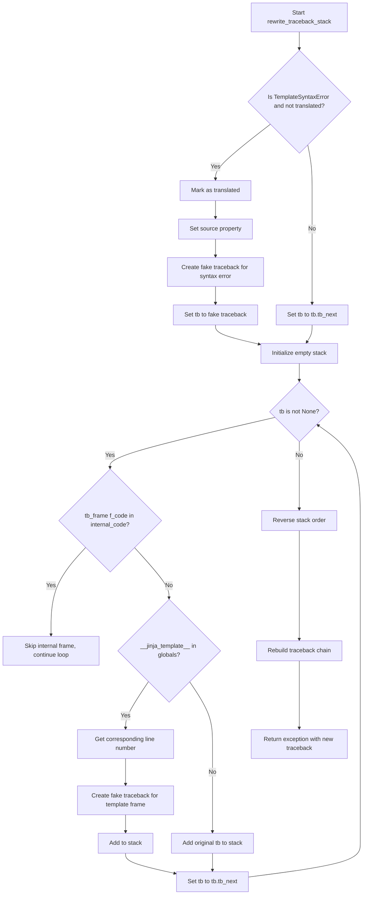

# `debug.py`

## `src.jinja2.debug.rewrite_traceback_stack` · *function*

## Summary:
Rewrites exception tracebacks to provide clearer debugging information for Jinja2 template errors by filtering internal frames and mapping template line numbers.

## Description:
This function processes exception tracebacks to enhance debugging experience for Jinja2 templates. It filters out internal Jinja2 implementation frames and maps template line numbers to their corresponding positions in the original template source. When a TemplateSyntaxError occurs, it marks the error as translated and creates a synthetic traceback pointing to the template location. For regular template execution errors, it reconstructs the traceback chain with proper template context information.

The function is typically called within exception handling routines to provide developers with more meaningful error messages that point directly to template source locations rather than internal implementation details.

## Args:
    source (Optional[str]): The source code of the template being processed, used to enhance debugging information for TemplateSyntaxError exceptions. Defaults to None.

## Returns:
    BaseException: The original exception with a rewritten traceback that provides clearer debugging context for template-related errors. The returned exception may have its 'translated' attribute set to True and 'source' attribute updated if it was a TemplateSyntaxError.

## Raises:
    None explicitly raised - but may propagate exceptions from underlying operations like fake_traceback creation or traceback manipulation.

## Constraints:
    Preconditions:
    - Must be called within an exception handler (i.e., sys.exc_info() must contain exception information)
    - The exception being processed should be a BaseException subclass
    - Template frames in the traceback should have "__jinja_template__" in their globals
    
    Postconditions:
    - Returns the same exception instance with an updated traceback chain
    - The returned traceback excludes internal Jinja2 implementation frames
    - Template line numbers are properly mapped to their original positions
    - TemplateSyntaxError exceptions have their 'translated' attribute set to True and 'source' attribute updated

## Side Effects:
    Modifies the original exception object by setting its 'translated' attribute to True and 'source' attribute to the provided source parameter if it's a TemplateSyntaxError. Also manipulates traceback objects to create a cleaner debugging experience.

## Control Flow:


## Examples:
    # Typical usage in template rendering error handling
    try:
        template.render(context)
    except Exception as e:
        # Rewrite traceback to provide better debugging info
        raise rewrite_traceback_stack(template.source) from e
    
    # Usage with TemplateSyntaxError specifically
    try:
        env.from_string("{{ invalid syntax")
    except TemplateSyntaxError as e:
        # This will mark the error as translated and enhance traceback
        raise rewrite_traceback_stack() from e

## `src.jinja2.debug.fake_traceback` · *function*

## Summary:
Creates a synthetic traceback for debugging Jinja2 template exceptions by simulating the execution context at a specific line in a template file.

## Description:
This function generates a fake traceback that allows developers to see template-specific debugging information when exceptions occur during template rendering. It constructs a synthetic execution environment that mimics the template's execution context, making it easier to identify where template errors originate.

The function is typically called when processing template exceptions to enhance debugging information by providing context about where in the template the error occurred. It's particularly useful in exception handling routines within Jinja2's debug infrastructure.

## Args:
    exc_value (BaseException): The original exception that occurred during template rendering
    tb (Optional[TracebackType]): The existing traceback from the template execution, or None if not available
    filename (str): The template filename where the error occurred
    lineno (int): The line number in the template where the error occurred

## Returns:
    TracebackType: A new traceback object that provides enhanced debugging context for template errors, pointing to the specific template location. The returned traceback is the next traceback in the chain after executing the synthetic code.

## Raises:
    None explicitly raised - but may raise exceptions during exec() if the synthetic code fails to execute

## Constraints:
    Preconditions:
    - exc_value must be a valid BaseException instance
    - filename must be a valid string representing a template file path
    - lineno must be a positive integer indicating a line in the template
    
    Postconditions:
    - Returns a valid TracebackType object that can be used for debugging
    - The returned traceback points to the correct template location and line number
    - The function preserves the original exception information in the traceback

## Side Effects:
    None - though internally uses sys.exc_info() to capture the traceback from exec()

## Control Flow:
```mermaid
flowchart TD
    A[Start fake_traceback] --> B{tb is not None?}
    B -- Yes --> C[Extract template locals]
    B -- No --> D[Initialize empty locals]
    C --> E[Remove __jinja_exception__ from locals]
    D --> E
    E --> F[Create globals dict with __name__, __file__, __jinja_exception__]
    F --> G[Compile synthetic code with raise statement]
    G --> H[Set location name based on function context]
    H --> I{tb is not None?}
    I -- Yes --> J[Get function name from tb]
    J --> K{Function is "root"?}
    K -- Yes --> L[Set location to "top-level template code"]
    K -- No --> M{Function starts with "block_"?}
    M -- Yes --> N[Set location to block name]
    M -- No --> O[Keep default "template"]
    L --> P
    N --> P
    O --> P
    P --> Q[Handle Python version compatibility for code object]
    Q --> R[Execute synthetic code with globals and locals]
    R --> S{Exception raised during exec?}
    S -- Yes --> T[Return sys.exc_info()[2].tb_next]
    S -- No --> T
    T --> U[End - return traceback]
```

## Examples:
    # Typical usage in template exception handling
    try:
        template.render(context)
    except Exception as e:
        fake_tb = fake_traceback(e, sys.exc_info()[2], "my_template.html", 42)
        # Use fake_tb for enhanced debugging information
        
    # In debug context where traceback is available
    if hasattr(exception, '__traceback__'):
        enhanced_tb = fake_traceback(exception, exception.__traceback__, "template.j2", 15)
        # Enhanced traceback for better debugging experience

## `src.jinja2.debug.get_template_locals` · *function*

## Summary:
Extracts and processes template local variables from runtime local mappings, merging context data with resolved local variable overrides.

## Description:
This function extracts template-local variables from a runtime locals mapping, primarily used in Jinja2 debugging contexts. It merges context data with local variables that follow the naming convention "l_<depth>_<name>", resolving variable scoping by keeping only the highest-depth version of each variable. The function separates context data from local variable overrides and properly handles variables marked as missing.

## Args:
    real_locals (Mapping[str, Any]): A mapping of local variables from template execution, potentially containing:
        - "context" key with a Context object for template context data
        - Local variables with names starting with "l_" followed by depth information (e.g., "l_0_var1", "l_1_var2")

## Returns:
    Dict[str, Any]: A dictionary containing merged template local variables including:
        - All context data (when context is present)
        - Resolved local variable overrides (highest depth version only)
        - Proper handling of variables marked as missing (removed from result)

## Raises:
    ValueError: When parsing local variable names fails (split operation on malformed names)

## Constraints:
    Preconditions:
    - real_locals parameter must be a mapping type supporting .get() and .items() methods
    - Local variables with "l_" prefix must follow the naming pattern "l_<integer>_<name>"
    
    Postconditions:
    - Returned dictionary contains merged context data and resolved local variable overrides
    - Variables marked as missing are removed from the result
    - Only the highest-depth version of each local variable is retained
    - Context data is copied to avoid mutation of original context

## Side Effects:
    None

## Control Flow:
```mermaid
flowchart TD
    A[Start get_template_locals] --> B{ctx exists in real_locals?}
    B -- Yes --> C[Get ctx.get_all().copy()]
    B -- No --> D[data = {}]
    C --> E[data assigned]
    D --> E
    E --> F[Initialize local_overrides]
    F --> G[Iterate real_locals.items()]
    G --> H{name starts with "l_" AND value is not missing?}
    H -- No --> I[Continue loop]
    H -- Yes --> J[Try split "l_XXX_name"]
    J --> K{ValueError raised?}
    K -- Yes --> I
    K -- No --> L[Parse depth and name]
    L --> M[Get current depth for name]
    M --> N{cur_depth < depth?}
    N -- Yes --> O[Update local_overrides[name]]
    N -- No --> P[Skip update]
    O --> P
    P --> Q[Process local_overrides]
    Q --> R[Apply or remove variables based on missing status]
    R --> S[Return data]
```

## Examples:
    # Basic usage with context
    locals_dict = {"context": template_context, "l_0_var1": "value1"}
    result = get_template_locals(locals_dict)
    # Returns dict with context data plus resolved local variables
    
    # Usage with local overrides (higher depth wins)
    locals_dict = {
        "context": template_context,
        "l_0_var1": "value1",
        "l_1_var1": "value2"
    }
    result = get_template_locals(locals_dict)
    # Returns dict with context data and var1 set to "value2" (higher depth)
    
    # Usage with missing variables
    locals_dict = {
        "context": template_context,
        "l_0_var1": "value1",
        "l_1_var2": missing  # missing sentinel indicates removal
    }
    result = get_template_locals(locals_dict)
    # Returns dict with context data, var1 set to "value1", and var2 removed

