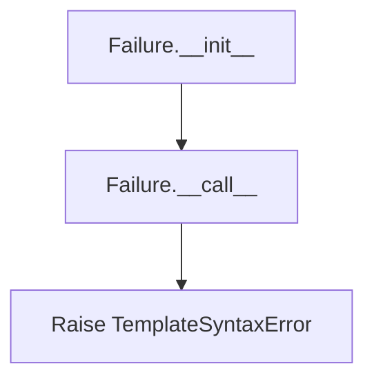
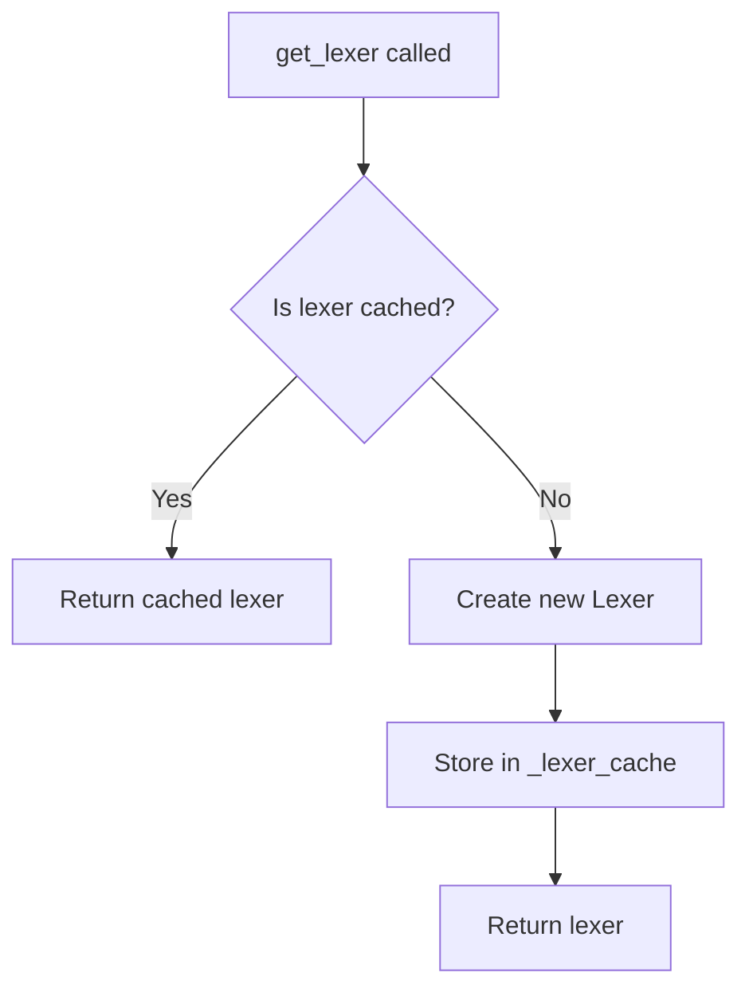
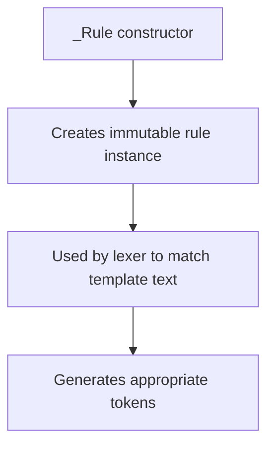
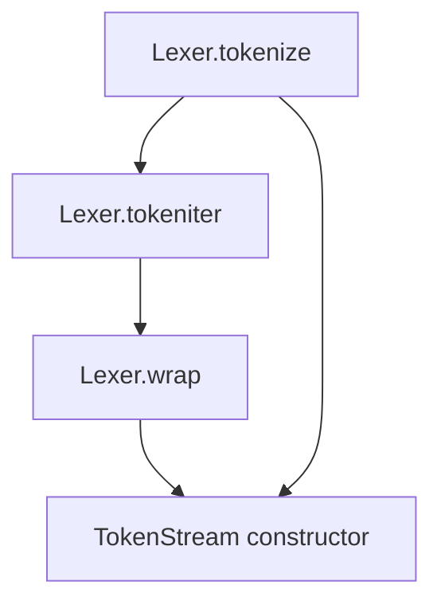

# `lexer.py`

## `src.jinja2.lexer._describe_token_type` · *function*

## Summary:
Converts internal token type identifiers into human-readable descriptive strings for debugging and error reporting.

## Description:
This utility function transforms internal token type constants into meaningful descriptions that help developers understand what kind of lexical token is being processed. It serves primarily for debugging and error message generation in the Jinja2 template lexer.

The function handles two categories of token types:
1. Special operators that require reverse mapping (via `reverse_operators`)
2. Standard token types that have predefined descriptive strings

## Args:
    token_type (str): The internal identifier for a token type, such as "TOKEN_COMMENT_BEGIN" or operator symbols.

## Returns:
    str: A human-readable description of the token type. For standard tokens, returns predefined descriptions like "begin of comment" or "template data / text". For unknown tokens, returns the original token_type unchanged.

## Raises:
    None explicitly raised by this function.

## Constraints:
    Preconditions:
    - The input `token_type` must be a string
    - The function assumes that `reverse_operators` and various token constants are properly defined in the module scope
    
    Postconditions:
    - Always returns a string value
    - For known token types, returns a descriptive string
    - For unknown token types, returns the original token_type unchanged

## Side Effects:
    None - This function is pure and has no side effects.

## Control Flow:
```mermaid
flowchart TD
    A[Start _describe_token_type] --> B{token_type in reverse_operators?}
    B -- Yes --> C[Return reverse_operators[token_type]]
    B -- No --> D[Lookup in token type dictionary]
    D --> E{Token found?}
    E -- Yes --> F[Return description]
    E -- No --> G[Return token_type]
```

## Examples:
    # For standard token types:
    _describe_token_type("TOKEN_COMMENT_BEGIN")  # Returns "begin of comment"
    _describe_token_type("TOKEN_DATA")           # Returns "template data / text"
    
    # For operator tokens:
    _describe_token_type("==")                   # Returns the reverse operator mapping if exists
    
    # For unknown tokens:
    _describe_token_type("UNKNOWN_TOKEN")        # Returns "UNKNOWN_TOKEN"
```

## `src.jinja2.lexer.describe_token` · *function*

## Summary:
Returns a human-readable description of a token for debugging and error reporting purposes.

## Description:
This function provides a descriptive representation of a token that helps with debugging and error messages in the Jinja2 template lexer. When the token is of type TOKEN_NAME (typically representing identifiers or names), it returns the token's raw value directly. For all other token types, it delegates to the internal helper function `_describe_token_type` to generate a descriptive string.

The function serves as a bridge between internal token representations and user-friendly descriptions, separating concerns between raw value presentation for names and structured description generation for other token types.

## Args:
    token (Token): A token object containing line number, type, and value information

## Returns:
    str: For TOKEN_NAME tokens, returns the token's value directly; for other tokens, returns a descriptive string from _describe_token_type

## Raises:
    None explicitly raised by this function

## Constraints:
    Preconditions:
    - The input token must be a valid Token instance with lineno, type, and value attributes
    - The token.type must be a string
    - TOKEN_NAME constant must be defined in the module scope
    
    Postconditions:
    - Always returns a string value
    - For TOKEN_NAME tokens, the returned value matches token.value
    - For other tokens, the returned value comes from _describe_token_type

## Side Effects:
    None - This function is pure and has no side effects.

## Control Flow:
```mermaid
flowchart TD
    A[Start describe_token] --> B{token.type == TOKEN_NAME?}
    B -- Yes --> C[Return token.value]
    B -- No --> D[Return _describe_token_type(token.type)]
```

## `src.jinja2.lexer.describe_token_expr` · *function*

*No documentation generated.*

## `src.jinja2.lexer.count_newlines` · *function*

## Summary:
Counts the number of newline characters in a given string using a predefined regular expression pattern.

## Description:
This function counts newline characters in a string by applying a compiled regular expression pattern stored in the global variable `newline_re`. It is used within the Jinja2 template lexer to process text content and track line numbers during parsing.

The function serves as a utility for newline counting, providing a clean abstraction for this operation within the lexer module.

## Args:
    value (str): The input string to count newline characters in. This parameter must be a string type as indicated by the type annotation.

## Returns:
    int: The total number of newline characters found in the input string. Returns 0 if no newlines are present or if the input string is empty.

## Raises:
    TypeError: If the input `value` is not a string type, or if `newline_re.findall()` raises a TypeError when applied to the input. The exact conditions depend on the implementation of the global `newline_re` pattern.

## Constraints:
    Preconditions:
    - The input `value` must be a string type
    - The global variable `newline_re` must be a compiled regular expression pattern that supports the `findall()` method
    
    Postconditions:
    - The returned integer is always non-negative
    - The function returns 0 for empty strings or strings without newlines

## Side Effects:
    None: This function has no side effects. It performs only pure computation and does not modify any external state.

## Control Flow:
```mermaid
flowchart TD
    A[Start count_newlines] --> B[Call newline_re.findall(value)]
    B --> C[Calculate length of results]
    C --> D[Return count]
```

## Examples:
    >>> count_newlines("Hello\\nWorld")
    1
    >>> count_newlines("Line1\\nLine2\\nLine3")
    2
    >>> count_newlines("No newlines here")
    0
    >>> count_newlines("")
    0
```

## `src.jinja2.lexer.compile_rules` · *function*

## Summary:
Compiles regular expression rules for tokenizing Jinja2 template syntax elements.

## Description:
Constructs a list of regex patterns used by the Jinja2 lexer to identify template syntax elements such as comments, blocks, variables, line statements, and line comments. The function builds these patterns based on configuration settings in the Environment object and returns them in priority order, ensuring longer patterns are matched first to avoid conflicts.

## Args:
    environment (Environment): Configuration object containing template syntax delimiters and prefixes for various template elements.

## Returns:
    list[tuple[str, str]]: List of tuples containing (token_type, regex_pattern) for template element recognition, sorted by pattern length in descending order to ensure proper matching precedence.

## Raises:
    None explicitly raised

## Constraints:
    Preconditions:
    - The environment parameter must be a valid Environment instance
    - Environment must have comment_start_string, block_start_string, and variable_start_string attributes
    - Environment may optionally have line_statement_prefix and line_comment_prefix attributes
    
    Postconditions:
    - Returns a list of tuples where each tuple contains a token type string and a regex pattern string
    - The returned list is sorted by pattern length in descending order to ensure proper matching precedence
    - All returned regex patterns are properly escaped to handle special regex characters

## Side Effects:
    None

## Control Flow:
```mermaid
flowchart TD
    A[Start compile_rules] --> B[Initialize basic rules for comments, blocks, variables]
    B --> C{environment.line_statement_prefix != None?}
    C -- Yes --> D[Add line statement rule with anchored pattern]
    C -- No --> E[Skip line statement rule]
    D --> F[Add line comment rule if prefix exists]
    E --> F
    F --> G{environment.line_comment_prefix != None?}
    G -- Yes --> H[Add line comment rule with anchored pattern]
    G -- No --> I[Continue to sorting]
    H --> I
    I --> J[Sort rules by length (descending)]
    J --> K[Remove length component from each rule]
    K --> L[Return compiled rules list]
```

## Examples:
    # Basic usage with default environment
    env = Environment()
    rules = compile_rules(env)
    # Returns list of tuples like [(TOKEN_COMMENT_BEGIN, r'\{#'), (TOKEN_BLOCK_BEGIN, r'\{%), ...]
    
    # With custom delimiters
    env = Environment(
        comment_start_string='{#',
        block_start_string='{%',
        variable_start_string='{{'
    )
    rules = compile_rules(env)
    # Returns properly escaped regex patterns for the custom delimiters
```

## `src.jinja2.lexer.Failure` · *class*

## Summary:
A callable error factory that creates and raises template syntax errors with line number and filename context.

## Description:
The Failure class serves as a factory for creating error-raising functions that can be used during Jinja2 template lexing and parsing. It encapsulates an error message and error class, allowing for deferred error creation with proper line number and filename information. This pattern enables clean separation of error detection from error raising, making the lexer more modular and easier to test.

## State:
- message: str - The error message to be included in raised exceptions
- error_class: Type[TemplateSyntaxError] - The exception class to raise (defaults to TemplateSyntaxError)

## Lifecycle:
- Creation: Instantiate with an error message and optional error class
- Usage: Call the instance with lineno and filename arguments to raise the error
- Destruction: No explicit cleanup required as it's a simple factory class

## Method Map:


## Raises:
- TemplateSyntaxError (or subclass): Raised when the callable is invoked with lineno and filename parameters

## Example:
```python
# Create an error factory
error_factory = Failure("Unexpected end of template", TemplateSyntaxError)

# Later during lexing, raise the error with context
error_factory(15, "template.html")
# Raises: TemplateSyntaxError("Unexpected end of template", 15, "template.html")
```

### `src.jinja2.lexer.Failure.__init__` · *method*

## Summary:
Initializes a Failure object with an error message and error class for later exception raising.

## Description:
Constructs a Failure instance that can later be called to raise a TemplateSyntaxError with the specified message, line number, and filename. This design allows for deferred exception creation while maintaining the ability to customize the exception type.

## Args:
    message (str): The error message to be included in the raised exception.
    cls (Type[TemplateSyntaxError], optional): The exception class to raise. Defaults to TemplateSyntaxError.

## Returns:
    None: This method does not return a value.

## Raises:
    None: This method does not raise exceptions itself.

## State Changes:
    Attributes READ: None
    Attributes WRITTEN: 
        - self.message: Stores the error message for later use
        - self.error_class: Stores the exception class to be raised

## Constraints:
    Preconditions: 
        - message must be a string
        - cls must be a subclass of TemplateSyntaxError or compatible exception class
    Postconditions: 
        - self.message is set to the provided message
        - self.error_class is set to the provided class (or TemplateSyntaxError by default)

## Side Effects:
    None: This method performs no I/O operations or external service calls.

### `src.jinja2.lexer.Failure.__call__` · *method*

## Summary:
Raises a template syntax error with the stored message at the specified line number and file location.

## Description:
This method serves as the callable interface for the Failure class, enabling it to raise template syntax errors with proper contextual information. It is typically invoked during lexical analysis when invalid syntax is encountered, providing detailed error reporting with line numbers and filenames.

## Args:
    lineno (int): The line number in the template where the error occurred.
    filename (str): The name of the template file where the error occurred.

## Returns:
    Never returns normally (te.NoReturn): This method always raises an exception and never completes execution.

## Raises:
    TemplateSyntaxError: Raised with the stored error message, line number, and filename from the Failure instance.

## State Changes:
    Attributes READ: self.message, self.error_class
    Attributes WRITTEN: None

## Constraints:
    Preconditions: The Failure instance must have been initialized with a valid message and error class.
    Postconditions: The method always raises an exception and never returns control to the caller.

## Side Effects:
    None: This method only raises exceptions and does not perform any I/O or mutate external state.

## `src.jinja2.lexer.Token` · *class*

## Summary:
Represents a lexical token produced by Jinja2's template lexer, containing position information, token type, and textual value.

## Description:
The Token class serves as a fundamental data structure in Jinja2's template processing pipeline, encapsulating the essential information about each lexical element encountered during template parsing. It is used throughout the Jinja2 lexer to represent individual components of templates such as variables, literals, operators, and control structures.

Tokens are created by the lexer and passed to the parser for further processing. The class provides utility methods for pattern matching against token types and values, making it easier to work with tokens in template analysis and transformation scenarios.

## State:
- lineno: int - The line number in the source template where this token appears (1-indexed)
- type: str - The category or classification of the token (e.g., 'name', 'number', 'operator')
- value: str - The actual textual content of the token as it appears in the source template

The Token class maintains immutability through its NamedTuple inheritance, ensuring that once created, token properties cannot be modified.

## Lifecycle:
- Creation: Tokens are instantiated by the Jinja2 lexer during template parsing, typically through factory methods or direct construction
- Usage: Once created, tokens are typically passed through the parsing pipeline where their test() and test_any() methods are used for pattern matching
- Destruction: No explicit cleanup required as tokens are immutable and managed by Python's garbage collection

## Method Map:
```mermaid
flowchart TD
    A[Token Creation] --> B[Token.__str__()]
    A --> C[Token.test()]
    A --> D[Token.test_any()]
    C --> E[Pattern Matching]
    D --> E
    B --> F[describe_token()]
```

## Raises:
- None explicitly raised by Token constructor or methods
- The describe_token function used in __str__ may raise exceptions if passed invalid token objects, though this is handled at a higher level

## Example:
```python
# Creating a token
token = Token(lineno=5, type='name', value='username')

# Using string representation
print(str(token))  # Uses describe_token for human-readable format

# Pattern matching
if token.test('name'):
    print("This is a name token")

if token.test_any('name', 'number', 'string'):
    print("This token matches one of the expected types")
```

### `src.jinja2.lexer.Token.__str__` · *method*

## Summary:
Returns a human-readable string representation of the token for debugging and error reporting.

## Description:
Provides a descriptive string representation of a Token instance that aids in debugging and error message generation. This method delegates to the `describe_token` function which formats the token information in a user-friendly way. The string representation is particularly useful when logging token information or displaying parsing errors to developers.

This method exists as a standard Python convention to enable intuitive string conversion of Token objects, making them easier to work with in debugging scenarios and error reporting contexts.

## Args:
    None - This is a method with no parameters beyond `self`

## Returns:
    str: A human-readable description of the token that includes its type and value information, formatted for debugging purposes

## Raises:
    None - This method does not raise exceptions directly

## State Changes:
    Attributes READ: lineno, type, value (all accessed via the NamedTuple structure)
    Attributes WRITTEN: None - this method is read-only

## Constraints:
    Preconditions:
    - The Token instance must be properly initialized with lineno, type, and value attributes
    - The token's type attribute must be a string
    - The token's value attribute should be a string or convertible to string
    
    Postconditions:
    - Always returns a string value
    - The returned string provides meaningful information about the token's type and value

## Side Effects:
    None - This method is pure and has no side effects beyond returning a string representation

### `src.jinja2.lexer.Token.test` · *method*

## Summary:
Tests whether the token matches a given expression pattern, supporting both direct type matching and colon-separated type-value pattern matching.

## Description:
Checks if the current token matches the specified expression pattern. This method supports two matching modes:
1. Direct type matching: when expr equals the token's type
2. Pattern matching: when expr contains a colon separator, matching against [token.type, token.value]

The test method is commonly used during template parsing to identify specific token types or combinations of token types and values. It's typically called by the test_any method when checking against multiple possible patterns.

## Args:
    expr (str): Expression to match against. Can be either:
        - A simple type string that exactly matches self.type
        - A colon-separated string "type:value" that matches [self.type, self.value]

## Returns:
    bool: True if the token matches the expression pattern, False otherwise

## Raises:
    None explicitly raised

## State Changes:
    Attributes READ: self.type, self.value
    Attributes WRITTEN: None

## Constraints:
    Preconditions:
    - The expr parameter must be a string
    - The token must have valid type and value attributes
    
    Postconditions:
    - Returns a boolean value indicating match result
    - Does not modify the token's state

## Side Effects:
    None - This method is pure and has no side effects

### `src.jinja2.lexer.Token.test_any` · *method*

## Summary:
Tests if the token matches any of the provided expression patterns.

## Description:
Checks whether the current token matches any of the given expression patterns by evaluating each pattern against the token's type and value. This method is used in the Jinja2 template lexer to efficiently determine token types during parsing operations.

The method leverages the existing `test` method of the Token class to perform individual pattern matching, making it a convenient way to check multiple possible token types or patterns in a single call.

## Args:
    *iterable (str): Variable-length argument list of expression patterns to test against the token. Each pattern can be:
        - A simple token type string (e.g., "NAME", "NUMBER")
        - A type-value pair in the format "type:value" (e.g., "NAME:foo")

## Returns:
    bool: True if the token matches any of the provided expressions, False otherwise.

## Raises:
    None explicitly raised by this method.

## State Changes:
    Attributes READ: 
    - self.type: The type of the current token being tested
    - self.value: The value of the current token being tested
    
    Attributes WRITTEN: None

## Constraints:
    Preconditions:
    - The token object must be properly initialized with lineno, type, and value attributes
    - All arguments in iterable must be strings
    - The token's type attribute must be a string
    
    Postconditions:
    - Returns a boolean value indicating match status
    - Does not modify the token's state
    
## Side Effects:
    None - This method is pure and has no side effects beyond evaluating the test conditions.

## `src.jinja2.lexer.TokenStreamIterator` · *class*

## Summary:
An iterator that traverses a token stream, yielding individual tokens one at a time until reaching the end-of-file marker.

## Description:
The TokenStreamIterator implements Python's iterator protocol to enable sequential traversal of tokens from a TokenStream. It is designed to be used internally by the Jinja2 template lexer to process tokens one by one in a memory-efficient manner.

This iterator advances through the token stream by calling next() on the underlying TokenStream, and automatically closes the stream when the end-of-file marker (TOKEN_EOF) is encountered. The iterator should not be instantiated directly by user code but is typically created by calling iter() on a TokenStream instance.

## State:
- stream: TokenStream instance containing the tokens to iterate over
- The iterator maintains no additional state beyond referencing the token stream

## Lifecycle:
- Creation: Instantiated with a TokenStream object, typically by TokenStream.__iter__() or via iter() built-in
- Usage: Called repeatedly with next() or via for-loops to consume tokens sequentially
- Destruction: Automatically cleaned up when StopIteration is raised or when the iterator goes out of scope

## Method Map:
```mermaid
graph TD
    A[TokenStreamIterator] --> B[__iter__]
    B --> C[Returns self]
    A --> D[__next__]
    D --> E[Get current token from stream]
    E --> F{Is current token TOKEN_EOF?}
    F -->|Yes| G[Close stream]
    F -->|No| H[Advance stream with next()]
    H --> I[Return token]
    G --> J[StopIteration]
    I --> J
```

## Raises:
- StopIteration: Raised when the end of the token stream is reached (when current token type equals TOKEN_EOF)

## Example:
```python
# Typical usage with for loop (recommended approach)
for token in token_stream:
    print(f"Token type: {token.type}, value: {token.value}")

# Manual iteration (less common)
iterator = iter(token_stream)
try:
    while True:
        token = next(iterator)
        print(f"Token type: {token.type}, value: {token.value}")
except StopIteration:
    print("End of token stream reached")

# The iterator is automatically closed when exhausted
```

### `src.jinja2.lexer.TokenStreamIterator.__init__` · *method*

## Summary:
Initializes a TokenStreamIterator with a token stream to iterate over.

## Description:
Configures the iterator to traverse tokens from the provided TokenStream. This method establishes the relationship between the iterator and its underlying token source, enabling sequential access to tokens during template parsing operations.

## Args:
    stream (TokenStream): The token stream to iterate over. Must be a valid TokenStream instance containing tokens to be processed.

## Returns:
    None: This method does not return a value.

## Raises:
    None: This method does not explicitly raise exceptions.

## State Changes:
    Attributes READ: None
    Attributes WRITTEN: self.stream - stores reference to the provided TokenStream instance

## Constraints:
    Preconditions: The stream parameter must be a valid TokenStream instance
    Postconditions: The iterator will be initialized to work with the specified token stream

## Side Effects:
    None: This method performs no I/O operations or external service calls. It only stores a reference to the provided stream object.

### `src.jinja2.lexer.TokenStreamIterator.__iter__` · *method*

## Summary:
Returns the iterator object itself, enabling the TokenStreamIterator to function as a Python iterator.

## Description:
Implements the Python iterator protocol by returning the iterator instance itself. This method allows TokenStreamIterator instances to be used in for-loops and other iteration contexts. When called, it simply returns `self`, making the object iterable according to Python's standard iterator interface.

The TokenStreamIterator class is part of Jinja2's lexical analysis pipeline, where it provides iteration over tokens generated from template text. This implementation enables seamless integration with Python's iteration constructs while maintaining the internal state management required for token streaming.

## Args:
    None

## Returns:
    TokenStreamIterator: The iterator instance itself, allowing for method chaining and iteration.

## Raises:
    None

## State Changes:
    Attributes READ: None
    Attributes WRITTEN: None

## Constraints:
    Preconditions: The TokenStreamIterator must be properly initialized with a valid TokenStream
    Postconditions: The returned object is identical to the calling instance, satisfying Python's iterator protocol

## Side Effects:
    None

### `src.jinja2.lexer.TokenStreamIterator.__next__` · *method*

## Summary:
Retrieves the next token from the token stream and advances the iterator position.

## Description:
Implements the iterator protocol's `__next__` method for `TokenStreamIterator`. This method fetches the current token from the underlying token stream, checks if it's an end-of-file marker, and advances the stream to the next token before returning the current one.

This method is part of the standard iterator protocol and is automatically called by Python's iteration mechanisms (like `for` loops and `next()` function). It handles the end-of-stream condition by raising `StopIteration` when encountering a `TOKEN_EOF`.

## Args:
    None - This is an instance method with no parameters beyond `self`.

## Returns:
    Token: The current token from the token stream, which will be of type `TOKEN_EOF` when the end of the stream is reached.

## Raises:
    StopIteration: Raised when the current token is of type `TOKEN_EOF`, signaling the end of the token stream.

## State Changes:
    Attributes READ: 
    - self.stream.current: The current token being processed
    - self.stream: The token stream being iterated over
    
    Attributes WRITTEN:
    - self.stream.current: Updated to point to the next token in the stream

## Constraints:
    Preconditions:
    - The `self.stream` must be a valid `TokenStream` instance
    - The `self.stream.current` must be a valid `Token` instance
    - The `self.stream` must not be closed when the method is called
    
    Postconditions:
    - The method advances the stream position by one token
    - If the current token is `TOKEN_EOF`, the stream is closed and `StopIteration` is raised
    - The returned token is always the token that was previously current before advancing

## Side Effects:
    - Mutates the internal state of `self.stream` by advancing its position
    - May close the token stream when reaching end-of-file
    - No external I/O operations or service calls

## `src.jinja2.lexer.TokenStream` · *class*

## Summary:
A stream-based container for managing an ordered sequence of lexical tokens during Jinja2 template processing, providing methods for sequential iteration, token lookahead, and pattern matching.

## Description:
The TokenStream class serves as a fundamental abstraction in Jinja2's template lexer, managing an ordered sequence of Token objects that represent the lexical elements of a template. It enables efficient sequential processing of tokens while supporting advanced operations like token pushing/popping, lookahead, and pattern-based matching.

This class is typically instantiated by the Jinja2 lexer during template parsing and is used internally by the parsing pipeline. It provides a clean interface for consuming tokens in a controlled manner, with support for backtracking through the push/pop mechanism and robust error handling for unexpected token sequences.

## State:
- _iter: Iterator over the original token generator, used to fetch new tokens when needed
- _pushed: Deque of previously consumed tokens that can be "pushed back" for reprocessing
- name: Optional string identifier for the template being processed
- filename: Optional string path to the template file
- closed: Boolean flag indicating whether the stream has been closed
- current: Current Token object being examined or consumed

## Lifecycle:
- Creation: Instantiated with a token generator and optional name/filename metadata
- Usage: Typically accessed through iteration or by calling next() to advance through tokens
- Destruction: Automatically closed when exhausted or explicitly via close() method

## Method Map:
```mermaid
flowchart TD
    A[TokenStream.__init__] --> B[Initialize internal state]
    B --> C[Set current to initial token]
    C --> D[Call next() to prime stream]
    
    E[TokenStream.__iter__] --> F[Return TokenStreamIterator]
    
    G[TokenStream.__next__] --> H{Are pushed tokens available?}
    H -->|Yes| I[Pop from _pushed deque]
    H -->|No| J{Is current token EOF?}
    J -->|No| K[Fetch next from _iter]
    K --> L{StopIteration?}
    L -->|Yes| M[Call close()]
    J -->|Yes| N[Return current token]
    
    O[TokenStream.push] --> P[Append token to _pushed deque]
    
    Q[TokenStream.look] --> R[Call next()]
    R --> S[Save current token]
    S --> T[Push saved token back]
    T --> U[Restore old token]
    U --> V[Return saved token]
    
    W[TokenStream.skip] --> X[Call next() n times]
    
    Y[TokenStream.next_if] --> Z{Does current match expr?}
    Z -->|Yes| AA[Call next()]
    Z -->|No| AB[Return None]
    
    AC[TokenStream.expect] --> AD{Does current match expr?}
    AD -->|No| AE[Throw TemplateSyntaxError]
    AD -->|Yes| AF[Call next()]
```

## Raises:
- TemplateSyntaxError: Raised by expect() method when the current token doesn't match the expected pattern and the stream has reached end-of-file
- TemplateSyntaxError: Raised by expect() method when the current token doesn't match the expected pattern but stream hasn't reached end-of-file

## Example:
```python
# Create a token stream (typically done internally by Jinja2)
tokens = [Token(1, 'name', 'variable'), Token(1, 'operator', '='), Token(1, 'number', '42')]
stream = TokenStream(tokens, 'template_name', 'template.html')

# Iterate through tokens
for token in stream:
    print(f"Token: {token.type} = '{token.value}'")

# Or manually consume tokens
token1 = next(stream)  # Gets first token
token2 = stream.next_if('operator')  # Gets operator if present
stream.skip(2)  # Skip next 2 tokens
lookahead = stream.look()  # Peek at next token without consuming it
stream.push(token1)  # Push token back for reprocessing

# Expect specific tokens
try:
    expected_token = stream.expect('name')
except TemplateSyntaxError as e:
    print(f"Parsing error: {e}")
```

### `src.jinja2.lexer.TokenStream.__init__` · *method*

## Summary:
Initializes a TokenStream object with a token generator, name, and filename, preparing it for token iteration.

## Description:
The TokenStream.__init__ method sets up the internal state of a token stream by establishing the underlying token generator, initializing tracking structures, and positioning the stream at the first token. This method prepares the stream for subsequent operations like iteration, token pushing, and lookahead.

The method creates an iterator from the provided token generator, initializes an empty deque for temporarily pushed tokens, stores the template name and filename for error reporting, marks the stream as not closed, and positions the current token to a special initial token before advancing to the first real token.

## Args:
    generator (t.Iterable[Token]): An iterable producing Token objects that form the token stream
    name (t.Optional[str]): Name of the template for error reporting purposes, or None if not specified
    filename (t.Optional[str]): Filename of the template for error reporting purposes, or None if not specified

## Returns:
    None: This method initializes the object and returns nothing

## Raises:
    None: This method does not explicitly raise exceptions during initialization

## State Changes:
    Attributes READ: None
    Attributes WRITTEN: 
    - self._iter: Set to iter(generator) to create an iterator from the token generator
    - self._pushed: Initialized as an empty deque for temporary token storage
    - self.name: Set to the provided name parameter
    - self.filename: Set to the provided filename parameter
    - self.closed: Set to False to indicate the stream is open
    - self.current: Set to a Token(1, TOKEN_INITIAL, "") and then advanced via next(self)

## Constraints:
    Preconditions:
    - The generator parameter must be iterable over Token objects
    - The Token class must be properly defined in the module scope
    - TOKEN_INITIAL must be defined as a valid token type constant
    
    Postconditions:
    - self._iter contains an iterator over the provided token generator
    - self._pushed is initialized as an empty deque
    - self.name and self.filename are set to the provided values
    - self.closed is False
    - self.current is positioned at the first actual token (after the initial token)

## Side Effects:
    None: This method performs no I/O operations or external service calls. It only initializes internal object state.

### `src.jinja2.lexer.TokenStream.__iter__` · *method*

## Summary:
Makes the token stream iterable by returning an iterator over its tokens.

## Description:
Enables the TokenStream class to be used in Python iteration contexts such as for-loops and comprehensions. This method implements Python's iterator protocol by creating and returning a TokenStreamIterator instance that can traverse the token stream sequentially.

The method is called automatically by Python's built-in `iter()` function and `for` loop constructs when iterating over a TokenStream. It does not perform any token processing itself but delegates that responsibility to the returned iterator.

## Args:
    None - This is an instance method with no parameters beyond `self`.

## Returns:
    TokenStreamIterator: An iterator object that can be used to traverse the token stream sequentially, yielding individual tokens one at a time.

## Raises:
    None - This method does not raise exceptions directly.

## State Changes:
    Attributes READ:
    - self: The TokenStream instance being made iterable
    
    Attributes WRITTEN:
    - None - This method does not modify any attributes of the TokenStream instance.

## Constraints:
    Preconditions:
    - The TokenStream instance must be properly initialized with a token generator
    - The TokenStream must not be in an invalid state
    
    Postconditions:
    - The returned TokenStreamIterator is ready to traverse the token stream
    - The TokenStream remains unchanged after this operation

## Side Effects:
    None - This method performs no I/O operations or external service calls. It only creates and returns an iterator object.

### `src.jinja2.lexer.TokenStream.__bool__` · *method*

## Summary:
Returns whether the token stream contains more tokens to process, indicating if iteration can continue.

## Description:
Determines if the token stream is not exhausted by checking if there are either pushed-back tokens waiting to be consumed or if the current token is not the end-of-file marker. This method enables the token stream to be used in boolean contexts, such as while loops or conditional statements, to control iteration over tokens.

The method is called by Python's built-in `bool()` function and when the token stream is evaluated in a boolean context (e.g., `if token_stream:`).

## Args:
    None

## Returns:
    bool: True if the stream has more tokens available for consumption, False if the stream is exhausted.

## Raises:
    None

## State Changes:
    Attributes READ: 
    - self._pushed: deque of pushed-back tokens
    - self.current: current Token object being processed
    - self.current.type: type identifier of the current token

## Constraints:
    Preconditions:
    - The TokenStream instance must be properly initialized
    - self.current must be a valid Token object
    
    Postconditions:
    - The method does not modify any state of the TokenStream object
    - The return value accurately reflects the availability of tokens

## Side Effects:
    None

### `src.jinja2.lexer.TokenStream.eos` · *method*

## Summary:
Returns whether the token stream has reached its end, indicating no more tokens are available for processing.

## Description:
The `eos` property provides a convenient way to check if the token stream has been exhausted. It returns `True` when there are no more tokens available to process, and `False` when tokens remain in the stream. This property is implemented as a simple boolean negation of the `TokenStream`'s truthiness evaluation, making it a clean and efficient way to detect end-of-stream conditions during template parsing.

The property is commonly used in parsing loops and conditional logic to determine when to stop consuming tokens from the stream. It's particularly useful in template parsing contexts where the parser needs to know when it has processed all available tokens.

## Args:
    None - This is a property with no parameters.

## Returns:
    bool: `True` if the token stream is at end-of-stream (no more tokens available), `False` otherwise.

## Raises:
    None - This property does not raise any exceptions.

## State Changes:
    Attributes READ:
    - self._pushed: Checks if there are any tokens pushed back onto the stream
    - self.current: Examines the current token to determine if it's an EOF token
    - self.closed: Implicitly checked through the `__bool__` method implementation

    Attributes WRITTEN:
    - None - This property does not modify any attributes.

## Constraints:
    Preconditions:
    - The TokenStream instance must be properly initialized
    - The current token must be a valid Token instance
    
    Postconditions:
    - The method returns a boolean value indicating stream exhaustion status
    - The stream state remains unchanged after the check

## Side Effects:
    None - This property performs no I/O operations or external service calls. It only evaluates the internal state of the token stream.

### `src.jinja2.lexer.TokenStream.look` · *method*

## Summary:
Peeks at the next token in the stream without consuming it, allowing lookahead functionality for parsing decisions.

## Description:
The `look` method implements a peek operation that examines the next token in the token stream without advancing the stream position. This is commonly used in parsers to make lookahead decisions without consuming tokens prematurely. The method temporarily saves the current token, advances to the next token, restores the saved token to the stream, and returns the token that would have been consumed.

This method is particularly useful in grammar parsing where the parser needs to examine upcoming tokens to determine which production rule to apply, without actually consuming those tokens.

## Args:
    None - This is an instance method with no parameters beyond `self`.

## Returns:
    Token: The next token in the stream, which becomes the current token after the operation completes.

## Raises:
    StopIteration: May be raised indirectly when the underlying token generator is exhausted and `next(self)` attempts to advance beyond EOF.

## State Changes:
    Attributes READ:
    - self.current: Current token being examined
    - self._pushed: Queue of temporarily pushed-back tokens
    - self._iter: Iterator over the underlying token generator
    
    Attributes WRITTEN:
    - self.current: Updated to the token that was previously current
    - self._pushed: Modified by pushing the current token back

## Constraints:
    Preconditions:
    - The TokenStream instance must be properly initialized with a token generator
    - The underlying token generator must be valid and iterable
    - The current token must be a valid Token instance
    
    Postconditions:
    - The stream position remains unchanged (no token is consumed)
    - The returned token is the next token in the sequence
    - The current token pointer is restored to its original value

## Side Effects:
    None - This method performs no I/O operations or external service calls. It only manipulates internal state and returns tokens.

### `src.jinja2.lexer.TokenStream.skip` · *method*

## Summary:
Advances the token stream by skipping a specified number of tokens without returning them.

## Description:
The `skip` method advances the token stream position by consuming and discarding a specified number of tokens. This is commonly used in template parsing to efficiently move past unwanted or irrelevant tokens without needing to process them individually. The method is particularly useful when parsing constructs where certain tokens are known to be ignorable or when implementing lookahead mechanisms.

This method is part of the TokenStream class which manages an iterator over template tokens, providing various utility methods for parsing operations. The skip functionality is essential for efficient template parsing where tokens need to be consumed without being processed.

## Args:
    n (int): Number of tokens to skip. Defaults to 1. Must be a non-negative integer.

## Returns:
    None: This method does not return any value.

## Raises:
    StopIteration: May be raised indirectly when attempting to skip beyond the end of the token stream, causing the underlying token generator to be exhausted.

## State Changes:
    Attributes READ:
    - self._iter: Iterator over the underlying token generator
    - self.current: Current token being examined
    - self._pushed: Queue of temporarily pushed-back tokens
    
    Attributes WRITTEN:
    - self.current: Updated to point to the token that was previously current, after skipping n tokens

## Constraints:
    Preconditions:
    - The TokenStream instance must be properly initialized with a token generator
    - The underlying token generator must be valid and iterable
    - The current token must be a valid Token instance
    - The parameter n must be a non-negative integer
    
    Postconditions:
    - The stream position advances by exactly n tokens
    - The current token pointer is updated to reflect the new position
    - No tokens are returned or processed during the skip operation

## Side Effects:
    None - This method performs no I/O operations or external service calls. It only manipulates internal state of the TokenStream object.

### `src.jinja2.lexer.TokenStream.next_if` · *method*

## Summary:
Conditionally consumes the next token from the stream if it matches a specified expression pattern.

## Description:
Checks if the current token matches the given expression pattern and, if so, advances the token stream to the next token and returns it. This method is commonly used in template parsing to conditionally consume tokens while maintaining proper stream state management. When the current token doesn't match the expression, the stream position remains unchanged and None is returned.

The method is typically used in parsing contexts where certain syntax elements are optional or conditional, allowing the parser to safely attempt to consume tokens without advancing the stream when the expected token is not present.

## Args:
    expr (str): Expression pattern to match against the current token. Supports both direct type matching and colon-separated type-value pattern matching as implemented by the Token.test() method.

## Returns:
    Token or None: The next token in the stream if the current token matches the expression pattern, or None if there's no match.

## Raises:
    None explicitly raised by this method.

## State Changes:
    Attributes READ:
    - self.current: The current token being tested
    - self._pushed: May be accessed during token advancement
    - self._iter: May be accessed during token advancement
    
    Attributes WRITTEN:
    - self.current: Updated to point to the next token when a match occurs

## Constraints:
    Preconditions:
    - The TokenStream must be properly initialized
    - The current token must be a valid Token instance
    - The expr parameter must be a string
    
    Postconditions:
    - If a match occurs, the stream advances to the next token
    - If no match occurs, the stream position remains unchanged
    - The returned token is the one that was previously current

## Side Effects:
    None - This method performs no I/O operations or external service calls. It only manipulates internal token stream state.

### `src.jinja2.lexer.TokenStream.skip_if` · *method*

## Summary:
Skips the current token if it matches a specified expression pattern, returning whether a token was consumed.

## Description:
Conditionally advances the token stream by consuming the current token if it matches the given expression pattern. This method provides a convenient way to test and consume tokens in parsing operations where the presence of a specific token is optional.

The method is commonly used in template parsing to handle optional syntax elements or conditional token consumption without requiring explicit None checking. It's particularly useful in grammar rules where certain tokens may or may not be present.

This method is a thin wrapper around `next_if` that converts the result to a boolean indicating success/failure of token consumption.

## Args:
    expr (str): Expression pattern to match against the current token. Supports both direct type matching and colon-separated type-value pattern matching as implemented by the Token.test() method.

## Returns:
    bool: True if the current token matched the expression pattern and was consumed, False otherwise.

## Raises:
    None explicitly raised by this method.

## State Changes:
    Attributes READ:
    - self.current: The current token being tested
    - self._pushed: May be accessed during token advancement
    - self._iter: May be accessed during token advancement
    
    Attributes WRITTEN:
    - self.current: Updated to point to the next token when a match occurs

## Constraints:
    Preconditions:
    - The TokenStream must be properly initialized
    - The current token must be a valid Token instance
    - The expr parameter must be a string
    
    Postconditions:
    - If a match occurs, the stream advances to the next token
    - If no match occurs, the stream position remains unchanged
    - The return value indicates whether a token was consumed

## Side Effects:
    None - This method performs no I/O operations or external service calls. It only manipulates internal token stream state.

### `src.jinja2.lexer.TokenStream.__next__` · *method*

## Summary:
Returns the next token in the token stream, advancing the stream position and handling pushed tokens.

## Description:
Implements the iterator protocol's `__next__` method for the TokenStream class. This method retrieves the next available token from the stream, prioritizing tokens that have been temporarily pushed back onto the stream via the `push()` method. When no pushed tokens remain, it advances to the next token from the underlying token generator, closing the stream when reaching the end.

The method is called automatically by Python's iteration mechanisms (for loops, list comprehensions, etc.) and should not be called directly in most cases. It forms the core of the token stream's consumption mechanism, enabling sequential processing of template tokens.

## Args:
    None - This is an instance method with no parameters beyond `self`.

## Returns:
    Token: The next token in the stream, which could be either:
        - A token from the pushed queue (if any exist)
        - The next token from the underlying generator
        - The EOF token when the stream is exhausted

## Raises:
    None - This method does not raise exceptions directly. However, if the underlying generator raises StopIteration, it will be caught and handled by closing the stream.

## State Changes:
    Attributes READ:
    - self._pushed: Deque of temporarily pushed-back tokens
    - self.current: Current token being processed
    - self._iter: Iterator over the underlying token generator
    
    Attributes WRITTEN:
    - self.current: Updated to point to the next token in the stream
    - self.closed: Set to True when the stream reaches EOF and is closed

## Constraints:
    Preconditions:
    - The TokenStream instance must be properly initialized with a token generator
    - The underlying token generator must be valid and iterable
    - The current token must be a valid Token instance
    
    Postconditions:
    - The current token pointer is advanced to the next token in the sequence
    - If the stream is exhausted, it is marked as closed
    - The returned token is the one that was previously current

## Side Effects:
    None - This method performs no I/O operations or external service calls. It only manipulates internal state and returns tokens.

### `src.jinja2.lexer.TokenStream.close` · *method*

## Summary:
Marks the token stream as closed and sets the current token to an end-of-file marker.

## Description:
The close method terminates the token stream by setting the current token to an EOF (end-of-file) marker, stopping further iteration, and marking the stream as closed. This method is typically invoked internally by the TokenStream's iterator protocol when the underlying token generator is exhausted, but can also be called explicitly to prematurely terminate stream processing.

This method ensures that subsequent calls to iterate over the stream will immediately return the EOF token, effectively ending the parsing process. It is part of the token stream's lifecycle management, allowing proper cleanup and termination of template parsing operations.

## Args:
    None - This is an instance method with no parameters beyond `self`.

## Returns:
    None - This method does not return any value.

## Raises:
    None - This method does not raise any exceptions.

## State Changes:
    Attributes READ:
    - self.current: The current token is accessed to retrieve its line number
    
    Attributes WRITTEN:
    - self.current: Set to a new Token with type TOKEN_EOF and empty value
    - self._iter: Replaced with an empty iterator to prevent further iteration
    - self.closed: Set to True to indicate the stream is closed

## Constraints:
    Preconditions:
    - The TokenStream instance must be properly initialized
    - The current token must be a valid Token instance
    
    Postconditions:
    - The stream is marked as closed (`self.closed` becomes True)
    - The current token is replaced with an EOF token
    - Further iteration attempts will yield the EOF token immediately
    - The underlying iterator is replaced with an empty iterator

## Side Effects:
    None - This method performs no I/O operations or external service calls. It only modifies internal state to terminate the token stream.

### `src.jinja2.lexer.TokenStream.expect` · *method*

## Summary:
Validates that the current token matches an expected expression and advances to the next token if successful.

## Description:
The `expect` method performs token validation by checking if the current token matches the specified expression pattern. If the pattern matches, it advances the token stream to the next token and returns it. If the pattern doesn't match, it raises a `TemplateSyntaxError` with a descriptive error message indicating what was expected versus what was actually found.

This method is commonly used in Jinja2's template parsing phase to ensure that tokens appear in the correct sequence according to the template grammar. It's particularly useful for enforcing syntax rules during template compilation.

## Args:
    expr (str): The expected token expression pattern to match against the current token

## Returns:
    Token: The validated token that matched the expected expression, after advancing the stream

## Raises:
    TemplateSyntaxError: Raised when the current token does not match the expected expression pattern. Two variants:
        1. When encountering end-of-file unexpectedly: "unexpected end of template, expected {expr!r}."
        2. When encountering an unexpected token: "expected token {expr!r}, got {describe_token(current)!r}"

## State Changes:
    Attributes READ: 
        - self.current: The current token being validated
        - self.current.type: Token type for EOF checking
        - self.name: Template name for error reporting
        - self.filename: Template filename for error reporting
        - self.current.lineno: Line number for error reporting
    
    Attributes WRITTEN:
        - self.current: Updated to point to the next token in the stream (via next(self))

## Constraints:
    Preconditions:
        - The TokenStream must not be closed
        - The current token must be a valid Token instance
        - The expr parameter must be a valid token expression string
        
    Postconditions:
        - If successful, the current token pointer advances to the next token in the stream
        - If successful, the returned token matches the expected expression pattern
        - If unsuccessful, no state changes occur (token stream remains unchanged)

## Side Effects:
    None - This method only reads from and modifies the internal state of the TokenStream object. It does not perform any I/O operations or mutate external objects.

## `src.jinja2.lexer.get_lexer` · *function*

## Summary:
Returns a cached lexer instance configured for the specified environment, creating a new instance if none exists for that configuration.

## Description:
This function implements a factory pattern for creating or retrieving Jinja2 Lexer instances. It uses a global LRU cache (_lexer_cache) to store lexer instances keyed by their environment configuration, ensuring that identical environments reuse the same lexer instance for efficiency.

The function extracts all relevant environment configuration parameters that affect lexer behavior and uses them as a cache key. When a matching lexer is found in the cache, it's returned directly; otherwise, a new Lexer is created, stored in the cache, and returned.

This extraction into a separate function provides a clean interface for lexer creation while enabling efficient reuse of lexer instances across templates with identical configurations. It serves as the primary entry point for obtaining lexer instances within the Jinja2 templating system.

## Args:
    environment (Environment): The Jinja2 environment configuration containing syntax delimiters and formatting options

## Returns:
    Lexer: A lexer instance configured for the specified environment, either retrieved from cache or newly created

## Raises:
    None explicitly raised by this function

## Constraints:
    Preconditions:
    - The environment parameter must be a valid Environment instance
    - All environment configuration properties must be accessible and properly initialized
    
    Postconditions:
    - Returns a valid Lexer instance
    - If a lexer was created, it's stored in the global _lexer_cache for future reuse
    - The returned lexer is configured exactly according to the provided environment settings

## Side Effects:
    - May modify the global _lexer_cache by storing a new lexer instance
    - No other external state mutations or I/O operations occur

## Control Flow:


## Examples:
```python
from jinja2 import Environment
from jinja2.lexer import get_lexer

# Create environment with default settings
env = Environment()
lexer = get_lexer(env)

# Create another environment with same settings
env2 = Environment()
lexer2 = get_lexer(env2)

# Both lexers should be identical due to caching
assert lexer is lexer2

# Create environment with custom settings
custom_env = Environment(
    block_start_string='',
    variable_start_string='{$',
    variable_end_string='$}'
)
custom_lexer = get_lexer(custom_env)
```

## `src.jinja2.lexer.OptionalLStrip` · *class*

*No documentation generated.*

### `src.jinja2.lexer.OptionalLStrip.__new__` · *method*

## Summary:
Creates a new immutable tuple instance containing the provided members for use in Jinja2 template parsing.

## Description:
This method serves as the constructor for the OptionalLStrip class, which is an immutable tuple subclass used in Jinja2's lexer to represent specific token patterns. The method delegates construction to the parent tuple class, creating an immutable collection of the provided members.

## Args:
    cls (type): The class being instantiated (OptionalLStrip).
    *members: Variable length argument list of elements to include in the tuple.
    **kwargs: Additional keyword arguments (ignored in this implementation).

## Returns:
    OptionalLStrip: A new immutable instance containing the provided members.

## Raises:
    TypeError: If the parent tuple constructor raises a TypeError due to invalid arguments.

## State Changes:
    Attributes READ: None
    Attributes WRITTEN: None

## Constraints:
    Preconditions: 
    - cls must be OptionalLStrip or a subclass
    - *members should be valid arguments for tuple construction
    Postconditions:
    - Returns an immutable tuple instance
    - The returned instance contains exactly the provided members in order

## Side Effects:
    None

## `src.jinja2.lexer._Rule` · *class*

## Summary:
Immutable data structure defining a tokenization rule for Jinja2 template parsing.

## Description:
The `_Rule` class is an immutable NamedTuple that defines a single tokenization rule used by Jinja2's lexer to identify and convert template text into tokens. Each rule consists of a regular expression pattern to match, the token(s) to generate upon match, and an optional command for special processing behavior.

## State:
- `pattern`: `t.Pattern[str]` - A compiled regular expression pattern used to match text in template source code
- `tokens`: `t.Union[str, t.Tuple[str, ...], t.Tuple[Failure]]` - Specifies the token(s) to emit when the pattern matches. This can be:
  - A single string representing one token name
  - A tuple of strings representing multiple token names  
  - A tuple containing Failure objects for error handling scenarios
- `command`: `t.Optional[str]` - Optional command string specifying special processing behavior for this rule, or None if no special command is required

## Lifecycle:
- Creation: Instantiated by providing a compiled regex pattern, token specification, and optional command
- Usage: Rules are typically stored in a collection and applied sequentially by the lexer during template processing
- Destruction: No explicit cleanup required as it's an immutable NamedTuple

## Method Map:


## Raises:
- No explicit exceptions raised during construction as it's a simple NamedTuple
- Exceptions may occur during pattern matching or token generation when the rule is actually used by the lexer

## Example:
```python
# Create a rule for matching whitespace
rule = _Rule(
    pattern=re.compile(r'\s+'),
    tokens='WHITESPACE',
    command=None
)

# Create a rule for matching variable expressions  
rule2 = _Rule(
    pattern=re.compile(r'\{\{(.+?)\}\}'),
    tokens=('NAME', 'LPAREN', 'RPAREN'),
    command='variable'
)
```

## `src.jinja2.lexer.Lexer` · *class*

## Summary:
The Lexer class converts Jinja2 template source text into a stream of tokens for parsing.

## Description:
The Lexer is responsible for tokenizing Jinja2 template source code by identifying and categorizing different syntactic elements such as variables, blocks, comments, and data sections. It uses a stateful approach with regular expressions to process nested template constructs and generates a sequence of Token objects that represent the parsed structure.

This class is typically instantiated by the Jinja2 environment and used internally during template compilation. It handles complex template syntax including variable expressions, control blocks, comments, raw sections, and line-based constructs. The lexer maintains state through a stack-based mechanism to properly handle nested constructs like blocks within blocks or variables within expressions.

## State:
- environment: Environment - The Jinja2 environment configuration containing syntax delimiters and formatting options
- lstrip_blocks: bool - Whether to strip leading whitespace from blocks (from environment setting)
- newline_sequence: str - The newline sequence to normalize to (from environment setting, typically '\n')
- keep_trailing_newline: bool - Whether to preserve trailing newlines in the source (from environment setting)
- rules: dict[str, list[_Rule]] - Compiled tokenization rules organized by state, mapping regex patterns to token types and state transitions

## Lifecycle:
- Creation: Instantiate with an Environment object to configure template syntax
- Usage: Call tokenize() method with template source text to generate a TokenStream
- Destruction: No explicit cleanup required as it's a stateless processor

## Method Map:


## Raises:
- TemplateSyntaxError: Raised when encountering invalid syntax during tokenization, such as unmatched brackets, invalid identifiers, or missing end tags
- RuntimeError: Raised when regex patterns yield empty strings without stack changes

## Example:
```python
from jinja2 import Environment
from jinja2.lexer import Lexer

# Create environment and lexer
env = Environment()
lexer = Lexer(env)

# Tokenize a template
source = "{{ name }} is {{ age }} years old"
stream = lexer.tokenize(source)
for token in stream:
    print(f"Line {token.lineno}: {token.type} = {repr(token.value)}")
```

### `src.jinja2.lexer.Lexer.__init__` · *method*

## Summary:
Initializes a Jinja2 template lexer with environment-specific configuration and sets up regex-based tokenization rules for parsing template syntax.

## Description:
Configures the lexer instance with environment settings and establishes a comprehensive set of regular expression rules for tokenizing Jinja2 template syntax elements. This method prepares the lexer to process template content by defining how to recognize and categorize different template constructs including variables, blocks, comments, raw sections, and line-based elements.

## Args:
    environment (Environment): Configuration object containing template syntax delimiters and formatting options such as block_start_string, block_end_string, variable_end_string, etc.

## Returns:
    None: This method initializes instance attributes and does not return a value.

## Raises:
    None explicitly raised

## State Changes:
    Attributes READ:
    - environment.block_start_string
    - environment.block_end_string  
    - environment.comment_end_string
    - environment.variable_end_string
    - environment.trim_blocks
    - environment.lstrip_blocks
    - environment.newline_sequence
    - environment.keep_trailing_newline

    Attributes WRITTEN:
    - self.lstrip_blocks
    - self.newline_sequence
    - self.keep_trailing_newline
    - self.rules

## Constraints:
    Preconditions:
    - The environment parameter must be a valid Environment instance with required attributes
    - Environment must have block_start_string, block_end_string, comment_end_string, and variable_end_string attributes
    - Environment must have trim_blocks, lstrip_blocks, newline_sequence, and keep_trailing_newline attributes

    Postconditions:
    - Instance attributes lstrip_blocks, newline_sequence, and keep_trailing_newline are set from environment values
    - Instance attribute rules is initialized as a dictionary mapping tokenization states to lists of _Rule objects
    - The rules dictionary contains all necessary states for parsing template constructs: root, TOKEN_COMMENT_BEGIN, TOKEN_BLOCK_BEGIN, TOKEN_VARIABLE_BEGIN, TOKEN_RAW_BEGIN, TOKEN_LINESTATEMENT_BEGIN, TOKEN_LINECOMMENT_BEGIN

## Side Effects:
    None: This method only initializes internal state and does not perform I/O operations or mutate external objects.

## Control Flow:
The method performs the following steps:
1. Sets up helper functions for regex compilation and escaping
2. Defines basic tag rules for common token types (whitespace, float, integer, name, string, operator)
3. Compiles additional rules from the environment using compile_rules()
4. Escapes environment delimiter strings for safe regex usage
5. Configures block suffix handling based on trim_blocks setting
6. Copies environment configuration to instance attributes
7. Constructs complex regex patterns for detecting template constructs
8. Builds the comprehensive self.rules dictionary with all tokenization states and their associated rules

### `src.jinja2.lexer.Lexer._normalize_newlines` · *method*

## Summary
Normalizes newline characters in a string to use the environment's configured newline sequence.

## Description
This method standardizes newline characters in template content by replacing all occurrences of various newline patterns with the consistent newline sequence specified in the environment configuration. It is primarily used during template tokenization to ensure uniform line ending handling regardless of input format.

The method is called during the `wrap` phase of token processing when handling `TOKEN_DATA` and `TOKEN_STRING` tokens, ensuring that all template content uses the same newline convention throughout the rendering pipeline.

## Args
    value (str): The input string containing potentially inconsistent newline characters

## Returns
    str: A string with all newline characters normalized to the environment's configured newline sequence

## Raises
    None explicitly raised

## State Changes
    Attributes READ: self.newline_sequence
    Attributes WRITTEN: None

## Constraints
    Preconditions: The method assumes `self.newline_sequence` is properly initialized from the environment
    Postconditions: The returned string contains only the configured newline sequence for line breaks

## Side Effects
    None

### `src.jinja2.lexer.Lexer.tokenize` · *method*

## Summary
Converts Jinja2 template source code into a token stream for further processing by the template engine.

## Description
Processes the provided template source string through the lexer's tokenization pipeline, transforming raw text into structured tokens that represent the template's syntax elements. This method serves as the primary interface for converting template source code into a format suitable for parsing and compilation.

The method delegates to `tokeniter` to perform the core tokenization logic and `wrap` to post-process the raw tokens into proper Token objects, finally packaging everything into a `TokenStream` for consumption by downstream components.

This method is typically called during the template compilation phase when a Jinja2 template needs to be parsed into tokens before being compiled into executable bytecode.

## Args
- source (str): The Jinja2 template source code to tokenize
- name (Optional[str]): Name of the template for error reporting, defaults to None
- filename (Optional[str]): Filename for error reporting, defaults to None
- state (Optional[str]): Initial parsing state ('variable' or 'block'), defaults to None

## Returns
TokenStream: A token stream containing all tokens from the source, with proper line numbers and token types

## Raises
- TemplateSyntaxError: When encountering unexpected characters or unbalanced brackets during tokenization
- RuntimeError: When a regex pattern yields empty string without stack change or when dynamic state resolution fails

## State Changes
- Attributes READ: None (method is read-only)
- Attributes WRITTEN: None (method is read-only)

## Constraints
- Preconditions: source must be a string, name and filename must be strings or None, state must be None, 'variable', or 'block'
- Postconditions: Returns a complete TokenStream with all tokens properly processed

## Side Effects
- None (pure function with no external I/O or mutations)

### `src.jinja2.lexer.Lexer.wrap` · *method*

## Summary:
Processes a stream of raw tokens and converts them into properly formatted Token objects with type transformations and value normalization.

## Description:
The wrap method serves as a post-processing layer in the Jinja2 lexer that transforms raw token streams into standardized Token objects. It handles various token type conversions, value normalization, and validation checks. This method is typically called during the template compilation phase when raw lexical tokens need to be converted into structured tokens for parsing.

The method is designed to be a separate component rather than inlined because it encapsulates complex token transformation logic that could clutter the main lexing process, and it provides a clean interface for processing token streams from different sources.

## Args:
    stream (Iterable[Tuple[int, str, str]]): An iterable of token tuples containing (line_number, token_type, value_string)
    name (Optional[str]): Template name for error reporting context
    filename (Optional[str]): Template filename for error reporting context

## Returns:
    Iterator[Token]: An iterator of properly formatted Token objects with processed values

## Raises:
    TemplateSyntaxError: When invalid identifiers are encountered or string parsing fails

## State Changes:
    Attributes READ: None - this method is stateless and doesn't read any instance attributes
    Attributes WRITTEN: None - this method is stateless and doesn't modify any instance attributes

## Constraints:
    Preconditions: 
    - Input stream must contain valid token tuples of format (int, str, str)
    - Token types must be recognized by the lexer's transformation logic
    - If provided, name and filename parameters must be valid string values
    
    Postconditions:
    - All returned Token objects will have properly processed values
    - Invalid identifiers will raise TemplateSyntaxError before yielding any tokens
    - String tokens will be properly unescaped and normalized

## Side Effects:
    None - this method is pure and has no side effects beyond yielding Token objects

### `src.jinja2.lexer.Lexer.tokeniter` · *method*

## Summary
Produces an iterator of tokens from Jinja2 template source code by applying regular expression rules based on the current parsing state.

## Description
This method implements the core tokenization logic for Jinja2 templates. It processes the input source string character by character, matching against predefined regular expression patterns to identify tokens such as variables, blocks, comments, operators, and data. The method maintains a parsing state stack to handle nested constructs like blocks and variables, and performs balanced bracket checking for operators.

The method is called by the `tokenize` method to convert template source into a stream of tokens that can be processed further by the Jinja2 engine. It handles various parsing states including 'root', 'variable', 'block', 'comment', 'raw', and 'line statement' contexts.

## Args
- source (str): The Jinja2 template source code to tokenize
- name (Optional[str]): Name of the template for error reporting
- filename (Optional[str]): Filename for error reporting, defaults to None
- state (Optional[str]): Initial parsing state ('variable' or 'block'), defaults to None

## Returns
Iterator[Tuple[int, str, str]]: An iterator yielding tuples of (line_number, token_type, token_value) where:
- line_number (int): Line number where the token was found
- token_type (str): Type of token (e.g., 'name', 'operator', 'data', 'variable_end', 'block_end')
- token_value (str): Actual text content of the token

## Raises
- TemplateSyntaxError: When encountering unexpected characters or unbalanced brackets
- RuntimeError: When a regex pattern yields empty string without stack change or when dynamic state resolution fails

## State Changes
- Attributes READ: self.rules, self.keep_trailing_newline, self.lstrip_blocks, self.newline_sequence
- Attributes WRITTEN: None (method is read-only)

## Constraints
- Preconditions: source must be a string, name and filename must be strings or None, state must be None, 'variable', or 'block'
- Postconditions: All tokens are yielded in order with correct line numbers, balanced bracket checking is performed for operators

## Side Effects
- None (pure function with no external I/O or mutations)

