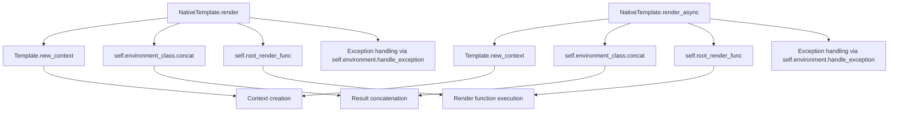

# `nativetypes.py`

## `src.jinja2.nativetypes.native_concat` · *function*

## Summary:
Concatenates iterable values and attempts to evaluate them as Python literals, returning the parsed result or the raw string if parsing fails.

## Description:
This function processes an iterable of values by first extracting the first two elements. If only one element exists and it's not a string, it's returned directly. Otherwise, all values are converted to strings and concatenated. The resulting string is then attempted to be parsed as a Python literal expression using ast.literal_eval. If parsing succeeds, the parsed value is returned; otherwise, the original concatenated string is returned.

This function is used internally by Jinja2 template processing to handle concatenation operations while maintaining type safety for literal expressions.

## Args:
    values (Iterable[Any]): An iterable of values to concatenate and potentially evaluate as Python literals

## Returns:
    Optional[Any]: The parsed Python literal if successful, otherwise the concatenated string, or None if the iterable is empty

## Raises:
    None explicitly raised, though underlying operations may raise exceptions during string conversion or parsing

## Constraints:
    Preconditions:
    - Input must be an iterable
    - Values in the iterable should be convertible to strings
    
    Postconditions:
    - Returns either a parsed Python literal (list, dict, tuple, etc.) or the original string representation
    - Returns None when input iterable is empty
    - Always returns a value (never raises exception due to function logic)

## Side Effects:
    None

## Control Flow:
```mermaid
flowchart TD
    A[Start native_concat] --> B{First 2 elements}
    B -->|None| C[Return None]
    B -->|One element| D{Element is string?}
    D -->|Yes| E[Join all values as string]
    D -->|No| F[Return element directly]
    B -->|Multiple elements| G{Is Generator?}
    G -->|Yes| H[Chain head with values]
    G -->|No| I[Proceed with values]
    I --> J[Join all values as string]
    J --> K[Try literal_eval(parse(raw))]
    K -->|Success| L[Return parsed value]
    K -->|Failure| M[Return raw string]
```

## Examples:
```python
# Basic usage with strings
result = native_concat(["hello", " ", "world"])  # Returns "hello world"

# Usage with numbers (will be parsed as literals)
result = native_concat([1, 2, 3])  # Returns "123" (string) since it's not a valid literal

# Usage with literal expressions
result = native_concat(["[1, 2, 3]"])  # Returns [1, 2, 3] (list)

# Empty iterable
result = native_concat([])  # Returns None

# Single non-string element
result = native_concat([42])  # Returns 42 (integer)
```

## `src.jinja2.nativetypes.NativeCodeGenerator` · *class*

## Summary:
A specialized code generator for native Python types in Jinja2 template compilation, extending CodeGenerator to handle constant representations and expression finalization.

## Description:
The NativeCodeGenerator class extends the base CodeGenerator to provide specialized code generation for native Python types encountered during Jinja2 template compilation. It overrides core code generation methods to properly handle constant value representation, child node processing, and expression finalization. This class is used internally by Jinja2's compilation pipeline when generating Python bytecode for templates containing native Python expressions and constants.

## State:
- Inherits all state from CodeGenerator parent class
- No additional instance attributes defined in this class
- All state management is handled through the parent class and frame objects
- _default_finalize static method provides a default no-op finalization function that simply returns the input value unchanged

## Lifecycle:
- Creation: Instantiated automatically by Jinja2's template compilation process when native type handling is required
- Usage: Methods are invoked during AST traversal when compiling template expressions containing native Python values
- Destruction: Managed by Python's garbage collection; no explicit cleanup required

## Method Map:
```mermaid
graph TD
    A[NativeCodeGenerator] --> B[_output_const_repr]
    A --> C[_output_child_to_const]
    A --> D[_output_child_pre]
    A --> E[_output_child_post]
    C --> F[has_safe_repr]
    C --> G[nodes.Impossible()]
    D --> H[self.write]
    E --> H
```

## Raises:
- nodes.Impossible(): Raised when attempting to represent a constant value that lacks a safe string representation via has_safe_repr() check

## Example:
```python
# Used internally by Jinja2 during template compilation
# Typical usage scenario:
# 1. Template compilation process creates an instance
# 2. During AST traversal, _output_child_to_const processes nodes to constants
# 3. _output_child_pre/_output_child_post handle finalize.src wrapping for expressions
# 4. _output_const_repr generates string representations for constant groups
```

### `src.jinja2.nativetypes.NativeCodeGenerator._default_finalize` · *method*

## Summary:
Returns the input value unchanged, serving as the default finalization function for template expression processing.

## Description:
This static method acts as the default finalize handler in the Jinja2 native code generator. It is designed to be used when no special post-processing of template expression results is required. The method simply passes through the input value without modification, making it suitable as a fallback option in the template compilation pipeline.

## Args:
    value (Any): Any Python value to be returned unchanged.

## Returns:
    Any: The same value that was passed as input.

## Raises:
    None: This method does not raise any exceptions.

## State Changes:
    Attributes READ: None
    Attributes WRITTEN: None

## Constraints:
    Preconditions: None
    Postconditions: The returned value is identical to the input value.

## Side Effects:
    None: This method has no side effects and is pure.

### `src.jinja2.nativetypes.NativeCodeGenerator._output_const_repr` · *method*

## Summary:
Generates a Python string representation of a joined sequence of values for template compilation.

## Description:
Converts an iterable of values into a string by joining them together and then applying Python's built-in `repr()` function to the result. This method is used during Jinja2 template compilation to generate constant string representations for template expressions that can be evaluated at compile time.

The method processes each element in the input iterable by converting it to a string using `str()`, joins all strings together with no separator, and then wraps the result with `repr()` to produce a properly escaped Python string literal. This is particularly useful for generating constant string values in compiled template code where the exact string representation matters for proper Python syntax.

This method is part of the `NativeCodeGenerator` class and is typically invoked during the code generation phase when processing template expressions that resolve to constant values.

## Args:
    group (t.Iterable[t.Any]): An iterable collection of values to be converted to strings and joined together

## Returns:
    str: A Python string representation (using repr()) of the concatenated string formed by converting each element to string and joining them

## Raises:
    Exception: When individual elements cannot be converted to strings using `str()` or when the join operation fails

## State Changes:
    Attributes READ: None
    Attributes WRITTEN: None

## Constraints:
    Preconditions:
        - The group parameter must be iterable
        - Each element in the group must be convertible to a string using `str()`
        - The resulting joined string must be valid for `repr()` processing
    
    Postconditions:
        - Returns a properly escaped Python string literal representation
        - The returned string will be suitable for use in generated Python code
        - The method preserves the semantic meaning of the original values as a joined string

## Side Effects:
    None: This method is pure and does not perform any I/O or mutate external state

### `src.jinja2.nativetypes.NativeCodeGenerator._output_child_to_const` · *method*

## Summary:
Converts a template expression node to its constant representation with proper validation and finalization.

## Description:
Processes a Jinja2 expression node to extract its constant value, validates that the value has a safe string representation, and applies finalization processing. This method serves as a specialized handler for converting expression nodes to constants during template compilation.

This method is typically called during the code generation phase when compiling template expressions that can be evaluated to constant values at compile time. It ensures that only safe constant representations are processed and properly formatted according to the template's finalization requirements.

## Args:
    node (nodes.Expr): The expression node to convert to a constant value
    frame (Frame): The compilation frame containing evaluation context
    finalize (CodeGenerator._FinalizeInfo): Finalization information for processing the constant value

## Returns:
    Any: The constant value extracted from the node, either as-is for TemplateData nodes or after finalization processing

## Raises:
    nodes.Impossible: When the constant value cannot be safely represented as a string

## State Changes:
    Attributes READ: None
    Attributes WRITTEN: None

## Constraints:
    Preconditions:
        - The node must be convertible to a constant via its `as_const()` method
        - The resulting constant value must pass the `has_safe_repr()` validation
        - The finalize parameter must be a valid CodeGenerator._FinalizeInfo instance
    
    Postconditions:
        - Returns a constant value that represents the node's evaluated result
        - For nodes.TemplateData instances, returns the raw constant value unchanged
        - For other nodes, returns the finalized constant value

## Side Effects:
    None

### `src.jinja2.nativetypes.NativeCodeGenerator._output_child_pre` · *method*

## Summary:
Writes finalized source code to the output buffer when pre-processing a child node in template compilation.

## Description:
This method is part of the code generation pipeline for Jinja2 templates, specifically handling pre-processing operations for child nodes. It checks if finalized source code is available in the finalize information and writes it to the output buffer. This method works in conjunction with `_output_child_post` to wrap child node processing with appropriate pre and post operations.

## Args:
    node (nodes.Expr): The AST expression node being processed
    frame (Frame): The compilation frame containing execution context
    finalize (CodeGenerator._FinalizeInfo): Finalization information containing source code to write

## Returns:
    None: This method performs I/O operations and does not return a value

## Raises:
    None explicitly raised: The method only performs conditional writing operations

## State Changes:
    Attributes READ: 
        - finalize.src: Source code string to potentially write
    Attributes WRITTEN:
        - self.write(): Writes to the output buffer/stream

## Constraints:
    Preconditions:
        - The finalize parameter must be a valid CodeGenerator._FinalizeInfo instance
        - The node parameter must be a valid AST expression node
        - The frame parameter must be a valid compilation frame
    
    Postconditions:
        - If finalize.src is not None, it will be written to the output buffer
        - No modifications to the object's internal state beyond writing to output

## Side Effects:
    I/O operations: Writes to the output buffer via self.write() method

### `src.jinja2.nativetypes.NativeCodeGenerator._output_child_post` · *method*

## Summary:
Writes a closing parenthesis to the output when finalize information indicates an opening parenthesis should be closed.

## Description:
This method serves as a post-processing step in the code generation process for Jinja2 templates. It complements the `_output_child_pre` method by writing a closing parenthesis ")" when the finalize information contains an opening syntax marker. This maintains proper syntax balance in generated Python code.

The method is typically called during template compilation when processing expression nodes that require finalize wrapping.

## Args:
    node (nodes.Expr): The expression node being processed
    frame (Frame): The compilation frame containing execution context
    finalize (CodeGenerator._FinalizeInfo): Finalization information containing optional opening syntax marker

## Returns:
    None: This method performs I/O operations and does not return a value

## Raises:
    None: This method does not explicitly raise exceptions

## State Changes:
    Attributes READ: self (the generator instance), finalize.src
    Attributes WRITTEN: None (modifies output via self.write)

## Constraints:
    Preconditions: 
    - The method assumes that if finalize.src is not None, it represents an opening syntax that needs to be closed
    - The node parameter must be a valid expression node
    - The frame parameter must contain valid compilation context
    
    Postconditions:
    - When finalize.src is not None, exactly one closing parenthesis ")" is written to the output
    - The method does not modify any internal state of the generator object

## Side Effects:
    I/O: Writes a closing parenthesis character to the output stream via self.write()

## `src.jinja2.nativetypes.NativeEnvironment` · *class*

## Summary:
A specialized Jinja2 environment that uses native Python code generation and enhanced concatenation for template processing.

## Description:
The NativeEnvironment class is a subclass of the standard Jinja2 Environment that provides optimized template compilation and concatenation behavior. It is designed to leverage native Python code generation for better performance and uses a specialized concatenation function that can parse Python literal expressions from concatenated strings.

This environment is typically used when maximum performance and native Python integration are desired in template processing, particularly for templates that benefit from direct Python code generation rather than interpreted bytecode.

## State:
- code_generator_class: Class reference to NativeCodeGenerator used for compiling templates into Python bytecode
- concat: Static method reference to native_concat function for handling concatenation operations with literal expression parsing capability

## Lifecycle:
- Creation: Instantiated like any standard Environment class, inheriting all Environment initialization behavior
- Usage: Used identically to Environment for template loading, rendering, and processing
- Destruction: Inherits standard Environment cleanup behavior

## Method Map:
```mermaid
flowchart TD
    A[NativeEnvironment.__init__] --> B[Environment.__init__]
    B --> C[Set code_generator_class = NativeCodeGenerator]
    C --> D[Set concat = staticmethod(native_concat)]
    D --> E[Template Processing]
    E --> F[NativeCodeGenerator.generate()]
    F --> G[native_concat() calls]
```

## Raises:
- Inherits all exceptions raised by Environment.__init__
- No additional exceptions specific to NativeEnvironment constructor

## Example:
```python
from jinja2 import NativeEnvironment

# Create a native environment instance
env = NativeEnvironment()

# Load and render a template
template = env.from_string("Hello {{ name }}!")
result = template.render(name="World")
print(result)  # Output: "Hello World!"

# The environment uses native code generation internally
# and handles concatenation with literal parsing capabilities
```

## `src.jinja2.nativetypes.NativeTemplate` · *class*

## Summary:
A Jinja2 template subclass implementing native Python type rendering with both synchronous and asynchronous capabilities.

## Description:
The NativeTemplate class extends the base Template class to provide rendering functionality specifically designed for native Python types. It implements both synchronous and asynchronous rendering methods, enabling flexible template processing in different execution contexts. This class is intended to be used with a NativeEnvironment and follows the standard Jinja2 template interface.

## State:
- `environment_class`: Class variable set to `NativeEnvironment` (must be defined elsewhere)
- Inherits all standard Template attributes and methods from the base Template class

## Lifecycle:
- Creation: Instantiated through standard Jinja2 template creation mechanisms (Environment.get_template, Environment.from_string, etc.)
- Usage: Call `render()` for synchronous rendering or `render_async()` for asynchronous rendering
- Destruction: Managed automatically by Python's garbage collector

## Method Map:


## Raises:
- `RuntimeError`: Raised by `render_async()` when the environment is not configured for async mode
- All other exceptions from rendering operations are caught and handled by `self.environment.handle_exception()`

## Example:
```python
# Synchronous rendering
template = env.from_string("Hello {{ name }}!")
result = template.render(name="World")

# Asynchronous rendering (requires async environment)
async def async_render():
    result = await template.render_async(name="World")
    return result
```

### `src.jinja2.nativetypes.NativeTemplate.render` · *method*

## Summary:
Executes template rendering by creating a context and processing the root render function, with exception handling.

## Description:
This method implements the core template rendering logic. It creates a rendering context from the provided arguments, executes the template's root render function, and concatenates the results. When an exception occurs during execution, it delegates to the environment's exception handler.

## Args:
    *args (t.Any): Positional arguments to be merged into the rendering context
    **kwargs (t.Any): Keyword arguments to be merged into the rendering context

## Returns:
    t.Any: The result of template rendering or exception handling

## Raises:
    Exception: Any exception that occurs during template rendering or concatenation

## State Changes:
    Attributes READ: 
    - self.new_context
    - self.environment_class
    - self.root_render_func
    - self.environment.handle_exception
    
    Attributes WRITTEN: None

## Constraints:
    Preconditions:
    - The template must be properly compiled and initialized
    - The environment must be configured appropriately
    
    Postconditions:
    - The method will always return a value (either rendered content or handled exception)
    - The context is created with the provided arguments

## Side Effects:
    - May perform I/O operations during template rendering
    - May call external functions through the environment's exception handling mechanism
    - May modify internal state through the context creation process

### `src.jinja2.nativetypes.NativeTemplate.render_async` · *method*

## Summary:
Asynchronously renders a Jinja2 template with the provided context and returns the concatenated result.

## Description:
This method provides asynchronous rendering capability for Jinja2 templates. It validates that the environment is configured for async operations, creates a rendering context from the provided arguments, and asynchronously processes the template's root render function to produce the final output. The method handles exceptions by delegating to the environment's exception handler.

The method is designed to work with Jinja2 templates that have been configured for asynchronous operation. It uses Python's async/await syntax to process template nodes concurrently, making it suitable for I/O-intensive template rendering scenarios.

## Args:
    *args (t.Any): Positional arguments to be merged into the rendering context dictionary
    **kwargs (t.Any): Keyword arguments to be merged into the rendering context dictionary

## Returns:
    t.Any: The rendered template content, typically a string, or an exception handling result

## Raises:
    RuntimeError: When the environment was not created with async mode enabled

## State Changes:
    Attributes READ: 
        - self.environment.is_async
        - self.environment_class
        - self.root_render_func
    Attributes WRITTEN: None

## Constraints:
    Preconditions:
        - The environment must have been initialized with async mode enabled (environment.is_async must be True)
        - The template must have a valid root_render_func method
    Postconditions:
        - Returns either the rendered template content or an exception handling result

## Side Effects:
    - May perform I/O operations during template rendering
    - Calls external methods (environment_class.concat, root_render_func, handle_exception)
    - May raise exceptions that are handled internally

