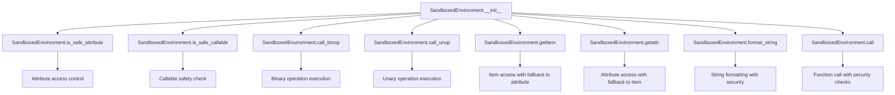
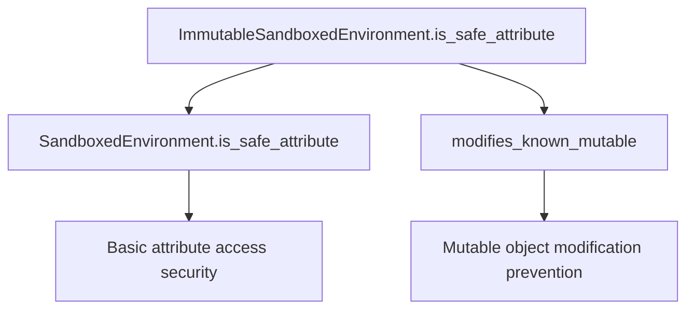
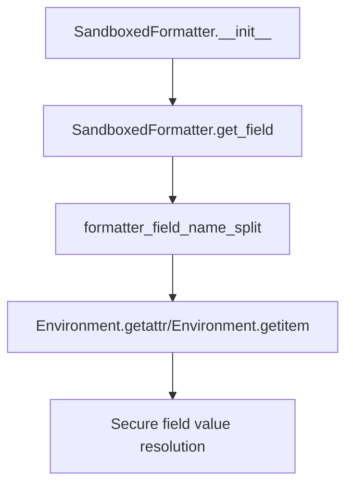
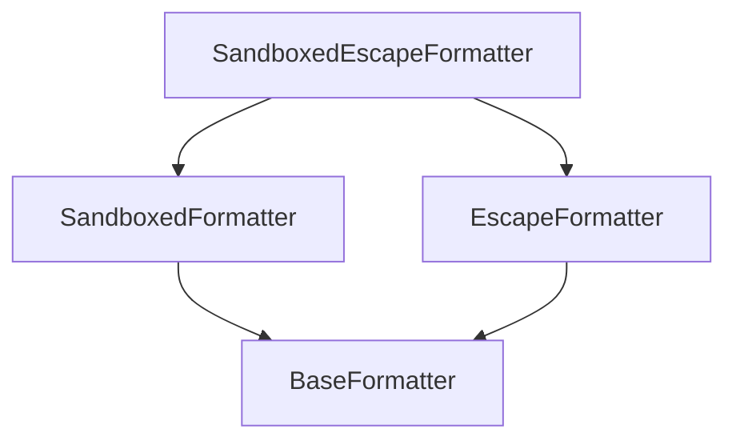

# `sandbox.py`

## `src.jinja2.sandbox.inspect_format_method` · *function*

## Summary:
Extracts the string object from format or format_map methods for security inspection in sandboxed environments.

## Description:
This function examines a callable to determine if it is a bound method of either the `str.format()` or `str.format_map()` methods. If so, it returns the string object that the method is bound to, which can be used for security validation or restriction purposes in sandboxed contexts. The function serves as a utility for identifying potentially dangerous string formatting operations that could lead to code execution vulnerabilities.

## Args:
    callable (typing.Callable): A callable object to inspect for being a format or format_map method.

## Returns:
    typing.Optional[str]: The string object that the format/format_map method is bound to, or None if the callable is not a recognized format method or if the bound object is not a string.

## Raises:
    None explicitly raised.

## Constraints:
    Preconditions:
    - The callable must be a bound method (either MethodType or BuiltinMethodType)
    - The callable's __name__ must be either "format" or "format_map"
    - The callable's __self__ attribute must refer to an object that can be checked for string type
    
    Postconditions:
    - Returns None for non-format methods or non-string objects
    - Returns the string object when conditions are met

## Side Effects:
    None.

## Control Flow:
```mermaid
flowchart TD
    A[Start inspect_format_method] --> B{Is callable MethodType/BuiltinMethodType?}
    B -- No --> C[Return None]
    B -- Yes --> D{Is callable.__name__ in ["format", "format_map"]?}
    D -- No --> C
    D -- Yes --> E[Get callable.__self__]
    E --> F{Is __self__ instance of str?}
    F -- Yes --> G[Return __self__]
    F -- No --> C
```

## Examples:
    # Example 1: Valid string format method
    s = "Hello {name}"
    method = s.format
    result = inspect_format_method(method)  # Returns "Hello {name}"
    
    # Example 2: Invalid method (not format/format_map)
    def custom_function():
        pass
    result = inspect_format_method(custom_function)  # Returns None
    
    # Example 3: Valid format_map method
    s = "Hello {name}"
    method = s.format_map
    result = inspect_format_method(method)  # Returns "Hello {name}"
    
    # Example 4: Non-string bound object
    class CustomClass:
        def format(self):
            pass
    obj = CustomClass()
    method = obj.format
    result = inspect_format_method(method)  # Returns None
```

## `src.jinja2.sandbox.safe_range` · *function*

## Summary:
Creates a range object with size validation to prevent resource exhaustion in sandboxed environments.

## Description:
This function provides a secure wrapper around Python's built-in range() constructor. It validates that the created range does not exceed a predefined maximum size (MAX_RANGE) to prevent potential denial-of-service attacks through excessive memory allocation. The function is part of Jinja2's sandbox security mechanism that restricts potentially dangerous operations in template contexts.

## Args:
    *args (int): Variable length argument list passed directly to Python's built-in range() constructor. Supports 1-3 integer arguments following standard range() semantics.

## Returns:
    range: A range object with the specified start, stop, and step values, provided its length doesn't exceed MAX_RANGE.

## Raises:
    OverflowError: When the length of the created range exceeds the MAX_RANGE limit, indicating a potentially malicious or resource-intensive operation.

## Constraints:
    Preconditions:
    - All arguments must be integers compatible with Python's range() function
    - The resulting range must not exceed MAX_RANGE in length
    
    Postconditions:
    - Returns a valid range object with length <= MAX_RANGE
    - No side effects occur during normal execution

## Side Effects:
    None

## Control Flow:
```mermaid
flowchart TD
    A[Call safe_range] --> B{len(range) > MAX_RANGE?}
    B -- Yes --> C[Raise OverflowError]
    B -- No --> D[Return range object]
```

## Examples:
```python
# Valid usage - creates range with acceptable size
r1 = safe_range(10)  # Creates range(0, 10) with length 10

# Valid usage - creates range with acceptable size  
r2 = safe_range(0, 20, 2)  # Creates range(0, 20, 2) with length 10

# Invalid usage - would raise OverflowError
# safe_range(1000000)  # Would raise OverflowError if 1M > MAX_RANGE
```

## `src.jinja2.sandbox.is_internal_attribute` · *function*

## Summary:
Determines if an attribute access should be blocked in a sandboxed environment based on object type and attribute name.

## Description:
This function implements security checks to prevent access to potentially dangerous or internal attributes in a sandboxed Jinja2 environment. It evaluates whether a given attribute of an object should be restricted based on the object's type and the attribute's name.

The function specifically blocks access to:
- Attributes that start with double underscores (__)
- Certain attributes of function objects
- Certain attributes of method objects  
- The "mro" attribute of class objects
- All attributes of code, traceback, and frame objects
- Certain attributes of generator objects
- Certain attributes of coroutine objects
- Certain attributes of async generator objects

This logic is extracted into its own function to centralize security attribute checking and maintain clean separation between sandbox enforcement and template rendering logic.

## Args:
    obj (Any): The object whose attribute is being checked
    attr (str): The name of the attribute being accessed

## Returns:
    bool: True if the attribute access should be blocked (considered internal/unsafe), False otherwise

## Raises:
    None explicitly raised

## Constraints:
    Preconditions:
    - obj parameter can be any Python object
    - attr parameter must be a string representing an attribute name
    
    Postconditions:
    - Returns a boolean value indicating whether access should be restricted
    - The function handles various Python types including functions, methods, classes, and built-in types

## Side Effects:
    None

## Control Flow:
```mermaid
flowchart TD
    A[Start is_internal_attribute] --> B{obj is FunctionType?}
    B -- Yes --> C{attr in UNSAFE_FUNCTION_ATTRIBUTES?}
    C -- Yes --> D[Return True]
    C -- No --> E[Continue]
    B -- No --> F{obj is MethodType?}
    F -- Yes --> G{attr in UNSAFE_FUNCTION_ATTRIBUTES OR attr in UNSAFE_METHOD_ATTRIBUTES?}
    G -- Yes --> D
    G -- No --> E
    F -- No --> H{obj is type?}
    H -- Yes --> I{attr == "mro"?}
    I -- Yes --> D
    I -- No --> E
    H -- No --> J{obj is CodeType or TracebackType or FrameType?}
    J -- Yes --> D
    J -- No --> K{obj is GeneratorType?}
    K -- Yes --> L{attr in UNSAFE_GENERATOR_ATTRIBUTES?}
    L -- Yes --> D
    L -- No --> E
    K -- No --> M{hasattr(types, "CoroutineType") AND obj is CoroutineType?}
    M -- Yes --> N{attr in UNSAFE_COROUTINE_ATTRIBUTES?}
    N -- Yes --> D
    N -- No --> E
    M -- No --> O{hasattr(types, "AsyncGeneratorType") AND obj is AsyncGeneratorType?}
    O -- Yes --> P{attr in UNSAFE_ASYNC_GENERATOR_ATTRIBUTES?}
    P -- Yes --> D
    P -- No --> E
    O -- No --> Q{attr starts with "__"?}
    Q -- Yes --> D
    Q -- No --> R[Return False]
```

## Examples:
    # Blocking attributes that start with double underscore
    is_internal_attribute(some_object, '__private_attr__')  # Returns True
    
    # Blocking special class attributes
    is_internal_attribute(SomeClass, 'mro')  # Returns True
    
    # Blocking all attributes of code objects
    is_internal_attribute(code_object, 'co_filename')  # Returns True
    
    # Blocking all attributes of frame objects
    is_internal_attribute(frame_object, 'f_locals')  # Returns True

## `src.jinja2.sandbox.modifies_known_mutable` · *function*

*No documentation generated.*

## `src.jinja2.sandbox.SandboxedEnvironment` · *class*

## Summary:
A secure Jinja2 environment that restricts potentially dangerous operations and attribute access to prevent code injection and unauthorized access in template rendering.

## Description:
SandboxedEnvironment is a subclass of Environment that provides enhanced security by restricting access to dangerous attributes, preventing execution of unsafe callable objects, and implementing safe string formatting. It is designed to be used in untrusted template contexts where security is paramount.

This class enforces security through:
- Attribute access restrictions via `is_safe_attribute` that blocks private attributes and internal attributes
- Callable safety checks via `is_safe_callable` that prevents execution of functions marked as unsafe
- Safe binary and unary operation handling through configurable operation tables
- Restricted string formatting that prevents code execution through format/format_map methods
- Special handling for dangerous object access patterns

The class is typically instantiated by template engines or security-conscious applications that need to render templates without exposing underlying system resources or allowing arbitrary code execution. It maintains full compatibility with standard Jinja2 template functionality while adding critical security layers.

## State:
- `sandboxed`: Class attribute set to True, indicating this is a sandboxed environment
- `default_binop_table`: Class dictionary mapping binary operators to safe implementations from the operator module
- `default_unop_table`: Class dictionary mapping unary operators to safe implementations from the operator module
- `intercepted_binops`: Class frozen set of binary operators that are intercepted (defaults to empty set)
- `intercepted_unops`: Class frozen set of unary operators that are intercepted (defaults to empty set)
- `binop_table`: Instance copy of default_binop_table, modifiable for custom operations
- `unop_table`: Instance copy of default_unop_table, modifiable for custom operations
- `globals`: Inherited from Environment, contains global variables available to templates (with 'range' overridden to safe_range)

## Lifecycle:
- Creation: Instantiate with standard Environment constructor arguments; automatically registers safe_range in globals and copies operation tables
- Usage: Templates are rendered using inherited Environment methods, with security checks applied during attribute access, operation execution, and callable invocation
- Destruction: Inherits standard Environment cleanup behavior

## Method Map:


## Raises:
- SecurityError: Raised by `call`, `getattr`, `getitem`, and `unsafe_undefined` when accessing unsafe attributes or calling unsafe functions
- TypeError: Raised by `format_string` when format_map is called with incorrect arguments

## Example:
```python
from jinja2.sandbox import SandboxedEnvironment

# Create a secure environment for untrusted templates
env = SandboxedEnvironment()

# Basic template rendering - safe
template = env.from_string("Hello {{ user.name }}!")
result = template.render(user={"name": "Alice"})
print(result)  # Output: "Hello Alice!"

# Template with safe operations
template = env.from_string("Sum: {{ a + b }}")
result = template.render(a=5, b=3)
print(result)  # Output: "Sum: 8"

# Security enforcement - this would raise SecurityError
try:
    template = env.from_string("{{ obj.__dict__ }}")
    result = template.render(obj={"name": "test"})
except SecurityError as e:
    print(f"Security violation: {e}")

# Customizing security - modifying operation tables
env.binop_table["+"] = lambda x, y: x + y  # Default behavior preserved
env.unop_table["-"] = lambda x: -x  # Custom unary negation

# String formatting with security
template = env.from_string("Formatted: {0}")
result = template.render(name="World")
print(result)  # Output: "Formatted: World"
```

### `src.jinja2.sandbox.SandboxedEnvironment.__init__` · *method*

## Summary:
Initializes a SandboxedEnvironment instance by setting up security configurations and copying operation tables from the parent Environment class.

## Description:
This method constructs a SandboxedEnvironment instance by first initializing the parent Environment class and then configuring security-specific attributes. It replaces the standard 'range' function in the globals dictionary with a safe_range implementation to prevent resource exhaustion attacks, and copies the default binary and unary operation tables to allow for customization while maintaining security defaults.

## Args:
    *args (Any): Variable length argument list passed to the parent Environment.__init__ method
    **kwargs (Any): Arbitrary keyword arguments passed to the parent Environment.__init__ method

## Returns:
    None: This method initializes the instance in-place and does not return a value

## Raises:
    None: This method does not explicitly raise exceptions, though parent class initialization may raise exceptions

## State Changes:
    Attributes READ:
    - self.default_binop_table
    - self.default_unop_table
    
    Attributes WRITTEN:
    - self.globals["range"]
    - self.binop_table
    - self.unop_table

## Constraints:
    Preconditions:
    - The parent Environment class must be properly initialized
    - The default_binop_table and default_unop_table class attributes must be defined
    
    Postconditions:
    - The instance's globals dictionary will contain a safe_range function under the "range" key
    - The instance's binop_table will be a copy of the default_binop_table
    - The instance's unop_table will be a copy of the default_unop_table

## Side Effects:
    None: This method performs in-place initialization and does not cause external I/O or mutations beyond the instance's own attributes

### `src.jinja2.sandbox.SandboxedEnvironment.is_safe_attribute` · *method*

## Summary:
Determines whether accessing a given attribute on an object is safe within a sandboxed environment by checking for private attributes and internal security restrictions.

## Description:
This method implements security checks to prevent unauthorized access to potentially dangerous or internal attributes in a sandboxed Jinja2 environment. It evaluates whether a specific attribute access should be permitted based on two criteria: (1) whether the attribute name starts with an underscore character, and (2) whether the attribute is classified as internal by the `is_internal_attribute` helper function.

The method is called during attribute access operations in both `getitem` and `getattr` methods of the `SandboxedEnvironment` class to enforce security boundaries around object attribute access.

## Args:
    obj (Any): The object whose attribute is being checked for safety
    attr (str): The name of the attribute being accessed
    value (Any): The value of the attribute being accessed (unused in current implementation)

## Returns:
    bool: True if the attribute access is considered safe, False if access should be blocked due to security restrictions

## Raises:
    None explicitly raised

## State Changes:
    Attributes READ: None
    Attributes WRITTEN: None

## Constraints:
    Preconditions:
    - The `obj` parameter can be any Python object
    - The `attr` parameter must be a string representing an attribute name
    - The `value` parameter can be any Python object (though currently unused in the implementation)
    
    Postconditions:
    - Returns a boolean value indicating whether access should be permitted
    - The method does not modify any object state

## Side Effects:
    None

### `src.jinja2.sandbox.SandboxedEnvironment.is_safe_callable` · *method*

## Summary:
Determines whether a callable object is safe to execute within a sandboxed environment by checking for unsafe attributes.

## Description:
This method evaluates whether a given object should be permitted for execution in a sandboxed Jinja2 environment. It examines two specific attributes on the object: "unsafe_callable" and "alters_data". If either attribute exists and evaluates to True, the object is considered unsafe and will not be allowed to execute. This provides a mechanism for marking certain callable objects as potentially dangerous in secure template contexts.

## Args:
    obj (Any): The object to check for safety. This is typically a callable that may be executed within a template.

## Returns:
    bool: True if the object is safe to call (does not have unsafe_callable or alters_data set to True), False otherwise.

## Raises:
    None: This method does not raise any exceptions directly.

## State Changes:
    Attributes READ: 
    - self (the SandboxedEnvironment instance, though not directly accessed in this method)
    - obj (accessed via getattr to check for "unsafe_callable" and "alters_data" attributes)

## Constraints:
    Preconditions:
    - The obj parameter should be an object that may have attributes (callable or not)
    - The method assumes that if these attributes exist, they should be boolean values
    
    Postconditions:
    - The method returns a boolean value indicating safety status
    - No modifications are made to the input object or environment state

## Side Effects:
    None: This method performs only attribute lookups and returns a computed value without any I/O operations or external service calls.

### `src.jinja2.sandbox.SandboxedEnvironment.call_binop` · *method*

## Summary:
Executes a binary operation by looking up the operator in the sandboxed environment's binary operation table and applying it to the provided operands.

## Description:
This method serves as a secure interface for executing binary operations within a sandboxed Jinja2 environment. It retrieves the appropriate operation function from the environment's `binop_table` based on the operator string and applies it to the left and right operands. This approach centralizes binary operation execution and ensures that only predefined, safe operations can be performed.

The method is typically called during template rendering when binary expressions (like arithmetic operations) are evaluated. It provides a controlled way to execute operations while maintaining security boundaries.

## Args:
    context (Context): The Jinja2 rendering context, providing access to variables and execution environment
    operator (str): The binary operator to execute (e.g., '+', '-', '*', '/', '//', '**', '%')
    left (Any): The left operand for the binary operation
    right (Any): The right operand for the binary operation

## Returns:
    Any: The result of applying the binary operation to the left and right operands

## Raises:
    KeyError: When the specified operator is not found in the `binop_table`
    TypeError: When the operands are incompatible with the operation being performed
    Exception: When the operation itself raises an exception (e.g., division by zero)

## State Changes:
    Attributes READ: self.binop_table
    Attributes WRITTEN: None

## Constraints:
    Preconditions:
        - The `operator` must be a key in `self.binop_table`
        - The operands must be compatible with the operation being performed
        - The `context` parameter must be a valid Jinja2 Context instance
    
    Postconditions:
        - Returns the result of applying the binary operation to the operands
        - Does not modify any state in the SandboxedEnvironment instance

## Side Effects:
    None - This method does not perform I/O operations or mutate external state. However, the underlying operation may have side effects depending on the operands and operation type.

### `src.jinja2.sandbox.SandboxedEnvironment.call_unop` · *method*

## Summary:
Executes a unary operation by looking up the operator in the sandboxed environment's unary operation table and applying it to the provided argument.

## Description:
This method serves as a secure interface for executing unary operations within a sandboxed Jinja2 environment. It retrieves the appropriate operation function from the environment's `unop_table` based on the operator string and applies it to the argument. This approach centralizes unary operation execution and ensures that only predefined, safe operations can be performed.

The method is typically called during template rendering when unary expressions (like negation `-x` or positive sign `+x`) are evaluated. It provides a controlled way to execute operations while maintaining security boundaries.

This method follows the same architectural pattern as `call_binop` but for unary operations, ensuring consistency in how operations are handled within the sandboxed environment.

## Args:
    context (Context): The Jinja2 rendering context, providing access to variables and execution environment. Note: This parameter is currently unused in the implementation but maintained for API consistency.
    operator (str): The unary operator to execute (e.g., '+', '-'). Must be a key in the `unop_table`.
    arg (Any): The argument to apply the unary operation to.

## Returns:
    Any: The result of applying the unary operation to the argument.

## Raises:
    KeyError: When the specified operator is not found in the `unop_table`
    TypeError: When the argument is incompatible with the operation being performed
    Exception: When the operation itself raises an exception (e.g., invalid operand types)

## State Changes:
    Attributes READ: self.unop_table
    Attributes WRITTEN: None

## Constraints:
    Preconditions:
        - The `operator` must be a key in `self.unop_table`
        - The `arg` must be compatible with the operation being performed
        - The `context` parameter must be a valid Jinja2 Context instance
    
    Postconditions:
        - Returns the result of applying the unary operation to the argument
        - Does not modify any state in the SandboxedEnvironment instance

## Side Effects:
    None - This method does not perform I/O operations or mutate external state. However, the underlying operation may have side effects depending on the argument and operation type.

### `src.jinja2.sandbox.SandboxedEnvironment.getitem` · *method*

## Summary:
Retrieves an item or attribute from an object with security checks, falling back to undefined behavior for unsafe accesses.

## Description:
This method implements secure item and attribute access for the sandboxed Jinja2 environment. It attempts to access an object using bracket notation first (`obj[argument]`), and if that fails with TypeError or LookupError, it falls back to attribute access (`getattr(obj, argument)`) when the argument is a string.

Security checks are performed to ensure that only safe attributes are returned, preventing access to private or internal attributes that could compromise security. This method is crucial for maintaining sandbox security while preserving normal Python access patterns in templates.

The method is called during template rendering when accessing variables using bracket notation (e.g., `obj[key]`) or dot notation (e.g., `obj.attr`).

## Args:
    obj (Any): The object from which to retrieve the item or attribute
    argument (Union[str, Any]): The key or attribute name to access

## Returns:
    Union[Any, Undefined]: The retrieved value if successful, or an Undefined instance if access is denied or the item/attribute doesn't exist

## Raises:
    None explicitly raised - exceptions are caught and handled internally

## State Changes:
    Attributes READ: self.is_safe_attribute, self.unsafe_undefined, self.undefined
    Attributes WRITTEN: None

## Constraints:
    Preconditions:
    - The object must support either indexing (with the argument type) or attribute access
    - The argument should be of a type compatible with the object's access methods
    
    Postconditions:
    - Returns either the accessed value, an Undefined instance, or raises an exception from underlying operations
    - Does not modify the state of the SandboxedEnvironment instance

## Side Effects:
    None - This method performs no I/O operations or external service calls

### `src.jinja2.sandbox.SandboxedEnvironment.getattr` · *method*

## Summary:
Retrieves an attribute from an object with security checks, returning either the attribute value, an undefined object, or raising a security error.

## Description:
This method provides secure attribute access for the SandboxedEnvironment by attempting to retrieve attributes using standard Python getattr(), falling back to item access, and applying security checks to prevent access to unsafe attributes. It is used during template rendering when accessing object attributes to ensure that potentially dangerous operations are blocked.

The method follows a specific order of operations:
1. First attempts standard attribute access using getattr()
2. If AttributeError occurs, attempts item access using obj[attribute]
3. If successful in either access method, applies security checks via is_safe_attribute()
4. If attribute is deemed unsafe, returns an unsafe_undefined object
5. If all access attempts fail, returns a regular undefined object

## Args:
    obj (Any): The object from which to retrieve the attribute
    attribute (str): The name of the attribute to retrieve

## Returns:
    Union[Any, Undefined]: The attribute value if it's safe to access, otherwise an Undefined instance representing the failed access

## Raises:
    None explicitly raised - the method handles all exceptions internally and returns appropriate Undefined objects

## State Changes:
    Attributes READ: 
    - self.is_safe_attribute
    - self.unsafe_undefined  
    - self.undefined
    Attributes WRITTEN: None

## Constraints:
    Preconditions:
    - obj must be a valid Python object
    - attribute must be a string
    - The SandboxedEnvironment instance must be properly initialized
    
    Postconditions:
    - Returns either the attribute value (if safe), an Undefined object (if unsafe), or raises SecurityError (if explicitly blocked)
    - Does not modify the SandboxedEnvironment instance state

## Side Effects:
    None - This method is purely functional and doesn't cause any I/O or external service calls

### `src.jinja2.sandbox.SandboxedEnvironment.unsafe_undefined` · *method*

## Summary:
Creates and returns an Undefined object representing an unsafe attribute access attempt on a given object.

## Description:
This method is invoked when the sandboxed environment detects that accessing a particular attribute on an object would be unsafe according to the security policies. It constructs an appropriate error message indicating the unsafe access and returns an Undefined instance that will raise a SecurityError when accessed.

## Args:
    obj (Any): The object whose attribute access is considered unsafe
    attribute (str): The name of the attribute being accessed

## Returns:
    Undefined: An Undefined object configured to raise SecurityError when accessed

## Raises:
    SecurityError: When the returned Undefined object is accessed, either directly or through string conversion

## State Changes:
    Attributes READ: None
    Attributes WRITTEN: None

## Constraints:
    Preconditions: 
    - The `obj` parameter must be a valid Python object
    - The `attribute` parameter must be a string representing the attribute name
    - The attribute access must have been previously determined to be unsafe by the security policy
    
    Postconditions:
    - Returns an Undefined object that will raise SecurityError upon access
    - The returned object contains metadata about the unsafe access attempt

## Side Effects:
    None

### `src.jinja2.sandbox.SandboxedEnvironment.format_string` · *method*

*No documentation generated.*

### `src.jinja2.sandbox.SandboxedEnvironment.call` · *method*

## Summary:
Handles secure calling of objects in a sandboxed environment, supporting both string formatting and general function calls with safety checks.

## Description:
This method provides a secure mechanism for calling objects within a sandboxed Jinja2 environment. It first attempts to detect if the object is a string format method (format or format_map) and processes it through a safe formatter. If not a format method, it validates that the callable is safe to execute before delegating to the context's call mechanism. This approach prevents potentially dangerous operations while maintaining functionality for legitimate use cases.

The method is designed to be called internally by the Jinja2 templating engine during expression evaluation, ensuring that all function calls respect the sandbox security model.

## Args:
    __self: The SandboxedEnvironment instance (bound method receiver)
    __context: The Jinja2 Context in which the call occurs
    __obj: The callable object to invoke
    *args: Positional arguments to pass to the callable
    **kwargs: Keyword arguments to pass to the callable

## Returns:
    The result of calling the provided object with the given arguments, or the formatted string if it's a format method. The return type depends on the callable being invoked.

## Raises:
    SecurityError: When attempting to call an object that is not marked as safely callable via the is_safe_callable check

## State Changes:
    Attributes READ: None
    Attributes WRITTEN: None

## Constraints:
    Preconditions:
    - __obj must be a callable object
    - __context must be a valid Jinja2 Context instance
    - The environment must be properly initialized for sandboxing
    
    Postconditions:
    - If __obj is a format method, returns a formatted string
    - If __obj is not a format method, returns the result of calling the object
    - Security checks prevent execution of unsafe callables

## Side Effects:
    - May perform string formatting operations when dealing with format methods
    - May raise SecurityError for unsafe callable objects
    - Delegates to Context.call for actual object invocation

## `src.jinja2.sandbox.ImmutableSandboxedEnvironment` · *class*

## Summary:
An immutable sandboxed Jinja2 environment that prevents modification of known mutable objects during attribute access.

## Description:
The `ImmutableSandboxedEnvironment` class extends `SandboxedEnvironment` to provide enhanced security by preventing attribute accesses that would modify known mutable objects. While the parent class already implements basic security checks for attribute access, this subclass adds an additional layer that specifically blocks operations that could mutate mutable objects like lists, dictionaries, or other containers.

This environment is designed for scenarios where strict immutability is required in template rendering, ensuring that even if an attribute access would normally be permitted, it's still restricted if it would lead to modification of mutable objects that should remain unchanged.

## State:
- Inherits all state from `SandboxedEnvironment` including:
  - `sandboxed`: Boolean flag indicating this is a sandboxed environment
  - Operation tables (`binop_table`, `unop_table`) for safe binary/unary operations
  - Security configuration for attribute and callable access
- No additional instance attributes beyond those inherited from parent class

## Lifecycle:
- Creation: Instantiate with standard `Environment` constructor arguments, similar to `SandboxedEnvironment`
- Usage: Templates are rendered using inherited `Environment` methods, with enhanced security checks applied during attribute access
- Destruction: Inherits standard `Environment` cleanup behavior

## Method Map:


## Raises:
- SecurityError: Inherited from `SandboxedEnvironment` when accessing unsafe attributes or calling unsafe functions
- TypeError: Inherited from `SandboxedEnvironment` when format_map is called with incorrect arguments

## Example:
```python
from jinja2.sandbox import ImmutableSandboxedEnvironment

# Create an immutable sandboxed environment
env = ImmutableSandboxedEnvironment()

# Basic template rendering - safe
template = env.from_string("Hello {{ user.name }}!")
result = template.render(user={"name": "Alice"})
print(result)  # Output: "Hello Alice!"

# This would raise SecurityError if trying to access attributes that modify mutable objects
# For example, attempting to call methods that modify lists or dicts
# template = env.from_string("{{ obj.some_list.append(1) }}")
# result = template.render(obj={"some_list": []})

# Normal attribute access remains allowed
template = env.from_string("{{ obj.value }}")
result = template.render(obj={"value": "safe"})
print(result)  # Output: "safe"
```

### `src.jinja2.sandbox.ImmutableSandboxedEnvironment.is_safe_attribute` · *method*

## Summary:
Determines whether accessing an attribute on an object is safe in the immutable sandbox environment, preventing modifications to known mutable objects.

## Description:
This method extends the security checking of the parent `SandboxedEnvironment.is_safe_attribute` method by adding an additional layer of protection specifically for mutable objects. It ensures that even if an attribute access would normally be considered safe, it's still blocked if it would modify known mutable objects that shouldn't be altered in an immutable context.

The method is called during attribute access operations in Jinja2 templates to enforce security restrictions in sandboxed environments where immutability is required.

## Args:
    obj (Any): The object whose attribute is being accessed
    attr (str): The name of the attribute being accessed
    value (Any): The value of the attribute being accessed

## Returns:
    bool: True if the attribute access is safe, False otherwise

## Raises:
    None explicitly raised

## State Changes:
    Attributes READ: None
    Attributes WRITTEN: None

## Constraints:
    Preconditions: 
    - All arguments must be provided and of the correct types
    - The object must be compatible with isinstance checks
    
    Postconditions:
    - Returns boolean indicating safety of attribute access
    - Does not modify any internal state

## Side Effects:
    None

## `src.jinja2.sandbox.SandboxedFormatter` · *class*

## Summary:
A secure field formatter that safely resolves template fields using Jinja2's Environment for sandboxed attribute and item access.

## Description:
The SandboxedFormatter extends Python's standard string.Formatter to provide secure field resolution in template strings. Instead of using direct Python attribute access (getattr) or item access (getitem), it delegates to the Jinja2 Environment's getattr and getitem methods, which enforce security restrictions to prevent access to private members, methods, or other potentially dangerous operations.

This formatter is used internally by Jinja2 when processing template strings that contain field references, ensuring that template variables are accessed in a controlled, secure manner according to Jinja2's sandboxing policies.

## State:
- `_env`: Environment instance used for secure attribute and item access. Type: Environment. Required parameter, cannot be None. This is the core security mechanism that controls how fields are accessed through getattr() and getitem() methods.
- All other state is inherited from the base string.Formatter class.

## Lifecycle:
- Creation: Instantiate with an Environment object and optional keyword arguments for the parent Formatter class constructor
- Usage: Called internally by Jinja2 during template rendering when processing format strings with field references like "{field_name}"
- Destruction: Managed automatically by Python's garbage collection

## Method Map:


## Raises:
- None explicitly raised by __init__
- Exceptions may be raised by the underlying Environment's getattr/getitem methods if security restrictions are violated during field access

## Example:
```python
# Typically used internally by Jinja2
from jinja2 import Environment
from jinja2.sandbox import SandboxedFormatter

env = Environment()
formatter = SandboxedFormatter(env)
# Used internally when processing templates like:
# "Hello {name}" with context {'name': 'World'}
# Field access is securely handled through env.getattr/env.getitem
```

### `src.jinja2.sandbox.SandboxedFormatter.__init__` · *method*

## Summary:
Initializes a SandboxedFormatter instance with a Jinja2 Environment and configures the parent formatter class.

## Description:
Configures the SandboxedFormatter by storing the provided Jinja2 Environment instance and initializing the parent Formatter class with any additional keyword arguments. This method sets up the core security mechanism that enables safe field resolution in template strings by delegating attribute and item access to the Environment's secure getattr and getitem methods.

## Args:
    env (Environment): The Jinja2 Environment instance used for secure field resolution. This is required for the formatter to function properly and provides the security context for accessing template variables.

## Returns:
    None: This method initializes the instance in-place and does not return a value.

## Raises:
    None: This method does not explicitly raise exceptions.

## State Changes:
    Attributes READ: None
    Attributes WRITTEN: 
    - self._env: Stores the provided Environment instance for secure field access
    - All attributes inherited from the parent Formatter class

## Constraints:
    Preconditions:
    - The env parameter must be a valid Environment instance
    - The env parameter cannot be None
    
    Postconditions:
    - The instance will have its _env attribute set to the provided Environment
    - The parent Formatter class will be properly initialized with any additional kwargs

## Side Effects:
    None: This method performs no I/O operations or external service calls. It only initializes internal object state.

### `src.jinja2.sandbox.SandboxedFormatter.get_field` · *method*

## Summary:
Parses a formatted field name and retrieves the corresponding value from arguments or keyword arguments, supporting nested attribute and item access.

## Description:
This method is part of Jinja2's SandboxedFormatter class and implements field name parsing for secure string formatting. It breaks down field names (such as "user.name" or "items[0]") into their constituent parts using `formatter_field_name_split`, then resolves the value through the environment's safe attribute/item access methods. This method is invoked during the string formatting process to resolve field references in templates.

## Args:
    field_name (str): The field name to parse, potentially containing dots for attribute access or brackets for item access (e.g., "user.name" or "items[0]").
    args (Sequence[Any]): Positional arguments passed to the formatting operation.
    kwargs (Mapping[str, Any]): Keyword arguments passed to the formatting operation.

## Returns:
    Tuple[Any, str]: A tuple where the first element is the resolved value and the second element is the first component of the parsed field name. For example, with field_name="user.name", it returns (user.name_value, "user").

## Raises:
    None explicitly documented - may raise exceptions from underlying get_value, getattr, or getitem operations.

## State Changes:
    Attributes READ: self._env, self.get_value
    Attributes WRITTEN: None

## Constraints:
    Preconditions: 
    - field_name must be a valid string
    - args must be a sequence-like object
    - kwargs must be a mapping-like object
    Postconditions:
    - Returns a tuple with the resolved value and the first field component
    - The returned value is obtained through safe environment access methods

## Side Effects:
    None directly documented - may involve attribute/item access through self._env.getattr/getitem which could have side effects.

## `src.jinja2.sandbox.SandboxedEscapeFormatter` · *class*

## Summary:
A formatter class inheriting from both SandboxedFormatter and EscapeFormatter.

## Description:
The SandboxedEscapeFormatter is a minimal class that inherits from two parent classes: SandboxedFormatter and EscapeFormatter. This class serves as a composition of these two formatter types, combining their respective capabilities for secure formatting and escaping operations.

The class is designed to provide a unified interface that offers both security restrictions (from SandboxedFormatter) and escaping functionality (from EscapeFormatter) in a single formatter instance.

## State:
- Inherits all attributes and methods from SandboxedFormatter and EscapeFormatter parent classes
- No additional instance variables defined
- Class behavior is determined entirely by the inheritance from parent classes

## Lifecycle:
- Creation: Instantiated using standard Python class construction syntax
- Usage: Used wherever either SandboxedFormatter or EscapeFormatter would be used
- Destruction: Managed by Python's garbage collection

## Method Map:


## Raises:
- Inherits all exception handling behavior from parent classes
- Exception behavior depends on the specific implementations in SandboxedFormatter and EscapeFormatter

## Example:
```python
# Create an instance of the formatter
formatter = SandboxedEscapeFormatter()

# The formatter can be used in contexts requiring both security and escaping
# Actual usage depends on parent class implementations
```

