# `tests.py`

## `src.jinja2.tests.test_odd` · *function*

## Summary:
Determines whether a given integer is odd by checking if the remainder when divided by two equals one.

## Description:
This function serves as a predicate test to identify odd integers. It is commonly used in template rendering contexts where conditional logic needs to distinguish between odd and even numbers. The function encapsulates the mathematical operation of checking oddness in a reusable form.

## Args:
    value (int): An integer value to test for oddness. Must be a whole number.

## Returns:
    bool: True if the value is odd (remainder of division by 2 equals 1), False if the value is even (remainder of division by 2 equals 0).

## Raises:
    No exceptions are raised by this function under normal circumstances.

## Constraints:
    Preconditions:
    - The input value must be an integer type (or convertible to integer)
    
    Postconditions:
    - The return value is always a boolean (True or False)
    - The result accurately reflects the mathematical property of odd/even numbers

## Side Effects:
    None - this function has no side effects and is pure.

## Control Flow:
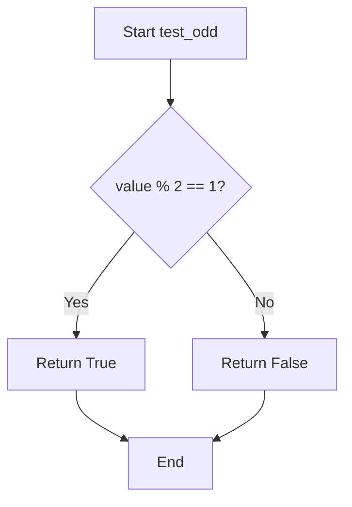

## Examples:
    # Basic usage
    >>> test_odd(3)
    True
    >>> test_odd(4)
    False
    >>> test_odd(-1)
    True
    >>> test_odd(0)
    False
```

## `src.jinja2.tests.test_even` · *function*

## Summary:
Determines whether an integer value is evenly divisible by two.

## Description:
This function evaluates whether a given integer is an even number by checking if it is divisible by 2 with no remainder. It serves as a utility predicate commonly used in template testing scenarios where conditional logic needs to distinguish between even and odd integers.

## Args:
    value (int): The integer to test for evenness. Must be a whole number.

## Returns:
    bool: True if the value is evenly divisible by 2 (i.e., the value is even), False otherwise.

## Raises:
    No exceptions are raised by this function under normal operation.

## Constraints:
    Preconditions:
        - The input value must be an integer type (or convertible to integer)
        - The function assumes integer arithmetic
    
    Postconditions:
        - The return value is always a boolean (True or False)
        - The result accurately reflects mathematical parity of the input

## Side Effects:
    None - this function has no observable side effects beyond returning a boolean value.

## Control Flow:
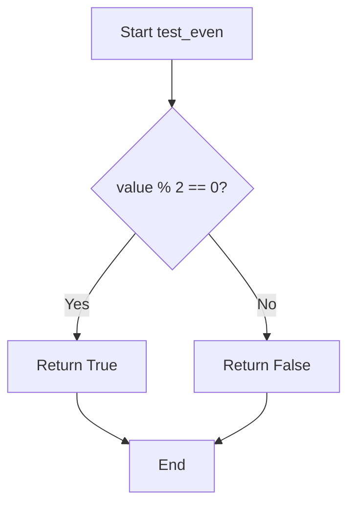

## Examples:
    >>> test_even(4)
    True
    >>> test_even(7)
    False
    >>> test_even(0)
    True
    >>> test_even(-2)
    True
    >>> test_even(-3)
    False
```

## `src.jinja2.tests.test_divisibleby` · *function*

## Summary:
Checks whether one integer is evenly divisible by another integer.

## Description:
This function determines if the dividend value is perfectly divisible by the divisor number, returning a boolean result indicating the divisibility relationship. It's designed as a reusable test utility for validating numerical divisibility conditions in template rendering and expression evaluation contexts.

## Args:
    value (int): The dividend to be tested for divisibility, must be an integer.
    num (int): The divisor used to test divisibility, must be a non-zero integer.

## Returns:
    bool: True if value is evenly divisible by num (i.e., value % num == 0), False otherwise.

## Raises:
    ZeroDivisionError: When num is zero, as division by zero is undefined in the modulo operation.

## Constraints:
    Preconditions:
        - Both value and num must be integers
        - num must not be zero to avoid division by zero error
    Postconditions:
        - Returns a boolean value (True or False)
        - The mathematical relationship value = num * quotient + remainder holds where remainder is 0

## Side Effects:
    None: This function has no side effects and is purely computational.

## Control Flow:
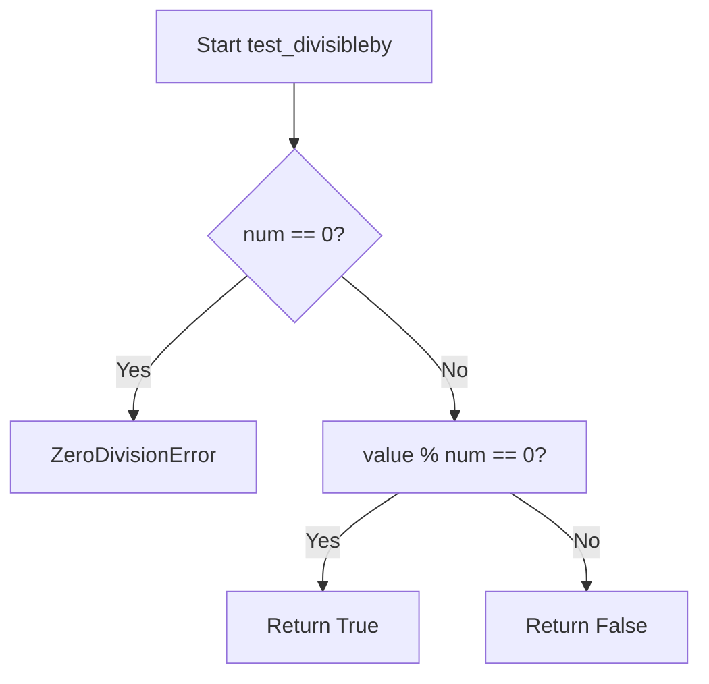

## Examples:
    # Basic usage
    test_divisibleby(10, 2)  # Returns True (10 is divisible by 2)
    test_divisibleby(10, 3)  # Returns False (10 is not divisible by 3)
    test_divisibleby(15, 5)  # Returns True (15 is divisible by 5)
    
    # Edge cases
    test_divisibleby(0, 5)   # Returns True (0 is divisible by any non-zero number)
    test_divisibleby(7, 7)   # Returns True (any number is divisible by itself)
    
    # Error case
    test_divisibleby(10, 0)  # Raises ZeroDivisionError (division by zero)

## `src.jinja2.tests.test_defined` · *function*

## Summary:
Tests whether a value is defined (not undefined) in Jinja2 templates.

## Description:
This function serves as a template test that determines if a given value is not an instance of the Undefined class. It is commonly used in Jinja2 template conditionals to check variable existence or initialization status before accessing them. This test is particularly useful for handling optional template variables that may not be defined in the template context.

## Args:
    value (Any): The value to test for definition status. Can be any Python object including Undefined instances. The typing annotation uses `t.Any` which refers to the typing module's Any type.

## Returns:
    bool: Returns True if the value is not an instance of Undefined, indicating the value is defined. Returns False if the value is an instance of Undefined, indicating the value is undefined.

## Raises:
    None: This function does not raise any exceptions.

## Constraints:
    Preconditions: The function accepts any Python object as input.
    Postconditions: The return value is always a boolean (True or False).

## Side Effects:
    None: This function has no side effects and is purely a predicate test.

## Control Flow:
```mermaid
flowchart TD
    A[Input value] --> B{isinstance(value, Undefined)?}
    B -- Yes --> C[Return False]
    B -- No --> D[Return True]
    C --> E[End]
    D --> E
```

## Examples:
```python
# In a Jinja2 template context:

    {{ variable }}

    Variable is not defined


# Direct usage:
result = test_defined(some_value)  # Returns True if defined, False if undefined

# Usage with undefined values:
from jinja2.runtime import Undefined
undefined_var = Undefined()
test_defined(undefined_var)  # Returns False
test_defined("defined_value")  # Returns True
```

## `src.jinja2.tests.test_undefined` · *function*

## Summary:
Checks whether a given value is an instance of the Undefined class, indicating an undefined template variable.

## Description:
This utility function determines if a provided value represents an undefined template variable in Jinja2. It is commonly used in template rendering contexts where variables might not be defined, allowing templates to handle such cases gracefully.

## Args:
    value (Any): The value to test for undefined status. Can be any Python object.

## Returns:
    bool: True if the value is an instance of Undefined class, False otherwise.

## Raises:
    None: This function does not raise any exceptions.

## Constraints:
    Preconditions: The function accepts any Python object as input.
    Postconditions: Always returns a boolean value (True or False).

## Side Effects:
    None: This function has no side effects and is purely a type checking operation.

## Control Flow:
```mermaid
flowchart TD
    A[Input value] --> B{isinstance(value, Undefined)?}
    B -- Yes --> C[Return True]
    B -- No --> D[Return False]
```

## Examples:
    >>> from runtime import Undefined
    >>> test_undefined(Undefined())
    True
    >>> test_undefined("defined_value")
    False
    >>> test_undefined(None)
    False

## `src.jinja2.tests.test_filter` · *function*

## Summary:
Tests whether a given filter name exists in the Jinja2 environment's filter registry.

## Description:
This function checks if a specified filter name is registered in the Jinja2 environment's collection of available filters. It serves as a validation mechanism to determine filter availability before attempting to use it in template processing.

## Args:
    env (Environment): The Jinja2 environment instance containing filter registrations
    value (str): The name of the filter to test for existence

## Returns:
    bool: True if the filter name exists in env.filters, False otherwise

## Raises:
    None explicitly raised

## Constraints:
    Preconditions:
    - env must be a valid Environment instance
    - env.filters must be a collection that supports the 'in' operator (such as dict, set, or list)
    - value must be a string

    Postconditions:
    - The function does not modify the environment or any of its attributes
    - The function returns a boolean value indicating membership status

## Side Effects:
    None

## Control Flow:
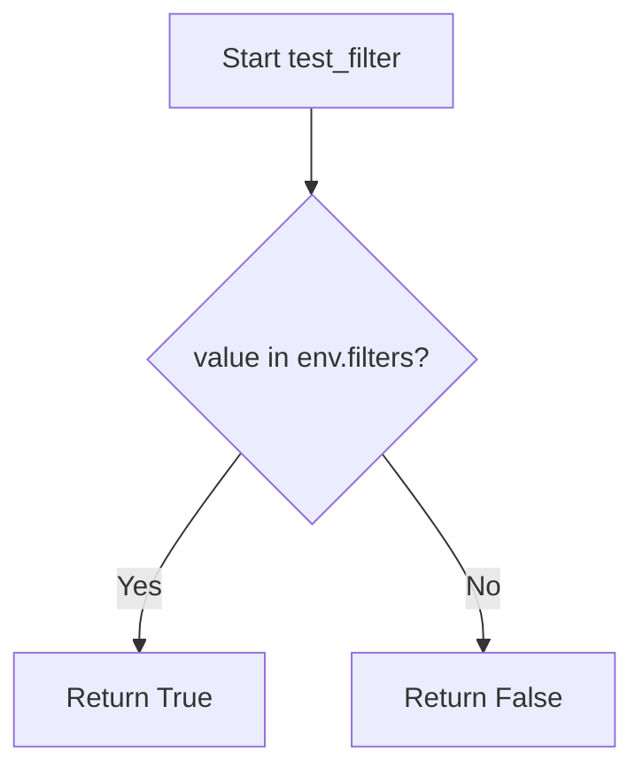

## Examples:
    # Check if 'upper' filter exists
    result = test_filter(environment, 'upper')  # Returns True if 'upper' is registered
    
    # Check if custom filter exists
    result = test_filter(environment, 'custom_filter')  # Returns True/False based on registration

## `src.jinja2.tests.test_test` · *function*

## Summary:
Checks whether a given test name exists in the environment's test registry.

## Description:
This function determines if a specified test name is registered in the Jinja2 environment's test collection. It serves as a utility for validating test names before attempting to use them in template processing.

## Args:
    env (Environment): The Jinja2 environment instance containing registered tests
    value (str): The name of the test to check for existence

## Returns:
    bool: True if the test name exists in env.tests, False otherwise

## Raises:
    None explicitly raised

## Constraints:
    Preconditions:
        - env must be a valid Environment instance
        - env.tests must be a collection supporting the 'in' operator (e.g., dict, set, list)
        - value must be a string

    Postconditions:
        - Returns a boolean value indicating membership status
        - Does not modify the environment or test registry

## Side Effects:
    None

## Control Flow:
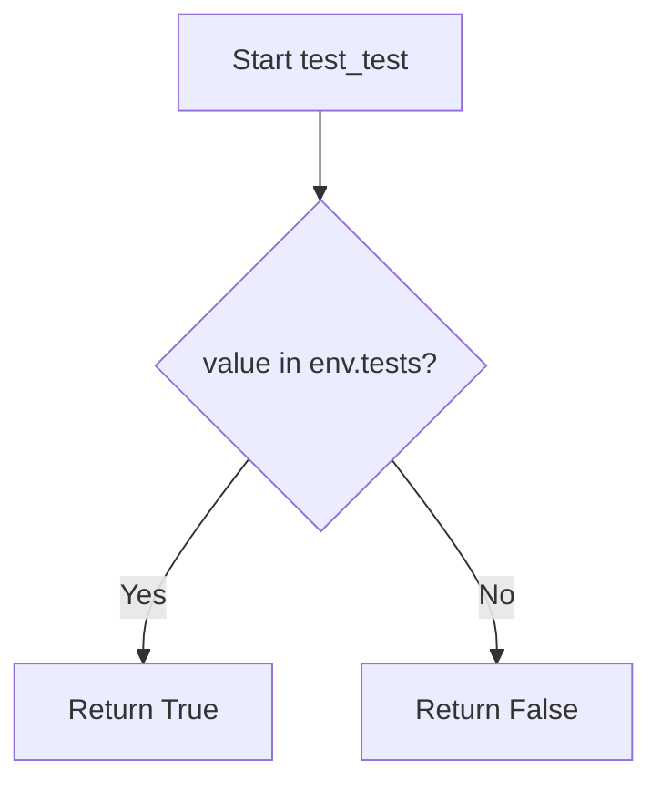

## Examples:
```python
# Check if 'equalto' test exists
result = test_test(environment, 'equalto')  # Returns True if 'equalto' is registered

# Check if non-existent test exists
result = test_test(environment, 'nonexistent')  # Returns False
```

## `src.jinja2.tests.test_none` · *function*

## Summary:
Checks whether a given value is explicitly None.

## Description:
This function performs an identity check to determine if the provided value is the None singleton. It is commonly used in Jinja2 templates to test for null values in conditional expressions.

## Args:
    value (Any): The value to test for None equality. Can be any Python object or None.

## Returns:
    bool: True if the value is None, False otherwise.

## Raises:
    None: This function does not raise any exceptions.

## Constraints:
    Preconditions: The function accepts any Python object as input.
    Postconditions: The return value is always a boolean (True or False).

## Side Effects:
    None: This function has no side effects and is pure.

## Control Flow:
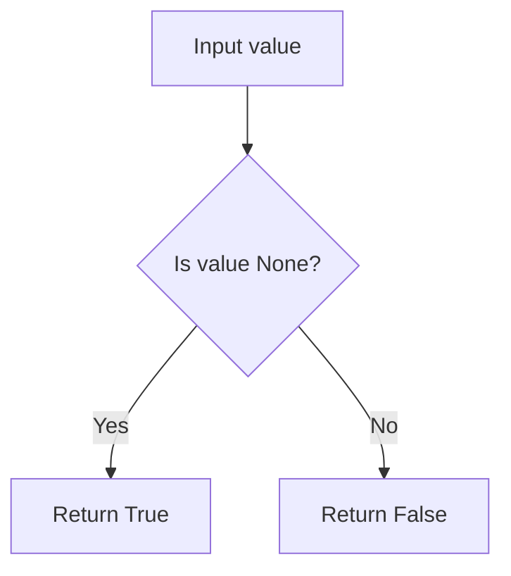

## Examples:
    # Basic usage in template context
    {{ if test_none(some_variable) }}  # Returns True if some_variable is None
    
    # Direct function calls
    test_none(None)        # Returns True
    test_none("")          # Returns False
    test_none(0)           # Returns False
    test_none([])          # Returns False
```

## `src.jinja2.tests.test_boolean` · *function*

## Summary:
Tests whether a value is exactly the boolean literal True or False.

## Description:
Determines if the provided value is identical to the boolean literals True or False using identity comparison. This function is used in Jinja2's template testing system to validate boolean values specifically.

## Args:
    value (Any): The value to test for boolean identity. Can be any Python object.

## Returns:
    bool: True if value is exactly True or exactly False (using identity comparison), False otherwise.

## Raises:
    None: This function does not raise any exceptions.

## Constraints:
    Preconditions: The function accepts any Python object as input.
    Postconditions: The return value is always a boolean (True or False).

## Side Effects:
    None: This function has no side effects.

## Control Flow:
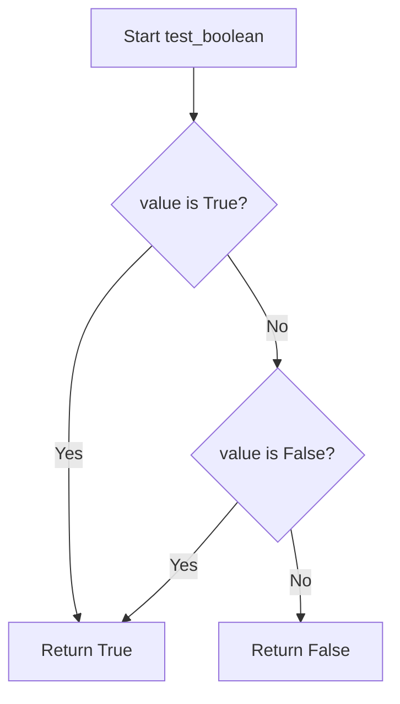

## Examples:
    >>> test_boolean(True)
    True
    >>> test_boolean(False)
    True
    >>> test_boolean(1)
    False
    >>> test_boolean(0)
    False
    >>> test_boolean("True")
    False
```

## `src.jinja2.tests.test_false` · *function*

## Summary:
Tests whether a value is exactly the boolean False constant using identity comparison.

## Description:
This function performs an identity check (using the `is` operator) to determine if the provided value is exactly the Python boolean False object. Unlike equality comparison (`==`), this function distinguishes between False and other falsy values like 0, empty string, or None. It is commonly used in Jinja2 template testing to specifically identify the boolean False value.

## Args:
    value (Any): The value to test for being exactly False. Can be any Python object.

## Returns:
    bool: True if the value is exactly False (the singleton boolean object), False otherwise.

## Raises:
    None: This function does not raise any exceptions.

## Constraints:
    Preconditions: The function accepts any Python object as input.
    Postconditions: The return value is always a boolean (True or False).

## Side Effects:
    None: This function has no side effects.

## Control Flow:
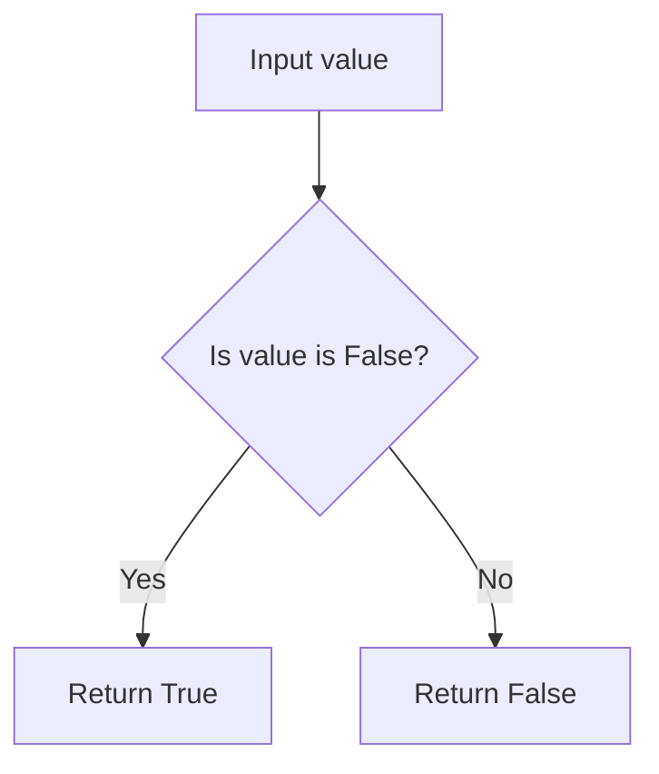

## Examples:
    >>> test_false(False)
    True
    >>> test_false(0)
    False
    >>> test_false("")
    False
    >>> test_false(None)
    False
    >>> test_false(True)
    False
```

## `src.jinja2.tests.test_true` · *function*

## Summary:
Checks if a value is identical to the boolean True constant.

## Description:
This function performs an identity comparison to determine if the provided value is exactly the Python `True` singleton object. Unlike equality comparison (`==`), this function will return False for truthy values like `1`, `"hello"`, or `[1,2,3]`, even though they are considered truthy in Python.

## Args:
    value (Any): The value to test for identity with the boolean True constant.

## Returns:
    bool: True if the value is identical to `True`, False otherwise.

## Raises:
    None: This function does not raise any exceptions.

## Constraints:
    Preconditions: The function accepts any type of input value.
    Postconditions: The return value is always a boolean (True or False).

## Side Effects:
    None: This function has no side effects.

## Control Flow:
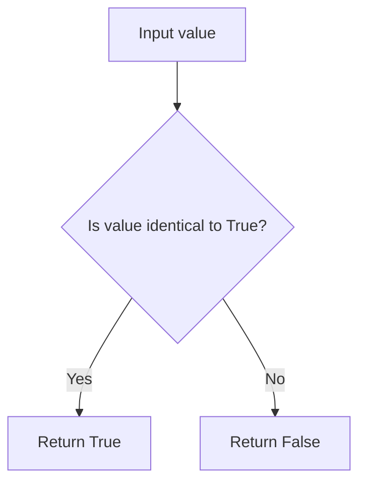

## Examples:
    # Basic usage
    test_true(True)        # Returns True
    test_true(False)       # Returns False
    test_true(1)           # Returns False
    test_true("hello")     # Returns False
    test_true([])          # Returns False
```

## `src.jinja2.tests.test_integer` · *function*

## Summary:
Determines whether a value is an integer type while excluding boolean values.

## Description:
Checks if a given value is an instance of the int type, but specifically excludes Python's boolean values True and False, which are technically instances of int but should be treated as boolean types in most contexts.

## Args:
    value (Any): The value to test for integer type membership.

## Returns:
    bool: True if the value is an integer type (int) and not a boolean (True/False); False otherwise.

## Raises:
    None: This function does not raise any exceptions.

## Constraints:
    Preconditions: The function accepts any Python object as input.
    Postconditions: The return value is always a boolean indicating the result of the type check.

## Side Effects:
    None: This function has no side effects.

## Control Flow:
```mermaid
flowchart TD
    A[Start test_integer] --> B{isinstance(value, int)?}
    B -- No --> C[Return False]
    B -- Yes --> D{value is True?}
    D -- Yes --> E[Return False]
    D -- No --> F{value is False?}
    F -- Yes --> G[Return False]
    F -- No --> H[Return True]
```

## Examples:
    >>> test_integer(42)
    True
    >>> test_integer(True)
    False
    >>> test_integer(False)
    False
    >>> test_integer(3.14)
    False
    >>> test_integer("123")
    False
```

## `src.jinja2.tests.test_float` · *function*

## Summary:
Checks whether a given value is of type float.

## Description:
This function performs a type check to determine if the provided value is specifically an instance of Python's float type. It is commonly used in Jinja2 template rendering to conditionally process numeric values or validate input data types.

## Args:
    value (Any): The value to be tested for float type membership. Can be any Python object.

## Returns:
    bool: True if the value is an instance of float, False otherwise.

## Raises:
    None: This function does not raise any exceptions.

## Constraints:
    Preconditions: The function accepts any Python object as input.
    Postconditions: The return value is always a boolean (True or False).

## Side Effects:
    None: This function has no side effects and is purely functional.

## Control Flow:
```mermaid
flowchart TD
    A[Start test_float] --> B{isinstance(value, float)?}
    B -- Yes --> C[Return True]
    B -- No --> D[Return False]
```

## Examples:
```python
# Basic usage
result = test_float(3.14)      # Returns True
result = test_float(42)        # Returns False
result = test_float("3.14")    # Returns False
result = test_float(None)      # Returns False
```

## `src.jinja2.tests.test_lower` · *function*

## Summary:
Checks if a string representation of a value contains only lowercase characters.

## Description:
This function converts the input value to a string and determines whether all alphabetic characters in the string are lowercase. It's commonly used in Jinja2 template tests to validate string formatting requirements.

## Args:
    value: The input value to test. Can be any type that can be converted to a string.

## Returns:
    bool: True if the string representation contains only lowercase letters, False otherwise. Empty strings return True.

## Raises:
    None

## Constraints:
    Precondition: The input value can be converted to a string using str().
    Postcondition: Always returns a boolean value indicating lowercase status.

## Side Effects:
    None

## Control Flow:
```mermaid
flowchart TD
    A[Input value] --> B{Convert to str}
    B --> C{Check islower()}
    C --> D[Return result]
```

## Examples:
    >>> test_lower("hello")
    True
    >>> test_lower("Hello")
    False
    >>> test_lower("HELLO")
    False
    >>> test_lower("")
    True
    >>> test_lower(123)
    False
```

## `src.jinja2.tests.test_upper` · *function*

## Summary:
Checks if a string value consists entirely of uppercase characters.

## Description:
This function validates whether the provided value, when converted to a string, contains only uppercase letters. It's designed as a test filter for Jinja2 templating engine to evaluate string case properties.

## Args:
    value: The input value to test for uppercase characters. Can be any type that can be converted to string.

## Returns:
    bool: True if the string representation of value contains only uppercase characters and is not empty; False otherwise.

## Raises:
    None: This function does not raise any exceptions.

## Constraints:
    Preconditions: The function accepts any input that can be converted to string via str().
    Postconditions: The return value is always a boolean indicating the uppercase status of the string representation.

## Side Effects:
    None: This function has no side effects and is pure.

## Control Flow:
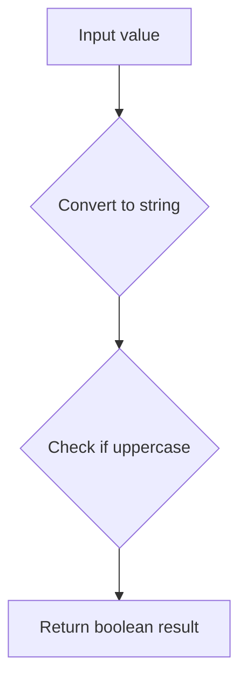

## Examples:
    >>> test_upper("HELLO")
    True
    >>> test_upper("Hello")
    False
    >>> test_upper("hello")
    False
    >>> test_upper("")
    False
    >>> test_upper(123)
    False
```

## `src.jinja2.tests.test_mapping` · *function*

## Summary:
Tests whether a value is a mapping type (such as dict, OrderedDict, or other dictionary-like objects).

## Description:
This utility function determines if the provided value implements the collections.abc.Mapping interface, making it suitable for dictionary-like operations. It's commonly used in Jinja2 template rendering to check if a variable can be treated as a key-value store.

## Args:
    value (Any): The object to test for mapping compatibility

## Returns:
    bool: True if the value implements collections.abc.Mapping interface, False otherwise

## Raises:
    None

## Constraints:
    Preconditions: None
    Postconditions: Always returns a boolean value

## Side Effects:
    None

## Control Flow:
```mermaid
flowchart TD
    A[Start test_mapping] --> B{isinstance(value, abc.Mapping)?}
    B -->|Yes| C[Return True]
    B -->|No| D[Return False]
```

## Examples:
    # Testing with dictionary
    result = test_mapping({'a': 1, 'b': 2})  # Returns True
    
    # Testing with non-mapping
    result = test_mapping([1, 2, 3])  # Returns False
    
    # Testing with string
    result = test_mapping("hello")  # Returns False
```

## `src.jinja2.tests.test_number` · *function*

## Summary:
Determines whether a given value is a numeric type according to Python's numbers.Number abstract base class.

## Description:
This utility function performs a type check to identify if a value is a numeric type. It leverages Python's standard `numbers.Number` abstract base class to recognize various numeric types including integers, floats, complex numbers, and custom numeric types that inherit from Number.

The function is typically used in template rendering contexts where type checking is needed to determine appropriate formatting or mathematical operations.

## Args:
    value (Any): The value to test for numeric type compatibility

## Returns:
    bool: True if the value is an instance of numbers.Number, False otherwise

## Raises:
    None: This function does not raise any exceptions

## Constraints:
    Preconditions: The function accepts any Python object as input
    Postconditions: Always returns a boolean value (True or False)

## Side Effects:
    None: This function has no side effects and is pure

## Control Flow:
```mermaid
flowchart TD
    A[Start test_number] --> B{isinstance(value, Number)?}
    B -->|Yes| C[Return True]
    B -->|No| D[Return False]
```

## Examples:
```python
# Basic usage
test_number(42)        # Returns True
test_number(3.14)      # Returns True
test_number(1+2j)      # Returns True
test_number("42")      # Returns False
test_number([1,2,3])   # Returns False
```

## `src.jinja2.tests.test_sequence` · *function*

## Summary:
Tests whether a value supports sequence operations like length calculation and item indexing.

## Description:
Determines if a given value implements the sequence protocol by verifying it has both a `len()` method and a `__getitem__` method. This function is used internally to identify sequence-like objects in template processing contexts.

## Args:
    value (Any): The object to test for sequence compatibility

## Returns:
    bool: True if the value has both `len()` and `__getitem__` methods, False otherwise

## Raises:
    None: This function catches all exceptions and returns False gracefully

## Constraints:
    Preconditions: None
    Postconditions: Always returns a boolean value

## Side Effects:
    None: This function performs no I/O operations or state mutations

## Control Flow:
```mermaid
flowchart TD
    A[Start test_sequence] --> B{Can call len(value)?}
    B -- No --> C[Return False]
    B -- Yes --> D{Can call value.__getitem__?}
    D -- No --> E[Return False]
    D -- Yes --> F[Return True]
```

## Examples:
    >>> test_sequence([1, 2, 3])
    True
    >>> test_sequence("hello")
    True
    >>> test_sequence(42)
    False
    >>> test_sequence({})
    False
```

## `src.jinja2.tests.test_sameas` · *function*

## Summary:
Tests whether two values refer to the exact same object in memory.

## Description:
This function implements the `sameas` test for Jinja2 templates, which determines if two variables reference the identical object in memory rather than just having equal values. It uses Python's identity operator (`is`) to perform this comparison.

## Args:
    value (Any): The first object to compare
    other (Any): The second object to compare

## Returns:
    bool: True if both parameters reference the exact same object in memory, False otherwise

## Raises:
    None

## Constraints:
    Preconditions: Both arguments can be any Python objects
    Postconditions: Always returns a boolean value

## Side Effects:
    None

## Control Flow:
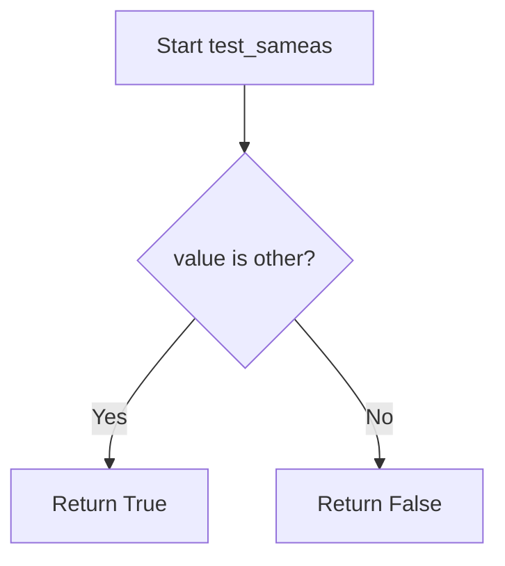

## Examples:
    # Testing identity with the same object
    {{ value is sameas(other) }}  # Returns True if value and other are the same object
    
    # Testing identity with different objects
    {{ [1,2,3] is sameas([1,2,3]) }}  # Returns False (different list objects)
    
    # Testing identity with None
    {{ value is sameas(None) }}  # Returns True if value is None
```

## `src.jinja2.tests.test_iterable` · *function*

## Summary:
Determines whether a given value is iterable by attempting to create an iterator from it.

## Description:
This function tests if a value can be iterated over by calling Python's built-in `iter()` function. If the call raises a `TypeError`, the value is not iterable and the function returns `False`. Otherwise, it returns `True`. This is commonly used in Jinja2 templates to check if a variable can be looped over.

## Args:
    value (Any): The value to test for iterability. Can be any Python object.

## Returns:
    bool: `True` if the value is iterable, `False` otherwise.

## Raises:
    None: This function does not raise exceptions directly, though it may internally raise `TypeError` when calling `iter()` which is caught and handled.

## Constraints:
    Preconditions: The function accepts any Python object as input.
    Postconditions: The function always returns a boolean value (`True` or `False`).

## Side Effects:
    None: This function has no side effects beyond the standard Python operation of calling `iter()`.

## Control Flow:
```mermaid
flowchart TD
    A[Start test_iterable] --> B{Can call iter()?}
    B -- Yes --> C[Return True]
    B -- No --> D[Return False]
```

## Examples:
    >>> test_iterable([1, 2, 3])
    True
    >>> test_iterable("hello")
    True
    >>> test_iterable(42)
    False
    >>> test_iterable(None)
    False
```

## `src.jinja2.tests.test_escaped` · *function*

## Summary:
Checks if a value has an HTML escape method, indicating it's already escaped for safe template rendering.

## Description:
This function determines whether a given value has been marked as HTML-safe by checking for the presence of a `__html__` method. In Jinja2 templating, values with this method are considered to be already escaped and should not be escaped again when rendered in templates.

## Args:
    value (Any): The value to test for HTML escaping status. Can be any Python object.

## Returns:
    bool: True if the value has a `__html__` method, False otherwise. This indicates whether the value is considered HTML-safe.

## Raises:
    None: This function does not raise any exceptions.

## Constraints:
    Preconditions: The function accepts any Python object as input.
    Postconditions: Always returns a boolean value (True or False).

## Side Effects:
    None: This function performs no I/O operations or state mutations.

## Control Flow:
```mermaid
flowchart TD
    A[Start test_escaped] --> B{Has __html__ attribute?}
    B -->|Yes| C[Return True]
    B -->|No| D[Return False]
```

## Examples:
    # Testing with a regular string
    result = test_escaped("Hello World")  # Returns False
    
    # Testing with an HTML-escaped value
    class SafeString:
        def __html__(self):
            return "<b>Hello</b>"
    
    safe_value = SafeString()
    result = test_escaped(safe_value)  # Returns True
```

## `src.jinja2.tests.test_in` · *function*

## Summary:
Checks if a value exists within a container or sequence for template testing purposes.

## Description:
Implements the membership test operator ('in') for Jinja2 template testing. This function determines whether a given value is contained within a sequence, container, or iterable object. It serves as a test helper function that can be used within Jinja2 templates or test assertions to verify membership conditions.

## Args:
    value (Any): The value to search for within the sequence. Can be of any type.
    seq (Container): The container, sequence, or iterable to search within. Must support the 'in' operator.

## Returns:
    bool: True if value is found within seq, False otherwise.

## Raises:
    None: This function does not explicitly raise exceptions, though underlying container operations may raise exceptions.

## Constraints:
    Preconditions:
    - The seq parameter must support the 'in' operator (implement __contains__ method)
    - Both parameters should be compatible with Python's 'in' operator semantics
    
    Postconditions:
    - Returns a boolean value indicating membership status
    - Does not modify either input parameter

## Side Effects:
    None: This function has no side effects and is pure.

## Control Flow:
```mermaid
flowchart TD
    A[Start test_in] --> B{value in seq?}
    B -->|True| C[Return True]
    B -->|False| D[Return False]
```

## Examples:
    # Basic usage in template context
    # {{ 'a' in ['a', 'b', 'c'] }}  # Returns True
    
    # Using in test assertions
    # assert test_in('x', 'abc') == False
    # assert test_in(2, [1, 2, 3]) == True
```

