# `utils.py`

## `src.jinja2.utils.pass_context` · *function*

## Summary:
Decorator that marks a function to receive the template context as an argument when invoked in Jinja2 templates.

## Description:
The `pass_context` decorator is used to indicate that a Jinja2 template function or filter should receive the template context object as its first argument. When applied to a function, it sets an internal attribute (`jinja_pass_arg`) that tells the Jinja2 template engine to pass the context object when executing the function.

This decorator enables functions to access template variables, global variables, and other context information during template rendering, making them more powerful and flexible for template-based operations.

## Args:
    f (F): The function to be decorated, where F is a generic type representing any callable object.

## Returns:
    F: The same function object, unchanged except for having the `jinja_pass_arg` attribute set to `_PassArg.context`.

## Raises:
    None: This function does not raise any exceptions.

## Constraints:
    Preconditions:
    - The input `f` must be a callable object (function, method, or callable instance)
    - The function should be designed to accept the context object as its first argument
    
    Postconditions:
    - The returned function maintains identical behavior to the input function
    - The returned function has the attribute `jinja_pass_arg` set to `_PassArg.context`

## Side Effects:
    None: This function does not perform any I/O operations or mutate external state. It only modifies the function object in-place by adding an attribute.

## Control Flow:
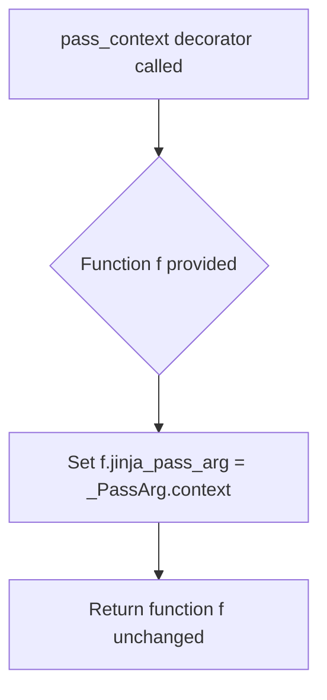

## Examples:
```python
# Basic usage
@pass_context
def my_filter(value, context):
    # Function receives the template context as second argument
    return value.upper() + str(context.get('some_var', 0))

# Alternative usage (less common)
def my_function(value):
    return value * 2

my_function = pass_context(my_function)
```

## `src.jinja2.utils.pass_eval_context` · *function*

## Summary:
Decorator that marks a function to receive the Jinja2 evaluation context during template processing.

## Description:
This decorator is used to indicate that a function should receive the Jinja2 evaluation context as its first argument when called during template rendering. It sets the `jinja_pass_arg` attribute on the decorated function to `_PassArg.eval_context`, which informs the Jinja2 template engine about the function's argument requirements.

This is part of Jinja2's mechanism for allowing template functions to access contextual information during evaluation, such as variable bindings, configuration settings, or other runtime state.

## Args:
    f (F): A callable object (function) to be decorated. The type F represents a generic callable type that will be returned unchanged except for the addition of metadata.

## Returns:
    F: The same callable object with the `jinja_pass_arg` attribute set to `_PassArg.eval_context`.

## Raises:
    None explicitly raised by this function.

## Constraints:
    Preconditions:
    - The argument `f` must be a callable object
    - The identifier `_PassArg` must be available in the scope where this decorator is used
    - The attribute `_PassArg.eval_context` must be defined
    
    Postconditions:
    - The returned object is identical to the input `f`
    - The `jinja_pass_arg` attribute is added to `f` with the value `_PassArg.eval_context`

## Side Effects:
    None - This function only adds metadata (an attribute) to the input function.

## Control Flow:
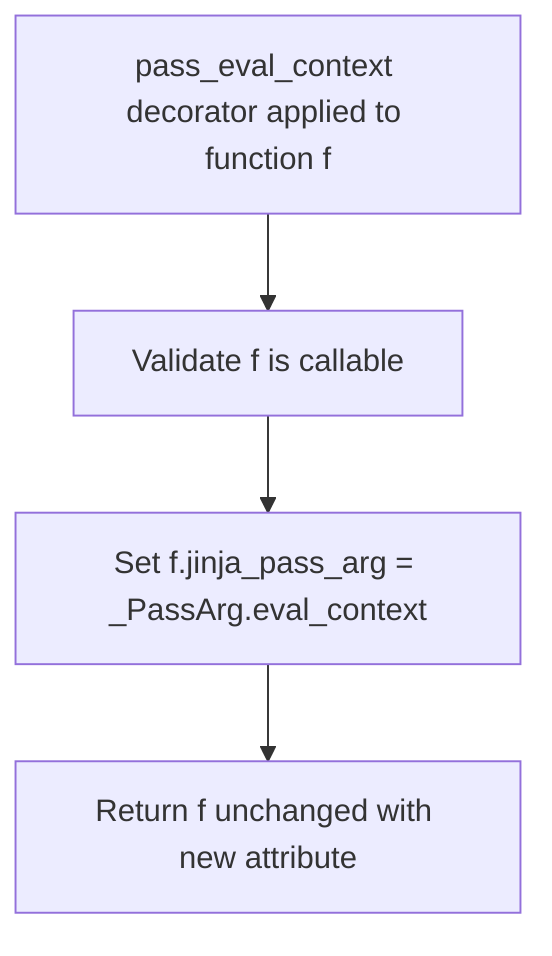

## Examples:
```python
@pass_eval_context
def get_variable_value(context, var_name):
    # This function will receive the evaluation context as first argument
    # when called from a Jinja2 template
    return context.get(var_name, None)

# In a Jinja2 template:
# {{ get_variable_value('username') }}
# The template engine will pass the evaluation context as the first argument
```

## `src.jinja2.utils.pass_environment` · *function*

## Summary:
Decorator that marks a function to receive the Jinja2 environment argument during template rendering.

## Description:
This decorator is used in Jinja2's template execution system to indicate that a function should receive the Jinja2 environment object as its first argument when called during template rendering. It sets an internal attribute on the decorated function to signal this requirement to the Jinja2 runtime engine.

## Args:
    f (F): A callable function or method to be decorated. The type F represents a generic callable type that accepts any number of arguments.

## Returns:
    F: The same function passed in, with the `jinja_pass_arg` attribute set to indicate environment passing requirements.

## Raises:
    None explicitly raised by this function.

## Constraints:
    Preconditions:
    - The input `f` must be a callable object (function, method, or callable instance)
    - The `_PassArg` enumeration and its `environment` member must be defined elsewhere in the Jinja2 codebase
    
    Postconditions:
    - The returned function retains all original functionality
    - The returned function has a `jinja_pass_arg` attribute set to `_PassArg.environment`
    - The attribute indicates to Jinja2's runtime that this function expects environment injection

## Side Effects:
    None - This function only modifies the metadata of the input function by setting an attribute.

## Control Flow:
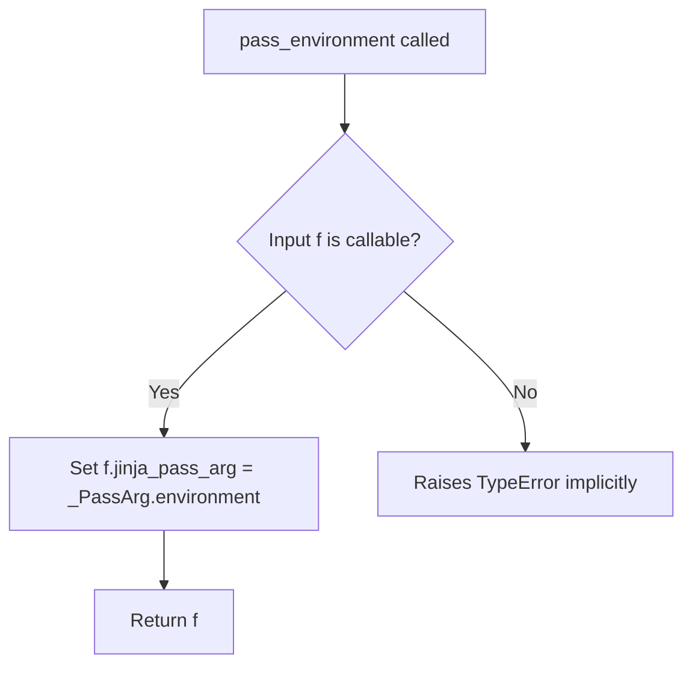

## Examples:
```python
@pass_environment
def get_global_value(context, environment):
    # This function will receive the Jinja2 environment automatically
    return environment.globals.get('some_value')

# In Jinja2 template context:
# When this function is called during template rendering,
# Jinja2 will inject the environment as the second argument
```

## `src.jinja2.utils._PassArg` · *class*

## Summary:
An enumeration defining argument passing modes for Jinja2 template functions and filters.

## Description:
The `_PassArg` enum specifies three different contexts in which arguments can be passed to Jinja2 template functions and filters. This is used internally by the Jinja2 template engine to determine how to handle argument passing when executing template code. The enum values represent different levels of contextual information that can be made available to template functions.

## State:
- `context`: Represents passing the template context object
- `eval_context`: Represents passing the evaluation context object  
- `environment`: Represents passing the template environment object

All enum values are created using `enum.auto()` and have no associated data.

## Lifecycle:
- Creation: Enum values are automatically created at class definition time
- Usage: Typically accessed via the `from_obj` class method to extract from callable objects
- Destruction: Managed automatically by Python's enum mechanism

## Method Map:
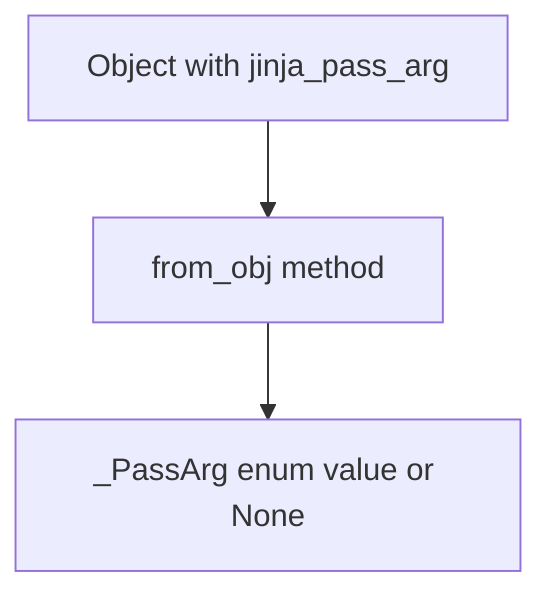

## Raises:
- No exceptions are raised by the enum itself
- The `from_obj` method may return `None` if the object doesn't have a `jinja_pass_arg` attribute

## Example:
```python
# Creating a function with explicit pass arg
def my_filter(value, context=None):
    my_filter.jinja_pass_arg = _PassArg.context
    return value.upper()

# Using the enum
arg_type = _PassArg.from_obj(my_filter)  # Returns _PassArg.context
```

### `src.jinja2.utils._PassArg.from_obj` · *method*

## Summary:
Retrieves a `_PassArg` enum value from an object if it has a `jinja_pass_arg` attribute.

## Description:
This class method serves as a utility to extract a `_PassArg` enum value from an object that possesses a `jinja_pass_arg` attribute. It's designed to provide a standardized way to access pass arguments in Jinja2 template processing contexts. The method checks if the provided object has the `jinja_pass_arg` attribute using `hasattr()`, and if present, returns its value. This allows for flexible handling of objects that may or may not have pass argument metadata.

## Args:
    obj: Any object that may or may not have a `jinja_pass_arg` attribute.

## Returns:
    `_PassArg` enum value if the object has a `jinja_pass_arg` attribute, otherwise `None`.

## Raises:
    None explicitly raised.

## State Changes:
    Attributes READ: None - this method only reads the object's attributes via `hasattr()` and attribute access.
    Attributes WRITTEN: None - this method doesn't modify any attributes.

## Constraints:
    Preconditions: The `obj` parameter can be any Python object.
    Postconditions: Returns either a `_PassArg` enum value or `None` based on the presence of the `jinja_pass_arg` attribute.

## Side Effects:
    None - this method performs only attribute checking and access without any I/O operations or external service calls.

## `src.jinja2.utils.internalcode` · *function*

## Summary:
Decorator that tracks function code objects as internal implementations within the Jinja2 system.

## Description:
This decorator serves as a marker for internal implementation functions within the Jinja2 template engine. When applied to a function, it records the function's underlying code object in a global tracking collection called `internal_code`. This allows the system to identify and potentially filter out internal functions from certain operations such as debugging, introspection, or API exposure.

The decorator is typically applied to helper functions, internal utilities, or implementation details that should remain hidden from public interfaces or user-facing operations.

## Args:
    f (callable): A callable object (function, method, etc.) to be marked as internal. The decorator expects any callable that has a `__code__` attribute.

## Returns:
    callable: The same callable object passed as input, unchanged but now tracked as internal.

## Raises:
    None: This decorator does not raise exceptions directly.

## Constraints:
    Preconditions:
    - The input `f` must be a callable object that has a `__code__` attribute
    - The global variable `internal_code` must be initialized as a mutable collection (such as a set) that supports the `add()` method
    
    Postconditions:
    - The code object of the function is added to the `internal_code` collection
    - The returned callable is identical to the input callable

## Side Effects:
    - Mutates the global `internal_code` collection by adding the function's code object
    - No other side effects beyond the tracking mechanism

## Control Flow:
```mermaid
flowchart TD
    A[Call internalcode(f)] --> B{f has __code__?}
    B -- Yes --> C[Get f.__code__]
    C --> D[Add f.__code__ to internal_code]
    D --> E[Return f]
    B -- No --> F[AttributeError if __code__ missing]
```

## Examples:
```python
# Basic usage
@internalcode
def my_internal_helper():
    return "internal result"

# Function is decorated and tracked internally
result = my_internal_helper()  # Returns "internal result"
```

## `src.jinja2.utils.is_undefined` · *function*

## Summary:
Checks whether an object is an instance of Jinja2's Undefined class.

## Description:
Determines if the provided object is an instance of the Undefined class from Jinja2's runtime module. This utility function is commonly used in template rendering contexts where undefined variables or attributes need to be identified and handled appropriately.

## Args:
    obj (Any): The object to test for being undefined. Can be any Python object.

## Returns:
    bool: True if the object is an instance of Undefined, False otherwise.

## Raises:
    None: This function does not raise any exceptions.

## Constraints:
    Preconditions: The function accepts any Python object as input.
    Postconditions: Always returns a boolean value (True or False).

## Side Effects:
    None: This function has no side effects.

## Control Flow:
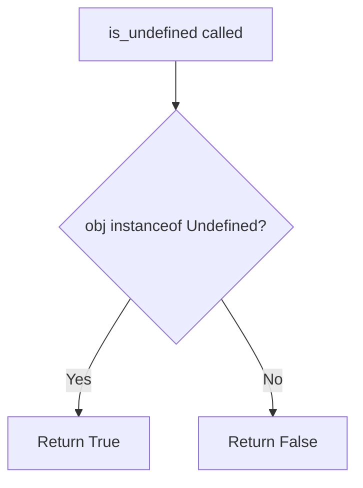

## Examples:
```python
# Basic usage
from jinja2.runtime import Undefined
from jinja2.utils import is_undefined

# Test with an Undefined instance
undefined_var = Undefined()
result = is_undefined(undefined_var)  # Returns True

# Test with regular objects
result = is_undefined("hello")  # Returns False
result = is_undefined(42)       # Returns False
result = is_undefined(None)     # Returns False
```

## `src.jinja2.utils.consume` · *function*

## Summary:
Discards all elements from an iterable without performing any operations on them.

## Description:
This utility function iterates through the provided iterable and discards each element, effectively consuming the entire sequence. It's commonly used to process iterables when the actual values are not needed, but the iteration itself is required for side effects or to exhaust generators.

## Args:
    iterable (t.Iterable[t.Any]): An iterable object whose elements should be consumed. This can be any object that implements the iterator protocol.

## Returns:
    None: This function does not return any meaningful value.

## Raises:
    No exceptions are raised by this function under normal circumstances.

## Constraints:
    Preconditions:
    - The input must be an iterable object that implements the iterator protocol
    - The iterable should not raise exceptions during iteration
    
    Postconditions:
    - All elements from the iterable have been processed and discarded
    - The iterable is exhausted after this operation

## Side Effects:
    None: This function has no side effects beyond consuming the iterable.

## Control Flow:
```mermaid
flowchart TD
    A[Start consume()] --> B{iterable provided?}
    B -- Yes --> C[Initialize loop]
    C --> D[Iterate through elements]
    D --> E{More elements?}
    E -- Yes --> F[Discard element (_)]
    F --> E
    E -- No --> G[End]
    B -- No --> H[Exception?]
```

## Examples:
    # Consume a generator to exhaust it
    def my_generator():
        yield 1
        yield 2
        yield 3
    
    gen = my_generator()
    consume(gen)  # Generator is now exhausted
    
    # Consume a list to discard all elements
    my_list = [1, 2, 3, 4, 5]
    consume(my_list)  # All elements consumed, list unchanged

## `src.jinja2.utils.clear_caches` · *function*

## Summary:
Clears internal caches used by the Jinja2 templating engine to free up memory and ensure fresh state.

## Description:
This utility function clears two specific caches within the Jinja2 system: the spontaneous environment cache and the lexer cache. It is typically called when cache invalidation is needed to ensure that subsequent template processing operations start with clean state.

The function extracts cache clearing logic into a dedicated utility to provide a centralized mechanism for cache invalidation throughout the application. This promotes consistency in cache management and makes it easier to identify all cache-clearing operations in the codebase.

## Args:
    This function takes no arguments.

## Returns:
    None: This function does not return any value.

## Raises:
    This function does not explicitly raise any exceptions.

## Constraints:
    Preconditions:
    - The function assumes that `get_spontaneous_environment` is a cached function with a `cache_clear()` method
    - The function assumes that `_lexer_cache` is a mutable cache object with a `clear()` method
    
    Postconditions:
    - Both caches are emptied
    - No cache entries remain in either cache

## Side Effects:
    - Clears internal memory caches used by Jinja2
    - May impact performance temporarily due to cache misses on next operations
    - No external I/O operations performed

## Control Flow:
```mermaid
flowchart TD
    A[clear_caches()] --> B[get_spontaneous_environment.cache_clear()]
    B --> C[_lexer_cache.clear()]
    C --> D[Return None]
```

## Examples:
```python
# Clear all Jinja2 caches
clear_caches()

# Typically called when template configuration changes
# or during testing to ensure clean state
```

## `src.jinja2.utils.import_string` · *function*

## Summary:
Dynamically imports a Python object from a string specification.

## Description:
Imports a Python object by parsing a string specification that can be in one of three formats: "module:object" (colon-separated), "module.object" (dot-separated), or just "module" (simple module name). This utility enables dynamic imports commonly used in template systems and configuration loading.

## Args:
    import_name (str): String specifying the object to import, in one of these formats:
        - "module:object" - imports object from module using colon separator
        - "module.object" - imports object from module using dot separator  
        - "module" - imports just the module itself
    silent (bool): If True, suppresses exceptions when import fails; if False, raises ImportError or AttributeError on failure. Defaults to False.

## Returns:
    Any: The imported module or object. When import_name specifies a module-only, returns the module. When it specifies a module.object or module:object, returns the specified object from that module.

## Raises:
    ImportError: When the specified module cannot be imported and silent=False.
    AttributeError: When the specified object cannot be found in the module and silent=False.

## Constraints:
    Preconditions:
        - import_name must be a valid string
        - If import_name contains dots or colons, they must properly separate valid module and object names
    Postconditions:
        - Returns either a module or an object from a module
        - Raises appropriate exceptions when silent=False and import fails

## Side Effects:
    None

## Control Flow:
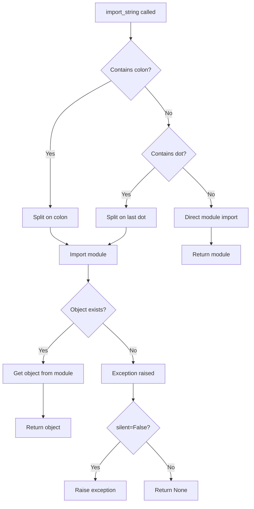

## Examples:
    # Import a module
    module = import_string('os')
    
    # Import an object from a module using dot notation
    func = import_string('os.path.join')
    
    # Import an object from a module using colon notation
    func = import_string('os.path:join')
    
    # Silent import that returns None on failure
    obj = import_string('nonexistent.module', silent=True)
```

## `src.jinja2.utils.open_if_exists` · *function*

## Summary:
Attempts to open a file only if it exists, returning None if the file is not found.

## Description:
Provides a safe mechanism to open files without raising exceptions when the file does not exist. This function first verifies file existence using os.path.isfile() before attempting to open the file. It is particularly useful in template processing and configuration loading scenarios where optional files may or may not be present.

## Args:
    filename (str): Path to the file to be opened
    mode (str): File opening mode, defaults to "rb" (read binary)

## Returns:
    typing.Optional[typing.IO]: File handle if file exists, None otherwise

## Raises:
    None explicitly raised

## Constraints:
    Preconditions:
        - filename parameter must be a string representing a valid filesystem path
        - mode parameter must be a valid file mode string acceptable to built-in open() function
    
    Postconditions:
        - If file exists: returns a valid file handle opened in specified mode
        - If file does not exist: returns None without raising exception

## Side Effects:
    - May perform file system I/O operations (os.path.isfile() check and file open)
    - No external state mutations

## Control Flow:
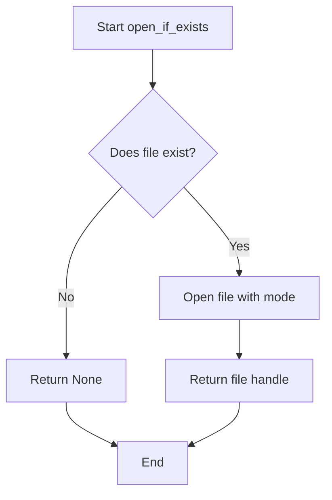

## Examples:
```python
# Safe file opening for optional configuration
config_file = open_if_exists("config.json")
if config_file:
    data = json.load(config_file)
    config_file.close()

# Reading binary data from optional asset
image_data = open_if_exists("assets/logo.png", "rb")
if image_data:
    # Process binary image data
    pass
```

## `src.jinja2.utils.object_type_repr` · *function*

## Summary:
Returns a human-readable string representation of an object's type, distinguishing between built-in types and custom types.

## Description:
This utility function provides a consistent way to represent object types as strings. It handles special Python objects like None and Ellipsis specially, while for regular objects it distinguishes between built-in types (which are displayed simply) and user-defined types (which include their full module path).

## Args:
    obj (Any): The object whose type representation is to be generated

## Returns:
    str: A string describing the object's type. For None returns "None", for Ellipsis returns "Ellipsis", for built-in types returns "{type_name} object", and for other types returns "{module}.{type_name} object".

## Raises:
    No exceptions are raised by this function

## Constraints:
    Preconditions: The function accepts any Python object as input
    Postconditions: Always returns a string value

## Side Effects:
    None

## Control Flow:
```mermaid
flowchart TD
    A[Start: object_type_repr(obj)] --> B{obj is None?}
    B -- Yes --> C[Return "None"]
    B -- No --> D{obj is Ellipsis?}
    D -- Yes --> E[Return "Ellipsis"]
    D -- No --> F[Get type of obj]
    F --> G{type.__module__ == "builtins"?}
    G -- Yes --> H[Return "{type.__name__} object"]
    G -- No --> I[Return "{type.__module__}.{type.__name__} object"]
```

## Examples:
    >>> object_type_repr(None)
    'None'
    >>> object_type_repr(...)
    'Ellipsis'
    >>> object_type_repr(42)
    'int object'
    >>> object_type_repr("hello")
    'str object'
    >>> object_type_repr([1, 2, 3])
    'list object'
    >>> object_type_repr(object())
    '__main__.object object'
```

## `src.jinja2.utils.pformat` · *function*

## Summary:
Returns a pretty-printed string representation of an object for debugging and logging purposes.

## Description:
This function provides a formatted string representation of any Python object, making it easier to visualize complex data structures. It serves as a thin wrapper around Python's standard library `pprint.pformat` function, ensuring consistent formatting behavior throughout the Jinja2 codebase.

## Args:
    obj (Any): Any Python object to be pretty-printed. Can be of any type including nested data structures like dictionaries, lists, custom objects, etc.

## Returns:
    str: A formatted string representation of the input object, suitable for debugging and logging purposes.

## Raises:
    None: This function does not explicitly raise exceptions, though underlying `pprint.pformat` may raise exceptions for objects that cannot be serialized.

## Constraints:
    Preconditions: The input object must be serializable by Python's pprint module.
    Postconditions: The returned string will be a valid pretty-printed representation of the input object.

## Side Effects:
    None: This function has no side effects and is purely a transformation function.

## Control Flow:
```mermaid
flowchart TD
    A[Call pformat(obj)] --> B{Delegate to pprint.pformat}
    B --> C[Return formatted string]
```

## Examples:
```python
# Basic usage
data = {'name': 'John', 'age': 30, 'hobbies': ['reading', 'swimming']}
formatted = pformat(data)
print(formatted)
# Output: "{'age': 30, 'hobbies': ['reading', 'swimming'], 'name': 'John'}"

# With nested structures
nested = {'users': [{'id': 1, 'name': 'Alice'}, {'id': 2, 'name': 'Bob'}]}
formatted = pformat(nested)
print(formatted)
# Output: "{'users': [{'id': 1, 'name': 'Alice'}, {'id': 2, 'name': 'Bob'}]}"
```

## `src.jinja2.utils.urlize` · *function*

## Summary:
Converts URLs and email addresses in text to HTML anchor tags while preserving surrounding punctuation and formatting.

## Description:
Transforms plain text containing URLs and email addresses into HTML hyperlinks. This function is commonly used in templating systems to automatically create clickable links from text content. It intelligently handles various edge cases including parentheses, brackets, and special characters that might surround URLs or email addresses.

The function processes text by splitting it into words while preserving whitespace, then examines each word to detect potential URLs or email addresses. When detected, these are wrapped in HTML anchor tags with appropriate attributes.

## Args:
    text (str): The input text containing URLs or email addresses to be converted.
    trim_url_limit (int, optional): Maximum length of URL to display. URLs exceeding this limit will be truncated with an ellipsis. Defaults to None.
    rel (str, optional): Value for the 'rel' attribute in the anchor tag. Defaults to None.
    target (str, optional): Value for the 'target' attribute in the anchor tag. Defaults to None.
    extra_schemes (Iterable[str], optional): Additional URL schemes to recognize beyond standard HTTP/HTTPS/mailto. Defaults to None.

## Returns:
    str: The input text with URLs and email addresses converted to HTML anchor tags. Non-matching text remains unchanged.

## Raises:
    None explicitly raised by this function.

## Constraints:
    Preconditions:
    - Input text must be convertible to string
    - All attribute values (rel, target) must be valid for HTML attributes
    
    Postconditions:
    - Output text contains valid HTML anchor tags for detected URLs/emails
    - All HTML special characters in input are properly escaped
    - Surrounding punctuation is preserved in the output

## Side Effects:
    None

## Control Flow:
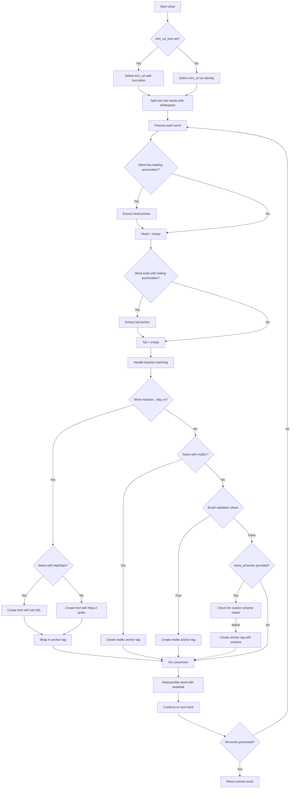

## Examples:
    >>> urlize("Visit https://example.com for more info")
    'Visit <a href="https://example.com">https://example.com</a> for more info'
    
    >>> urlize("Contact us at test@example.com", trim_url_limit=10)
    'Contact us at <a href="test@example.com">test@...</a>'
    
    >>> urlize("Email me at user@domain.org or visit http://site.com")
    'Email me at <a href="mailto:user@domain.org">user@domain.org</a> or visit <a href="http://site.com">http://site.com</a>'

## `src.jinja2.utils.generate_lorem_ipsum` · *function*

## Summary:
Generates randomized lorem ipsum placeholder text with configurable paragraph count and formatting options.

## Description:
Creates randomized lorem ipsum text paragraphs with proper punctuation, capitalization, and formatting. This function is designed to generate placeholder text for templates, typically used during development and testing phases. The function can generate either plain text or HTML-formatted paragraphs with appropriate escaping for safe rendering.

## Args:
    n (int): Number of paragraphs to generate. Defaults to 5.
    html (bool): Whether to return HTML-formatted paragraphs wrapped in &lt;p&gt; tags. Defaults to True.
    min (int): Minimum number of words per paragraph. Defaults to 20.
    max (int): Maximum number of words per paragraph. Defaults to 100.

## Returns:
    str: Generated lorem ipsum text. If html=True, returns markupsafe.Markup object with HTML paragraphs. If html=False, returns plain text with double-newline separators between paragraphs.

## Raises:
    None explicitly raised by this function.

## Constraints:
    Preconditions:
    - n must be a non-negative integer
    - min and max must be positive integers with min <= max
    - LOREM_IPSUM_WORDS constant must be available and contain space-separated words
    
    Postconditions:
    - Returns properly formatted text with correct punctuation
    - Paragraphs are properly capitalized and punctuated
    - HTML output is properly escaped for security

## Side Effects:
    - Uses random number generation via randrange and choice functions
    - May access LOREM_IPSUM_WORDS constant from module scope
    - When html=True, creates markupsafe.Markup objects for secure HTML rendering

## Control Flow:
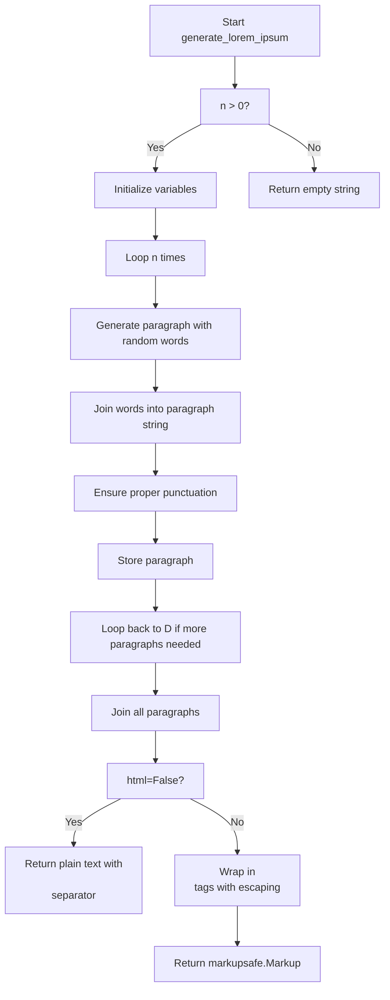

## Examples:
    # Generate 3 paragraphs with default settings
    text = generate_lorem_ipsum(3)
    # Returns HTML-formatted text with 3 paragraphs
    
    # Generate 2 paragraphs as plain text
    plain_text = generate_lorem_ipsum(2, html=False)
    # Returns plain text with double-newline separators
    
    # Generate paragraphs with custom word counts
    custom_text = generate_lorem_ipsum(1, min=10, max=30)
    # Returns 1 paragraph with 10-30 words

## `src.jinja2.utils.url_quote` · *function*

## Summary:
URL-encodes an object for use in URLs or query strings, handling various input types and encoding options.

## Description:
Converts an input object (string, bytes, or other types) into a URL-safe encoded string. The function handles automatic type conversion and provides special handling for query string encoding by replacing spaces with plus signs. This utility is commonly used in Jinja2 templates for generating proper URLs.

## Args:
    obj (object): The object to encode. Can be a string, bytes, or any object that can be converted to string.
    charset (str): Character encoding to use when converting non-byte/string objects to bytes. Defaults to "utf-8".
    for_qs (bool): If True, encode for use in query strings, replacing %20 with +. Defaults to False.

## Returns:
    str: URL-encoded string representation of the input object.

## Raises:
    UnicodeEncodeError: When the object cannot be encoded with the specified charset.

## Constraints:
    Preconditions:
        - The charset parameter must be a valid character encoding supported by Python
        - The obj parameter can be of any type that can be converted to string or bytes
    
    Postconditions:
        - The returned string is properly URL-encoded
        - If for_qs=True, spaces are represented as '+' instead of '%20'

## Side Effects:
    None

## Control Flow:
```mermaid
flowchart TD
    A[Start url_quote] --> B{isinstance(obj, bytes)?}
    B -- Yes --> C[Set safe = b"" if for_qs else b"/"]
    B -- No --> D{isinstance(obj, str)?}
    D -- No --> E[obj = str(obj)]
    E --> F[obj = obj.encode(charset)]
    D -- Yes --> G[obj = obj.encode(charset)]
    F --> C
    G --> C
    C --> H[quote_from_bytes(obj, safe)]
    H --> I{for_qs?}
    I -- Yes --> J[rv = rv.replace("%20", "+")]
    I -- No --> K[Return rv]
    J --> K
```

## Examples:
    >>> url_quote("hello world")
    'hello%20world'
    
    >>> url_quote("hello world", for_qs=True)
    'hello+world'
    
    >>> url_quote(123)
    '123'
    
    >>> url_quote(b"hello world")
    'hello%20world'
```

## `src.jinja2.utils.LRUCache` · *class*

## Summary:
LRUCache is a thread-safe, fixed-capacity cache implementation that automatically evicts the least recently used items when the capacity is exceeded.

## Description:
This class provides a dictionary-like interface with LRU (Least Recently Used) eviction policy. When the cache reaches its maximum capacity, the least recently accessed item is automatically removed to make space for new items. It's designed to be used in performance-critical applications where caching frequently accessed data is beneficial.

The class is particularly useful in Jinja2 templating engine where caching compiled templates or lexer results can significantly improve performance. It's thread-safe and supports serialization/deserialization for persistence.

## State:
- capacity: int - Maximum number of items the cache can hold. Must be positive.
- _mapping: dict - Dictionary storing key-value pairs for O(1) lookup.
- _queue: deque - Deque maintaining the order of items based on access frequency, with most recently used items on the right.
- _popleft: method - Reference to deque.popleft() for efficient removal of oldest items.
- _pop: method - Reference to deque.pop() for removing items from the right.
- _remove: method - Reference to deque.remove() for removing specific items.
- _wlock: Lock - Thread lock for ensuring atomic operations during concurrent access.
- _append: method - Reference to deque.append() for adding items to the right (most recently used position).

## Lifecycle:
- Creation: Instantiate with a positive integer capacity parameter
- Usage: Access items via [] operators, get(), setdefault(), or standard dict methods. All operations are thread-safe due to the internal Lock.
- Destruction: Automatic cleanup when object goes out of scope; supports pickle serialization through __getstate__ and __setstate__ methods.

## Method Map:
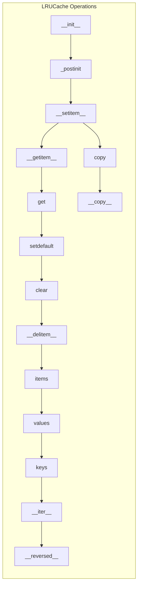

## Raises:
- ValueError: Raised when trying to remove a non-existent item from the queue (in __delitem__ and __getitem__ when attempting to remove a key that's not in the queue)
- TypeError: May occur if keys are unhashable (as with regular dict behavior)

## Example:
```python
# Create cache with capacity of 3
cache = LRUCache(3)

# Add items - order: a, b, c (most recent is rightmost)
cache['a'] = 1
cache['b'] = 2
cache['c'] = 3

# Access 'a' - moves it to most recent position: b, c, a
value = cache['a']

# Add new item - causes eviction of least recently used 'b': c, a, d
cache['d'] = 4

# Current state: ['c', 'a', 'd'] - order reflects access pattern
print(list(cache))  # ['c', 'a', 'd']

# Check if item exists
if 'a' in cache:
    print("Found 'a'")

# Get with default
result = cache.get('nonexistent', 'default_value')

# Clear cache
cache.clear()

# Copy cache
new_cache = cache.copy()
```

### `src.jinja2.utils.LRUCache.__init__` · *method*

## Summary:
Initializes an LRU cache with a specified maximum capacity and sets up internal data structures.

## Description:
Constructs a new LRUCache instance with the given capacity limit. This method initializes the internal mapping dictionary and access order queue, then performs additional setup through the `_postinit()` method to optimize performance and enable thread safety.

## Args:
    capacity (int): Maximum number of items the cache can hold. Must be a positive integer.

## Returns:
    None: This method initializes the instance in-place and does not return a value.

## Raises:
    None: This method does not explicitly raise exceptions.

## State Changes:
    Attributes READ: None
    Attributes WRITTEN: 
        - self.capacity: Set to the provided capacity value
        - self._mapping: Initialized as an empty dictionary for key-value storage
        - self._queue: Initialized as an empty deque for tracking access order

## Constraints:
    Preconditions:
        - The capacity argument must be a positive integer
        - The LRUCache class must be properly defined with required attributes
    
    Postconditions:
        - The instance is initialized with the specified capacity
        - Internal data structures are properly set up
        - Thread safety mechanisms are initialized via `_postinit()`

## Side Effects:
    None: This method only initializes internal instance attributes and does not perform I/O operations or external service calls.

### `src.jinja2.utils.LRUCache._postinit` · *method*

## Summary:
Initializes internal helper attributes for the LRU cache by binding deque methods and creating a thread lock.

## Description:
This private method performs post-initialization setup for the LRUCache instance. It optimizes performance by binding frequently-used deque methods to instance attributes, eliminating the need for repeated attribute lookups during cache operations. Additionally, it initializes a threading lock for thread-safe operations.

The method is automatically invoked during object construction (`__init__`) and during unpickling (`__setstate__`) to ensure proper initialization of internal helper attributes.

## Args:
    None: This method takes no arguments beyond the implicit `self` parameter.

## Returns:
    None: This method modifies the instance in-place and does not return a value.

## Raises:
    None: This method does not explicitly raise exceptions.

## State Changes:
    Attributes READ: self._queue
    Attributes WRITTEN: self._popleft, self._pop, self._remove, self._wlock, self._append

## Constraints:
    Preconditions:
    - The instance must have a `_queue` attribute that is a deque object
    - The instance must be in a valid state for attribute assignment
    Postconditions:
    - Instance attributes `_popleft`, `_pop`, `_remove`, `_wlock`, and `_append` will be properly initialized
    - These attributes will reference the corresponding methods from `self._queue` or create a new Lock instance

## Side Effects:
    None: This method only modifies internal instance attributes and doesn't perform any I/O operations or external service calls.

### `src.jinja2.utils.LRUCache.__getstate__` · *method*

## Summary:
Serializes the internal state of the LRUCache instance for pickling.

## Description:
Implements Python's pickle protocol to enable serialization of LRUCache objects. This method is automatically called by the pickle module during the serialization process to capture the essential state of the cache. It returns a dictionary containing the cache capacity, key-value mapping, and order queue that are necessary to reconstruct the object during unpickling.

## Args:
    None

## Returns:
    dict: A dictionary mapping attribute names to their values containing:
        - "capacity" (int): Maximum number of items the cache can hold
        - "_mapping" (dict): Dictionary storing key-value pairs
        - "_queue" (collections.deque): Deque maintaining the order of keys

## Raises:
    None

## State Changes:
    Attributes READ: self.capacity, self._mapping, self._queue
    Attributes WRITTEN: None

## Constraints:
    Preconditions: The LRUCache instance must be properly initialized with valid attributes.
    Postconditions: The returned dictionary contains exactly the three required state attributes.

## Side Effects:
    None

### `src.jinja2.utils.LRUCache.__setstate__` · *method*

## Summary:
Restores the internal state of an LRUCache instance during unpickling operations.

## Description:
This method is part of Python's pickle protocol and is automatically invoked by the pickle module during the deserialization process. It restores the cached object's state by updating the instance's `__dict__` with the provided serialized data and then reinitializing internal helper attributes through `_postinit()`.

## Args:
    d (Mapping[str, Any]): A dictionary containing the serialized state of the LRUCache instance, typically produced by the `__getstate__` method. Expected keys include:
        - "capacity" (int): Maximum number of items the cache can hold
        - "_mapping" (dict): Dictionary storing key-value pairs
        - "_queue" (collections.deque): Deque maintaining the order of keys

## Returns:
    None: This method modifies the instance in-place and does not return a value.

## Raises:
    None: This method does not explicitly raise exceptions, though underlying operations may raise exceptions if the provided dictionary has invalid structure.

## State Changes:
    Attributes READ: self.__dict__, self.capacity, self._mapping, self._queue
    Attributes WRITTEN: All attributes from the input dictionary are written to self.__dict__, and internal helper attributes are reinitialized via _postinit()

## Constraints:
    Preconditions: 
    - The input dictionary `d` must contain the expected keys from `__getstate__` (capacity, _mapping, _queue)
    - The LRUCache instance must be in a valid state to accept the restored attributes
    Postconditions:
    - The instance's `__dict__` will contain all attributes from the input dictionary
    - Internal helper attributes (like _popleft, _pop, _remove, etc.) will be properly initialized via `_postinit()`

## Side Effects:
    None: This method only modifies the internal state of the LRUCache instance and doesn't perform any I/O operations or external service calls.

### `src.jinja2.utils.LRUCache.__getnewargs__` · *method*

## Summary:
Returns the constructor arguments needed to recreate the LRUCache instance during unpickling.

## Description:
This method implements Python's pickle protocol to support serialization and deserialization of LRUCache objects. It provides the arguments required to reconstruct the object during unpickling, specifically returning the cache capacity. This method works in conjunction with `__getstate__` and `__setstate__` to ensure complete object state preservation during the pickle process.

## Args:
    None

## Returns:
    tuple: A single-element tuple containing the cache capacity (int) used to reconstruct the LRUCache instance.

## Raises:
    None

## State Changes:
    Attributes READ: self.capacity
    Attributes WRITTEN: None

## Constraints:
    Preconditions: The LRUCache instance must be properly initialized with a valid capacity.
    Postconditions: The returned tuple contains exactly one element representing the original capacity.

## Side Effects:
    None

### `src.jinja2.utils.LRUCache.copy` · *method*

## Summary:
Creates a shallow copy of the LRU cache instance with identical capacity and contents.

## Description:
This method creates a new LRUCache instance with the same capacity as the caller, then copies all key-value mappings and access order queue entries from the original cache. The copy operation preserves the internal data structures' contents while creating a separate instance with independent state management.

## Args:
    None

## Returns:
    LRUCache: A new instance of the same class with identical capacity, mapping, and queue contents.

## Raises:
    None explicitly raised

## State Changes:
    Attributes READ: self.capacity, self._mapping, self._queue
    Attributes WRITTEN: None (creates new instance, doesn't modify self)

## Constraints:
    Preconditions: The LRUCache instance must be properly initialized with capacity, _mapping, and _queue attributes
    Postconditions: The returned instance will have identical capacity, mapping contents, and queue contents to the original

## Side Effects:
    None

### `src.jinja2.utils.LRUCache.get` · *method*

*No documentation generated.*

### `src.jinja2.utils.LRUCache.setdefault` · *method*

## Summary:
Retrieves a value from the cache by key or sets and returns a default value if the key is not present.

## Description:
This method attempts to retrieve a value associated with the given key from the LRU cache. If the key exists, it returns the cached value. If the key does not exist, it stores the default value under that key and returns it. This operation maintains the LRU ordering by updating the usage position of the accessed key.

## Args:
    key (Any): The key to look up in the cache
    default (Any, optional): The default value to store and return if the key is not found. Defaults to None

## Returns:
    Any: The cached value if the key exists, otherwise the default value that was stored

## Raises:
    None explicitly raised

## State Changes:
    Attributes READ: self._mapping, self._queue, self._wlock
    Attributes WRITTEN: self._mapping, self._queue

## Constraints:
    Preconditions: The LRUCache instance must be properly initialized with a positive capacity
    Postconditions: If key exists, returns the cached value; if key doesn't exist, stores default value and returns it

## Side Effects:
    Mutates the cache state by potentially adding a new key-value pair and updating the LRU queue order
    Acquires and releases a thread lock (_wlock) during operations

### `src.jinja2.utils.LRUCache.clear` · *method*

## Summary:
Clears all cached entries from the LRU cache, resetting both the mapping and queue data structures.

## Description:
Removes all key-value pairs from the cache and resets the internal queue structure. This method is thread-safe and ensures atomic clearing of both the dictionary mapping and deque queue that maintain the cache state.

## Args:
    None: This method takes no arguments beyond the implicit `self` parameter.

## Returns:
    None: This method does not return a value.

## Raises:
    None: This method does not raise any exceptions.

## State Changes:
    Attributes READ: 
    - self._wlock: Thread lock for synchronization
    - self._mapping: Dictionary storing cached key-value pairs
    - self._queue: Deque maintaining LRU order of cached items
    
    Attributes WRITTEN:
    - self._mapping: Cleared to empty dictionary
    - self._queue: Cleared to empty deque

## Constraints:
    Preconditions:
    - The instance must be properly initialized with `_mapping` and `_queue` attributes
    - The instance must have a `_wlock` attribute (threading.Lock)
    
    Postconditions:
    - Both `_mapping` and `_queue` will be empty
    - Cache size will be zero
    - All cached entries will be removed

## Side Effects:
    None: This method only modifies internal instance state and does not perform I/O operations or external service calls.

### `src.jinja2.utils.LRUCache.__contains__` · *method*

## Summary:
Checks if a key exists in the LRU cache without modifying the cache state.

## Description:
Implements the `__contains__` special method to enable the `in` operator for LRUCache instances. This method provides O(1) lookup time by delegating to the underlying dictionary's membership test operation.

## Args:
    key (Any): The key to search for in the cache

## Returns:
    bool: True if the key exists in the cache, False otherwise

## Raises:
    None

## State Changes:
    Attributes READ: self._mapping
    Attributes WRITTEN: None

## Constraints:
    Preconditions: The method assumes self._mapping is a valid dictionary-like object
    Postconditions: The cache state remains unchanged; no modifications to _mapping, _queue, or capacity occur

## Side Effects:
    None

### `src.jinja2.utils.LRUCache.__len__` · *method*

## Summary:
Returns the number of items currently stored in the LRU cache.

## Description:
This method implements the Python magic method `__len__` to provide the size of the LRU cache. It returns the count of key-value pairs currently stored in the cache by checking the length of the internal `_mapping` dictionary.

## Args:
    None

## Returns:
    int: The number of items currently stored in the cache. This value will always be between 0 and the cache capacity (inclusive).

## Raises:
    None

## State Changes:
    Attributes READ: self._mapping
    Attributes WRITTEN: None

## Constraints:
    Preconditions: The object must be properly initialized with a valid capacity and _mapping attribute.
    Postconditions: The method returns an integer representing the current cache size without modifying the cache state.

## Side Effects:
    None

### `src.jinja2.utils.LRUCache.__repr__` · *method*

## Summary:
Returns a string representation of the LRU cache showing its type and internal mapping.

## Description:
This method provides a human-readable string representation of the LRUCache instance, displaying the class name and the internal `_mapping` dictionary. It is automatically called by Python's built-in `repr()` function and is useful for debugging and logging purposes.

## Args:
    self: The LRUCache instance being represented.

## Returns:
    str: A string in the format "<ClassName {mapping_content!r}>" where ClassName is the actual class name and mapping_content is the repr of the internal _mapping dictionary.

## Raises:
    None: This method does not raise any exceptions.

## State Changes:
    Attributes READ: self._mapping
    Attributes WRITTEN: None

## Constraints:
    Preconditions: The instance must be properly initialized with a `_mapping` attribute that is a dictionary-like object.
    Postconditions: The returned string accurately represents the current state of the cache's internal mapping.

## Side Effects:
    None: This method is read-only and does not modify any state.

### `src.jinja2.utils.LRUCache.__getitem__` · *method*

## Summary:
Retrieves a value from the LRU cache and updates its position to mark it as most recently used.

## Description:
Implements the `[]` operator for LRUCache instances, retrieving a value associated with the given key. This method ensures thread safety by acquiring a write lock before accessing the cache. It also maintains the LRU (Least Recently Used) eviction policy by moving accessed items to the end of the access order queue, marking them as most recently used.

## Args:
    key (Any): The key to retrieve from the cache. Must exist in the cache, otherwise a KeyError will be raised.

## Returns:
    Any: The value associated with the specified key in the cache.

## Raises:
    KeyError: When attempting to access a key that does not exist in the cache mapping.
    ValueError: Internally caught when attempting to remove a key from the access order queue that is not present (though this should not occur in normal operation).

## State Changes:
    Attributes READ: 
        - self._wlock: For thread synchronization
        - self._mapping: To access the key-value store
        - self._queue: To check access order and update item positions
    
    Attributes WRITTEN:
        - self._queue: Key is moved to the end of the queue to mark as most recently used

## Constraints:
    Preconditions:
        - The key must exist in the cache (in self._mapping)
        - The cache instance must be properly initialized with _wlock, _mapping, and _queue attributes
    
    Postconditions:
        - The specified key's value is returned
        - The key is moved to the end of self._queue to mark it as most recently used
        - Thread safety is maintained via self._wlock

## Side Effects:
    None: This method only operates on internal state and does not perform I/O or external service calls.

### `src.jinja2.utils.LRUCache.__setitem__` · *method*

## Summary:
Sets a key-value pair in the LRU cache, updating the access order and managing capacity limits.

## Description:
This method implements the `__setitem__` magic method for the LRUCache class, allowing assignment via `cache[key] = value`. It maintains the LRU (Least Recently Used) eviction policy by updating the access order of keys and removing the least recently used item when capacity is exceeded.

## Args:
    key (Any): The key to set in the cache
    value (Any): The value to associate with the key

## Returns:
    None: This method does not return a value

## Raises:
    None: This method does not raise any exceptions explicitly

## State Changes:
    Attributes READ: 
        - self._mapping: Dictionary storing key-value pairs
        - self._queue: Deque tracking access order
        - self.capacity: Maximum number of items allowed in cache
    
    Attributes WRITTEN:
        - self._mapping: Updated with new key-value pair or modified existing entry
        - self._queue: Modified to reflect new access order

## Constraints:
    Preconditions:
        - The cache instance must be properly initialized with a positive capacity
        - The key and value arguments must be hashable and serializable respectively
    
    Postconditions:
        - The key-value pair is stored in self._mapping
        - The key is positioned at the end of self._queue (most recently used)
        - If capacity was exceeded, the least recently used item is removed
        - Thread safety is maintained via self._wlock

## Side Effects:
    None: This method only modifies internal state and does not perform I/O or external service calls

### `src.jinja2.utils.LRUCache.__delitem__` · *method*

## Summary:
Removes a key-value pair from the LRU cache and updates the access order tracking.

## Description:
Implements the `del` operator for LRUCache instances, removing a specified key from both the internal mapping and access order tracking queue. This method ensures proper cleanup of LRU cache entries while maintaining thread safety. When the key exists in the cache, it is removed from both the mapping dictionary and the access order queue. If the key exists in the mapping but not in the queue (which shouldn't normally happen in a properly functioning LRU cache), the removal from queue is gracefully ignored.

## Args:
    key (Any): The key to remove from the cache. Must exist in the cache, otherwise a KeyError will be raised.

## Returns:
    None: This method does not return any value.

## Raises:
    KeyError: When attempting to delete a key that does not exist in the cache mapping.
    ValueError: Internally caught when attempting to remove a key from the access order queue that is not present (though this should not occur in normal operation).

## State Changes:
    Attributes READ: 
        - self._wlock: For thread synchronization
        - self._mapping: To access the key-value store
        - self._remove: Method reference to remove items from queue
    
    Attributes WRITTEN:
        - self._mapping: Key-value pair is deleted from the mapping
        - self._queue: Key is removed from the access order tracking queue

## Constraints:
    Preconditions:
        - The key must exist in the cache (in self._mapping)
        - The cache instance must be properly initialized with _wlock and _queue attributes
    
    Postconditions:
        - The specified key is removed from both self._mapping and self._queue
        - Thread safety is maintained via self._wlock
        - If the key was not in the queue, no error occurs due to graceful exception handling

## Side Effects:
    None: This method only operates on internal state and does not perform I/O or external service calls.

### `src.jinja2.utils.LRUCache.items` · *method*

## Summary:
Returns all key-value pairs from the LRU cache in most-recently-used order.

## Description:
This method retrieves all key-value pairs stored in the LRU cache and returns them in an iterable. The items are ordered from most recently accessed (first) to least recently accessed (last), reflecting the internal LRU queue ordering that tracks access patterns.

## Args:
    None

## Returns:
    t.Iterable[t.Tuple[t.Any, t.Any]]: An iterable of (key, value) tuples representing all items in the cache, ordered from most recently used to least recently used.

## Raises:
    None

## State Changes:
    Attributes READ: self._mapping, self._queue
    Attributes WRITTEN: None

## Constraints:
    Preconditions: The LRUCache instance must be properly initialized with _mapping and _queue attributes.
    Postconditions: The returned iterable contains all key-value pairs currently in the cache, maintaining the LRU ordering where the first item was most recently accessed.

## Side Effects:
    None

### `src.jinja2.utils.LRUCache.values` · *method*

## Summary:
Returns all values from the LRU cache in most-recently-used order.

## Description:
Retrieves all values currently stored in the LRU cache and returns them as an iterable. The values are ordered from most recently accessed (first) to least recently accessed (last), matching the internal LRU queue ordering that tracks access patterns.

## Args:
    None

## Returns:
    t.Iterable[t.Any]: An iterable containing all values in the cache, ordered from most recently used to least recently used.

## Raises:
    None

## State Changes:
    Attributes READ: self._mapping, self._queue
    Attributes WRITTEN: None

## Constraints:
    Preconditions: The LRUCache instance must be properly initialized with _mapping and _queue attributes.
    Postconditions: The returned iterable contains all values currently in the cache, maintaining the LRU ordering where the first value was most recently accessed.

## Side Effects:
    None

### `src.jinja2.utils.LRUCache.keys` · *method*

## Summary:
Returns a list of all keys currently stored in the LRU cache.

## Description:
This method converts the LRUCache instance to a list, returning all keys currently stored in the cache. The conversion to list preserves the iteration order of the cache, which typically reflects the insertion or access order depending on the specific implementation.

## Args:
    self: The LRUCache instance from which to retrieve keys.

## Returns:
    list[t.Any]: A list containing all keys currently stored in the cache.

## Raises:
    None explicitly raised.

## State Changes:
    Attributes READ: None (reads no instance attributes)
    Attributes WRITTEN: None (modifies no instance attributes)

## Constraints:
    Preconditions: The LRUCache instance must be properly initialized.
    Postconditions: The returned list contains all keys currently in the cache without affecting cache contents or order.

## Side Effects:
    None (does not perform I/O, external service calls, or mutate external objects)

### `src.jinja2.utils.LRUCache.__iter__` · *method*

## Summary:
Returns an iterator over the cache keys in reverse chronological order (most recently accessed first).

## Description:
This method implements the iterator protocol for the LRUCache class, providing access to cache keys in reverse order of their access time. When iterated, keys are returned starting with the most recently accessed item and proceeding to the least recently accessed item.

## Args:
    None

## Returns:
    Iterator[Any]: An iterator over cache keys in reverse chronological order (most recent first).

## Raises:
    None

## State Changes:
    Attributes READ: self._queue
    Attributes WRITTEN: None

## Constraints:
    Preconditions: The LRUCache instance must be properly initialized with a valid capacity and queue.
    Postconditions: The returned iterator is a view of the current state of the internal queue.

## Side Effects:
    None

### `src.jinja2.utils.LRUCache.__reversed__` · *method*

## Summary:
Returns an iterator over cache keys in chronological order (oldest first).

## Description:
Implements the Python `__reversed__` magic method for the LRUCache class. This method provides iteration over the cached keys in the order they were added to the cache, with the oldest items first and newest items last.

Unlike the `__iter__` method which returns keys in reverse chronological order (most recently accessed first), this method returns keys in the same order as they appear in the internal queue, representing the insertion order of items in the cache.

This method is typically called implicitly when using `reversed()` on an LRUCache instance.

## Args:
    None

## Returns:
    Iterator[Any]: An iterator over cache keys in chronological order (oldest first).

## Raises:
    None

## State Changes:
    Attributes READ: self._queue
    Attributes WRITTEN: None

## Constraints:
    Preconditions: The LRUCache instance must be properly initialized with a valid capacity and queue.
    Postconditions: The returned iterator is a view of the current state of the internal queue.

## Side Effects:
    None

## `src.jinja2.utils.select_autoescape` · *function*

## Summary:
Creates a function that determines whether autoescaping should be enabled for Jinja2 templates based on file extensions.

## Description:
This function acts as a factory that generates a predicate function for determining autoescape behavior. The returned function evaluates template names against configured extension patterns to decide whether HTML/XML escaping should be applied automatically.

## Args:
    enabled_extensions (Collection[str]): File extensions that should enable autoescaping. Defaults to ("html", "htm", "xml").
    disabled_extensions (Collection[str]): File extensions that should disable autoescaping. Defaults to ().
    default_for_string (bool): Whether to enable autoescaping when the template name is None (string context). Defaults to True.
    default (bool): Default autoescape setting when no pattern matches. Defaults to False.

## Returns:
    Callable[[Optional[str]], bool]: A function that takes an optional template name and returns a boolean indicating whether autoescaping should be enabled.

## Raises:
    None explicitly raised

## Constraints:
    Preconditions:
    - enabled_extensions and disabled_extensions should contain valid file extensions
    - All extensions should be strings
    
    Postconditions:
    - The returned function will always return a boolean value
    - Template names are converted to lowercase for comparison
    - Extension matching is case-insensitive

## Side Effects:
    None

## Control Flow:
```mermaid
flowchart TD
    A[select_autoescape called] --> B{enabled_extensions}
    B --> C{disabled_extensions}
    C --> D[Create patterns]
    D --> E[Return autoescape function]
    
    F[autoescape called] --> G{template_name is None?}
    G -->|Yes| H[return default_for_string]
    G -->|No| I[template_name.lower()]
    I --> J{ends with enabled_patterns?}
    J -->|Yes| K[return True]
    J -->|No| L{ends with disabled_patterns?}
    L -->|Yes| M[return False]
    L -->|No| N[return default]
```

## Examples:
```python
# Create an autoescape selector for standard web templates
autoescape_selector = select_autoescape()

# Check if autoescaping should be enabled for specific templates
should_escape_html = autoescape_selector("index.html")  # True
should_escape_xml = autoescape_selector("data.xml")     # True
should_escape_txt = autoescape_selector("readme.txt")   # False
should_escape_none = autoescape_selector(None)          # True (default_for_string)

# Create custom selector with different defaults
custom_selector = select_autoescape(
    enabled_extensions=("html", "htm", "xml", "json"),
    disabled_extensions=("txt",),
    default_for_string=False,
    default=True
)
```

## `src.jinja2.utils.htmlsafe_json_dumps` · *function*

## Summary:
Creates HTML-safe JSON string representation of an object by escaping special HTML characters.

## Description:
Converts a Python object to a JSON string and escapes HTML special characters (<, >, &, ') to prevent XSS vulnerabilities when embedding JSON data in HTML documents. This function is typically used in Jinja2 templates to safely output JSON data within HTML contexts.

## Args:
    obj (Any): The Python object to serialize to JSON format.
    dumps (Callable[..., str], optional): The JSON serialization function to use. Defaults to json.dumps if not provided.
    **kwargs (Any): Additional keyword arguments passed to the dumps function.

## Returns:
    markupsafe.Markup: An HTML-safe JSON string wrapped in a Markup object that indicates it should not be escaped again.

## Raises:
    Any exceptions raised by the underlying dumps function when serializing the object.

## Constraints:
    Preconditions:
    - The obj parameter must be serializable by the provided dumps function
    - If dumps is provided, it must be callable and accept the obj parameter plus any kwargs
    
    Postconditions:
    - The returned value is always a markupsafe.Markup instance
    - All HTML special characters (<, >, &, ') in the JSON output are escaped as Unicode sequences

## Side Effects:
    None

## Control Flow:
```mermaid
flowchart TD
    A[Start htmlsafe_json_dumps] --> B{dumps is None?}
    B -- Yes --> C[dumps = json.dumps]
    B -- No --> D[Use provided dumps function]
    C --> E[Serialize obj with dumps]
    D --> E
    E --> F[Replace "<" with "\\u003c"]
    F --> G[Replace ">" with "\\u003e"]
    G --> H[Replace "&" with "\\u0026"]
    H --> I[Replace "'" with "\\u0027"]
    I --> J[Return markupsafe.Markup(result)]
```

## Examples:
    # Basic usage with a dictionary
    data = {"name": "John", "age": 30}
    safe_json = htmlsafe_json_dumps(data)
    # Result: markupsafe.Markup object containing escaped JSON string
    
    # Usage with custom dumps function
    def custom_dumps(obj):
        return json.dumps(obj, indent=2)
    
    safe_json = htmlsafe_json_dumps(data, dumps=custom_dumps)
    # Result: markupsafe.Markup object with indented, escaped JSON string

## `src.jinja2.utils.Cycler` · *class*

## Summary:
Cycles through a fixed set of items in a circular fashion, providing access to the current item and advancing through the sequence.

## Description:
The Cycler class is designed to maintain a sequence of items and provide sequential access to them in a circular manner. It's useful for scenarios where you need to repeatedly cycle through a predefined set of values, such as alternating colors, rotating labels, or implementing round-robin behavior. The class can be instantiated with any number of items, and provides methods to navigate through the sequence.

## State:
- items: tuple of t.Any, containing the fixed set of items to cycle through
- pos: int, representing the current position in the items sequence (0-based index)
- Invariant: pos is always within the range [0, len(items)), maintained by the next() method

## Lifecycle:
- Creation: Instantiate with one or more items using Cycler(*items)
- Usage: Call next() or use as an iterator to advance through items, use reset() to restart from beginning
- Destruction: No explicit cleanup required; uses standard Python garbage collection

## Method Map:
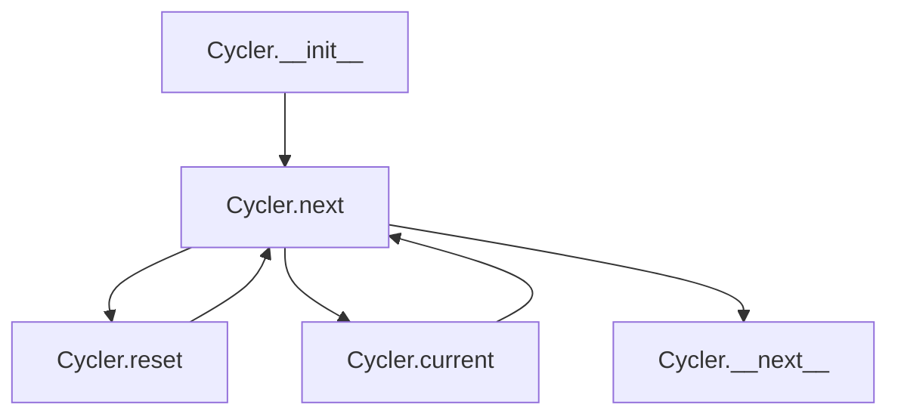

## Raises:
- RuntimeError: Raised during initialization when no items are provided

## Example:
```python
# Create a cycler with color names
colors = Cycler('red', 'green', 'blue')
print(colors.current)  # 'red'
print(colors.next())   # 'red'
print(colors.next())   # 'green'
print(colors.next())   # 'blue'
print(colors.next())   # 'red' (cycles back)

# Reset to beginning
colors.reset()
print(colors.current)  # 'red'

# Using as iterator
for i, color in enumerate(colors):
    if i >= 5: break  # Prevent infinite loop
    print(color)
```

### `src.jinja2.utils.Cycler.__init__` · *method*

## Summary:
Initializes a Cycler instance with a sequence of items to cycle through.

## Description:
Constructs a Cycler object that maintains a fixed sequence of items and provides mechanisms to iterate through them in a circular fashion. This method serves as the primary entry point for creating Cycler instances and establishes the foundational state for cycling behavior.

## Args:
    *items (t.Any): Variable-length argument list of items to include in the cycling sequence. Must contain at least one item.

## Returns:
    None: This method initializes the object's state and does not return a value.

## Raises:
    RuntimeError: Raised when no items are provided to the constructor, ensuring that the Cycler always has at least one item to cycle through.

## State Changes:
    Attributes READ: None
    Attributes WRITTEN: 
        - self.items: Stores the provided items as a tuple
        - self.pos: Initializes to 0, representing the starting position in the cycling sequence

## Constraints:
    Preconditions:
        - At least one item must be provided as an argument
    Postconditions:
        - self.items contains all provided items as a tuple
        - self.pos is initialized to 0
        - The Cycler is ready for iteration starting from the first item

## Side Effects:
    None: This method performs no I/O operations or external service calls. It only initializes internal object state.

### `src.jinja2.utils.Cycler.reset` · *method*

## Summary:
Resets the cycler's position indicator back to the first item in the sequence.

## Description:
This method resets the internal position counter of the Cycler object back to zero, effectively making the next call to `next()` or accessing `current` return the first item in the cycler's sequence. This method is useful for restarting iteration over the same set of items without creating a new Cycler instance.

## Args:
    None

## Returns:
    None

## Raises:
    None

## State Changes:
    Attributes READ: None
    Attributes WRITTEN: self.pos

## Constraints:
    Preconditions: The Cycler object must be properly initialized with items
    Postconditions: The self.pos attribute is set to 0

## Side Effects:
    None

### `src.jinja2.utils.Cycler.current` · *method*

## Summary:
Returns the current item from the cyclic sequence without advancing the position.

## Description:
Provides access to the item at the current position in the Cycler's sequence. This property is used internally by the `next` method to retrieve the current item before advancing to the next position in the cycle. It allows clients to inspect the current item in the sequence without modifying the cycle's state.

## Args:
    None - This is a property with no parameters beyond `self`.

## Returns:
    Any: The item at the current position in the cyclic sequence. The type of the returned item matches the type of items stored in the Cycler.

## Raises:
    None - This property does not raise any exceptions under normal operation.

## State Changes:
    Attributes READ:
    - self.items: The tuple containing all items in the cyclic sequence
    - self.pos: The current position index in the sequence
    
    Attributes WRITTEN:
    - None - This property does not modify any instance attributes.

## Constraints:
    Preconditions:
    - The Cycler instance must have been initialized with at least one item
    - The `self.pos` attribute must be a valid index within the bounds of `self.items`
    
    Postconditions:
    - The Cycler's state remains unchanged
    - The returned value is always an item from the original sequence provided during initialization

## Side Effects:
    None - This property performs no I/O operations or external service calls. It only accesses internal state and returns a value.

### `src.jinja2.utils.Cycler.next` · *method*

*No documentation generated.*

## `src.jinja2.utils.Joiner` · *class*

## Summary:
A callable class that generates join separators for building comma-separated or similar lists.

## Description:
The Joiner class provides a reusable mechanism for generating separators in join operations. It's designed to handle the common pattern where the first item in a sequence doesn't need a leading separator, but subsequent items do. This is commonly used when building comma-separated lists, space-separated strings, or other joined sequences.

The class is typically instantiated by Jinja2 internals or template rendering code that needs to build such sequences efficiently.

## State:
- sep: str - The separator string to use (defaults to ", ")
- used: bool - Tracks whether the joiner has been invoked (initially False)

## Lifecycle:
- Creation: Instantiate with optional separator string (defaults to ", ")
- Usage: Call the instance repeatedly to get appropriate separator strings
- Destruction: No special cleanup required - standard Python object lifecycle applies

## Method Map:
```mermaid
graph TD
    A[Joiner.__init__] --> B[Joiner.__call__]
    B --> C{used flag}
    C -->|False| D[Return "" (empty)]
    C -->|True| E[Return sep]
```

## Raises:
None explicitly raised by __init__ or __call__

## Example:
```python
# Create a joiner with default separator
joiner = Joiner()
print(joiner())  # Output: "" (empty string)
print(joiner())  # Output: ", " (separator)

# Create a joiner with custom separator
joiner = Joiner(" | ")
print(joiner())  # Output: "" (empty string)
print(joiner())  # Output: " | " (separator)
```

### `src.jinja2.utils.Joiner.__init__` · *method*

## Summary:
Initializes a Joiner instance with a separator string and resets the used flag.

## Description:
Configures the Joiner instance with a specified separator string and initializes the internal used flag to False. This method is called during object instantiation to set up the initial state for separator management.

## Args:
    sep (str): The separator string to use for subsequent join operations. Defaults to ", ".

## Returns:
    None: This method does not return a value.

## Raises:
    None: This method does not raise any exceptions.

## State Changes:
    Attributes READ: None
    Attributes WRITTEN: 
    - self.sep: Set to the provided separator string
    - self.used: Set to False

## Constraints:
    Preconditions: None
    Postconditions: 
    - self.sep is set to the provided separator string
    - self.used is initialized to False

## Side Effects:
    None: This method performs no I/O, external service calls, or mutations to objects outside self.

### `src.jinja2.utils.Joiner.__call__` · *method*

## Summary:
Returns the appropriate separator string for join operations, ensuring no leading separator is produced.

## Description:
This method implements a stateful separator pattern commonly used in template engines to construct comma-separated or similar lists. On the first invocation, it returns an empty string to avoid leading separators. Subsequent invocations return the configured separator string.

## Args:
    None

## Returns:
    str: An empty string on first call, otherwise the configured separator string.

## Raises:
    None

## State Changes:
    Attributes READ: self.sep, self.used
    Attributes WRITTEN: self.used

## Constraints:
    Preconditions: The Joiner instance must be properly initialized with a separator string.
    Postconditions: The `used` attribute is set to True after the first call.

## Side Effects:
    None

## `src.jinja2.utils.Namespace` · *class*

## Summary:
A namespace container that provides dictionary-like attribute access and assignment.

## Description:
The Namespace class serves as a container for key-value pairs that can be accessed as object attributes. It's designed to provide a clean interface for storing and retrieving configuration-like data or contextual variables in Jinja2 templates. This class is particularly useful for creating scoped environments where data needs to be accessed via dot notation while maintaining the flexibility of dictionary operations.

## State:
- `__attrs`: dict[str, Any] - Internal storage for key-value pairs. Valid values are any Python objects. This attribute holds all the data stored in the namespace.
- Constructor parameters: Accepts any arguments that can be passed to dict() constructor, allowing initialization from dictionaries, keyword arguments, or key-value pairs.

## Lifecycle:
- Creation: Instantiate with Namespace([dict_like], **kwargs) where dict_like can be a dictionary, another Namespace, or iterable of key-value pairs, and kwargs are additional key-value pairs to add.
- Usage: Access attributes using dot notation (obj.attr) or bracket notation (obj['attr']). Set attributes using either assignment (obj.attr = value) or bracket notation (obj['attr'] = value).
- Destruction: No explicit cleanup required; standard Python garbage collection handles memory management.

## Method Map:
```mermaid
graph TD
    A[Instantiation] --> B[__init__]
    B --> C[Store args/kwargs in __attrs]
    C --> D[Access via . notation]
    D --> E[__getattribute__]
    E --> F{Attribute in __attrs?}
    F -->|Yes| G[Return value]
    F -->|No| H[raise AttributeError]
    D --> I[__setitem__]
    I --> J[Set __attrs[key] = value]
```

## Raises:
- AttributeError: Raised when attempting to access a non-existent attribute via dot notation (e.g., obj.nonexistent).

## Example:
```python
# Create namespace with initial data
ns = Namespace({'key1': 'value1'}, key2='value2')

# Access attributes
print(ns.key1)  # 'value1'
print(ns['key1'])  # 'value1' (via bracket notation)

# Modify attributes
ns.key3 = 'value3'
ns['key4'] = 'value4'

# View representation
print(repr(ns))  # <Namespace {'key1': 'value1', 'key2': 'value2', 'key3': 'value3', 'key4': 'value4'}>
```

### `src.jinja2.utils.Namespace.__init__` · *method*

## Summary:
Initializes a namespace object with key-value pairs from positional and keyword arguments.

## Description:
Constructs a Namespace instance by storing the provided arguments as key-value pairs in the internal `__attrs` dictionary. This method accepts any arguments that can be passed to Python's built-in `dict()` constructor, enabling flexible initialization from dictionaries, keyword arguments, or iterables of key-value pairs.

The method is called automatically during object instantiation and handles the setup of the namespace's internal data store. It's designed to be compatible with standard dictionary construction patterns, allowing seamless integration with existing code that expects dictionary-like initialization.

## Args:
    *args (tuple): Variable length argument list that can contain:
        - A dictionary or other mapping object to initialize from
        - An iterable of key-value pairs
        - A single object that can be converted to a dictionary
    **kwargs (dict): Arbitrary keyword arguments that will be added to the namespace

## Returns:
    None: This method does not return a value.

## Raises:
    TypeError: When arguments cannot be processed by the dict() constructor (e.g., invalid argument types).

## State Changes:
    Attributes READ: None
    Attributes WRITTEN: self.__attrs

## Constraints:
    Preconditions: The Namespace instance must be properly allocated in memory before this method is called.
    Postconditions: The internal `__attrs` dictionary contains all key-value pairs from the provided arguments.

## Side Effects:
    None: This method only initializes internal state and does not perform I/O or external service calls.

### `src.jinja2.utils.Namespace.__getattribute__` · *method*

## Summary:
Provides attribute access to namespace-style key-value pairs stored in the internal `__attrs` dictionary.

## Description:
Overrides the default attribute access mechanism to enable accessing dictionary items as object attributes. This allows users to access namespace values using dot notation (e.g., `namespace.key`) instead of bracket notation (e.g., `namespace['key']`).

The method handles special internal attributes (`_Namespace__attrs` and `__class__`) by delegating to the parent class's `__getattribute__` method, while all other attribute accesses are resolved through the internal `__attrs` dictionary.

## Args:
    name (str): The name of the attribute to retrieve from the namespace.

## Returns:
    Any: The value associated with the given attribute name in the internal `__attrs` dictionary.

## Raises:
    AttributeError: When the requested attribute name is not found in the internal `__attrs` dictionary.

## State Changes:
    Attributes READ: self.__attrs
    Attributes WRITTEN: None

## Constraints:
    Preconditions: The object must be properly initialized with a `__attrs` dictionary.
    Postconditions: The returned value is the exact value stored in `self.__attrs[name]` or an AttributeError is raised.

## Side Effects:
    None

### `src.jinja2.utils.Namespace.__setitem__` · *method*

## Summary:
Sets a named attribute value in the namespace's internal attribute store, enabling dictionary-style assignment.

## Description:
This method implements the `__setitem__` protocol for the Namespace class, allowing dictionary-style assignment of key-value pairs to the internal `__attrs` dictionary. It enables dynamic attribute assignment while maintaining encapsulation through the private `__attrs` storage mechanism. This method is part of the Namespace's interface that allows it to behave like a dictionary while providing attribute-style access through `__getattribute__`.

## Args:
    name (str): The attribute name to set
    value (Any): The value to associate with the attribute name

## Returns:
    None: This method does not return a value

## Raises:
    None: This method does not explicitly raise exceptions

## State Changes:
    Attributes READ: None
    Attributes WRITTEN: self.__attrs

## Constraints:
    Preconditions: The Namespace instance must be initialized with `__attrs` attribute (which happens in `__init__`)
    Postconditions: The specified name-value pair is stored in `self.__attrs`, making it accessible via attribute access

## Side Effects:
    None: This method performs no I/O operations or external service calls

### `src.jinja2.utils.Namespace.__repr__` · *method*

## Summary:
Returns a string representation of the Namespace object showing its internal attributes dictionary.

## Description:
This method provides a human-readable representation of the Namespace instance by displaying its internal `__attrs` dictionary. It's used primarily for debugging and logging purposes to visualize the contents of the namespace.

## Args:
    None

## Returns:
    str: A formatted string in the form "<Namespace {self.__attrs!r}>" where __attrs is the internal dictionary storing namespace attributes.

## Raises:
    None

## State Changes:
    Attributes READ: self.__attrs
    Attributes WRITTEN: None

## Constraints:
    Preconditions: The Namespace instance must have been initialized and must have an `__attrs` attribute that is a dictionary.
    Postconditions: The returned string accurately represents the current state of the namespace's attributes.

## Side Effects:
    None

