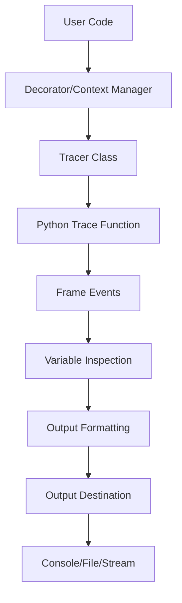

# `PySnooper`

## PySnooper Repository Documentation

### Tree Structure
```
PySnooper/
├── misc/
│   └── generate_authors.py
├── pysnooper/
│   ├── pycompat.py
│   ├── tracer.py
│   ├── utils.py
│   └── variables.py
└── setup.py
```

#### Module Responsibilities:
- **misc/**: Contains utility scripts for project maintenance and metadata generation
- **pysnooper/**: Core debugging and tracing functionality
- **setup.py**: Package configuration and dependency management

### Purpose
PySnooper is a Python library that provides comprehensive function tracing and debugging capabilities. It enables developers to monitor variable states, execution flow, and performance metrics during runtime without requiring traditional breakpoints or debuggers.

**Target Users:**
- Python developers debugging complex functions or programs
- Teams needing to understand data flow through intricate codebases
- Developers seeking non-intrusive debugging solutions
- Performance analysts monitoring execution bottlenecks

**Use Cases:**
- Real-time variable state inspection during function execution
- Monitoring function call hierarchies and return values
- Performance profiling through timing measurements
- Debugging nested function calls and variable interactions
- Understanding program behavior without modifying source code

### Architecture


**Key Abstractions:**
- **Tracer Class**: Central component managing tracing configuration and execution
- **Variable Inspection System**: Specialized classes for different data structures (attributes, keys, indices)
- **Trace Event Processing**: Intercepts Python execution events and generates formatted output
- **Thread Safety**: Uses thread-local storage to maintain separate tracing contexts per thread

### Entry Points
1. **Decorator Interface**: `@pysnooper.snoop()` - Primary way to trace functions or classes
2. **Context Manager**: `with pysnooper.Tracer(...):` - Manual tracing control
3. **Direct API**: `pysnooper.Tracer()` constructor for advanced configuration
4. **Function Interface**: `pysnooper.snoop()` - Factory function creating default Tracer instances

**Usage Patterns:**
- **Simple Decorator**: `@pysnooper.snoop()` - Quick debugging of functions
- **Custom Configuration**: `@pysnooper.snoop(output='/tmp/debug.log')` - Advanced tracing options
- **Manual Context**: `with pysnooper.Tracer(watch=('var1', 'var2')):` - Selective tracing
- **Factory Function**: `snoop = pysnooper.snoop(); snoop(my_func)` - Programmatic usage

### Core Features
1. **Function Tracing** - Monitors execution flow and variable changes in functions
2. **Class Tracing** - Automatically traces all methods in decorated classes
3. **Variable Watching** - Customizable monitoring of specific variables
4. **Timing Information** - Execution duration measurement for functions
5. **Thread Identification** - Support for multi-threaded application debugging
6. **Color Output** - ANSI-colored console output for enhanced readability
7. **Flexible Output** - Supports console, file, or custom stream destinations
8. **Depth Control** - Limit tracing to specific call stack depths
9. **Custom Representations** - Support for custom formatting of object representations
10. **Normalization** - Clean output by removing certain patterns

### Dependencies
- **Standard Library**: `sys`, `inspect`, `time`, `os`, `types`, `collections`, `threading`, `abc`, `re`, `itertools`, `pathlib`, `zipfile`
- **Python Version**: Compatible with Python 3.x (specific version requirements may vary)
- **No External Dependencies**: Pure Python implementation with no third-party requirements

### Configuration
PySnooper supports runtime configuration through Tracer constructor parameters:
- `output`: Destination for trace output (file path, stream, or None for stdout)
- `watch`: Variables to monitor during execution
- `depth`: Maximum frame depth to trace
- `prefix`: Prefix string for trace lines
- `thread_info`: Include thread identification in output
- `max_variable_length`: Maximum character length for variable representations
- `normalize`: Normalize output by removing certain patterns
- `relative_time`: Show relative timestamps instead of absolute times
- `color`: Enable/disable ANSI color codes in output
- `custom_repr`: Custom representation functions for specific object types

### Extension Points
1. **Custom Variable Inspection**: Implement subclasses of `BaseVariable` for custom data structure handling
2. **Custom Output Writers**: Extend `WritableStream` for alternative output destinations
3. **Custom Representation Functions**: Provide custom formatting functions for specific object types
4. **Plugin Architecture**: Through the Tracer's `custom_repr` parameter, users can add custom representation logic

---

## Modules

- [`misc`](misc.md)
- [`pysnooper`](pysnooper.md)

