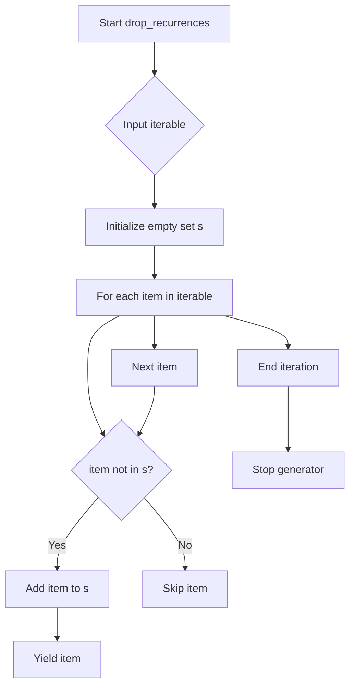

# `generate_authors.py`

## `misc.generate_authors.drop_recurrences` · *function*

## Summary:
Removes duplicate elements from an iterable while preserving the order of first occurrences.

## Description:
A generator function that iterates through an input iterable and yields only the first occurrence of each element, effectively removing duplicates. This implementation maintains insertion order by yielding elements as they are first encountered.

## Args:
    iterable: An iterable object containing elements to deduplicate. Elements must be hashable since they are stored in a set for duplicate detection.

## Returns:
    A generator object that yields unique elements in the order of their first appearance in the input iterable.

## Raises:
    None explicitly raised. However, if the input iterable contains unhashable elements (like lists or dictionaries), a TypeError will be raised when attempting to add them to the set.

## Constraints:
    Precondition: All elements in the input iterable must be hashable to support set operations.
    Postcondition: The returned generator will yield elements in the same order as their first occurrence in the input, with all subsequent duplicates filtered out.

## Side Effects:
    None. This function is pure and has no side effects beyond consuming the input iterable and producing a generator.

## Control Flow:


## Examples:
```python
# Basic usage with a list
items = [1, 2, 3, 2, 4, 1, 5]
unique_items = list(drop_recurrences(items))
# Result: [1, 2, 3, 4, 5]

# Usage with strings
names = ["Alice", "Bob", "Alice", "Charlie", "Bob"]
unique_names = list(drop_recurrences(names))
# Result: ["Alice", "Bob", "Charlie"]

# Usage with generator expression
numbers = (x for x in [1, 1, 2, 2, 3, 3])
unique_numbers = list(drop_recurrences(numbers))
# Result: [1, 2, 3]
```

## `misc.generate_authors.iterate_authors_by_chronological_order` · *function*

## Summary:
Returns a sequence of unique author names from Git commit history in chronological order.

## Description:
Processes Git repository commit history for a specified branch to extract and deduplicate author names. The function executes a Git log command with specific formatting options to retrieve commit timestamps, author names, and email addresses, then filters and orders the results chronologically.

This function is extracted from the main processing logic to encapsulate Git interaction and author name extraction, separating concerns between Git operations and data processing. It ensures that duplicate author entries are removed while maintaining chronological ordering of commits.

## Args:
    branch (str): The Git branch name or reference to process. This parameter determines which commit history to analyze.

## Returns:
    generator[str]: A generator yielding unique author names in chronological order (oldest to newest commits). Each author name is a string. Returns an empty generator if no commits exist for the branch.

## Raises:
    subprocess.SubprocessError: When the Git command fails to execute properly (e.g., invalid branch name, Git not installed, repository not accessible).

## Constraints:
    Precondition: The Git repository must be accessible and the specified branch must exist.
    Postcondition: The returned generator will yield author names in chronological order with duplicates removed. Empty branches or non-existent branches will result in empty generators.

## Side Effects:
    Executes a subprocess call to run Git commands. May produce Git-related errors if repository is not accessible or branch doesn't exist.

## Control Flow:
```mermaid
flowchart TD
    A[Start iterate_authors_by_chronological_order] --> B[Execute git log command]
    B --> C{Git command successful?}
    C -->|Yes| D[Decode stdout to UTF-8]
    D --> E[Split output into lines]
    E --> F[Filter empty lines]
    F --> G[For each line: strip and split by ";", take index [1]]
    G --> H{Line valid format?}
    H -->|Yes| I[Pass to drop_recurrences]
    H -->|No| J[Skip line]
    I --> K[Return deduplicated generator]
    C -->|No| L[Raise subprocess exception]
```

## Examples:
```python
# Basic usage
authors = iterate_authors_by_chronological_order("main")
for author in authors:
    print(author)

# Convert to list if needed
author_list = list(iterate_authors_by_chronological_order("develop"))

# Handle empty results
authors = list(iterate_authors_by_chronological_order("nonexistent"))
if not authors:
    print("No authors found")
```

## `misc.generate_authors.print_authors` · *function*

## Summary:
Prints unique author names from Git commit history in chronological order to standard output.

## Description:
Processes Git repository commit history for a specified branch to extract unique author names and prints them sequentially to standard output, one author per line. This function serves as a utility for displaying author information from Git history in a clean, chronological format.

The function delegates Git interaction and author extraction to `iterate_authors_by_chronological_order()` and handles the presentation layer by writing formatted output to stdout. This separation of concerns allows for easier testing and maintenance of Git-specific logic versus output formatting logic.

## Args:
    branch (str): The Git branch name or reference to process. This parameter determines which commit history to analyze for author information.

## Returns:
    None: This function does not return any value. It produces output via standard output.

## Raises:
    subprocess.SubprocessError: When the underlying `iterate_authors_by_chronological_order` function encounters Git command execution failures (e.g., invalid branch name, Git not installed, repository not accessible).

## Constraints:
    Precondition: The Git repository must be accessible and the specified branch must exist.
    Postcondition: Author names are printed to stdout in chronological order with duplicates removed.

## Side Effects:
    Writes to standard output (sys.stdout.buffer) with encoded author names followed by newlines.
    Executes a subprocess call through the `iterate_authors_by_chronological_order` dependency.

## Control Flow:
```mermaid
flowchart TD
    A[Start print_authors] --> B[Call iterate_authors_by_chronological_order(branch)]
    B --> C{Authors available?}
    C -->|Yes| D[For each author in generator]
    D --> E[Encode author to bytes]
    E --> F[Write author bytes to stdout]
    F --> G[Write newline byte to stdout]
    G --> H[Continue to next author]
    C -->|No| I[End function]
```

## Examples:
```python
# Print authors from main branch
print_authors("main")

# Print authors from develop branch
print_authors("develop")

# Typical usage in command-line context
# $ python script.py | print_authors("main")
```

