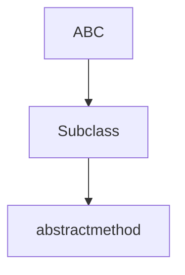
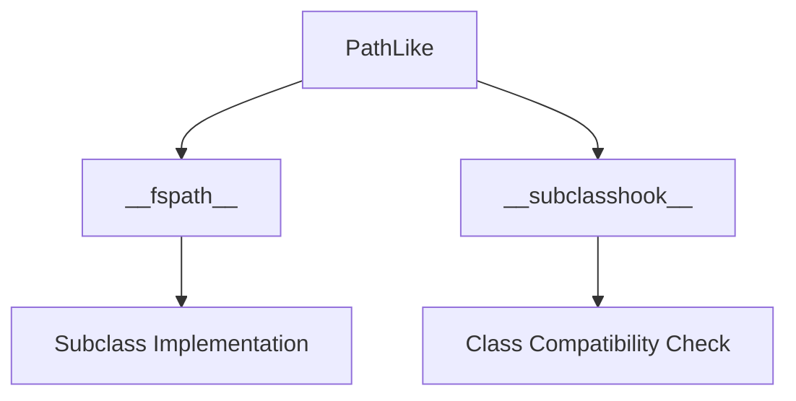

# `pycompat.py`

## `pysnooper.pycompat.ABC` · *class*

## Summary:
Abstract base class metaclass compatibility wrapper for cross-version Python support.

## Description:
This class provides a compatibility layer for creating abstract base classes in Python environments where the standard `abc.ABC` class may not be available. By setting `__metaclass__ = abc.ABCMeta`, it enables the abstract base class functionality that was previously achieved through metaclass specification in older Python versions.

This class is designed to be inherited from by other classes that wish to define abstract methods or properties. It serves as a bridge between older Python versions (prior to 3.4) and newer ones where `abc.ABC` is the preferred approach.

## State:
- No instance attributes: This is a base class with no instance state
- No constructor parameters: The class doesn't accept initialization arguments
- Class invariant: All subclasses that inherit from this class will have ABCMeta metaclass behavior

## Lifecycle:
- Creation: Instantiate by inheriting from this class (e.g., `class MyAbstractClass(ABC):`)
- Usage: Subclasses can define abstract methods using the `@abstractmethod` decorator from the `abc` module
- Destruction: No special cleanup required; follows normal Python object lifecycle

## Method Map:


## Raises:
- TypeError: When attempting to instantiate a subclass that has unimplemented abstract methods
- AttributeError: When trying to use abstract methods without proper implementation in subclasses

## Example:
```python
from pysnooper.pycompat import ABC
import abc

class MyAbstractClass(ABC):
    @abc.abstractmethod
    def my_method(self):
        pass

# This would raise TypeError if instantiated
# obj = MyAbstractClass()  # TypeError: Can't instantiate abstract class

class ConcreteClass(MyAbstractClass):
    def my_method(self):
        return "Implemented"

# This works fine
obj = ConcreteClass()  # Works correctly
```

## `pysnooper.pycompat.PathLike` · *class*

## Summary:
Abstract base class defining the filesystem path protocol interface for path-like objects.

## Description:
The PathLike class implements the abstract base class interface for objects that can be converted to filesystem paths. It follows Python's filesystem path protocol (PEP 519) and provides the `__fspath__` method that must be implemented by subclasses. The class also defines a `__subclasshook__` mechanism that allows automatic recognition of compatible classes that implement either `__fspath__` or have an `open` method with 'path' in their name.

This abstraction enables code to work with various path-like objects (strings, pathlib.Path, custom path implementations) in a uniform way without requiring explicit type checking.

## State:
- `__fspath__`: Abstract method that must be implemented by subclasses to return a string representation of the path
- `__subclasshook__`: Class method that determines if a class qualifies as a PathLike subclass

## Lifecycle:
- Creation: Instances cannot be created directly due to the ABC inheritance; subclasses must implement `__fspath__`
- Usage: Subclasses should implement `__fspath__` to return appropriate string representations of paths
- Destruction: No special cleanup required; follows standard Python object lifecycle

## Method Map:


## Raises:
- `NotImplementedError`: Raised by the abstract `__fspath__` method when called directly on the abstract class

## Example:
```python
from pysnooper.pycompat import PathLike
from abc import abstractmethod

class MyPath(PathLike):
    def __init__(self, path_string):
        self.path_string = path_string
    
    def __fspath__(self):
        return self.path_string

# Usage
my_path = MyPath("/home/user/file.txt")
path_str = my_path.__fspath__()  # Returns "/home/user/file.txt"
```

### `pysnooper.pycompat.PathLike.__fspath__` · *method*

## Summary:
Returns a string representation of the path-like object, implementing the os.PathLike protocol.

## Description:
This method is part of the os.PathLike protocol introduced in Python 3.6. It must be implemented by subclasses to return a string representation of the path. The method is called automatically when the object is used in contexts where a path string is expected, such as when passed to functions like `os.open()` or `pathlib.Path()`. This abstract method ensures that all implementations of PathLike provide a consistent interface for path operations.

## Args:
    self: The PathLike instance

## Returns:
    str: A string representation of the path

## Raises:
    NotImplementedError: Always raised by the base implementation, indicating that subclasses must override this method

## State Changes:
    Attributes READ: None
    Attributes WRITTEN: None

## Constraints:
    Preconditions: The object must be a subclass of PathLike that implements this method
    Postconditions: The returned value must be a string representing a valid path

## Side Effects:
    None

### `pysnooper.pycompat.PathLike.__subclasshook__` · *method*

## Summary:
Determines if a class should be considered a subclass of PathLike based on the presence of specific methods or naming conventions.

## Description:
This method implements the `__subclasshook__` protocol for the PathLike abstract base class. It defines the criteria that Python uses to determine whether a given class should be considered a subclass of PathLike without requiring explicit inheritance. This allows duck-typing compatibility with PathLike objects.

The method returns True if either:
1. The subclass implements the `__fspath__` method (standard for path-like objects)
2. OR the subclass has an `open` method and its class name contains 'path' (case-insensitive)

This approach enables flexible duck-typing while maintaining the benefits of ABC behavior in type checking and static analysis tools.

## Args:
    cls (type): The PathLike class itself (passed automatically by Python's ABC mechanism)
    subclass (type): The class being tested for subclass relationship with PathLike

## Returns:
    bool: True if the subclass should be considered a PathLike subclass, False otherwise

## Raises:
    None: This method does not raise exceptions

## State Changes:
    Attributes READ: None - this method only reads class attributes and does not modify any instance or class state
    Attributes WRITTEN: None

## Constraints:
    Preconditions: 
    - cls must be the PathLike class (or its subclass)
    - subclass must be a class object (not an instance)
    
    Postconditions:
    - Returns a boolean value indicating subclass relationship
    - Does not alter the state of either cls or subclass

## Side Effects:
    None: This method performs only attribute checks and does not cause any I/O operations, external service calls, or mutations to objects outside the method scope

## `pysnooper.pycompat.timedelta_format` · *function*

## Summary:
Formats a timedelta object as an ISO time string with microsecond precision.

## Description:
Converts a timedelta object into a time string representation using an ISO format with microsecond precision. This function operates by adding the timedelta to datetime.min and extracting the resulting time component, then formatting it with time_isoformat.

## Args:
    timedelta (datetime.timedelta): A timedelta object to be formatted as a time string.

## Returns:
    str: An ISO-formatted time string with microsecond precision representing the time component derived from (datetime.min + timedelta).

## Raises:
    AttributeError: If datetime_module or time_isoformat are not accessible in the current scope.

## Constraints:
    Preconditions: 
    - The timedelta parameter must be a valid datetime.timedelta object
    - The datetime module must be accessible in scope (expected to be the standard library datetime module)
    - The time_isoformat function must be accessible in scope (expected to be a time formatting function)
    
    Postconditions:
    - Returns a string representation of the time component in ISO format with microsecond precision

## Side Effects:
    None

## Control Flow:
```mermaid
flowchart TD
    A[Start timedelta_format] --> B[Add timedelta to datetime.min]
    B --> C[Extract time component]
    C --> D[Format time with time_isoformat(timespec='microseconds')]
    D --> E[Return formatted string]
```

## Examples:
    # Basic usage
    >>> import datetime
    >>> td = datetime.timedelta(hours=1, minutes=30, seconds=45, microseconds=123456)
    >>> timedelta_format(td)
    '01:30:45.123456'

## `pysnooper.pycompat.timedelta_parse` · *function*

## Summary:
Parses a time duration string into a datetime.timedelta object.

## Description:
Converts a string representation of time duration (in format hours:minutes:seconds.microseconds) into a datetime.timedelta object. This function handles parsing of time strings that may contain either dots or colons as separators between time components. Note: The implementation contains a bug referencing 'datetime_module' instead of 'datetime', which should be corrected to 'datetime.timedelta'. The function expects exactly 4 numeric components in the format HH:MM:SS.ffffff or HH.MM.SS.ffffff.

## Args:
    s (str): Time duration string in format hours:minutes:seconds.microseconds or hours.minutes.seconds.microseconds. Must contain exactly 4 numeric components separated by colons or dots. Each component must be convertible to an integer.

## Returns:
    datetime.timedelta: A timedelta object representing the parsed time duration with hours, minutes, seconds, and microseconds components.

## Raises:
    ValueError: When the input string cannot be parsed into exactly 4 components, or when any component cannot be converted to an integer
    TypeError: When the input string is not a string type or when the split operation fails

## Constraints:
    Precondition: Input string must contain exactly 4 numeric components separated by colons or dots
    Postcondition: Returns a valid datetime.timedelta object with the specified time components

## Side Effects:
    None

## Control Flow:
```mermaid
flowchart TD
    A[Input string s] --> B{Replace dots with colons}
    B --> C{Split by colon}
    C --> D{Validate 4 components}
    D -- Fail --> E[Raise ValueError]
    D -- Success --> F{Map each component to int}
    F --> G{Unpack into hours, minutes, seconds, microseconds}
    G --> H[Create datetime.timedelta(hours=hours, minutes=minutes, seconds=seconds, microseconds=microseconds)]
    H --> I[Return timedelta object]
```

## Examples:
    >>> timedelta_parse("1:30:45.123456")
    datetime.timedelta(hours=1, minutes=30, seconds=45, microseconds=123456)
    
    >>> timedelta_parse("2.15.30.999999")
    datetime.timedelta(hours=2, minutes=15, seconds=30, microseconds=999999)
    
    >>> timedelta_parse("0:0:0.0")
    datetime.timedelta(0)

